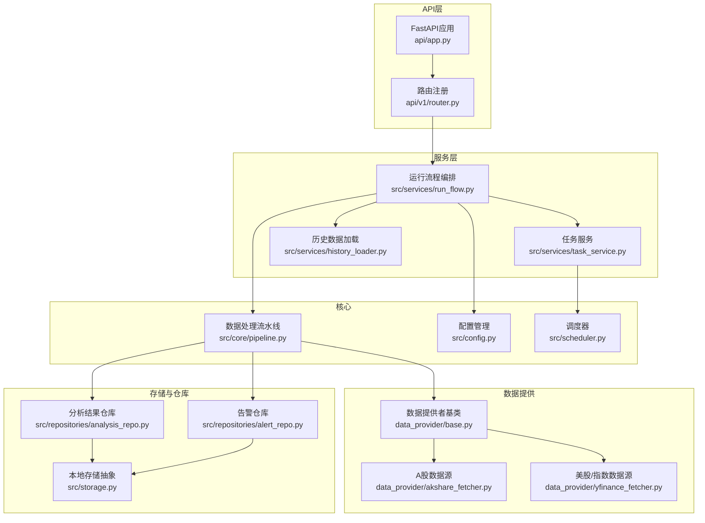
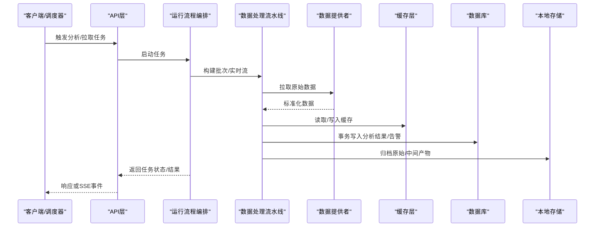
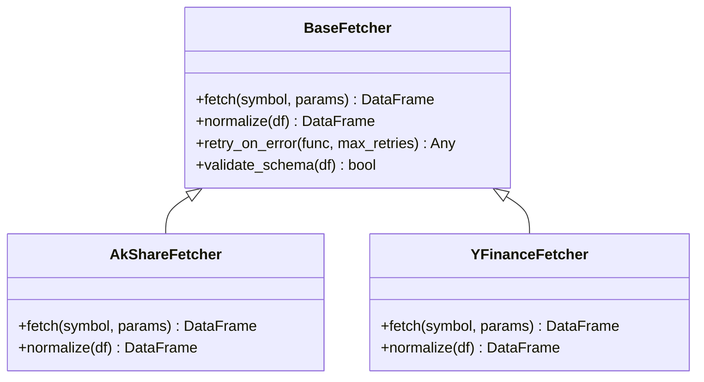
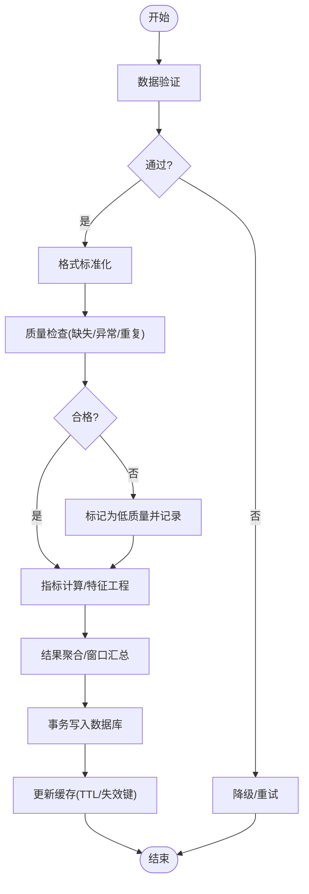
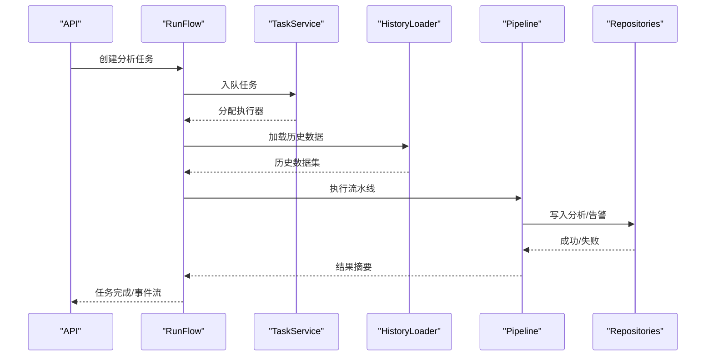
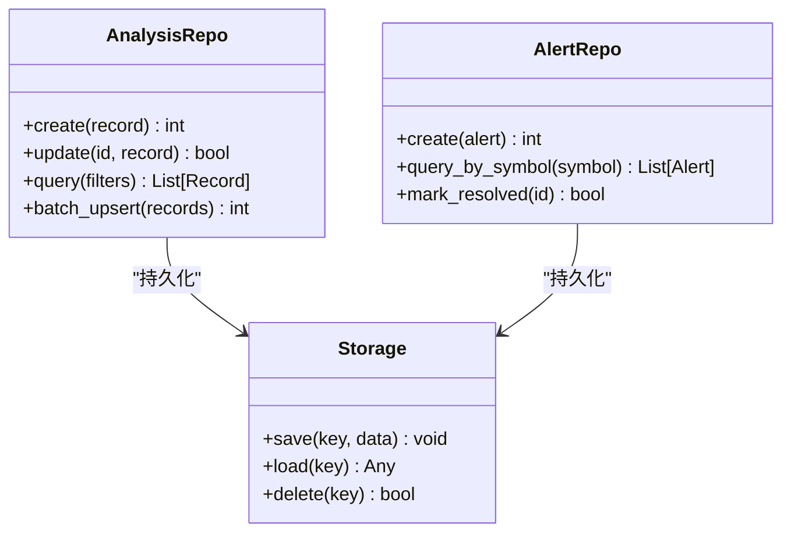
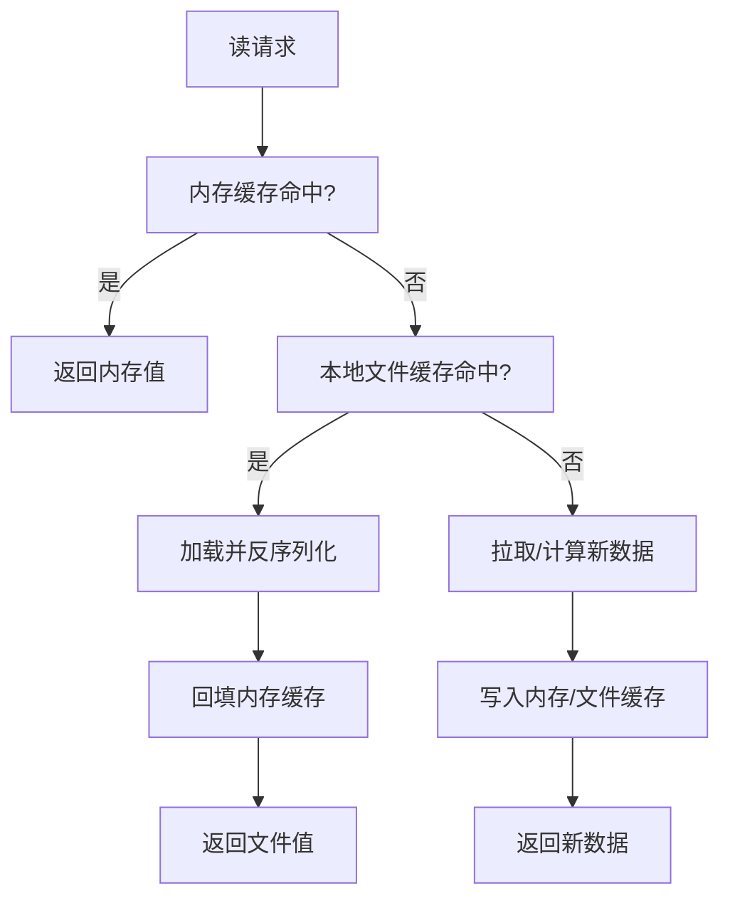
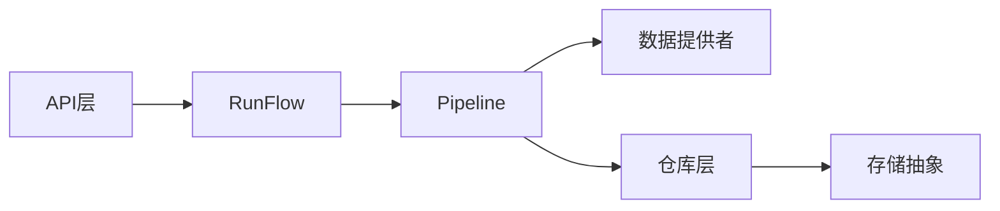

# 数据流设计

<cite>
**本文引用的文件**   
- [main.py](file://main.py)
- [server.py](file://server.py)
- [api/app.py](file://api/app.py)
- [api/v1/router.py](file://api/v1/router.py)
- [src/config.py](file://src/config.py)
- [src/scheduler.py](file://src/scheduler.py)
- [src/core/pipeline.py](file://src/core/pipeline.py)
- [data_provider/base.py](file://data_provider/base.py)
- [data_provider/akshare_fetcher.py](file://data_provider/akshare_fetcher.py)
- [data_provider/yfinance_fetcher.py](file://data_provider/yfinance_fetcher.py)
- [src/repositories/analysis_repo.py](file://src/repositories/analysis_repo.py)
- [src/repositories/alert_repo.py](file://src/repositories/alert_repo.py)
- [src/services/run_flow.py](file://src/services/run_flow.py)
- [src/services/task_service.py](file://src/services/task_service.py)
- [src/services/history_loader.py](file://src/services/history_loader.py)
- [src/storage.py](file://src/storage.py)
- [src/logging_config.py](file://src/logging_config.py)
- [tests/test_pipeline_daily_market_context.py](file://tests/test_pipeline_daily_market_context.py)
- [tests/test_pipeline_realtime_indicators.py](file://tests/test_pipeline_realtime_indicators.py)
</cite>

## 目录
1. [简介](#简介)
2. [项目结构](#项目结构)
3. [核心组件](#核心组件)
4. [架构总览](#架构总览)
5. [详细组件分析](#详细组件分析)
6. [依赖关系分析](#依赖关系分析)
7. [性能考量](#性能考量)
8. [故障排查指南](#故障排查指南)
9. [结论](#结论)
10. [附录](#附录)

## 简介
本文件面向Daily Stock Analysis系统的数据流设计，覆盖从数据获取、实时与批量处理、转换管道、缓存策略到数据库操作的全链路。文档通过架构图与时序图展示关键业务场景的数据流转，并提供监控与调试方法，帮助读者快速理解并优化系统的数据处理能力。

## 项目结构
系统采用分层模块化组织：API层暴露REST接口；服务层编排业务流程；数据提供者负责多源数据采集；仓库层封装持久化；核心流水线协调批处理与实时任务；配置与调度支撑定时任务与运行参数。

图表来源
- [api/app.py](file://api/app.py)
- [api/v1/router.py](file://api/v1/router.py)
- [src/services/run_flow.py](file://src/services/run_flow.py)
- [src/services/task_service.py](file://src/services/task_service.py)
- [src/services/history_loader.py](file://src/services/history_loader.py)
- [src/core/pipeline.py](file://src/core/pipeline.py)
- [data_provider/base.py](file://data_provider/base.py)
- [data_provider/akshare_fetcher.py](file://data_provider/akshare_fetcher.py)
- [data_provider/yfinance_fetcher.py](file://data_provider/yfinance_fetcher.py)
- [src/repositories/analysis_repo.py](file://src/repositories/analysis_repo.py)
- [src/repositories/alert_repo.py](file://src/repositories/alert_repo.py)
- [src/storage.py](file://src/storage.py)
- [src/config.py](file://src/config.py)
- [src/scheduler.py](file://src/scheduler.py)

章节来源
- [main.py](file://main.py)
- [server.py](file://server.py)
- [api/app.py](file://api/app.py)
- [api/v1/router.py](file://api/v1/router.py)

## 核心组件
- 数据提供者（Fetcher）：统一抽象不同市场与数据源，实现拉取、标准化与错误重试。
- 处理流水线（Pipeline）：串联数据验证、格式标准化、质量检查、指标计算与结果落库。
- 服务编排（Run Flow / Task Service）：协调批处理与实时任务，管理并发与队列。
- 仓库（Repository）：ORM映射与事务边界，封装查询与写入逻辑。
- 存储（Storage）：本地文件/对象存储抽象，支持缓存与归档。
- 配置与调度（Config / Scheduler）：集中配置项与定时任务触发。

章节来源
- [data_provider/base.py](file://data_provider/base.py)
- [src/core/pipeline.py](file://src/core/pipeline.py)
- [src/services/run_flow.py](file://src/services/run_flow.py)
- [src/services/task_service.py](file://src/services/task_service.py)
- [src/repositories/analysis_repo.py](file://src/repositories/analysis_repo.py)
- [src/repositories/alert_repo.py](file://src/repositories/alert_repo.py)
- [src/storage.py](file://src/storage.py)
- [src/config.py](file://src/config.py)
- [src/scheduler.py](file://src/scheduler.py)

## 架构总览
整体数据流分为三条主线：
- 实时数据流：行情/资金流向等高频数据进入流水线，进行增量校验与指标更新，最终写回缓存与数据库。
- 批量数据处理：按日/周/月窗口拉取历史数据，执行清洗、对齐、聚合与报告生成。
- 缓存策略：多级缓存（内存/本地文件/远程），结合失效键与TTL保障一致性。

图表来源
- [api/app.py](file://api/app.py)
- [src/services/run_flow.py](file://src/services/run_flow.py)
- [src/core/pipeline.py](file://src/core/pipeline.py)
- [data_provider/base.py](file://data_provider/base.py)
- [src/repositories/analysis_repo.py](file://src/repositories/analysis_repo.py)
- [src/repositories/alert_repo.py](file://src/repositories/alert_repo.py)
- [src/storage.py](file://src/storage.py)

## 详细组件分析

### 数据提供者（Fetcher）
- 统一接口：定义拉取、分页、重试、异常分类与元数据附加。
- 多源适配：A股（如AkShare）、美股/指数（如yFinance）等具体实现。
- 标准化输出：字段名、时间戳、币种/单位统一，便于下游流水线消费。

图表来源
- [data_provider/base.py](file://data_provider/base.py)
- [data_provider/akshare_fetcher.py](file://data_provider/akshare_fetcher.py)
- [data_provider/yfinance_fetcher.py](file://data_provider/yfinance_fetcher.py)

章节来源
- [data_provider/base.py](file://data_provider/base.py)
- [data_provider/akshare_fetcher.py](file://data_provider/akshare_fetcher.py)
- [data_provider/yfinance_fetcher.py](file://data_provider/yfinance_fetcher.py)

### 数据处理流水线（Pipeline）
- 阶段划分：数据验证→格式标准化→质量检查→指标计算→结果聚合→落库。
- 容错与降级：单阶段失败可重试或跳过，记录诊断信息，保证整体任务不中断。
- 并行与批大小：按标的/时间窗分片，控制并发度与内存占用。

图表来源
- [src/core/pipeline.py](file://src/core/pipeline.py)

章节来源
- [src/core/pipeline.py](file://src/core/pipeline.py)

### 运行流程与服务编排（Run Flow / Task Service）
- 运行流程：根据请求或调度事件构建任务上下文，选择数据源与策略，驱动流水线。
- 任务服务：维护任务队列、优先级、重试与取消，支持异步执行与进度上报。
- 历史加载：按需拉取历史数据，合并增量，确保窗口一致性。

图表来源
- [src/services/run_flow.py](file://src/services/run_flow.py)
- [src/services/task_service.py](file://src/services/task_service.py)
- [src/services/history_loader.py](file://src/services/history_loader.py)
- [src/repositories/analysis_repo.py](file://src/repositories/analysis_repo.py)
- [src/repositories/alert_repo.py](file://src/repositories/alert_repo.py)

章节来源
- [src/services/run_flow.py](file://src/services/run_flow.py)
- [src/services/task_service.py](file://src/services/task_service.py)
- [src/services/history_loader.py](file://src/services/history_loader.py)

### 仓库与数据库操作（Repositories）
- ORM映射：实体模型与表结构对应，约束与索引明确。
- 事务管理：写入操作包裹在事务中，失败回滚，保证一致性。
- 查询优化：分页、过滤、预加载关联数据，减少N+1问题。

图表来源
- [src/repositories/analysis_repo.py](file://src/repositories/analysis_repo.py)
- [src/repositories/alert_repo.py](file://src/repositories/alert_repo.py)
- [src/storage.py](file://src/storage.py)

章节来源
- [src/repositories/analysis_repo.py](file://src/repositories/analysis_repo.py)
- [src/repositories/alert_repo.py](file://src/repositories/alert_repo.py)
- [src/storage.py](file://src/storage.py)

### 缓存层设计
- 多级缓存：内存字典（热点指标）→本地文件（中间产物/快照）→外部缓存（可选）。
- 失效机制：基于键前缀与版本戳，支持按标的/日期维度失效；TTL过期自动清理。
- 性能优化：读写分离、懒加载、批量写入、压缩与序列化优化。

图表来源
- [src/storage.py](file://src/storage.py)
- [src/core/pipeline.py](file://src/core/pipeline.py)

章节来源
- [src/storage.py](file://src/storage.py)
- [src/core/pipeline.py](file://src/core/pipeline.py)

### 配置与调度（Config / Scheduler）
- 配置管理：环境变量与配置文件合并，运行时热更新。
- 调度器：定时触发每日/盘中任务，支持延迟与重试策略。

章节来源
- [src/config.py](file://src/config.py)
- [src/scheduler.py](file://src/scheduler.py)

## 依赖关系分析
- API层依赖服务编排，服务编排依赖流水线与仓库，流水线依赖数据提供者与存储。
- 数据提供者之间解耦，通过统一接口被流水线调用。
- 仓库与存储抽象降低耦合，便于替换后端。

图表来源
- [api/app.py](file://api/app.py)
- [src/services/run_flow.py](file://src/services/run_flow.py)
- [src/core/pipeline.py](file://src/core/pipeline.py)
- [data_provider/base.py](file://data_provider/base.py)
- [src/repositories/analysis_repo.py](file://src/repositories/analysis_repo.py)
- [src/storage.py](file://src/storage.py)

章节来源
- [api/app.py](file://api/app.py)
- [src/services/run_flow.py](file://src/services/run_flow.py)
- [src/core/pipeline.py](file://src/core/pipeline.py)
- [data_provider/base.py](file://data_provider/base.py)
- [src/repositories/analysis_repo.py](file://src/repositories/analysis_repo.py)
- [src/storage.py](file://src/storage.py)

## 性能考量
- 批处理分片：按标的/时间窗切分，限制并发度避免资源争用。
- 缓存命中率：热点指标常驻内存，冷数据落盘，减少IO。
- 事务粒度：尽量缩小事务范围，批量提交降低锁竞争。
- 网络重试：指数退避与熔断，避免雪崩。
- 序列化：使用高效序列化格式，压缩大对象。

## 故障排查指南
- 日志采集：统一日志配置，区分级别与模块，结构化输出便于检索。
- 监控指标：任务耗时、成功率、缓存命中率、队列长度、数据库连接池。
- 常见问题：
  - 数据源超时/限流：检查重试策略与熔断开关。
  - 数据质量异常：查看质量检查日志与低质量标记。
  - 缓存不一致：核对失效键与TTL设置。
  - 事务冲突：观察锁等待与死锁日志。
- 调试方法：启用详细日志、回放任务、隔离数据源、逐步断点流水线阶段。

章节来源
- [src/logging_config.py](file://src/logging_config.py)
- [tests/test_pipeline_daily_market_context.py](file://tests/test_pipeline_daily_market_context.py)
- [tests/test_pipeline_realtime_indicators.py](file://tests/test_pipeline_realtime_indicators.py)

## 结论
Daily Stock Analysis系统通过清晰的分层与解耦的组件设计，实现了从多源数据获取到分析结果落库的完整数据流。流水线与缓存策略保障了高吞吐与低延迟，仓库与事务确保了数据一致性。配合完善的日志与监控，可在复杂生产环境中稳定运行并持续优化。

## 附录
- 关键测试用例参考：
  - 日线市场上下文流水线行为验证
  - 实时指标流水线行为验证
- 部署与环境：
  - 容器化与入口脚本
  - 依赖管理与环境检查

章节来源
- [tests/test_pipeline_daily_market_context.py](file://tests/test_pipeline_daily_market_context.py)
- [tests/test_pipeline_realtime_indicators.py](file://tests/test_pipeline_realtime_indicators.py)
- [docker/Dockerfile](file://docker/Dockerfile)
- [docker/docker-compose.yml](file://docker/docker-compose.yml)
- [docker/entrypoint.sh](file://docker/entrypoint.sh)