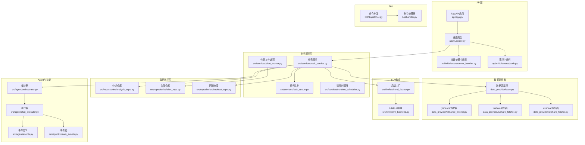
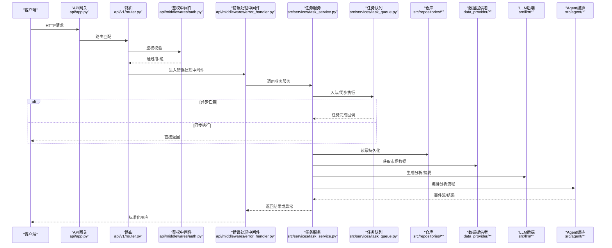
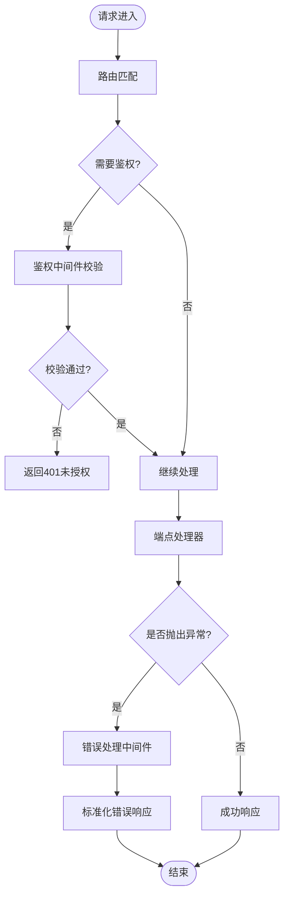
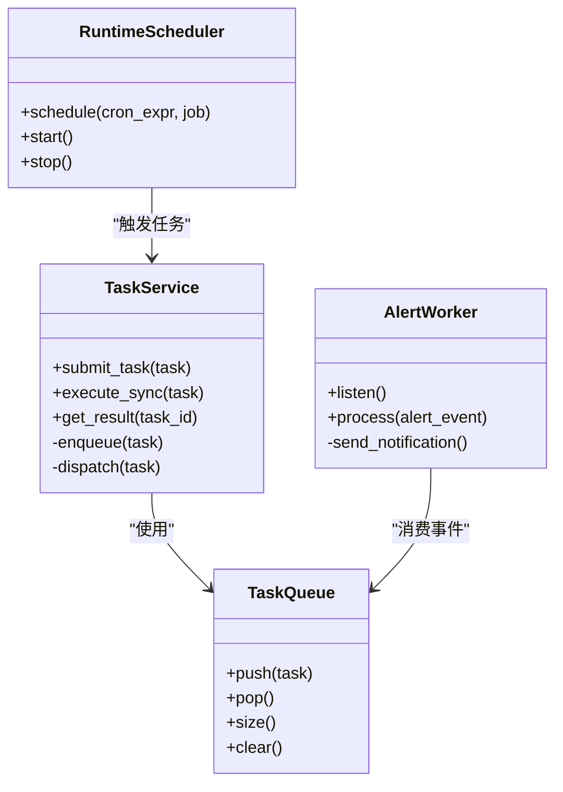
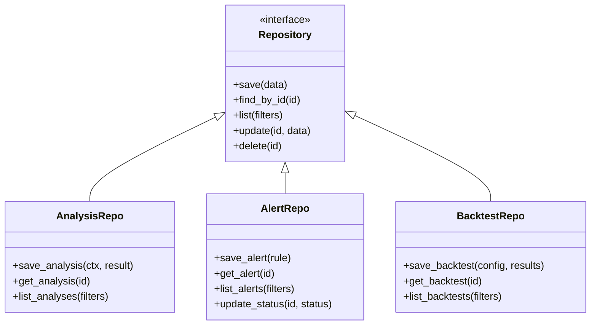
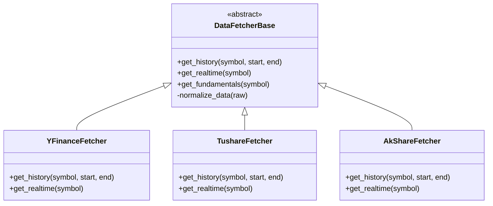
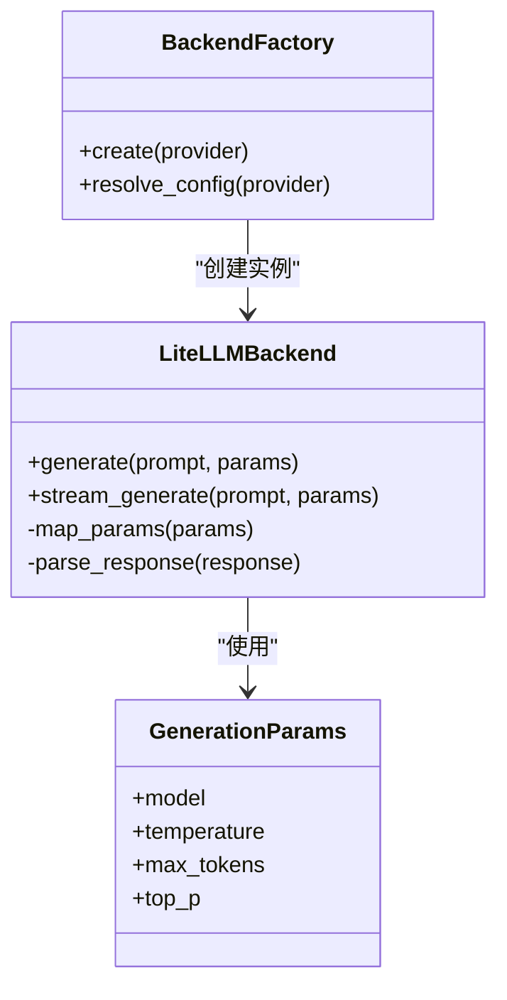
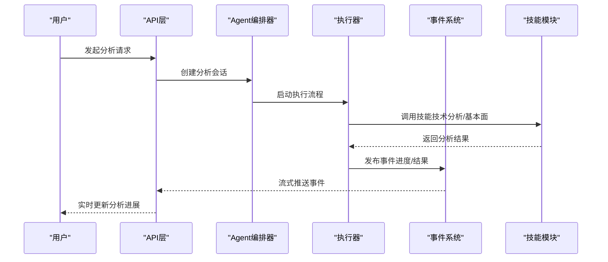
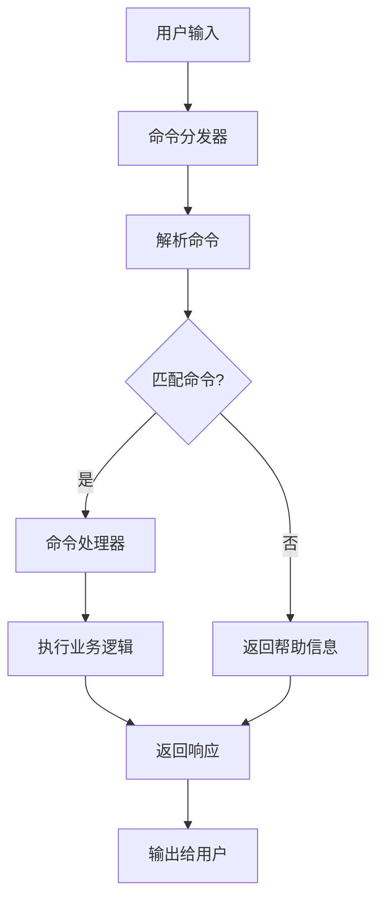
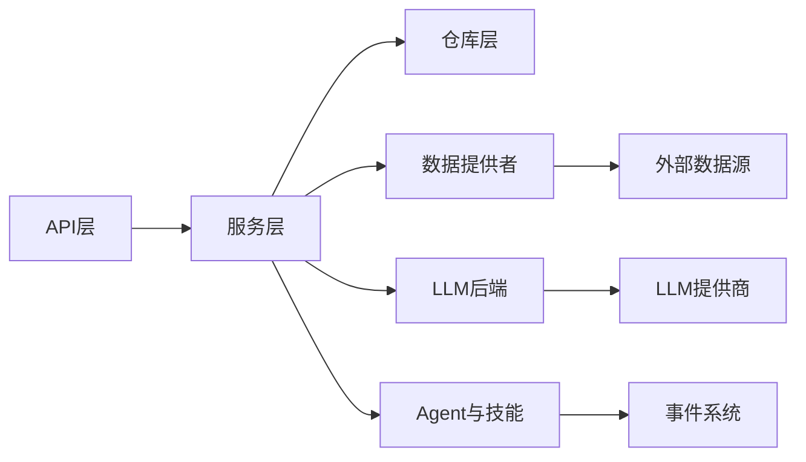

# 架构设计

<cite>
**本文引用的文件**   
- [main.py](file://main.py)
- [server.py](file://server.py)
- [api/app.py](file://api/app.py)
- [api/v1/router.py](file://api/v1/router.py)
- [api/v1/endpoints/analysis.py](file://api/v1/endpoints/analysis.py)
- [api/v1/endpoints/alerts.py](file://api/v1/endpoints/alerts.py)
- [api/v1/endpoints/backtest.py](file://api/v1/endpoints/backtest.py)
- [api/v1/endpoints/auth.py](file://api/v1/endpoints/auth.py)
- [api/v1/endpoints/stocks.py](file://api/v1/endpoints/stocks.py)
- [api/v1/endpoints/history.py](file://api/v1/endpoints/history.py)
- [api/v1/endpoints/system_config.py](file://api/v1/endpoints/system_config.py)
- [api/v1/endpoints/usage.py](file://api/v1/endpoints/usage.py)
- [api/middlewares/error_handler.py](file://api/middlewares/error_handler.py)
- [api/middlewares/auth.py](file://api/middlewares/auth.py)
- [src/config.py](file://src/config.py)
- [src/logging_config.py](file://src/logging_config.py)
- [src/scheduler.py](file://src/scheduler.py)
- [src/services/task_service.py](file://src/services/task_service.py)
- [src/services/task_queue.py](file://src/services/task_queue.py)
- [src/services/alert_worker.py](file://src/services/alert_worker.py)
- [src/services/runtime_scheduler.py](file://src/services/runtime_scheduler.py)
- [src/repositories/analysis_repo.py](file://src/repositories/analysis_repo.py)
- [src/repositories/alert_repo.py](file://src/repositories/alert_repo.py)
- [src/repositories/backtest_repo.py](file://src/repositories/backtest_repo.py)
- [data_provider/base.py](file://data_provider/base.py)
- [data_provider/yfinance_fetcher.py](file://data_provider/yfinance_fetcher.py)
- [data_provider/tushare_fetcher.py](file://data_provider/tushare_fetcher.py)
- [data_provider/akshare_fetcher.py](file://data_provider/akshare_fetcher.py)
- [src/llm/backend_factory.py](file://src/llm/backend_factory.py)
- [src/llm/litellm_backend.py](file://src/llm/litellm_backend.py)
- [src/agent/orchestrator.py](file://src/agent/orchestrator.py)
- [src/agent/chat_executor.py](file://src/agent/chat_executor.py)
- [src/agent/events.py](file://src/agent/events.py)
- [src/agent/stream_events.py](file://src/agent/stream_events.py)
- [bot/dispatcher.py](file://bot/dispatcher.py)
- [bot/handler.py](file://bot/handler.py)
- [docker/docker-compose.yml](file://docker/docker-compose.yml)
</cite>

## 目录
1. [引言](#引言)
2. [项目结构](#项目结构)
3. [核心组件](#核心组件)
4. [架构总览](#架构总览)
5. [详细组件分析](#详细组件分析)
6. [依赖关系分析](#依赖关系分析)
7. [性能考量](#性能考量)
8. [故障排查指南](#故障排查指南)
9. [结论](#结论)
10. [附录](#附录)

## 引言
本架构设计文档面向Daily Stock Analysis系统，目标是清晰阐述系统的高层架构模式与关键设计决策。系统采用分层架构、微服务风格与事件驱动相结合的设计：API网关层负责路由与鉴权；业务服务层编排分析、回测、告警等能力；数据访问层通过适配器统一对接多数据源；外部系统集成（LLM、通知渠道、行情数据）以插件化方式接入。文档同时覆盖跨领域关注点（安全认证、日志、错误处理、监控告警），并给出扩展性设计（插件化、适配器、技能框架）与可视化图示，帮助读者快速理解数据流向与消息传递机制。

## 项目结构
系统按功能域与层次进行组织：
- API层：FastAPI应用、路由、中间件、请求/响应Schema
- 业务服务层：任务调度、工作队列、分析/回测/告警服务
- 数据访问层：仓库抽象与持久化实现
- 数据提供者：多数据源适配器（yfinance、tushare、akshare等）
- LLM集成：后端工厂与适配（LiteLLM）
- Agent与技能：编排器、执行器、事件流、技能引擎
- Bot：命令分发与平台适配
- 配置与基础设施：配置管理、日志、调度、Docker编排

**图表来源** 
- [api/app.py](file://api/app.py)
- [api/v1/router.py](file://api/v1/router.py)
- [api/middlewares/error_handler.py](file://api/middlewares/error_handler.py)
- [api/middlewares/auth.py](file://api/middlewares/auth.py)
- [src/services/task_service.py](file://src/services/task_service.py)
- [src/services/task_queue.py](file://src/services/task_queue.py)
- [src/services/alert_worker.py](file://src/services/alert_worker.py)
- [src/services/runtime_scheduler.py](file://src/services/runtime_scheduler.py)
- [src/repositories/analysis_repo.py](file://src/repositories/analysis_repo.py)
- [src/repositories/alert_repo.py](file://src/repositories/alert_repo.py)
- [src/repositories/backtest_repo.py](file://src/repositories/backtest_repo.py)
- [data_provider/base.py](file://data_provider/base.py)
- [data_provider/yfinance_fetcher.py](file://data_provider/yfinance_fetcher.py)
- [data_provider/tushare_fetcher.py](file://data_provider/tushare_fetcher.py)
- [data_provider/akshare_fetcher.py](file://data_provider/akshare_fetcher.py)
- [src/llm/backend_factory.py](file://src/llm/backend_factory.py)
- [src/llm/litellm_backend.py](file://src/llm/litellm_backend.py)
- [src/agent/orchestrator.py](file://src/agent/orchestrator.py)
- [src/agent/chat_executor.py](file://src/agent/chat_executor.py)
- [src/agent/events.py](file://src/agent/events.py)
- [src/agent/stream_events.py](file://src/agent/stream_events.py)
- [bot/dispatcher.py](file://bot/dispatcher.py)
- [bot/handler.py](file://bot/handler.py)

**章节来源**
- [main.py](file://main.py)
- [server.py](file://server.py)
- [api/app.py](file://api/app.py)
- [api/v1/router.py](file://api/v1/router.py)

## 核心组件
- API网关层：基于FastAPI的HTTP入口，集中路由与中间件（鉴权、错误处理）。提供分析、回测、历史、股票、系统配置、使用统计等接口。
- 业务服务层：任务服务与工作队列解耦请求与耗时操作；告警工作进程异步处理告警规则与通知；运行时调度器协调定时任务。
- 数据访问层：仓库抽象封装持久化逻辑，支持分析结果、告警、回测数据的存取。
- 数据提供者：统一的适配器接口，屏蔽不同数据源的差异，支持yfinance、tushare、akshare等。
- LLM集成：后端工厂根据配置选择具体LLM后端（如LiteLLM），统一生成参数与响应处理。
- Agent与技能：编排器协调多个Agent与工具，执行器驱动对话与工具调用，事件系统贯穿流式输出与状态更新。
- Bot：命令分发与平台适配，将用户指令转化为系统内部任务或查询。

**章节来源**
- [api/v1/endpoints/analysis.py](file://api/v1/endpoints/analysis.py)
- [api/v1/endpoints/backtest.py](file://api/v1/endpoints/backtest.py)
- [api/v1/endpoints/alerts.py](file://api/v1/endpoints/alerts.py)
- [api/v1/endpoints/auth.py](file://api/v1/endpoints/auth.py)
- [api/v1/endpoints/stocks.py](file://api/v1/endpoints/stocks.py)
- [api/v1/endpoints/history.py](file://api/v1/endpoints/history.py)
- [api/v1/endpoints/system_config.py](file://api/v1/endpoints/system_config.py)
- [api/v1/endpoints/usage.py](file://api/v1/endpoints/usage.py)
- [src/services/task_service.py](file://src/services/task_service.py)
- [src/services/task_queue.py](file://src/services/task_queue.py)
- [src/services/alert_worker.py](file://src/services/alert_worker.py)
- [src/services/runtime_scheduler.py](file://src/services/runtime_scheduler.py)
- [src/repositories/analysis_repo.py](file://src/repositories/analysis_repo.py)
- [src/repositories/alert_repo.py](file://src/repositories/alert_repo.py)
- [src/repositories/backtest_repo.py](file://src/repositories/backtest_repo.py)
- [data_provider/base.py](file://data_provider/base.py)
- [data_provider/yfinance_fetcher.py](file://data_provider/yfinance_fetcher.py)
- [data_provider/tushare_fetcher.py](file://data_provider/tushare_fetcher.py)
- [data_provider/akshare_fetcher.py](file://data_provider/akshare_fetcher.py)
- [src/llm/backend_factory.py](file://src/llm/backend_factory.py)
- [src/llm/litellm_backend.py](file://src/llm/litellm_backend.py)
- [src/agent/orchestrator.py](file://src/agent/orchestrator.py)
- [src/agent/chat_executor.py](file://src/agent/chat_executor.py)
- [src/agent/events.py](file://src/agent/events.py)
- [src/agent/stream_events.py](file://src/agent/stream_events.py)
- [bot/dispatcher.py](file://bot/dispatcher.py)
- [bot/handler.py](file://bot/handler.py)

## 架构总览
系统采用分层+微服务风格+事件驱动的混合架构：
- 分层架构：API层→服务层→数据访问层→外部数据源/LLM
- 微服务风格：通过进程/线程隔离的任务队列与工作进程，提升可扩展性与容错性
- 事件驱动：Agent事件流、告警事件、任务完成事件驱动后续处理

**图表来源** 
- [api/app.py](file://api/app.py)
- [api/v1/router.py](file://api/v1/router.py)
- [api/middlewares/auth.py](file://api/middlewares/auth.py)
- [api/middlewares/error_handler.py](file://api/middlewares/error_handler.py)
- [src/services/task_service.py](file://src/services/task_service.py)
- [src/services/task_queue.py](file://src/services/task_queue.py)
- [src/repositories/analysis_repo.py](file://src/repositories/analysis_repo.py)
- [data_provider/base.py](file://data_provider/base.py)
- [src/llm/backend_factory.py](file://src/llm/backend_factory.py)
- [src/agent/orchestrator.py](file://src/agent/orchestrator.py)

**章节来源**
- [docker/docker-compose.yml](file://docker/docker-compose.yml)

## 详细组件分析

### API网关层
- FastAPI应用集中注册路由与中间件，统一错误处理与CORS配置
- 鉴权中间件对受保护端点进行令牌校验与权限控制
- 错误处理中间件捕获异常并返回标准化错误响应

**图表来源** 
- [api/app.py](file://api/app.py)
- [api/v1/router.py](file://api/v1/router.py)
- [api/middlewares/auth.py](file://api/middlewares/auth.py)
- [api/middlewares/error_handler.py](file://api/middlewares/error_handler.py)

**章节来源**
- [api/v1/endpoints/analysis.py](file://api/v1/endpoints/analysis.py)
- [api/v1/endpoints/alerts.py](file://api/v1/endpoints/alerts.py)
- [api/v1/endpoints/backtest.py](file://api/v1/endpoints/backtest.py)
- [api/v1/endpoints/auth.py](file://api/v1/endpoints/auth.py)
- [api/v1/endpoints/stocks.py](file://api/v1/endpoints/stocks.py)
- [api/v1/endpoints/history.py](file://api/v1/endpoints/history.py)
- [api/v1/endpoints/system_config.py](file://api/v1/endpoints/system_config.py)
- [api/v1/endpoints/usage.py](file://api/v1/endpoints/usage.py)

### 业务服务层
- 任务服务：协调分析、回测、告警等业务流程，支持同步与异步执行
- 任务队列：缓冲高并发请求，削峰填谷，保证稳定性
- 告警工作进程：独立进程监听告警事件，执行策略与通知发送
- 运行时调度器：管理定时任务（如每日市场分析、指标刷新）

**图表来源** 
- [src/services/task_service.py](file://src/services/task_service.py)
- [src/services/task_queue.py](file://src/services/task_queue.py)
- [src/services/alert_worker.py](file://src/services/alert_worker.py)
- [src/services/runtime_scheduler.py](file://src/services/runtime_scheduler.py)

**章节来源**
- [src/services/task_service.py](file://src/services/task_service.py)
- [src/services/task_queue.py](file://src/services/task_queue.py)
- [src/services/alert_worker.py](file://src/services/alert_worker.py)
- [src/services/runtime_scheduler.py](file://src/services/runtime_scheduler.py)

### 数据访问层
- 仓库抽象：定义统一的CRUD接口，屏蔽存储细节
- 分析仓库：保存分析上下文、结果与元数据
- 告警仓库：持久化告警规则、触发记录与状态
- 回测仓库：存储回测配置、交易记录与绩效指标

**图表来源** 
- [src/repositories/analysis_repo.py](file://src/repositories/analysis_repo.py)
- [src/repositories/alert_repo.py](file://src/repositories/alert_repo.py)
- [src/repositories/backtest_repo.py](file://src/repositories/backtest_repo.py)

**章节来源**
- [src/repositories/analysis_repo.py](file://src/repositories/analysis_repo.py)
- [src/repositories/alert_repo.py](file://src/repositories/alert_repo.py)
- [src/repositories/backtest_repo.py](file://src/repositories/backtest_repo.py)

### 数据提供者（适配器模式）
- 基类定义统一接口：获取历史行情、实时报价、基本面数据等
- 具体适配器实现不同数据源协议与数据格式转换
- 支持多数据源并行获取与降级策略

**图表来源** 
- [data_provider/base.py](file://data_provider/base.py)
- [data_provider/yfinance_fetcher.py](file://data_provider/yfinance_fetcher.py)
- [data_provider/tushare_fetcher.py](file://data_provider/tushare_fetcher.py)
- [data_provider/akshare_fetcher.py](file://data_provider/akshare_fetcher.py)

**章节来源**
- [data_provider/base.py](file://data_provider/base.py)
- [data_provider/yfinance_fetcher.py](file://data_provider/yfinance_fetcher.py)
- [data_provider/tushare_fetcher.py](file://data_provider/tushare_fetcher.py)
- [data_provider/akshare_fetcher.py](file://data_provider/akshare_fetcher.py)

### LLM集成（插件化）
- 后端工厂：根据配置动态选择LLM后端（如LiteLLM）
- LiteLLM后端：统一调用多种LLM提供商，处理参数映射与响应解析
- 支持缓存与重试机制，提升稳定性与成本可控性

**图表来源** 
- [src/llm/backend_factory.py](file://src/llm/backend_factory.py)
- [src/llm/litellm_backend.py](file://src/llm/litellm_backend.py)

**章节来源**
- [src/llm/backend_factory.py](file://src/llm/backend_factory.py)
- [src/llm/litellm_backend.py](file://src/llm/litellm_backend.py)

### Agent与技能（事件驱动）
- 编排器：协调多个Agent（技术面、基本面、风险等）与工具调用
- 执行器：驱动对话流程，处理工具返回与状态更新
- 事件系统：定义结构化事件，支持流式输出与实时反馈
- 技能框架：可插拔的技能模块，支持自定义分析与合成逻辑

**图表来源** 
- [src/agent/orchestrator.py](file://src/agent/orchestrator.py)
- [src/agent/chat_executor.py](file://src/agent/chat_executor.py)
- [src/agent/events.py](file://src/agent/events.py)
- [src/agent/stream_events.py](file://src/agent/stream_events.py)

**章节来源**
- [src/agent/orchestrator.py](file://src/agent/orchestrator.py)
- [src/agent/chat_executor.py](file://src/agent/chat_executor.py)
- [src/agent/events.py](file://src/agent/events.py)
- [src/agent/stream_events.py](file://src/agent/stream_events.py)

### Bot集成（命令驱动）
- 命令分发器：解析用户输入，路由到对应处理器
- 命令处理器：实现具体命令逻辑（分析、查询、设置等）
- 支持多平台（钉钉、飞书、Discord等）适配

**图表来源** 
- [bot/dispatcher.py](file://bot/dispatcher.py)
- [bot/handler.py](file://bot/handler.py)

**章节来源**
- [bot/dispatcher.py](file://bot/dispatcher.py)
- [bot/handler.py](file://bot/handler.py)

## 依赖关系分析
系统依赖关系清晰分层，低耦合高内聚：
- API层依赖服务层接口，不直接访问数据源
- 服务层依赖仓库抽象与数据提供者接口
- 数据提供者实现具体协议，被服务层透明调用
- LLM后端通过工厂注入，支持热切换
- Agent与技能通过事件总线松耦合通信

**图表来源** 
- [api/app.py](file://api/app.py)
- [src/services/task_service.py](file://src/services/task_service.py)
- [src/repositories/analysis_repo.py](file://src/repositories/analysis_repo.py)
- [data_provider/base.py](file://data_provider/base.py)
- [src/llm/backend_factory.py](file://src/llm/backend_factory.py)
- [src/agent/orchestrator.py](file://src/agent/orchestrator.py)

**章节来源**
- [src/config.py](file://src/config.py)
- [src/logging_config.py](file://src/logging_config.py)
- [src/scheduler.py](file://src/scheduler.py)

## 性能考量
- 异步处理：FastAPI原生支持异步，结合任务队列实现非阻塞I/O
- 缓存策略：数据提供者层可实现本地缓存与分布式缓存（Redis）
- 连接池：数据库连接池与HTTP连接池优化资源复用
- 批处理：批量获取数据与批量写入减少网络开销
- 限流与熔断：对外部API调用实施限流与熔断保护
- 水平扩展：无状态服务设计，支持容器化部署与自动扩缩容

[本节为通用性能指导，无需特定文件引用]

## 故障排查指南
- 日志记录：统一日志配置，包含请求ID、用户信息、错误堆栈
- 错误处理：中间件捕获异常，返回标准化错误码与消息
- 监控告警：关键指标采集（QPS、延迟、错误率），阈值告警
- 健康检查：提供健康检查端点，用于负载均衡与健康探测
- 调试工具：提供诊断端点与日志收集脚本

**章节来源**
- [src/logging_config.py](file://src/logging_config.py)
- [api/middlewares/error_handler.py](file://api/middlewares/error_handler.py)

## 结论
Daily Stock Analysis系统通过分层架构、微服务风格与事件驱动设计，实现了高内聚、低耦合、易扩展的分析平台。FastAPI的选择提供了高性能的异步处理能力，任务队列与工作进程提升了系统的稳定性与可扩展性。插件化的数据提供者与LLM后端支持灵活的数据源与模型切换，技能框架增强了分析能力的可定制性。通过完善的日志、错误处理与监控告警机制，系统具备良好的可观测性与可维护性。

[本节为总结性内容，无需特定文件引用]

## 附录
- 部署配置：参考Docker Compose文件了解服务编排与依赖关系
- 配置管理：环境变量与配置文件统一管理
- 测试策略：单元测试、集成测试与端到端测试覆盖关键路径

**章节来源**
- [docker/docker-compose.yml](file://docker/docker-compose.yml)
- [src/config.py](file://src/config.py)