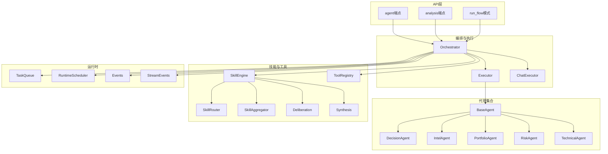
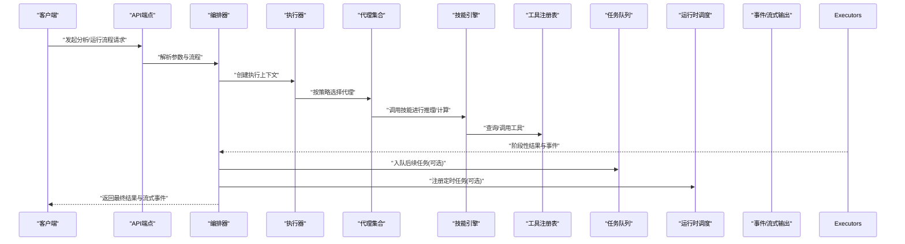
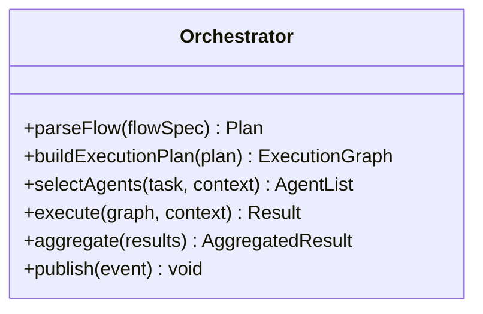
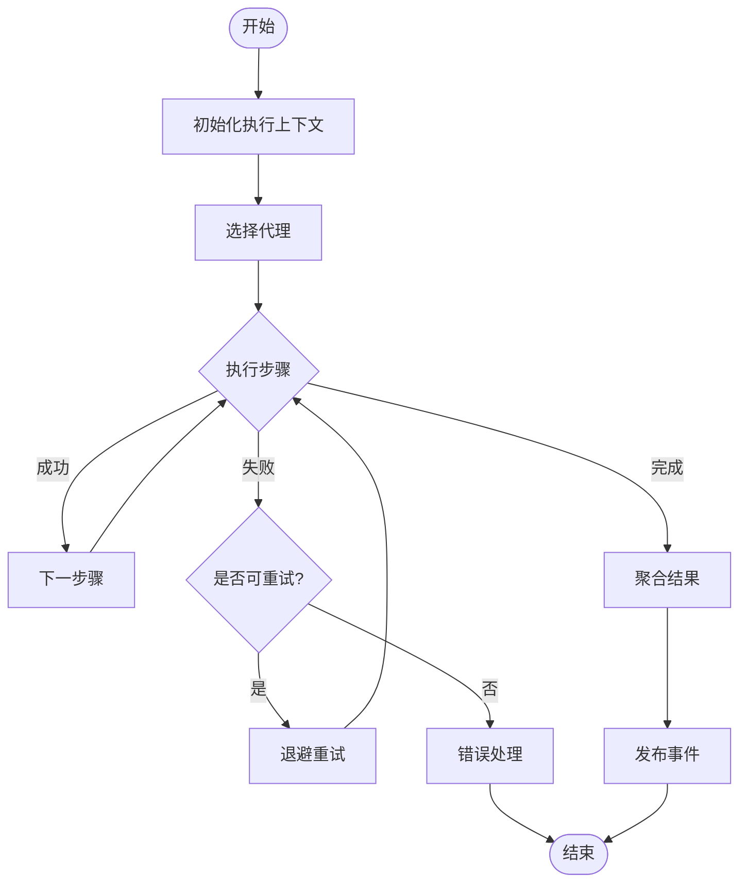
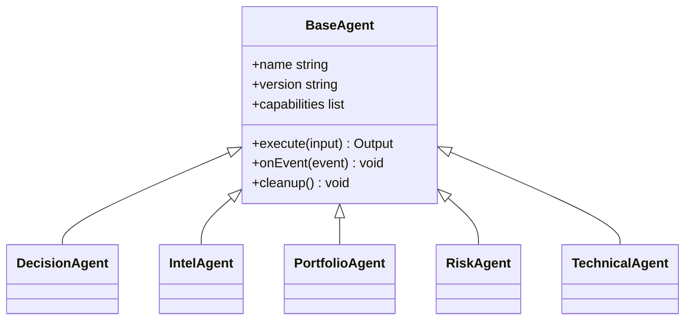
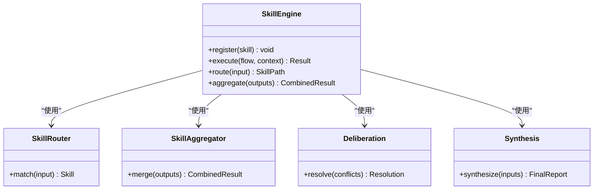
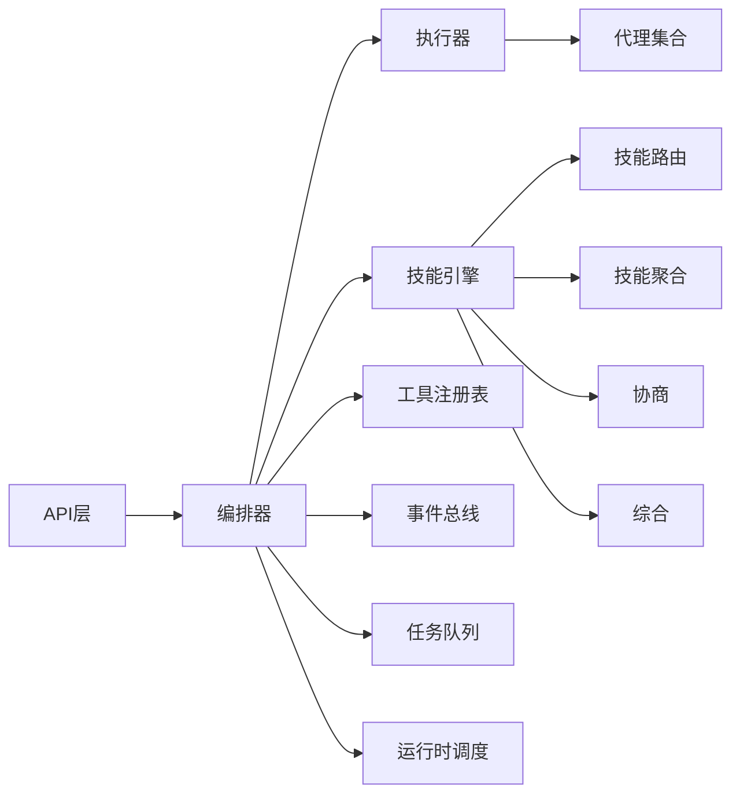

# 代理编排器

<cite>
**本文档引用的文件**   
- [src/agent/orchestrator.py](file://src/agent/orchestrator.py)
- [src/agent/factory.py](file://src/agent/factory.py)
- [src/agent/executor.py](file://src/agent/executor.py)
- [src/agent/chat_executor.py](file://src/agent/chat_executor.py)
- [src/agent/events.py](file://src/agent/events.py)
- [src/agent/stream_events.py](file://src/agent/stream_events.py)
- [src/agent/protocols.py](file://src/agent/protocols.py)
- [src/agent/agents/base_agent.py](file://src/agent/agents/base_agent.py)
- [src/agent/agents/decision_agent.py](file://src/agent/agents/decision_agent.py)
- [src/agent/agents/intel_agent.py](file://src/agent/agents/intel_agent.py)
- [src/agent/agents/portfolio_agent.py](file://src/agent/agents/portfolio_agent.py)
- [src/agent/agents/risk_agent.py](file://src/agent/agents/risk_agent.py)
- [src/agent/agents/technical_agent.py](file://src/agent/agents/technical_agent.py)
- [src/agent/skills/engine.py](file://src/agent/skills/engine.py)
- [src/agent/skills/router.py](file://src/agent/skills/router.py)
- [src/agent/skills/aggregator.py](file://src/agent/skills/aggregator.py)
- [src/agent/skills/deliberation.py](file://src/agent/skills/deliberation.py)
- [src/agent/skills/synthesis.py](file://src/agent/skills/synthesis.py)
- [src/agent/tools/registry.py](file://src/agent/tools/registry.py)
- [src/services/task_queue.py](file://src/services/task_queue.py)
- [src/services/runtime_scheduler.py](file://src/services/runtime_scheduler.py)
- [api/v1/endpoints/agent.py](file://api/v1/endpoints/agent.py)
- [api/v1/endpoints/analysis.py](file://api/v1/endpoints/analysis.py)
- [api/v1/schemas/run_flow.py](file://api/v1/schemas/run_flow.py)
- [tests/test_multi_agent.py](file://tests/test_multi_agent.py)
- [tests/test_agent_orchestrator_sniper_fallback.py](file://tests/test_agent_orchestrator_sniper_fallback.py)
</cite>

## 目录
1. [简介](#简介)
2. [项目结构](#项目结构)
3. [核心组件](#核心组件)
4. [架构总览](#架构总览)
5. [详细组件分析](#详细组件分析)
6. [依赖关系分析](#依赖关系分析)
7. [性能考量](#性能考量)
8. [故障排查指南](#故障排查指南)
9. [结论](#结论)
10. [附录](#附录)

## 简介
本文件面向Daily Stock Analysis系统的“代理编排器”，系统性阐述多代理协作架构与实现要点，包括：
- 代理生命周期管理、任务分配策略与结果聚合机制
- 代理注册与发现机制（动态加载、版本管理与兼容性检查）
- 协调算法（负载均衡、冲突解决、一致性保证）
- 通信协议（消息格式、事件驱动模式、异步处理）
- 代理开发、编排配置与监控集成的具体示例路径
- 调试工具与性能优化指南

## 项目结构
围绕代理编排器的关键代码分布在以下模块：
- 编排与执行：orchestrator、executor、chat_executor
- 代理基类与具体代理：agents/*
- 技能引擎与路由：skills/*
- 工具注册表：tools/registry
- 事件与流式输出：events、stream_events
- 运行时调度与任务队列：services/runtime_scheduler、services/task_queue
- API层暴露：api/v1/endpoints/agent.py、api/v1/endpoints/analysis.py、schemas/run_flow.py
- 测试用例：tests/test_multi_agent.py、tests/test_agent_orchestrator_sniper_fallback.py

图表来源
- [src/agent/orchestrator.py](file://src/agent/orchestrator.py)
- [src/agent/executor.py](file://src/agent/executor.py)
- [src/agent/chat_executor.py](file://src/agent/chat_executor.py)
- [src/agent/agents/base_agent.py](file://src/agent/agents/base_agent.py)
- [src/agent/skills/engine.py](file://src/agent/skills/engine.py)
- [src/agent/tools/registry.py](file://src/agent/tools/registry.py)
- [src/services/task_queue.py](file://src/services/task_queue.py)
- [src/services/runtime_scheduler.py](file://src/services/runtime_scheduler.py)
- [api/v1/endpoints/agent.py](file://api/v1/endpoints/agent.py)
- [api/v1/endpoints/analysis.py](file://api/v1/endpoints/analysis.py)
- [api/v1/schemas/run_flow.py](file://api/v1/schemas/run_flow.py)

章节来源
- [src/agent/orchestrator.py](file://src/agent/orchestrator.py)
- [src/agent/factory.py](file://src/agent/factory.py)
- [src/agent/executor.py](file://src/agent/executor.py)
- [src/agent/chat_executor.py](file://src/agent/chat_executor.py)
- [src/agent/events.py](file://src/agent/events.py)
- [src/agent/stream_events.py](file://src/agent/stream_events.py)
- [src/agent/protocols.py](file://src/agent/protocols.py)
- [src/agent/agents/base_agent.py](file://src/agent/agents/base_agent.py)
- [src/agent/skills/engine.py](file://src/agent/skills/engine.py)
- [src/agent/tools/registry.py](file://src/agent/tools/registry.py)
- [src/services/task_queue.py](file://src/services/task_queue.py)
- [src/services/runtime_scheduler.py](file://src/services/runtime_scheduler.py)
- [api/v1/endpoints/agent.py](file://api/v1/endpoints/agent.py)
- [api/v1/endpoints/analysis.py](file://api/v1/endpoints/analysis.py)
- [api/v1/schemas/run_flow.py](file://api/v1/schemas/run_flow.py)

## 核心组件
- Orchestrator（编排器）：负责解析运行流程、选择并实例化代理、协调技能执行、分发任务、聚合结果与事件。
- Executor（执行器）：承载具体的代理执行逻辑，支持同步/异步执行、重试与超时控制。
- ChatExecutor（聊天执行器）：面向对话场景的编排执行，支持上下文保持与增量输出。
- BaseAgent与具体代理：定义统一接口与能力边界，决策、情报、组合、风控、技术面等代理各司其职。
- SkillEngine（技能引擎）：封装技能编排、路由、聚合、协商与综合输出。
- ToolRegistry（工具注册表）：集中管理可用工具，提供动态发现与调用。
- TaskQueue与RuntimeScheduler：任务队列与定时调度，支撑异步与周期性任务。
- Events与StreamEvents：事件总线与流式事件输出，贯穿全链路可观测性。

章节来源
- [src/agent/orchestrator.py](file://src/agent/orchestrator.py)
- [src/agent/executor.py](file://src/agent/executor.py)
- [src/agent/chat_executor.py](file://src/agent/chat_executor.py)
- [src/agent/agents/base_agent.py](file://src/agent/agents/base_agent.py)
- [src/agent/skills/engine.py](file://src/agent/skills/engine.py)
- [src/agent/tools/registry.py](file://src/agent/tools/registry.py)
- [src/services/task_queue.py](file://src/services/task_queue.py)
- [src/services/runtime_scheduler.py](file://src/services/runtime_scheduler.py)
- [src/agent/events.py](file://src/agent/events.py)
- [src/agent/stream_events.py](file://src/agent/stream_events.py)

## 架构总览
系统采用“API -> 编排器 -> 执行器 -> 代理/技能 -> 工具/数据源”的分层架构，通过事件与流式输出实现高内聚、低耦合与可观测性。

图表来源
- [api/v1/endpoints/agent.py](file://api/v1/endpoints/agent.py)
- [api/v1/endpoints/analysis.py](file://api/v1/endpoints/analysis.py)
- [src/agent/orchestrator.py](file://src/agent/orchestrator.py)
- [src/agent/executor.py](file://src/agent/executor.py)
- [src/agent/skills/engine.py](file://src/agent/skills/engine.py)
- [src/agent/tools/registry.py](file://src/agent/tools/registry.py)
- [src/services/task_queue.py](file://src/services/task_queue.py)
- [src/services/runtime_scheduler.py](file://src/services/runtime_scheduler.py)
- [src/agent/events.py](file://src/agent/events.py)
- [src/agent/stream_events.py](file://src/agent/stream_events.py)

## 详细组件分析

### 编排器（Orchestrator）
- 职责：解析运行流程、构建执行图、选择代理与技能、协调并发与顺序、聚合结果、发布事件。
- 关键点：
  - 流程解析：根据输入模式（如run_flow）生成执行计划。
  - 代理选择：基于任务类型、权重与负载状态选择最优代理。
  - 结果聚合：对并行结果进行合并、去重与一致性校验。
  - 事件驱动：将中间状态以事件形式推送给上层或前端。

图表来源
- [src/agent/orchestrator.py](file://src/agent/orchestrator.py)

章节来源
- [src/agent/orchestrator.py](file://src/agent/orchestrator.py)

### 执行器（Executor）与聊天执行器（ChatExecutor）
- Executor：负责代理调用的生命周期管理（启动、执行、回收）、重试、超时、错误恢复。
- ChatExecutor：在对话上下文中维护会话状态，支持增量输出与中断恢复。

图表来源
- [src/agent/executor.py](file://src/agent/executor.py)
- [src/agent/chat_executor.py](file://src/agent/chat_executor.py)

章节来源
- [src/agent/executor.py](file://src/agent/executor.py)
- [src/agent/chat_executor.py](file://src/agent/chat_executor.py)

### 代理基类与具体代理
- BaseAgent：定义统一的接口（输入/输出、工具访问、事件发布、资源清理）。
- DecisionAgent：交易决策相关推理与信号生成。
- IntelAgent：市场情报收集与摘要。
- PortfolioAgent：投资组合分析与再平衡建议。
- RiskAgent：风险评估与风控规则应用。
- TechnicalAgent：技术指标计算与技术形态识别。

图表来源
- [src/agent/agents/base_agent.py](file://src/agent/agents/base_agent.py)
- [src/agent/agents/decision_agent.py](file://src/agent/agents/decision_agent.py)
- [src/agent/agents/intel_agent.py](file://src/agent/agents/intel_agent.py)
- [src/agent/agents/portfolio_agent.py](file://src/agent/agents/portfolio_agent.py)
- [src/agent/agents/risk_agent.py](file://src/agent/agents/risk_agent.py)
- [src/agent/agents/technical_agent.py](file://src/agent/agents/technical_agent.py)

章节来源
- [src/agent/agents/base_agent.py](file://src/agent/agents/base_agent.py)
- [src/agent/agents/decision_agent.py](file://src/agent/agents/decision_agent.py)
- [src/agent/agents/intel_agent.py](file://src/agent/agents/intel_agent.py)
- [src/agent/agents/portfolio_agent.py](file://src/agent/agents/portfolio_agent.py)
- [src/agent/agents/risk_agent.py](file://src/agent/agents/risk_agent.py)
- [src/agent/agents/technical_agent.py](file://src/agent/agents/technical_agent.py)

### 技能引擎（SkillEngine）与路由/聚合/协商/综合
- SkillEngine：编排技能执行序列，支持条件分支与并行执行。
- SkillRouter：根据输入特征选择合适技能。
- SkillAggregator：合并多个技能输出，支持加权与投票。
- Deliberation：多技能协商与分歧处理。
- Synthesis：生成最终综合报告或决策建议。

图表来源
- [src/agent/skills/engine.py](file://src/agent/skills/engine.py)
- [src/agent/skills/router.py](file://src/agent/skills/router.py)
- [src/agent/skills/aggregator.py](file://src/agent/skills/aggregator.py)
- [src/agent/skills/deliberation.py](file://src/agent/skills/deliberation.py)
- [src/agent/skills/synthesis.py](file://src/agent/skills/synthesis.py)

章节来源
- [src/agent/skills/engine.py](file://src/agent/skills/engine.py)
- [src/agent/skills/router.py](file://src/agent/skills/router.py)
- [src/agent/skills/aggregator.py](file://src/agent/skills/aggregator.py)
- [src/agent/skills/deliberation.py](file://src/agent/skills/deliberation.py)
- [src/agent/skills/synthesis.py](file://src/agent/skills/synthesis.py)

### 工具注册表（ToolRegistry）
- 功能：集中注册与发现工具，支持版本与兼容性检查，提供安全调用入口。
- 特性：动态加载、元数据描述、权限控制、限流与熔断。

章节来源
- [src/agent/tools/registry.py](file://src/agent/tools/registry.py)

### 事件与流式输出（Events & StreamEvents）
- Events：内部事件总线，用于解耦各组件间的状态传播。
- StreamEvents：面向前端的流式事件输出，支持SSE或WebSocket。

章节来源
- [src/agent/events.py](file://src/agent/events.py)
- [src/agent/stream_events.py](file://src/agent/stream_events.py)

### 运行时调度与任务队列（RuntimeScheduler & TaskQueue）
- RuntimeScheduler：周期性与延迟任务调度，支持分布式扩展。
- TaskQueue：异步任务队列，支持优先级、重试与死信队列。

章节来源
- [src/services/runtime_scheduler.py](file://src/services/runtime_scheduler.py)
- [src/services/task_queue.py](file://src/services/task_queue.py)

### API层与运行流程模式（Run Flow）
- agent端点：暴露代理相关的操作（注册、查询、执行）。
- analysis端点：暴露分析工作流入口。
- run_flow模式：定义结构化流程规范，便于编排器解析与执行。

章节来源
- [api/v1/endpoints/agent.py](file://api/v1/endpoints/agent.py)
- [api/v1/endpoints/analysis.py](file://api/v1/endpoints/analysis.py)
- [api/v1/schemas/run_flow.py](file://api/v1/schemas/run_flow.py)

## 依赖关系分析
- 编排器依赖执行器、技能引擎、工具注册表、事件总线、任务队列与调度器。
- 代理依赖工具与技能；技能之间通过路由与聚合协作。
- API层仅依赖编排器与模式定义，保持薄接口。

图表来源
- [src/agent/orchestrator.py](file://src/agent/orchestrator.py)
- [src/agent/executor.py](file://src/agent/executor.py)
- [src/agent/skills/engine.py](file://src/agent/skills/engine.py)
- [src/agent/tools/registry.py](file://src/agent/tools/registry.py)
- [src/agent/events.py](file://src/agent/events.py)
- [src/services/task_queue.py](file://src/services/task_queue.py)
- [src/services/runtime_scheduler.py](file://src/services/runtime_scheduler.py)

章节来源
- [src/agent/orchestrator.py](file://src/agent/orchestrator.py)
- [src/agent/executor.py](file://src/agent/executor.py)
- [src/agent/skills/engine.py](file://src/agent/skills/engine.py)
- [src/agent/tools/registry.py](file://src/agent/tools/registry.py)
- [src/agent/events.py](file://src/agent/events.py)
- [src/services/task_queue.py](file://src/services/task_queue.py)
- [src/services/runtime_scheduler.py](file://src/services/runtime_scheduler.py)

## 性能考量
- 并发与并行：合理划分可并行执行的代理与技能，避免热点瓶颈。
- 缓存与预取：对常用数据（行情、指标）进行缓存与预取，降低IO开销。
- 流式输出：减少首字节延迟，提升用户体验。
- 资源隔离：为不同代理设置独立线程/进程池，防止相互干扰。
- 背压与限流：在高负载下保护系统稳定性，避免雪崩。
- 监控与度量：通过事件与日志采集关键指标（吞吐、延迟、错误率）。

[本节为通用指导，不直接分析具体文件]

## 故障排查指南
- 常见问题定位：
  - 代理未注册或版本不兼容：检查注册表与版本元数据。
  - 技能路由失败：核对输入特征与路由规则。
  - 任务堆积：查看队列长度与消费者健康状态。
  - 流式事件丢失：确认事件总线与传输通道状态。
- 调试工具：
  - 启用详细日志与追踪ID，关联端到端请求。
  - 使用单元测试与集成测试验证代理与技能行为。
- 参考测试用例：
  - 多代理协作与回退策略：见测试用例路径。
  - 编排器回退机制：见测试用例路径。

章节来源
- [tests/test_multi_agent.py](file://tests/test_multi_agent.py)
- [tests/test_agent_orchestrator_sniper_fallback.py](file://tests/test_agent_orchestrator_sniper_fallback.py)

## 结论
Daily Stock Analysis的代理编排器通过清晰的层次结构与事件驱动模型，实现了灵活的多代理协作与可扩展的技能编排。借助统一的代理接口、工具注册与运行时调度，系统在性能、可观测性与可维护性方面具备良好基础。建议在持续迭代中强化监控、自动化测试与容量规划，确保生产环境的稳定与高效。

[本节为总结性内容，不直接分析具体文件]

## 附录
- 代理开发最佳实践：
  - 明确输入/输出契约，遵循BaseAgent接口。
  - 使用工具注册表获取外部能力，避免硬编码。
  - 发布关键事件，便于追踪与诊断。
- 编排配置建议：
  - 使用run_flow模式定义清晰流程，便于复用与维护。
  - 合理设置并发度与超时，避免资源耗尽。
- 监控集成：
  - 接入统一日志与指标平台，采集关键KPI。
  - 对异常与降级路径进行告警与自愈。

[本节为概念性内容，不直接分析具体文件]