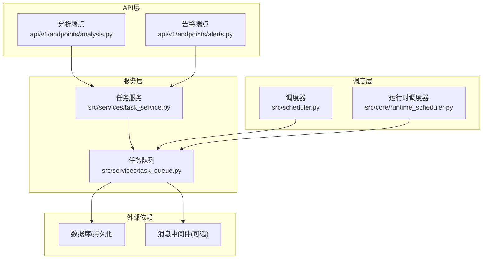
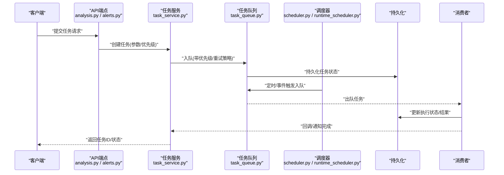
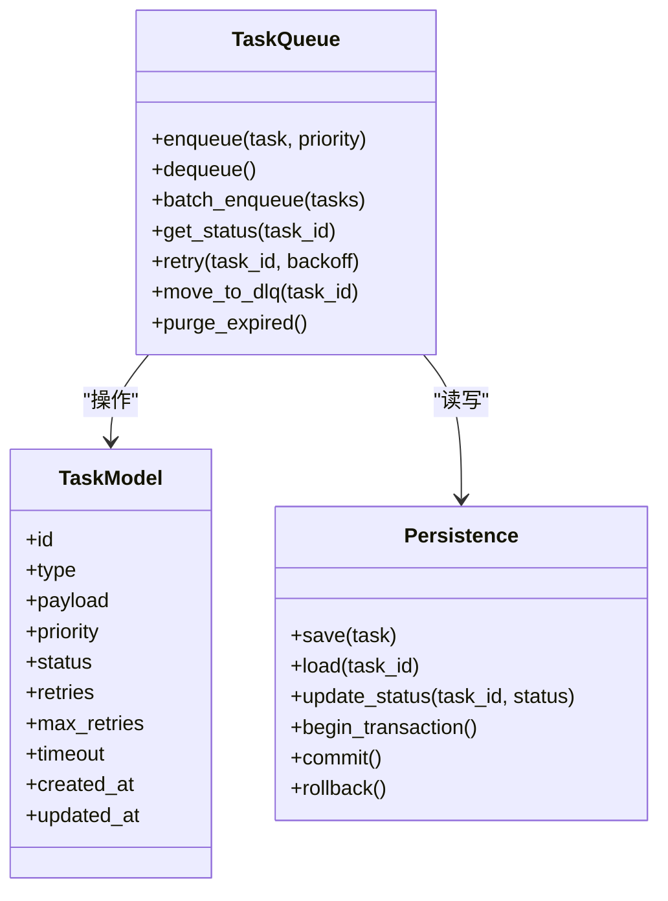
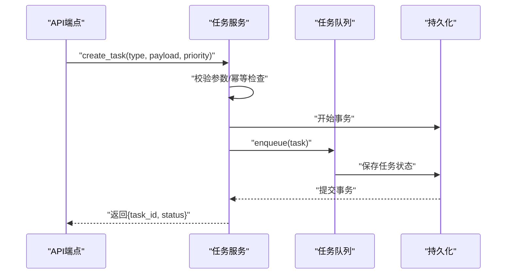
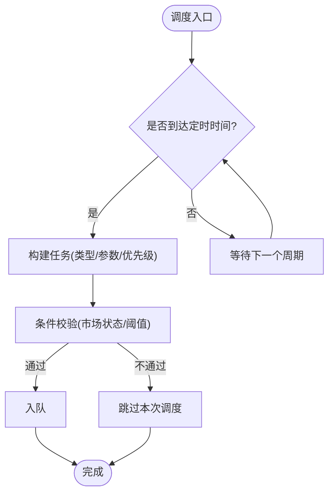
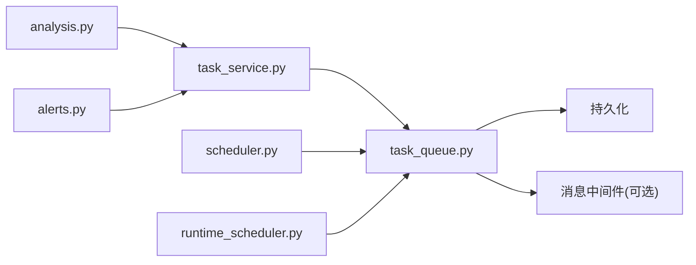

# 任务队列系统

<cite>
**本文档引用的文件**   
- [src/services/task_queue.py](file://src/services/task_queue.py)
- [src/services/task_service.py](file://src/services/task_service.py)
- [src/scheduler.py](file://src/scheduler.py)
- [src/core/runtime_scheduler.py](file://src/core/runtime_scheduler.py)
- [api/v1/endpoints/analysis.py](file://api/v1/endpoints/analysis.py)
- [api/v1/endpoints/alerts.py](file://api/v1/endpoints/alerts.py)
- [tests/test_task_queue_config_sync.py](file://tests/test_task_queue_config_sync.py)
- [tests/test_task_service.py](file://tests/test_task_service.py)
</cite>

## 目录
1. [简介](#简介)
2. [项目结构](#项目结构)
3. [核心组件](#核心组件)
4. [架构总览](#架构总览)
5. [详细组件分析](#详细组件分析)
6. [依赖关系分析](#依赖关系分析)
7. [性能考虑](#性能考虑)
8. [故障排查指南](#故障排查指南)
9. [结论](#结论)
10. [附录](#附录)

## 简介
本文件面向 Daily Stock Analysis 系统的“任务队列系统”，系统性阐述其架构设计、任务模型与优先级管理、分布式支持、调度策略（定时调度、事件触发、条件执行）、持久化机制（状态存储、事务、一致性）、故障恢复（重试、死信队列、状态恢复），并提供任务创建、消费者开发与监控配置的具体示例路径。同时给出队列性能调优与扩展性设计指南，帮助读者快速理解并高效使用该系统。

## 项目结构
任务队列系统主要位于后端服务层，围绕“任务定义—调度—入队—消费—持久化—监控”的闭环展开：
- 任务队列实现与配置同步：src/services/task_queue.py
- 任务服务（任务生命周期、API集成）：src/services/task_service.py
- 调度器（定时与运行时调度）：src/scheduler.py、src/core/runtime_scheduler.py
- API 端点（触发与分析相关任务）：api/v1/endpoints/analysis.py、api/v1/endpoints/alerts.py
- 测试用例（配置同步、任务服务行为）：tests/test_task_queue_config_sync.py、tests/test_task_service.py

图表来源
- [src/services/task_queue.py](file://src/services/task_queue.py)
- [src/services/task_service.py](file://src/services/task_service.py)
- [src/scheduler.py](file://src/scheduler.py)
- [src/core/runtime_scheduler.py](file://src/core/runtime_scheduler.py)
- [api/v1/endpoints/analysis.py](file://api/v1/endpoints/analysis.py)
- [api/v1/endpoints/alerts.py](file://api/v1/endpoints/alerts.py)

章节来源
- [src/services/task_queue.py](file://src/services/task_queue.py)
- [src/services/task_service.py](file://src/services/task_service.py)
- [src/scheduler.py](file://src/scheduler.py)
- [src/core/runtime_scheduler.py](file://src/core/runtime_scheduler.py)
- [api/v1/endpoints/analysis.py](file://api/v1/endpoints/analysis.py)
- [api/v1/endpoints/alerts.py](file://api/v1/endpoints/alerts.py)

## 核心组件
- 任务模型与优先级
  - 任务模型包含任务类型、参数、优先级、重试次数、超时、状态等字段，用于统一描述待处理工作单元。
  - 优先级通过数值或等级表示，结合队列选择策略（如优先队列）决定出队顺序。
- 任务队列实现
  - 提供入队、出队、批量操作、状态查询、重试与失败处理等能力。
  - 支持内存与持久化两种后端，便于本地开发与生产部署切换。
- 任务服务
  - 封装任务生命周期管理（创建、更新、取消、查询）。
  - 与API端点对接，暴露任务提交与状态查询接口。
- 调度器
  - 定时调度：基于时间表达式或固定间隔触发任务入队。
  - 事件触发：监听业务事件后动态入队。
  - 条件执行：在入队前进行前置校验与条件判断。
- 运行时调度器
  - 负责调度任务的启动、停止、暂停与恢复，协调多实例运行。
- 持久化与一致性
  - 任务状态落库，保证幂等与可恢复；关键路径采用事务保障一致性。
- 监控与可观测性
  - 暴露指标与日志，便于追踪任务吞吐、延迟、失败率与重试情况。

章节来源
- [src/services/task_queue.py](file://src/services/task_queue.py)
- [src/services/task_service.py](file://src/services/task_service.py)
- [src/scheduler.py](file://src/scheduler.py)
- [src/core/runtime_scheduler.py](file://src/core/runtime_scheduler.py)

## 架构总览
下图展示了从API到调度、队列、消费者与持久化的整体流程，体现任务的生命周期与关键交互点。

图表来源
- [api/v1/endpoints/analysis.py](file://api/v1/endpoints/analysis.py)
- [api/v1/endpoints/alerts.py](file://api/v1/endpoints/alerts.py)
- [src/services/task_service.py](file://src/services/task_service.py)
- [src/services/task_queue.py](file://src/services/task_queue.py)
- [src/scheduler.py](file://src/scheduler.py)
- [src/core/runtime_scheduler.py](file://src/core/runtime_scheduler.py)

## 详细组件分析

### 任务队列（task_queue.py）
- 职责
  - 维护任务集合与优先级队列，提供入队、出队、批量操作、状态查询。
  - 管理重试策略、失败处理与死信队列（DLQ）。
  - 支持内存与持久化后端切换，确保跨进程/实例的一致性。
- 关键设计
  - 优先级：通过优先级字段与排序策略控制出队顺序。
  - 重试：指数退避或固定间隔重试，限制最大重试次数。
  - 死信队列：超过重试上限的任务进入DLQ，供人工干预与审计。
  - 事务：入队与状态变更在同一事务中提交，避免部分成功。
- 可扩展点
  - 自定义队列后端（如Redis、RabbitMQ、Kafka）。
  - 自定义优先级策略（按股票、策略、时间窗口等维度）。

图表来源
- [src/services/task_queue.py](file://src/services/task_queue.py)

章节来源
- [src/services/task_queue.py](file://src/services/task_queue.py)

### 任务服务（task_service.py）
- 职责
  - 封装任务生命周期：创建、更新、取消、查询。
  - 与API端点对接，验证输入、转换参数、调用队列。
  - 聚合任务统计与监控指标上报。
- 关键设计
  - 幂等性：基于任务ID去重，避免重复提交。
  - 事务边界：任务创建与初始状态写入在同一事务内。
  - 错误映射：将底层异常转换为标准错误响应。
- 与调度器协作
  - 接收调度器的定时/事件触发信号，生成任务并入队。

图表来源
- [src/services/task_service.py](file://src/services/task_service.py)
- [src/services/task_queue.py](file://src/services/task_queue.py)

章节来源
- [src/services/task_service.py](file://src/services/task_service.py)

### 调度器（scheduler.py 与 runtime_scheduler.py）
- 职责
  - 定时调度：基于cron或固定间隔触发任务入队。
  - 事件触发：监听业务事件（如数据就绪、告警触发）后动态入队。
  - 条件执行：在入队前进行前置校验（如市场状态、库存阈值）。
  - 运行时调度：管理任务实例的启停、暂停、恢复与负载均衡。
- 关键设计
  - 解耦：调度器仅负责触发，不关心具体业务逻辑。
  - 容错：调度失败重试与降级策略。
  - 可观测：记录调度事件与执行轨迹。

图表来源
- [src/scheduler.py](file://src/scheduler.py)
- [src/core/runtime_scheduler.py](file://src/core/runtime_scheduler.py)

章节来源
- [src/scheduler.py](file://src/scheduler.py)
- [src/core/runtime_scheduler.py](file://src/core/runtime_scheduler.py)

### API端点（analysis.py 与 alerts.py）
- 职责
  - 暴露任务提交与状态查询接口。
  - 解析请求参数，调用任务服务创建任务。
  - 返回任务ID与初始状态，支持轮询或回调获取结果。
- 关键设计
  - 参数校验与错误处理。
  - 限流与鉴权（如需）。
  - 异步响应：立即返回任务ID，后续通过状态接口查询。

章节来源
- [api/v1/endpoints/analysis.py](file://api/v1/endpoints/analysis.py)
- [api/v1/endpoints/alerts.py](file://api/v1/endpoints/alerts.py)

## 依赖关系分析
- 组件耦合
  - API端点依赖任务服务；任务服务依赖任务队列；调度器依赖任务队列。
  - 任务队列依赖持久化与可选的消息中间件。
- 外部依赖
  - 数据库：任务状态与结果持久化。
  - 消息中间件（可选）：用于分布式场景下的任务分发与消费。
- 潜在循环依赖
  - 通过服务层与队列抽象解耦，避免直接循环引用。

图表来源
- [api/v1/endpoints/analysis.py](file://api/v1/endpoints/analysis.py)
- [api/v1/endpoints/alerts.py](file://api/v1/endpoints/alerts.py)
- [src/services/task_service.py](file://src/services/task_service.py)
- [src/services/task_queue.py](file://src/services/task_queue.py)
- [src/scheduler.py](file://src/scheduler.py)
- [src/core/runtime_scheduler.py](file://src/core/runtime_scheduler.py)

章节来源
- [src/services/task_queue.py](file://src/services/task_queue.py)
- [src/services/task_service.py](file://src/services/task_service.py)
- [src/scheduler.py](file://src/scheduler.py)
- [src/core/runtime_scheduler.py](file://src/core/runtime_scheduler.py)

## 性能考虑
- 队列吞吐
  - 使用优先队列与批处理入队减少锁竞争。
  - 合理设置消费者并发度，避免过载。
- 持久化优化
  - 批量写入与事务合并，降低IO开销。
  - 索引优化：按任务类型、状态、优先级建立索引。
- 重试与背压
  - 指数退避与最大重试限制，防止雪崩。
  - 背压机制：当队列长度超过阈值时拒绝新任务或降级。
- 监控与告警
  - 采集队列长度、出队速率、失败率、重试次数等指标。
  - 设置阈值告警，及时发现瓶颈与异常。

[本节为通用指导，无需特定文件来源]

## 故障排查指南
- 常见问题
  - 任务未执行：检查调度器是否正常运行、队列是否阻塞、消费者是否存活。
  - 任务重复执行：确认幂等性与去重逻辑是否正确。
  - 任务失败重试过多：检查重试策略与死信队列配置。
  - 持久化不一致：检查事务边界与回滚逻辑。
- 定位方法
  - 查看任务状态与日志，定位失败原因。
  - 检查队列长度与消费者负载，识别瓶颈。
  - 核对调度器时间与事件触发条件。
- 恢复步骤
  - 清理阻塞任务或重置状态。
  - 重新入队失败任务（谨慎评估副作用）。
  - 扩容消费者或调整优先级策略。

章节来源
- [tests/test_task_queue_config_sync.py](file://tests/test_task_queue_config_sync.py)
- [tests/test_task_service.py](file://tests/test_task_service.py)

## 结论
Daily Stock Analysis 的任务队列系统以清晰的分层与解耦设计，实现了高可靠、可扩展的任务处理能力。通过优先级管理、调度策略、持久化与故障恢复机制，系统能够稳定支撑日常分析与告警任务的高效执行。建议在生产环境中结合消息中间件与监控系统，进一步提升吞吐与可观测性。

[本节为总结性内容，无需特定文件来源]

## 附录
- 任务创建示例（参考路径）
  - API端点：api/v1/endpoints/analysis.py、api/v1/endpoints/alerts.py
  - 任务服务：src/services/task_service.py
- 消费者开发示例（参考路径）
  - 任务队列：src/services/task_queue.py
  - 调度器：src/scheduler.py、src/core/runtime_scheduler.py
- 监控配置示例（参考路径）
  - 任务服务与队列指标上报：src/services/task_service.py、src/services/task_queue.py
- 测试用例（参考路径）
  - 配置同步：tests/test_task_queue_config_sync.py
  - 任务服务行为：tests/test_task_service.py

[本节为指引性内容，无需特定文件来源]