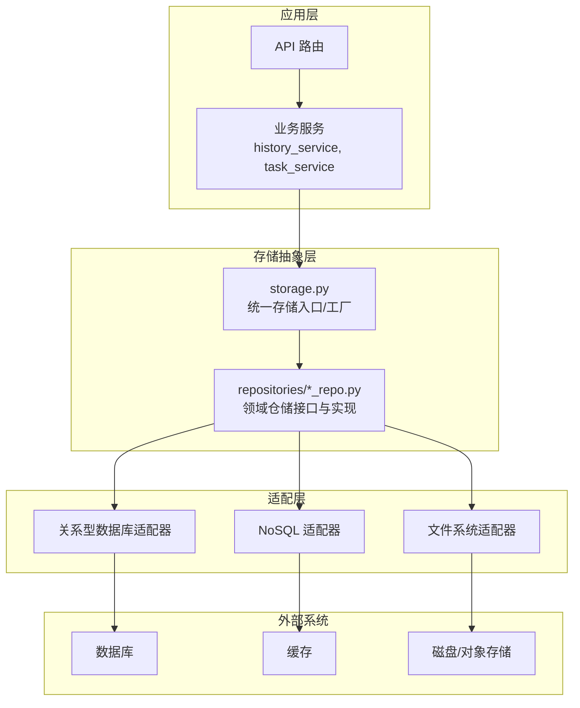
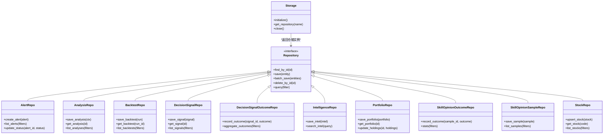
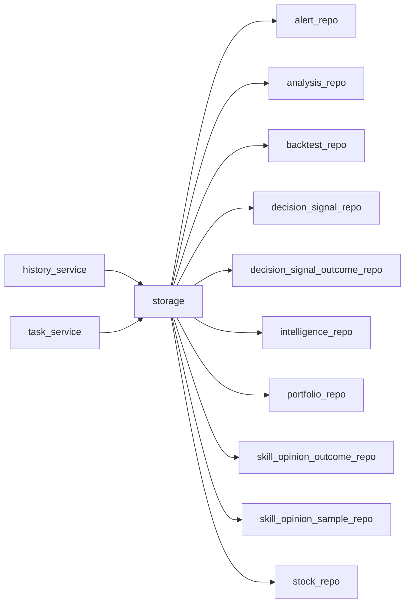
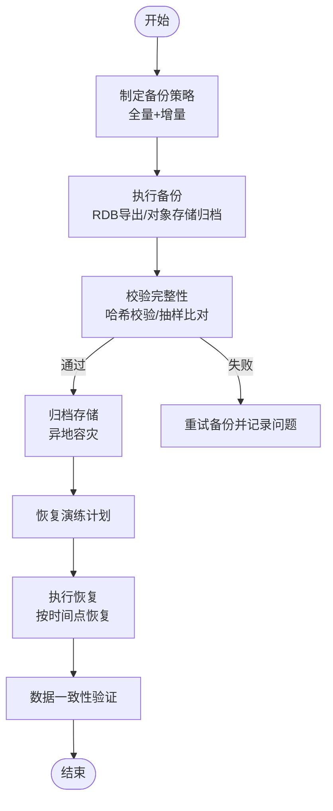
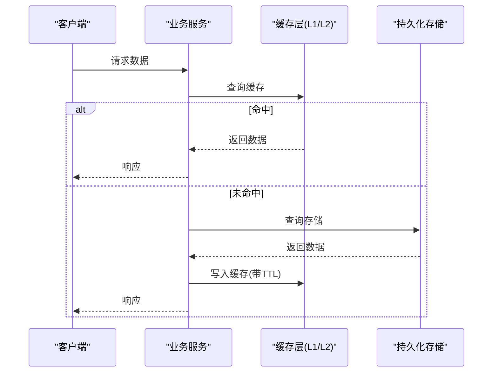

# 存储层抽象

<cite>
**本文引用的文件**   
- [src/storage.py](file://src/storage.py)
- [src/repositories/__init__.py](file://src/repositories/__init__.py)
- [src/repositories/alert_repo.py](file://src/repositories/alert_repo.py)
- [src/repositories/analysis_repo.py](file://src/repositories/analysis_repo.py)
- [src/repositories/backtest_repo.py](file://src/repositories/backtest_repo.py)
- [src/repositories/decision_signal_outcome_repo.py](file://src/repositories/decision_signal_outcome_repo.py)
- [src/repositories/decision_signal_repo.py](file://src/repositories/decision_signal_repo.py)
- [src/repositories/intelligence_repo.py](file://src/repositories/intelligence_repo.py)
- [src/repositories/portfolio_repo.py](file://src/repositories/portfolio_repo.py)
- [src/repositories/skill_opinion_outcome_repo.py](file://src/repositories/skill_opinion_outcome_repo.py)
- [src/repositories/skill_opinion_sample_repo.py](file://src/repositories/skill_opinion_sample_repo.py)
- [src/repositories/stock_repo.py](file://src/repositories/stock_repo.py)
- [src/services/history_service.py](file://src/services/history_service.py)
- [src/services/task_service.py](file://src/services/task_service.py)
- [src/config.py](file://src/config.py)
- [tests/test_storage.py](file://tests/test_storage.py)
</cite>

## 目录
1. [简介](#简介)
2. [项目结构](#项目结构)
3. [核心组件](#核心组件)
4. [架构总览](#架构总览)
5. [详细组件分析](#详细组件分析)
6. [依赖关系分析](#依赖关系分析)
7. [性能考量](#性能考量)
8. [故障排查指南](#故障排查指南)
9. [结论](#结论)
10. [附录](#附录)

## 简介
本文件面向 Daily Stock Analysis 系统的“存储层抽象”，系统性阐述接口设计、适配器模式与插件化架构，覆盖数据持久化策略（关系型数据库、NoSQL、文件系统）、缓存机制（多级缓存、失效策略、一致性保证）、数据迁移与版本管理（向后兼容与升级路径），并提供存储适配器开发、查询优化与备份恢复的实践示例。文档同时给出存储性能分析与容量规划建议，帮助读者在复杂业务场景下做出稳健的存储选型与工程决策。

## 项目结构
存储相关代码主要分布在以下位置：
- 存储抽象与统一入口：src/storage.py
- 领域仓储接口与实现：src/repositories/*_repo.py
- 上层服务对存储的调用：src/services/*_service.py
- 配置与环境：src/config.py
- 测试用例：tests/test_storage.py

图表来源
- [src/storage.py](file://src/storage.py)
- [src/repositories/__init__.py](file://src/repositories/__init__.py)
- [src/services/history_service.py](file://src/services/history_service.py)
- [src/services/task_service.py](file://src/services/task_service.py)

章节来源
- [src/storage.py](file://src/storage.py)
- [src/repositories/__init__.py](file://src/repositories/__init__.py)
- [src/services/history_service.py](file://src/services/history_service.py)
- [src/services/task_service.py](file://src/services/task_service.py)

## 核心组件
- 存储抽象入口 storage.py：提供统一的存储访问入口、初始化与生命周期管理，负责根据配置选择具体适配器（RDB/NoSQL/FS）。
- 领域仓储 repositories/*_repo.py：按业务域划分仓储接口与实现，如 alert、analysis、backtest、decision_signal、intelligence、portfolio、skill_opinion、stock 等。每个仓储封装该领域的增删改查与批量操作。
- 服务层 services/*_service.py：编排仓储调用，组合多个仓储完成复杂业务流程（例如历史数据加载、任务调度写入等）。
- 配置 config.py：集中管理存储后端类型、连接参数、缓存策略、迁移开关等。

章节来源
- [src/storage.py](file://src/storage.py)
- [src/repositories/alert_repo.py](file://src/repositories/alert_repo.py)
- [src/repositories/analysis_repo.py](file://src/repositories/analysis_repo.py)
- [src/repositories/backtest_repo.py](file://src/repositories/backtest_repo.py)
- [src/repositories/decision_signal_outcome_repo.py](file://src/repositories/decision_signal_outcome_repo.py)
- [src/repositories/decision_signal_repo.py](file://src/repositories/decision_signal_repo.py)
- [src/repositories/intelligence_repo.py](file://src/repositories/intelligence_repo.py)
- [src/repositories/portfolio_repo.py](file://src/repositories/portfolio_repo.py)
- [src/repositories/skill_opinion_outcome_repo.py](file://src/repositories/skill_opinion_outcome_repo.py)
- [src/repositories/skill_opinion_sample_repo.py](file://src/repositories/skill_opinion_sample_repo.py)
- [src/repositories/stock_repo.py](file://src/repositories/stock_repo.py)
- [src/services/history_service.py](file://src/services/history_service.py)
- [src/services/task_service.py](file://src/services/task_service.py)
- [src/config.py](file://src/config.py)

## 架构总览
存储层采用“接口 + 适配器 + 插件”的设计：
- 接口层：仓储接口定义领域能力（读/写/批处理/事务边界），屏蔽底层差异。
- 适配器层：为不同存储介质（RDB、NoSQL、FS）提供实现，通过配置动态装配。
- 插件层：支持扩展新的存储后端或中间件（如审计、压缩、加密），以插件形式注入到仓储链中。

图表来源
- [src/storage.py](file://src/storage.py)
- [src/repositories/alert_repo.py](file://src/repositories/alert_repo.py)
- [src/repositories/analysis_repo.py](file://src/repositories/analysis_repo.py)
- [src/repositories/backtest_repo.py](file://src/repositories/backtest_repo.py)
- [src/repositories/decision_signal_outcome_repo.py](file://src/repositories/decision_signal_outcome_repo.py)
- [src/repositories/decision_signal_repo.py](file://src/repositories/decision_signal_repo.py)
- [src/repositories/intelligence_repo.py](file://src/repositories/intelligence_repo.py)
- [src/repositories/portfolio_repo.py](file://src/repositories/portfolio_repo.py)
- [src/repositories/skill_opinion_outcome_repo.py](file://src/repositories/skill_opinion_outcome_repo.py)
- [src/repositories/skill_opinion_sample_repo.py](file://src/repositories/skill_opinion_sample_repo.py)
- [src/repositories/stock_repo.py](file://src/repositories/stock_repo.py)

## 详细组件分析

### 存储抽象与工厂（storage.py）
- 职责
  - 统一初始化各存储后端（RDB、NoSQL、FS），暴露 get_repository(name) 获取领域仓储。
  - 管理连接池、会话上下文、重试与超时策略。
  - 提供健康检查与优雅关闭。
- 关键设计点
  - 基于配置的适配器选择：通过环境变量或配置文件切换后端。
  - 插件式中间件：可在仓储调用前后插入日志、指标、审计、限流等逻辑。
  - 错误归一化：将底层异常转换为统一错误模型，便于上层处理。

章节来源
- [src/storage.py](file://src/storage.py)

### 领域仓储（repositories/*_repo.py）
- 通用模式
  - 每个仓储定义领域实体与操作集，遵循一致的接口契约。
  - 读写分离：读路径优先走缓存/只读副本，写路径走主库或强一致存储。
  - 批量操作：提供 batch_save、bulk_upsert 等方法提升吞吐。
- 典型仓储
  - alert_repo：告警事件持久化、状态更新与过滤查询。
  - analysis_repo：分析报告上下文保存与检索。
  - backtest_repo：回测运行结果与指标归档。
  - decision_signal_*：决策信号与结果的关联存储与聚合统计。
  - intelligence_repo：情报数据的索引与搜索。
  - portfolio_repo：投资组合快照与持仓变更。
  - skill_opinion_*：技能观点样本与结果统计。
  - stock_repo：股票基础信息与映射表维护。

章节来源
- [src/repositories/alert_repo.py](file://src/repositories/alert_repo.py)
- [src/repositories/analysis_repo.py](file://src/repositories/analysis_repo.py)
- [src/repositories/backtest_repo.py](file://src/repositories/backtest_repo.py)
- [src/repositories/decision_signal_outcome_repo.py](file://src/repositories/decision_signal_outcome_repo.py)
- [src/repositories/decision_signal_repo.py](file://src/repositories/decision_signal_repo.py)
- [src/repositories/intelligence_repo.py](file://src/repositories/intelligence_repo.py)
- [src/repositories/portfolio_repo.py](file://src/repositories/portfolio_repo.py)
- [src/repositories/skill_opinion_outcome_repo.py](file://src/repositories/skill_opinion_outcome_repo.py)
- [src/repositories/skill_opinion_sample_repo.py](file://src/repositories/skill_opinion_sample_repo.py)
- [src/repositories/stock_repo.py](file://src/repositories/stock_repo.py)

### 服务层调用（services/history_service.py, services/task_service.py）
- history_service：编排多源历史数据加载、清洗、落库与缓存预热；必要时触发增量/全量同步。
- task_service：任务队列持久化、状态机推进、失败重试与补偿；与仓储协作完成幂等写入。

章节来源
- [src/services/history_service.py](file://src/services/history_service.py)
- [src/services/task_service.py](file://src/services/task_service.py)

### 配置与环境（config.py）
- 存储后端选择：RDB/NoSQL/FS 的启用开关与连接参数。
- 缓存策略：TTL、最大容量、淘汰策略、一致性级别。
- 迁移开关：是否启用自动迁移、回滚策略、灰度发布标志。
- 性能参数：连接池大小、超时、重试次数、并发度。

章节来源
- [src/config.py](file://src/config.py)

## 依赖关系分析
- 耦合与内聚
  - 仓储按领域高内聚，对外仅暴露稳定接口，降低与上层服务的耦合。
  - storage.py 作为唯一装配点，避免散落的依赖注入。
- 外部依赖
  - RDB：MySQL/PostgreSQL（示例），通过连接池与事务管理器使用。
  - NoSQL：Redis/MongoDB（示例），用于热点数据与文档型存储。
  - 文件系统：本地磁盘或对象存储（S3/OSS），用于大文件或归档。
- 潜在循环依赖
  - 仓储之间不直接互相引用，跨域聚合由服务层编排，避免循环。

图表来源
- [src/services/history_service.py](file://src/services/history_service.py)
- [src/services/task_service.py](file://src/services/task_service.py)
- [src/storage.py](file://src/storage.py)
- [src/repositories/alert_repo.py](file://src/repositories/alert_repo.py)
- [src/repositories/analysis_repo.py](file://src/repositories/analysis_repo.py)
- [src/repositories/backtest_repo.py](file://src/repositories/backtest_repo.py)
- [src/repositories/decision_signal_outcome_repo.py](file://src/repositories/decision_signal_outcome_repo.py)
- [src/repositories/decision_signal_repo.py](file://src/repositories/decision_signal_repo.py)
- [src/repositories/intelligence_repo.py](file://src/repositories/intelligence_repo.py)
- [src/repositories/portfolio_repo.py](file://src/repositories/portfolio_repo.py)
- [src/repositories/skill_opinion_outcome_repo.py](file://src/repositories/skill_opinion_outcome_repo.py)
- [src/repositories/skill_opinion_sample_repo.py](file://src/repositories/skill_opinion_sample_repo.py)
- [src/repositories/stock_repo.py](file://src/repositories/stock_repo.py)

章节来源
- [src/storage.py](file://src/storage.py)
- [src/repositories/__init__.py](file://src/repositories/__init__.py)
- [src/services/history_service.py](file://src/services/history_service.py)
- [src/services/task_service.py](file://src/services/task_service.py)

## 性能考量
- 读取路径优化
  - 多级缓存：L1 进程内缓存（短 TTL、热点键）、L2 分布式缓存（Redis）、L3 持久化存储（RDB/NoSQL）。
  - 预取与懒加载：列表页按需分页，详情延迟加载。
  - 索引与投影：针对高频查询构建复合索引，减少回表。
- 写入路径优化
  - 批量写入与合并：batch_save、upsert 减少往返。
  - 异步落盘：非关键路径采用消息队列缓冲，削峰填谷。
  - 幂等性：基于业务键去重，避免重复写入。
- 一致性策略
  - 最终一致：读多写少场景允许短暂不一致，配合版本号/时间戳校验。
  - 强一致：交易类操作使用事务与锁，限制并发粒度。
- 容量规划
  - 估算日增量：行情数据、分析结果、告警与日志的分项统计。
  - 冷热分层：热数据入缓存/内存，温数据落 SSD，冷数据归档至对象存储。
  - 扩容策略：分库分表、读写分离、水平扩展缓存节点。

[本节为通用指导，不直接分析具体文件]

## 故障排查指南
- 常见问题定位
  - 连接失败：检查存储后端连通性、认证信息、防火墙与安全组。
  - 慢查询：开启慢查询日志，结合 EXPLAIN 分析执行计划。
  - 缓存穿透/雪崩：设置空值缓存、随机过期、限流降级。
  - 数据不一致：核对版本号/时间戳，检查事务边界与重试策略。
- 诊断工具
  - 健康检查端点：存储后端可用性探测。
  - 指标与追踪：QPS、延迟、错误率、连接池利用率。
  - 备份与恢复演练：定期验证恢复流程与数据完整性。

章节来源
- [tests/test_storage.py](file://tests/test_storage.py)

## 结论
Daily Stock Analysis 的存储层通过清晰的接口抽象、适配器与插件化架构，实现了多后端可插拔、可扩展与可运维的目标。结合多级缓存、幂等写入与完善的监控诊断，能够在高并发与大数据量场景下保持稳定性与性能。建议在演进过程中持续完善数据迁移与版本管理策略，确保向后兼容与平滑升级。

[本节为总结性内容，不直接分析具体文件]

## 附录

### 存储适配器开发指南（示例步骤）
- 定义仓储接口方法：明确输入输出、事务边界与错误码。
- 实现适配器：对接目标存储（RDB/NoSQL/FS），处理连接池、序列化与索引。
- 注册与装配：在 storage.py 中按配置注册适配器，暴露 get_repository(name)。
- 单元测试：覆盖正常路径、异常分支与边界条件。
- 集成测试：端到端验证读写一致性与性能指标。

章节来源
- [src/storage.py](file://src/storage.py)
- [src/repositories/alert_repo.py](file://src/repositories/alert_repo.py)
- [src/repositories/analysis_repo.py](file://src/repositories/analysis_repo.py)
- [src/repositories/backtest_repo.py](file://src/repositories/backtest_repo.py)
- [src/repositories/decision_signal_outcome_repo.py](file://src/repositories/decision_signal_outcome_repo.py)
- [src/repositories/decision_signal_repo.py](file://src/repositories/decision_signal_repo.py)
- [src/repositories/intelligence_repo.py](file://src/repositories/intelligence_repo.py)
- [src/repositories/portfolio_repo.py](file://src/repositories/portfolio_repo.py)
- [src/repositories/skill_opinion_outcome_repo.py](file://src/repositories/skill_opinion_outcome_repo.py)
- [src/repositories/skill_opinion_sample_repo.py](file://src/repositories/skill_opinion_sample_repo.py)
- [src/repositories/stock_repo.py](file://src/repositories/stock_repo.py)

### 查询优化实践（示例要点）
- 热点键缓存：对频繁访问的标的快照、指数成分进行 L1/L2 缓存。
- 分页与游标：避免深分页，使用基于时间戳或 ID 的游标分页。
- 索引设计：为常用过滤字段建立联合索引，避免函数索引导致失效。
- 物化视图/汇总表：对复杂聚合结果进行预计算，缩短查询时延。

章节来源
- [src/services/history_service.py](file://src/services/history_service.py)
- [src/repositories/analysis_repo.py](file://src/repositories/analysis_repo.py)
- [src/repositories/stock_repo.py](file://src/repositories/stock_repo.py)

### 备份与恢复（示例流程）

[本图为概念流程图，不直接映射具体源码文件]

### 数据迁移与版本管理（示例策略）
- 版本化迁移脚本：每次 schema 变更生成独立迁移文件，支持正向与回滚。
- 灰度发布：先在新实例上执行迁移，逐步切流，观察指标。
- 向后兼容：新增字段默认可空，旧代码忽略新字段；删除字段需双写过渡期。
- 数据修复：提供修复脚本处理历史脏数据，确保一致性。

章节来源
- [src/config.py](file://src/config.py)

### 缓存机制设计（示例）

[本图为概念序列图，不直接映射具体源码文件]