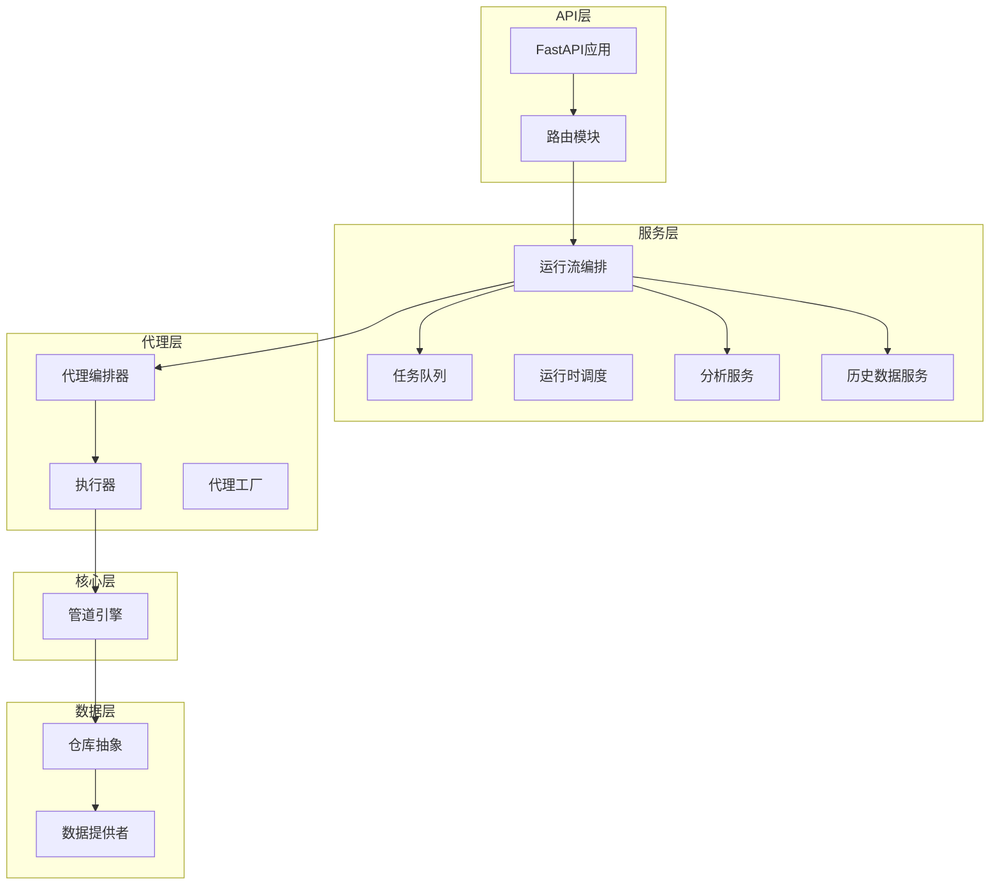
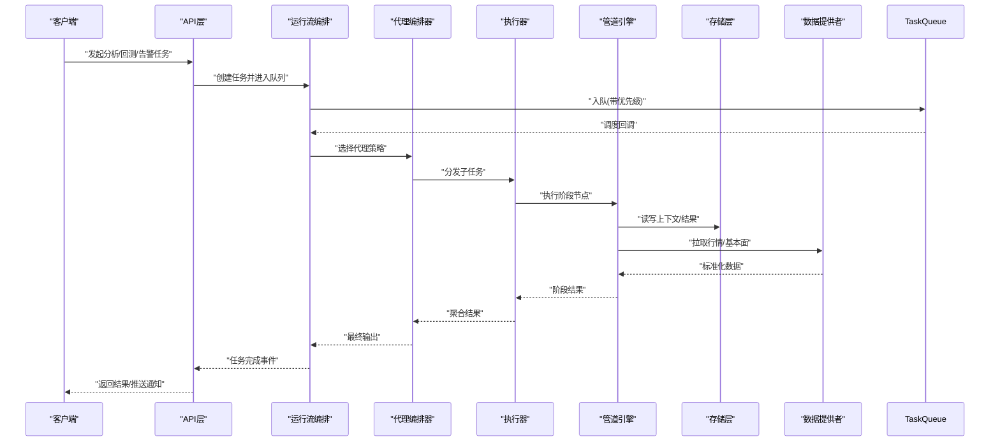
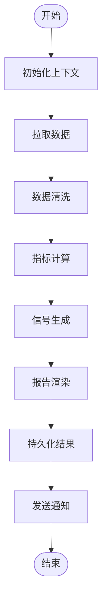
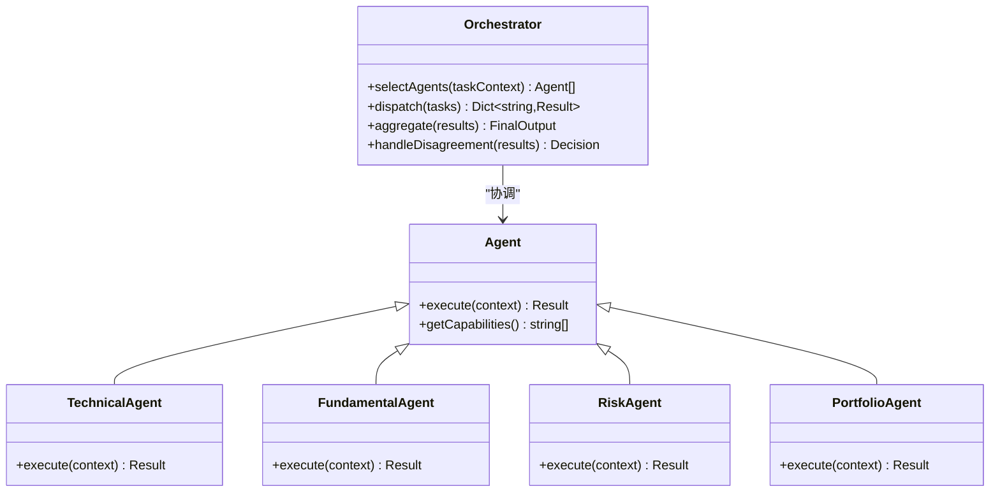
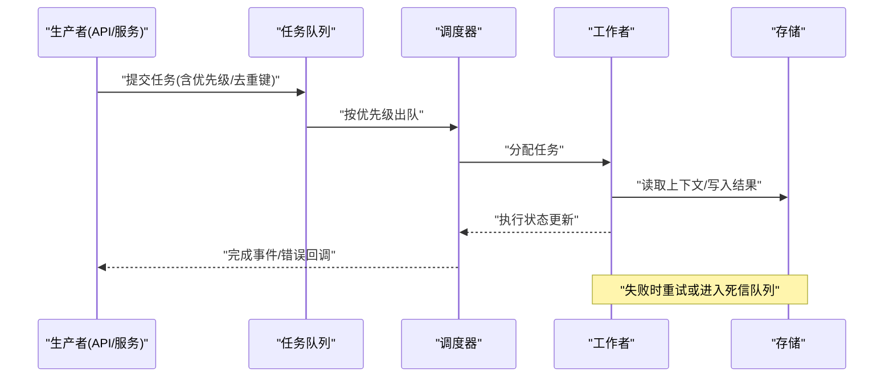
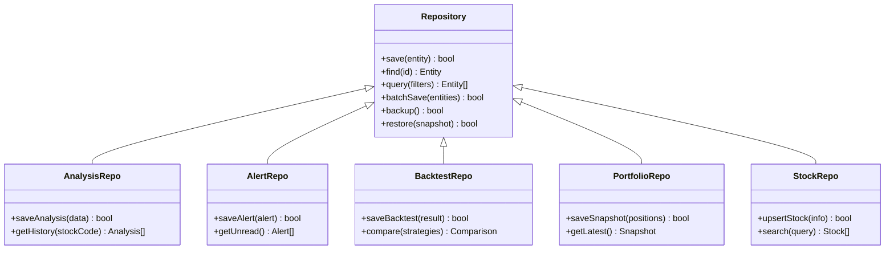
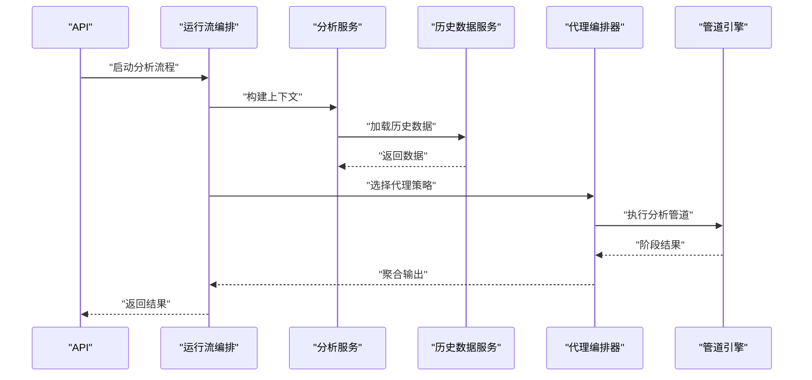
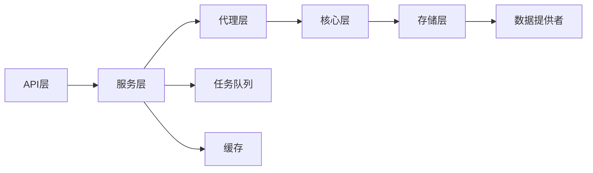

# 核心组件设计

<cite>
**本文引用的文件**   
- [main.py](file://main.py)
- [server.py](file://server.py)
- [src/core/pipeline.py](file://src/core/pipeline.py)
- [src/services/task_queue.py](file://src/services/task_queue.py)
- [src/services/runtime_scheduler.py](file://src/services/runtime_scheduler.py)
- [src/agent/orchestrator.py](file://src/agent/orchestrator.py)
- [src/agent/executor.py](file://src/agent/executor.py)
- [src/agent/factory.py](file://src/agent/factory.py)
- [src/storage.py](file://src/storage.py)
- [src/repositories/analysis_repo.py](file://src/repositories/analysis_repo.py)
- [src/repositories/alert_repo.py](file://src/repositories/alert_repo.py)
- [src/repositories/backtest_repo.py](file://src/repositories/backtest_repo.py)
- [src/repositories/portfolio_repo.py](file://src/repositories/portfolio_repo.py)
- [src/repositories/stock_repo.py](file://src/repositories/stock_repo.py)
- [api/app.py](file://api/app.py)
- [api/v1/router.py](file://api/v1/router.py)
- [src/services/run_flow.py](file://src/services/run_flow.py)
- [src/services/analysis_service.py](file://src/services/analysis_service.py)
- [src/services/history_service.py](file://src/services/history_service.py)
- [src/data_provider/base.py](file://src/data_provider/base.py)
</cite>

## 目录
1. [简介](#简介)
2. [项目结构](#项目结构)
3. [核心组件](#核心组件)
4. [架构总览](#架构总览)
5. [详细组件分析](#详细组件分析)
6. [依赖关系分析](#依赖关系分析)
7. [性能考量](#性能考量)
8. [故障排查指南](#故障排查指南)
9. [结论](#结论)
10. [附录](#附录)

## 简介
本文件面向Daily Stock Analysis系统的核心组件设计，重点阐述以下方面：
- 管道处理引擎：任务调度、数据流转与状态管理
- 代理编排器：多代理协作机制、任务分配与结果聚合
- 任务队列系统：异步任务处理、优先级管理与故障恢复
- 存储层抽象：数据持久化策略、缓存机制与备份恢复
- 组件间依赖关系与通信协议
- 使用示例与最佳实践（以代码片段路径形式提供）

## 项目结构
系统采用分层与模块化组织方式：
- API层：FastAPI应用、路由与中间件
- 服务层：业务编排、运行期调度、任务队列、分析服务等
- 代理层：多代理编排、执行器、工具与技能
- 核心层：管道引擎、市场日历、策略等
- 数据提供者：统一的数据获取接口与适配器
- 存储层：仓库抽象与具体实现
- 配置与脚本：部署、构建与运维脚本

图表来源
- [api/app.py](file://api/app.py)
- [api/v1/router.py](file://api/v1/router.py)
- [src/services/run_flow.py](file://src/services/run_flow.py)
- [src/services/task_queue.py](file://src/services/task_queue.py)
- [src/agent/orchestrator.py](file://src/agent/orchestrator.py)
- [src/agent/executor.py](file://src/agent/executor.py)
- [src/core/pipeline.py](file://src/core/pipeline.py)
- [src/repositories/analysis_repo.py](file://src/repositories/analysis_repo.py)
- [src/data_provider/base.py](file://src/data_provider/base.py)

章节来源
- [main.py:1-200](file://main.py#L1-L200)
- [server.py:1-200](file://server.py#L1-L200)
- [api/app.py:1-200](file://api/app.py#L1-L200)
- [api/v1/router.py:1-200](file://api/v1/router.py#L1-L200)

## 核心组件
- 管道处理引擎：负责将数据拉取、清洗、指标计算、信号生成、报告渲染等步骤串联为可配置的流水线，支持阶段级错误隔离与重试。
- 代理编排器：协调多个专业代理（技术、基本面、风险、组合管理等），进行任务拆分、并行执行与结果聚合，形成最终决策或建议。
- 任务队列系统：基于异步工作进程的任务分发与执行，支持优先级、去重、幂等、失败重试与死信队列。
- 存储层抽象：统一的仓储接口，屏蔽底层数据库、缓存与对象存储差异，提供事务、快照与备份恢复能力。

章节来源
- [src/core/pipeline.py:1-300](file://src/core/pipeline.py#L1-L300)
- [src/agent/orchestrator.py:1-300](file://src/agent/orchestrator.py#L1-L300)
- [src/services/task_queue.py:1-300](file://src/services/task_queue.py#L1-L300)
- [src/storage.py:1-300](file://src/storage.py#L1-L300)

## 架构总览
整体架构遵循“API -> 服务编排 -> 代理编排 -> 管道引擎 -> 存储/数据源”的分层模型。关键交互如下：
- API接收请求，路由到运行流编排
- 运行流编排根据任务类型选择代理编排或数据处理流程
- 代理编排器调用执行器，执行器驱动管道引擎完成各阶段处理
- 管道引擎通过仓储访问存储层，并通过数据提供者拉取外部数据
- 结果经服务层聚合后返回给API，并触发通知或持久化

图表来源
- [api/app.py:1-200](file://api/app.py#L1-L200)
- [api/v1/router.py:1-200](file://api/v1/router.py#L1-L200)
- [src/services/run_flow.py:1-300](file://src/services/run_flow.py#L1-L300)
- [src/services/task_queue.py:1-300](file://src/services/task_queue.py#L1-L300)
- [src/agent/orchestrator.py:1-300](file://src/agent/orchestrator.py#L1-L300)
- [src/agent/executor.py:1-300](file://src/agent/executor.py#L1-L300)
- [src/core/pipeline.py:1-300](file://src/core/pipeline.py#L1-L300)
- [src/storage.py:1-300](file://src/storage.py#L1-L300)
- [src/data_provider/base.py:1-200](file://src/data_provider/base.py#L1-L200)

## 详细组件分析

### 管道处理引擎
- 设计目标：将复杂的多阶段数据处理流程抽象为可插拔的阶段节点，支持顺序、分支、并行与汇聚。
- 关键特性：
  - 阶段定义：输入/输出契约、错误处理策略、重试与超时控制
  - 上下文传递：共享的上下文对象，包含股票范围、时间窗口、参数与中间结果
  - 容错与降级：阶段级异常捕获、跳过可选阶段、回退到缓存或默认值
  - 监控与追踪：阶段耗时、吞吐、错误率统计
- 典型阶段：数据拉取、清洗、指标计算、信号生成、报告渲染、通知发送

图表来源
- [src/core/pipeline.py:1-300](file://src/core/pipeline.py#L1-L300)

章节来源
- [src/core/pipeline.py:1-300](file://src/core/pipeline.py#L1-L300)

### 代理编排器
- 设计目标：协调多个专业代理（技术分析、基本面分析、风险评估、组合管理等），实现任务分解、并行执行与结果融合。
- 协作机制：
  - 任务路由：根据任务类型与上下文选择代理集合
  - 资源隔离：每个代理独立上下文与资源限制
  - 冲突解决：当代理意见不一致时，采用加权投票或规则仲裁
  - 结果聚合：汇总各代理输出，生成统一的结构化结果
- 扩展性：新增代理只需实现标准接口并注册到工厂

图表来源
- [src/agent/orchestrator.py:1-300](file://src/agent/orchestrator.py#L1-L300)
- [src/agent/factory.py:1-200](file://src/agent/factory.py#L1-L200)

章节来源
- [src/agent/orchestrator.py:1-300](file://src/agent/orchestrator.py#L1-L300)
- [src/agent/factory.py:1-200](file://src/agent/factory.py#L1-L200)

### 任务队列系统
- 设计目标：提供高可靠、可扩展的异步任务处理能力，支持优先级、去重、幂等、重试与死信队列。
- 关键特性：
  - 生产者/消费者模型：API或服务作为生产者，后台工作者作为消费者
  - 优先级队列：按任务紧急程度排序执行
  - 失败恢复：指数退避重试、最大重试次数、死信队列归档
  - 监控与审计：任务生命周期追踪、延迟与成功率统计
- 典型流程：任务入队 -> 调度器分配 -> 工作者执行 -> 结果持久化 -> 事件回调

图表来源
- [src/services/task_queue.py:1-300](file://src/services/task_queue.py#L1-L300)
- [src/services/runtime_scheduler.py:1-200](file://src/services/runtime_scheduler.py#L1-L200)

章节来源
- [src/services/task_queue.py:1-300](file://src/services/task_queue.py#L1-L300)
- [src/services/runtime_scheduler.py:1-200](file://src/services/runtime_scheduler.py#L1-L200)

### 存储层抽象
- 设计目标：统一数据访问接口，屏蔽底层存储差异，提供事务、缓存与备份恢复能力。
- 关键特性：
  - 仓储接口：CRUD操作、批量写入、查询优化
  - 缓存策略：多级缓存（内存/Redis）、失效与预热
  - 备份恢复：定期快照、增量备份、一致性校验
  - 迁移与版本：数据模型演进与兼容性处理
- 典型实体：分析结果、告警记录、回测结果、投资组合、股票信息

图表来源
- [src/storage.py:1-300](file://src/storage.py#L1-L300)
- [src/repositories/analysis_repo.py:1-200](file://src/repositories/analysis_repo.py#L1-L200)
- [src/repositories/alert_repo.py:1-200](file://src/repositories/alert_repo.py#L1-L200)
- [src/repositories/backtest_repo.py:1-200](file://src/repositories/backtest_repo.py#L1-L200)
- [src/repositories/portfolio_repo.py:1-200](file://src/repositories/portfolio_repo.py#L1-L200)
- [src/repositories/stock_repo.py:1-200](file://src/repositories/stock_repo.py#L1-L200)

章节来源
- [src/storage.py:1-300](file://src/storage.py#L1-L300)
- [src/repositories/analysis_repo.py:1-200](file://src/repositories/analysis_repo.py#L1-L200)
- [src/repositories/alert_repo.py:1-200](file://src/repositories/alert_repo.py#L1-L200)
- [src/repositories/backtest_repo.py:1-200](file://src/repositories/backtest_repo.py#L1-L200)
- [src/repositories/portfolio_repo.py:1-200](file://src/repositories/portfolio_repo.py#L1-L200)
- [src/repositories/stock_repo.py:1-200](file://src/repositories/stock_repo.py#L1-L200)

### 运行流与服务编排
- 运行流编排：根据任务类型（分析、回测、告警等）组装服务链，协调代理编排与管道执行
- 分析服务：封装分析上下文构建、数据准备、结果格式化与通知
- 历史数据服务：提供历史数据加载、对比与缓存优化

图表来源
- [src/services/run_flow.py:1-300](file://src/services/run_flow.py#L1-L300)
- [src/services/analysis_service.py:1-200](file://src/services/analysis_service.py#L1-L200)
- [src/services/history_service.py:1-200](file://src/services/history_service.py#L1-L200)
- [src/agent/orchestrator.py:1-300](file://src/agent/orchestrator.py#L1-L300)
- [src/core/pipeline.py:1-300](file://src/core/pipeline.py#L1-L300)

章节来源
- [src/services/run_flow.py:1-300](file://src/services/run_flow.py#L1-L300)
- [src/services/analysis_service.py:1-200](file://src/services/analysis_service.py#L1-L200)
- [src/services/history_service.py:1-200](file://src/services/history_service.py#L1-L200)

## 依赖关系分析
- 组件耦合度：
  - API层与服务层松耦合，通过路由与DTO解耦
  - 服务层与代理层通过接口抽象，降低实现依赖
  - 管道引擎与存储层通过仓储接口隔离
- 外部依赖：
  - 数据提供者：统一接口适配不同数据源
  - 消息队列：异步任务处理
  - 数据库：结构化数据存储
  - 缓存：提升读取性能
- 潜在循环依赖：通过接口与工厂模式避免直接导入

图表来源
- [api/app.py:1-200](file://api/app.py#L1-L200)
- [src/services/run_flow.py:1-300](file://src/services/run_flow.py#L1-L300)
- [src/agent/orchestrator.py:1-300](file://src/agent/orchestrator.py#L1-L300)
- [src/core/pipeline.py:1-300](file://src/core/pipeline.py#L1-L300)
- [src/storage.py:1-300](file://src/storage.py#L1-L300)
- [src/data_provider/base.py:1-200](file://src/data_provider/base.py#L1-L200)

章节来源
- [api/app.py:1-200](file://api/app.py#L1-L200)
- [src/services/run_flow.py:1-300](file://src/services/run_flow.py#L1-L300)
- [src/agent/orchestrator.py:1-300](file://src/agent/orchestrator.py#L1-L300)
- [src/core/pipeline.py:1-300](file://src/core/pipeline.py#L1-L300)
- [src/storage.py:1-300](file://src/storage.py#L1-L300)
- [src/data_provider/base.py:1-200](file://src/data_provider/base.py#L1-L200)

## 性能考量
- 管道优化：
  - 并行执行无依赖阶段
  - 中间结果缓存与复用
  - 流式处理大文件数据
- 代理编排：
  - 动态调整并发度
  - 负载均衡与资源隔离
  - 超时与熔断保护
- 任务队列：
  - 批处理与批量写入
  - 优先级抢占与公平调度
  - 背压与限流
- 存储层：
  - 连接池与预编译语句
  - 读写分离与分片
  - 索引优化与查询计划分析

## 故障排查指南
- 常见问题定位：
  - 任务堆积：检查队列消费速率与工作者健康状态
  - 管道失败：查看阶段日志与错误码，确认输入数据有效性
  - 代理超时：调整超时阈值与重试策略
  - 存储异常：检查连接池、权限与磁盘空间
- 诊断工具：
  - 任务追踪ID贯穿整个生命周期
  - 结构化日志与指标上报
  - 健康检查端点与告警规则

## 结论
Daily Stock Analysis系统通过清晰的层次架构与模块化设计，实现了高内聚、低耦合的核心组件。管道处理引擎确保数据处理的可维护性与可扩展性；代理编排器支持多智能体协作与灵活的任务分配；任务队列系统提供可靠的异步处理能力；存储层抽象简化了数据访问与运维。这些组件协同工作，为股票分析与投资决策提供了稳定高效的技术基础。

## 附录
- 使用示例与最佳实践（代码片段路径）：
  - 管道定义与执行：[src/core/pipeline.py:1-300](file://src/core/pipeline.py#L1-L300)
  - 代理注册与调用：[src/agent/factory.py:1-200](file://src/agent/factory.py#L1-L200)
  - 任务提交与监听：[src/services/task_queue.py:1-300](file://src/services/task_queue.py#L1-L300)
  - 仓储CRUD操作：[src/repositories/analysis_repo.py:1-200](file://src/repositories/analysis_repo.py#L1-L200)
  - API接口定义：[api/v1/router.py:1-200](file://api/v1/router.py#L1-L200)
  - 数据提供者实现：[src/data_provider/base.py:1-200](file://src/data_provider/base.py#L1-L200)