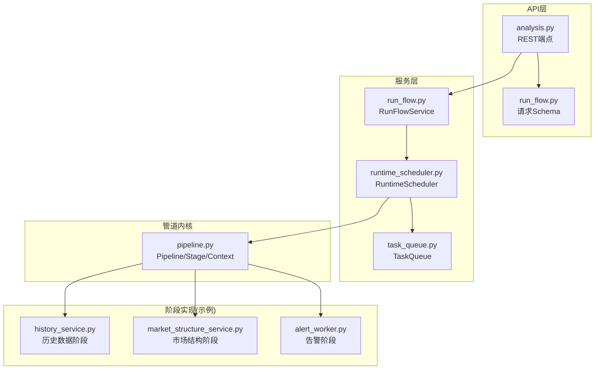
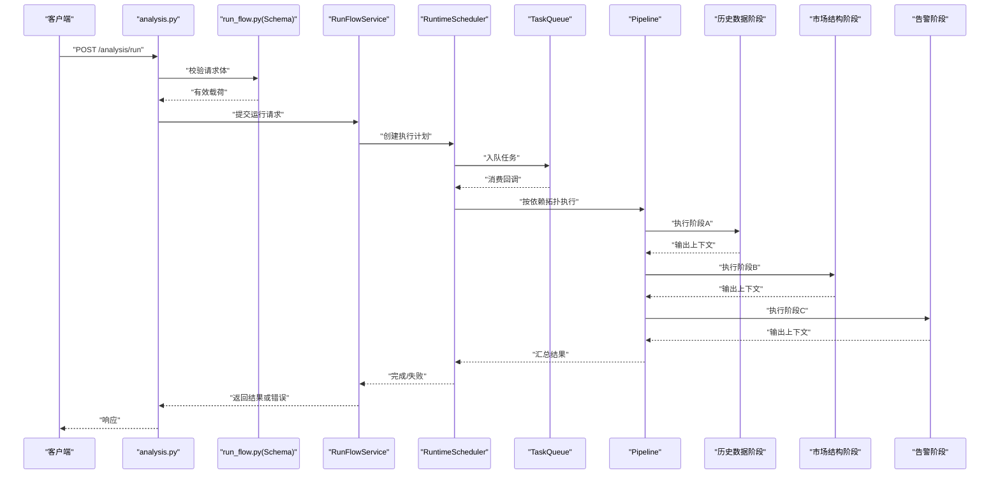
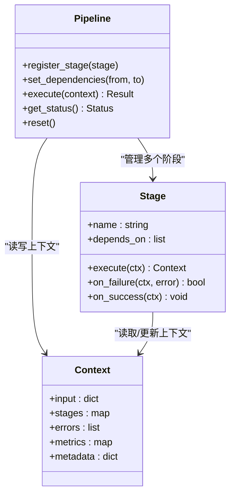
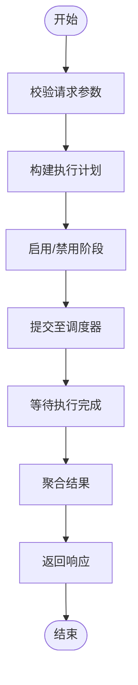
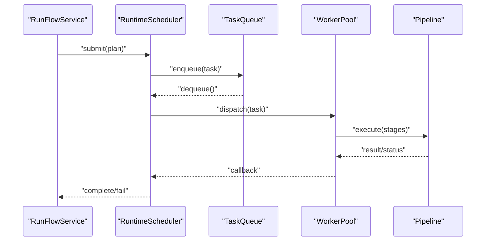
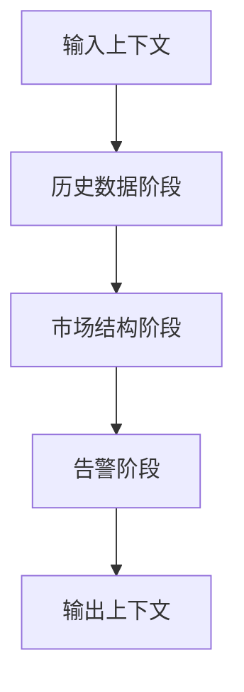
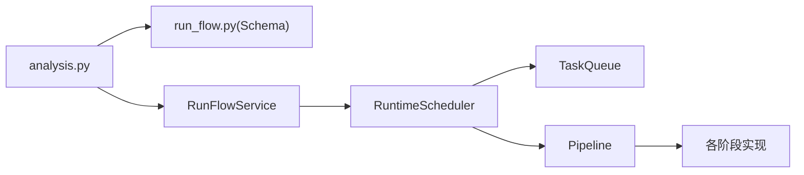

# 管道处理引擎

<cite>
**本文引用的文件**   
- [src/core/pipeline.py](file://src/core/pipeline.py)
- [src/services/run_flow.py](file://src/services/run_flow.py)
- [src/services/runtime_scheduler.py](file://src/services/runtime_scheduler.py)
- [src/services/task_queue.py](file://src/services/task_queue.py)
- [api/v1/endpoints/analysis.py](file://api/v1/endpoints/analysis.py)
- [api/v1/schemas/run_flow.py](file://api/v1/schemas/run_flow.py)
- [src/services/history_service.py](file://src/services/history_service.py)
- [src/services/market_structure_service.py](file://src/services/market_structure_service.py)
- [src/services/alert_worker.py](file://src/services/alert_worker.py)
- [src/logging_config.py](file://src/logging_config.py)
- [tests/test_pipeline_daily_market_context.py](file://tests/test_pipeline_daily_market_context.py)
- [tests/test_pipeline_fetch_error.py](file://tests/test_pipeline_fetch_error.py)
- [tests/test_pipeline_realtime_indicators.py](file://tests/test_pipeline_realtime_indicators.py)
- [tests/test_pipeline_prefetch_dry_run.py](file://tests/test_pipeline_prefetch_dry_run.py)
</cite>

## 目录
1. [简介](#简介)
2. [项目结构](#项目结构)
3. [核心组件](#核心组件)
4. [架构总览](#架构总览)
5. [详细组件分析](#详细组件分析)
6. [依赖关系分析](#依赖关系分析)
7. [性能考量](#性能考量)
8. [故障排查指南](#故障排查指南)
9. [结论](#结论)
10. [附录](#附录)

## 简介
本文件面向Daily Stock Analysis系统的“管道处理引擎”，系统性阐述其管道架构、任务阶段定义、数据流转与状态管理策略，以及调度、依赖解析与执行顺序控制。文档同时覆盖错误处理与重试机制、降级与恢复策略、并行与缓存优化、监控集成方法，并提供调试与性能分析指南。读者可据此快速理解并扩展该管道系统。

## 项目结构
围绕管道引擎的核心代码主要分布在以下模块：
- 管道内核与运行时：src/core/pipeline.py
- 运行编排与服务层：src/services/run_flow.py、src/services/runtime_scheduler.py、src/services/task_queue.py
- API入口与请求模型：api/v1/endpoints/analysis.py、api/v1/schemas/run_flow.py
- 典型阶段实现（示例）：src/services/history_service.py、src/services/market_structure_service.py、src/services/alert_worker.py
- 日志配置：src/logging_config.py
- 测试用例（验证行为与边界）：tests/test_pipeline_*.py

**图示来源** 
- [api/v1/endpoints/analysis.py](file://api/v1/endpoints/analysis.py)
- [api/v1/schemas/run_flow.py](file://api/v1/schemas/run_flow.py)
- [src/services/run_flow.py](file://src/services/run_flow.py)
- [src/services/runtime_scheduler.py](file://src/services/runtime_scheduler.py)
- [src/services/task_queue.py](file://src/services/task_queue.py)
- [src/core/pipeline.py](file://src/core/pipeline.py)
- [src/services/history_service.py](file://src/services/history_service.py)
- [src/services/market_structure_service.py](file://src/services/market_structure_service.py)
- [src/services/alert_worker.py](file://src/services/alert_worker.py)

**章节来源**
- [src/core/pipeline.py](file://src/core/pipeline.py)
- [src/services/run_flow.py](file://src/services/run_flow.py)
- [src/services/runtime_scheduler.py](file://src/services/runtime_scheduler.py)
- [src/services/task_queue.py](file://src/services/task_queue.py)
- [api/v1/endpoints/analysis.py](file://api/v1/endpoints/analysis.py)
- [api/v1/schemas/run_flow.py](file://api/v1/schemas/run_flow.py)

## 核心组件
- 管道内核（Pipeline/Stage/Context）
  - 负责阶段注册、拓扑构建、依赖解析、上下文传递、执行顺序控制与结果聚合。
  - 提供统一的阶段接口，支持异步执行、超时控制、指标采集与可观测性埋点。
- 运行编排（RunFlowService）
  - 将API请求转换为管道执行计划，组装阶段参数，触发调度器。
- 运行时调度器（RuntimeScheduler）
  - 负责任务生命周期管理、并发度控制、重试与退避、资源配额与限流。
- 任务队列（TaskQueue）
  - 提供有界队列、优先级、去重、持久化（可选）、背压与消费者池。
- 阶段实现（示例）
  - 历史数据拉取、市场结构分析、实时指标计算、告警通知等。

**章节来源**
- [src/core/pipeline.py](file://src/core/pipeline.py)
- [src/services/run_flow.py](file://src/services/run_flow.py)
- [src/services/runtime_scheduler.py](file://src/services/runtime_scheduler.py)
- [src/services/task_queue.py](file://src/services/task_queue.py)

## 架构总览
下图展示从HTTP请求到管道执行的端到端流程，包括请求校验、计划生成、调度执行、阶段调用与结果返回。

**图示来源** 
- [api/v1/endpoints/analysis.py](file://api/v1/endpoints/analysis.py)
- [api/v1/schemas/run_flow.py](file://api/v1/schemas/run_flow.py)
- [src/services/run_flow.py](file://src/services/run_flow.py)
- [src/services/runtime_scheduler.py](file://src/services/runtime_scheduler.py)
- [src/services/task_queue.py](file://src/services/task_queue.py)
- [src/core/pipeline.py](file://src/core/pipeline.py)
- [src/services/history_service.py](file://src/services/history_service.py)
- [src/services/market_structure_service.py](file://src/services/market_structure_service.py)
- [src/services/alert_worker.py](file://src/services/alert_worker.py)

## 详细组件分析

### 管道内核（Pipeline/Stage/Context）
- 设计要点
  - 阶段抽象：统一输入/输出契约，支持同步与异步阶段；内置超时、重试、熔断与指标上报。
  - 上下文对象：跨阶段共享的数据载体，包含原始输入、中间产物、元数据与错误信息。
  - 拓扑与依赖：声明式阶段依赖图，自动进行拓扑排序与执行顺序控制。
  - 执行模式：串行、扇出并行、条件分支与回滚（可选）。
  - 可观测性：阶段级耗时、吞吐、错误率、缓存命中率等指标。
- 关键能力
  - 依赖解析：基于DAG的无环检测与执行序列生成。
  - 状态管理：阶段状态机（待执行、执行中、成功、失败、跳过、回滚）。
  - 错误传播：短路失败、部分成功策略、补偿动作。
  - 资源隔离：阶段级线程/进程池、内存上限、CPU亲和（可选）。

**图示来源** 
- [src/core/pipeline.py](file://src/core/pipeline.py)

**章节来源**
- [src/core/pipeline.py](file://src/core/pipeline.py)

### 运行编排（RunFlowService）
- 职责
  - 接收API请求，校验并映射为管道执行参数。
  - 动态组装阶段配置（如窗口、指标、阈值）。
  - 触发调度器并等待结果，封装统一响应格式。
- 关键点
  - 参数校验与默认值填充。
  - 阶段裁剪（按需启用/禁用）。
  - 结果聚合与格式化。

**图示来源** 
- [src/services/run_flow.py](file://src/services/run_flow.py)
- [api/v1/schemas/run_flow.py](file://api/v1/schemas/run_flow.py)

**章节来源**
- [src/services/run_flow.py](file://src/services/run_flow.py)
- [api/v1/schemas/run_flow.py](file://api/v1/schemas/run_flow.py)

### 运行时调度器（RuntimeScheduler）
- 职责
  - 任务生命周期管理：创建、排队、派发、回收。
  - 并发控制：最大并发、队列长度、背压策略。
  - 重试与退避：指数退避、抖动、最大重试次数。
  - 资源管理：线程/进程池、内存限制、超时。
- 关键点
  - 与TaskQueue协作，保证高吞吐与稳定性。
  - 与Pipeline协作，按依赖拓扑派发阶段。
  - 可观测性：任务队列深度、活跃任务数、平均延迟。

**图示来源** 
- [src/services/runtime_scheduler.py](file://src/services/runtime_scheduler.py)
- [src/services/task_queue.py](file://src/services/task_queue.py)
- [src/core/pipeline.py](file://src/core/pipeline.py)

**章节来源**
- [src/services/runtime_scheduler.py](file://src/services/runtime_scheduler.py)
- [src/services/task_queue.py](file://src/services/task_queue.py)

### 任务队列（TaskQueue）
- 特性
  - 有界队列与优先级。
  - 去重键（避免重复执行相同任务）。
  - 持久化（可选，用于崩溃恢复）。
  - 消费者池与负载均衡。
- 使用建议
  - 合理设置队列容量与消费者数量，避免OOM与饥饿。
  - 结合监控指标观察队列积压与消费延迟。

**章节来源**
- [src/services/task_queue.py](file://src/services/task_queue.py)

### 阶段实现（示例）
- 历史数据阶段（HistoryService）
  - 功能：拉取多源历史数据，标准化与清洗，写入上下文。
  - 容错：多源降级、缓存命中优先、超时重试。
- 市场结构阶段（MarketStructureService）
  - 功能：计算趋势、波动、支撑阻力等结构特征。
  - 性能：向量化计算、增量更新。
- 告警阶段（AlertWorker）
  - 功能：规则匹配、阈值判断、消息路由与发送。
  - 可靠性：幂等发送、失败重试、死信队列。

**图示来源** 
- [src/services/history_service.py](file://src/services/history_service.py)
- [src/services/market_structure_service.py](file://src/services/market_structure_service.py)
- [src/services/alert_worker.py](file://src/services/alert_worker.py)

**章节来源**
- [src/services/history_service.py](file://src/services/history_service.py)
- [src/services/market_structure_service.py](file://src/services/market_structure_service.py)
- [src/services/alert_worker.py](file://src/services/alert_worker.py)

## 依赖关系分析
- 组件耦合
  - API层仅依赖Schema与RunFlowService，保持薄控制器。
  - RunFlowService依赖RuntimeScheduler与Pipeline，解耦执行细节。
  - RuntimeScheduler依赖TaskQueue与Pipeline，屏蔽并发与拓扑。
- 外部依赖
  - 数据源（历史/实时）、LLM、通知渠道等通过阶段抽象隔离。
- 潜在循环依赖
  - 通过接口与事件回调避免直接循环引用。

**图示来源** 
- [api/v1/endpoints/analysis.py](file://api/v1/endpoints/analysis.py)
- [api/v1/schemas/run_flow.py](file://api/v1/schemas/run_flow.py)
- [src/services/run_flow.py](file://src/services/run_flow.py)
- [src/services/runtime_scheduler.py](file://src/services/runtime_scheduler.py)
- [src/services/task_queue.py](file://src/services/task_queue.py)
- [src/core/pipeline.py](file://src/core/pipeline.py)

**章节来源**
- [api/v1/endpoints/analysis.py](file://api/v1/endpoints/analysis.py)
- [api/v1/schemas/run_flow.py](file://api/v1/schemas/run_flow.py)
- [src/services/run_flow.py](file://src/services/run_flow.py)
- [src/services/runtime_scheduler.py](file://src/services/runtime_scheduler.py)
- [src/services/task_queue.py](file://src/services/task_queue.py)
- [src/core/pipeline.py](file://src/core/pipeline.py)

## 性能考量
- 并行处理
  - 阶段内并行：对独立标的或指标进行扇出计算。
  - 阶段间并行：无依赖的阶段可并发执行。
  - 资源隔离：为I/O密集与CPU密集阶段分配不同池。
- 缓存策略
  - 数据层缓存：历史数据、因子计算结果、LLM响应。
  - 查询去重：基于键的去重与TTL失效。
  - 预取与干跑：提前拉取数据与dry-run评估可行性。
- 资源管理
  - 连接池、线程池大小调优。
  - 内存上限与垃圾回收策略。
  - 背压与限流保护下游。
- 监控与可观测性
  - 阶段级指标：耗时、吞吐、错误率、缓存命中率。
  - 链路追踪：请求ID贯穿全链路。
  - 日志分级与采样。

[本节为通用指导，不直接分析具体文件]

## 故障排查指南
- 常见问题定位
  - 阶段失败：查看阶段日志与上下文错误字段。
  - 队列积压：检查消费者数量、任务复杂度与下游延迟。
  - 超时与重试：确认超时阈值与退避策略是否合理。
  - 缓存未命中：检查键生成逻辑与TTL设置。
- 调试工具
  - 启用详细日志与Trace ID。
  - 使用dry-run模式验证阶段依赖与参数。
  - 单步执行与断点注入（测试环境）。
- 恢复策略
  - 幂等执行与补偿动作。
  - 失败任务重放与死信队列。
  - 降级路径（如只读模式、简化计算）。

**章节来源**
- [src/logging_config.py](file://src/logging_config.py)
- [tests/test_pipeline_fetch_error.py](file://tests/test_pipeline_fetch_error.py)
- [tests/test_pipeline_prefetch_dry_run.py](file://tests/test_pipeline_prefetch_dry_run.py)

## 结论
该管道处理引擎以声明式阶段与DAG拓扑为核心，配合调度器与任务队列实现了高可用、可扩展的Daily Stock Analysis流水线。通过严格的上下文契约、完善的错误处理与重试机制、以及丰富的性能优化手段，系统在复杂多源数据与高并发场景下保持稳定与高效。建议在生产环境中结合监控与日志完善可观测性，并根据业务负载持续调优并发与缓存策略。

[本节为总结性内容，不直接分析具体文件]

## 附录
- 管道配置示例（说明）
  - 在API请求体中指定阶段开关、参数与依赖关系。
  - 参考请求Schema定义进行构造。
- 自定义阶段实现（说明）
  - 实现阶段接口，定义输入/输出契约与错误处理。
  - 注册到Pipeline并声明依赖。
- 监控集成（说明）
  - 接入指标采集与链路追踪，暴露关键指标。
  - 在阶段钩子中记录关键事件。

**章节来源**
- [api/v1/schemas/run_flow.py](file://api/v1/schemas/run_flow.py)
- [src/core/pipeline.py](file://src/core/pipeline.py)
- [src/logging_config.py](file://src/logging_config.py)