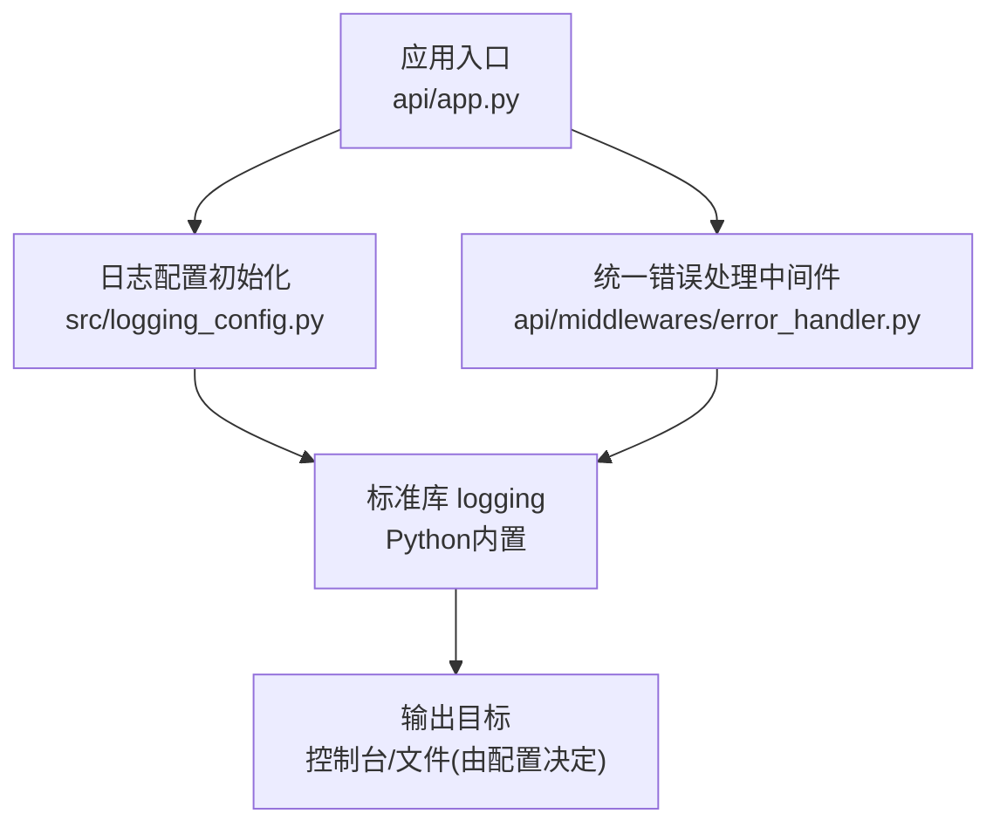
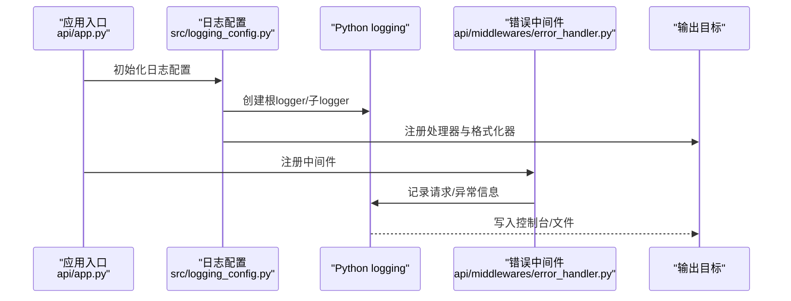
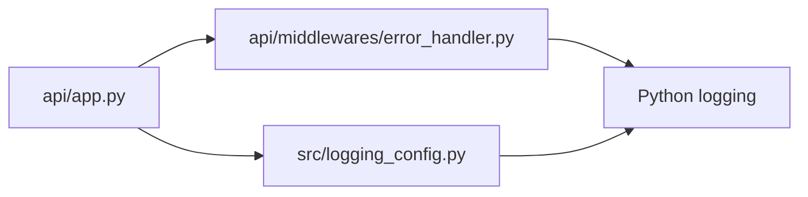

# 日志系统

<cite>
**本文引用的文件**   
- [logging_config.py](file://src/logging_config.py)
- [app.py](file://api/app.py)
- [error_handler.py](file://api/middlewares/error_handler.py)
- [test_logging_config.py](file://tests/test_logging_config.py)
</cite>

## 目录
1. [简介](#简介)
2. [项目结构](#项目结构)
3. [核心组件](#核心组件)
4. [架构总览](#架构总览)
5. [详细组件分析](#详细组件分析)
6. [依赖关系分析](#依赖关系分析)
7. [性能考虑](#性能考虑)
8. [故障排查指南](#故障排查指南)
9. [结论](#结论)
10. [附录](#附录)

## 简介
本章节概述 Daily Stock Analysis 系统的日志子系统目标与范围：提供统一的日志配置入口、灵活的级别与格式化策略、可扩展的输出目标（控制台/文件），并贯穿 API 请求、业务操作与错误处理等关键路径，为集中式采集、轮转与性能优化奠定基础。

## 项目结构
日志相关代码主要位于后端服务启动与中间件层，核心配置文件在 src/logging_config.py，API 应用入口在 api/app.py，统一错误处理在 api/middlewares/error_handler.py。测试覆盖集中在 tests/test_logging_config.py。

图表来源
- [app.py:1-200](file://api/app.py#L1-L200)
- [logging_config.py:1-200](file://src/logging_config.py#L1-L200)
- [error_handler.py:1-200](file://api/middlewares/error_handler.py#L1-L200)

章节来源
- [app.py:1-200](file://api/app.py#L1-L200)
- [logging_config.py:1-200](file://src/logging_config.py#L1-L200)
- [error_handler.py:1-200](file://api/middlewares/error_handler.py#L1-L200)

## 核心组件
- 日志配置模块：负责加载配置、创建根 logger、注册处理器与格式化器，确保多模块共享一致的日志行为。
- 应用入口：在服务启动时调用日志配置初始化，保证所有后续模块使用统一日志实例。
- 错误处理中间件：捕获异常、记录结构化错误日志，并返回统一响应格式。
- 测试用例：验证日志级别、格式化与输出目标是否符合预期。

章节来源
- [logging_config.py:1-200](file://src/logging_config.py#L1-L200)
- [app.py:1-200](file://api/app.py#L1-L200)
- [error_handler.py:1-200](file://api/middlewares/error_handler.py#L1-L200)
- [test_logging_config.py:1-200](file://tests/test_logging_config.py#L1-L200)

## 架构总览
日志子系统采用“配置驱动 + 标准库”的轻量架构：通过单一配置模块生成 logger 树，API 层与业务层按需获取对应命名空间的 logger；错误中间件作为横切关注点统一记录异常上下文。

图表来源
- [app.py:1-200](file://api/app.py#L1-L200)
- [logging_config.py:1-200](file://src/logging_config.py#L1-L200)
- [error_handler.py:1-200](file://api/middlewares/error_handler.py#L1-L200)

## 详细组件分析

### 日志配置模块（src/logging_config.py）
- 职责
  - 读取配置项（如日志级别、输出目标、格式化模板）。
  - 构建根 logger 与常用子 logger（如 API、业务、数据源等）。
  - 注册处理器（控制台、文件）与格式化器（时间戳、级别、模块名、消息体）。
  - 暴露统一的初始化函数供应用入口调用。
- 设计要点
  - 避免重复注册处理器导致重复输出。
  - 支持按模块设置不同级别，便于调试与生产切换。
  - 将敏感字段脱敏或限制长度，降低 I/O 压力。
- 扩展点
  - 新增输出目标（如远程日志服务）只需添加处理器并注册到根 logger。
  - 自定义格式化器以适配集中式日志平台（JSON 行模式等）。

章节来源
- [logging_config.py:1-200](file://src/logging_config.py#L1-L200)

### 应用入口（api/app.py）
- 职责
  - 启动时调用日志配置初始化，确保全局 logger 可用。
  - 注册中间件（含错误处理），使每个请求进入统一记录链路。
- 关键点
  - 初始化顺序：先配置日志，再创建路由与中间件。
  - 环境差异：开发/测试/生产可通过环境变量控制级别与输出。

章节来源
- [app.py:1-200](file://api/app.py#L1-L200)

### 统一错误处理中间件（api/middlewares/error_handler.py）
- 职责
  - 捕获未处理异常，记录结构化错误日志（包含请求 ID、路径、状态码、堆栈摘要等）。
  - 返回统一错误响应，避免泄露内部细节。
- 关键点
  - 区分客户端错误与服务端错误，调整日志级别。
  - 对大对象进行截断或过滤，防止日志膨胀。
  - 与日志配置联动，确保错误日志可被正确收集与检索。

章节来源
- [error_handler.py:1-200](file://api/middlewares/error_handler.py#L1-L200)

### 测试覆盖（tests/test_logging_config.py）
- 验证内容
  - 日志级别是否按配置生效。
  - 格式化器是否包含必要字段。
  - 输出目标是否正确注册且无重复。
- 价值
  - 保障日志配置变更不会破坏现有行为。
  - 为新输出目标或格式化器提供回归基线。

章节来源
- [test_logging_config.py:1-200](file://tests/test_logging_config.py#L1-L200)

## 依赖关系分析
- 模块耦合
  - 应用入口依赖日志配置模块完成初始化。
  - 错误中间件依赖 Python 标准库 logging，并通过配置模块提供的 logger 树记录。
- 外部依赖
  - 仅依赖 Python 标准库 logging，保持轻量与可移植性。
- 潜在风险
  - 若多处直接 import logging 而未走统一配置，可能导致输出不一致。
  - 处理器重复注册会引发重复输出，需确保只初始化一次。

图表来源
- [app.py:1-200](file://api/app.py#L1-L200)
- [logging_config.py:1-200](file://src/logging_config.py#L1-L200)
- [error_handler.py:1-200](file://api/middlewares/error_handler.py#L1-L200)

章节来源
- [app.py:1-200](file://api/app.py#L1-L200)
- [logging_config.py:1-200](file://src/logging_config.py#L1-L200)
- [error_handler.py:1-200](file://api/middlewares/error_handler.py#L1-L200)

## 性能考虑
- 日志级别控制
  - 生产环境默认 INFO/WARNING，仅在问题定位时临时提升 DEBUG。
- 格式化开销
  - 优先使用固定模板，避免复杂字符串拼接；必要时启用懒格式化。
- I/O 优化
  - 文件输出建议异步或批量写入；集中式采集建议使用网络缓冲。
- 采样与限流
  - 高频事件（如心跳、健康检查）可采用采样策略，减少冗余。
- 资源保护
  - 对超大请求体/响应体进行截断，避免单条日志过大。

[本节为通用指导，不直接分析具体文件]

## 故障排查指南
- 常见问题
  - 日志未输出：检查是否在应用入口调用了日志配置初始化；确认处理器已注册。
  - 重复输出：确认未多次初始化日志配置；避免重复添加处理器。
  - 级别无效：核对环境变量或配置项优先级；检查子 logger 是否覆盖了父级级别。
  - 错误未记录：确认错误中间件已注册且未被其他中间件吞掉异常。
- 快速定位
  - 在错误中间件中增加请求上下文（如请求 ID、路径、方法）。
  - 临时提升级别至 DEBUG 并聚焦特定模块的 logger。
  - 使用测试用例复现并对比期望行为。

章节来源
- [error_handler.py:1-200](file://api/middlewares/error_handler.py#L1-L200)
- [test_logging_config.py:1-200](file://tests/test_logging_config.py#L1-L200)

## 结论
本日志系统以最小依赖实现高内聚、低耦合的配置与记录能力，配合统一错误中间件，满足日常开发与生产监控需求。通过模块化配置与清晰的职责划分，易于扩展至集中式采集与更复杂的轮转策略。

[本节为总结性内容，不直接分析具体文件]

## 附录

### 日志级别与格式化策略
- 级别建议
  - 开发：DEBUG
  - 测试：INFO
  - 生产：INFO/WARNING（按需开启 ERROR）
- 格式化建议
  - 包含时间戳、级别、模块名、消息体。
  - 可选：请求 ID、用户标识、耗时、状态码（用于 API 场景）。
  - 生产推荐 JSON 行模式，便于集中式解析。

[本节为通用指导，不直接分析具体文件]

### 输出目标与轮转
- 本地文件
  - 按天或大小轮转，保留最近 N 份，压缩归档。
- 集中式采集
  - 通过 stdout 输出 JSON 行，由日志代理（如 Filebeat/Fluent Bit）转发至 ES/Loki。
- 性能优化
  - 使用异步写入、批量发送、连接池与重试退避。

[本节为通用指导，不直接分析具体文件]

### 模块日志规范
- API 请求日志
  - 记录方法、路径、查询参数（脱敏）、状态码、耗时。
  - 错误分支记录堆栈摘要与上下文。
- 业务操作日志
  - 记录关键步骤、输入摘要、结果与耗时。
  - 避免记录敏感数据。
- 错误日志
  - 统一错误码与消息模板，附带追踪 ID。
  - 区分客户端错误与服务端错误级别。

[本节为通用指导，不直接分析具体文件]

### 查询与分析最佳实践
- 常用查询模式
  - 按时间窗口统计错误率与 P95/P99 耗时。
  - 按模块/接口维度聚合失败次数与慢请求。
  - 关联追踪 ID 串联跨服务调用链。
- 性能监控指标
  - 日志吞吐（条/秒）、平均延迟、I/O 占用。
  - 采样率与丢弃率（如有限流）。
  - 文件大小与轮转频率。

[本节为通用指导，不直接分析具体文件]

### 配置示例与使用场景
- 示例一：本地开发
  - 级别：DEBUG；输出：控制台；格式：人类可读。
  - 场景：快速定位问题，查看详细调用轨迹。
- 示例二：生产环境
  - 级别：INFO；输出：stdout JSON；采集：日志代理转发。
  - 场景：集中式存储、告警与报表。
- 示例三：高并发批处理
  - 级别：WARNING；采样：开启；输出：异步文件。
  - 场景：降低 I/O 压力，保留关键错误与警告。

[本节为通用指导，不直接分析具体文件]