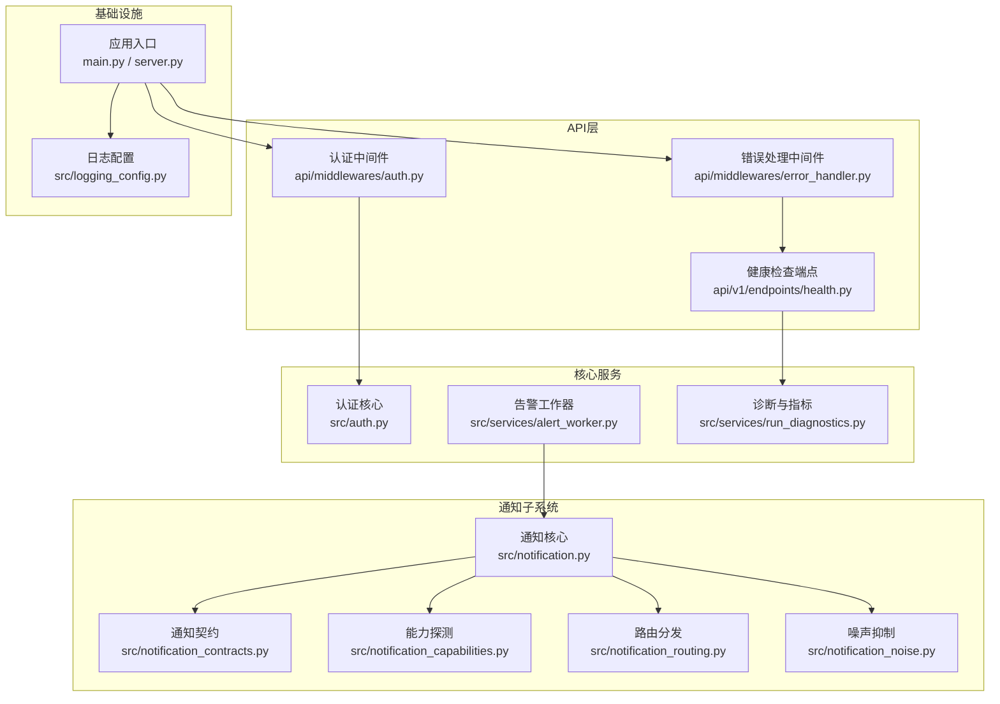
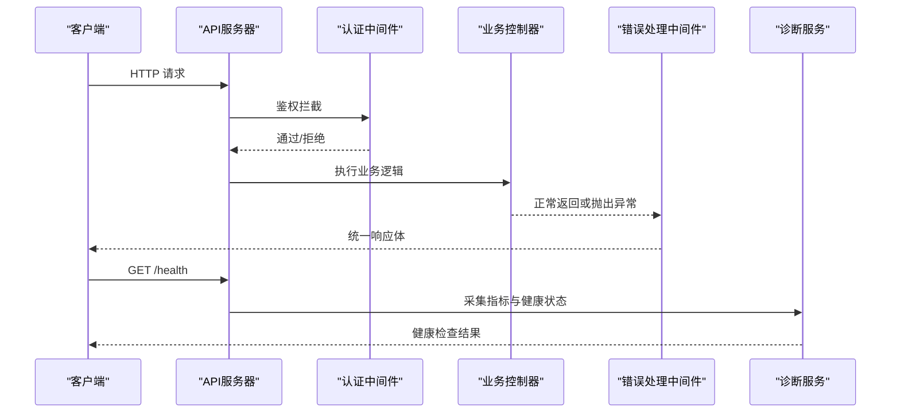
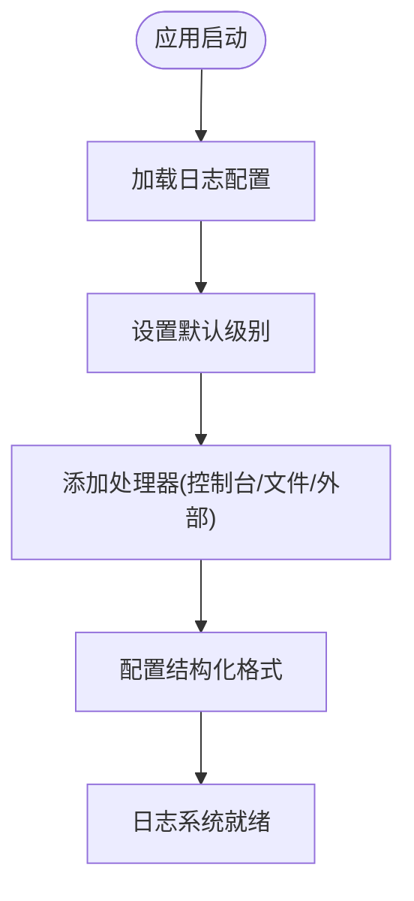
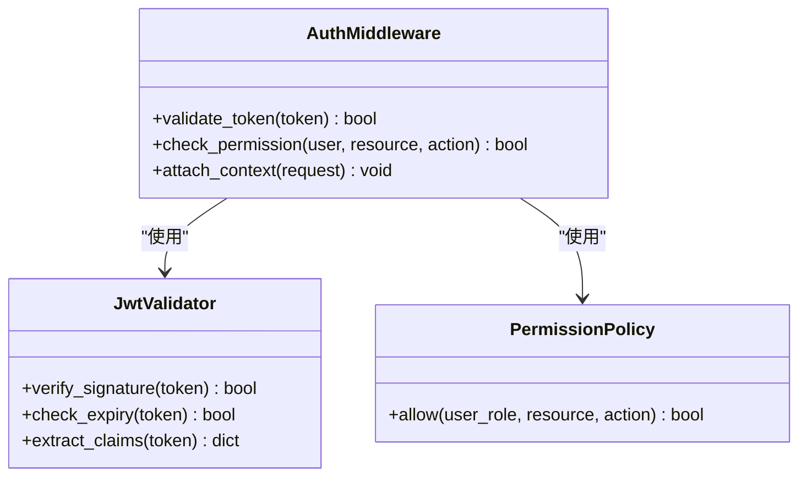
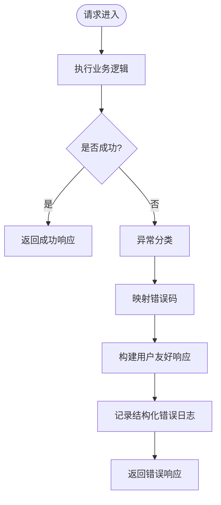
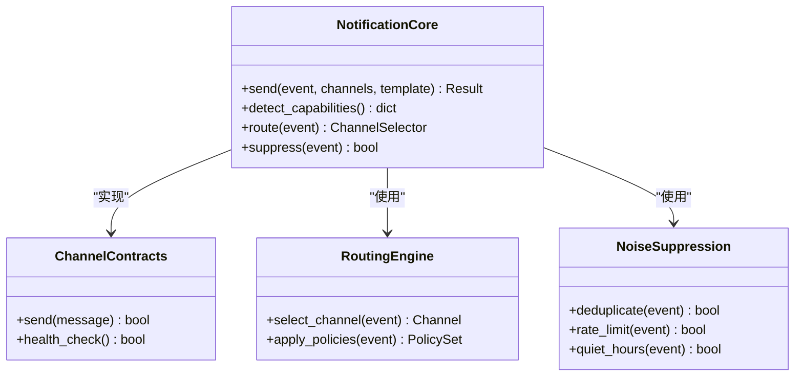
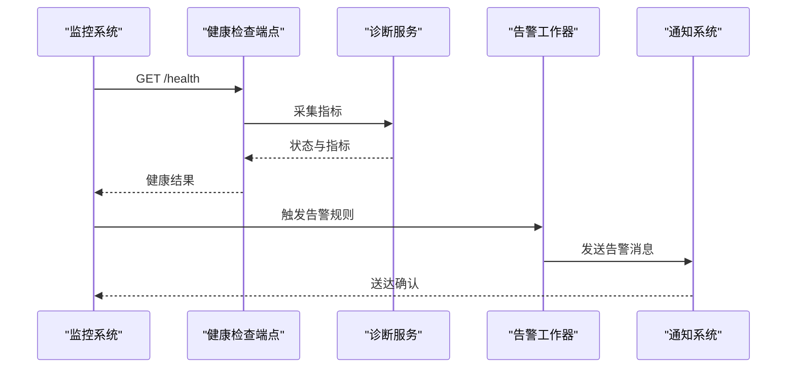
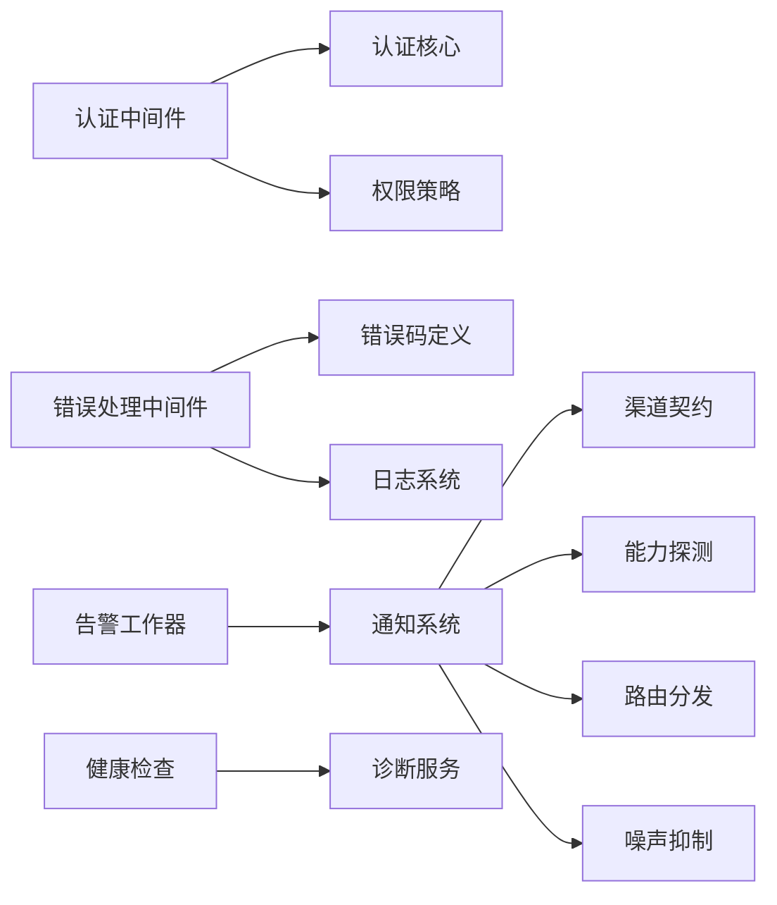

# 横切关注点设计

<cite>
**本文引用的文件**   
- [logging_config.py](file://src/logging_config.py)
- [auth.py](file://src/auth.py)
- [api/middlewares/auth.py](file://api/middlewares/auth.py)
- [api/middlewares/error_handler.py](file://api/middlewares/error_handler.py)
- [api/v1/errors.py](file://api/v1/errors.py)
- [notification.py](file://src/notification.py)
- [notification_capabilities.py](file://src/notification_capabilities.py)
- [notification_contracts.py](file://src/notification_contracts.py)
- [notification_noise.py](file://src/notification_noise.py)
- [notification_routing.py](file://src/notification_routing.py)
- [services/alert_worker.py](file://src/services/alert_worker.py)
- [services/alert_service.py](file://src/services/alert_service.py)
- [services/run_diagnostics.py](file://src/services/run_diagnostics.py)
- [api/v1/endpoints/health.py](file://api/v1/endpoints/health.py)
- [main.py](file://main.py)
- [server.py](file://server.py)
</cite>

## 目录
1. [简介](#简介)
2. [项目结构](#项目结构)
3. [核心组件](#核心组件)
4. [架构总览](#架构总览)
5. [详细组件分析](#详细组件分析)
6. [依赖关系分析](#依赖关系分析)
7. [性能考虑](#性能考虑)
8. [故障排查指南](#故障排查指南)
9. [结论](#结论)
10. [附录](#附录)

## 简介
本文件聚焦 Daily Stock Analysis 系统的横切关注点设计，围绕日志记录、认证授权中间件、错误处理机制、通知系统以及监控与告警进行系统化说明。文档旨在帮助开发者快速理解各横切能力的职责边界、数据流与控制流，并提供配置与使用示例，便于在现有代码基础上扩展与维护。

## 项目结构
横切关注点在系统中的分布：
- 日志记录：集中式配置与格式化策略位于 src/logging_config.py；应用启动时统一挂载。
- 认证授权：JWT 校验与权限控制通过 api/middlewares/auth.py 实现，业务入口由 src/auth.py 提供基础能力。
- 错误处理：全局异常捕获与统一响应格式位于 api/middlewares/error_handler.py，错误码定义集中在 api/v1/errors.py。
- 通知系统：抽象契约、能力探测、噪声抑制与路由分发位于 src/notification*.py，任务执行由 services/alert_worker.py 驱动。
- 监控与告警：健康检查端点位于 api/v1/endpoints/health.py，诊断与指标收集由 services/run_diagnostics.py 提供。

图表来源
- [logging_config.py:1-200](file://src/logging_config.py#L1-L200)
- [auth.py:1-200](file://src/auth.py#L1-L200)
- [api/middlewares/auth.py:1-200](file://api/middlewares/auth.py#L1-L200)
- [api/middlewares/error_handler.py:1-200](file://api/middlewares/error_handler.py#L1-L200)
- [api/v1/errors.py:1-200](file://api/v1/errors.py#L1-L200)
- [notification.py:1-200](file://src/notification.py#L1-L200)
- [notification_capabilities.py:1-200](file://src/notification_capabilities.py#L1-L200)
- [notification_contracts.py:1-200](file://src/notification_contracts.py#L1-L200)
- [notification_noise.py:1-200](file://src/notification_noise.py#L1-L200)
- [notification_routing.py:1-200](file://src/notification_routing.py#L1-L200)
- [services/alert_worker.py:1-200](file://src/services/alert_worker.py#L1-L200)
- [services/run_diagnostics.py:1-200](file://src/services/run_diagnostics.py#L1-L200)
- [api/v1/endpoints/health.py:1-200](file://api/v1/endpoints/health.py#L1-L200)
- [main.py:1-200](file://main.py#L1-L200)
- [server.py:1-200](file://server.py#L1-L200)

章节来源
- [main.py:1-200](file://main.py#L1-L200)
- [server.py:1-200](file://server.py#L1-L200)

## 核心组件
- 日志记录系统：统一初始化、分级输出、结构化字段与集中式收集（文件/控制台/外部系统）。
- 认证授权中间件：基于 JWT 的令牌验证、角色/权限判定、会话状态管理。
- 错误处理机制：异常分类、错误码规范、用户友好响应体与调试信息隔离。
- 通知系统：多渠道发送、消息模板、去重与限流、按条件路由。
- 监控与告警：健康检查、关键指标采集、诊断工具集成。

章节来源
- [logging_config.py:1-200](file://src/logging_config.py#L1-L200)
- [api/middlewares/auth.py:1-200](file://api/middlewares/auth.py#L1-L200)
- [api/middlewares/error_handler.py:1-200](file://api/middlewares/error_handler.py#L1-L200)
- [api/v1/errors.py:1-200](file://api/v1/errors.py#L1-L200)
- [notification.py:1-200](file://src/notification.py#L1-L200)
- [services/alert_worker.py:1-200](file://src/services/alert_worker.py#L1-L200)
- [api/v1/endpoints/health.py:1-200](file://api/v1/endpoints/health.py#L1-L200)

## 架构总览
横切能力以“中间件 + 服务”的方式嵌入请求生命周期与后台任务流程中：
- 请求进入后先经过认证中间件，再进入业务控制器；任何未捕获异常由错误处理中间件统一收敛。
- 通知任务由工作器调度，依据渠道能力、路由规则与噪声抑制策略决定最终投递。
- 健康检查端点暴露系统就绪性，诊断服务聚合关键指标供外部监控拉取。

图表来源
- [api/middlewares/auth.py:1-200](file://api/middlewares/auth.py#L1-L200)
- [api/middlewares/error_handler.py:1-200](file://api/middlewares/error_handler.py#L1-L200)
- [api/v1/endpoints/health.py:1-200](file://api/v1/endpoints/health.py#L1-L200)
- [services/run_diagnostics.py:1-200](file://src/services/run_diagnostics.py#L1-L200)

## 详细组件分析

### 日志记录系统
- 日志级别：支持 DEBUG/INFO/WARNING/ERROR 等分级，按模块或请求上下文动态调整。
- 格式化策略：结构化 JSON 输出，包含时间戳、级别、模块名、请求ID、耗时等字段，便于集中式收集与分析。
- 集中式收集：可对接外部日志平台（如文件系统、标准输出、HTTP 推送），通过环境变量或配置文件启用。
- 使用建议：在关键路径埋点（数据获取、模型推理、通知发送）并关联请求ID，便于链路追踪。

图表来源
- [logging_config.py:1-200](file://src/logging_config.py#L1-L200)

章节来源
- [logging_config.py:1-200](file://src/logging_config.py#L1-L200)

### 认证授权中间件
- JWT 令牌验证：解析 Header/Body 中的令牌，校验签名、过期时间与受众，失败则返回统一错误。
- 权限控制：基于角色或资源权限判断，结合请求路径与方法进行细粒度访问控制。
- 会话管理：维护最小化会话状态（如用户标识、租户ID），避免频繁查询数据库。
- 集成方式：作为 FastAPI/Starlette 中间件注册，优先于业务逻辑执行。

图表来源
- [api/middlewares/auth.py:1-200](file://api/middlewares/auth.py#L1-L200)
- [src/auth.py:1-200](file://src/auth.py#L1-L200)

章节来源
- [api/middlewares/auth.py:1-200](file://api/middlewares/auth.py#L1-L200)
- [src/auth.py:1-200](file://src/auth.py#L1-L200)

### 错误处理机制
- 异常分类：将异常分为业务异常、参数校验异常、外部依赖异常与未知异常，分别映射到不同错误码。
- 错误码规范：统一的错误码前缀与层级，便于前端识别与国际化展示。
- 用户友好响应：对外仅返回必要信息，内部保留堆栈与上下文用于调试；敏感信息不泄露。
- 中间件集成：全局捕获未处理异常，转换为标准响应体并记录结构化日志。

图表来源
- [api/middlewares/error_handler.py:1-200](file://api/middlewares/error_handler.py#L1-L200)
- [api/v1/errors.py:1-200](file://api/v1/errors.py#L1-L200)

章节来源
- [api/middlewares/error_handler.py:1-200](file://api/middlewares/error_handler.py#L1-L200)
- [api/v1/errors.py:1-200](file://api/v1/errors.py#L1-L200)

### 通知系统
- 多渠道支持：邮件、即时通讯（钉钉、飞书、Discord、Telegram 等）、Webhook、第三方推送服务。
- 消息模板：支持 Markdown/HTML/纯文本模板，变量替换与本地化。
- 发送策略：异步队列、重试与退避、失败降级、批量合并。
- 能力探测：运行时检测渠道可用性，动态选择可用通道。
- 噪声抑制：去重、限流、静默时段、阈值过滤，避免告警风暴。
- 路由分发：根据事件类型、标签、优先级与目标受众选择最佳通道。

图表来源
- [notification.py:1-200](file://src/notification.py#L1-L200)
- [notification_contracts.py:1-200](file://src/notification_contracts.py#L1-L200)
- [notification_capabilities.py:1-200](file://src/notification_capabilities.py#L1-L200)
- [notification_routing.py:1-200](file://src/notification_routing.py#L1-L200)
- [notification_noise.py:1-200](file://src/notification_noise.py#L1-L200)

章节来源
- [notification.py:1-200](file://src/notification.py#L1-L200)
- [notification_contracts.py:1-200](file://src/notification_contracts.py#L1-L200)
- [notification_capabilities.py:1-200](file://src/notification_capabilities.py#L1-L200)
- [notification_routing.py:1-200](file://src/notification_routing.py#L1-L200)
- [notification_noise.py:1-200](file://src/notification_noise.py#L1-L200)

### 监控与告警
- 健康检查：暴露 /health 端点，返回服务状态、依赖项状态与版本信息。
- 指标收集：CPU/内存、请求延迟、错误率、队列长度、渠道发送成功率等。
- 诊断工具：运行环境自检、配置校验、依赖连通性测试。
- 告警触发：基于阈值与趋势变化生成告警事件，进入通知系统分发。

图表来源
- [api/v1/endpoints/health.py:1-200](file://api/v1/endpoints/health.py#L1-L200)
- [services/run_diagnostics.py:1-200](file://src/services/run_diagnostics.py#L1-L200)
- [services/alert_worker.py:1-200](file://src/services/alert_worker.py#L1-L200)
- [notification.py:1-200](file://src/notification.py#L1-L200)

章节来源
- [api/v1/endpoints/health.py:1-200](file://api/v1/endpoints/health.py#L1-L200)
- [services/run_diagnostics.py:1-200](file://src/services/run_diagnostics.py#L1-L200)
- [services/alert_worker.py:1-200](file://src/services/alert_worker.py#L1-L200)

## 依赖关系分析
横切组件之间的耦合与协作：
- 认证中间件依赖认证核心与权限策略，对请求上下文注入用户信息。
- 错误处理中间件依赖错误码定义与日志系统，确保一致的错误响应。
- 通知系统依赖渠道契约、能力探测、路由与噪声抑制，保证可靠投递。
- 监控与告警依赖健康检查与诊断服务，为通知系统提供触发源。

图表来源
- [api/middlewares/auth.py:1-200](file://api/middlewares/auth.py#L1-L200)
- [src/auth.py:1-200](file://src/auth.py#L1-L200)
- [api/middlewares/error_handler.py:1-200](file://api/middlewares/error_handler.py#L1-L200)
- [api/v1/errors.py:1-200](file://api/v1/errors.py#L1-L200)
- [notification.py:1-200](file://src/notification.py#L1-L200)
- [notification_contracts.py:1-200](file://src/notification_contracts.py#L1-L200)
- [notification_capabilities.py:1-200](file://src/notification_capabilities.py#L1-L200)
- [notification_routing.py:1-200](file://src/notification_routing.py#L1-L200)
- [notification_noise.py:1-200](file://src/notification_noise.py#L1-L200)
- [api/v1/endpoints/health.py:1-200](file://api/v1/endpoints/health.py#L1-L200)
- [services/run_diagnostics.py:1-200](file://src/services/run_diagnostics.py#L1-L200)
- [services/alert_worker.py:1-200](file://src/services/alert_worker.py#L1-L200)

章节来源
- [api/middlewares/auth.py:1-200](file://api/middlewares/auth.py#L1-L200)
- [api/middlewares/error_handler.py:1-200](file://api/middlewares/error_handler.py#L1-L200)
- [api/v1/errors.py:1-200](file://api/v1/errors.py#L1-L200)
- [notification.py:1-200](file://src/notification.py#L1-L200)
- [api/v1/endpoints/health.py:1-200](file://api/v1/endpoints/health.py#L1-L200)
- [services/alert_worker.py:1-200](file://src/services/alert_worker.py#L1-L200)
- [services/run_diagnostics.py:1-200](file://src/services/run_diagnostics.py#L1-L200)

## 性能考虑
- 日志写入采用异步与缓冲策略，避免阻塞主线程；高吞吐场景下建议开启批处理与采样。
- JWT 校验应缓存公钥与黑名单，减少重复计算与网络开销。
- 错误处理中间件应避免在高频路径中进行重型操作，保持响应时间稳定。
- 通知发送采用异步队列与连接池，配合退避重试与熔断，降低下游压力。
- 健康检查与指标采集需轻量实现，避免影响核心业务。

[本节为通用指导，无需特定文件引用]

## 故障排查指南
- 认证失败：检查 JWT 签名、过期时间、权限策略配置；查看认证中间件日志与错误码。
- 错误响应异常：核对错误码映射与中间件顺序；确认敏感信息未泄露。
- 通知未送达：检查渠道能力探测结果、路由规则与噪声抑制策略；查看发送重试与失败原因。
- 健康检查异常：运行诊断服务定位依赖问题；检查指标采集与阈值配置。

章节来源
- [api/middlewares/auth.py:1-200](file://api/middlewares/auth.py#L1-L200)
- [api/middlewares/error_handler.py:1-200](file://api/middlewares/error_handler.py#L1-L200)
- [api/v1/errors.py:1-200](file://api/v1/errors.py#L1-L200)
- [notification.py:1-200](file://src/notification.py#L1-L200)
- [services/run_diagnostics.py:1-200](file://src/services/run_diagnostics.py#L1-L200)

## 结论
Daily Stock Analysis 的横切关注点通过中间件与服务解耦，形成清晰的责任边界与可扩展的架构。日志、认证、错误处理、通知与监控各司其职，既保障系统稳定性，又提升可观测性与可维护性。建议在新增功能时遵循既有模式，确保横切能力的一致性与可靠性。

[本节为总结性内容，无需特定文件引用]

## 附录
- 配置示例要点：
  - 日志：设置级别、输出目标、结构化字段与采样率。
  - 认证：JWT 密钥、算法、令牌有效期与权限策略。
  - 错误：错误码前缀、国际化文案与调试开关。
  - 通知：渠道凭据、模板变量、路由规则与限流策略。
  - 监控：健康检查路径、指标采集频率与告警阈值。
- 使用建议：
  - 在关键路径添加结构化日志，关联请求ID。
  - 使用统一错误码与响应体，便于前端处理。
  - 通过能力探测与路由规则动态选择通知渠道。
  - 定期运行诊断服务，确保依赖健康与配置正确。

[本节为补充说明，无需特定文件引用]