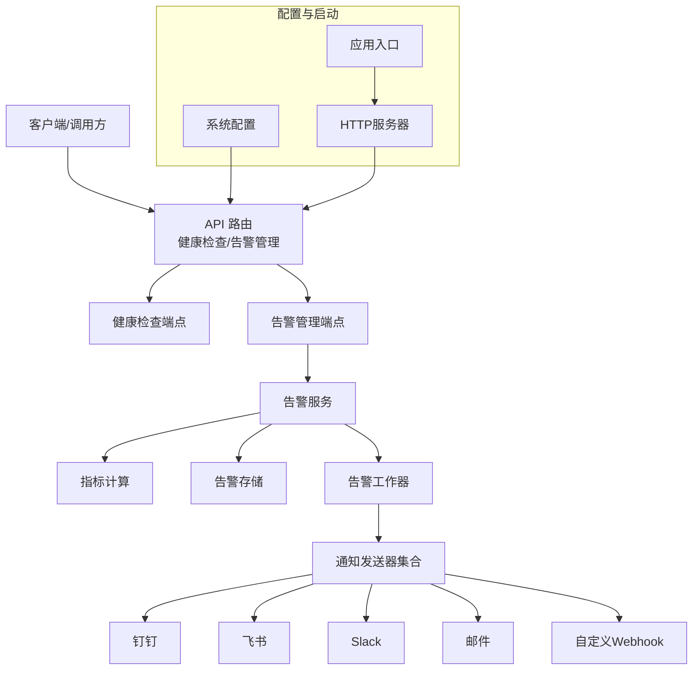
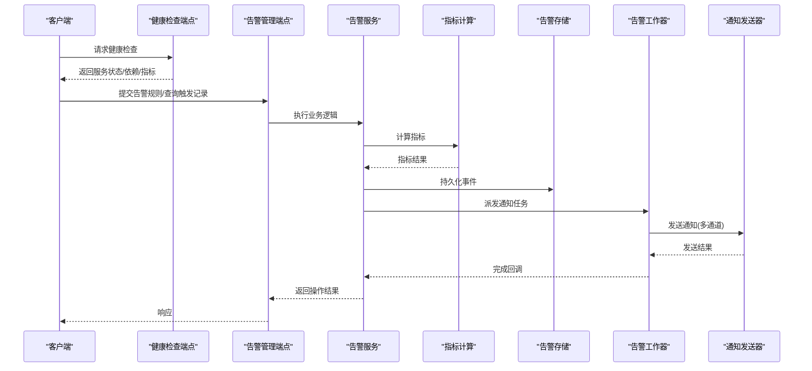
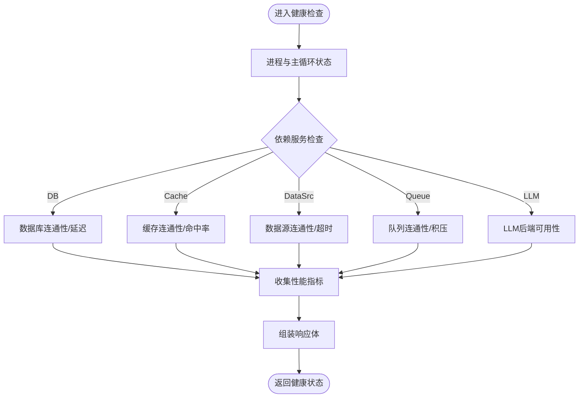
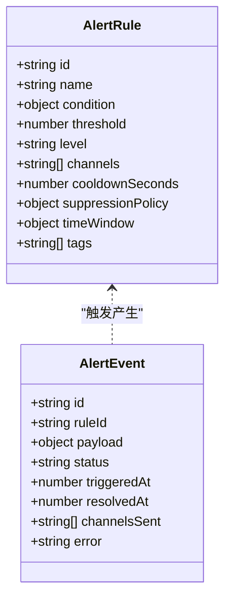
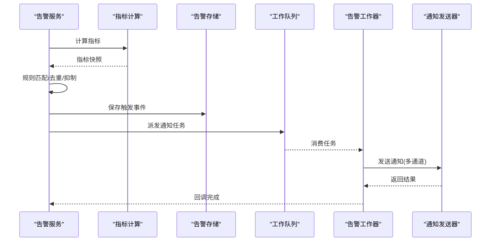
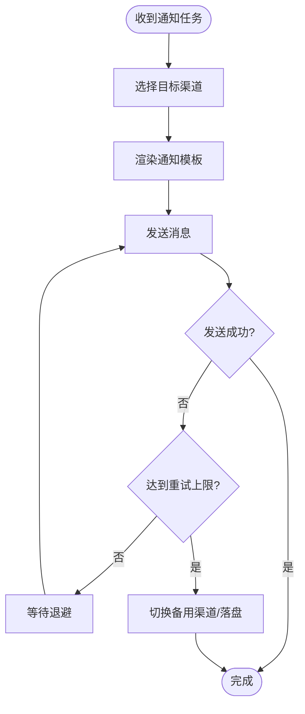
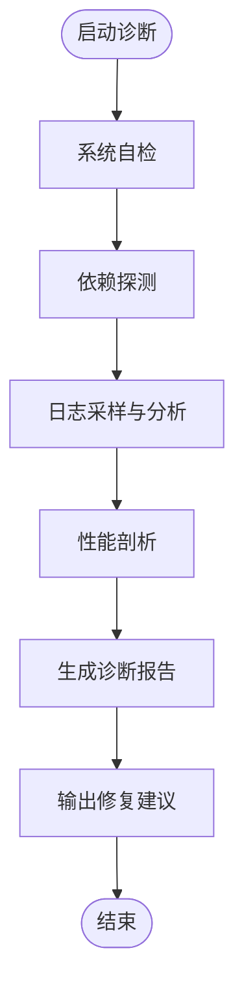
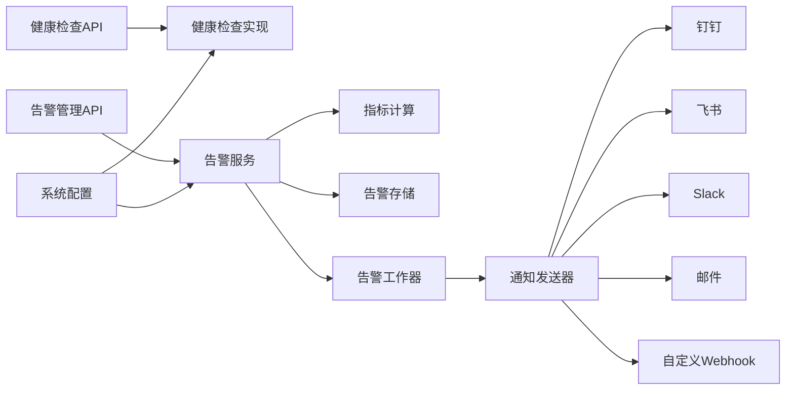

# 监控与告警

<cite>
**本文引用的文件**   
- [api/v1/endpoints/health.py](file://api/v1/endpoints/health.py)
- [api/v1/endpoints/alerts.py](file://api/v1/endpoints/alerts.py)
- [api/v1/schemas/alerts.py](file://api/v1/schemas/alerts.py)
- [src/services/alert_service.py](file://src/services/alert_service.py)
- [src/services/alert_worker.py](file://src/services/alert_worker.py)
- [src/services/alert_indicators.py](file://src/services/alert_indicators.py)
- [src/repositories/alert_repo.py](file://src/repositories/alert_repo.py)
- [src/notification_sender/dingtalk_sender.py](file://src/notification_sender/dingtalk_sender.py)
- [src/notification_sender/email_sender.py](file://src/notification_sender/email_sender.py)
- [src/notification_sender/feishu_sender.py](file://src/notification_sender/feishu_sender.py)
- [src/notification_sender/slack_sender.py](file://src/notification_sender/slack_sender.py)
- [src/notification_sender/custom_webhook_sender.py](file://src/notification_sender/custom_webhook_sender.py)
- [src/services/run_diagnostics.py](file://src/services/run_diagnostics.py)
- [src/services/system_config_service.py](file://src/services/system_config_service.py)
- [api/v1/endpoints/system_config.py](file://api/v1/endpoints/system_config.py)
- [src/config.py](file://src/config.py)
- [main.py](file://main.py)
- [server.py](file://server.py)
</cite>

## 目录
1. [简介](#简介)
2. [项目结构](#项目结构)
3. [核心组件](#核心组件)
4. [架构总览](#架构总览)
5. [详细组件分析](#详细组件分析)
6. [依赖关系分析](#依赖关系分析)
7. [性能考量](#性能考量)
8. [故障排查指南](#故障排查指南)
9. [结论](#结论)
10. [附录](#附录)

## 简介
本文件面向Daily Stock Analysis系统的“监控与告警”能力，围绕健康检查接口、诊断工具、监控指标采集与展示、告警规则配置与通知渠道、以及仪表板定制与运维最佳实践进行系统化说明。文档以代码级为依据，提供架构图、时序图与流程图，帮助读者快速理解并落地生产环境的可观测性与稳定性保障。

## 项目结构
与监控与告警相关的后端能力主要分布在以下模块：
- API层：健康检查与告警管理接口定义与路由
- 服务层：告警策略、指标计算、工作队列与调度
- 存储层：告警事件持久化
- 通知层：多渠道消息发送（钉钉、企业微信、飞书、Slack、邮件、自定义Webhook等）
- 诊断工具：系统自检、问题定位与修复建议
- 配置中心：系统配置管理与环境变量注入

图表来源
- [api/v1/endpoints/health.py:1-200](file://api/v1/endpoints/health.py#L1-L200)
- [api/v1/endpoints/alerts.py:1-200](file://api/v1/endpoints/alerts.py#L1-L200)
- [src/services/alert_service.py:1-200](file://src/services/alert_service.py#L1-L200)
- [src/services/alert_worker.py:1-200](file://src/services/alert_worker.py#L1-L200)
- [src/services/alert_indicators.py:1-200](file://src/services/alert_indicators.py#L1-L200)
- [src/repositories/alert_repo.py:1-200](file://src/repositories/alert_repo.py#L1-L200)
- [src/notification_sender/dingtalk_sender.py:1-200](file://src/notification_sender/dingtalk_sender.py#L1-L200)
- [src/notification_sender/feishu_sender.py:1-200](file://src/notification_sender/feishu_sender.py#L1-L200)
- [src/notification_sender/slack_sender.py:1-200](file://src/notification_sender/slack_sender.py#L1-L200)
- [src/notification_sender/email_sender.py:1-200](file://src/notification_sender/email_sender.py#L1-L200)
- [src/notification_sender/custom_webhook_sender.py:1-200](file://src/notification_sender/custom_webhook_sender.py#L1-L200)
- [src/services/run_diagnostics.py:1-200](file://src/services/run_diagnostics.py#L1-L200)
- [src/services/system_config_service.py:1-200](file://src/services/system_config_service.py#L1-L200)
- [api/v1/endpoints/system_config.py:1-200](file://api/v1/endpoints/system_config.py#L1-L200)
- [src/config.py:1-200](file://src/config.py#L1-L200)
- [main.py:1-200](file://main.py#L1-L200)
- [server.py:1-200](file://server.py#L1-L200)

章节来源
- [api/v1/endpoints/health.py:1-200](file://api/v1/endpoints/health.py#L1-L200)
- [api/v1/endpoints/alerts.py:1-200](file://api/v1/endpoints/alerts.py#L1-L200)
- [src/services/alert_service.py:1-200](file://src/services/alert_service.py#L1-L200)
- [src/services/alert_worker.py:1-200](file://src/services/alert_worker.py#L1-L200)
- [src/services/alert_indicators.py:1-200](file://src/services/alert_indicators.py#L1-L200)
- [src/repositories/alert_repo.py:1-200](file://src/repositories/alert_repo.py#L1-L200)
- [src/notification_sender/dingtalk_sender.py:1-200](file://src/notification_sender/dingtalk_sender.py#L1-L200)
- [src/notification_sender/feishu_sender.py:1-200](file://src/notification_sender/feishu_sender.py#L1-L200)
- [src/notification_sender/slack_sender.py:1-200](file://src/notification_sender/slack_sender.py#L1-L200)
- [src/notification_sender/email_sender.py:1-200](file://src/notification_sender/email_sender.py#L1-L200)
- [src/notification_sender/custom_webhook_sender.py:1-200](file://src/notification_sender/custom_webhook_sender.py#L1-L200)
- [src/services/run_diagnostics.py:1-200](file://src/services/run_diagnostics.py#L1-L200)
- [src/services/system_config_service.py:1-200](file://src/services/system_config_service.py#L1-L200)
- [api/v1/endpoints/system_config.py:1-200](file://api/v1/endpoints/system_config.py#L1-L200)
- [src/config.py:1-200](file://src/config.py#L1-L200)
- [main.py:1-200](file://main.py#L1-L200)
- [server.py:1-200](file://server.py#L1-L200)

## 核心组件
- 健康检查接口：暴露服务状态检测、依赖服务连通性检查与基础性能指标收集，供负载均衡与健康探针使用。
- 告警管理接口：提供告警规则查询、创建、更新、删除与触发记录查看能力。
- 告警服务：聚合指标计算、规则匹配、去重与抑制、事件持久化与工作队列派发。
- 告警工作器：异步执行通知发送、重试与失败处理，支持多通道并发。
- 指标计算：业务指标（如交易信号异常、数据新鲜度）、系统资源（CPU/内存/磁盘/网络）与性能基准（延迟、吞吐）。
- 通知发送器：统一抽象多种通知渠道，支持模板渲染与错误回退。
- 诊断工具：系统自检、依赖探测、日志采样、修复建议生成。
- 配置服务：集中管理告警阈值、通知渠道、升级策略与开关项。

章节来源
- [api/v1/endpoints/health.py:1-200](file://api/v1/endpoints/health.py#L1-L200)
- [api/v1/endpoints/alerts.py:1-200](file://api/v1/endpoints/alerts.py#L1-L200)
- [src/services/alert_service.py:1-200](file://src/services/alert_service.py#L1-L200)
- [src/services/alert_worker.py:1-200](file://src/services/alert_worker.py#L1-L200)
- [src/services/alert_indicators.py:1-200](file://src/services/alert_indicators.py#L1-L200)
- [src/repositories/alert_repo.py:1-200](file://src/repositories/alert_repo.py#L1-L200)
- [src/services/run_diagnostics.py:1-200](file://src/services/run_diagnostics.py#L1-L200)
- [src/services/system_config_service.py:1-200](file://src/services/system_config_service.py#L1-L200)

## 架构总览
整体采用“接口层—服务层—存储/通知层”的分层架构，健康检查与告警管理通过API暴露；告警服务负责指标采集、规则匹配与事件编排；工作器异步处理通知；配置服务贯穿全局，支撑动态调整。

图表来源
- [api/v1/endpoints/health.py:1-200](file://api/v1/endpoints/health.py#L1-L200)
- [api/v1/endpoints/alerts.py:1-200](file://api/v1/endpoints/alerts.py#L1-L200)
- [src/services/alert_service.py:1-200](file://src/services/alert_service.py#L1-L200)
- [src/services/alert_indicators.py:1-200](file://src/services/alert_indicators.py#L1-L200)
- [src/repositories/alert_repo.py:1-200](file://src/repositories/alert_repo.py#L1-L200)
- [src/services/alert_worker.py:1-200](file://src/services/alert_worker.py#L1-L200)
- [src/notification_sender/dingtalk_sender.py:1-200](file://src/notification_sender/dingtalk_sender.py#L1-L200)
- [src/notification_sender/feishu_sender.py:1-200](file://src/notification_sender/feishu_sender.py#L1-L200)
- [src/notification_sender/slack_sender.py:1-200](file://src/notification_sender/slack_sender.py#L1-L200)
- [src/notification_sender/email_sender.py:1-200](file://src/notification_sender/email_sender.py#L1-L200)
- [src/notification_sender/custom_webhook_sender.py:1-200](file://src/notification_sender/custom_webhook_sender.py#L1-L200)

## 详细组件分析

### 健康检查接口设计
- 服务状态检测：进程存活、主循环运行状态、关键线程/协程活跃情况。
- 依赖服务检查：数据库连接、外部数据源、缓存、消息队列、LLM后端等连通性与延迟。
- 性能指标收集：QPS、P95/P99延迟、错误率、GC/内存占用、磁盘IO、网络带宽。
- 输出格式：结构化JSON，包含status、checks[]、metrics{}、timestamp等字段。

图表来源
- [api/v1/endpoints/health.py:1-200](file://api/v1/endpoints/health.py#L1-L200)
- [src/config.py:1-200](file://src/config.py#L1-L200)

章节来源
- [api/v1/endpoints/health.py:1-200](file://api/v1/endpoints/health.py#L1-L200)

### 告警管理接口与数据模型
- 功能：规则CRUD、触发记录查询、批量导入/导出、状态切换。
- 数据模型：规则ID、名称、条件表达式、阈值、级别、渠道、冷却时间、抑制策略、生效时间窗、标签。
- 校验：Pydantic模型校验，确保输入合法性与一致性。

图表来源
- [api/v1/schemas/alerts.py:1-200](file://api/v1/schemas/alerts.py#L1-L200)
- [src/repositories/alert_repo.py:1-200](file://src/repositories/alert_repo.py#L1-L200)

章节来源
- [api/v1/endpoints/alerts.py:1-200](file://api/v1/endpoints/alerts.py#L1-L200)
- [api/v1/schemas/alerts.py:1-200](file://api/v1/schemas/alerts.py#L1-L200)
- [src/repositories/alert_repo.py:1-200](file://src/repositories/alert_repo.py#L1-L200)

### 告警服务与工作器
- 指标计算：从数据源拉取实时/历史数据，计算业务指标（如信号异常、数据新鲜度），并汇总系统资源指标。
- 规则匹配：按时间窗口与阈值匹配，支持多级级别与组合条件。
- 去重与抑制：基于规则ID与时间窗口的去重，抑制重复告警，避免告警风暴。
- 持久化：将触发事件写入存储，保留审计轨迹。
- 工作器：异步派发通知任务，支持重试、退避与失败降级。

图表来源
- [src/services/alert_service.py:1-200](file://src/services/alert_service.py#L1-L200)
- [src/services/alert_indicators.py:1-200](file://src/services/alert_indicators.py#L1-L200)
- [src/repositories/alert_repo.py:1-200](file://src/repositories/alert_repo.py#L1-L200)
- [src/services/alert_worker.py:1-200](file://src/services/alert_worker.py#L1-L200)
- [src/notification_sender/dingtalk_sender.py:1-200](file://src/notification_sender/dingtalk_sender.py#L1-L200)
- [src/notification_sender/feishu_sender.py:1-200](file://src/notification_sender/feishu_sender.py#L1-L200)
- [src/notification_sender/slack_sender.py:1-200](file://src/notification_sender/slack_sender.py#L1-L200)
- [src/notification_sender/email_sender.py:1-200](file://src/notification_sender/email_sender.py#L1-L200)
- [src/notification_sender/custom_webhook_sender.py:1-200](file://src/notification_sender/custom_webhook_sender.py#L1-L200)

章节来源
- [src/services/alert_service.py:1-200](file://src/services/alert_service.py#L1-L200)
- [src/services/alert_worker.py:1-200](file://src/services/alert_worker.py#L1-L200)
- [src/services/alert_indicators.py:1-200](file://src/services/alert_indicators.py#L1-L200)
- [src/repositories/alert_repo.py:1-200](file://src/repositories/alert_repo.py#L1-L200)

### 通知渠道与升级策略
- 渠道：钉钉、飞书、Slack、邮件、自定义Webhook等，统一抽象为发送器接口。
- 模板：支持Markdown/富文本模板，变量替换与图片嵌入。
- 升级策略：按级别与时间窗自动升级（如先短信后电话），支持静默期与合并通知。
- 重试与降级：指数退避重试，失败时切换到备用渠道或落盘待恢复。

图表来源
- [src/notification_sender/dingtalk_sender.py:1-200](file://src/notification_sender/dingtalk_sender.py#L1-L200)
- [src/notification_sender/feishu_sender.py:1-200](file://src/notification_sender/feishu_sender.py#L1-L200)
- [src/notification_sender/slack_sender.py:1-200](file://src/notification_sender/slack_sender.py#L1-L200)
- [src/notification_sender/email_sender.py:1-200](file://src/notification_sender/email_sender.py#L1-L200)
- [src/notification_sender/custom_webhook_sender.py:1-200](file://src/notification_sender/custom_webhook_sender.py#L1-L200)

章节来源
- [src/notification_sender/dingtalk_sender.py:1-200](file://src/notification_sender/dingtalk_sender.py#L1-L200)
- [src/notification_sender/feishu_sender.py:1-200](file://src/notification_sender/feishu_sender.py#L1-L200)
- [src/notification_sender/slack_sender.py:1-200](file://src/notification_sender/slack_sender.py#L1-L200)
- [src/notification_sender/email_sender.py:1-200](file://src/notification_sender/email_sender.py#L1-L200)
- [src/notification_sender/custom_webhook_sender.py:1-200](file://src/notification_sender/custom_webhook_sender.py#L1-L200)

### 诊断工具用法
- 系统自检：进程、依赖、配置、磁盘空间、证书有效期、端口占用等。
- 问题定位：日志采样、慢查询识别、外部依赖延迟分布、错误堆栈抓取。
- 修复建议：根据检测结果给出可操作的修复步骤与验证方法。
- 使用方式：通过诊断服务接口或命令行工具触发，输出结构化报告。

图表来源
- [src/services/run_diagnostics.py:1-200](file://src/services/run_diagnostics.py#L1-L200)

章节来源
- [src/services/run_diagnostics.py:1-200](file://src/services/run_diagnostics.py#L1-L200)

### 监控指标采集与展示
- 关键业务指标：交易信号异常率、数据新鲜度、策略命中率、回测成功率。
- 系统资源使用率：CPU、内存、磁盘IO、网络带宽、句柄数。
- 性能基准：接口延迟分位、吞吐、错误率、队列积压。
- 展示方式：Prometheus/Grafana集成或内置仪表盘，支持自定义面板与告警联动。

章节来源
- [src/services/alert_indicators.py:1-200](file://src/services/alert_indicators.py#L1-L200)

### 告警规则配置与升级策略
- 阈值设置：静态阈值、动态基线、同比/环比比较。
- 通知渠道：按级别与标签路由到不同渠道。
- 升级策略：时间窗内未解决自动升级，支持多通道并行与静默期。
- 配置管理：通过系统配置服务与API进行热更新，支持版本化与回滚。

章节来源
- [src/services/system_config_service.py:1-200](file://src/services/system_config_service.py#L1-L200)
- [api/v1/endpoints/system_config.py:1-200](file://api/v1/endpoints/system_config.py#L1-L200)
- [src/config.py:1-200](file://src/config.py#L1-L200)

### 监控仪表板定制与运维最佳实践
- 仪表板定制：按业务域划分面板，聚合多维度指标，支持钻取与下钻到根因。
- 告警治理：合理设置阈值与冷却时间，避免告警疲劳；建立分级响应流程。
- 容量规划：基于历史峰值与趋势预测，预留冗余与弹性扩容。
- 变更管理：灰度发布、回滚预案、变更前后对比验证。
- 演练与复盘：定期故障演练，沉淀SOP与知识库。

章节来源
- [src/services/system_config_service.py:1-200](file://src/services/system_config_service.py#L1-L200)
- [api/v1/endpoints/system_config.py:1-200](file://api/v1/endpoints/system_config.py#L1-L200)

## 依赖关系分析
健康检查与告警模块的依赖关系如下：
- API层依赖服务层接口
- 服务层依赖指标计算、存储与通知发送器
- 通知发送器依赖外部平台SDK或HTTP客户端
- 配置服务贯穿各层，提供运行时配置

图表来源
- [api/v1/endpoints/health.py:1-200](file://api/v1/endpoints/health.py#L1-L200)
- [api/v1/endpoints/alerts.py:1-200](file://api/v1/endpoints/alerts.py#L1-L200)
- [src/services/alert_service.py:1-200](file://src/services/alert_service.py#L1-L200)
- [src/services/alert_indicators.py:1-200](file://src/services/alert_indicators.py#L1-L200)
- [src/repositories/alert_repo.py:1-200](file://src/repositories/alert_repo.py#L1-L200)
- [src/services/alert_worker.py:1-200](file://src/services/alert_worker.py#L1-L200)
- [src/notification_sender/dingtalk_sender.py:1-200](file://src/notification_sender/dingtalk_sender.py#L1-L200)
- [src/notification_sender/feishu_sender.py:1-200](file://src/notification_sender/feishu_sender.py#L1-L200)
- [src/notification_sender/slack_sender.py:1-200](file://src/notification_sender/slack_sender.py#L1-L200)
- [src/notification_sender/email_sender.py:1-200](file://src/notification_sender/email_sender.py#L1-L200)
- [src/notification_sender/custom_webhook_sender.py:1-200](file://src/notification_sender/custom_webhook_sender.py#L1-L200)
- [src/services/system_config_service.py:1-200](file://src/services/system_config_service.py#L1-L200)

章节来源
- [api/v1/endpoints/health.py:1-200](file://api/v1/endpoints/health.py#L1-L200)
- [api/v1/endpoints/alerts.py:1-200](file://api/v1/endpoints/alerts.py#L1-L200)
- [src/services/alert_service.py:1-200](file://src/services/alert_service.py#L1-L200)
- [src/services/alert_worker.py:1-200](file://src/services/alert_worker.py#L1-L200)
- [src/services/alert_indicators.py:1-200](file://src/services/alert_indicators.py#L1-L200)
- [src/repositories/alert_repo.py:1-200](file://src/repositories/alert_repo.py#L1-L200)
- [src/services/system_config_service.py:1-200](file://src/services/system_config_service.py#L1-L200)

## 性能考量
- 指标采集频率：按业务重要性分层，高频指标采样降频与批处理。
- 规则匹配优化：索引与预计算，减少全量扫描；滑动窗口与增量更新。
- 通知发送并发：限制并发与限流，避免下游过载；失败快速失败与熔断。
- 存储读写分离：写路径异步化，读路径缓存热点数据。
- 资源隔离：告警相关任务独立进程/线程池，避免影响主业务。

[本节为通用指导，不直接分析具体文件]

## 故障排查指南
- 健康检查失败：检查依赖服务连通性、证书与端口、网络策略与防火墙。
- 告警未触发：核对规则表达式、阈值与时间窗；确认指标计算链路正常。
- 通知未送达：检查渠道配置、签名与密钥、速率限制与黑名单；查看重试与降级日志。
- 性能退化：定位慢查询与高延迟依赖，评估GC与内存泄漏，检查磁盘IO与网络拥塞。
- 诊断工具使用：运行自检与依赖探测，获取日志采样与性能剖析报告，依据修复建议逐项验证。

章节来源
- [src/services/run_diagnostics.py:1-200](file://src/services/run_diagnostics.py#L1-L200)
- [src/services/alert_service.py:1-200](file://src/services/alert_service.py#L1-L200)
- [src/services/alert_worker.py:1-200](file://src/services/alert_worker.py#L1-L200)

## 结论
Daily Stock Analysis的监控与告警体系以健康检查与告警管理为核心，结合指标计算、规则匹配、异步通知与诊断工具，形成完整的可观测性与稳定性保障闭环。通过合理的阈值与升级策略、多渠道通知与容错机制，以及完善的仪表板与运维实践，可有效降低故障影响面并提升响应效率。

## 附录
- 启动与服务入口：应用入口与HTTP服务器初始化，加载配置与中间件，注册路由。
- 配置与环境：环境变量与配置文件优先级，敏感信息加密与轮换策略。

章节来源
- [main.py:1-200](file://main.py#L1-L200)
- [server.py:1-200](file://server.py#L1-L200)
- [src/config.py:1-200](file://src/config.py#L1-L200)