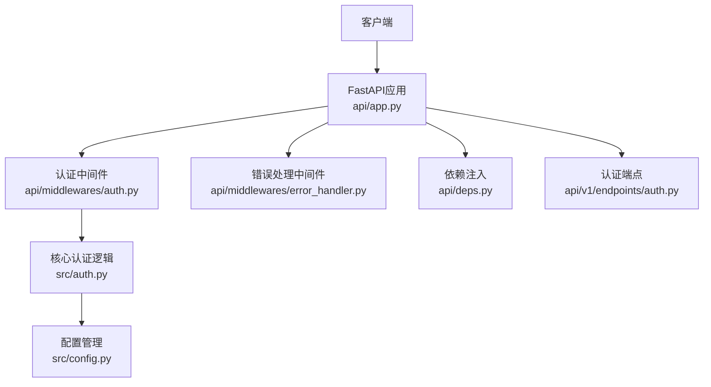
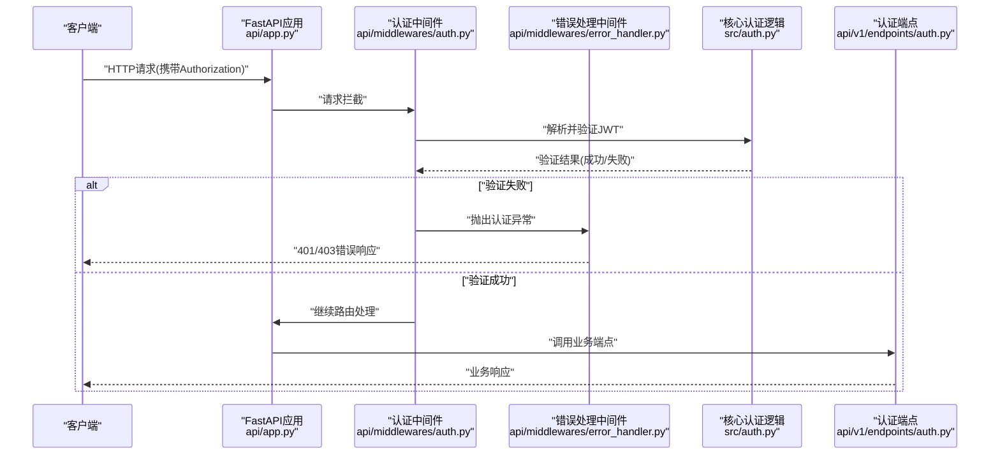
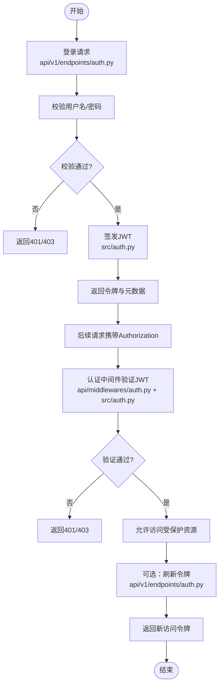
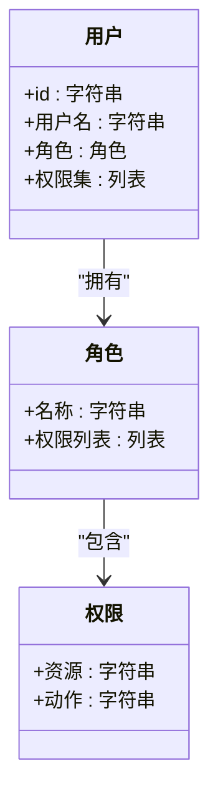
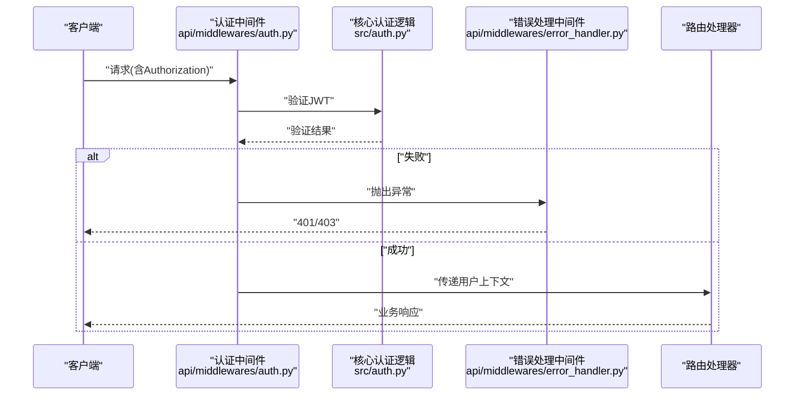
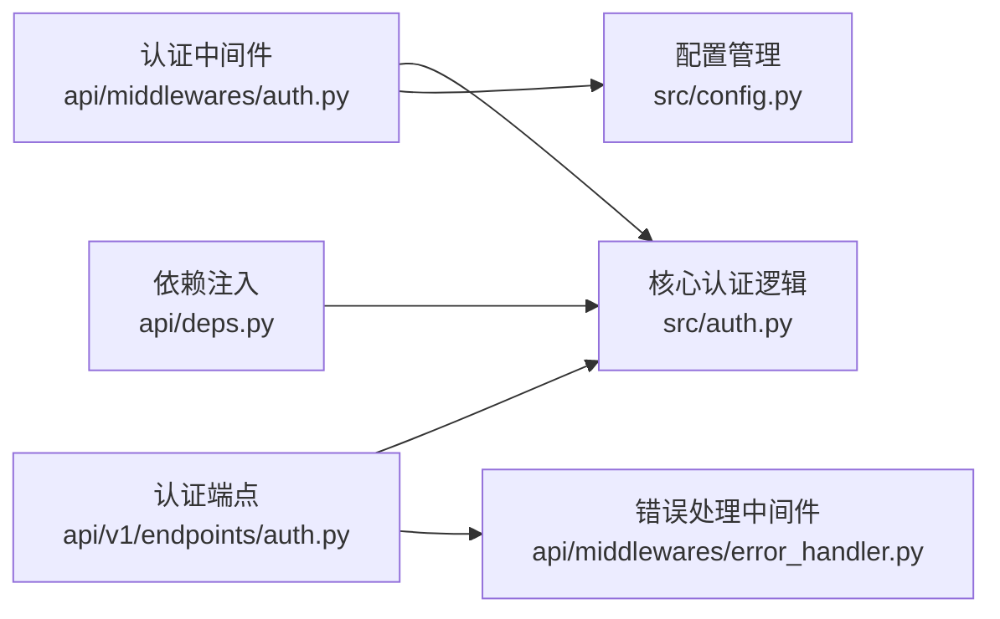

# 认证与授权

<cite>
**本文引用的文件**   
- [api/app.py](file://api/app.py)
- [api/deps.py](file://api/deps.py)
- [api/middlewares/auth.py](file://api/middlewares/auth.py)
- [api/middlewares/error_handler.py](file://api/middlewares/error_handler.py)
- [api/v1/endpoints/auth.py](file://api/v1/endpoints/auth.py)
- [src/auth.py](file://src/auth.py)
- [src/config.py](file://src/config.py)
- [tests/test_auth.py](file://tests/test_auth.py)
- [tests/test_cwe345_xff_bypass.py](file://tests/test_cwe345_xff_bypass.py)
</cite>

## 目录
1. [简介](#简介)
2. [项目结构](#项目结构)
3. [核心组件](#核心组件)
4. [架构总览](#架构总览)
5. [详细组件分析](#详细组件分析)
6. [依赖关系分析](#依赖关系分析)
7. [性能考量](#性能考量)
8. [故障排查指南](#故障排查指南)
9. [结论](#结论)
10. [附录：配置与集成示例](#附录配置与集成示例)

## 简介
本文件面向Daily Stock Analysis系统的认证与授权机制，聚焦以下目标：
- JWT令牌的生成、验证与刷新流程
- 权限控制模型（角色定义、权限分配、访问控制策略）
- 会话管理机制（用户状态维护与安全考虑）
- 中间件工作原理（请求拦截、身份验证、授权检查）
- 安全最佳实践与常见攻击防护
- 完整配置示例与集成指南

## 项目结构
认证与授权相关代码主要分布在后端API层与核心工具模块中：
- API应用入口与依赖注入：api/app.py、api/deps.py
- 认证中间件：api/middlewares/auth.py
- 错误处理中间件：api/middlewares/error_handler.py
- 认证端点：api/v1/endpoints/auth.py
- 核心认证逻辑与配置：src/auth.py、src/config.py
- 测试用例：tests/test_auth.py、tests/test_cwe345_xff_bypass.py

**图示来源** 
- [api/app.py](file://api/app.py)
- [api/middlewares/auth.py](file://api/middlewares/auth.py)
- [api/middlewares/error_handler.py](file://api/middlewares/error_handler.py)
- [api/deps.py](file://api/deps.py)
- [api/v1/endpoints/auth.py](file://api/v1/endpoints/auth.py)
- [src/auth.py](file://src/auth.py)
- [src/config.py](file://src/config.py)

**章节来源**
- [api/app.py](file://api/app.py)
- [api/deps.py](file://api/deps.py)
- [api/middlewares/auth.py](file://api/middlewares/auth.py)
- [api/middlewares/error_handler.py](file://api/middlewares/error_handler.py)
- [api/v1/endpoints/auth.py](file://api/v1/endpoints/auth.py)
- [src/auth.py](file://src/auth.py)
- [src/config.py](file://src/config.py)

## 核心组件
- 认证中间件：负责从请求头提取JWT令牌，调用核心认证逻辑进行校验，并将已认证用户信息注入到请求上下文。
- 核心认证逻辑：提供JWT的签发、验证、刷新能力；封装密钥、算法、过期时间等配置项。
- 认证端点：提供登录、登出、令牌刷新等接口，返回标准响应格式。
- 错误处理中间件：统一捕获认证/授权异常，返回标准化错误码与消息。
- 依赖注入：在路由处理器中通过依赖注入获取当前用户与权限上下文。

**章节来源**
- [api/middlewares/auth.py](file://api/middlewares/auth.py)
- [src/auth.py](file://src/auth.py)
- [api/v1/endpoints/auth.py](file://api/v1/endpoints/auth.py)
- [api/middlewares/error_handler.py](file://api/middlewares/error_handler.py)
- [api/deps.py](file://api/deps.py)

## 架构总览
下图展示了认证与授权的端到端流程：客户端发起请求，经过中间件链进行身份验证与授权检查，随后进入业务端点处理。

**图示来源** 
- [api/app.py](file://api/app.py)
- [api/middlewares/auth.py](file://api/middlewares/auth.py)
- [api/middlewares/error_handler.py](file://api/middlewares/error_handler.py)
- [src/auth.py](file://src/auth.py)
- [api/v1/endpoints/auth.py](file://api/v1/endpoints/auth.py)

## 详细组件分析

### JWT令牌生命周期（生成、验证、刷新）
- 生成：认证端点在用户成功登录后，调用核心认证逻辑签发JWT，包含用户标识、角色、权限及过期时间。
- 验证：认证中间件在每个受保护请求上解析Authorization头中的Bearer令牌，调用核心认证逻辑进行签名与过期校验。
- 刷新：提供专门的刷新接口，使用刷新令牌换取新的访问令牌，降低频繁重登录风险。

**图示来源** 
- [api/v1/endpoints/auth.py](file://api/v1/endpoints/auth.py)
- [src/auth.py](file://src/auth.py)
- [api/middlewares/auth.py](file://api/middlewares/auth.py)

**章节来源**
- [api/v1/endpoints/auth.py](file://api/v1/endpoints/auth.py)
- [src/auth.py](file://src/auth.py)
- [api/middlewares/auth.py](file://api/middlewares/auth.py)

### 权限控制模型（角色、权限、访问控制）
- 角色定义：系统内定义若干角色（如管理员、分析师、普通用户），每个角色具备一组预定义权限。
- 权限分配：用户绑定角色后继承相应权限；支持细粒度权限（如“读取股票”、“执行回测”）。
- 访问控制策略：在中间件或端点级别对请求进行授权检查，未满足权限时返回403。

**图示来源** 
- [src/auth.py](file://src/auth.py)
- [api/deps.py](file://api/deps.py)

**章节来源**
- [src/auth.py](file://src/auth.py)
- [api/deps.py](file://api/deps.py)

### 会话管理与安全性
- 无状态会话：采用JWT实现无状态会话，服务端不持久化会话状态，提升扩展性。
- 令牌存储：客户端应安全存储访问令牌（如内存或安全存储），避免XSS泄露。
- 刷新令牌：建议将刷新令牌存储在安全的HttpOnly Cookie中，减少前端泄露风险。
- 安全考虑：启用HTTPS、设置合理的过期时间、限制令牌范围、定期轮换密钥。

**章节来源**
- [src/auth.py](file://src/auth.py)
- [api/v1/endpoints/auth.py](file://api/v1/endpoints/auth.py)

### 中间件工作原理（请求拦截、身份验证、授权检查）
- 请求拦截：认证中间件在请求到达路由前拦截，解析Authorization头。
- 身份验证：调用核心认证逻辑验证JWT签名与有效期。
- 授权检查：根据用户角色与权限判断是否允许访问目标资源。
- 错误处理：认证/授权失败由错误处理中间件统一返回标准化错误。

**图示来源** 
- [api/middlewares/auth.py](file://api/middlewares/auth.py)
- [src/auth.py](file://src/auth.py)
- [api/middlewares/error_handler.py](file://api/middlewares/error_handler.py)

**章节来源**
- [api/middlewares/auth.py](file://api/middlewares/auth.py)
- [src/auth.py](file://src/auth.py)
- [api/middlewares/error_handler.py](file://api/middlewares/error_handler.py)

### 安全最佳实践与常见攻击防护
- 防XSS：避免在前端明文存储敏感令牌，使用安全存储与传输。
- 防CSRF：对写操作启用CSRF保护或使用SameSite Cookie策略。
- 防重放：为令牌添加随机nonce或短有效期，服务端记录最近使用指纹。
- 防暴力破解：对登录接口实施速率限制与账户锁定策略。
- 密钥管理：使用环境变量或密钥管理服务存储JWT密钥，定期轮换。
- 输入校验：严格校验请求参数与头部，防止注入攻击。

**章节来源**
- [tests/test_cwe345_xff_bypass.py](file://tests/test_cwe345_xff_bypass.py)
- [src/config.py](file://src/config.py)

## 依赖关系分析
认证与授权模块之间的依赖关系如下：
- 认证中间件依赖核心认证逻辑与配置管理。
- 认证端点依赖核心认证逻辑与错误处理。
- 依赖注入模块为路由处理器提供用户上下文与权限检查工具。

**图示来源** 
- [api/middlewares/auth.py](file://api/middlewares/auth.py)
- [src/auth.py](file://src/auth.py)
- [src/config.py](file://src/config.py)
- [api/v1/endpoints/auth.py](file://api/v1/endpoints/auth.py)
- [api/middlewares/error_handler.py](file://api/middlewares/error_handler.py)
- [api/deps.py](file://api/deps.py)

**章节来源**
- [api/middlewares/auth.py](file://api/middlewares/auth.py)
- [src/auth.py](file://src/auth.py)
- [src/config.py](file://src/config.py)
- [api/v1/endpoints/auth.py](file://api/v1/endpoints/auth.py)
- [api/middlewares/error_handler.py](file://api/middlewares/error_handler.py)
- [api/deps.py](file://api/deps.py)

## 性能考量
- 无状态JWT减少服务端会话存储压力，适合水平扩展。
- 令牌验证应在中间件中尽早完成，避免无效请求进入业务逻辑。
- 合理设置令牌过期时间，平衡安全性与用户体验。
- 对高频刷新接口实施缓存与限流，降低后端负载。

[本节为通用指导，无需特定文件引用]

## 故障排查指南
- 常见问题：
  - 401未授权：检查Authorization头是否正确携带Bearer令牌。
  - 403禁止访问：确认用户角色与权限是否满足资源访问要求。
  - 令牌过期：使用刷新接口获取新令牌。
- 调试步骤：
  - 查看错误处理中间件的日志输出。
  - 检查核心认证逻辑的验证结果与异常信息。
  - 核对配置项（密钥、算法、过期时间）是否正确。

**章节来源**
- [api/middlewares/error_handler.py](file://api/middlewares/error_handler.py)
- [src/auth.py](file://src/auth.py)

## 结论
Daily Stock Analysis系统的认证与授权机制以JWT为核心，结合中间件与依赖注入实现统一的身份验证与授权控制。通过合理的角色与权限模型、严格的中间件拦截与错误处理，以及完善的安全最佳实践，系统能够在保证安全性的同时提供良好的可扩展性与用户体验。

[本节为总结性内容，无需特定文件引用]

## 附录：配置与集成示例
- 配置项建议：
  - JWT密钥：使用强随机字符串，通过环境变量注入。
  - 算法：推荐使用RS256或HS256，确保安全性。
  - 过期时间：访问令牌短期（如15分钟），刷新令牌长期（如7天）。
  - 安全头：启用HTTPS、CSP、HSTS等安全响应头。
- 集成步骤：
  - 在后端启动时加载配置并初始化认证模块。
  - 在API应用中注册认证中间件与错误处理中间件。
  - 在需要保护的端点上启用依赖注入的用户上下文。
  - 前端在登录成功后保存令牌并在请求头中携带。

**章节来源**
- [src/config.py](file://src/config.py)
- [api/app.py](file://api/app.py)
- [api/deps.py](file://api/deps.py)
- [tests/test_auth.py](file://tests/test_auth.py)