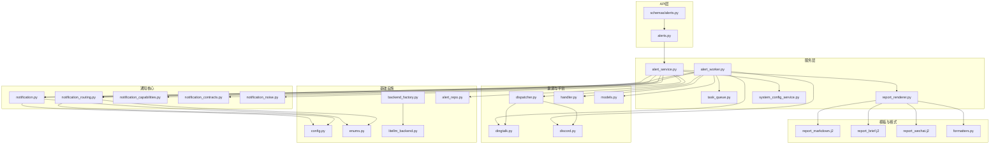
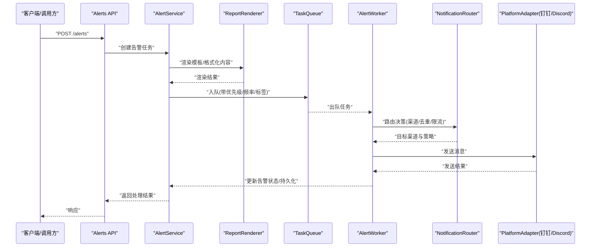
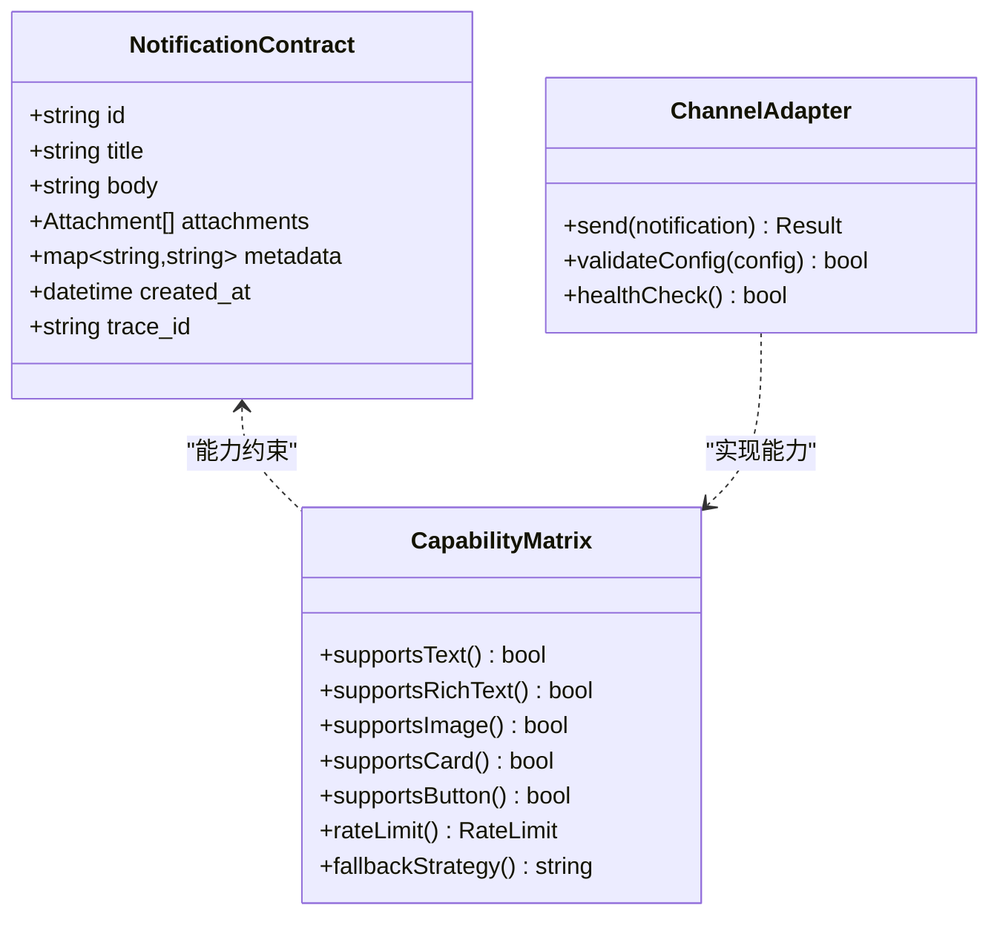
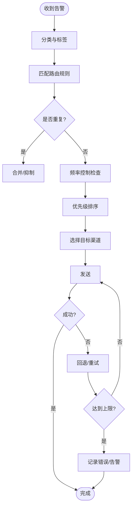
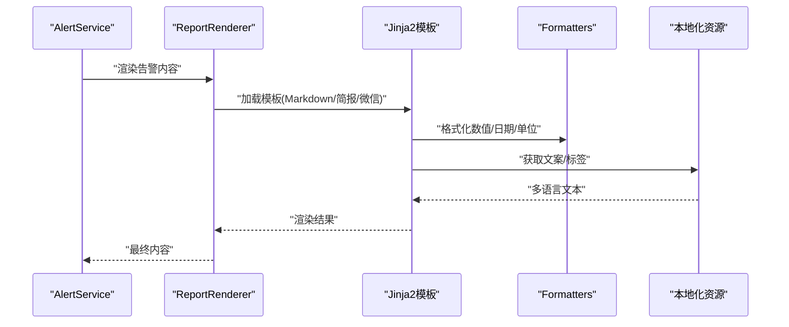
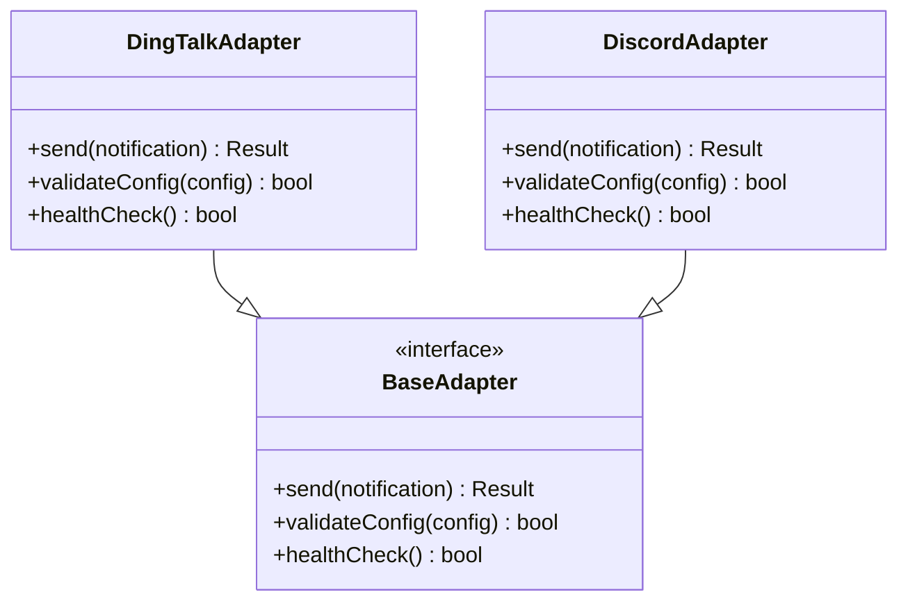
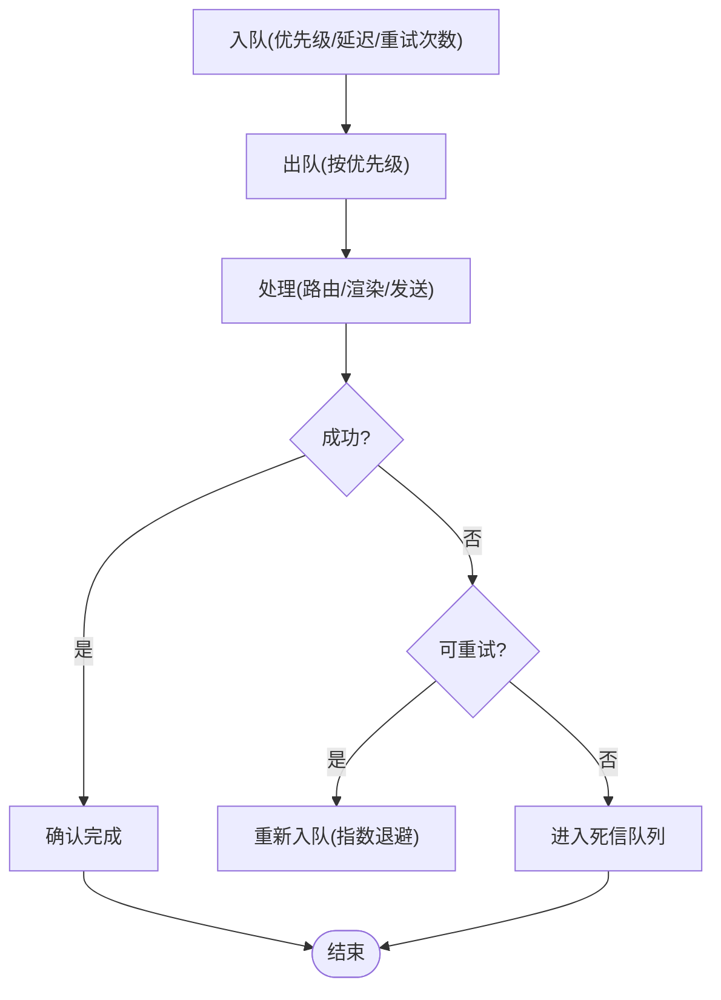
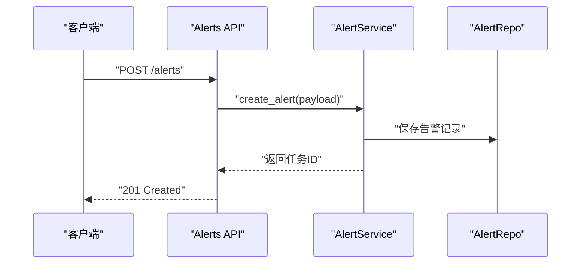
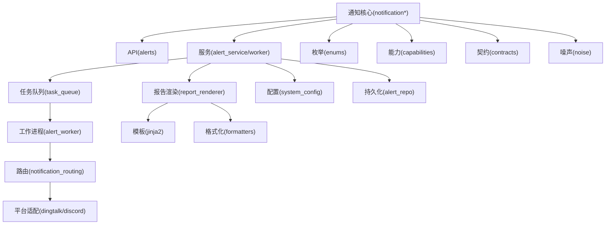

# 通知系统

<cite>
**本文引用的文件**   
- [src/notification.py](file://src/notification.py)
- [src/notification_capabilities.py](file://src/notification_capabilities.py)
- [src/notification_contracts.py](file://src/notification_contracts.py)
- [src/notification_noise.py](file://src/notification_noise.py)
- [src/notification_routing.py](file://src/notification_routing.py)
- [src/services/alert_service.py](file://src/services/alert_service.py)
- [src/services/alert_worker.py](file://src/services/alert_worker.py)
- [src/services/task_queue.py](file://src/services/task_queue.py)
- [src/services/system_config_service.py](file://src/services/system_config_service.py)
- [src/services/report_renderer.py](file://src/services/report_renderer.py)
- [src/formatters.py](file://src/formatters.py)
- [src/scheduler.py](file://src/scheduler.py)
- [src/config.py](file://src/config.py)
- [src/enums.py](file://src/enums.py)
- [src/llm/backend_factory.py](file://src/llm/backend_factory.py)
- [src/llm/litellm_backend.py](file://src/llm/litellm_backend.py)
- [src/repositories/alert_repo.py](file://src/repositories/alert_repo.py)
- [api/v1/endpoints/alerts.py](file://api/v1/endpoints/alerts.py)
- [api/v1/schemas/alerts.py](file://api/v1/schemas/alerts.py)
- [bot/platforms/dingtalk.py](file://bot/platforms/dingtalk.py)
- [bot/platforms/discord.py](file://bot/platforms/discord.py)
- [bot/dispatcher.py](file://bot/dispatcher.py)
- [bot/handler.py](file://bot/handler.py)
- [bot/models.py](file://bot/models.py)
- [templates/report_markdown.j2](file://templates/report_markdown.j2)
- [templates/report_brief.j2](file://templates/report_brief.j2)
- [templates/report_wechat.j2](file://templates/report_wechat.j2)
- [scripts/generate_notification_actions_env_table.py](file://scripts/generate_notification_actions_env_table.py)
</cite>

## 目录
1. [简介](#简介)
2. [项目结构](#项目结构)
3. [核心组件](#核心组件)
4. [架构总览](#架构总览)
5. [详细组件分析](#详细组件分析)
6. [依赖关系分析](#依赖关系分析)
7. [性能考量](#性能考量)
8. [故障排除指南](#故障排除指南)
9. [结论](#结论)
10. [附录](#附录)

## 简介
本文件为 Daily Stock Analysis 系统的“通知系统”技术文档，聚焦多渠道通知架构、消息队列与路由机制、发送器抽象与扩展、模板系统与本地化、通知策略配置（触发条件、频率控制、优先级管理），以及自定义发送器的开发指南与最佳实践。文档面向不同技术背景的读者，提供从概览到代码级细节的渐进式说明，并包含架构图、流程图和排错方法。

## 项目结构
通知系统涉及后端服务、API、调度器、模板渲染、渠道平台集成与测试脚本等模块。关键目录与职责如下：
- src/notification*.py：通知能力、契约、噪声过滤与路由的核心逻辑
- src/services/*：告警服务、工作进程、任务队列、报告渲染、系统配置
- src/formatters.py：格式化与内容组装
- src/scheduler.py：定时任务与触发
- src/config.py、src/enums.py：配置与枚举定义
- src/llm/*：LLM 后端工厂与适配器（用于智能生成/摘要）
- src/repositories/alert_repo.py：告警数据持久化
- api/v1/endpoints/alerts.py、api/v1/schemas/alerts.py：REST API 入口与数据模型
- bot/platforms/*：多渠道平台适配层（钉钉、Discord、飞书等）
- templates/*.j2：Jinja2 模板（Markdown、简报、微信等）
- scripts/*：辅助脚本（如环境变量表生成）

图表来源
- [api/v1/endpoints/alerts.py](file://api/v1/endpoints/alerts.py)
- [api/v1/schemas/alerts.py](file://api/v1/schemas/alerts.py)
- [src/services/alert_service.py](file://src/services/alert_service.py)
- [src/services/alert_worker.py](file://src/services/alert_worker.py)
- [src/services/task_queue.py](file://src/services/task_queue.py)
- [src/services/report_renderer.py](file://src/services/report_renderer.py)
- [src/services/system_config_service.py](file://src/services/system_config_service.py)
- [src/notification.py](file://src/notification.py)
- [src/notification_routing.py](file://src/notification_routing.py)
- [src/notification_capabilities.py](file://src/notification_capabilities.py)
- [src/notification_contracts.py](file://src/notification_contracts.py)
- [src/notification_noise.py](file://src/notification_noise.py)
- [bot/platforms/dingtalk.py](file://bot/platforms/dingtalk.py)
- [bot/platforms/discord.py](file://bot/platforms/discord.py)
- [bot/dispatcher.py](file://bot/dispatcher.py)
- [bot/handler.py](file://bot/handler.py)
- [bot/models.py](file://bot/models.py)
- [templates/report_markdown.j2](file://templates/report_markdown.j2)
- [templates/report_brief.j2](file://templates/report_brief.j2)
- [templates/report_wechat.j2](file://templates/report_wechat.j2)
- [src/formatters.py](file://src/formatters.py)
- [src/config.py](file://src/config.py)
- [src/enums.py](file://src/enums.py)
- [src/llm/backend_factory.py](file://src/llm/backend_factory.py)
- [src/llm/litellm_backend.py](file://src/llm/litellm_backend.py)
- [src/repositories/alert_repo.py](file://src/repositories/alert_repo.py)

章节来源
- [api/v1/endpoints/alerts.py](file://api/v1/endpoints/alerts.py)
- [src/services/alert_service.py](file://src/services/alert_service.py)
- [src/notification.py](file://src/notification.py)
- [src/notification_routing.py](file://src/notification_routing.py)
- [src/formatters.py](file://src/formatters.py)
- [src/config.py](file://src/config.py)
- [src/enums.py](file://src/enums.py)

## 核心组件
- 通知能力与契约：定义统一的消息结构、能力声明与渠道能力矩阵，确保多端一致性与可扩展性。
- 通知路由：基于规则与上下文进行渠道选择、去重、限流与优先级排序。
- 噪声过滤：对重复、低价值或冗余信息进行降噪，避免通知风暴。
- 告警服务与工作进程：协调触发、渲染、入队、分发与重试。
- 任务队列：异步解耦生产与消费，支持并发与背压。
- 报告渲染与模板：使用 Jinja2 模板与格式化器生成 Markdown、简报、微信等多格式内容。
- 平台适配层：钉钉、Discord、飞书等平台的统一抽象与具体实现。
- 配置与枚举：集中管理渠道参数、策略开关、频率限制与优先级。
- LLM 集成：通过后端工厂与 LiteLLM 适配器进行智能摘要与文案优化。
- 持久化：告警记录与状态存储，便于审计与诊断。

章节来源
- [src/notification_capabilities.py](file://src/notification_capabilities.py)
- [src/notification_contracts.py](file://src/notification_contracts.py)
- [src/notification_routing.py](file://src/notification_routing.py)
- [src/notification_noise.py](file://src/notification_noise.py)
- [src/services/alert_service.py](file://src/services/alert_service.py)
- [src/services/alert_worker.py](file://src/services/alert_worker.py)
- [src/services/task_queue.py](file://src/services/task_queue.py)
- [src/services/report_renderer.py](file://src/services/report_renderer.py)
- [src/formatters.py](file://src/formatters.py)
- [bot/platforms/dingtalk.py](file://bot/platforms/dingtalk.py)
- [bot/platforms/discord.py](file://bot/platforms/discord.py)
- [src/config.py](file://src/config.py)
- [src/enums.py](file://src/enums.py)
- [src/llm/backend_factory.py](file://src/llm/backend_factory.py)
- [src/llm/litellm_backend.py](file://src/llm/litellm_backend.py)
- [src/repositories/alert_repo.py](file://src/repositories/alert_repo.py)

## 架构总览
通知系统采用“服务驱动 + 异步队列 + 路由策略 + 模板渲染 + 平台适配”的分层架构。API 接收告警请求后，由服务层校验、渲染与入队；工作进程按策略路由至目标渠道，并通过平台适配层完成实际发送。

图表来源
- [api/v1/endpoints/alerts.py](file://api/v1/endpoints/alerts.py)
- [src/services/alert_service.py](file://src/services/alert_service.py)
- [src/services/report_renderer.py](file://src/services/report_renderer.py)
- [src/services/task_queue.py](file://src/services/task_queue.py)
- [src/services/alert_worker.py](file://src/services/alert_worker.py)
- [src/notification_routing.py](file://src/notification_routing.py)
- [bot/platforms/dingtalk.py](file://bot/platforms/dingtalk.py)
- [bot/platforms/discord.py](file://bot/platforms/discord.py)

## 详细组件分析

### 通知契约与能力矩阵
- 契约定义：统一消息体结构（标题、正文、附件、链接、图片、富文本、操作按钮等）、渠道元数据（目标ID、群组、用户）、时间戳与追踪ID。
- 能力矩阵：声明各渠道支持的类型（文本、富文本、图片、卡片、按钮、文件）、速率限制、错误码与回退策略。
- 扩展点：新增渠道需实现能力声明与发送接口，并在路由注册表中登记。

图表来源
- [src/notification_contracts.py](file://src/notification_contracts.py)
- [src/notification_capabilities.py](file://src/notification_capabilities.py)
- [bot/platforms/dingtalk.py](file://bot/platforms/dingtalk.py)
- [bot/platforms/discord.py](file://bot/platforms/discord.py)

章节来源
- [src/notification_contracts.py](file://src/notification_contracts.py)
- [src/notification_capabilities.py](file://src/notification_capabilities.py)

### 通知路由与策略
- 路由规则：基于告警类型、股票范围、市场阶段、用户偏好与渠道可用性进行匹配。
- 频率控制：窗口内去重、合并与节流，防止同一主题频繁推送。
- 优先级管理：高优通道优先（如即时通讯），低优通道延后或降级（如邮件）。
- 失败回退：主渠道不可用时自动切换备用渠道或延迟重试。

图表来源
- [src/notification_routing.py](file://src/notification_routing.py)
- [src/notification_noise.py](file://src/notification_noise.py)
- [src/enums.py](file://src/enums.py)
- [src/config.py](file://src/config.py)

章节来源
- [src/notification_routing.py](file://src/notification_routing.py)
- [src/notification_noise.py](file://src/notification_noise.py)
- [src/enums.py](file://src/enums.py)
- [src/config.py](file://src/config.py)

### 模板系统与本地化
- 模板引擎：Jinja2 模板支持 Markdown、简报、微信等格式，变量注入与宏复用。
- 动态内容：根据告警上下文（标的、指标、市场阶段、LLM 摘要）填充模板。
- 本地化：按语言包与区域设置输出多语言内容，支持回退策略。
- 格式化器：统一数字、日期、百分比与单位转换，保证一致性。

图表来源
- [src/services/report_renderer.py](file://src/services/report_renderer.py)
- [templates/report_markdown.j2](file://templates/report_markdown.j2)
- [templates/report_brief.j2](file://templates/report_brief.j2)
- [templates/report_wechat.j2](file://templates/report_wechat.j2)
- [src/formatters.py](file://src/formatters.py)

章节来源
- [src/services/report_renderer.py](file://src/services/report_renderer.py)
- [templates/report_markdown.j2](file://templates/report_markdown.j2)
- [templates/report_brief.j2](file://templates/report_brief.j2)
- [templates/report_wechat.j2](file://templates/report_wechat.j2)
- [src/formatters.py](file://src/formatters.py)

### 多渠道平台集成
- 钉钉：支持群机器人、Webhook、消息卡片与富文本，需配置 Token、签名与频道 ID。
- Discord：支持 Bot Token、频道与角色权限，支持嵌入与交互组件。
- 飞书：支持应用 Webhook 与消息卡片，适合企业协作场景。
- 其他：Telegram、Slack、Pushover、Gotify、Server酱3、PushPlus、WeChat 等，均遵循统一适配器接口。

图表来源
- [bot/platforms/dingtalk.py](file://bot/platforms/dingtalk.py)
- [bot/platforms/discord.py](file://bot/platforms/discord.py)
- [bot/dispatcher.py](file://bot/dispatcher.py)
- [bot/handler.py](file://bot/handler.py)
- [bot/models.py](file://bot/models.py)

章节来源
- [bot/platforms/dingtalk.py](file://bot/platforms/dingtalk.py)
- [bot/platforms/discord.py](file://bot/platforms/discord.py)
- [bot/dispatcher.py](file://bot/dispatcher.py)
- [bot/handler.py](file://bot/handler.py)
- [bot/models.py](file://bot/models.py)

### 任务队列与工作进程
- 任务队列：支持优先级队列、延迟任务、重试与死信队列，保障高可用。
- 工作进程：并行消费任务，执行路由、渲染与发送，记录日志与指标。
- 监控与诊断：任务耗时、成功率、失败原因与渠道健康状态。

图表来源
- [src/services/task_queue.py](file://src/services/task_queue.py)
- [src/services/alert_worker.py](file://src/services/alert_worker.py)

章节来源
- [src/services/task_queue.py](file://src/services/task_queue.py)
- [src/services/alert_worker.py](file://src/services/alert_worker.py)

### 告警服务与API
- API 层：提供 REST 接口创建、查询与管理告警任务，输入输出遵循 Pydantic 模型。
- 服务层：校验、编排、渲染、入队与状态管理，聚合多渠道发送结果。
- 持久化：告警记录、发送历史与错误日志，便于审计与回溯。

图表来源
- [api/v1/endpoints/alerts.py](file://api/v1/endpoints/alerts.py)
- [api/v1/schemas/alerts.py](file://api/v1/schemas/alerts.py)
- [src/services/alert_service.py](file://src/services/alert_service.py)
- [src/repositories/alert_repo.py](file://src/repositories/alert_repo.py)

章节来源
- [api/v1/endpoints/alerts.py](file://api/v1/endpoints/alerts.py)
- [api/v1/schemas/alerts.py](file://api/v1/schemas/alerts.py)
- [src/services/alert_service.py](file://src/services/alert_service.py)
- [src/repositories/alert_repo.py](file://src/repositories/alert_repo.py)

### 调度与触发
- 定时任务：每日开盘/收盘、盘前盘后、事件驱动（价格突破、技术指标信号）。
- 触发条件：阈值、形态、趋势、基本面变化、新闻情绪等。
- 频率控制：按日/周/月聚合，避免信息过载。

章节来源
- [src/scheduler.py](file://src/scheduler.py)
- [src/services/alert_service.py](file://src/services/alert_service.py)

### 配置与枚举
- 渠道配置：Token、URL、频道ID、签名密钥、超时与重试策略。
- 策略配置：触发条件、频率窗口、优先级映射、回退渠道。
- 枚举定义：告警类型、渠道类型、状态码、错误码。

章节来源
- [src/config.py](file://src/config.py)
- [src/enums.py](file://src/enums.py)
- [src/services/system_config_service.py](file://src/services/system_config_service.py)

### LLM 集成与智能生成
- 后端工厂：统一接入多种 LLM 提供商，支持热插拔与负载均衡。
- LiteLLM 适配器：标准化参数与响应格式，支持流式与非流式。
- 应用场景：摘要生成、文案优化、多语言翻译与本地化。

章节来源
- [src/llm/backend_factory.py](file://src/llm/backend_factory.py)
- [src/llm/litellm_backend.py](file://src/llm/litellm_backend.py)

## 依赖关系分析
通知系统内部模块间耦合度较低，通过契约与接口解耦。外部依赖包括：
- 渠道平台：钉钉、Discord、飞书、Telegram、Slack 等
- 模板引擎：Jinja2
- 任务队列：Redis/RabbitMQ/内存队列（依部署环境）
- LLM 服务：OpenAI、Anthropic、本地模型等
- 数据库：PostgreSQL/SQLite（告警持久化）

图表来源
- [src/notification.py](file://src/notification.py)
- [src/notification_routing.py](file://src/notification_routing.py)
- [src/notification_capabilities.py](file://src/notification_capabilities.py)
- [src/notification_contracts.py](file://src/notification_contracts.py)
- [src/notification_noise.py](file://src/notification_noise.py)
- [api/v1/endpoints/alerts.py](file://api/v1/endpoints/alerts.py)
- [src/services/alert_service.py](file://src/services/alert_service.py)
- [src/services/alert_worker.py](file://src/services/alert_worker.py)
- [src/services/task_queue.py](file://src/services/task_queue.py)
- [src/services/report_renderer.py](file://src/services/report_renderer.py)
- [src/services/system_config_service.py](file://src/services/system_config_service.py)
- [src/repositories/alert_repo.py](file://src/repositories/alert_repo.py)
- [bot/platforms/dingtalk.py](file://bot/platforms/dingtalk.py)
- [bot/platforms/discord.py](file://bot/platforms/discord.py)
- [templates/report_markdown.j2](file://templates/report_markdown.j2)
- [src/formatters.py](file://src/formatters.py)
- [src/enums.py](file://src/enums.py)

章节来源
- [src/notification.py](file://src/notification.py)
- [src/notification_routing.py](file://src/notification_routing.py)
- [src/notification_capabilities.py](file://src/notification_capabilities.py)
- [src/notification_contracts.py](file://src/notification_contracts.py)
- [src/notification_noise.py](file://src/notification_noise.py)
- [api/v1/endpoints/alerts.py](file://api/v1/endpoints/alerts.py)
- [src/services/alert_service.py](file://src/services/alert_service.py)
- [src/services/alert_worker.py](file://src/services/alert_worker.py)
- [src/services/task_queue.py](file://src/services/task_queue.py)
- [src/services/report_renderer.py](file://src/services/report_renderer.py)
- [src/services/system_config_service.py](file://src/services/system_config_service.py)
- [src/repositories/alert_repo.py](file://src/repositories/alert_repo.py)
- [bot/platforms/dingtalk.py](file://bot/platforms/dingtalk.py)
- [bot/platforms/discord.py](file://bot/platforms/discord.py)
- [templates/report_markdown.j2](file://templates/report_markdown.j2)
- [src/formatters.py](file://src/formatters.py)
- [src/enums.py](file://src/enums.py)

## 性能考量
- 异步解耦：任务队列与工作进程分离，提升吞吐与容错。
- 批量与合并：同主题告警合并发送，减少网络开销与用户打扰。
- 缓存与预热：模板预编译、渠道连接池、HTTP 客户端复用。
- 限流与背压：按渠道与全局限流，避免雪崩。
- 监控与观测：指标采集（耗时、成功率、队列长度）、日志结构化与链路追踪。

[本节为通用指导，不直接分析具体文件]

## 故障排除指南
- 渠道连接失败：检查 Token、签名、频道权限与网络连通性；查看健康检查与重试策略。
- 模板渲染异常：验证模板语法、变量注入与本地化资源；启用调试模式输出中间态。
- 路由误判：核对规则配置、标签与优先级映射；增加路由决策日志。
- 频率控制过严：调整窗口大小与合并策略；区分紧急与常规告警。
- 队列堆积：扩容工作进程、优化任务粒度、排查慢消费者。
- LLM 调用失败：检查后端配置、配额与模型可用性；启用回退与降级。

章节来源
- [src/services/alert_worker.py](file://src/services/alert_worker.py)
- [src/services/report_renderer.py](file://src/services/report_renderer.py)
- [src/notification_routing.py](file://src/notification_routing.py)
- [src/config.py](file://src/config.py)
- [src/llm/backend_factory.py](file://src/llm/backend_factory.py)
- [src/llm/litellm_backend.py](file://src/llm/litellm_backend.py)

## 结论
通知系统以清晰的契约与能力矩阵为基础，结合灵活的路由策略与强大的模板系统，实现了多渠道、高可靠、可观测的通知能力。通过任务队列与工作进程解耦，系统在性能与稳定性上具备良好表现。未来可进一步引入更细粒度的个性化策略、A/B 测试与智能降噪，以提升用户体验与运营效率。

[本节为总结性内容，不直接分析具体文件]

## 附录

### 自定义通知发送器开发指南
- 步骤
  - 实现基础适配器接口（发送、配置校验、健康检查）
  - 在路由注册表中登记新渠道与能力
  - 编写单元测试与集成测试
  - 更新配置与文档
- 最佳实践
  - 严格遵循契约与能力矩阵
  - 完善的错误处理与重试策略
  - 可观测性：日志、指标与链路追踪
  - 安全：敏感信息加密与最小权限原则

章节来源
- [bot/platforms/dingtalk.py](file://bot/platforms/dingtalk.py)
- [bot/platforms/discord.py](file://bot/platforms/discord.py)
- [src/notification_capabilities.py](file://src/notification_capabilities.py)
- [src/notification_contracts.py](file://src/notification_contracts.py)

### 完整配置示例
- 渠道配置：Token、URL、频道ID、签名密钥、超时与重试
- 策略配置：触发条件、频率窗口、优先级映射、回退渠道
- 模板配置：语言、区域、默认模板、变量映射
- LLM 配置：提供商、模型、参数、配额与回退

章节来源
- [src/config.py](file://src/config.py)
- [src/services/system_config_service.py](file://src/services/system_config_service.py)
- [src/enums.py](file://src/enums.py)

### 常用脚本与工具
- 环境变量表生成：scripts/generate_notification_actions_env_table.py
- 模板调试：启用调试模式与中间态输出
- 渠道健康检查：批量检测与告警

章节来源
- [scripts/generate_notification_actions_env_table.py](file://scripts/generate_notification_actions_env_table.py)