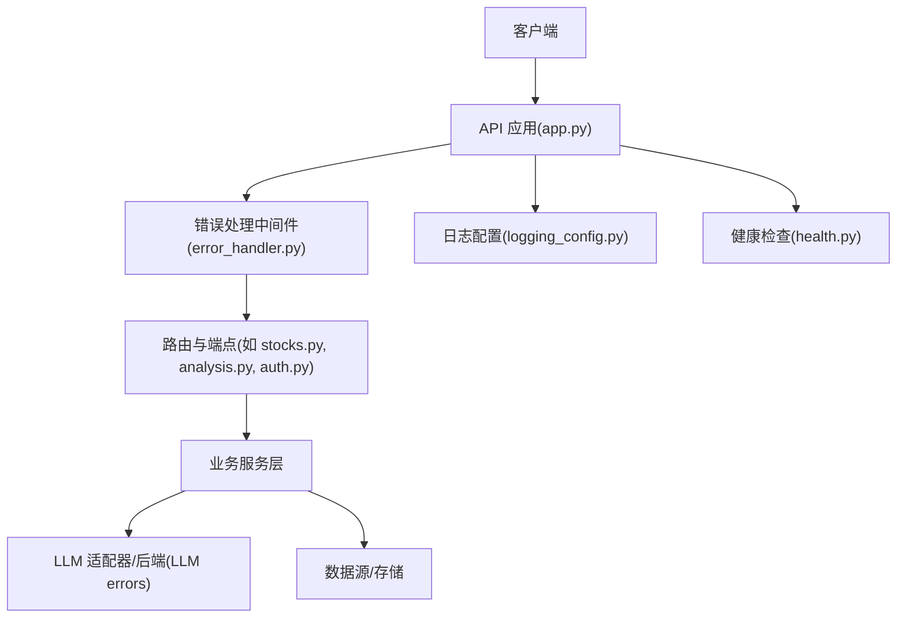
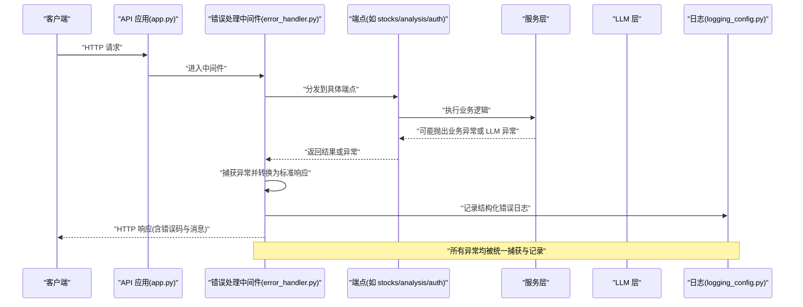
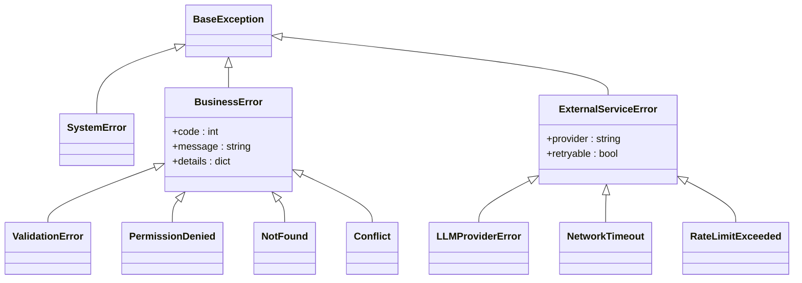
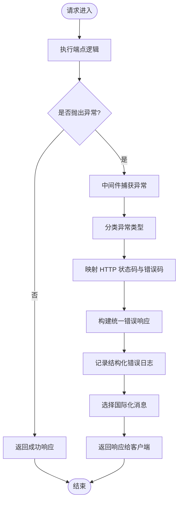
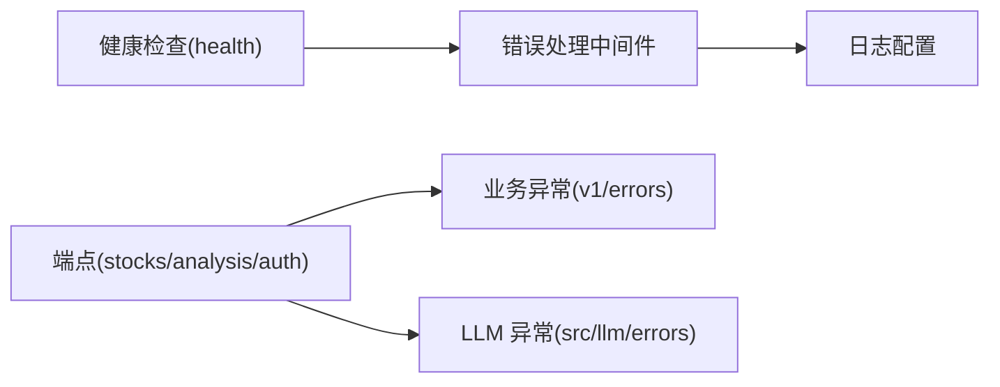

# 错误处理机制

<cite>
**本文引用的文件**   
- [api/app.py](file://api/app.py)
- [api/middlewares/error_handler.py](file://api/middlewares/error_handler.py)
- [api/v1/errors.py](file://api/v1/errors.py)
- [src/logging_config.py](file://src/logging_config.py)
- [src/llm/errors.py](file://src/llm/errors.py)
- [api/v1/endpoints/health.py](file://api/v1/endpoints/health.py)
- [api/v1/endpoints/auth.py](file://api/v1/endpoints/auth.py)
- [api/v1/endpoints/stocks.py](file://api/v1/endpoints/stocks.py)
- [api/v1/endpoints/analysis.py](file://api/v1/endpoints/analysis.py)
- [api/v1/schemas/common.py](file://api/v1/schemas/common.py)
- [tests/test_api_error_helpers.py](file://tests/test_api_error_helpers.py)
</cite>

## 目录
1. [简介](#简介)
2. [项目结构](#项目结构)
3. [核心组件](#核心组件)
4. [架构总览](#架构总览)
5. [详细组件分析](#详细组件分析)
6. [依赖关系分析](#依赖关系分析)
7. [性能考量](#性能考量)
8. [故障排查指南](#故障排查指南)
9. [结论](#结论)
10. [附录](#附录)

## 简介
本文件系统化阐述 Daily Stock Analysis 系统的错误处理机制，覆盖异常分类体系、错误码规范、全局错误处理器工作原理、调试与诊断工具，以及最佳实践与常见问题解决方案。目标是帮助开发者快速定位问题、统一错误响应格式、提升系统可观测性与稳定性。

## 项目结构
错误处理相关代码主要分布在以下位置：
- API 应用入口与中间件：负责注册全局异常捕获、统一响应格式化
- v1 错误定义与业务异常：定义领域内异常类型与错误码
- LLM 层异常：封装外部模型服务异常
- 日志配置：统一日志输出与上下文关联
- 健康检查端点：用于验证错误处理链路是否正常工作
- 测试用例：覆盖常见错误路径与边界条件

**图表来源** 
- [api/app.py](file://api/app.py)
- [api/middlewares/error_handler.py](file://api/middlewares/error_handler.py)
- [api/v1/endpoints/stocks.py](file://api/v1/endpoints/stocks.py)
- [api/v1/endpoints/analysis.py](file://api/v1/endpoints/analysis.py)
- [api/v1/endpoints/auth.py](file://api/v1/endpoints/auth.py)
- [src/logging_config.py](file://src/logging_config.py)
- [api/v1/endpoints/health.py](file://api/v1/endpoints/health.py)

**章节来源**
- [api/app.py](file://api/app.py)
- [api/middlewares/error_handler.py](file://api/middlewares/error_handler.py)
- [api/v1/errors.py](file://api/v1/errors.py)
- [src/logging_config.py](file://src/logging_config.py)
- [src/llm/errors.py](file://src/llm/errors.py)
- [api/v1/endpoints/health.py](file://api/v1/endpoints/health.py)

## 核心组件
- 全局错误处理器（中间件）：集中捕获未处理异常，转换为标准 HTTP 响应，记录结构化日志，并支持国际化提示。
- 业务异常体系：在 v1/errors.py 中定义业务域异常类，便于区分参数错误、权限不足、资源不存在等场景。
- LLM 层异常：在 src/llm/errors.py 中封装外部模型调用失败、配额限制、网络超时等异常，向上层提供统一语义。
- 日志配置：通过 src/logging_config.py 统一日志级别、格式与上下文注入，确保错误可追踪、可关联请求 ID。
- 健康检查端点：暴露 /health 接口，用于验证错误处理链路和依赖可用性。

**章节来源**
- [api/middlewares/error_handler.py](file://api/middlewares/error_handler.py)
- [api/v1/errors.py](file://api/v1/errors.py)
- [src/llm/errors.py](file://src/llm/errors.py)
- [src/logging_config.py](file://src/logging_config.py)
- [api/v1/endpoints/health.py](file://api/v1/endpoints/health.py)

## 架构总览
下图展示请求进入后的错误处理流程：从应用入口到中间件捕获、业务端点抛出异常、统一转换与响应生成，再到日志记录与健康检查。

**图表来源** 
- [api/app.py](file://api/app.py)
- [api/middlewares/error_handler.py](file://api/middlewares/error_handler.py)
- [api/v1/endpoints/stocks.py](file://api/v1/endpoints/stocks.py)
- [api/v1/endpoints/analysis.py](file://api/v1/endpoints/analysis.py)
- [api/v1/endpoints/auth.py](file://api/v1/endpoints/auth.py)
- [src/logging_config.py](file://src/logging_config.py)
- [src/llm/errors.py](file://src/llm/errors.py)

## 详细组件分析

### 异常分类体系
- 业务异常：由 v1/errors.py 中的自定义异常类表示，涵盖参数校验失败、权限不足、资源不存在、重复操作等。
- 系统异常：框架级异常（如数据库连接失败、序列化错误），由中间件统一捕获并降级为友好响应。
- 外部服务异常：LLM 层或其他第三方服务调用失败（网络超时、限流、认证失败），由 src/llm/errors.py 封装后上抛。

建议的层次结构：
- BaseException
  - SystemError（系统异常）
  - BusinessError（业务异常基类）
    - ValidationError（参数校验失败）
    - PermissionDenied（权限不足）
    - NotFound（资源不存在）
    - Conflict（冲突/重复操作）
  - ExternalServiceError（外部服务异常基类）
    - LLMProviderError（LLM 提供商错误）
    - NetworkTimeout（网络超时）
    - RateLimitExceeded（限流）

**图表来源** 
- [api/v1/errors.py](file://api/v1/errors.py)
- [src/llm/errors.py](file://src/llm/errors.py)

**章节来源**
- [api/v1/errors.py](file://api/v1/errors.py)
- [src/llm/errors.py](file://src/llm/errors.py)

### 错误码规范
- HTTP 状态码映射：
  - 4xx：客户端错误（参数校验失败、权限不足、资源不存在）
  - 5xx：服务端错误（系统异常、外部服务不可用）
  - 2xx：成功响应（正常业务结果）
- 错误响应格式：
  - 包含 code（错误码）、message（用户可读消息）、details（可选细节）、request_id（请求追踪 ID）
- 国际化支持：
  - message 字段根据当前语言环境动态选择本地化文案
  - 默认回退到英文或系统默认语言

建议的响应体结构：
- code：整数错误码
- message：字符串消息
- details：对象或数组，包含字段级错误信息
- request_id：字符串，用于跨层追踪

**章节来源**
- [api/middlewares/error_handler.py](file://api/middlewares/error_handler.py)
- [api/v1/schemas/common.py](file://api/v1/schemas/common.py)

### 全局错误处理器工作原理
- 异常捕获：中间件在请求生命周期内捕获所有未处理异常，避免进程崩溃。
- 错误转换：将不同来源的异常转换为统一的错误响应结构，设置合适的 HTTP 状态码。
- 用户友好响应：对外仅暴露必要信息，内部保留详细堆栈与上下文。
- 日志关联：注入 request_id，关联同一请求的全链路日志。
- 国际化：根据请求头或会话语言选择错误消息文案。

**图表来源** 
- [api/middlewares/error_handler.py](file://api/middlewares/error_handler.py)
- [src/logging_config.py](file://src/logging_config.py)

**章节来源**
- [api/middlewares/error_handler.py](file://api/middlewares/error_handler.py)
- [src/logging_config.py](file://src/logging_config.py)

### 调试与诊断工具
- 错误追踪：通过 request_id 贯穿请求链路，便于聚合日志与追踪。
- 堆栈分析：记录完整堆栈信息，定位异常发生的具体位置。
- 日志关联：使用结构化日志字段（如 user_id、stock_code、endpoint）过滤与检索。
- 健康检查：/health 端点可用于验证错误处理链路与依赖可用性。

**章节来源**
- [src/logging_config.py](file://src/logging_config.py)
- [api/v1/endpoints/health.py](file://api/v1/endpoints/health.py)

### 最佳实践与常见问题
- 最佳实践：
  - 明确异常分类，避免混用系统异常与业务异常
  - 统一错误响应格式，前端按 code 与 message 处理
  - 记录足够上下文，便于问题复现与定位
  - 对第三方服务调用增加重试与熔断策略
- 常见问题：
  - 未捕获异常导致进程退出：确保全局中间件生效
  - 错误消息泄露敏感信息：对外仅暴露必要信息
  - 日志缺失 request_id：检查日志配置与中间件注入
  - 国际化文案缺失：提供默认回退文案

**章节来源**
- [api/middlewares/error_handler.py](file://api/middlewares/error_handler.py)
- [src/logging_config.py](file://src/logging_config.py)

## 依赖关系分析
错误处理模块之间的依赖关系如下：
- 中间件依赖日志配置进行结构化记录
- 端点依赖业务异常与 LLM 异常进行错误传播
- 健康检查端点依赖错误处理链路以验证可用性

**图表来源** 
- [api/middlewares/error_handler.py](file://api/middlewares/error_handler.py)
- [src/logging_config.py](file://src/logging_config.py)
- [api/v1/errors.py](file://api/v1/errors.py)
- [src/llm/errors.py](file://src/llm/errors.py)
- [api/v1/endpoints/health.py](file://api/v1/endpoints/health.py)
- [api/v1/endpoints/stocks.py](file://api/v1/endpoints/stocks.py)
- [api/v1/endpoints/analysis.py](file://api/v1/endpoints/analysis.py)
- [api/v1/endpoints/auth.py](file://api/v1/endpoints/auth.py)

**章节来源**
- [api/middlewares/error_handler.py](file://api/middlewares/error_handler.py)
- [src/logging_config.py](file://src/logging_config.py)
- [api/v1/errors.py](file://api/v1/errors.py)
- [src/llm/errors.py](file://src/llm/errors.py)
- [api/v1/endpoints/health.py](file://api/v1/endpoints/health.py)
- [api/v1/endpoints/stocks.py](file://api/v1/endpoints/stocks.py)
- [api/v1/endpoints/analysis.py](file://api/v1/endpoints/analysis.py)
- [api/v1/endpoints/auth.py](file://api/v1/endpoints/auth.py)

## 性能考量
- 异常捕获开销：中间件应在非异常路径保持轻量，避免影响正常请求延迟。
- 日志写入：采用异步或批量写入，避免阻塞主线程。
- 错误响应构建：缓存常用错误消息模板，减少运行时计算。
- 外部服务调用：增加超时与重试上限，防止雪崩效应。

[本节为通用指导，不直接分析具体文件]

## 故障排查指南
- 确认全局中间件已注册：检查应用入口是否正确挂载错误处理中间件。
- 验证错误响应格式：使用 curl 或 Postman 调用端点，检查返回结构是否符合规范。
- 查看结构化日志：通过 request_id 过滤日志，定位异常堆栈与上下文。
- 健康检查：访问 /health 端点，确认依赖服务状态。
- 单元测试：运行 tests/test_api_error_helpers.py 验证错误处理路径。

**章节来源**
- [api/app.py](file://api/app.py)
- [api/middlewares/error_handler.py](file://api/middlewares/error_handler.py)
- [api/v1/endpoints/health.py](file://api/v1/endpoints/health.py)
- [tests/test_api_error_helpers.py](file://tests/test_api_error_helpers.py)

## 结论
Daily Stock Analysis 的错误处理机制通过统一中间件、清晰的异常分类、标准化的错误响应与结构化日志，实现了高可用与易维护性。开发者应遵循最佳实践，确保异常被正确捕获、转换与记录，同时为用户提供友好的错误提示。

[本节为总结性内容，不直接分析具体文件]

## 附录
- 参考实现路径：
  - 全局错误处理器：[api/middlewares/error_handler.py](file://api/middlewares/error_handler.py)
  - 业务异常定义：[api/v1/errors.py](file://api/v1/errors.py)
  - LLM 层异常：[src/llm/errors.py](file://src/llm/errors.py)
  - 日志配置：[src/logging_config.py](file://src/logging_config.py)
  - 健康检查：[api/v1/endpoints/health.py](file://api/v1/endpoints/health.py)
  - 错误响应模式：[api/v1/schemas/common.py](file://api/v1/schemas/common.py)
  - 测试用例：[tests/test_api_error_helpers.py](file://tests/test_api_error_helpers.py)

[本节为附录，不直接分析具体文件]