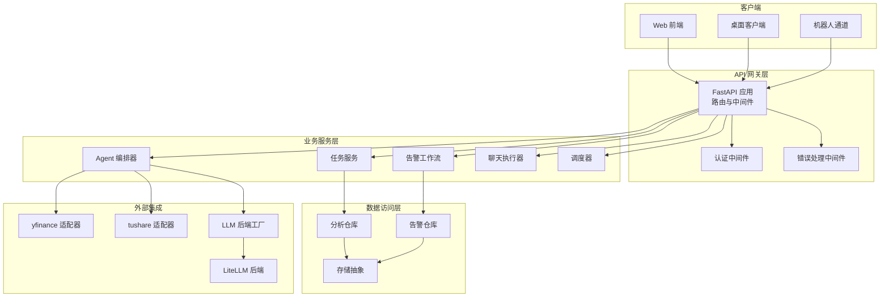
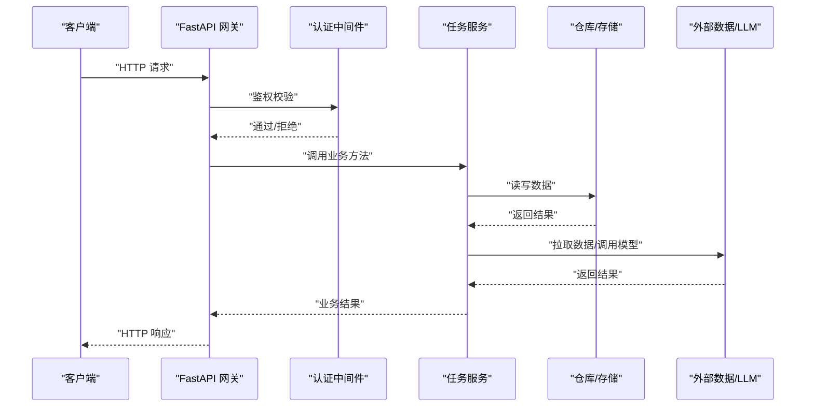
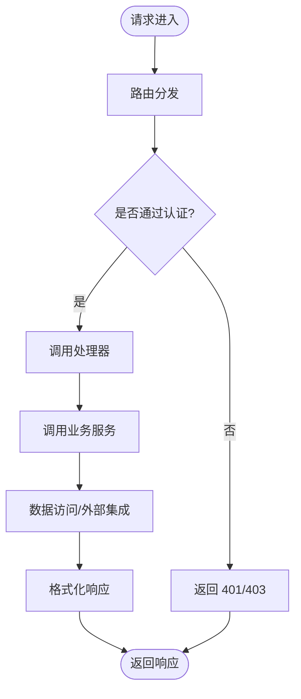
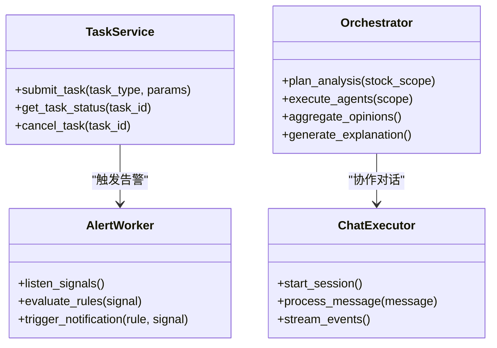
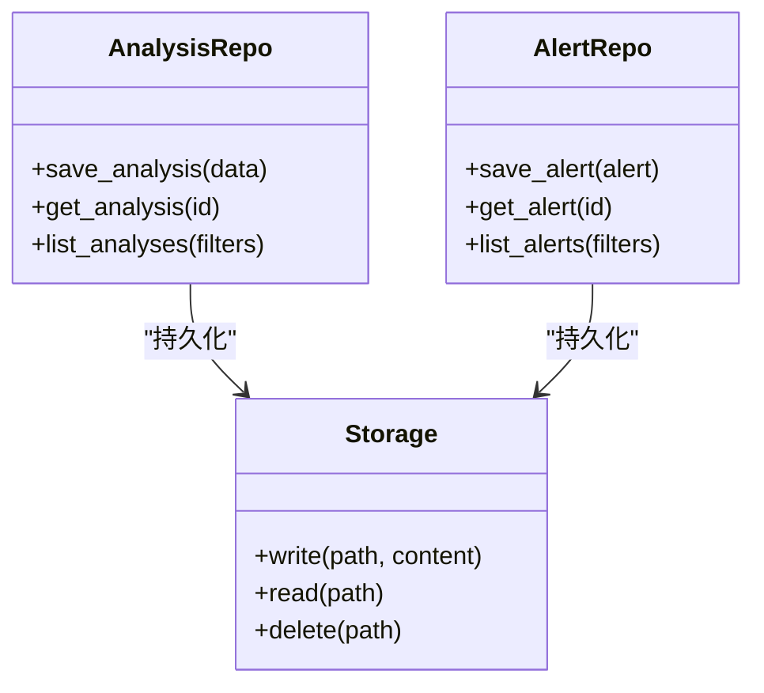
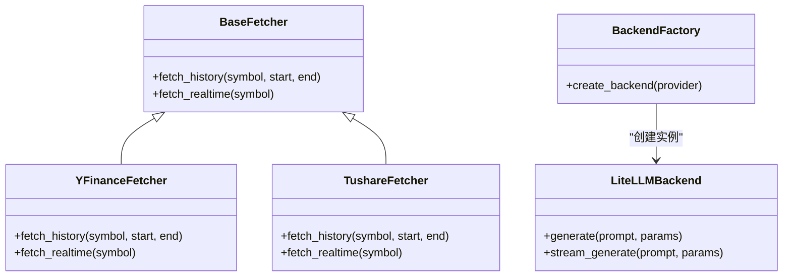
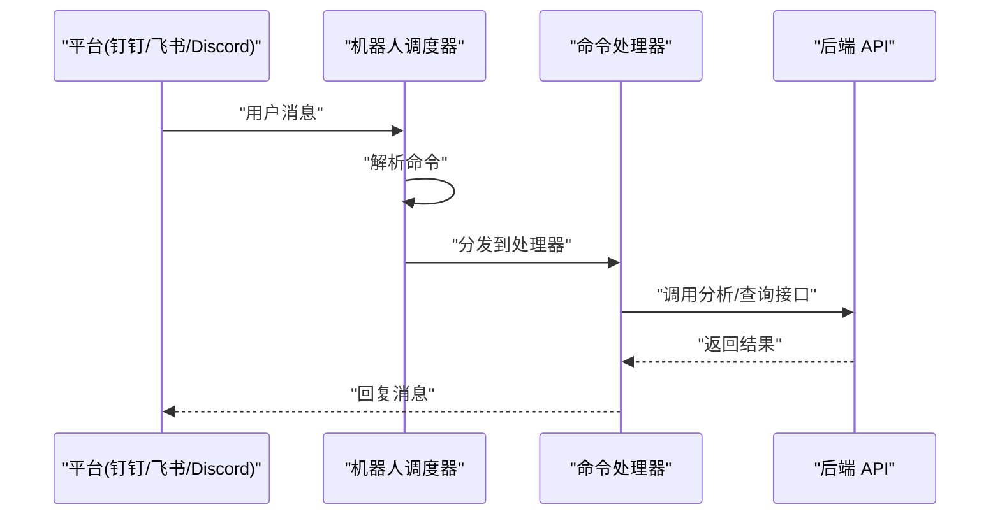
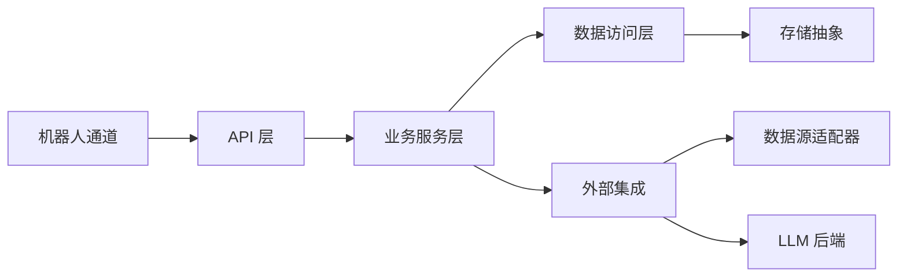

# 系统架构概览

<cite>
**本文引用的文件**   
- [main.py](file://main.py)
- [server.py](file://server.py)
- [api/app.py](file://api/app.py)
- [api/v1/router.py](file://api/v1/router.py)
- [src/config.py](file://src/config.py)
- [src/logging_config.py](file://src/logging_config.py)
- [src/auth.py](file://src/auth.py)
- [api/middlewares/auth.py](file://api/middlewares/auth.py)
- [api/middlewares/error_handler.py](file://api/middlewares/error_handler.py)
- [src/services/task_service.py](file://src/services/task_service.py)
- [src/services/alert_worker.py](file://src/services/alert_worker.py)
- [src/scheduler.py](file://src/scheduler.py)
- [data_provider/base.py](file://data_provider/base.py)
- [data_provider/yfinance_fetcher.py](file://data_provider/yfinance_fetcher.py)
- [data_provider/tushare_fetcher.py](file://data_provider/tushare_fetcher.py)
- [src/llm/backend_factory.py](file://src/llm/backend_factory.py)
- [src/llm/litellm_backend.py](file://src/llm/litellm_backend.py)
- [src/agent/orchestrator.py](file://src/agent/orchestrator.py)
- [src/agent/chat_executor.py](file://src/agent/chat_executor.py)
- [src/agent/events.py](file://src/agent/events.py)
- [src/repositories/analysis_repo.py](file://src/repositories/analysis_repo.py)
- [src/repositories/alert_repo.py](file://src/repositories/alert_repo.py)
- [src/storage.py](file://src/storage.py)
- [bot/dispatcher.py](file://bot/dispatcher.py)
- [bot/handler.py](file://bot/handler.py)
- [bot/platforms/dingtalk.py](file://bot/platforms/dingtalk.py)
- [docker/docker-compose.yml](file://docker/docker-compose.yml)
</cite>

## 目录
1. [简介](#简介)
2. [项目结构](#项目结构)
3. [核心组件](#核心组件)
4. [架构总览](#架构总览)
5. [详细组件分析](#详细组件分析)
6. [依赖关系分析](#依赖关系分析)
7. [性能考量](#性能考量)
8. [故障排查指南](#故障排查指南)
9. [结论](#结论)
10. [附录](#附录)

## 简介
本文件为 Daily Stock Analysis 系统的整体架构概览，面向技术与非技术读者，系统性阐述分层架构、微服务风格与事件驱动模式的应用。文档覆盖 API 网关层、业务服务层、数据访问层与外部系统集成，解释关键架构决策与技术选型权衡（如 FastAPI、异步处理、缓存策略），并说明扩展性设计（插件化、数据源适配器、技能框架）。同时提供系统上下文图与组件分解图，展示数据流向与消息传递机制，并给出安全认证、日志记录、错误处理与监控告警等跨领域关注点的处理方式。

## 项目结构
系统采用前后端分离与多语言混合部署：
- 后端以 Python 为主，使用 FastAPI 构建 REST/SSE 接口，结合异步任务与调度器实现后台作业。
- 前端 Web 应用位于 apps/dsa-web，桌面客户端位于 apps/dsa-desktop。
- 数据获取通过 data_provider 模块的多厂商适配器统一抽象。
- LLM 能力通过 src/llm 的后端工厂与适配层接入多种生成式模型。
- 机器人通道通过 bot 模块支持多平台（钉钉、飞书、Discord 等）。
- 持久化通过 repositories 与 storage 模块统一管理。

图表来源
- [api/app.py:1-200](file://api/app.py#L1-L200)
- [api/v1/router.py:1-200](file://api/v1/router.py#L1-L200)
- [src/services/task_service.py:1-200](file://src/services/task_service.py#L1-L200)
- [src/services/alert_worker.py:1-200](file://src/services/alert_worker.py#L1-L200)
- [src/agent/orchestrator.py:1-200](file://src/agent/orchestrator.py#L1-L200)
- [src/llm/backend_factory.py:1-200](file://src/llm/backend_factory.py#L1-L200)
- [data_provider/base.py:1-200](file://data_provider/base.py#L1-L200)

章节来源
- [main.py:1-100](file://main.py#L1-L100)
- [server.py:1-100](file://server.py#L1-L100)
- [api/app.py:1-200](file://api/app.py#L1-L200)
- [api/v1/router.py:1-200](file://api/v1/router.py#L1-L200)

## 核心组件
- API 网关层：基于 FastAPI 的 HTTP 入口，集中注册路由、挂载中间件（认证、错误处理）、统一响应格式与版本管理（v1）。
- 业务服务层：任务服务、告警工作流、Agent 编排器、聊天执行器、调度器等，负责业务流程编排与状态管理。
- 数据访问层：仓库抽象（分析、告警等）与存储抽象，屏蔽底层数据库或文件系统差异。
- 外部集成：数据源适配器（yfinance、tushare 等）、LLM 后端工厂与 LiteLLM 适配、机器人平台通道。

章节来源
- [api/app.py:1-200](file://api/app.py#L1-L200)
- [api/v1/router.py:1-200](file://api/v1/router.py#L1-L200)
- [src/services/task_service.py:1-200](file://src/services/task_service.py#L1-L200)
- [src/services/alert_worker.py:1-200](file://src/services/alert_worker.py#L1-L200)
- [src/agent/orchestrator.py:1-200](file://src/agent/orchestrator.py#L1-L200)
- [src/llm/backend_factory.py:1-200](file://src/llm/backend_factory.py#L1-L200)
- [data_provider/base.py:1-200](file://data_provider/base.py#L1-L200)

## 架构总览
系统采用分层架构与微服务风格组合：
- 分层架构：API 网关 → 业务服务 → 数据访问 → 外部集成，职责清晰、边界明确。
- 微服务风格：各服务可独立部署与扩展（任务服务、告警工作流、Agent 编排等），通过 API 与消息进行松耦合交互。
- 事件驱动：内部通过事件总线与队列驱动异步处理（如 Agent 事件、告警触发、任务完成回调），提升吞吐与弹性。

图表来源
- [api/app.py:1-200](file://api/app.py#L1-L200)
- [api/middlewares/auth.py:1-200](file://api/middlewares/auth.py#L1-L200)
- [src/services/task_service.py:1-200](file://src/services/task_service.py#L1-L200)
- [src/repositories/analysis_repo.py:1-200](file://src/repositories/analysis_repo.py#L1-L200)
- [src/storage.py:1-200](file://src/storage.py#L1-L200)
- [src/llm/backend_factory.py:1-200](file://src/llm/backend_factory.py#L1-L200)

## 详细组件分析

### API 网关层（FastAPI）
- 路由组织：按 v1 版本划分，模块化 endpoints（stocks、analysis、alerts、backtest、portfolio 等），便于扩展与维护。
- 中间件：认证中间件统一鉴权；错误处理中间件统一异常捕获与错误码映射。
- 配置与启动：应用初始化、CORS、静态资源、健康检查等。

图表来源
- [api/v1/router.py:1-200](file://api/v1/router.py#L1-L200)
- [api/middlewares/auth.py:1-200](file://api/middlewares/auth.py#L1-L200)
- [api/middlewares/error_handler.py:1-200](file://api/middlewares/error_handler.py#L1-L200)

章节来源
- [api/app.py:1-200](file://api/app.py#L1-L200)
- [api/v1/router.py:1-200](file://api/v1/router.py#L1-L200)
- [api/middlewares/auth.py:1-200](file://api/middlewares/auth.py#L1-L200)
- [api/middlewares/error_handler.py:1-200](file://api/middlewares/error_handler.py#L1-L200)

### 业务服务层（任务服务、告警工作流、Agent 编排）
- 任务服务：封装长耗时任务的提交、状态查询与结果获取，支持异步与重试。
- 告警工作流：监听市场信号与规则，触发通知与后续动作。
- Agent 编排器：协调多个子 Agent（技术面、基本面、风险、组合等），聚合意见与最终解释。
- 聊天执行器：维护会话上下文、工具调用与流式输出（SSE）。

图表来源
- [src/services/task_service.py:1-200](file://src/services/task_service.py#L1-L200)
- [src/services/alert_worker.py:1-200](file://src/services/alert_worker.py#L1-L200)
- [src/agent/orchestrator.py:1-200](file://src/agent/orchestrator.py#L1-L200)
- [src/agent/chat_executor.py:1-200](file://src/agent/chat_executor.py#L1-L200)

章节来源
- [src/services/task_service.py:1-200](file://src/services/task_service.py#L1-L200)
- [src/services/alert_worker.py:1-200](file://src/services/alert_worker.py#L1-L200)
- [src/agent/orchestrator.py:1-200](file://src/agent/orchestrator.py#L1-L200)
- [src/agent/chat_executor.py:1-200](file://src/agent/chat_executor.py#L1-L200)

### 数据访问层（仓库与存储）
- 仓库抽象：分析结果、告警、决策信号等实体的 CRUD 操作，解耦具体存储实现。
- 存储抽象：统一文件、内存或数据库访问，支持配置切换与扩展。

图表来源
- [src/repositories/analysis_repo.py:1-200](file://src/repositories/analysis_repo.py#L1-L200)
- [src/repositories/alert_repo.py:1-200](file://src/repositories/alert_repo.py#L1-L200)
- [src/storage.py:1-200](file://src/storage.py#L1-L200)

章节来源
- [src/repositories/analysis_repo.py:1-200](file://src/repositories/analysis_repo.py#L1-L200)
- [src/repositories/alert_repo.py:1-200](file://src/repositories/alert_repo.py#L1-L200)
- [src/storage.py:1-200](file://src/storage.py#L1-L200)

### 外部系统集成（数据源适配器与 LLM 后端）
- 数据源适配器：统一 base 接口，yfinance、tushare 等实现差异化获取逻辑，支持热插拔与回退策略。
- LLM 后端工厂：根据配置选择不同后端（LiteLLM、本地 CLI 等），统一参数与响应格式。

图表来源
- [data_provider/base.py:1-200](file://data_provider/base.py#L1-L200)
- [data_provider/yfinance_fetcher.py:1-200](file://data_provider/yfinance_fetcher.py#L1-L200)
- [data_provider/tushare_fetcher.py:1-200](file://data_provider/tushare_fetcher.py#L1-L200)
- [src/llm/backend_factory.py:1-200](file://src/llm/backend_factory.py#L1-L200)
- [src/llm/litellm_backend.py:1-200](file://src/llm/litellm_backend.py#L1-L200)

章节来源
- [data_provider/base.py:1-200](file://data_provider/base.py#L1-L200)
- [data_provider/yfinance_fetcher.py:1-200](file://data_provider/yfinance_fetcher.py#L1-L200)
- [data_provider/tushare_fetcher.py:1-200](file://data_provider/tushare_fetcher.py#L1-L200)
- [src/llm/backend_factory.py:1-200](file://src/llm/backend_factory.py#L1-L200)
- [src/llm/litellm_backend.py:1-200](file://src/llm/litellm_backend.py#L1-L200)

### 机器人通道（多平台支持）
- 调度器：接收命令、解析意图、分发给对应处理器。
- 处理器：实现具体命令逻辑（分析、研究、历史等）。
- 平台适配：钉钉、飞书、Discord 等平台的消息收发与事件转换。

图表来源
- [bot/dispatcher.py:1-200](file://bot/dispatcher.py#L1-L200)
- [bot/handler.py:1-200](file://bot/handler.py#L1-L200)
- [bot/platforms/dingtalk.py:1-200](file://bot/platforms/dingtalk.py#L1-L200)

章节来源
- [bot/dispatcher.py:1-200](file://bot/dispatcher.py#L1-L200)
- [bot/handler.py:1-200](file://bot/handler.py#L1-L200)
- [bot/platforms/dingtalk.py:1-200](file://bot/platforms/dingtalk.py#L1-L200)

## 依赖关系分析
- 组件内聚与耦合：API 层仅依赖服务层接口；服务层通过仓库抽象与存储解耦；外部集成通过适配器与工厂隔离变化。
- 直接/间接依赖：任务服务依赖仓库与存储；Agent 编排依赖 LLM 工厂与数据源适配器；机器人通道依赖 API 与平台适配。
- 循环依赖：通过接口与工厂避免循环引用，确保模块边界清晰。
- 外部依赖：FastAPI、异步任务库、LLM 提供商 SDK、数据源 SDK。

图表来源
- [api/app.py:1-200](file://api/app.py#L1-L200)
- [src/services/task_service.py:1-200](file://src/services/task_service.py#L1-L200)
- [src/repositories/analysis_repo.py:1-200](file://src/repositories/analysis_repo.py#L1-L200)
- [src/storage.py:1-200](file://src/storage.py#L1-L200)
- [data_provider/base.py:1-200](file://data_provider/base.py#L1-L200)
- [src/llm/backend_factory.py:1-200](file://src/llm/backend_factory.py#L1-L200)
- [bot/dispatcher.py:1-200](file://bot/dispatcher.py#L1-L200)

章节来源
- [api/app.py:1-200](file://api/app.py#L1-L200)
- [src/services/task_service.py:1-200](file://src/services/task_service.py#L1-L200)
- [src/repositories/analysis_repo.py:1-200](file://src/repositories/analysis_repo.py#L1-L200)
- [src/storage.py:1-200](file://src/storage.py#L1-L200)
- [data_provider/base.py:1-200](file://data_provider/base.py#L1-L200)
- [src/llm/backend_factory.py:1-200](file://src/llm/backend_factory.py#L1-L200)
- [bot/dispatcher.py:1-200](file://bot/dispatcher.py#L1-L200)

## 性能考量
- 异步处理：FastAPI 原生异步 I/O，结合任务队列与调度器提升并发吞吐。
- 缓存策略：对热点数据（指数映射、股票列表、实时行情）实施多级缓存（内存/Redis/文件），降低外部依赖压力。
- 连接池与限流：对外部 API 调用设置超时、重试与熔断，避免雪崩。
- 流式输出：Agent 聊天与报告生成采用 SSE 流式传输，改善用户体验。
- 批处理与分页：批量拉取历史数据与分页查询，减少网络往返。

[本节为通用指导，不直接分析具体文件]

## 故障排查指南
- 认证失败：检查中间件配置、密钥与环境变量；查看鉴权日志。
- 数据源异常：检查适配器配置、网络连通性与速率限制；启用降级与回退。
- LLM 调用失败：检查后端工厂配置、模型可用性；启用重试与备用提供商。
- 任务阻塞：检查任务队列状态、消费者负载与死信队列；调整并发与超时。
- 告警误报/漏报：检查规则引擎与阈值配置；验证输入数据质量。

章节来源
- [api/middlewares/auth.py:1-200](file://api/middlewares/auth.py#L1-L200)
- [api/middlewares/error_handler.py:1-200](file://api/middlewares/error_handler.py#L1-L200)
- [src/logging_config.py:1-200](file://src/logging_config.py#L1-L200)
- [src/scheduler.py:1-200](file://src/scheduler.py#L1-L200)
- [src/services/alert_worker.py:1-200](file://src/services/alert_worker.py#L1-L200)

## 结论
Daily Stock Analysis 系统通过分层架构、微服务风格与事件驱动模式，实现了高内聚、低耦合与可扩展的设计。FastAPI 作为网关层提供高性能与易用性；异步处理与缓存策略保障吞吐与稳定性；插件化与适配器模式使数据源与 LLM 后端易于替换与扩展。通过统一的认证、日志、错误处理与监控告警，系统在安全性与可观测性方面具备良好基础。未来可进一步引入服务网格与分布式追踪，以提升复杂场景下的可运维性。

[本节为总结，不直接分析具体文件]

## 附录
- 部署参考：容器化与编排见 docker 目录。
- 配置管理：系统配置与运行时开关集中在配置模块。
- 测试与诊断：单元测试与端到端测试覆盖核心路径，诊断脚本辅助排障。

章节来源
- [docker/docker-compose.yml:1-200](file://docker/docker-compose.yml#L1-L200)
- [src/config.py:1-200](file://src/config.py#L1-L200)