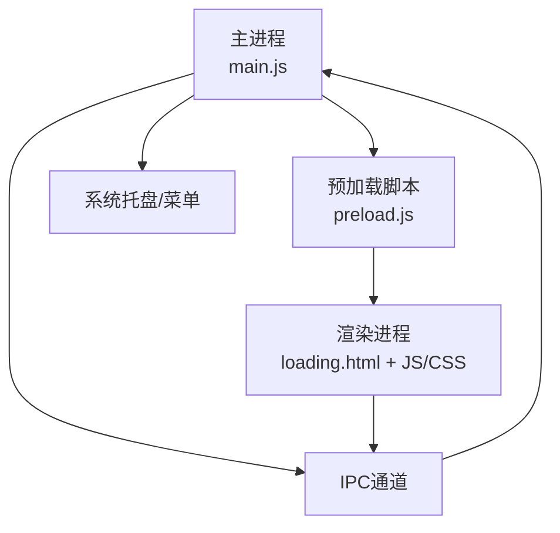
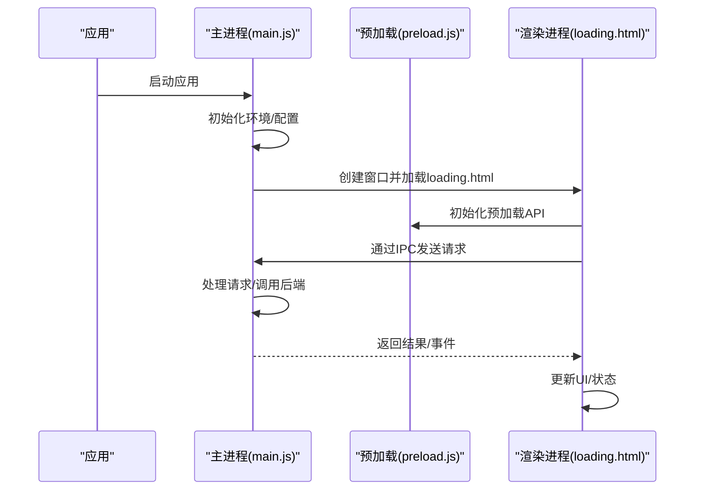
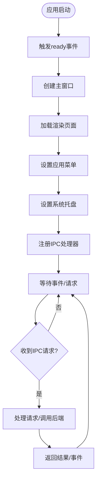
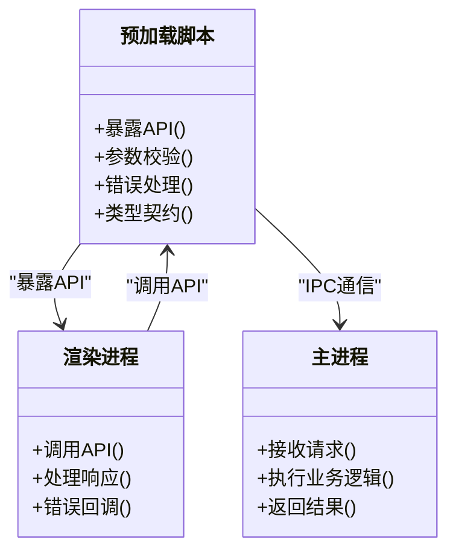
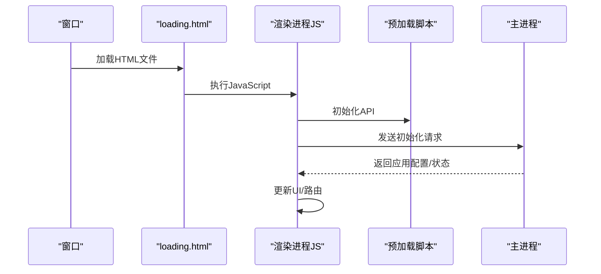
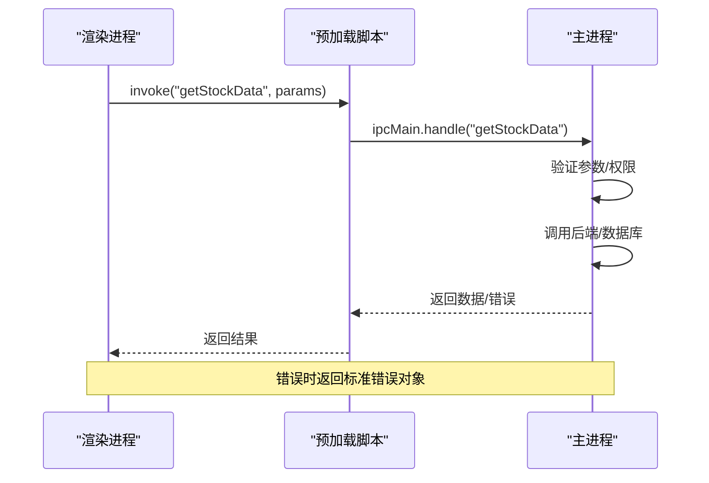
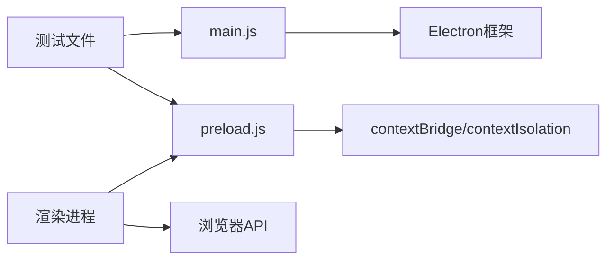

# Electron架构设计

<cite>
**本文引用的文件**   
- [main.js](file://apps/dsa-desktop/main.js)
- [preload.js](file://apps/dsa-desktop/preload.js)
- [package.json](file://apps/dsa-desktop/package.json)
- [loading.html](file://apps/dsa-desktop/renderer/loading.html)
- [main.test.js](file://apps/dsa-desktop/tests/main.test.js)
- [preload.test.js](file://apps/dsa-desktop/tests/preload.test.js)
</cite>

## 目录
1. [简介](#简介)
2. [项目结构](#项目结构)
3. [核心组件](#核心组件)
4. [架构总览](#架构总览)
5. [详细组件分析](#详细组件分析)
6. [依赖关系分析](#依赖关系分析)
7. [性能考虑](#性能考虑)
8. [故障排查指南](#故障排查指南)
9. [结论](#结论)
10. [附录](#附录)

## 简介
本文件为 Daily Stock Analysis 桌面应用（Electron）的架构文档，聚焦主进程、预加载脚本与渲染进程的协作方式，重点阐述：
- 主进程的职责与生命周期管理（窗口创建、菜单设置、系统托盘集成、事件处理）
- 预加载脚本的安全模型（Node.js API 暴露方式、上下文隔离与安全最佳实践）
- 渲染进程启动流程（HTML入口加载、CSS样式应用、JS模块初始化）
- IPC通信机制（同步/异步消息传递、事件监听与错误处理）
- 进程间通信的安全考量与性能优化建议
- 提供实际代码示例路径，展示如何正确实现主进程与渲染进程之间的安全通信

## 项目结构
Electron桌面端位于 apps/dsa-desktop 目录，关键文件包括：
- main.js：Electron主进程入口，负责应用生命周期、窗口管理、菜单与托盘、IPC路由等
- preload.js：预加载脚本，用于在主进程与渲染进程之间建立安全的API桥接
- renderer/loading.html：渲染进程初始页面（加载页），作为SPA或主UI的占位
- package.json：Electron应用配置与打包脚本
- tests/main.test.js、tests/preload.test.js：针对主进程与预加载脚本的测试用例

**图示来源** 
- [main.js](file://apps/dsa-desktop/main.js)
- [preload.js](file://apps/dsa-desktop/preload.js)
- [loading.html](file://apps/dsa-desktop/renderer/loading.html)

**章节来源**
- [package.json](file://apps/dsa-desktop/package.json)

## 核心组件
- 主进程（main.js）
  - 应用生命周期：初始化、ready、window-all-closed、before-quit等事件处理
  - 窗口管理：创建BrowserWindow、加载渲染页面、窗口状态与尺寸控制
  - 菜单与托盘：构建应用菜单、系统托盘图标与上下文菜单
  - IPC路由：注册频道、处理渲染进程请求、转发到后端服务或本地逻辑
- 预加载脚本（preload.js）
  - 安全桥接：通过contextBridge暴露最小化API给渲染进程
  - Node.js API限制：仅暴露必要能力（如文件系统读取、路径解析等），避免直接暴露危险API
  - 类型契约：定义清晰的输入输出结构，便于校验与错误处理
- 渲染进程（loading.html及后续UI）
  - 入口加载：加载loading.html，随后切换至主界面
  - 样式与资源：引入CSS与静态资源，确保主题一致
  - 模块初始化：初始化前端状态、订阅IPC事件、调用预加载暴露的API

**章节来源**
- [main.js](file://apps/dsa-desktop/main.js)
- [preload.js](file://apps/dsa-desktop/preload.js)
- [loading.html](file://apps/dsa-desktop/renderer/loading.html)

## 架构总览
下图展示了Electron应用的三层架构与数据流：主进程负责系统级能力与业务编排，预加载脚本充当安全边界，渲染进程专注UI交互。

**图示来源** 
- [main.js](file://apps/dsa-desktop/main.js)
- [preload.js](file://apps/dsa-desktop/preload.js)
- [loading.html](file://apps/dsa-desktop/renderer/loading.html)

## 详细组件分析

### 主进程（main.js）职责与生命周期
- 生命周期事件
  - ready：应用初始化完成，创建主窗口、注册菜单与托盘、绑定IPC处理器
  - window-all-closed：在macOS以外的平台退出应用；在macOS上隐藏窗口而非退出
  - before-quit：清理资源、保存状态、关闭后台任务
- 窗口管理
  - 创建BrowserWindow，设置大小、位置、是否显示、是否可调整大小等
  - 加载渲染页面（本地文件或开发服务器地址）
  - 监听窗口事件（如close、resize、focus等）以执行副作用
- 菜单与托盘
  - 构建应用菜单（File、Edit、View、Help等）
  - 创建系统托盘图标，添加右键菜单项（打开、退出、设置等）
- IPC路由
  - 使用ipcMain.handle/registerHandler处理异步请求
  - 使用ipcMain.on处理事件通知
  - 对请求进行鉴权、参数校验、错误捕获与日志记录

**图示来源** 
- [main.js](file://apps/dsa-desktop/main.js)

**章节来源**
- [main.js](file://apps/dsa-desktop/main.js)

### 预加载脚本（preload.js）安全模型
- 上下文隔离
  - 使用contextIsolation: true，确保渲染进程无法直接访问Node.js API
  - 通过contextBridge.exposeInMainWorld暴露最小化API集合
- 暴露的API原则
  - 只暴露渲染进程必需的能力（如读取配置文件、获取系统信息）
  - 禁止直接暴露fs、child_process、path等危险模块
  - 所有API需进行参数校验与白名单检查
- 错误处理
  - 统一错误码与消息格式
  - 捕获异常并返回友好错误提示
- 类型契约
  - 定义输入输出结构，便于前后端联调与测试

**图示来源** 
- [preload.js](file://apps/dsa-desktop/preload.js)

**章节来源**
- [preload.js](file://apps/dsa-desktop/preload.js)

### 渲染进程启动流程
- HTML入口加载
  - 加载renderer/loading.html作为初始页面
  - 根据应用状态切换到主界面或保持加载页
- CSS样式应用
  - 引入全局样式与主题文件
  - 支持动态主题切换与响应式布局
- JavaScript模块初始化
  - 初始化前端状态管理（如Redux/Vuex/Pinia）
  - 订阅IPC事件，处理主进程推送的消息
  - 调用预加载脚本暴露的API进行数据获取与操作

**图示来源** 
- [loading.html](file://apps/dsa-desktop/renderer/loading.html)
- [preload.js](file://apps/dsa-desktop/preload.js)
- [main.js](file://apps/dsa-desktop/main.js)

**章节来源**
- [loading.html](file://apps/dsa-desktop/renderer/loading.html)

### IPC通信机制
- 异步通信
  - 使用ipcRenderer.invoke发送请求，ipcMain.handle处理
  - 适用于需要返回值的数据查询与操作
- 事件通信
  - 使用ipcRenderer.send发送事件，ipcMain.on监听
  - 适用于单向通知与实时数据推送
- 错误处理
  - 捕获网络错误、业务异常、权限错误
  - 统一错误码与重试机制
- 性能优化
  - 批量处理请求，减少IPC调用次数
  - 使用事件节流与防抖，避免频繁刷新

**图示来源** 
- [preload.js](file://apps/dsa-desktop/preload.js)
- [main.js](file://apps/dsa-desktop/main.js)

**章节来源**
- [preload.js](file://apps/dsa-desktop/preload.js)
- [main.js](file://apps/dsa-desktop/main.js)

## 依赖关系分析
Electron应用的核心依赖关系如下：
- main.js依赖Electron框架API（app、BrowserWindow、Menu、Tray、ipcMain等）
- preload.js依赖contextBridge和contextIsolation安全机制
- 渲染进程依赖浏览器API与预加载脚本暴露的API
- 测试文件验证主进程与预加载脚本的功能正确性

**图示来源** 
- [main.js](file://apps/dsa-desktop/main.js)
- [preload.js](file://apps/dsa-desktop/preload.js)
- [main.test.js](file://apps/dsa-desktop/tests/main.test.js)
- [preload.test.js](file://apps/dsa-desktop/tests/preload.test.js)

**章节来源**
- [package.json](file://apps/dsa-desktop/package.json)

## 性能考虑
- 主进程优化
  - 延迟初始化非关键功能，缩短启动时间
  - 使用单例模式管理共享资源（如数据库连接、HTTP客户端）
  - 避免在主线程执行耗时操作，使用Worker或子进程
- 预加载脚本优化
  - 最小化API暴露范围，减少内存占用
  - 缓存常用数据，避免重复计算
- 渲染进程优化
  - 使用虚拟滚动处理大量数据列表
  - 懒加载组件与路由，减少首屏加载时间
  - 合理使用Web Worker处理复杂计算
- IPC优化
  - 合并多次小请求为大请求，减少IPC开销
  - 使用事件节流与防抖，避免频繁通信
  - 实现请求去重与缓存机制

## 故障排查指南
- 常见问题
  - 窗口无法创建：检查Electron版本兼容性、资源路径是否正确
  - IPC通信失败：确认频道名称一致、参数格式正确、权限设置合理
  - 预加载脚本错误：检查contextIsolation配置、API暴露是否完整
  - 内存泄漏：监控内存使用，及时释放不需要的引用
- 调试技巧
  - 使用Chrome DevTools调试渲染进程
  - 启用Electron调试日志，查看主进程错误堆栈
  - 编写单元测试覆盖关键逻辑
- 日志记录
  - 统一日志格式，包含时间戳、级别、模块、消息
  - 区分开发环境与生产环境的日志策略
  - 定期清理历史日志，避免磁盘占用过大

**章节来源**
- [main.test.js](file://apps/dsa-desktop/tests/main.test.js)
- [preload.test.js](file://apps/dsa-desktop/tests/preload.test.js)

## 结论
Daily Stock Analysis桌面应用采用标准的Electron三进程架构，通过主进程、预加载脚本与渲染进程的明确分工，实现了安全、高效的用户体验。主进程负责系统级能力与业务编排，预加载脚本提供安全API桥接，渲染进程专注UI交互。通过合理的IPC通信机制与性能优化策略，应用能够稳定运行并提供良好的用户体验。

## 附录
- 安全最佳实践
  - 始终启用contextIsolation与sandbox
  - 最小化暴露API，避免直接访问Node.js模块
  - 对所有用户输入进行严格校验
  - 实现请求白名单与权限控制
- 性能优化清单
  - 使用懒加载与代码分割
  - 实现数据缓存与请求去重
  - 监控内存与CPU使用情况
  - 优化图片与静态资源加载
- 部署注意事项
  - 配置正确的签名与公证（macOS）
  - 设置自动更新机制
  - 收集崩溃报告与用户反馈
  - 定期更新依赖包修复安全漏洞