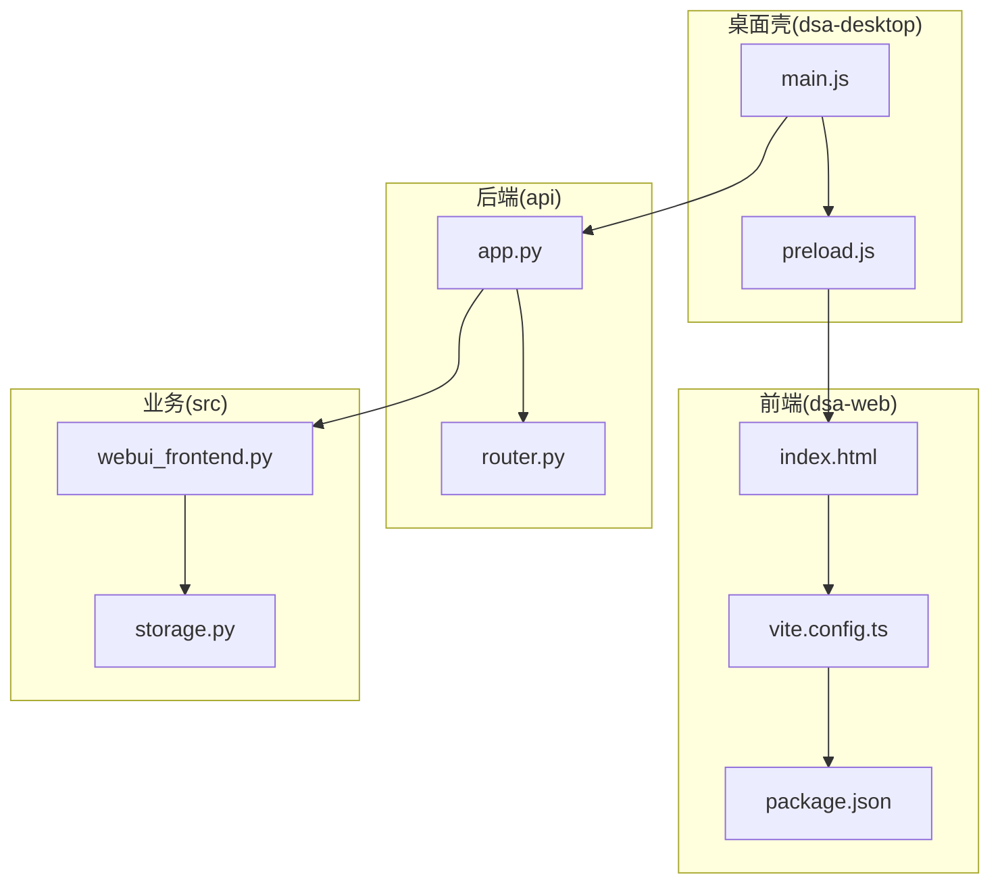
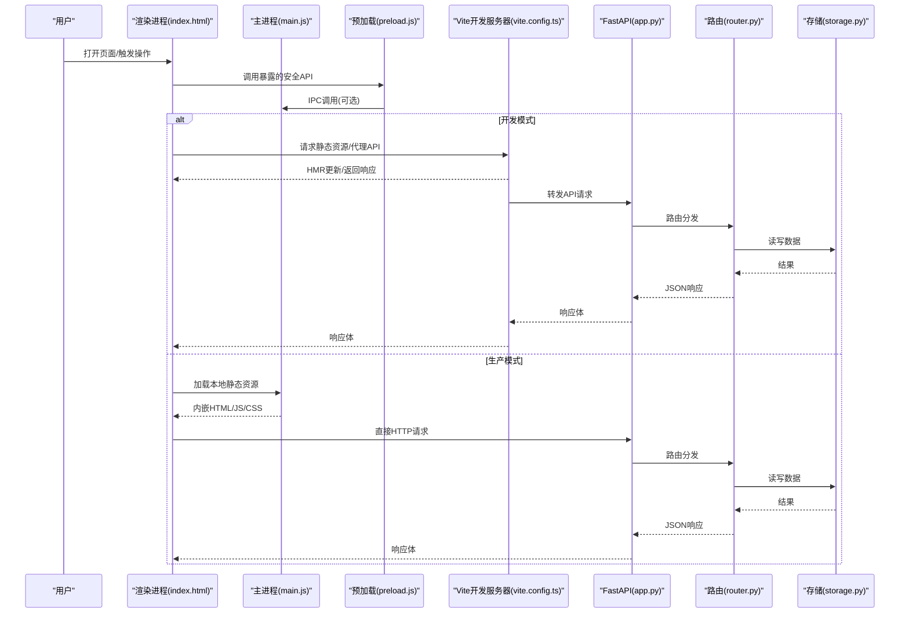
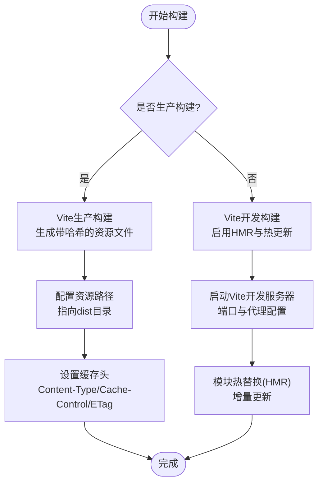
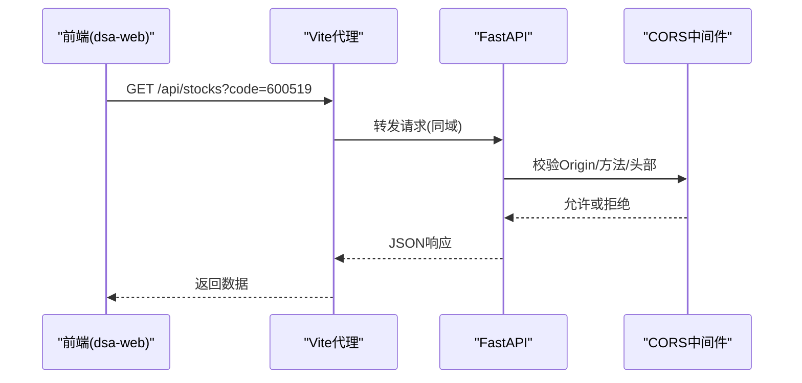
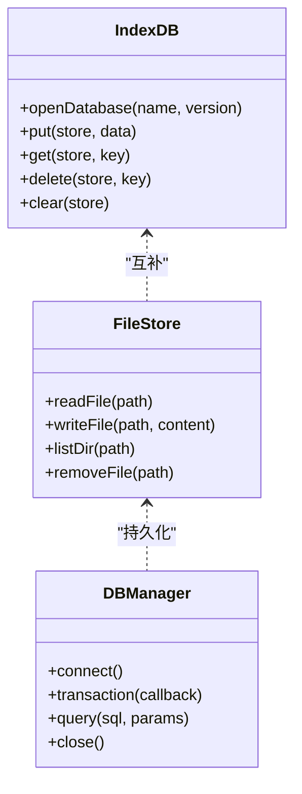
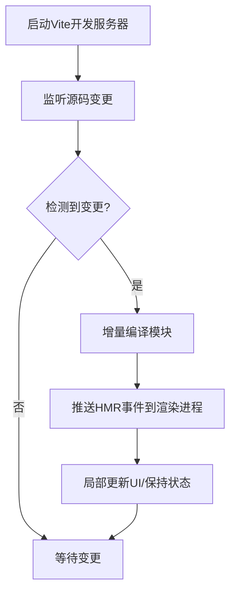
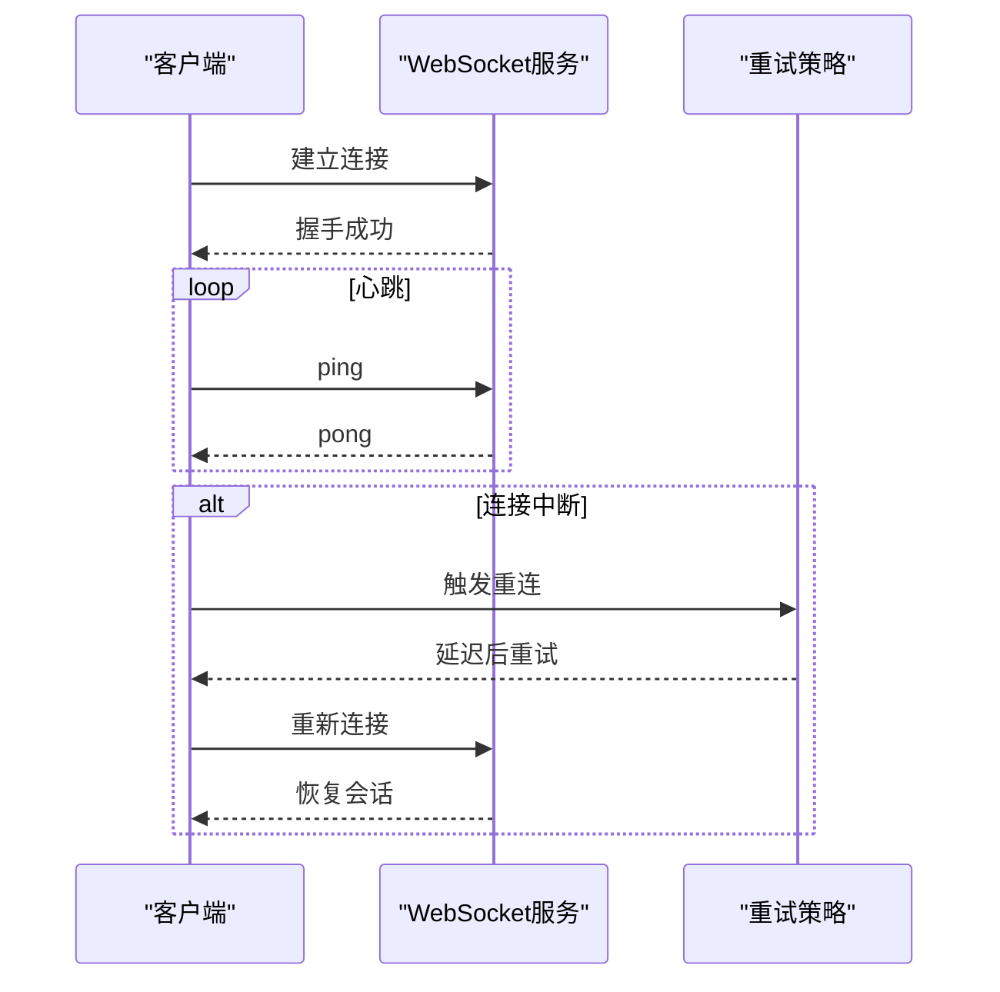
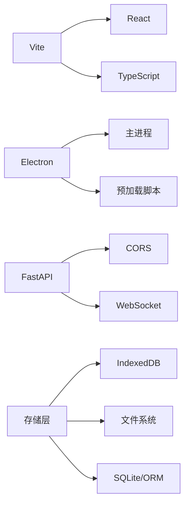

# Web应用集成

<cite>
**本文引用的文件**   
- [vite.config.ts](file://apps/dsa-web/vite.config.ts)
- [index.html](file://apps/dsa-web/index.html)
- [package.json](file://apps/dsa-web/package.json)
- [main.js](file://apps/dsa-desktop/main.js)
- [preload.js](file://apps/dsa-desktop/preload.js)
- [app.py](file://api/app.py)
- [router.py](file://api/v1/router.py)
- [webui_frontend.py](file://src/webui_frontend.py)
- [storage.py](file://src/storage.py)
</cite>

## 目录
1. [简介](#简介)
2. [项目结构](#项目结构)
3. [核心组件](#核心组件)
4. [架构总览](#架构总览)
5. [详细组件分析](#详细组件分析)
6. [依赖分析](#依赖分析)
7. [性能考虑](#性能考虑)
8. [故障排查指南](#故障排查指南)
9. [结论](#结论)
10. [附录](#附录)

## 简介
本文件面向Daily Stock Analysis桌面应用的Web应用集成，聚焦以下目标：
- 静态资源嵌入：前端构建产物打包、资源路径配置与缓存策略
- API代理：开发环境代理、生产环境反向代理与跨域处理
- 本地存储与持久化：IndexedDB、文件存储与数据库连接管理
- 开发体验：Vite开发服务器、模块热替换与调试工具
- 后端通信：WebSocket连接、实时数据推送与错误重试
- 性能优化：资源懒加载、内存管理与CPU使用优化
- 配置示例与常见问题解决方案

## 项目结构
本项目采用前后端分离的桌面应用形态：
- 前端（dsa-web）：基于Vite + TypeScript/React的前端工程，负责UI与API调用
- 桌面壳（dsa-desktop）：Electron主进程与预加载脚本，承载渲染进程并桥接系统能力
- 后端（api）：Python FastAPI服务，提供REST接口与中间件
- 业务层（src）：Python业务逻辑、存储与Web UI集成辅助

**图表来源** 
- [main.js](file://apps/dsa-desktop/main.js)
- [preload.js](file://apps/dsa-desktop/preload.js)
- [vite.config.ts](file://apps/dsa-web/vite.config.ts)
- [index.html](file://apps/dsa-web/index.html)
- [package.json](file://apps/dsa-web/package.json)
- [app.py](file://api/app.py)
- [router.py](file://api/v1/router.py)
- [webui_frontend.py](file://src/webui_frontend.py)
- [storage.py](file://src/storage.py)

**章节来源**
- [vite.config.ts](file://apps/dsa-web/vite.config.ts)
- [index.html](file://apps/dsa-web/index.html)
- [package.json](file://apps/dsa-web/package.json)
- [main.js](file://apps/dsa-desktop/main.js)
- [preload.js](file://apps/dsa-desktop/preload.js)
- [app.py](file://api/app.py)
- [router.py](file://api/v1/router.py)
- [webui_frontend.py](file://src/webui_frontend.py)
- [storage.py](file://src/storage.py)

## 核心组件
- Vite前端构建与开发服务器：负责资源打包、路径解析、HMR与开发代理
- Electron主进程与预加载脚本：启动渲染进程、注入安全上下文、桥接系统API
- FastAPI后端：路由注册、中间件、CORS与静态资源托管
- 存储层：IndexedDB（浏览器）、文件系统（桌面）、SQLite/ORM（后端）

**章节来源**
- [vite.config.ts](file://apps/dsa-web/vite.config.ts)
- [main.js](file://apps/dsa-desktop/main.js)
- [preload.js](file://apps/dsa-desktop/preload.js)
- [app.py](file://api/app.py)
- [storage.py](file://src/storage.py)

## 架构总览
下图展示从用户交互到后端服务的完整链路，包括开发模式下的代理转发与生产模式的静态资源嵌入。

**图表来源** 
- [index.html](file://apps/dsa-web/index.html)
- [main.js](file://apps/dsa-desktop/main.js)
- [preload.js](file://apps/dsa-desktop/preload.js)
- [vite.config.ts](file://apps/dsa-web/vite.config.ts)
- [app.py](file://api/app.py)
- [router.py](file://api/v1/router.py)
- [storage.py](file://src/storage.py)

## 详细组件分析

### 静态资源嵌入与构建
- 构建产物打包：Vite将TypeScript/React源码编译为静态资源，输出至dist目录；通过环境变量区分开发与生产构建
- 资源路径配置：在开发模式下由Vite动态生成资源URL；在生产模式下由Electron或后端托管静态目录，确保相对路径正确
- 缓存策略：生产构建启用内容哈希文件名，配合服务端Cache-Control与ETag实现强缓存；开发模式禁用缓存以支持HMR

**图表来源** 
- [vite.config.ts](file://apps/dsa-web/vite.config.ts)
- [package.json](file://apps/dsa-web/package.json)

**章节来源**
- [vite.config.ts](file://apps/dsa-web/vite.config.ts)
- [package.json](file://apps/dsa-web/package.json)

### API代理与跨域处理
- 开发环境代理：Vite开发服务器根据规则将/api等前缀转发至后端FastAPI，避免跨域问题
- 生产环境反向代理：由Electron主进程或Nginx/容器网关统一转发至后端，关闭浏览器端跨域限制
- 跨域策略：后端开启CORS白名单，仅允许受信任源；严格校验Origin与Host

**图表来源** 
- [vite.config.ts](file://apps/dsa-web/vite.config.ts)
- [app.py](file://api/app.py)

**章节来源**
- [vite.config.ts](file://apps/dsa-web/vite.config.ts)
- [app.py](file://api/app.py)

### 本地存储与数据持久化
- IndexedDB：前端使用IndexedDB缓存查询结果、用户偏好与离线数据，提升首屏与交互性能
- 文件存储：桌面端通过Electron访问文件系统，保存日志、报告与配置文件
- 数据库连接管理：后端使用连接池与事务管理，保证并发与一致性

**图表来源** 
- [storage.py](file://src/storage.py)

**章节来源**
- [storage.py](file://src/storage.py)

### 热重载与开发体验优化
- Vite开发服务器：提供快速冷启动、按需编译与增量更新
- 模块热替换（HMR）：组件级更新，不刷新页面，保留状态
- 调试工具：浏览器开发者工具、网络面板、性能分析器；Electron DevTools用于主/渲染进程调试

**图表来源** 
- [vite.config.ts](file://apps/dsa-web/vite.config.ts)

**章节来源**
- [vite.config.ts](file://apps/dsa-web/vite.config.ts)

### 与后端服务的通信
- WebSocket连接：用于实时行情、分析进度与通知推送
- 错误重试机制：指数退避与最大重试次数，结合心跳保活
- 断线重连：自动检测连接状态并恢复会话

**图表来源** 
- [app.py](file://api/app.py)

**章节来源**
- [app.py](file://api/app.py)

## 依赖分析
- 前端依赖：Vite、TypeScript、React生态；构建脚本定义于package.json
- 桌面依赖：Electron主进程与预加载脚本，桥接系统能力
- 后端依赖：FastAPI、中间件、CORS、WebSocket支持
- 存储依赖：IndexedDB（浏览器）、文件系统（Node/Electron）、SQLAlchemy/SQLite（后端）

**图表来源** 
- [package.json](file://apps/dsa-web/package.json)
- [main.js](file://apps/dsa-desktop/main.js)
- [app.py](file://api/app.py)
- [storage.py](file://src/storage.py)

**章节来源**
- [package.json](file://apps/dsa-web/package.json)
- [main.js](file://apps/dsa-desktop/main.js)
- [app.py](file://api/app.py)
- [storage.py](file://src/storage.py)

## 性能考虑
- 资源懒加载：路由级代码分割、图片与图表按需加载，减少首屏体积
- 内存管理：及时释放WebSocket连接、清理定时器与订阅；避免大对象常驻内存
- CPU优化：计算密集型任务下沉至后端或Worker；前端使用防抖/节流与虚拟列表
- 缓存策略：静态资源强缓存、API响应短缓存；离线数据增量更新

[本节为通用指导，不直接分析具体文件]

## 故障排查指南
- 构建失败：检查环境变量与路径配置；确认依赖安装与版本兼容
- 代理失效：核对Vite代理规则与后端端口；查看网络面板错误码
- 跨域错误：确认CORS白名单与请求头；生产环境检查反向代理配置
- 存储异常：验证IndexedDB权限与存储空间；检查文件路径与权限
- WebSocket断连：监控心跳与重连日志；排查网络波动与服务端负载

**章节来源**
- [vite.config.ts](file://apps/dsa-web/vite.config.ts)
- [app.py](file://api/app.py)
- [storage.py](file://src/storage.py)

## 结论
通过Vite与Electron的协同，Daily Stock Analysis实现了高效的Web集成与桌面交付。开发模式下借助代理与HMR提升效率，生产模式下通过静态资源嵌入与反向代理保障稳定。结合IndexedDB与文件系统实现多端持久化，WebSocket与重试机制确保实时性与可靠性。遵循本文的性能优化与故障排查建议，可进一步提升用户体验与系统健壮性。

[本节为总结性内容，不直接分析具体文件]

## 附录
- 配置示例参考：
  - Vite开发服务器与代理：见[vite.config.ts](file://apps/dsa-web/vite.config.ts)
  - 前端构建脚本与依赖：见[package.json](file://apps/dsa-web/package.json)
  - Electron主进程与预加载：见[main.js](file://apps/dsa-desktop/main.js)、[preload.js](file://apps/dsa-desktop/preload.js)
  - 后端CORS与路由：见[app.py](file://api/app.py)、[router.py](file://api/v1/router.py)
  - 存储抽象与实现：见[storage.py](file://src/storage.py)

**章节来源**
- [vite.config.ts](file://apps/dsa-web/vite.config.ts)
- [package.json](file://apps/dsa-web/package.json)
- [main.js](file://apps/dsa-desktop/main.js)
- [preload.js](file://apps/dsa-desktop/preload.js)
- [app.py](file://api/app.py)
- [router.py](file://api/v1/router.py)
- [storage.py](file://src/storage.py)