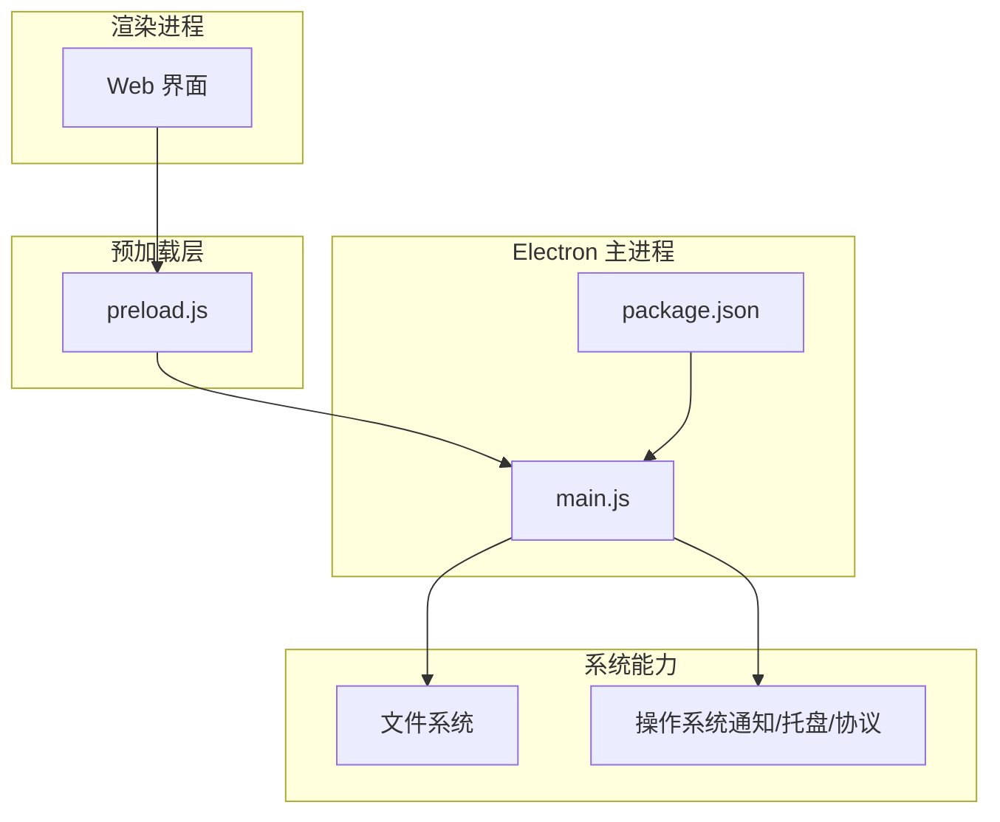
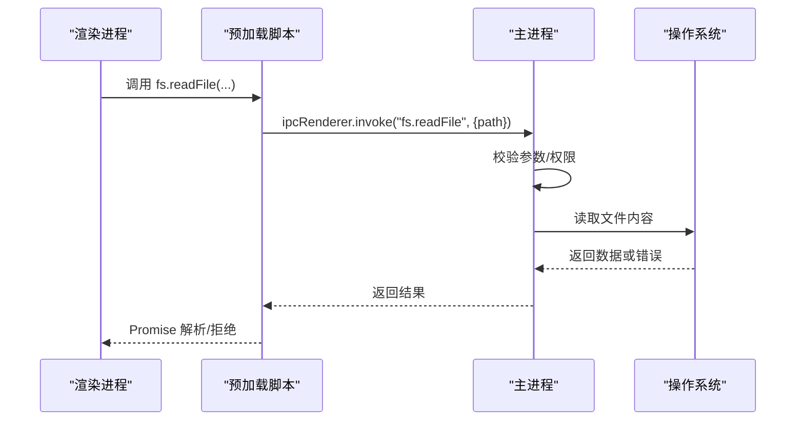
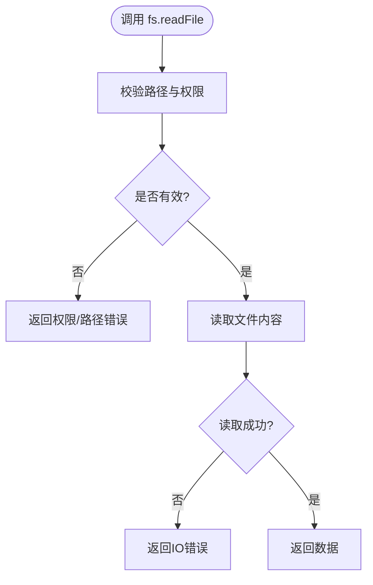
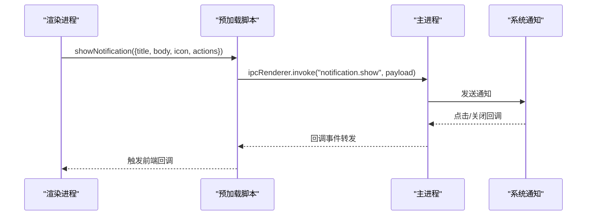
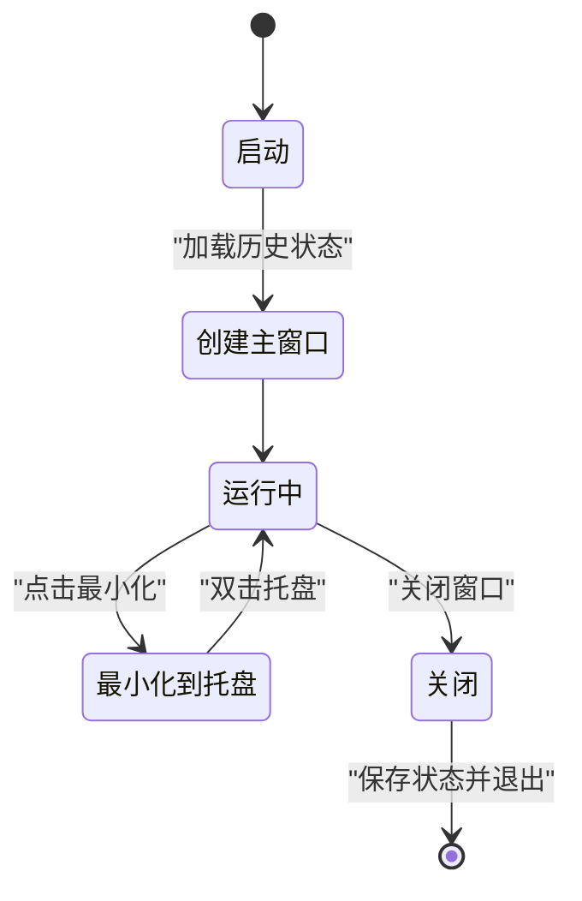
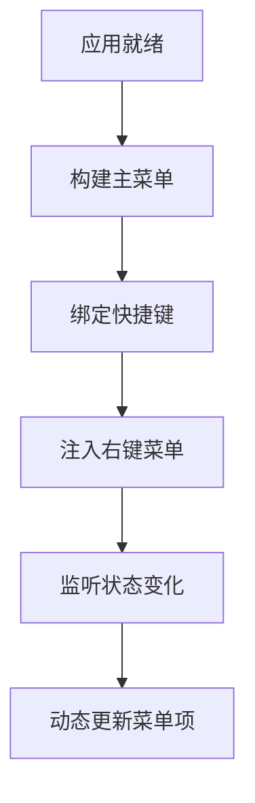
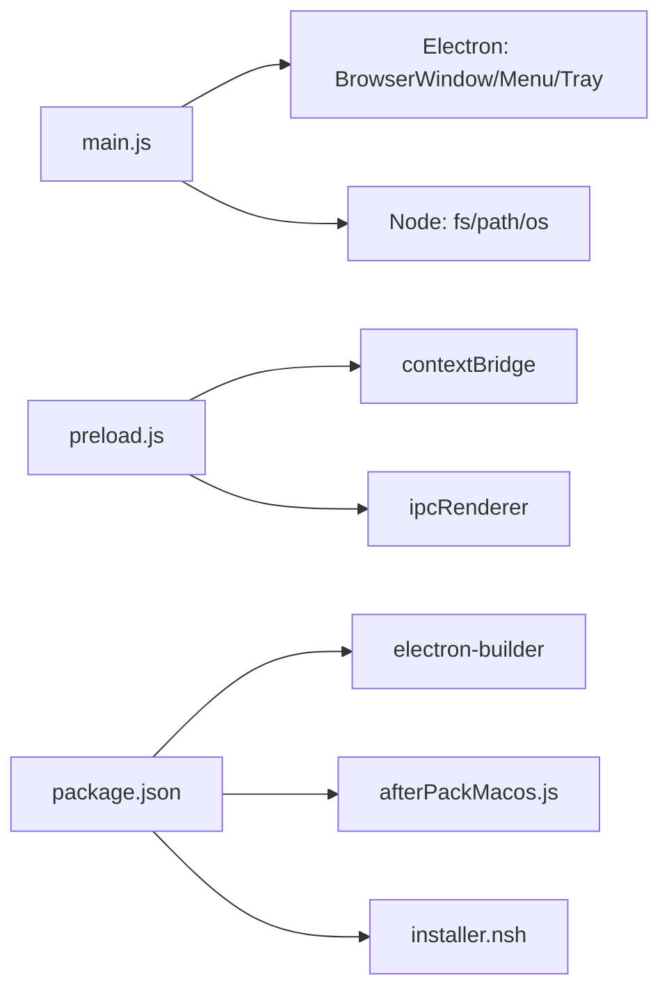

# 原生功能集成

<cite>
**本文引用的文件**   
- [main.js](file://apps/dsa-desktop/main.js)
- [preload.js](file://apps/dsa-desktop/preload.js)
- [package.json](file://apps/dsa-desktop/package.json)
- [afterPackMacos.js](file://apps/dsa-desktop/scripts/afterPackMacos.js)
- [installer.nsh](file://apps/dsa-desktop/installer.nsh)
- [main.test.js](file://apps/dsa-desktop/tests/main.test.js)
- [preload.test.js](file://apps/dsa-desktop/tests/preload.test.js)
</cite>

## 目录
1. [简介](#简介)
2. [项目结构](#项目结构)
3. [核心组件](#核心组件)
4. [架构总览](#架构总览)
5. [详细组件分析](#详细组件分析)
6. [依赖关系分析](#依赖关系分析)
7. [性能考虑](#性能考虑)
8. [故障排查指南](#故障排查指南)
9. [结论](#结论)
10. [附录](#附录)

## 简介
本文件面向 Daily Stock Analysis 桌面应用的原生功能集成，聚焦以下目标：
- 文件系统操作：文件读写、目录浏览、路径处理与权限管理
- 系统通知：跨平台通知 API 使用、样式定制与用户交互
- 窗口管理：多窗口支持、状态持久化、最小化到系统托盘与位置记忆
- 菜单系统：主菜单、右键菜单、快捷键绑定与动态更新
- 操作系统集成：文件关联、协议处理与系统服务调用
- 原生模块开发：Node.js 原生扩展的编译、依赖管理与跨平台兼容
- 实战示例：常见原生需求的实现思路与代码片段路径指引

## 项目结构
桌面端位于 apps/dsa-desktop，采用 Electron 架构：
- main.js：主进程入口，负责窗口生命周期、IPC 通道、菜单与系统托盘等
- preload.js：预加载脚本，暴露安全的桥接 API 给渲染进程
- package.json：Electron 打包配置、脚本与依赖声明
- afterPackMacos.js：macOS 打包后处理（签名、资源整理等）
- installer.nsh：NSIS 安装器脚本（Windows 安装包行为）
- tests：主进程与预加载脚本的基础测试

图表来源
- [main.js](file://apps/dsa-desktop/main.js)
- [preload.js](file://apps/dsa-desktop/preload.js)
- [package.json](file://apps/dsa-desktop/package.json)

章节来源
- [main.js](file://apps/dsa-desktop/main.js)
- [preload.js](file://apps/dsa-desktop/preload.js)
- [package.json](file://apps/dsa-desktop/package.json)

## 核心组件
- 主进程（main.js）
  - 窗口创建与管理、托盘图标与上下文菜单
  - IPC 通道注册（fs、dialog、shell、notification、protocol 等）
  - 应用生命周期事件（ready、window-all-closed、before-quit）
- 预加载脚本（preload.js）
  - 安全暴露 Node 能力至渲染进程
  - 封装常用方法（读取文件、选择目录、显示通知、打开外部链接等）
- 打包与安装
  - macOS 打包后处理（afterPackMacos.js）
  - Windows 安装器脚本（installer.nsh）
- 测试
  - 主进程与预加载脚本的最小用例（main.test.js、preload.test.js）

章节来源
- [main.js](file://apps/dsa-desktop/main.js)
- [preload.js](file://apps/dsa-desktop/preload.js)
- [afterPackMacos.js](file://apps/dsa-desktop/scripts/afterPackMacos.js)
- [installer.nsh](file://apps/dsa-desktop/installer.nsh)
- [main.test.js](file://apps/dsa-desktop/tests/main.test.js)
- [preload.test.js](file://apps/dsa-desktop/tests/preload.test.js)

## 架构总览
Electron 主进程作为“系统能力网关”，通过 IPC 向渲染进程提供受控接口。预加载脚本在两者之间建立安全边界，避免直接暴露危险 API。

图表来源
- [main.js](file://apps/dsa-desktop/main.js)
- [preload.js](file://apps/dsa-desktop/preload.js)

## 详细组件分析

### 文件系统操作（文件读写、目录浏览、路径处理与权限）
- 设计要点
  - 所有文件 I/O 必须经主进程执行，渲染进程仅通过 IPC 调用
  - 统一路径处理：相对路径转绝对路径、规范化路径、白名单校验
  - 权限控制：限制访问范围（如仅允许用户数据目录），失败时返回明确错误码
- 典型流程
  - 读取文件：校验路径 -> 检查权限 -> 读取 -> 返回数据或错误
  - 写入文件：校验路径与内容 -> 检查权限 -> 写入 -> 返回成功或错误
  - 目录浏览：校验目录存在 -> 列出条目 -> 过滤隐藏项 -> 返回数组
- 错误处理
  - 区分 ENOENT、EACCES、EPERM 等错误类型，向上抛出结构化错误对象
  - 对大文件进行流式读取，避免内存峰值过高

图表来源
- [main.js](file://apps/dsa-desktop/main.js)
- [preload.js](file://apps/dsa-desktop/preload.js)

章节来源
- [main.js](file://apps/dsa-desktop/main.js)
- [preload.js](file://apps/dsa-desktop/preload.js)

### 系统通知（跨平台通知 API、样式定制与交互）
- 设计要点
  - 使用系统原生通知 API（如 Notification 或平台特定后端）
  - 支持标题、正文、图标、超时、点击回调等字段
  - 跨平台差异处理：Windows 使用 toast，macOS 使用本地通知，Linux 使用 libnotify
- 典型流程
  - 构建通知对象 -> 校验必填字段 -> 调用系统 API -> 监听点击/关闭事件
- 错误处理
  - 权限未授予时提示用户开启通知权限
  - 平台不支持时降级为应用内弹窗

图表来源
- [main.js](file://apps/dsa-desktop/main.js)
- [preload.js](file://apps/dsa-desktop/preload.js)

章节来源
- [main.js](file://apps/dsa-desktop/main.js)
- [preload.js](file://apps/dsa-desktop/preload.js)

### 窗口管理（多窗口、状态持久化、托盘与位置记忆）
- 设计要点
  - 主窗口与子窗口分别管理，记录窗口实例与状态
  - 窗口位置、大小、最大化状态持久化到本地配置
  - 最小化到系统托盘，双击托盘恢复窗口
- 典型流程
  - 应用启动：加载上次窗口状态 -> 创建主窗口 -> 初始化托盘
  - 窗口关闭：保存状态 -> 根据策略决定是否退出
  - 托盘交互：显示/隐藏窗口、快捷菜单、通知入口
- 错误处理
  - 位置越界自动修正
  - 托盘图标加载失败回退默认图标

图表来源
- [main.js](file://apps/dsa-desktop/main.js)

章节来源
- [main.js](file://apps/dsa-desktop/main.js)

### 菜单系统（主菜单、右键菜单、快捷键与动态更新）
- 设计要点
  - 主菜单按平台差异化构建（macOS 菜单栏 vs Windows/Linux 应用菜单）
  - 右键菜单用于上下文操作（复制、粘贴、刷新等）
  - 快捷键绑定全局或窗口级，冲突时提示
  - 动态菜单项：根据当前页面/状态启用/禁用
- 典型流程
  - 应用就绪：构建主菜单 -> 注册快捷键 -> 注入右键菜单模板
  - 运行时：监听状态变化 -> 更新菜单项文本/可见性/可用性
- 错误处理
  - 快捷键注册失败回退为菜单命令
  - 菜单项回调异常捕获并记录日志

图表来源
- [main.js](file://apps/dsa-desktop/main.js)

章节来源
- [main.js](file://apps/dsa-desktop/main.js)

### 操作系统集成（文件关联、协议处理与系统服务）
- 设计要点
  - 文件关联：注册自定义扩展名（如 .dsa-report）与应用关联
  - 协议处理：自定义 URL Scheme（如 dsa://）以接收外部调用
  - 系统服务：调用系统命令（如打开文件夹、发送邮件）
- 典型流程
  - 启动时检测命令行参数（文件路径/协议参数）
  - 解析参数 -> 路由到对应处理器 -> 反馈结果
- 错误处理
  - 协议未注册时提示用户重新安装或手动关联
  - 系统命令执行失败返回错误码与提示信息

章节来源
- [main.js](file://apps/dsa-desktop/main.js)

### 原生模块开发（Node.js 原生扩展、依赖管理与跨平台兼容）
- 设计要点
  - 使用 node-gyp 或 napi-rs 构建 C/C++/Rust 原生模块
  - 在 package.json 中声明可选依赖与平台条件
  - 提供 fallback 实现（纯 JS）以应对缺失原生二进制
- 典型流程
  - 编写原生代码 -> 生成 binding.gyp/napi 配置 -> 构建产物
  - 运行时检测可用模块 -> 加载原生实现或回退
- 错误处理
  - 构建失败时输出详细日志与修复建议
  - 运行时加载失败时降级并记录诊断信息

章节来源
- [package.json](file://apps/dsa-desktop/package.json)

## 依赖关系分析
- 主进程依赖
  - Electron 内置模块：BrowserWindow、Menu、Tray、ipcMain、app、dialog、shell、notification
  - Node.js 标准库：fs、path、os、child_process
- 预加载脚本依赖
  - contextBridge、ipcRenderer
- 打包与安装
  - electron-builder（由 package.json 脚本驱动）
  - macOS 签名工具链（afterPackMacos.js）
  - NSIS（Windows 安装器）

图表来源
- [main.js](file://apps/dsa-desktop/main.js)
- [preload.js](file://apps/dsa-desktop/preload.js)
- [package.json](file://apps/dsa-desktop/package.json)

章节来源
- [main.js](file://apps/dsa-desktop/main.js)
- [preload.js](file://apps/dsa-desktop/preload.js)
- [package.json](file://apps/dsa-desktop/package.json)

## 性能考虑
- 文件 I/O
  - 大文件使用流式读取/写入，避免阻塞主线程
  - 批量操作合并请求，减少 IPC 往返
- 通知
  - 去重与节流：短时间内重复通知合并
  - 图片资源压缩与缓存
- 窗口
  - 延迟渲染：首屏按需加载，懒加载非关键组件
  - 窗口状态序列化轻量存储，避免频繁磁盘写入
- 菜单
  - 动态更新仅在必要时触发，避免全量重建

## 故障排查指南
- 常见问题
  - 文件权限不足：检查用户目录权限与沙箱策略
  - 通知不显示：确认系统通知权限与应用白名单
  - 托盘图标缺失：检查资源路径与平台适配
  - 协议无法打开：确认安装时已注册协议
- 调试手段
  - 启用 Electron 开发者工具查看控制台与网络
  - 在主进程打印 IPC 请求/响应日志
  - 使用单元测试覆盖关键路径（参考 tests）

章节来源
- [main.test.js](file://apps/dsa-desktop/tests/main.test.js)
- [preload.test.js](file://apps/dsa-desktop/tests/preload.test.js)

## 结论
通过将系统能力收敛至主进程并以预加载脚本为安全边界，Daily Stock Analysis 桌面应用在文件系统、通知、窗口、菜单与系统集成方面实现了稳定、可维护且跨平台的原生体验。结合打包脚本与测试用例，可在不同平台上保持一致的行为与质量。

## 附录
- 实用清单
  - 文件读写：始终校验路径与权限，返回结构化错误
  - 通知：统一字段模型，平台差异化实现
  - 窗口：持久化状态，托盘交互完善
  - 菜单：动态更新，快捷键冲突检测
  - 集成：协议与文件关联在安装期完成
  - 原生模块：可选依赖与回退机制