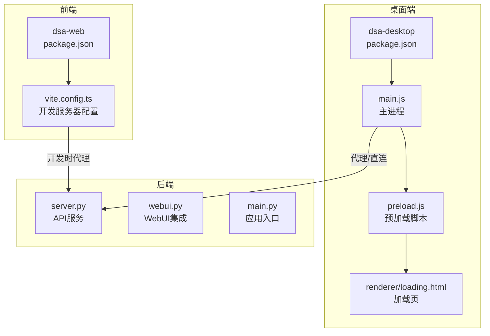
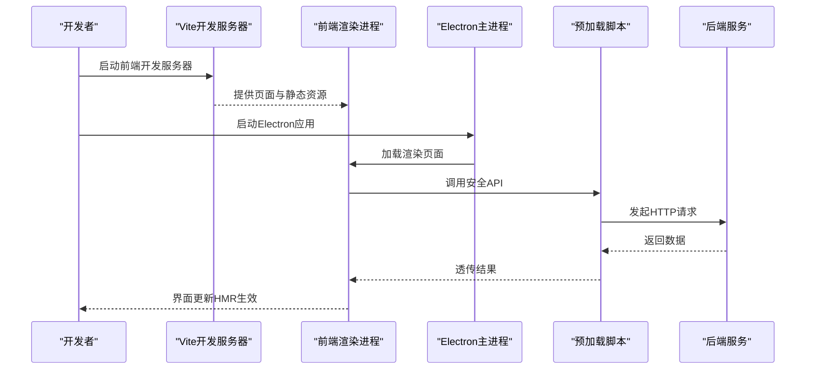
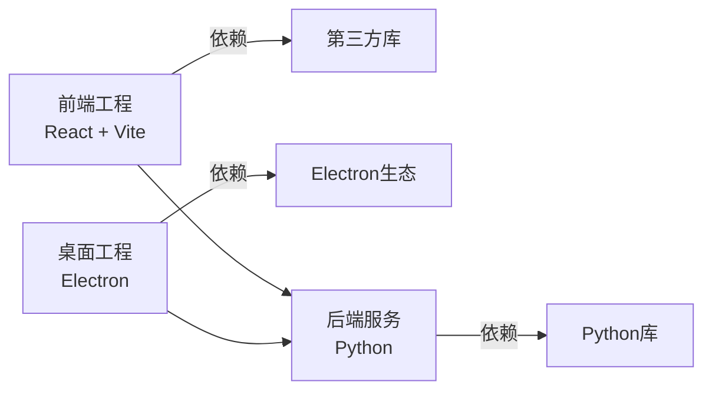

# 开发与调试

<cite>
**本文引用的文件**   
- [apps/dsa-desktop/package.json](file://apps/dsa-desktop/package.json)
- [apps/dsa-desktop/main.js](file://apps/dsa-desktop/main.js)
- [apps/dsa-desktop/preload.js](file://apps/dsa-desktop/preload.js)
- [apps/dsa-desktop/renderer/loading.html](file://apps/dsa-desktop/renderer/loading.html)
- [apps/dsa-web/package.json](file://apps/dsa-web/package.json)
- [apps/dsa-web/vite.config.ts](file://apps/dsa-web/vite.config.ts)
- [scripts/run-desktop.ps1](file://scripts/run-desktop.ps1)
- [scripts/build-desktop-macos.sh](file://scripts/build-desktop-macos.sh)
- [scripts/build-all-macos.sh](file://scripts/build-all-macos.sh)
- [server.py](file://server.py)
- [webui.py](file://webui.py)
- [main.py](file://main.py)
</cite>

## 目录
1. [简介](#简介)
2. [项目结构](#项目结构)
3. [核心组件](#核心组件)
4. [架构总览](#架构总览)
5. [详细组件分析](#详细组件分析)
6. [依赖分析](#依赖分析)
7. [性能考虑](#性能考虑)
8. [故障排查指南](#故障排查指南)
9. [结论](#结论)
10. [附录](#附录)

## 简介
本文件面向Daily Stock Analysis桌面应用的开发者与调试者，系统性地说明开发环境搭建、热重载配置、调试技巧（主进程/渲染进程断点与变量检查）、日志记录与分析、远程调试（网络调试、端口映射、跨设备调试）、性能分析工具使用（内存泄漏检测、CPU性能分析与渲染优化），并给出常见调试场景与问题定位方法。文档内容基于仓库中的Electron桌面应用与Web前端工程进行梳理，确保读者能在本地快速搭建可运行的开发环境并进行高效调试。

## 项目结构
本项目采用多子工程组织：
- apps/dsa-desktop：Electron桌面应用（主进程、预加载脚本、打包脚本）
- apps/dsa-web：Vite + React前端工程（开发服务器、构建配置）
- scripts：平台相关构建与运行脚本（Windows PowerShell与macOS Shell）
- server.py/webui.py/main.py：后端服务入口与WebUI集成

图表来源
- [apps/dsa-desktop/package.json](file://apps/dsa-desktop/package.json)
- [apps/dsa-desktop/main.js](file://apps/dsa-desktop/main.js)
- [apps/dsa-desktop/preload.js](file://apps/dsa-desktop/preload.js)
- [apps/dsa-desktop/renderer/loading.html](file://apps/dsa-desktop/renderer/loading.html)
- [apps/dsa-web/package.json](file://apps/dsa-web/package.json)
- [apps/dsa-web/vite.config.ts](file://apps/dsa-web/vite.config.ts)
- [server.py](file://server.py)

章节来源
- [apps/dsa-desktop/package.json](file://apps/dsa-desktop/package.json)
- [apps/dsa-web/package.json](file://apps/dsa-web/package.json)
- [apps/dsa-web/vite.config.ts](file://apps/dsa-web/vite.config.ts)
- [server.py](file://server.py)

## 核心组件
- Electron主进程：负责窗口创建、生命周期管理、IPC通道、与后端服务的通信。
- 预加载脚本：在渲染进程暴露安全API，隔离Node能力，避免直接访问敏感模块。
- 前端工程：基于Vite的React应用，提供开发服务器、热替换、构建产物。
- 后端服务：提供REST API与必要的WebUI页面，供桌面端调用。

章节来源
- [apps/dsa-desktop/main.js](file://apps/dsa-desktop/main.js)
- [apps/dsa-desktop/preload.js](file://apps/dsa-desktop/preload.js)
- [apps/dsa-web/package.json](file://apps/dsa-web/package.json)
- [server.py](file://server.py)

## 架构总览
下图展示开发期典型的数据流与交互路径：前端通过Vite开发服务器启动，请求经代理转发到后端；Electron主进程加载渲染页面并通过预加载脚本调用后端接口。

图表来源
- [apps/dsa-web/vite.config.ts](file://apps/dsa-web/vite.config.ts)
- [apps/dsa-desktop/main.js](file://apps/dsa-desktop/main.js)
- [apps/dsa-desktop/preload.js](file://apps/dsa-desktop/preload.js)
- [server.py](file://server.py)

## 详细组件分析

### 开发环境与启动流程
- Node.js环境准备
  - 安装与版本管理：建议使用nvm或fnm管理Node版本，确保与前端工程要求一致。
  - 包管理器：推荐使用npm或pnpm，根据工程实际选择。
- 依赖安装
  - 前端工程：进入apps/dsa-web目录执行依赖安装。
  - 桌面工程：进入apps/dsa-desktop目录执行依赖安装。
- 启动后端服务
  - 使用server.py或webui.py启动后端API服务，确保端口开放且无冲突。
- 启动前端开发服务器
  - 在apps/dsa-web目录下启动Vite开发服务器，启用热替换与实时预览。
- 启动桌面应用
  - 使用scripts/run-desktop.ps1或Electron命令启动桌面应用，主进程将加载渲染页面并与后端通信。

章节来源
- [apps/dsa-web/package.json](file://apps/dsa-web/package.json)
- [apps/dsa-desktop/package.json](file://apps/dsa-desktop/package.json)
- [server.py](file://server.py)
- [webui.py](file://webui.py)
- [scripts/run-desktop.ps1](file://scripts/run-desktop.ps1)

### 热重载与实时更新
- 前端热替换（HMR）
  - Vite默认开启HMR，修改源码后浏览器自动刷新，无需手动重启。
  - 可在vite.config.ts中调整HMR行为（如覆盖策略、WebSocket端口等）。
- Electron热更新
  - 主进程代码变更需重启应用；渲染进程可通过加载本地开发服务器实现热替换。
  - 建议在开发模式下将渲染URL指向Vite开发服务器地址，以获得最佳体验。
- 实时预览
  - 结合Chrome DevTools的“元素”、“网络”、“控制台”面板，实时观察状态变化与请求响应。

章节来源
- [apps/dsa-web/vite.config.ts](file://apps/dsa-web/vite.config.ts)
- [apps/dsa-desktop/main.js](file://apps/dsa-desktop/main.js)

### 调试技巧与方法
- Chrome DevTools使用
  - 打开“Sources”面板设置断点，逐步执行代码；在“Console”查看日志与表达式求值。
  - “Network”面板过滤请求、查看请求头与响应体，定位接口问题。
  - “Performance”面板录制时间线，识别长任务与卡顿。
- 主进程与渲染进程调试
  - 主进程：在Electron启动参数中添加调试开关，使主进程可被外部调试器附加。
  - 渲染进程：直接使用Chrome DevTools连接，支持断点、变量检查、调用栈回溯。
- 断点与变量检查
  - 在关键函数入口、异常分支、异步回调处设置断点，配合条件断点精准定位。
  - 使用“Watch”面板监控关键变量，观察状态变化轨迹。

章节来源
- [apps/dsa-desktop/main.js](file://apps/dsa-desktop/main.js)
- [apps/dsa-desktop/preload.js](file://apps/dsa-desktop/preload.js)

### 日志记录与分析
- 控制台日志输出
  - 前端：使用console.log/info/warn/error分级输出，便于区分信息级别。
  - 后端：在服务层统一日志格式，包含请求ID、耗时、错误堆栈。
- 错误捕获
  - 前端：全局未捕获异常监听，上报错误上下文（用户操作、网络状态）。
  - 后端：中间件捕获异常，返回标准化错误码与消息。
- 性能监控
  - 前端：使用Performance Observer记录关键指标（首屏、交互延迟）。
  - 后端：统计接口耗时、错误率、资源占用，生成报表供分析。

章节来源
- [server.py](file://server.py)
- [webui.py](file://webui.py)

### 远程调试配置
- 网络调试
  - 确保后端服务监听正确端口，防火墙放行；前端代理配置指向后端地址。
- 端口映射
  - 在跨设备调试时，使用SSH隧道或反向代理将本地端口映射到远程服务。
- 跨设备调试
  - 在目标设备上启动后端服务，通过IP+端口访问；前端工程配置代理以转发请求。

章节来源
- [apps/dsa-web/vite.config.ts](file://apps/dsa-web/vite.config.ts)
- [server.py](file://server.py)

### 性能分析工具使用
- 内存泄漏检测
  - 使用Chrome DevTools的“Memory”面板拍摄堆快照，对比差异定位未释放对象。
  - 在长时间运行场景下，定期采样内存使用情况，发现增长趋势。
- CPU性能分析
  - 录制“Performance”时间线，分析主线程阻塞点，优化重计算与同步逻辑。
- 渲染性能优化
  - 减少不必要的重绘与回流，使用虚拟列表、防抖节流、懒加载等技术。
  - 拆分大组件，避免一次性渲染过多节点。

章节来源
- [apps/dsa-web/vite.config.ts](file://apps/dsa-web/vite.config.ts)

### 构建与打包
- macOS构建脚本
  - 使用build-desktop-macos.sh进行桌面应用打包，生成可分发安装包。
- 全量构建
  - build-all-macos.sh整合前后端构建流程，一键完成依赖安装、编译与打包。
- Windows构建
  - 使用build-all.ps1进行Windows平台的构建与打包。

章节来源
- [scripts/build-desktop-macos.sh](file://scripts/build-desktop-macos.sh)
- [scripts/build-all-macos.sh](file://scripts/build-all-macos.sh)
- [scripts/build-all.ps1](file://scripts/build-all.ps1)

## 依赖分析
- 前端依赖
  - React生态：组件库、状态管理、路由等。
  - 构建工具：Vite、TypeScript、ESLint、Prettier。
- 桌面依赖
  - Electron：主进程、渲染进程、打包工具。
  - 原生模块：平台特定功能（如文件系统、系统托盘）。
- 后端依赖
  - Python框架：FastAPI/Flask等，提供REST API。
  - 数据库与缓存：SQLite/Redis等，用于数据存储与加速。

图表来源
- [apps/dsa-web/package.json](file://apps/dsa-web/package.json)
- [apps/dsa-desktop/package.json](file://apps/dsa-desktop/package.json)
- [server.py](file://server.py)

章节来源
- [apps/dsa-web/package.json](file://apps/dsa-web/package.json)
- [apps/dsa-desktop/package.json](file://apps/dsa-desktop/package.json)
- [server.py](file://server.py)

## 性能考虑
- 前端性能
  - 代码分割：按路由或功能模块拆分，减少初始加载体积。
  - 资源优化：图片压缩、字体子集化、CDN加速。
  - 缓存策略：合理设置HTTP缓存头，利用Service Worker离线缓存。
- 桌面性能
  - 主进程轻量化：避免在主进程中执行重型任务，使用Worker或子进程。
  - 渲染优化：减少DOM操作频率，使用CSS动画替代JS动画。
- 后端性能
  - 接口优化：分页查询、索引优化、缓存热点数据。
  - 并发控制：限制请求并发数，防止资源耗尽。

[本节为通用指导，不直接分析具体文件]

## 故障排查指南
- 常见问题
  - 端口冲突：检查后端服务端口是否被占用，更换端口或停止冲突进程。
  - 代理失败：确认Vite代理配置与后端地址一致，检查防火墙规则。
  - 权限问题：确保Electron有足够权限访问文件系统与网络资源。
- 调试步骤
  - 逐步缩小范围：先验证后端接口是否正常，再检查前端代理，最后定位渲染问题。
  - 日志收集：导出控制台日志与网络请求，形成问题复现场景。
  - 最小化复现：剥离无关功能，聚焦问题核心，快速定位根因。

章节来源
- [apps/dsa-web/vite.config.ts](file://apps/dsa-web/vite.config.ts)
- [server.py](file://server.py)

## 结论
通过合理的开发环境搭建、热重载配置与调试技巧，开发者可以高效地迭代Daily Stock Analysis桌面应用。结合性能分析工具与故障排查方法，能够及时发现并解决潜在问题，提升应用稳定性与用户体验。建议团队建立统一的调试规范与日志标准，确保问题可追踪、可复现、可修复。

[本节为总结性内容，不直接分析具体文件]

## 附录
- 常用命令
  - 启动前端开发服务器：在apps/dsa-web目录下执行npm run dev。
  - 启动后端服务：在根目录执行python server.py或python webui.py。
  - 启动桌面应用：在apps/dsa-desktop目录下执行npm start或使用scripts/run-desktop.ps1。
- 参考文档
  - Vite官方文档：https://vitejs.dev/
  - Electron官方文档：https://www.electronjs.org/
  - Chrome DevTools手册：https://developer.chrome.com/docs/devtools/

[本节为补充信息，不直接分析具体文件]