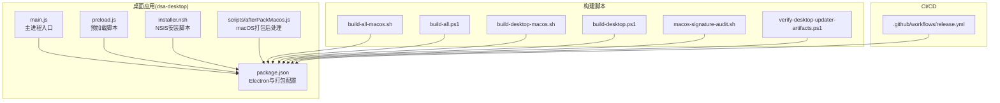
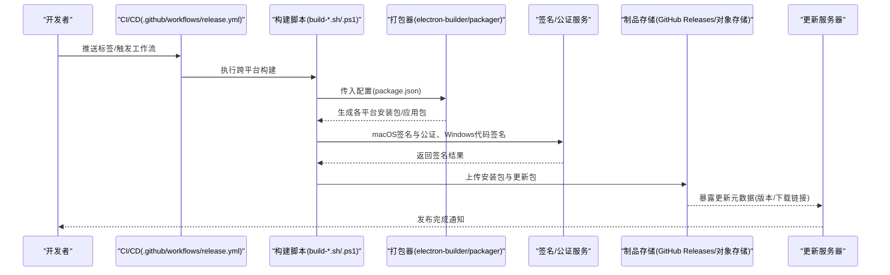
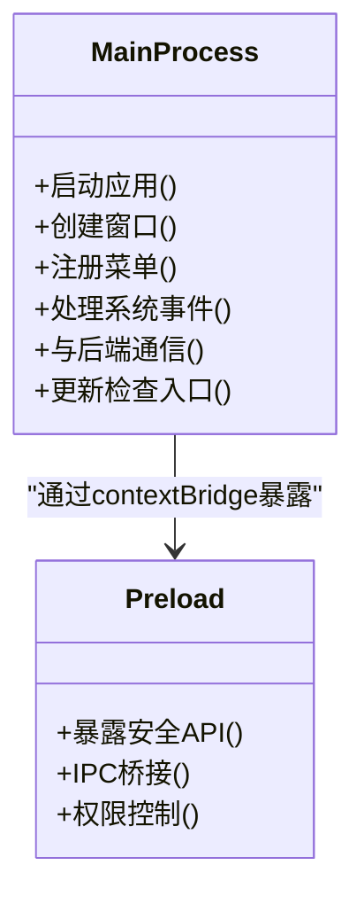
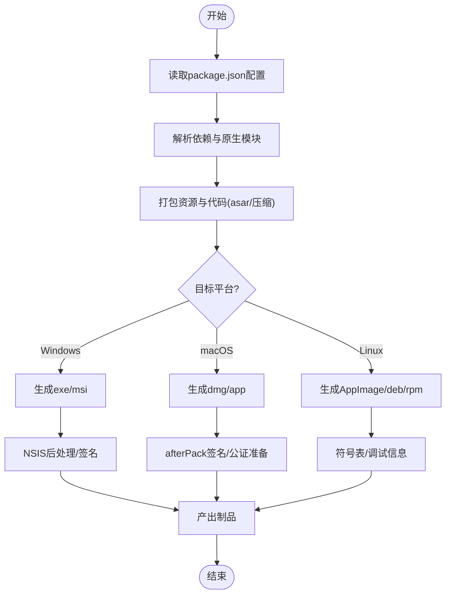
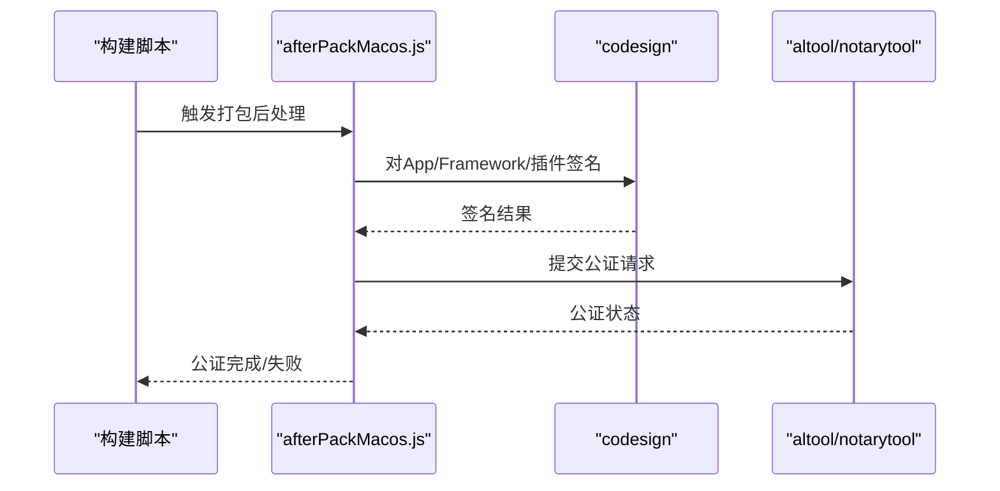
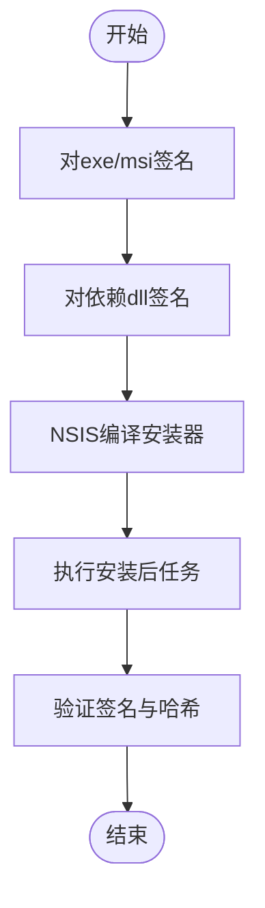
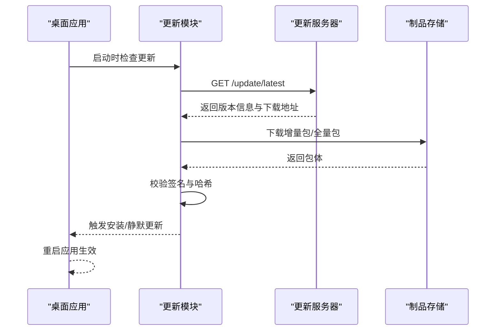
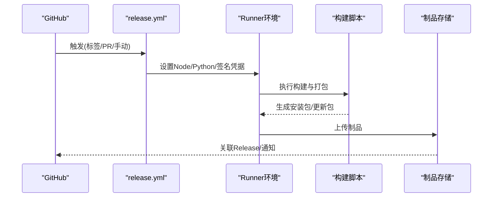
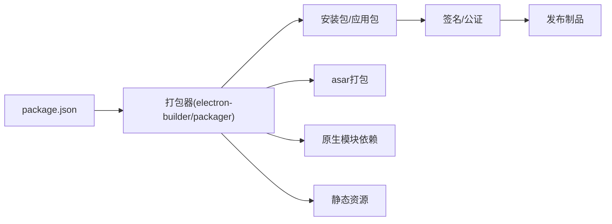

# 打包与分发

<cite>
**本文引用的文件**   
- [apps/dsa-desktop/package.json](file://apps/dsa-desktop/package.json)
- [apps/dsa-desktop/main.js](file://apps/dsa-desktop/main.js)
- [apps/dsa-desktop/preload.js](file://apps/dsa-desktop/preload.js)
- [apps/dsa-desktop/scripts/afterPackMacos.js](file://apps/dsa-desktop/scripts/afterPackMacos.js)
- [apps/dsa-desktop/installer.nsh](file://apps/dsa-desktop/installer.nsh)
- [scripts/build-all-macos.sh](file://scripts/build-all-macos.sh)
- [scripts/build-all.ps1](file://scripts/build-all.ps1)
- [scripts/build-desktop-macos.sh](file://scripts/build-desktop-macos.sh)
- [scripts/build-desktop.ps1](file://scripts/build-desktop.ps1)
- [scripts/macos-signature-audit.sh](file://scripts/macos-signature-audit.sh)
- [scripts/verify-desktop-updater-artifacts.ps1](file://scripts/verify-desktop-updater-artifacts.ps1)
- [.github/workflows/release.yml](file://.github/workflows/release.yml)
</cite>

## 目录
1. [简介](#简介)
2. [项目结构](#项目结构)
3. [核心组件](#核心组件)
4. [架构总览](#架构总览)
5. [详细组件分析](#详细组件分析)
6. [依赖关系分析](#依赖关系分析)
7. [性能考虑](#性能考虑)
8. [故障排除指南](#故障排除指南)
9. [结论](#结论)
10. [附录](#附录)

## 简介
本文件面向Daily Stock Analysis桌面应用（Electron）的打包与分发，覆盖Windows、macOS、Linux三平台的构建配置与优化、打包工具（electron-builder/electron-packager）使用、资源与依赖管理、代码签名与公证、自动更新机制、安装程序定制、发布流程最佳实践，以及构建脚本示例与常见问题排查。文档内容严格基于仓库中的实际文件与脚本进行说明，确保可操作性和可追溯性。

## 项目结构
桌面端相关代码位于 apps/dsa-desktop，包含主进程、预加载脚本、测试、NSIS安装脚本与平台后处理脚本；构建与发布脚本集中在 scripts 目录；CI/CD流水线定义在 .github/workflows/release.yml。

图表来源
- [apps/dsa-desktop/main.js](file://apps/dsa-desktop/main.js)
- [apps/dsa-desktop/preload.js](file://apps/dsa-desktop/preload.js)
- [apps/dsa-desktop/package.json](file://apps/dsa-desktop/package.json)
- [apps/dsa-desktop/installer.nsh](file://apps/dsa-desktop/installer.nsh)
- [apps/dsa-desktop/scripts/afterPackMacos.js](file://apps/dsa-desktop/scripts/afterPackMacos.js)
- [scripts/build-all-macos.sh](file://scripts/build-all-macos.sh)
- [scripts/build-all.ps1](file://scripts/build-all.ps1)
- [scripts/build-desktop-macos.sh](file://scripts/build-desktop-macos.sh)
- [scripts/build-desktop.ps1](file://scripts/build-desktop.ps1)
- [scripts/macos-signature-audit.sh](file://scripts/macos-signature-audit.sh)
- [scripts/verify-desktop-updater-artifacts.ps1](file://scripts/verify-desktop-updater-artifacts.ps1)
- [.github/workflows/release.yml](file://.github/workflows/release.yml)

章节来源
- [apps/dsa-desktop/package.json](file://apps/dsa-desktop/package.json)
- [apps/dsa-desktop/main.js](file://apps/dsa-desktop/main.js)
- [apps/dsa-desktop/preload.js](file://apps/dsa-desktop/preload.js)
- [apps/dsa-desktop/installer.nsh](file://apps/dsa-desktop/installer.nsh)
- [apps/dsa-desktop/scripts/afterPackMacos.js](file://apps/dsa-desktop/scripts/afterPackMacos.js)
- [scripts/build-all-macos.sh](file://scripts/build-all-macos.sh)
- [scripts/build-all.ps1](file://scripts/build-all.ps1)
- [scripts/build-desktop-macos.sh](file://scripts/build-desktop-macos.sh)
- [scripts/build-desktop.ps1](file://scripts/build-desktop.ps1)
- [scripts/macos-signature-audit.sh](file://scripts/macos-signature-audit.sh)
- [scripts/verify-desktop-updater-artifacts.ps1](file://scripts/verify-desktop-updater-artifacts.ps1)
- [.github/workflows/release.yml](file://.github/workflows/release.yml)

## 核心组件
- Electron主进程与预加载：主进程负责窗口创建、生命周期管理与原生能力调用；预加载脚本用于安全桥接主进程与渲染进程。
- 打包配置：通过 package.json 中的 electron-builder 或 electron-packager 配置项控制多平台产物、图标、资源、签名与更新源。
- 平台后处理：macOS afterPack 钩子用于签名、资源整理与公证前准备。
- NSIS安装脚本：Windows安装器自定义界面、安装后任务与快捷方式等。
- 构建脚本：跨平台脚本统一构建流程，支持并行构建与产物校验。
- CI/CD：GitHub Actions触发构建、签名、上传制品与发布。

章节来源
- [apps/dsa-desktop/main.js](file://apps/dsa-desktop/main.js)
- [apps/dsa-desktop/preload.js](file://apps/dsa-desktop/preload.js)
- [apps/dsa-desktop/package.json](file://apps/dsa-desktop/package.json)
- [apps/dsa-desktop/scripts/afterPackMacos.js](file://apps/dsa-desktop/scripts/afterPackMacos.js)
- [apps/dsa-desktop/installer.nsh](file://apps/dsa-desktop/installer.nsh)
- [scripts/build-all-macos.sh](file://scripts/build-all-macos.sh)
- [scripts/build-all.ps1](file://scripts/build-all.ps1)
- [scripts/build-desktop-macos.sh](file://scripts/build-desktop-macos.sh)
- [scripts/build-desktop.ps1](file://scripts/build-desktop.ps1)
- [scripts/macos-signature-audit.sh](file://scripts/macos-signature-audit.sh)
- [scripts/verify-desktop-updater-artifacts.ps1](file://scripts/verify-desktop-updater-artifacts.ps1)
- [.github/workflows/release.yml](file://.github/workflows/release.yml)

## 架构总览
下图展示了从代码到产物的整体打包与分发流程，包括构建、签名、公证、更新包生成与制品上传。

图表来源
- [.github/workflows/release.yml](file://.github/workflows/release.yml)
- [scripts/build-all-macos.sh](file://scripts/build-all-macos.sh)
- [scripts/build-all.ps1](file://scripts/build-all.ps1)
- [scripts/build-desktop-macos.sh](file://scripts/build-desktop-macos.sh)
- [scripts/build-desktop.ps1](file://scripts/build-desktop.ps1)
- [apps/dsa-desktop/package.json](file://apps/dsa-desktop/package.json)

## 详细组件分析

### Electron主进程与预加载
- 主进程(main.js)负责初始化应用窗口、注册菜单、处理系统事件、与后端API交互及更新逻辑入口。
- 预加载(preload.js)提供安全的IPC通道，限制渲染进程直接访问Node API，保障安全边界。

图表来源
- [apps/dsa-desktop/main.js](file://apps/dsa-desktop/main.js)
- [apps/dsa-desktop/preload.js](file://apps/dsa-desktop/preload.js)

章节来源
- [apps/dsa-desktop/main.js](file://apps/dsa-desktop/main.js)
- [apps/dsa-desktop/preload.js](file://apps/dsa-desktop/preload.js)

### 打包配置与资源管理
- 通过 package.json 中的 electron-builder 或 electron-packager 字段配置目标平台、图标、输出目录、asar打包、外置依赖、环境变量注入与更新源。
- 资源文件（如静态页面、图标、字体）需纳入打包清单，避免运行时缺失。
- 第三方库若含原生模块，需在构建环境中安装对应平台依赖。

图表来源
- [apps/dsa-desktop/package.json](file://apps/dsa-desktop/package.json)

章节来源
- [apps/dsa-desktop/package.json](file://apps/dsa-desktop/package.json)

### macOS签名与公证
- afterPackMacos.js 在打包后对app与框架进行签名，并准备公证所需元数据。
- macos-signature-audit.sh 用于审计签名链完整性与证书有效性。
- 建议启用硬绑定与时间戳，确保长期有效性。

图表来源
- [apps/dsa-desktop/scripts/afterPackMacos.js](file://apps/dsa-desktop/scripts/afterPackMacos.js)
- [scripts/macos-signature-audit.sh](file://scripts/macos-signature-audit.sh)

章节来源
- [apps/dsa-desktop/scripts/afterPackMacos.js](file://apps/dsa-desktop/scripts/afterPackMacos.js)
- [scripts/macos-signature-audit.sh](file://scripts/macos-signature-audit.sh)

### Windows代码签名与NSIS安装器
- Windows需使用有效的代码签名证书对exe/msi与动态库进行签名，避免用户拦截提示。
- installer.nsh 可定制安装界面、安装路径、快捷方式、卸载行为与安装后任务（如注册协议、写入配置）。
- 建议在CI中注入证书与密码，避免本地泄露。

图表来源
- [apps/dsa-desktop/installer.nsh](file://apps/dsa-desktop/installer.nsh)

章节来源
- [apps/dsa-desktop/installer.nsh](file://apps/dsa-desktop/installer.nsh)

### 自动更新机制
- 更新服务器需提供版本元数据（版本号、下载URL、增量补丁、签名校验）。
- 客户端在主进程中进行版本检查、差异下载与回滚策略。
- verify-desktop-updater-artifacts.ps1 可用于校验更新包完整性与签名。

图表来源
- [scripts/verify-desktop-updater-artifacts.ps1](file://scripts/verify-desktop-updater-artifacts.ps1)
- [apps/dsa-desktop/package.json](file://apps/dsa-desktop/package.json)

章节来源
- [scripts/verify-desktop-updater-artifacts.ps1](file://scripts/verify-desktop-updater-artifacts.ps1)
- [apps/dsa-desktop/package.json](file://apps/dsa-desktop/package.json)

### 构建脚本与CI集成
- build-all-macos.sh、build-all.ps1 统一触发多平台构建，支持并行与缓存。
- build-desktop-macos.sh、build-desktop.ps1 聚焦桌面端构建与产物校验。
- release.yml 定义触发条件、环境准备、签名、上传制品与发布步骤。

图表来源
- [.github/workflows/release.yml](file://.github/workflows/release.yml)
- [scripts/build-all-macos.sh](file://scripts/build-all-macos.sh)
- [scripts/build-all.ps1](file://scripts/build-all.ps1)
- [scripts/build-desktop-macos.sh](file://scripts/build-desktop-macos.sh)
- [scripts/build-desktop.ps1](file://scripts/build-desktop.ps1)

章节来源
- [.github/workflows/release.yml](file://.github/workflows/release.yml)
- [scripts/build-all-macos.sh](file://scripts/build-all-macos.sh)
- [scripts/build-all.ps1](file://scripts/build-all.ps1)
- [scripts/build-desktop-macos.sh](file://scripts/build-desktop-macos.sh)
- [scripts/build-desktop.ps1](file://scripts/build-desktop.ps1)

## 依赖关系分析
- 打包器依赖：electron-builder或electron-packager通过package.json配置驱动，决定产物格式与平台特性。
- 原生依赖：含C++扩展的模块需在各平台构建环境中安装对应SDK与编译器。
- 资源依赖：静态资源需被正确打包进asar或作为外部资源引用，避免路径问题。
- 更新依赖：更新服务器需稳定可用，并提供一致的元数据格式与签名校验。

图表来源
- [apps/dsa-desktop/package.json](file://apps/dsa-desktop/package.json)

章节来源
- [apps/dsa-desktop/package.json](file://apps/dsa-desktop/package.json)

## 性能考虑
- 使用asar压缩减少I/O开销，合理拆分大体积资源为按需加载。
- 禁用不必要的调试符号与日志，减小安装包体积。
- 增量更新优先，降低带宽与下载时间。
- 在CI中使用缓存与并行构建缩短流水线时长。

[本节为通用指导，不直接分析具体文件]

## 故障排除指南
- macOS签名失败：检查证书有效期、钥匙串权限与签名链；使用macos-signature-audit.sh审计。
- 公证失败：确认最小系统版本、硬绑定与时间戳；查看notarytool日志定位问题。
- Windows签名拦截：确保证书有效且被信任；检查DLL签名与哈希一致性。
- 更新失败：核对更新元数据版本格式、签名校验与网络可达性；使用verify-desktop-updater-artifacts.ps1验证包体。
- 构建超时或内存不足：调整CI runner规格与构建参数，启用缓存与并行。

章节来源
- [scripts/macos-signature-audit.sh](file://scripts/macos-signature-audit.sh)
- [scripts/verify-desktop-updater-artifacts.ps1](file://scripts/verify-desktop-updater-artifacts.ps1)
- [apps/dsa-desktop/package.json](file://apps/dsa-desktop/package.json)

## 结论
通过统一的构建脚本、严格的签名与公证流程、稳定的更新服务器与完善的CI/CD集成，Daily Stock Analysis桌面应用可在Windows、macOS、Linux上实现高质量打包与分发。建议持续优化资源体积、更新策略与错误诊断能力，以提升用户体验与发布效率。

[本节为总结，不直接分析具体文件]

## 附录
- 构建命令参考：
  - macOS：运行构建脚本以生成dmg/app并签名公证。
  - Windows：运行PowerShell脚本生成exe/msi并进行代码签名。
  - Linux：生成AppImage/deb/rpm并附带调试符号。
- 发布渠道：
  - GitHub Releases作为主要制品存储与下载入口。
  - 可选对象存储（S3/OSS）配合CDN加速更新下载。
- 版本管理：
  - 使用语义化版本(tag)，并在更新元数据中保持一致。
- 安全建议：
  - 最小权限原则管理签名凭据。
  - 定期轮换证书与密钥。
  - 启用更新包的签名校验与完整性检查。

[本节为补充信息，不直接分析具体文件]