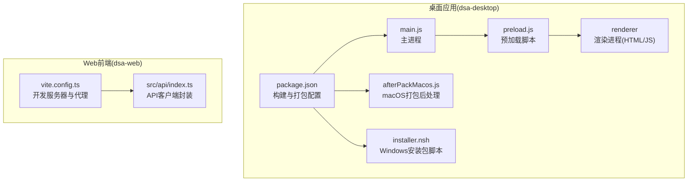
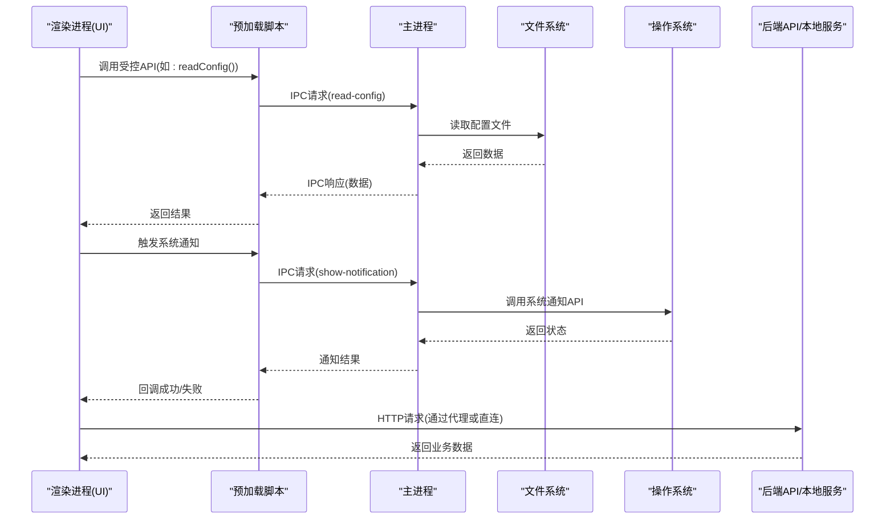
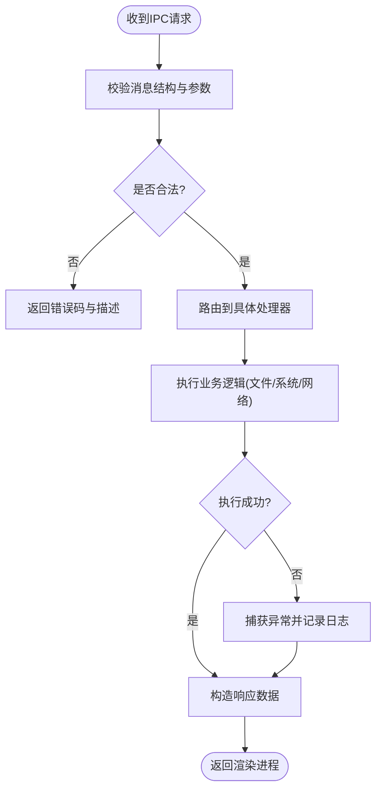
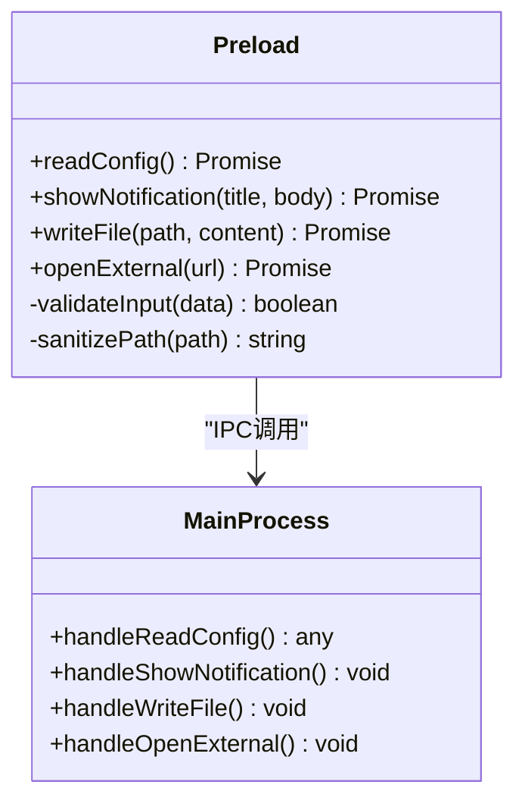
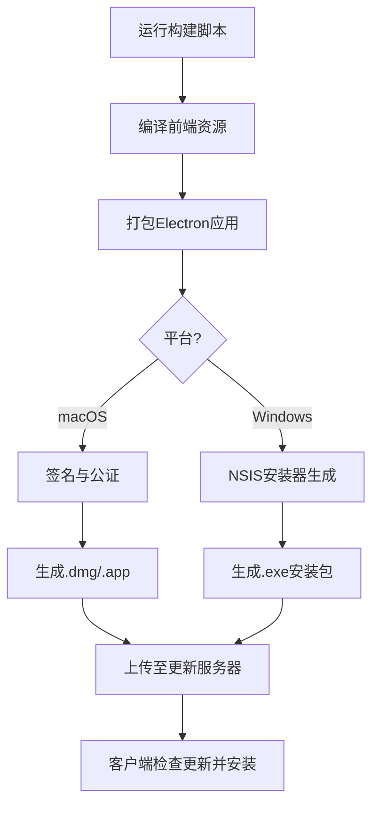
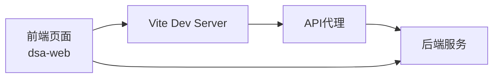
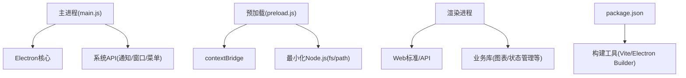

# 桌面应用

<cite>
**本文引用的文件**   
- [apps/dsa-desktop/main.js](file://apps/dsa-desktop/main.js)
- [apps/dsa-desktop/preload.js](file://apps/dsa-desktop/preload.js)
- [apps/dsa-desktop/package.json](file://apps/dsa-desktop/package.json)
- [apps/dsa-desktop/scripts/afterPackMacos.js](file://apps/dsa-desktop/scripts/afterPackMacos.js)
- [apps/dsa-desktop/installer.nsh](file://apps/dsa-desktop/installer.nsh)
- [apps/dsa-desktop/tests/main.test.js](file://apps/dsa-desktop/tests/main.test.js)
- [apps/dsa-desktop/tests/preload.test.js](file://apps/dsa-desktop/tests/preload.test.js)
- [scripts/build-desktop-macos.sh](file://scripts/build-desktop-macos.sh)
- [scripts/build-desktop.ps1](file://scripts/build-desktop.ps1)
- [scripts/macros-signature-audit.sh](file://scripts/macros-signature-audit.sh)
- [scripts/run-desktop.ps1](file://scripts/run-desktop.ps1)
- [apps/dsa-web/vite.config.ts](file://apps/dsa-web/vite.config.ts)
- [apps/dsa-web/src/api/index.ts](file://apps/dsa-web/src/api/index.ts)
</cite>

## 目录
1. [简介](#简介)
2. [项目结构](#项目结构)
3. [核心组件](#核心组件)
4. [架构总览](#架构总览)
5. [详细组件分析](#详细组件分析)
6. [依赖关系分析](#依赖关系分析)
7. [性能考虑](#性能考虑)
8. [故障排查指南](#故障排查指南)
9. [结论](#结论)
10. [附录](#附录)

## 简介
本文件面向Daily Stock Analysis桌面应用的开发者与维护者，系统性阐述基于Electron的桌面端架构与实现要点。内容涵盖主进程与渲染进程的通信机制、预加载脚本的职责与安全边界、原生能力集成（文件系统访问、系统通知、窗口管理、菜单定制）、打包分发流程（多平台构建、签名验证、自动更新）、与Web前端应用的集成方式（静态资源嵌入、API代理与跨域处理），以及开发与调试指南（热重载、远程调试、性能分析）。同时补充macOS公证与Windows代码签名的平台注意事项。

## 项目结构
桌面端位于 apps/dsa-desktop，采用Electron标准工程组织：
- main.js：Electron主进程入口，负责创建窗口、注册菜单、监听IPC、启动本地服务或代理等。
- preload.js：预加载脚本，暴露最小化安全API给渲染进程使用。
- package.json：Electron应用配置、打包脚本、依赖声明。
- scripts/afterPackMacos.js：macOS打包后处理（如签名、公证准备）。
- installer.nsh：Windows安装包脚本（NSIS），用于安装行为与权限控制。
- tests/：针对主进程与预加载脚本的单元测试。

图表来源
- [apps/dsa-desktop/main.js](file://apps/dsa-desktop/main.js)
- [apps/dsa-desktop/preload.js](file://apps/dsa-desktop/preload.js)
- [apps/dsa-desktop/package.json](file://apps/dsa-desktop/package.json)
- [apps/dsa-desktop/scripts/afterPackMacos.js](file://apps/dsa-desktop/scripts/afterPackMacos.js)
- [apps/dsa-desktop/installer.nsh](file://apps/dsa-desktop/installer.nsh)
- [apps/dsa-web/vite.config.ts](file://apps/dsa-web/vite.config.ts)
- [apps/dsa-web/src/api/index.ts](file://apps/dsa-web/src/api/index.ts)

章节来源
- [apps/dsa-desktop/main.js](file://apps/dsa-desktop/main.js)
- [apps/dsa-desktop/preload.js](file://apps/dsa-desktop/preload.js)
- [apps/dsa-desktop/package.json](file://apps/dsa-desktop/package.json)
- [apps/dsa-desktop/scripts/afterPackMacos.js](file://apps/dsa-desktop/scripts/afterPackMacos.js)
- [apps/dsa-desktop/installer.nsh](file://apps/dsa-desktop/installer.nsh)
- [apps/dsa-web/vite.config.ts](file://apps/dsa-web/vite.config.ts)
- [apps/dsa-web/src/api/index.ts](file://apps/dsa-web/src/api/index.ts)

## 核心组件
- 主进程(main.js)
  - 职责：初始化Electron应用生命周期、创建BrowserWindow、注册全局快捷键与菜单、处理IPC通道、管理子进程或本地服务、监听系统事件。
  - 关键点：严格限制Node.js与GUI模块的暴露面；通过预加载脚本提供受控API；集中处理错误与日志。
- 预加载脚本(preload.js)
  - 职责：在隔离环境中桥接渲染进程与主进程，仅暴露必要方法（如文件读写、通知、窗口控制、配置读取等）。
  - 安全策略：禁用contextBridge中的危险API；对输入进行白名单校验；避免直接暴露fs、child_process等敏感模块。
- 打包与平台适配(package.json, afterPackMacos.js, installer.nsh)
  - macOS：签名、公证、图标与资源处理。
  - Windows：NSIS脚本定义安装路径、快捷方式、UAC提示、卸载逻辑。
- Web前端集成(vite.config.ts, src/api/index.ts)
  - 开发期：Vite dev server代理后端API，解决跨域问题。
  - 生产期：静态资源由Electron内嵌或从本地服务加载，统一API基地址。

章节来源
- [apps/dsa-desktop/main.js](file://apps/dsa-desktop/main.js)
- [apps/dsa-desktop/preload.js](file://apps/dsa-desktop/preload.js)
- [apps/dsa-desktop/package.json](file://apps/dsa-desktop/package.json)
- [apps/dsa-desktop/scripts/afterPackMacos.js](file://apps/dsa-desktop/scripts/afterPackMacos.js)
- [apps/dsa-desktop/installer.nsh](file://apps/dsa-desktop/installer.nsh)
- [apps/dsa-web/vite.config.ts](file://apps/dsa-web/vite.config.ts)
- [apps/dsa-web/src/api/index.ts](file://apps/dsa-web/src/api/index.ts)

## 架构总览
下图展示Electron主进程、预加载脚本、渲染进程与Web前端的交互关系，以及API代理与本地服务的协作。

图表来源
- [apps/dsa-desktop/main.js](file://apps/dsa-desktop/main.js)
- [apps/dsa-desktop/preload.js](file://apps/dsa-desktop/preload.js)
- [apps/dsa-web/vite.config.ts](file://apps/dsa-web/vite.config.ts)
- [apps/dsa-web/src/api/index.ts](file://apps/dsa-web/src/api/index.ts)

## 详细组件分析

### 主进程与IPC通信
- 设计要点
  - 将敏感能力集中在主进程，通过IPC暴露最小接口。
  - 对IPC消息进行类型与参数校验，防止注入攻击。
  - 集中处理异常并回传结构化错误信息。
- 典型流程
  - 渲染进程通过预加载脚本调用IPC方法。
  - 主进程执行对应处理器，必要时访问文件系统或调用系统API。
  - 结果以Promise或事件形式返回渲染进程。

图表来源
- [apps/dsa-desktop/main.js](file://apps/dsa-desktop/main.js)
- [apps/dsa-desktop/preload.js](file://apps/dsa-desktop/preload.js)

章节来源
- [apps/dsa-desktop/main.js](file://apps/dsa-desktop/main.js)
- [apps/dsa-desktop/preload.js](file://apps/dsa-desktop/preload.js)

### 预加载脚本与安全边界
- 职责
  - 使用contextBridge暴露受限API集合。
  - 对传入参数进行白名单与格式校验。
  - 屏蔽危险对象与方法，避免渲染进程直接访问Node.js。
- 安全建议
  - 仅暴露业务必需的方法，遵循最小权限原则。
  - 对路径、命令、URL等外部输入进行严格过滤。
  - 避免在预加载中引入第三方库，减少攻击面。

图表来源
- [apps/dsa-desktop/preload.js](file://apps/dsa-desktop/preload.js)
- [apps/dsa-desktop/main.js](file://apps/dsa-desktop/main.js)

章节来源
- [apps/dsa-desktop/preload.js](file://apps/dsa-desktop/preload.js)
- [apps/dsa-desktop/main.js](file://apps/dsa-desktop/main.js)

### 原生功能集成
- 文件系统访问
  - 通过主进程处理器调用fs模块，预加载脚本仅暴露读/写/删除等基础操作。
  - 路径规范化与权限检查，防止越权访问。
- 系统通知
  - 使用操作系统原生通知API，主进程统一封装，支持标题、正文、超时与点击回调。
- 窗口管理
  - 创建、销毁、最小化、最大化、置顶、全屏等能力在主进程实现，预加载脚本提供受控方法。
- 菜单定制
  - 主进程注册应用菜单与上下文菜单，支持快捷键与动作绑定。

章节来源
- [apps/dsa-desktop/main.js](file://apps/dsa-desktop/main.js)
- [apps/dsa-desktop/preload.js](file://apps/dsa-desktop/preload.js)

### 打包与分发流程
- 构建配置(package.json)
  - 定义Electron版本、目标平台、打包产物名称与输出目录。
  - 集成打包脚本，区分开发环境与生产环境。
- macOS打包(afterPackMacos.js)
  - 执行代码签名、资源压缩、图标设置与公证准备。
  - 生成.app包与.dmg安装包。
- Windows打包(installer.nsh)
  - 使用NSIS定义安装流程、快捷方式、卸载程序与权限提示。
  - 支持数字签名与证书链验证。
- 自动更新
  - 通过Electron Updater或自研服务端校验新版本，下载增量包并静默安装。
  - 更新前备份关键配置与数据，失败时回滚。

图表来源
- [apps/dsa-desktop/package.json](file://apps/dsa-desktop/package.json)
- [apps/dsa-desktop/scripts/afterPackMacos.js](file://apps/dsa-desktop/scripts/afterPackMacos.js)
- [apps/dsa-desktop/installer.nsh](file://apps/dsa-desktop/installer.nsh)

章节来源
- [apps/dsa-desktop/package.json](file://apps/dsa-desktop/package.json)
- [apps/dsa-desktop/scripts/afterPackMacos.js](file://apps/dsa-desktop/scripts/afterPackMacos.js)
- [apps/dsa-desktop/installer.nsh](file://apps/dsa-desktop/installer.nsh)

### 与Web应用的集成
- 静态资源嵌入
  - 开发期：Vite dev server提供热重载与代理。
  - 生产期：Electron加载本地dist目录或通过HTTP指向本地服务。
- API代理配置(vite.config.ts)
  - 将/api等路径代理到后端服务，解决开发期跨域问题。
  - 生产期可切换为直连或反向代理。
- 跨域处理
  - 后端启用CORS，允许Electron协议或localhost域名。
  - 统一鉴权与限流策略，确保前后端一致性。

图表来源
- [apps/dsa-web/vite.config.ts](file://apps/dsa-web/vite.config.ts)
- [apps/dsa-web/src/api/index.ts](file://apps/dsa-web/src/api/index.ts)

章节来源
- [apps/dsa-web/vite.config.ts](file://apps/dsa-web/vite.config.ts)
- [apps/dsa-web/src/api/index.ts](file://apps/dsa-web/src/api/index.ts)

### 开发与调试指南
- 热重载
  - 使用Vite开发服务器，修改前端代码即时刷新。
  - Electron主进程变更可通过nodemon或重启脚本快速生效。
- 远程调试
  - Chrome DevTools连接渲染进程，查看网络、存储与DOM。
  - Node Inspector调试主进程，断点与变量监视。
- 性能分析
  - 使用Performance面板定位渲染瓶颈。
  - 主进程内存快照分析泄漏与阻塞。
  - 网络面板监控API延迟与重试策略。

章节来源
- [apps/dsa-web/vite.config.ts](file://apps/dsa-web/vite.config.ts)
- [apps/dsa-desktop/package.json](file://apps/dsa-desktop/package.json)

### 平台特定注意事项
- macOS
  - 代码签名与公证：确保所有二进制与资源均被正确签名，提交Apple公证服务。
  - 沙盒与权限：按需申请文件系统、摄像头、麦克风等权限。
- Windows
  - 代码签名：使用可信CA证书对.exe与.dll进行签名，避免用户警告。
  - UAC与管理员权限：仅在必要时请求提升权限，优化用户体验。

章节来源
- [apps/dsa-desktop/scripts/afterPackMacos.js](file://apps/dsa-desktop/scripts/afterPackMacos.js)
- [apps/dsa-desktop/installer.nsh](file://apps/dsa-desktop/installer.nsh)

## 依赖关系分析
Electron应用依赖关系清晰分层：
- 主进程依赖Electron核心模块与系统API。
- 预加载脚本依赖contextBridge与最小化Node.js能力。
- 渲染进程依赖Web标准与业务库。
- 构建工具链依赖Vite、Electron Packager/Builder与平台工具链。

图表来源
- [apps/dsa-desktop/main.js](file://apps/dsa-desktop/main.js)
- [apps/dsa-desktop/preload.js](file://apps/dsa-desktop/preload.js)
- [apps/dsa-desktop/package.json](file://apps/dsa-desktop/package.json)

章节来源
- [apps/dsa-desktop/main.js](file://apps/dsa-desktop/main.js)
- [apps/dsa-desktop/preload.js](file://apps/dsa-desktop/preload.js)
- [apps/dsa-desktop/package.json](file://apps/dsa-desktop/package.json)

## 性能考虑
- 渲染进程
  - 避免长任务阻塞UI，使用Web Worker或分片处理。
  - 图片与大型资源懒加载，减少首屏体积。
- 主进程
  - IPC调用批量合并，降低序列化开销。
  - 文件I/O异步化，避免阻塞事件循环。
- 网络
  - 合理缓存与去重，减少重复请求。
  - 超时与重试策略，提升稳定性。

[本节为通用指导，不直接分析具体文件]

## 故障排查指南
- 常见问题
  - IPC未注册：检查主进程处理器是否正确绑定。
  - 预加载权限不足：确认contextBridge暴露的方法是否包含所需能力。
  - 打包失败：核对签名证书、NSIS脚本语法与资源路径。
- 调试技巧
  - 启用Electron日志与错误上报。
  - 使用浏览器DevTools与Node Inspector联合定位。
  - 编写单元测试覆盖主进程与预加载逻辑。

章节来源
- [apps/dsa-desktop/tests/main.test.js](file://apps/dsa-desktop/tests/main.test.js)
- [apps/dsa-desktop/tests/preload.test.js](file://apps/dsa-desktop/tests/preload.test.js)

## 结论
本文件系统化梳理了Daily Stock Analysis桌面应用的Electron架构与实现细节，涵盖主进程与渲染进程通信、预加载安全、原生能力集成、打包分发、Web集成与调试实践。遵循最小权限与模块化设计，可有效提升安全性与可维护性。建议在CI/CD中集成签名、公证与自动化测试，确保跨平台一致性与发布质量。

[本节为总结性内容，不直接分析具体文件]

## 附录
- 构建脚本参考
  - macOS构建脚本：scripts/build-desktop-macos.sh
  - Windows构建脚本：scripts/build-desktop.ps1
  - 运行桌面应用脚本：scripts/run-desktop.ps1
  - 签名审计脚本：scripts/macros-signature-audit.sh

章节来源
- [scripts/build-desktop-macos.sh](file://scripts/build-desktop-macos.sh)
- [scripts/build-desktop.ps1](file://scripts/build-desktop.ps1)
- [scripts/run-desktop.ps1](file://scripts/run-desktop.ps1)
- [scripts/macros-signature-audit.sh](file://scripts/macros-signature-audit.sh)