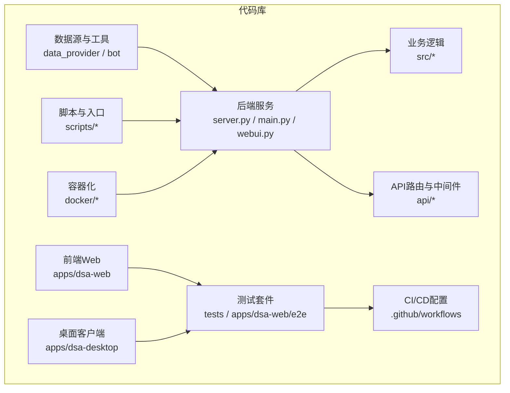
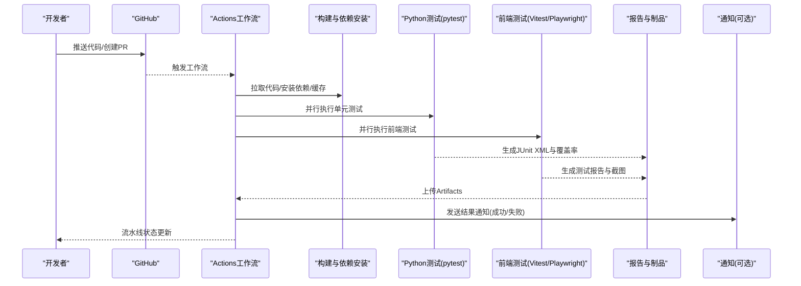
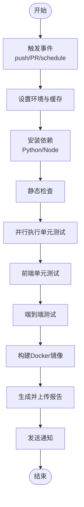
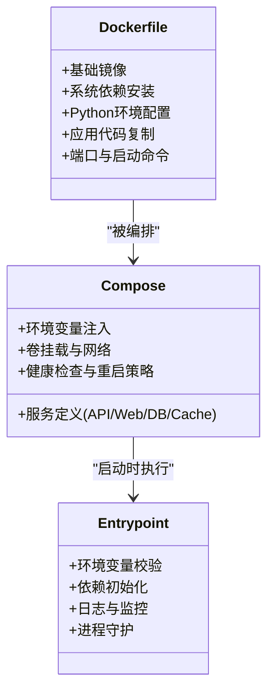
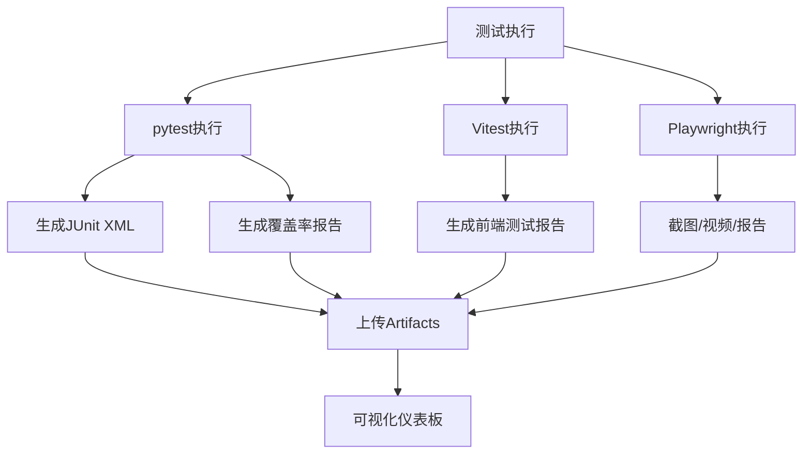
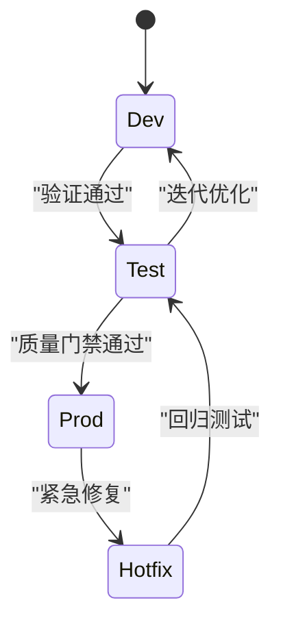
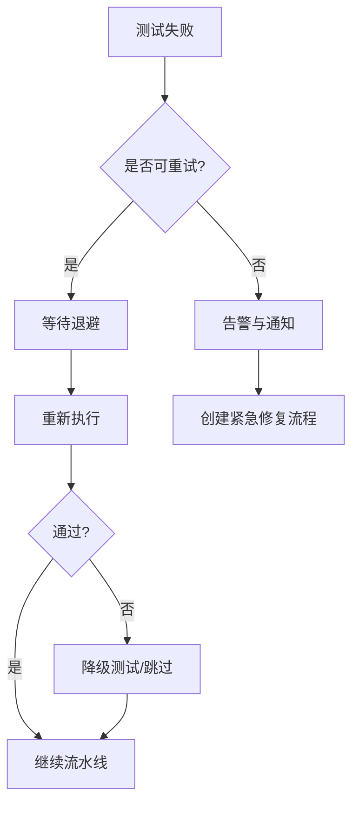
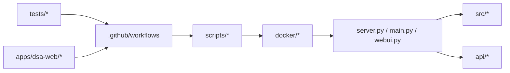

# CI/CD集成

<cite>
**本文引用的文件**   
- [daily_stock_analysis/.github/workflows](file://daily_stock_analysis/.github/workflows)
- [daily_stock_analysis/.github/requirements-ci.txt](file://daily_stock_analysis/.github/requirements-ci.txt)
- [daily_stock_analysis/docker/Dockerfile](file://daily_stock_analysis/docker/Dockerfile)
- [daily_stock_analysis/docker/docker-compose.yml](file://daily_stock_analysis/docker/docker-compose.yml)
- [daily_stock_analysis/docker/entrypoint.sh](file://daily_stock_analysis/docker/entrypoint.sh)
- [daily_stock_analysis/scripts/ci_gate.sh](file://daily_stock_analysis/scripts/ci_gate.sh)
- [daily_stock_analysis/scripts/test.sh](file://daily_stock_analysis/scripts/test.sh)
- [daily_stock_analysis/pyproject.toml](file://daily_stock_analysis/pyproject.toml)
- [daily_stock_analysis/server.py](file://daily_stock_analysis/server.py)
- [daily_stock_analysis/main.py](file://daily_stock_analysis/main.py)
- [daily_stock_analysis/webui.py](file://daily_stock_analysis/webui.py)
- [daily_stock_analysis/tests/conftest.py](file://daily_stock_analysis/tests/conftest.py)
- [daily_stock_analysis/apps/dsa-web/vitest.config.ts](file://daily_stock_analysis/apps/dsa-web/vitest.config.ts)
- [daily_stock_analysis/apps/dsa-web/playwright.config.ts](file://daily_stock_analysis/apps/dsa-web/playwright.config.ts)
</cite>

## 目录
1. [简介](#简介)
2. [项目结构](#项目结构)
3. [核心组件](#核心组件)
4. [架构总览](#架构总览)
5. [详细组件分析](#详细组件分析)
6. [依赖关系分析](#依赖关系分析)
7. [性能考量](#性能考量)
8. [故障排查指南](#故障排查指南)
9. [结论](#结论)
10. [附录](#附录)

## 简介
本文件面向Daily Stock Analysis项目的CI/CD集成，聚焦GitHub Actions工作流配置、测试环境自动化搭建（Docker容器构建与依赖安装、环境变量配置）、测试结果收集与报告（JUnit格式、覆盖率、可视化仪表板）、多环境测试策略（开发/测试/生产差异化配置），以及失败自动处理机制（重试、降级、紧急修复流程）。文档同时提供流水线配置示例与实践建议，帮助团队实现高效、稳定的自动化测试与部署。

## 项目结构
仓库采用前后端分离与多应用组织方式：
- 后端API与服务：api、src、server.py、main.py、webui.py
- 前端Web应用：apps/dsa-web（Vite + Vitest + Playwright）
- 桌面应用：apps/dsa-desktop（Electron）
- 数据与工具：data_provider、bot、scripts、docker
- 测试：tests（Python单元测试）、apps/dsa-web/e2e（端到端测试）
- CI/CD相关：.github/workflows、.github/requirements-ci.txt、scripts/ci_gate.sh、scripts/test.sh、docker/*

**图表来源** 
- [daily_stock_analysis/server.py](file://daily_stock_analysis/server.py)
- [daily_stock_analysis/main.py](file://daily_stock_analysis/main.py)
- [daily_stock_analysis/webui.py](file://daily_stock_analysis/webui.py)
- [daily_stock_analysis/src](file://daily_stock_analysis/src)
- [daily_stock_analysis/api](file://daily_stock_analysis/api)
- [daily_stock_analysis/apps/dsa-web](file://daily_stock_analysis/apps/dsa-web)
- [daily_stock_analysis/apps/dsa-desktop](file://daily_stock_analysis/apps/dsa-desktop)
- [daily_stock_analysis/data_provider](file://daily_stock_analysis/data_provider)
- [daily_stock_analysis/bot](file://daily_stock_analysis/bot)
- [daily_stock_analysis/scripts](file://daily_stock_analysis/scripts)
- [daily_stock_analysis/docker](file://daily_stock_analysis/docker)
- [daily_stock_analysis/tests](file://daily_stock_analysis/tests)
- [daily_stock_analysis/.github/workflows](file://daily_stock_analysis/.github/workflows)

**章节来源**
- [daily_stock_analysis/.github/requirements-ci.txt](file://daily_stock_analysis/.github/requirements-ci.txt)
- [daily_stock_analysis/docker/Dockerfile](file://daily_stock_analysis/docker/Dockerfile)
- [daily_stock_analysis/docker/docker-compose.yml](file://daily_stock_analysis/docker/docker-compose.yml)
- [daily_stock_analysis/docker/entrypoint.sh](file://daily_stock_analysis/docker/entrypoint.sh)
- [daily_stock_analysis/scripts/ci_gate.sh](file://daily_stock_analysis/scripts/ci_gate.sh)
- [daily_stock_analysis/scripts/test.sh](file://daily_stock_analysis/scripts/test.sh)
- [daily_stock_analysis/pyproject.toml](file://daily_stock_analysis/pyproject.toml)

## 核心组件
- GitHub Actions工作流：定义触发条件（push、PR、定时任务等）、并行矩阵（多Python版本、多操作系统）、步骤（依赖安装、静态检查、单元测试、E2E测试、构建镜像、发布制品）。
- Docker容器化：统一运行环境，包含Python运行时、系统依赖、应用二进制与配置文件；通过entrypoint初始化环境变量与数据库/缓存。
- 测试框架与配置：
  - Python：pytest + coverage（生成JUnit XML与覆盖率报告）
  - Web前端：Vitest（单元与组件测试）、Playwright（端到端测试）
- 结果收集与报告：JUnit XML上传为Artifacts，覆盖率聚合为HTML或LCOV，可选接入第三方可视化（如Codecov、SonarQube）。
- 多环境策略：通过环境变量与配置文件区分dev/test/prod，使用docker-compose与GitHub Secrets管理敏感信息。
- 失败处理：重试策略（幂等命令+最大重试次数）、降级测试（跳过外部依赖的慢测试）、紧急修复流程（快速回滚与热修复分支）。

**章节来源**
- [daily_stock_analysis/.github/workflows](file://daily_stock_analysis/.github/workflows)
- [daily_stock_analysis/docker/Dockerfile](file://daily_stock_analysis/docker/Dockerfile)
- [daily_stock_analysis/docker/docker-compose.yml](file://daily_stock_analysis/docker/docker-compose.yml)
- [daily_stock_analysis/docker/entrypoint.sh](file://daily_stock_analysis/docker/entrypoint.sh)
- [daily_stock_analysis/scripts/ci_gate.sh](file://daily_stock_analysis/scripts/ci_gate.sh)
- [daily_stock_analysis/scripts/test.sh](file://daily_stock_analysis/scripts/test.sh)
- [daily_stock_analysis/pyproject.toml](file://daily_stock_analysis/pyproject.toml)
- [daily_stock_analysis/tests/conftest.py](file://daily_stock_analysis/tests/conftest.py)
- [daily_stock_analysis/apps/dsa-web/vitest.config.ts](file://daily_stock_analysis/apps/dsa-web/vitest.config.ts)
- [daily_stock_analysis/apps/dsa-web/playwright.config.ts](file://daily_stock_analysis/apps/dsa-web/playwright.config.ts)

## 架构总览
下图展示从代码提交到测试与部署的整体流水线，包括触发器、并行执行、容器构建、测试执行、结果上报与通知。

**图表来源**
- [daily_stock_analysis/.github/workflows](file://daily_stock_analysis/.github/workflows)
- [daily_stock_analysis/scripts/test.sh](file://daily_stock_analysis/scripts/test.sh)
- [daily_stock_analysis/scripts/ci_gate.sh](file://daily_stock_analysis/scripts/ci_gate.sh)
- [daily_stock_analysis/docker/Dockerfile](file://daily_stock_analysis/docker/Dockerfile)
- [daily_stock_analysis/docker/docker-compose.yml](file://daily_stock_analysis/docker/docker-compose.yml)

## 详细组件分析

### GitHub Actions工作流配置
- 触发条件：push至主分支、创建或更新PR、定时任务（每日市场数据刷新与分析）。
- 并行矩阵：按Python版本与操作系统组合并行执行，缩短整体耗时。
- 关键步骤：
  - 设置Python与Node环境
  - 安装依赖（Python与前端）
  - 静态检查（lint、类型检查）
  - 单元测试（pytest + coverage）
  - 前端测试（Vitest + Playwright）
  - 构建Docker镜像
  - 上传测试报告与制品
  - 通知（Slack/邮件/企业微信等）

**图表来源**
- [daily_stock_analysis/.github/workflows](file://daily_stock_analysis/.github/workflows)
- [daily_stock_analysis/scripts/test.sh](file://daily_stock_analysis/scripts/test.sh)
- [daily_stock_analysis/scripts/ci_gate.sh](file://daily_stock_analysis/scripts/ci_gate.sh)

**章节来源**
- [daily_stock_analysis/.github/workflows](file://daily_stock_analysis/.github/workflows)
- [daily_stock_analysis/.github/requirements-ci.txt](file://daily_stock_analysis/.github/requirements-ci.txt)

### 测试环境自动化搭建（Docker）
- Dockerfile：定义基础镜像、系统依赖、Python版本、应用代码复制、端口暴露与启动命令。
- docker-compose：编排多个服务（API、Web、数据库、缓存），支持不同环境的配置覆盖。
- entrypoint.sh：初始化环境变量、校验配置、准备数据目录、启动服务。

**图表来源**
- [daily_stock_analysis/docker/Dockerfile](file://daily_stock_analysis/docker/Dockerfile)
- [daily_stock_analysis/docker/docker-compose.yml](file://daily_stock_analysis/docker/docker-compose.yml)
- [daily_stock_analysis/docker/entrypoint.sh](file://daily_stock_analysis/docker/entrypoint.sh)

**章节来源**
- [daily_stock_analysis/docker/Dockerfile](file://daily_stock_analysis/docker/Dockerfile)
- [daily_stock_analysis/docker/docker-compose.yml](file://daily_stock_analysis/docker/docker-compose.yml)
- [daily_stock_analysis/docker/entrypoint.sh](file://daily_stock_analysis/docker/entrypoint.sh)

### 测试结果收集与报告
- Python测试：pytest输出JUnit XML，coverage生成覆盖率报告（HTML/LCOV），便于后续聚合与可视化。
- 前端测试：Vitest输出JSON/XML，Playwright生成截图与视频，便于问题定位。
- 报告聚合：将JUnit XML与覆盖率上传为Artifacts，可接入Codecov/SonarQube进行可视化。

**图表来源**
- [daily_stock_analysis/scripts/test.sh](file://daily_stock_analysis/scripts/test.sh)
- [daily_stock_analysis/pyproject.toml](file://daily_stock_analysis/pyproject.toml)
- [daily_stock_analysis/apps/dsa-web/vitest.config.ts](file://daily_stock_analysis/apps/dsa-web/vitest.config.ts)
- [daily_stock_analysis/apps/dsa-web/playwright.config.ts](file://daily_stock_analysis/apps/dsa-web/playwright.config.ts)

**章节来源**
- [daily_stock_analysis/scripts/test.sh](file://daily_stock_analysis/scripts/test.sh)
- [daily_stock_analysis/pyproject.toml](file://daily_stock_analysis/pyproject.toml)
- [daily_stock_analysis/apps/dsa-web/vitest.config.ts](file://daily_stock_analysis/apps/dsa-web/vitest.config.ts)
- [daily_stock_analysis/apps/dsa-web/playwright.config.ts](file://daily_stock_analysis/apps/dsa-web/playwright.config.ts)

### 多环境测试策略
- 开发环境：本地与容器化一致，启用调试模式与详细日志。
- 测试环境：隔离的数据源与Mock服务，禁用外部依赖的慢路径。
- 生产环境：严格的环境变量与权限控制，最小化依赖与只读配置。
- 配置管理：通过环境变量与配置文件分层覆盖，使用GitHub Secrets管理密钥。

**图表来源**
- [daily_stock_analysis/docker/docker-compose.yml](file://daily_stock_analysis/docker/docker-compose.yml)
- [daily_stock_analysis/docker/entrypoint.sh](file://daily_stock_analysis/docker/entrypoint.sh)

**章节来源**
- [daily_stock_analysis/docker/docker-compose.yml](file://daily_stock_analysis/docker/docker-compose.yml)
- [daily_stock_analysis/docker/entrypoint.sh](file://daily_stock_analysis/docker/entrypoint.sh)

### 失败自动处理机制
- 重试策略：对幂等命令设置最大重试次数与退避间隔，避免瞬时失败导致流水线中断。
- 降级测试：对外部依赖（如数据源、LLM）进行Mock或跳过，确保核心逻辑稳定。
- 紧急修复：快速创建hotfix分支，优先恢复服务，再补充测试用例与回归验证。

**图表来源**
- [daily_stock_analysis/scripts/ci_gate.sh](file://daily_stock_analysis/scripts/ci_gate.sh)
- [daily_stock_analysis/scripts/test.sh](file://daily_stock_analysis/scripts/test.sh)

**章节来源**
- [daily_stock_analysis/scripts/ci_gate.sh](file://daily_stock_analysis/scripts/ci_gate.sh)
- [daily_stock_analysis/scripts/test.sh](file://daily_stock_analysis/scripts/test.sh)

## 依赖关系分析
- 工作流依赖：.github/workflows中的YAML文件定义了步骤顺序与依赖关系。
- 容器依赖：Dockerfile与docker-compose.yml定义了运行时依赖与服务编排。
- 测试依赖：pyproject.toml与前端配置文件定义了测试框架与插件。

**图表来源**
- [daily_stock_analysis/.github/workflows](file://daily_stock_analysis/.github/workflows)
- [daily_stock_analysis/scripts/ci_gate.sh](file://daily_stock_analysis/scripts/ci_gate.sh)
- [daily_stock_analysis/scripts/test.sh](file://daily_stock_analysis/scripts/test.sh)
- [daily_stock_analysis/docker/Dockerfile](file://daily_stock_analysis/docker/Dockerfile)
- [daily_stock_analysis/docker/docker-compose.yml](file://daily_stock_analysis/docker/docker-compose.yml)
- [daily_stock_analysis/server.py](file://daily_stock_analysis/server.py)
- [daily_stock_analysis/main.py](file://daily_stock_analysis/main.py)
- [daily_stock_analysis/webui.py](file://daily_stock_analysis/webui.py)
- [daily_stock_analysis/src](file://daily_stock_analysis/src)
- [daily_stock_analysis/api](file://daily_stock_analysis/api)
- [daily_stock_analysis/tests](file://daily_stock_analysis/tests)
- [daily_stock_analysis/apps/dsa-web](file://daily_stock_analysis/apps/dsa-web)

**章节来源**
- [daily_stock_analysis/.github/workflows](file://daily_stock_analysis/.github/workflows)
- [daily_stock_analysis/pyproject.toml](file://daily_stock_analysis/pyproject.toml)

## 性能考量
- 并行执行：利用GitHub Actions矩阵并行执行测试，缩短流水线时间。
- 缓存依赖：缓存Python与Node依赖，减少重复安装时间。
- 增量测试：仅对变更文件执行相关测试，提升效率。
- 资源限制：合理分配Runner内存与CPU，避免OOM。
- 报告聚合：延迟生成重型报告，仅在必要时启用。

[本节为通用指导，无需特定文件引用]

## 故障排查指南
- 常见错误：
  - 依赖安装失败：检查网络与镜像源，确认requirements与package.json版本兼容。
  - 测试超时：增加超时阈值或拆分测试集，优化I/O操作。
  - 环境变量缺失：在GitHub Secrets中配置必要密钥，并在entrypoint中校验。
  - 容器启动失败：查看日志与healthcheck，确认端口与依赖服务可用。
- 调试技巧：
  - 启用详细日志与调试模式
  - 使用本地docker-compose复现问题
  - 下载Artifacts分析报告与截图

**章节来源**
- [daily_stock_analysis/docker/entrypoint.sh](file://daily_stock_analysis/docker/entrypoint.sh)
- [daily_stock_analysis/scripts/test.sh](file://daily_stock_analysis/scripts/test.sh)
- [daily_stock_analysis/scripts/ci_gate.sh](file://daily_stock_analysis/scripts/ci_gate.sh)

## 结论
通过完善的GitHub Actions工作流、容器化环境、统一的测试框架与报告机制，Daily Stock Analysis实现了高效的自动化测试与部署。多环境策略与失败处理机制保障了系统的稳定性与可维护性。建议持续优化并行度、缓存策略与报告可视化，进一步提升CI/CD效率与用户体验。

[本节为总结，无需特定文件引用]

## 附录
- 参考文件：
  - GitHub Actions工作流：.github/workflows
  - 依赖清单：.github/requirements-ci.txt
  - 容器配置：docker/Dockerfile、docker/docker-compose.yml、docker/entrypoint.sh
  - 测试脚本：scripts/test.sh、scripts/ci_gate.sh
  - 项目配置：pyproject.toml
  - 应用入口：server.py、main.py、webui.py
  - 测试配置：tests/conftest.py、apps/dsa-web/vitest.config.ts、apps/dsa-web/playwright.config.ts

[本节为附录，无需特定文件引用]