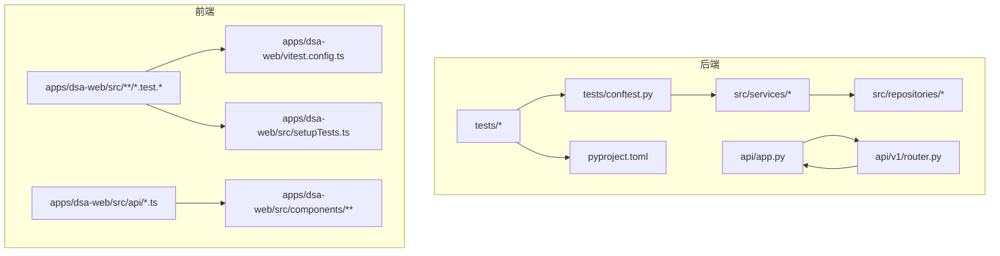
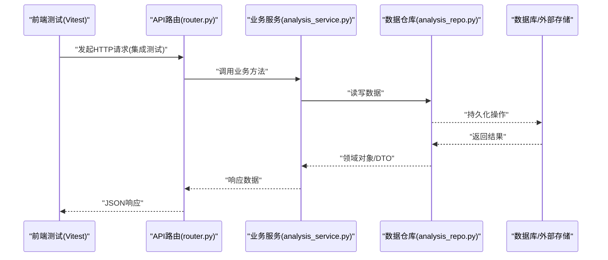
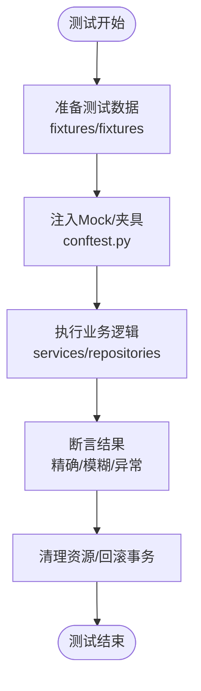
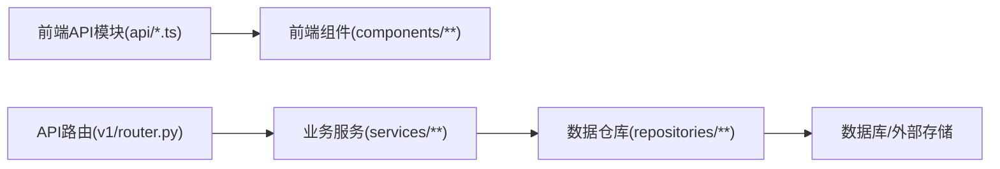

# 单元测试

<cite>
**本文引用的文件**   
- [tests/conftest.py](file://tests/conftest.py)
- [pyproject.toml](file://pyproject.toml)
- [apps/dsa-web/vitest.config.ts](file://apps/dsa-web/vitest.config.ts)
- [apps/dsa-web/src/setupTests.ts](file://apps/dsa-web/src/setupTests.ts)
- [apps/dsa-web/src/App.test.tsx](file://apps/dsa-web/src/App.test.tsx)
- [apps/dsa-web/src/api/analysis.ts](file://apps/dsa-web/src/api/analysis.ts)
- [api/app.py](file://api/app.py)
- [api/v1/router.py](file://api/v1/router.py)
- [src/services/analysis_service.py](file://src/services/analysis_service.py)
- [src/repositories/analysis_repo.py](file://src/repositories/analysis_repo.py)
- [scripts/test.sh](file://scripts/test.sh)
</cite>

## 目录
1. [简介](#简介)
2. [项目结构](#项目结构)
3. [核心组件](#核心组件)
4. [架构总览](#架构总览)
5. [详细组件分析](#详细组件分析)
6. [依赖分析](#依赖分析)
7. [性能考虑](#性能考虑)
8. [故障排查指南](#故障排查指南)
9. [结论](#结论)
10. [附录](#附录)

## 简介
本文件面向Daily Stock Analysis项目的单元测试实践，覆盖Python后端与React前端的测试规范、Mock策略、断言最佳实践、覆盖率要求与统计方法，并提供可维护、可读性强的测试用例示例。文档基于仓库中的测试配置、现有测试样例与关键服务/接口实现进行归纳总结，帮助读者快速建立统一的测试标准并落地到日常开发中。

## 项目结构
- 后端测试位于 tests 目录，采用 pytest 框架组织；前端测试位于 apps/dsa-web，使用 Vitest + React Testing Library。
- 测试入口与运行脚本：
  - 后端：通过 scripts/test.sh 统一执行测试命令。
  - 前端：通过 vitest.config.ts 定义测试环境、全局设置与覆盖率收集。
- 公共夹具与共享配置：
  - 后端：tests/conftest.py 提供跨测试的夹具、数据库连接、API客户端等。
  - 前端：apps/dsa-web/src/setupTests.ts 提供全局测试初始化（如 i18n、mock fetch）。

图表来源
- [tests/conftest.py](file://tests/conftest.py)
- [pyproject.toml](file://pyproject.toml)
- [apps/dsa-web/vitest.config.ts](file://apps/dsa-web/vitest.config.ts)
- [apps/dsa-web/src/setupTests.ts](file://apps/dsa-web/src/setupTests.ts)
- [api/app.py](file://api/app.py)
- [api/v1/router.py](file://api/v1/router.py)

章节来源
- [scripts/test.sh](file://scripts/test.sh)
- [pyproject.toml](file://pyproject.toml)
- [apps/dsa-web/vitest.config.ts](file://apps/dsa-web/vitest.config.ts)
- [apps/dsa-web/src/setupTests.ts](file://apps/dsa-web/src/setupTests.ts)

## 核心组件
- 后端测试框架与夹具
  - pytest 作为测试运行器，conftest.py 集中管理测试夹具（如数据库、HTTP客户端、外部依赖Mock）。
  - 建议将异步测试、事务回滚、数据准备封装为夹具，保证测试隔离与幂等。
- 前端测试框架与工具链
  - Vitest 作为测试运行器，React Testing Library 用于组件渲染与交互模拟。
  - setupTests.ts 统一初始化测试环境（如 i18n、fetch mock、路由、store）。
- API层与业务层解耦
  - api/app.py 与 api/v1/router.py 负责路由与请求处理，业务逻辑下沉至 src/services/*，数据访问在 src/repositories/*。
  - 测试应优先对 services 与 repositories 进行单元级验证，API层以集成测试为主。

章节来源
- [tests/conftest.py](file://tests/conftest.py)
- [api/app.py](file://api/app.py)
- [api/v1/router.py](file://api/v1/router.py)
- [src/services/analysis_service.py](file://src/services/analysis_service.py)
- [src/repositories/analysis_repo.py](file://src/repositories/analysis_repo.py)

## 架构总览
下图展示从前端请求到后端服务与数据层的调用路径，以及测试在各层的切入点。

图表来源
- [api/v1/router.py](file://api/v1/router.py)
- [src/services/analysis_service.py](file://src/services/analysis_service.py)
- [src/repositories/analysis_repo.py](file://src/repositories/analysis_repo.py)

## 详细组件分析

### Python后端单元测试规范
- 函数测试
  - 针对纯函数或无副作用的方法，直接传入参数并断言返回值。
  - 使用 fixtures 构造输入数据，避免在测试内重复构建复杂对象。
- 类测试
  - 对包含状态的服务类，使用 setUp/tearDown 或 pytest fixture 控制生命周期。
  - 对需要外部依赖的类，通过依赖注入或模块级 patch 替换为 Mock。
- 异步代码测试
  - 使用 pytest-asyncio 或等效机制，确保 async def 测试正确执行。
  - 对网络IO、队列、定时任务等异步场景，建议使用内存替代或轻量Mock。
- Mock策略
  - 外部依赖：使用 unittest.mock.patch 或第三方库（如 responses、httpx-mock）拦截HTTP请求。
  - 数据库连接：通过 SQLAlchemy 的 in-memory 引擎或测试专用连接，结合事务回滚保证隔离。
  - API调用：对第三方API使用固定响应体，避免真实网络请求。
- 断言最佳实践
  - 精确断言：对关键数值、枚举值、时间戳进行严格比较。
  - 模糊匹配：对日志、HTML片段、非确定性字段使用正则或包含断言。
  - 异常测试：使用 assertRaises 或 pytest.raises 捕获预期异常并校验错误码/消息。
- 覆盖率要求与统计
  - 行覆盖率≥80%，分支覆盖率≥70%，函数覆盖率≥85%（可按模块逐步提升）。
  - 使用 coverage 或 pytest-cov 生成报告，CI中设置阈值门禁。

章节来源
- [tests/conftest.py](file://tests/conftest.py)
- [pyproject.toml](file://pyproject.toml)

### React前端组件单元测试规范
- 组件渲染测试
  - 使用 render 渲染组件，断言DOM结构与文本内容符合预期。
  - 对受控组件，先设置初始状态再断言渲染结果。
- 用户交互模拟
  - 使用 fireEvent 或 userEvent 模拟点击、输入、选择等操作。
  - 对异步交互（如表单提交），等待 Promise 完成后再断言。
- 状态变化验证
  - 对 store/context/state 的变化，使用 rerender 或重新获取状态源进行断言。
  - 对副作用（如网络请求），使用 jest.fn()/vi.fn() 或 fetch mock 验证调用次数与参数。
- Mock策略
  - API调用：对 apps/dsa-web/src/api/*.ts 中的请求函数进行 mock，返回固定数据。
  - 第三方库：对图表、日期、国际化等库进行轻量替换，避免UI差异影响断言。
- 断言最佳实践
  - 行为驱动：优先断言用户可见的结果（文本、样式、导航跳转）。
  - 稳定性：避免断言内部实现细节（如 setState 调用顺序），关注对外行为。
  - 异常路径：模拟网络失败、权限不足等场景，验证错误提示与降级逻辑。
- 覆盖率要求与统计
  - 行覆盖率≥80%，分支覆盖率≥70%，语句覆盖率≥85%。
  - 使用 Vitest 内置覆盖率插件，输出 HTML/JSON 报告。

章节来源
- [apps/dsa-web/vitest.config.ts](file://apps/dsa-web/vitest.config.ts)
- [apps/dsa-web/src/setupTests.ts](file://apps/dsa-web/src/setupTests.ts)
- [apps/dsa-web/src/App.test.tsx](file://apps/dsa-web/src/App.test.tsx)
- [apps/dsa-web/src/api/analysis.ts](file://apps/dsa-web/src/api/analysis.ts)

### 测试用例示例（路径指引）
- 后端函数测试
  - 参考：[tests/test_analysis_metadata.py](file://tests/test_analysis_metadata.py)
  - 说明：对元数据处理函数进行输入输出断言，覆盖边界条件与异常路径。
- 后端类测试
  - 参考：[tests/test_analysis_context_builder.py](file://tests/test_analysis_context_builder.py)
  - 说明：对上下文构建服务进行状态变更与依赖Mock验证。
- 后端异步测试
  - 参考：[tests/test_bot_dispatcher_async.py](file://tests/test_bot_dispatcher_async.py)
  - 说明：对异步调度流程进行事件顺序与超时处理验证。
- 前端组件测试
  - 参考：[apps/dsa-web/src/App.test.tsx](file://apps/dsa-web/src/App.test.tsx)
  - 说明：对根组件渲染、路由与基础交互进行断言。
- 前端API Mock
  - 参考：[apps/dsa-web/src/api/analysis.ts](file://apps/dsa-web/src/api/analysis.ts)
  - 说明：对分析相关API进行请求拦截与响应模拟，验证组件数据流。

章节来源
- [tests/test_analysis_metadata.py](file://tests/test_analysis_metadata.py)
- [tests/test_analysis_context_builder.py](file://tests/test_analysis_context_builder.py)
- [tests/test_bot_dispatcher_async.py](file://tests/test_bot_dispatcher_async.py)
- [apps/dsa-web/src/App.test.tsx](file://apps/dsa-web/src/App.test.tsx)
- [apps/dsa-web/src/api/analysis.ts](file://apps/dsa-web/src/api/analysis.ts)

### 流程图：后端测试数据准备与断言

图表来源
- [tests/conftest.py](file://tests/conftest.py)
- [src/services/analysis_service.py](file://src/services/analysis_service.py)
- [src/repositories/analysis_repo.py](file://src/repositories/analysis_repo.py)

## 依赖分析
- 后端依赖
  - api/app.py 与 api/v1/router.py 构成HTTP入口，依赖 services/* 与 repositories/*。
  - 测试通过 conftest.py 注入依赖替身，避免真实网络与数据库访问。
- 前端依赖
  - apps/dsa-web/src/api/*.ts 被组件消费，测试中对这些模块进行Mock，确保UI测试稳定。
  - setupTests.ts 统一初始化测试环境，减少重复配置。

图表来源
- [apps/dsa-web/src/api/analysis.ts](file://apps/dsa-web/src/api/analysis.ts)
- [api/v1/router.py](file://api/v1/router.py)
- [src/services/analysis_service.py](file://src/services/analysis_service.py)
- [src/repositories/analysis_repo.py](file://src/repositories/analysis_repo.py)

章节来源
- [api/app.py](file://api/app.py)
- [api/v1/router.py](file://api/v1/router.py)
- [apps/dsa-web/src/api/analysis.ts](file://apps/dsa-web/src/api/analysis.ts)

## 性能考虑
- 测试数据最小化：仅加载必要数据，避免大对象与冗余字段。
- 并行执行：启用 pytest-xdist 与 Vitest 的并发模式，缩短CI时间。
- Mock开销控制：避免在高频路径中进行重型Mock初始化，必要时缓存Mock实例。
- 数据库测试：使用内存数据库或轻量SQLite，关闭不必要的索引与触发器。

## 故障排查指南
- 常见后端问题
  - 夹具未生效：检查 conftest.py 作用域与导入路径。
  - 异步测试挂起：确认是否正确使用 asyncio 事件循环与超时设置。
  - 网络请求未拦截：检查 responses/httpx-mock 是否正确注册。
- 常见前端问题
  - 组件渲染空白：检查 setupTests.ts 初始化是否完整（i18n、路由、store）。
  - 交互未触发：确认 userEvent/fireEvent 的使用时机与异步等待。
  - Mock不生效：确保在测试前对目标模块进行 vi.mock/jest.mock。

章节来源
- [tests/conftest.py](file://tests/conftest.py)
- [apps/dsa-web/src/setupTests.ts](file://apps/dsa-web/src/setupTests.ts)

## 结论
通过统一的测试框架、清晰的Mock策略与严格的断言规范，Daily Stock Analysis项目在前后端均建立了可维护、可扩展的单元测试体系。建议在持续集成中强制覆盖率门禁，并定期审查测试质量，确保回归安全与交付效率。

## 附录
- 运行测试
  - 后端：使用 scripts/test.sh 统一执行 pytest。
  - 前端：在 apps/dsa-web 目录下运行 Vitest。
- 覆盖率报告
  - 后端：coverage run -m pytest 生成 .coverage 与 HTML 报告。
  - 前端：Vitest 内置 --coverage 选项输出 HTML/JSON。

章节来源
- [scripts/test.sh](file://scripts/test.sh)
- [pyproject.toml](file://pyproject.toml)
- [apps/dsa-web/vitest.config.ts](file://apps/dsa-web/vitest.config.ts)