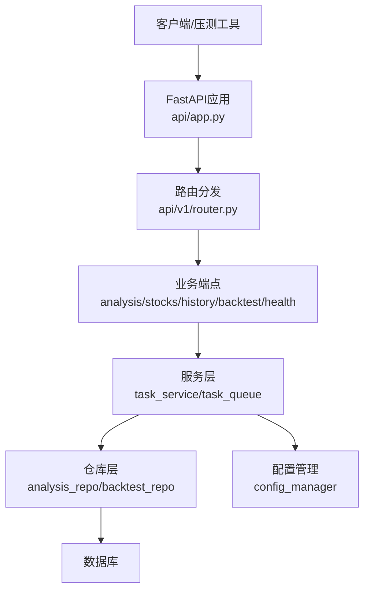
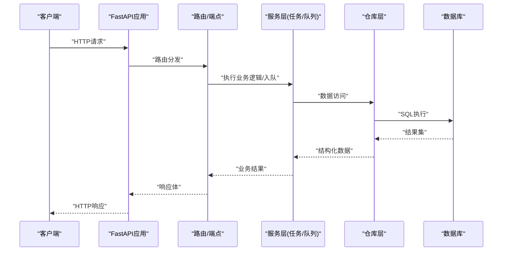
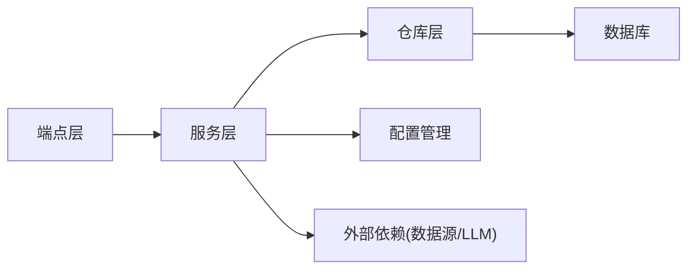

# 性能测试

<cite>
**本文引用的文件**   
- [main.py](file://main.py)
- [server.py](file://server.py)
- [api/app.py](file://api/app.py)
- [api/v1/router.py](file://api/v1/router.py)
- [api/v1/endpoints/analysis.py](file://api/v1/endpoints/analysis.py)
- [api/v1/endpoints/stocks.py](file://api/v1/endpoints/stocks.py)
- [api/v1/endpoints/history.py](file://api/v1/endpoints/history.py)
- [api/v1/endpoints/backtest.py](file://api/v1/endpoints/backtest.py)
- [api/v1/endpoints/health.py](file://api/v1/endpoints/health.py)
- [src/services/task_service.py](file://src/services/task_service.py)
- [src/services/task_queue.py](file://src/services/task_queue.py)
- [src/core/config_manager.py](file://src/core/config_manager.py)
- [src/repositories/analysis_repo.py](file://src/repositories/analysis_repo.py)
- [src/repositories/backtest_repo.py](file://src/repositories/backtest_repo.py)
- [tests/test_search_performance.py](file://tests/test_search_performance.py)
- [scripts/ci_gate.sh](file://scripts/ci_gate.sh)
</cite>

## 目录
1. [简介](#简介)
2. [项目结构](#项目结构)
3. [核心组件](#核心组件)
4. [架构总览](#架构总览)
5. [详细组件分析](#详细组件分析)
6. [依赖关系分析](#依赖关系分析)
7. [性能考量](#性能考量)
8. [故障排查指南](#故障排查指南)
9. [结论](#结论)
10. [附录](#附录)

## 简介
本文件面向Daily Stock Analysis项目的性能测试，目标是建立一套完整的性能基准、负载与回归体系，覆盖关键API响应时间测量、吞吐能力评估、资源使用监控、内存泄漏检测、CPU热点定位、数据库查询优化与连接池调优，以及自动化性能阈值对比。文档将结合后端FastAPI服务、任务队列与仓库层，给出可操作的测试方法、指标定义与集成方案。

## 项目结构
本项目采用分层架构：
- API层：基于FastAPI的REST接口，按功能模块划分端点（如分析、股票、历史、回测、健康检查等）。
- 服务层：业务编排与调度（任务服务、队列、配置管理等）。
- 数据访问层：仓库实现（分析与回测结果持久化等）。
- 测试与脚本：包含性能相关测试用例与CI门禁脚本。

图表来源
- [api/app.py:1-200](file://api/app.py#L1-L200)
- [api/v1/router.py:1-200](file://api/v1/router.py#L1-L200)
- [api/v1/endpoints/analysis.py:1-200](file://api/v1/endpoints/analysis.py#L1-L200)
- [api/v1/endpoints/stocks.py:1-200](file://api/v1/endpoints/stocks.py#L1-L200)
- [api/v1/endpoints/history.py:1-200](file://api/v1/endpoints/history.py#L1-L200)
- [api/v1/endpoints/backtest.py:1-200](file://api/v1/endpoints/backtest.py#L1-L200)
- [src/services/task_service.py:1-200](file://src/services/task_service.py#L1-L200)
- [src/services/task_queue.py:1-200](file://src/services/task_queue.py#L1-L200)
- [src/core/config_manager.py:1-200](file://src/core/config_manager.py#L1-L200)
- [src/repositories/analysis_repo.py:1-200](file://src/repositories/analysis_repo.py#L1-L200)
- [src/repositories/backtest_repo.py:1-200](file://src/repositories/backtest_repo.py#L1-L200)

章节来源
- [main.py:1-200](file://main.py#L1-L200)
- [server.py:1-200](file://server.py#L1-L200)
- [api/app.py:1-200](file://api/app.py#L1-L200)
- [api/v1/router.py:1-200](file://api/v1/router.py#L1-L200)

## 核心组件
- FastAPI应用入口与中间件：负责生命周期管理、错误处理、CORS、请求日志与度量收集。
- 路由与端点：按领域划分，承载分析、股票、历史、回测与健康检查等接口。
- 任务服务与队列：异步任务编排、并发控制、重试与限流。
- 仓库层：对数据库进行读写操作，支撑分析与回测数据的持久化。
- 配置管理：集中化管理运行时参数（如连接池大小、超时、线程数等），便于性能调优。

章节来源
- [api/app.py:1-200](file://api/app.py#L1-L200)
- [api/v1/router.py:1-200](file://api/v1/router.py#L1-L200)
- [src/services/task_service.py:1-200](file://src/services/task_service.py#L1-L200)
- [src/services/task_queue.py:1-200](file://src/services/task_queue.py#L1-L200)
- [src/core/config_manager.py:1-200](file://src/core/config_manager.py#L1-L200)
- [src/repositories/analysis_repo.py:1-200](file://src/repositories/analysis_repo.py#L1-L200)
- [src/repositories/backtest_repo.py:1-200](file://src/repositories/backtest_repo.py#L1-L200)

## 架构总览
下图展示从客户端到数据库的关键调用路径，并标注性能观测点（响应时间、吞吐、资源占用）与潜在瓶颈位置。

图表来源
- [api/app.py:1-200](file://api/app.py#L1-L200)
- [api/v1/router.py:1-200](file://api/v1/router.py#L1-L200)
- [api/v1/endpoints/analysis.py:1-200](file://api/v1/endpoints/analysis.py#L1-L200)
- [api/v1/endpoints/stocks.py:1-200](file://api/v1/endpoints/stocks.py#L1-L200)
- [api/v1/endpoints/history.py:1-200](file://api/v1/endpoints/history.py#L1-L200)
- [api/v1/endpoints/backtest.py:1-200](file://api/v1/endpoints/backtest.py#L1-L200)
- [src/services/task_service.py:1-200](file://src/services/task_service.py#L1-L200)
- [src/services/task_queue.py:1-200](file://src/services/task_queue.py#L1-L200)
- [src/repositories/analysis_repo.py:1-200](file://src/repositories/analysis_repo.py#L1-L200)
- [src/repositories/backtest_repo.py:1-200](file://src/repositories/backtest_repo.py#L1-L200)

## 详细组件分析

### 关键API接口响应时间与吞吐测试
- 目标接口
  - 分析接口：生成每日或单股分析报告
  - 股票接口：获取股票列表、基本信息与实时/历史数据
  - 历史接口：批量拉取历史行情与指标
  - 回测接口：执行策略回测并返回结果
  - 健康检查：快速验证服务可用性
- 测试方法
  - 使用压测工具（如wrk、locust、k6）模拟并发用户，逐步提升QPS以观察延迟与吞吐变化
  - 记录P50/P90/P99延迟、成功率、错误码分布、每秒请求数（RPS）
  - 针对长耗时接口（分析、回测）采用异步任务+轮询或SSE/WS推送结果
- 观测点
  - 应用层：请求进入/离开时间、序列化/反序列化耗时、外部依赖调用耗时
  - 系统层：CPU、内存、I/O、网络带宽
  - 数据库层：慢查询、锁等待、连接池耗尽

章节来源
- [api/v1/endpoints/analysis.py:1-200](file://api/v1/endpoints/analysis.py#L1-L200)
- [api/v1/endpoints/stocks.py:1-200](file://api/v1/endpoints/stocks.py#L1-L200)
- [api/v1/endpoints/history.py:1-200](file://api/v1/endpoints/history.py#L1-L200)
- [api/v1/endpoints/backtest.py:1-200](file://api/v1/endpoints/backtest.py#L1-L200)
- [api/v1/endpoints/health.py:1-200](file://api/v1/endpoints/health.py#L1-L200)

### 负载测试方法与场景设计
- 并发用户模拟
  - 通过压测工具设置虚拟用户数、预热阶段、稳定阶段与爬坡阶段
  - 混合场景：读多写少（历史查询为主）、写多读少（回测提交）、均衡场景
- 压力测试场景
  - 峰值突发：短时间高并发冲击，观察服务降级与恢复
  - 持续高压：长时间维持高负载，观察内存增长与GC行为
  - 渐进式加压：逐步增加并发，识别拐点与饱和点
- 性能瓶颈识别
  - CPU密集型：分析/回测计算、数据预处理
  - I/O密集型：外部数据源拉取、磁盘读写、网络延迟
  - 数据库瓶颈：慢查询、索引缺失、连接池不足、锁竞争

章节来源
- [src/services/task_service.py:1-200](file://src/services/task_service.py#L1-L200)
- [src/services/task_queue.py:1-200](file://src/services/task_queue.py#L1-L200)
- [src/core/config_manager.py:1-200](file://src/core/config_manager.py#L1-L200)

### 内存泄漏检测与CPU性能分析
- 内存泄漏检测
  - 使用内存快照工具（如tracemalloc、memory_profiler）在压测前后采集堆快照，比较对象增长趋势
  - 关注长期运行的后台任务与缓存数据结构，避免未释放引用
- CPU性能分析
  - 使用cProfile/py-spy等工具定位热点函数，分析调用栈与耗时占比
  - 针对分析/回测算法进行向量化或并行化优化，减少Python解释器开销
- 监控指标
  - RSS、Heap分配、GC次数与耗时、上下文切换频率、线程阻塞时长

章节来源
- [src/services/task_service.py:1-200](file://src/services/task_service.py#L1-L200)
- [src/services/task_queue.py:1-200](file://src/services/task_queue.py#L1-L200)

### 数据库查询性能优化与测试
- 慢查询检测
  - 启用数据库慢查询日志，结合APM工具统计Top N慢查询
  - 定期审查EXPLAIN计划，识别全表扫描与索引失效
- 索引效果验证
  - 针对高频过滤字段（日期、股票代码、策略ID）建立复合索引
  - 通过压测对比索引前后的查询耗时与IO消耗
- 连接池配置优化
  - 调整连接池大小、最大空闲时间、超时与重试策略
  - 监控连接池命中率与等待队列长度，避免连接耗尽导致请求堆积

章节来源
- [src/repositories/analysis_repo.py:1-200](file://src/repositories/analysis_repo.py#L1-L200)
- [src/repositories/backtest_repo.py:1-200](file://src/repositories/backtest_repo.py#L1-L200)
- [src/core/config_manager.py:1-200](file://src/core/config_manager.py#L1-L200)

### 性能回归测试集成
- 阈值设定
  - 为关键接口设定P99延迟上限、错误率上限、吞吐量下限
  - 根据基线版本确定回归阈值（如P99延迟不超过基线的120%）
- 自动化对比
  - 在CI流水线中运行性能测试套件，输出报告并与基线对比
  - 失败时阻断合并，要求提供优化方案与复测结果
- 监控与告警
  - 在生产环境部署APM与指标采集，设置阈值告警
  - 结合日志与追踪信息快速定位问题

章节来源
- [tests/test_search_performance.py:1-200](file://tests/test_search_performance.py#L1-L200)
- [scripts/ci_gate.sh:1-200](file://scripts/ci_gate.sh#L1-L200)

## 依赖关系分析
- 组件耦合
  - 端点与服务层解耦，通过接口契约传递数据，降低变更影响面
  - 服务层与仓库层分离，便于替换存储实现与引入缓存
- 外部依赖
  - 数据源（行情、新闻、基本面）可能成为性能瓶颈，需引入缓存与降级策略
  - LLM调用具有不确定性，需设置超时、重试与熔断
- 循环依赖
  - 避免服务层与仓库层相互引用，保持单向依赖

图表来源
- [api/v1/endpoints/analysis.py:1-200](file://api/v1/endpoints/analysis.py#L1-L200)
- [api/v1/endpoints/stocks.py:1-200](file://api/v1/endpoints/stocks.py#L1-L200)
- [api/v1/endpoints/history.py:1-200](file://api/v1/endpoints/history.py#L1-L200)
- [api/v1/endpoints/backtest.py:1-200](file://api/v1/endpoints/backtest.py#L1-L200)
- [src/services/task_service.py:1-200](file://src/services/task_service.py#L1-L200)
- [src/services/task_queue.py:1-200](file://src/services/task_queue.py#L1-L200)
- [src/core/config_manager.py:1-200](file://src/core/config_manager.py#L1-L200)
- [src/repositories/analysis_repo.py:1-200](file://src/repositories/analysis_repo.py#L1-L200)
- [src/repositories/backtest_repo.py:1-200](file://src/repositories/backtest_repo.py#L1-L200)

章节来源
- [api/app.py:1-200](file://api/app.py#L1-L200)
- [api/v1/router.py:1-200](file://api/v1/router.py#L1-L200)

## 性能考量
- 应用层
  - 使用异步IO减少阻塞，合理设置线程池与进程数
  - 序列化/反序列化优化，避免大对象频繁创建与拷贝
- 数据层
  - 分页与增量更新，减少单次查询数据量
  - 缓存热点数据（如股票映射、指数成分），降低重复计算
- 外部依赖
  - 设置合理的超时与重试策略，避免雪崩效应
  - 使用熔断与降级，保障核心功能可用
- 监控与可观测性
  - 统一日志格式与追踪ID，便于问题定位
  - 指标采集（延迟、吞吐、错误率、资源使用）与可视化看板

[本节为通用指导，不直接分析具体文件]

## 故障排查指南
- 常见问题
  - 连接池耗尽：检查连接池配置与SQL执行耗时，优化慢查询
  - 内存泄漏：使用内存快照对比，定位未释放对象与循环引用
  - CPU热点：通过性能剖析定位热点函数，考虑算法优化或并行化
  - 外部依赖超时：调整超时与重试策略，引入缓存与降级
- 诊断步骤
  - 收集日志与追踪信息，复现问题场景
  - 使用压测工具模拟负载，观察指标变化
  - 逐步缩小范围，定位具体模块与代码路径
  - 修复后回归测试，确保性能不劣化

章节来源
- [src/services/task_service.py:1-200](file://src/services/task_service.py#L1-L200)
- [src/services/task_queue.py:1-200](file://src/services/task_queue.py#L1-L200)
- [src/core/config_manager.py:1-200](file://src/core/config_manager.py#L1-L200)

## 结论
通过建立完整的性能测试体系，Daily Stock Analysis能够在开发、测试与生产环境中持续保障服务质量。建议将性能测试纳入CI/CD流程，设定明确的阈值与告警机制，结合监控与诊断工具，快速定位与解决问题，持续提升系统稳定性与用户体验。

[本节为总结性内容，不直接分析具体文件]

## 附录
- 常用压测工具
  - wrk：高并发HTTP压测
  - locust：Python编写的分布式压测框架
  - k6：现代JavaScript驱动的压测工具
- 监控与剖析工具
  - Prometheus + Grafana：指标采集与可视化
  - APM工具（如SkyWalking、Jaeger）：链路追踪
  - cProfile/py-spy：CPU剖析
  - tracemalloc/memory_profiler：内存剖析
- 数据库优化
  - EXPLAIN分析查询计划
  - 索引设计与验证
  - 连接池与事务优化

[本节为参考资料，不直接分析具体文件]