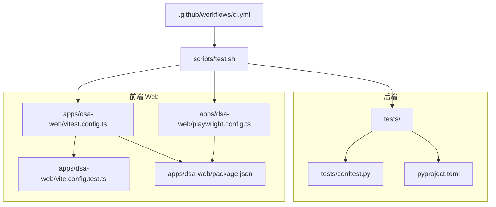
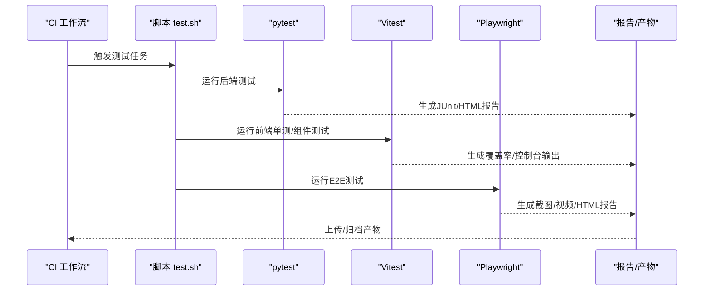
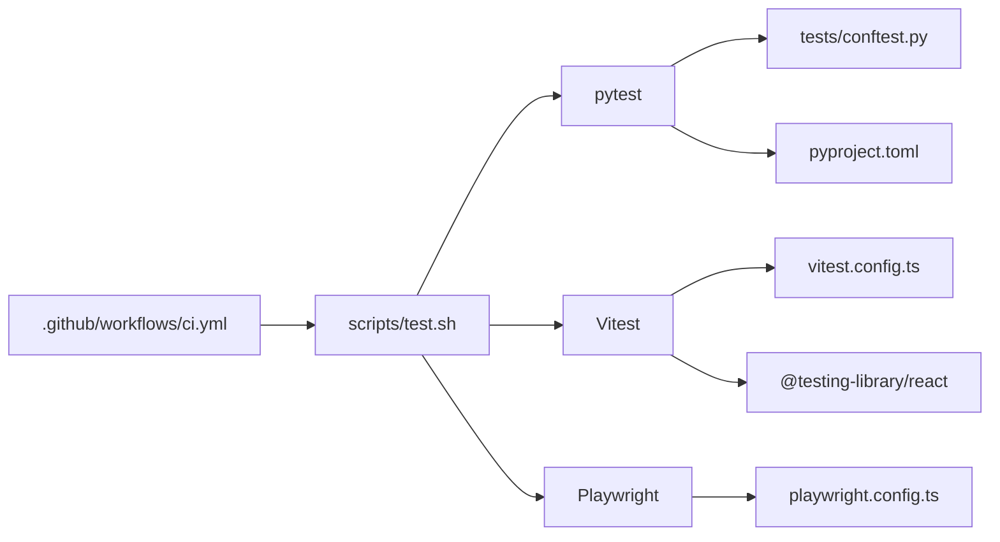

# 测试框架配置

<cite>
**本文引用的文件**   
- [tests/conftest.py](file://tests/conftest.py)
- [pyproject.toml](file://pyproject.toml)
- [apps/dsa-web/vitest.config.ts](file://apps/dsa-web/vitest.config.ts)
- [apps/dsa-web/vite.config.test.ts](file://apps/dsa-web/vite.config.test.ts)
- [apps/dsa-web/playwright.config.ts](file://apps/dsa-web/playwright.config.ts)
- [apps/dsa-web/package.json](file://apps/dsa-web/package.json)
- [scripts/test.sh](file://scripts/test.sh)
- [.github/workflows/ci.yml](file://.github/workflows/ci.yml)
</cite>

## 目录
1. [简介](#简介)
2. [项目结构](#项目结构)
3. [核心组件](#核心组件)
4. [架构总览](#架构总览)
5. [详细组件分析](#详细组件分析)
6. [依赖关系分析](#依赖关系分析)
7. [性能考量](#性能考量)
8. [故障排查指南](#故障排查指南)
9. [结论](#结论)
10. [附录](#附录)

## 简介
本文件面向Daily Stock Analysis项目的测试框架配置，覆盖后端pytest与前端Vitest、React Testing Library、Playwright的集成方式。重点说明：
- pytest全局fixture定义、测试环境设置与插件配置
- 前端单元测试（Vitest）与组件测试（React Testing Library）的配置要点
- 端到端测试（Playwright）的环境与浏览器配置
- 测试环境搭建：环境变量、数据库连接池、缓存服务Mock
- 测试数据管理策略：固定数据、工厂模式、随机数据生成
- 测试报告输出：HTML报告与CI/CD集成格式

## 项目结构
测试相关的关键位置：
- 后端测试：tests/ 目录包含pytest用例与conftest.py
- 前端测试：apps/dsa-web/ 下包含vitest、RTL、playwright配置与用例
- 脚本与CI：scripts/test.sh 统一入口；.github/workflows/ci.yml 用于CI执行

**图表来源** 
- [tests/conftest.py](file://tests/conftest.py)
- [pyproject.toml](file://pyproject.toml)
- [apps/dsa-web/vitest.config.ts](file://apps/dsa-web/vitest.config.ts)
- [apps/dsa-web/vite.config.test.ts](file://apps/dsa-web/vite.config.test.ts)
- [apps/dsa-web/playwright.config.ts](file://apps/dsa-web/playwright.config.ts)
- [apps/dsa-web/package.json](file://apps/dsa-web/package.json)
- [scripts/test.sh](file://scripts/test.sh)
- [.github/workflows/ci.yml](file://.github/workflows/ci.yml)

**章节来源**
- [tests/conftest.py](file://tests/conftest.py)
- [pyproject.toml](file://pyproject.toml)
- [apps/dsa-web/vitest.config.ts](file://apps/dsa-web/vitest.config.ts)
- [apps/dsa-web/vite.config.test.ts](file://apps/dsa-web/vite.config.test.ts)
- [apps/dsa-web/playwright.config.ts](file://apps/dsa-web/playwright.config.ts)
- [apps/dsa-web/package.json](file://apps/dsa-web/package.json)
- [scripts/test.sh](file://scripts/test.sh)
- [.github/workflows/ci.yml](file://.github/workflows/ci.yml)

## 核心组件
- pytest 配置与插件：通过 pyproject.toml 中的 [tool.pytest] 段集中管理参数、插件与日志级别
- conftest.py 全局fixture：提供应用上下文、客户端、数据库会话、缓存Mock等共享资源
- Vitest 配置：前端单元测试与组件测试运行器，支持TS、JSX、CSS模块与别名解析
- Playwright 配置：E2E测试浏览器实例、超时、截图/视频、并行度与Reporter
- 统一脚本与CI：scripts/test.sh 聚合命令；CI工作流触发并收集报告

**章节来源**
- [pyproject.toml](file://pyproject.toml)
- [tests/conftest.py](file://tests/conftest.py)
- [apps/dsa-web/vitest.config.ts](file://apps/dsa-web/vitest.config.ts)
- [apps/dsa-web/vite.config.test.ts](file://apps/dsa-web/vite.config.test.ts)
- [apps/dsa-web/playwright.config.ts](file://apps/dsa-web/playwright.config.ts)
- [scripts/test.sh](file://scripts/test.sh)
- [.github/workflows/ci.yml](file://.github/workflows/ci.yml)

## 架构总览
下图展示从CI到各层测试执行的调用链与产物输出。

**图表来源** 
- [.github/workflows/ci.yml](file://.github/workflows/ci.yml)
- [scripts/test.sh](file://scripts/test.sh)
- [pyproject.toml](file://pyproject.toml)
- [apps/dsa-web/vitest.config.ts](file://apps/dsa-web/vitest.config.ts)
- [apps/dsa-web/playwright.config.ts](file://apps/dsa-web/playwright.config.ts)

## 详细组件分析

### pytest 配置与全局Fixture
- 配置项集中在 pyproject.toml 的 [tool.pytest] 段，可设置：
  - 插件加载（如异步、覆盖率、xUnit风格报告）
  - 默认命令行参数（测试路径、日志级别、并行度）
  - 自定义标记与过滤规则
- tests/conftest.py 提供跨用例共享能力：
  - 应用上下文与测试客户端（FastAPI TestClient 或等效封装）
  - 数据库会话（SQLite内存库或测试专用PostgreSQL）
  - 缓存/外部服务Mock（Redis、HTTP客户端、LLM调用）
  - 事务回滚策略，保证用例隔离
- 建议：
  - 使用fixture作用域控制生命周期（function/session）
  - 对外部依赖一律Mock，避免网络IO
  - 将敏感配置通过环境变量注入，避免硬编码

**章节来源**
- [pyproject.toml](file://pyproject.toml)
- [tests/conftest.py](file://tests/conftest.py)

### 前端测试：Vitest + React Testing Library
- vitest.config.ts 定义：
  - 测试环境（jsdom）、匹配规则、别名映射
  - 覆盖率开关与阈值
  - 与vite.config.test.ts协同，复用构建配置
- React Testing Library：
  - 在setupTests.ts中初始化RTL与DOM Polyfill
  - 组件测试聚焦用户行为与可访问性断言
- 最佳实践：
  - 使用本地Mock替代真实API（msw或fetch拦截）
  - 对第三方UI库进行样式与动画Mock
  - 将耗时操作拆分为异步断言，避免竞态

**章节来源**
- [apps/dsa-web/vitest.config.ts](file://apps/dsa-web/vitest.config.ts)
- [apps/dsa-web/vite.config.test.ts](file://apps/dsa-web/vite.config.test.ts)
- [apps/dsa-web/package.json](file://apps/dsa-web/package.json)

### 端到端测试：Playwright
- playwright.config.ts 关键项：
  - 浏览器类型（chromium/firefox/webkit）与启动参数
  - 基址、超时、重试、截图/视频录制
  - Reporter（console/junit/html）与并行度
- E2E用例组织：
  - e2e/ 目录下按功能划分spec文件
  - 使用Page Object或步骤封装提升可读性
- 最佳实践：
  - 为每个用例准备独立状态（登录态、数据快照）
  - 网络请求拦截与Mock，确保稳定性
  - 失败自动截图/录屏，便于定位问题

**章节来源**
- [apps/dsa-web/playwright.config.ts](file://apps/dsa-web/playwright.config.ts)
- [apps/dsa-web/package.json](file://apps/dsa-web/package.json)

### 测试环境搭建
- 环境变量：
  - 后端：数据库URL、缓存地址、第三方API密钥、日志级别
  - 前端：VITE_ 前缀变量用于构建期注入
- 数据库连接池：
  - 测试库建议使用内存库或最小化连接池
  - 通过fixture在每个用例前后创建/清理数据
- 缓存服务Mock：
  - Redis/HTTP客户端通过依赖注入替换为内存实现
  - 对LLM/搜索等慢依赖统一Mock响应

**章节来源**
- [tests/conftest.py](file://tests/conftest.py)
- [apps/dsa-web/vitest.config.ts](file://apps/dsa-web/vitest.config.ts)
- [apps/dsa-web/playwright.config.ts](file://apps/dsa-web/playwright.config.ts)

### 测试数据管理策略
- 固定测试数据：
  - fixtures/ 目录存放JSON/CSV种子数据
  - 适用于稳定断言与回归用例
- 工厂模式：
  - 使用factory类或函数按需构造对象
  - 支持字段组合与派生属性
- 随机数据生成：
  - 使用faker或内置生成器
  - 注意唯一性与边界值覆盖

**章节来源**
- [tests/conftest.py](file://tests/conftest.py)

### 测试报告与CI/CD集成
- 报告格式：
  - JUnit XML：CI可视化与趋势图
  - HTML报告：本地调试与归档
  - 覆盖率：前端Vitest覆盖率、后端pytest-cov
- CI集成：
  - .github/workflows/ci.yml 定义多阶段任务
  - 并行执行后端与前端测试，汇总产物
  - 失败时保留截图/视频与日志

**章节来源**
- [scripts/test.sh](file://scripts/test.sh)
- [.github/workflows/ci.yml](file://.github/workflows/ci.yml)
- [pyproject.toml](file://pyproject.toml)
- [apps/dsa-web/vitest.config.ts](file://apps/dsa-web/vitest.config.ts)
- [apps/dsa-web/playwright.config.ts](file://apps/dsa-web/playwright.config.ts)

## 依赖关系分析
- 后端测试依赖：
  - pytest及其插件（异步、覆盖率、报告）
  - FastAPI测试客户端、SQLAlchemy测试会话
  - Mock库（httpx、redis、llm适配器）
- 前端测试依赖：
  - vitest、@testing-library/react、jest-dom、msw
  - vite构建工具链与TS支持
- E2E依赖：
  - playwright、浏览器二进制、Reporter

**图表来源** 
- [tests/conftest.py](file://tests/conftest.py)
- [pyproject.toml](file://pyproject.toml)
- [apps/dsa-web/vitest.config.ts](file://apps/dsa-web/vitest.config.ts)
- [apps/dsa-web/playwright.config.ts](file://apps/dsa-web/playwright.config.ts)
- [scripts/test.sh](file://scripts/test.sh)
- [.github/workflows/ci.yml](file://.github/workflows/ci.yml)

**章节来源**
- [tests/conftest.py](file://tests/conftest.py)
- [pyproject.toml](file://pyproject.toml)
- [apps/dsa-web/vitest.config.ts](file://apps/dsa-web/vitest.config.ts)
- [apps/dsa-web/playwright.config.ts](file://apps/dsa-web/playwright.config.ts)
- [scripts/test.sh](file://scripts/test.sh)
- [.github/workflows/ci.yml](file://.github/workflows/ci.yml)

## 性能考量
- 并行执行：
  - pytest-xdist 并行后端用例
  - Playwright worker并行E2E用例
- I/O优化：
  - 数据库连接池大小限制，避免阻塞
  - 缓存Mock减少网络延迟
- 资源隔离：
  - 每个测试进程独立环境，避免共享状态
- 报告与产物：
  - 仅启用必要Reporter，降低I/O开销

[本节为通用指导，不直接分析具体文件]

## 故障排查指南
- 常见问题：
  - 环境变量缺失导致配置加载失败
  - 数据库连接超时或端口占用
  - 浏览器未安装或版本不匹配
  - 覆盖率阈值过高导致CI失败
- 定位方法：
  - 查看pytest日志与JUnit报告
  - 检查Playwright截图/视频与trace
  - 使用Vitest --reporter=verbose输出详细堆栈
- 修复建议：
  - 校验.env与CI Secrets
  - 重置数据库与缓存服务
  - 更新浏览器驱动与依赖

**章节来源**
- [tests/conftest.py](file://tests/conftest.py)
- [apps/dsa-web/playwright.config.ts](file://apps/dsa-web/playwright.config.ts)
- [apps/dsa-web/vitest.config.ts](file://apps/dsa-web/vitest.config.ts)
- [scripts/test.sh](file://scripts/test.sh)
- [.github/workflows/ci.yml](file://.github/workflows/ci.yml)

## 结论
通过统一的pytest/Vitest/Playwright配置与CI集成，Daily Stock Analysis实现了后端、前端与E2E的全链路测试闭环。借助conftest全局fixture与环境隔离，保证了测试的稳定性和可维护性。建议在持续演进中完善Mock策略、强化数据工厂与报告体系，进一步提升反馈速度与质量保障能力。

[本节为总结，不直接分析具体文件]

## 附录
- 快速开始：
  - 后端：运行scripts/test.sh的后端部分或直接调用pytest
  - 前端：进入apps/dsa-web执行Vitest命令
  - E2E：安装浏览器后运行Playwright测试
- 常用命令：
  - 生成覆盖率：pytest --cov / vitest --coverage
  - 生成HTML报告：pytest --html / playwright show-report
  - 并行执行：pytest -n auto / playwright --workers

[本节为操作指引，不直接分析具体文件]