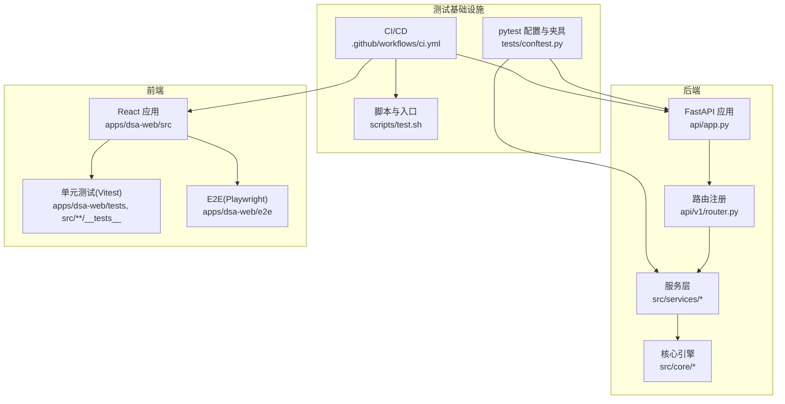
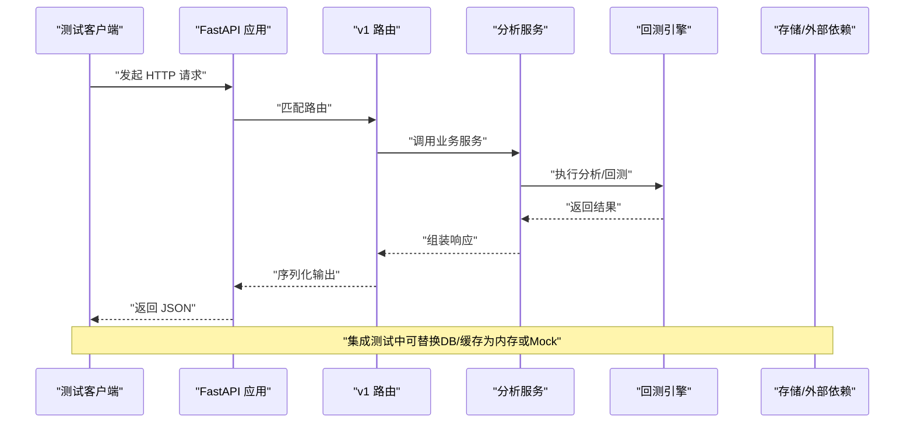
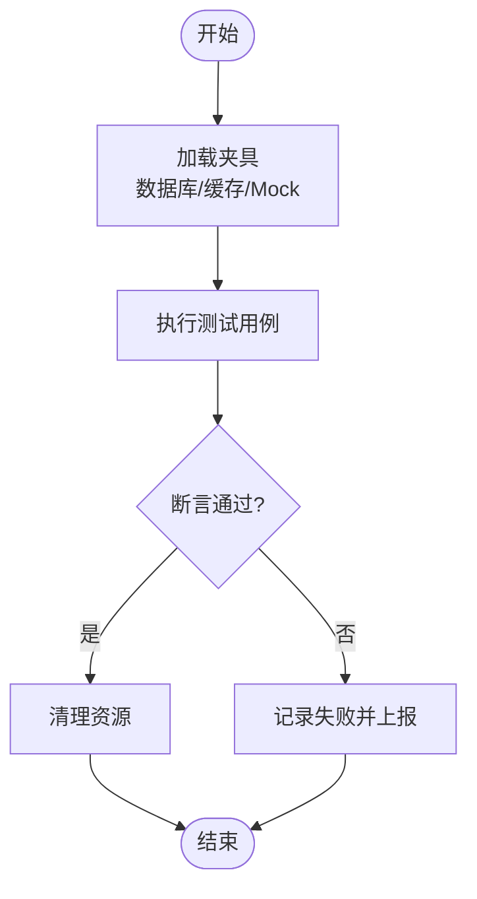
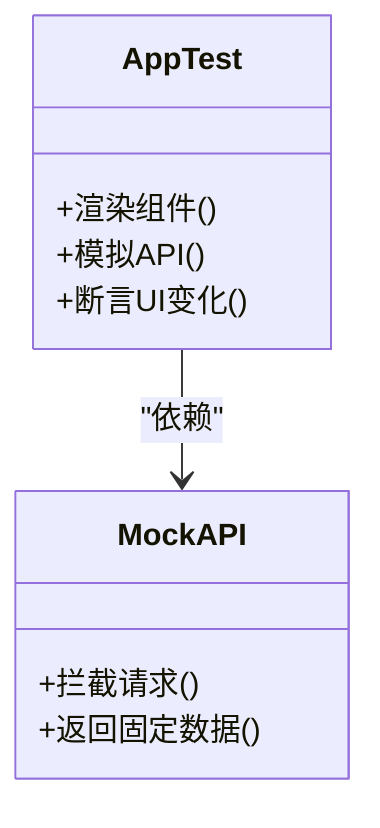
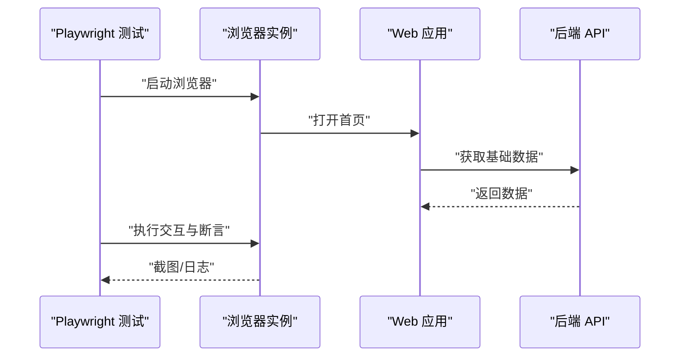
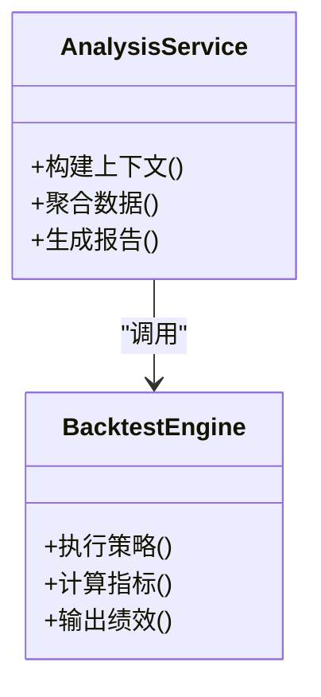
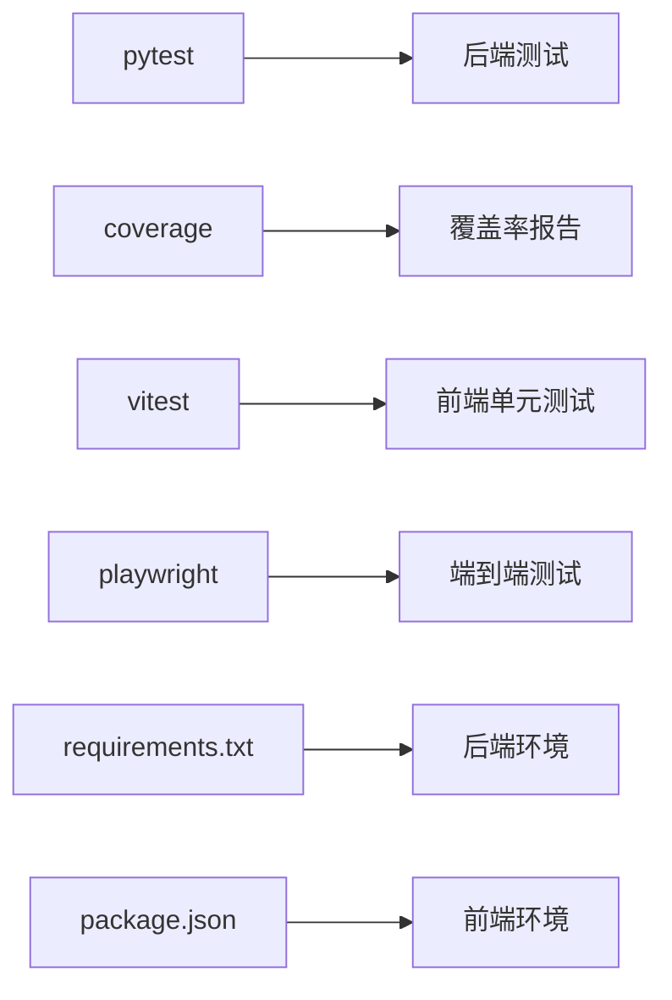

# 测试策略

<cite>
**本文引用的文件**   
- [tests/conftest.py](file://tests/conftest.py)
- [api/app.py](file://api/app.py)
- [api/v1/router.py](file://api/v1/router.py)
- [src/services/analysis_service.py](file://src/services/analysis_service.py)
- [src/core/backtest_engine.py](file://src/core/backtest_engine.py)
- [apps/dsa-web/package.json](file://apps/dsa-web/package.json)
- [apps/dsa-web/vitest.config.ts](file://apps/dsa-web/vitest.config.ts)
- [apps/dsa-web/playwright.config.ts](file://apps/dsa-web/playwright.config.ts)
- [apps/dsa-web/src/App.test.tsx](file://apps/dsa-web/src/App.test.tsx)
- [apps/dsa-web/e2e/smoke.spec.ts](file://apps/dsa-web/e2e/smoke.spec.ts)
- [scripts/test.sh](file://scripts/test.sh)
- [.github/workflows/ci.yml](file://.github/workflows/ci.yml)
- [pyproject.toml](file://pyproject.toml)
- [requirements.txt](file://requirements.txt)
</cite>

## 目录
1. [简介](#简介)
2. [项目结构](#项目结构)
3. [核心组件](#核心组件)
4. [架构总览](#架构总览)
5. [详细组件分析](#详细组件分析)
6. [依赖分析](#依赖分析)
7. [性能考虑](#性能考虑)
8. [故障排查指南](#故障排查指南)
9. [结论](#结论)
10. [附录](#附录)

## 简介
本文件为 Daily Stock Analysis 项目的测试策略文档，围绕“测试金字塔”构建与落地展开，覆盖单元测试、集成测试、端到端测试的分层策略与覆盖率要求；说明测试框架选型与配置（pytest、Vitest、Playwright），Mock 对象与测试数据管理方法；描述自动化测试流程（CI/CD 集成、测试环境搭建、测试结果报告）；给出前端测试实施（React 组件测试、API Mock、浏览器自动化）；并提供性能与负载测试方法与基准建立。同时总结测试最佳实践（命名规范、断言策略、数据隔离等）。

## 项目结构
本项目采用前后端分离的架构：后端基于 Python + FastAPI，前端基于 React + Vite，桌面端基于 Electron。测试分布在多个层级：
- 后端单元测试与集成测试位于 tests 目录，使用 pytest 组织用例与夹具。
- 前端单元测试与组件测试位于 apps/dsa-web 下，使用 Vitest 与 React Testing Library。
- 端到端测试位于 apps/dsa-web/e2e，使用 Playwright。
- CI/CD 通过 GitHub Actions 编排，脚本集中在 scripts 与 .github/workflows。

**图表来源** 
- [api/app.py](file://api/app.py)
- [api/v1/router.py](file://api/v1/router.py)
- [src/services/analysis_service.py](file://src/services/analysis_service.py)
- [src/core/backtest_engine.py](file://src/core/backtest_engine.py)
- [apps/dsa-web/src/App.test.tsx](file://apps/dsa-web/src/App.test.tsx)
- [apps/dsa-web/e2e/smoke.spec.ts](file://apps/dsa-web/e2e/smoke.spec.ts)
- [tests/conftest.py](file://tests/conftest.py)
- [.github/workflows/ci.yml](file://.github/workflows/ci.yml)
- [scripts/test.sh](file://scripts/test.sh)

**章节来源**
- [tests/conftest.py](file://tests/conftest.py)
- [api/app.py](file://api/app.py)
- [api/v1/router.py](file://api/v1/router.py)
- [apps/dsa-web/package.json](file://apps/dsa-web/package.json)
- [apps/dsa-web/vitest.config.ts](file://apps/dsa-web/vitest.config.ts)
- [apps/dsa-web/playwright.config.ts](file://apps/dsa-web/playwright.config.ts)
- [scripts/test.sh](file://scripts/test.sh)
- [.github/workflows/ci.yml](file://.github/workflows/ci.yml)

## 核心组件
- 测试运行器与配置
  - 后端：pytest 作为统一测试运行器，conftest.py 提供全局夹具、数据库/外部依赖隔离、HTTP 客户端初始化等。
  - 前端：Vitest 用于单元与组件测试，playwright.config.ts 定义 E2E 环境与浏览器实例。
- 测试分层
  - 单元测试：针对纯函数、工具类、算法逻辑，快速、无 IO。
  - 集成测试：验证服务层与仓储、API 路由、消息队列、缓存等交互。
  - 端到端测试：模拟真实用户操作，覆盖关键业务流程。
- 覆盖率目标
  - 建议后端核心模块行覆盖率≥80%，分支覆盖率≥70%；前端组件覆盖率≥70%；E2E 不纳入覆盖率统计但需覆盖关键路径。

**章节来源**
- [tests/conftest.py](file://tests/conftest.py)
- [apps/dsa-web/vitest.config.ts](file://apps/dsa-web/vitest.config.ts)
- [apps/dsa-web/playwright.config.ts](file://apps/dsa-web/playwright.config.ts)

## 架构总览
下图展示从请求到响应的主要测试关注点与分层位置：

**图表来源** 
- [api/app.py](file://api/app.py)
- [api/v1/router.py](file://api/v1/router.py)
- [src/services/analysis_service.py](file://src/services/analysis_service.py)
- [src/core/backtest_engine.py](file://src/core/backtest_engine.py)

## 详细组件分析

### 后端测试：pytest 与夹具体系
- 夹具与隔离
  - conftest.py 集中管理测试夹具，如数据库连接、Redis、HTTP 客户端、Mock 外部服务。
  - 通过参数化与上下文管理器实现测试数据隔离，确保用例间互不影响。
- 单元测试
  - 针对 utils、schemas、core 中的纯函数与算法进行断言，强调边界条件与异常路径。
- 集成测试
  - 使用 TestClient 启动 FastAPI 应用，注入依赖替换（如仓储、LLM 适配器、数据源），验证接口契约与错误码。
- 覆盖率
  - 结合 coverage 插件生成报告，按模块设定阈值，未达标阻断 CI。

**图表来源** 
- [tests/conftest.py](file://tests/conftest.py)

**章节来源**
- [tests/conftest.py](file://tests/conftest.py)
- [pyproject.toml](file://pyproject.toml)
- [requirements.txt](file://requirements.txt)

### 前端测试：Vitest + React Testing Library
- 组件测试
  - 使用 Vitest 运行测试，React Testing Library 渲染组件并进行交互与断言。
  - 对 UI 行为、状态更新、副作用（如网络请求）进行隔离与 Mock。
- API Mock
  - 通过 vitest.mock 或 MSW（若引入）拦截 fetch/axios 请求，返回稳定数据。
- 配置要点
  - vitest.config.ts 设置测试环境、别名、覆盖率收集范围。
  - setupTests.ts 初始化全局 Mock 与 polyfill。

**图表来源** 
- [apps/dsa-web/src/App.test.tsx](file://apps/dsa-web/src/App.test.tsx)
- [apps/dsa-web/vitest.config.ts](file://apps/dsa-web/vitest.config.ts)

**章节来源**
- [apps/dsa-web/package.json](file://apps/dsa-web/package.json)
- [apps/dsa-web/vitest.config.ts](file://apps/dsa-web/vitest.config.ts)
- [apps/dsa-web/src/App.test.tsx](file://apps/dsa-web/src/App.test.tsx)

### 端到端测试：Playwright
- 场景设计
  - smoke.spec.ts 覆盖登录、首页加载、关键页面导航与基本交互。
- 环境配置
  - playwright.config.ts 指定浏览器、基地址、超时、截图与视频录制。
- 数据准备
  - 通过预置账号与测试数据，避免依赖外部系统。

**图表来源** 
- [apps/dsa-web/e2e/smoke.spec.ts](file://apps/dsa-web/e2e/smoke.spec.ts)
- [apps/dsa-web/playwright.config.ts](file://apps/dsa-web/playwright.config.ts)

**章节来源**
- [apps/dsa-web/e2e/smoke.spec.ts](file://apps/dsa-web/e2e/smoke.spec.ts)
- [apps/dsa-web/playwright.config.ts](file://apps/dsa-web/playwright.config.ts)

### 核心服务与引擎测试
- 分析服务
  - 验证输入校验、上下文构建、多数据源聚合与异常降级。
- 回测引擎
  - 验证策略执行、指标计算、订单模拟与绩效统计。

**图表来源** 
- [src/services/analysis_service.py](file://src/services/analysis_service.py)
- [src/core/backtest_engine.py](file://src/core/backtest_engine.py)

**章节来源**
- [src/services/analysis_service.py](file://src/services/analysis_service.py)
- [src/core/backtest_engine.py](file://src/core/backtest_engine.py)

## 依赖分析
- 测试依赖
  - 后端：pytest、coverage、httpx/TestClient、mock 库等。
  - 前端：vitest、@testing-library/react、playwright。
- 版本与锁定
  - requirements.txt 与 package.json 锁定依赖版本，保证环境一致性。
- 外部依赖隔离
  - 通过 conftest 与 vitest mock 屏蔽第三方服务（数据库、缓存、LLM、行情源）。

**图表来源** 
- [requirements.txt](file://requirements.txt)
- [apps/dsa-web/package.json](file://apps/dsa-web/package.json)

**章节来源**
- [requirements.txt](file://requirements.txt)
- [apps/dsa-web/package.json](file://apps/dsa-web/package.json)

## 性能考虑
- 基准与压力测试
  - 后端：使用 locust 或 k6 对关键接口进行压测，建立 QPS、延迟、错误率基线。
  - 前端：使用 Lighthouse 与 WebPageTest 评估首屏时间、可交互时间与资源体积。
- 测试优化
  - 并行执行：pytest-xdist、Vitest 多线程模式。
  - 数据预热：缓存热点数据，减少 IO 抖动。
  - 资源限制：限制并发与超时，避免 CI 资源耗尽。

[本节为通用指导，无需引用具体文件]

## 故障排查指南
- 常见问题
  - 端口冲突：检查本地服务占用，调整端口或关闭冲突进程。
  - 环境变量缺失：确认 .env 或 CI 变量注入完整。
  - 外部依赖不可达：在测试中启用 Mock 或切换至沙箱环境。
- 定位手段
  - 增加日志级别与调试输出。
  - 使用覆盖率与失败用例快照辅助定位。
  - 回放 E2E 视频与截图。

**章节来源**
- [scripts/test.sh](file://scripts/test.sh)
- [.github/workflows/ci.yml](file://.github/workflows/ci.yml)

## 结论
通过 pytest、Vitest、Playwright 的分层测试体系，配合严格的覆盖率与 CI 门禁，Daily Stock Analysis 能够在快速反馈与质量保障之间取得平衡。建议在后续迭代中持续完善核心模块的单元测试覆盖率，扩展 E2E 关键路径，并引入性能基准监控，以支撑长期稳定性与演进速度。

[本节为总结性内容，无需引用具体文件]

## 附录
- 测试命令参考
  - 后端：pytest 运行、覆盖率生成、筛选特定标记用例。
  - 前端：vitest 运行与覆盖率、playwright 运行 E2E。
- 覆盖率阈值
  - 在 pyproject.toml 或 vite.config 中配置阈值，未达标则失败。
- 最佳实践
  - 命名规范：test_前缀、清晰描述预期行为。
  - 断言策略：优先断言可见结果与状态，避免实现细节。
  - 数据隔离：每个用例独立数据，避免共享状态。

**章节来源**
- [pyproject.toml](file://pyproject.toml)
- [apps/dsa-web/vitest.config.ts](file://apps/dsa-web/vitest.config.ts)
- [scripts/test.sh](file://scripts/test.sh)