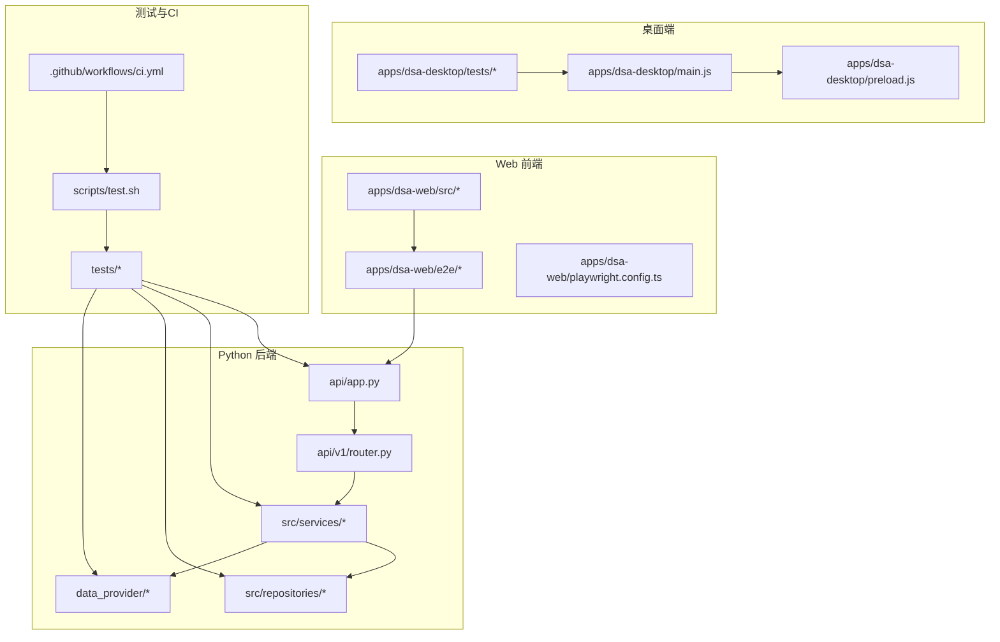
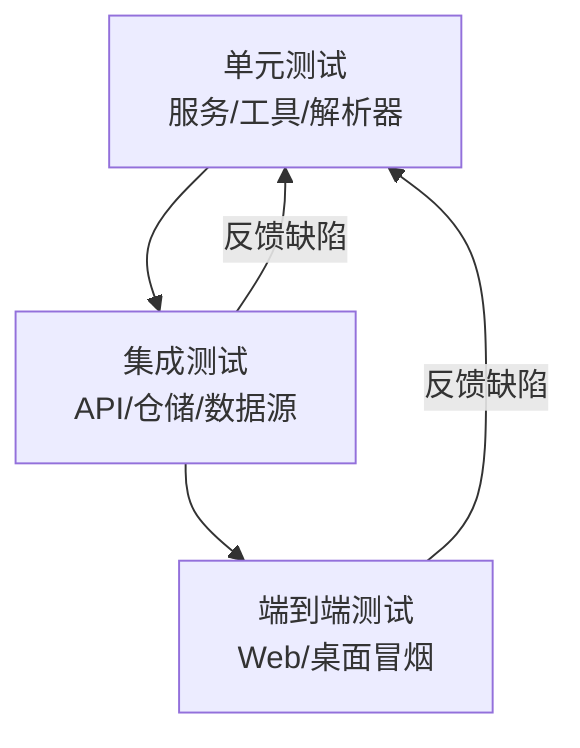
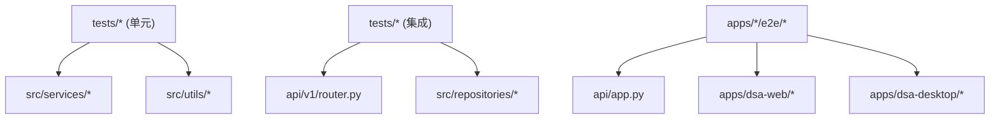

# 测试金字塔

<cite>
**本文引用的文件**   
- [tests/conftest.py](file://tests/conftest.py)
- [pyproject.toml](file://pyproject.toml)
- [scripts/test.sh](file://scripts/test.sh)
- [.github/workflows/ci.yml](file://.github/workflows/ci.yml)
- [api/app.py](file://api/app.py)
- [api/v1/router.py](file://api/v1/router.py)
- [src/services/analysis_service.py](file://src/services/analysis_service.py)
- [src/repositories/analysis_repo.py](file://src/repositories/analysis_repo.py)
- [data_provider/base.py](file://data_provider/base.py)
- [apps/dsa-web/playwright.config.ts](file://apps/dsa-web/playwright.config.ts)
- [apps/dsa-web/e2e/smoke.spec.ts](file://apps/dsa-web/e2e/smoke.spec.ts)
- [apps/dsa-desktop/tests/main.test.js](file://apps/dsa-desktop/tests/main.test.js)
- [tests/test_analysis_api_contract.py](file://tests/test_analysis_api_contract.py)
- [tests/test_daily_market_context.py](file://tests/test_daily_market_context.py)
- [tests/test_pipeline_daily_market_context.py](file://tests/test_pipeline_daily_market_context.py)
- [tests/test_stock_analyzer_rsi.py](file://tests/test_stock_analyzer_rsi.py)
- [tests/test_backtest_engine.py](file://tests/test_backtest_engine.py)
</cite>

## 目录
1. [简介](#简介)
2. [项目结构](#项目结构)
3. [核心组件](#核心组件)
4. [架构总览](#架构总览)
5. [详细组件分析](#详细组件分析)
6. [依赖分析](#依赖分析)
7. [性能考虑](#性能考虑)
8. [故障排查指南](#故障排查指南)
9. [结论](#结论)
10. [附录](#附录)

## 简介
本文件为 Daily Stock Analysis 项目的“测试金字塔”文档，聚焦单元测试、集成测试与端到端测试的分层策略与职责划分。内容涵盖：
- 各层测试的目标、范围与覆盖率要求
- 测试数据隔离与管理（含测试数据库与清理机制）
- Mock/Stub 的使用场景（外部 API、数据库、文件系统）
- 测试优先级、执行顺序与性能优化建议
- 高质量测试用例的编写实践与示例路径

## 项目结构
Daily Stock Analysis 采用多语言、多子工程组织方式：
- Python 后端与核心逻辑位于根目录与 src/ 下，测试集中在 tests/
- Web 前端位于 apps/dsa-web，使用 Playwright 进行 E2E 测试
- Desktop 应用位于 apps/dsa-desktop，包含主进程与预加载脚本的测试
- CI/CD 与脚本位于 .github/workflows 与 scripts/

图表来源
- [api/app.py](file://api/app.py)
- [api/v1/router.py](file://api/v1/router.py)
- [src/services/analysis_service.py](file://src/services/analysis_service.py)
- [src/repositories/analysis_repo.py](file://src/repositories/analysis_repo.py)
- [data_provider/base.py](file://data_provider/base.py)
- [apps/dsa-web/playwright.config.ts](file://apps/dsa-web/playwright.config.ts)
- [apps/dsa-web/e2e/smoke.spec.ts](file://apps/dsa-web/e2e/smoke.spec.ts)
- [apps/dsa-desktop/tests/main.test.js](file://apps/dsa-desktop/tests/main.test.js)
- [scripts/test.sh](file://scripts/test.sh)
- [.github/workflows/ci.yml](file://.github/workflows/ci.yml)

章节来源
- [pyproject.toml](file://pyproject.toml)
- [scripts/test.sh](file://scripts/test.sh)
- [.github/workflows/ci.yml](file://.github/workflows/ci.yml)

## 核心组件
- 测试配置与夹具
  - pytest 夹具与全局设置集中于 tests/conftest.py，提供统一的测试环境初始化、Mock 注入与资源清理
  - pyproject.toml 中定义测试框架、插件与覆盖率工具的配置入口
- 测试运行与流水线
  - scripts/test.sh 封装本地与 CI 的测试执行命令，支持按层级筛选（单元/集成/E2E）
  - .github/workflows/ci.yml 定义 CI 中的测试阶段、缓存与并行策略
- 分层测试覆盖
  - 单元测试：针对服务层、工具函数、解析器与算法模块
  - 集成测试：API 契约、仓储与数据提供者、跨模块协作
  - 端到端测试：Web 与桌面应用的冒烟与关键流程验证

章节来源
- [tests/conftest.py](file://tests/conftest.py)
- [pyproject.toml](file://pyproject.toml)
- [scripts/test.sh](file://scripts/test.sh)
- [.github/workflows/ci.yml](file://.github/workflows/ci.yml)

## 架构总览
测试金字塔由三层构成，自底向上稳定性递减、成本递增、覆盖面收窄：
- 单元测试（底层，数量最多）：快速、稳定、高覆盖率，重点保障核心业务逻辑与边界条件
- 集成测试（中层）：验证模块间协作、API 契约、数据流与外部依赖交互（通过 Mock/Stub）
- 端到端测试（顶层，数量最少）：真实浏览器或桌面环境，验证用户关键路径与回归风险

[此图为概念性流程图，不直接映射具体源码文件]

## 详细组件分析

### 单元测试：策略与最佳实践
- 目标与范围
  - 覆盖核心业务逻辑（如分析服务、指标计算、策略路由、市场上下文构建）
  - 覆盖边界与异常分支（空输入、非法参数、网络超时、数据缺失）
- 覆盖率要求
  - 核心服务与工具函数：行覆盖率 ≥ 90%，分支覆盖率 ≥ 80%
  - 非核心辅助模块：行覆盖率 ≥ 70%
- 数据隔离
  - 使用内存数据库或临时目录；每个测试用例独立夹具，确保无副作用
- Mock/Stub 使用
  - 外部 API：使用 requests 或 httpx 的响应模拟，避免真实网络调用
  - 数据库：使用内存 SQLite 或 SQLAlchemy 的 in-memory 模式
  - 文件系统：使用临时目录与固定 fixture 数据
- 示例参考路径
  - [tests/test_stock_analyzer_rsi.py](file://tests/test_stock_analyzer_rsi.py)
  - [tests/test_backtest_engine.py](file://tests/test_backtest_engine.py)
  - [tests/test_daily_market_context.py](file://tests/test_daily_market_context.py)

章节来源
- [tests/test_stock_analyzer_rsi.py](file://tests/test_stock_analyzer_rsi.py)
- [tests/test_backtest_engine.py](file://tests/test_backtest_engine.py)
- [tests/test_daily_market_context.py](file://tests/test_daily_market_context.py)

### 集成测试：策略与最佳实践
- 目标与范围
  - 验证 API 契约（请求/响应结构、状态码、错误处理）
  - 验证仓储与数据提供者协作（fetcher 路由、适配器、缓存）
  - 验证跨服务编排（分析服务、通知、任务队列）
- 覆盖率要求
  - API 契约与关键路径：行覆盖率 ≥ 85%
  - 仓储与 fetcher 适配层：行覆盖率 ≥ 80%
- 数据隔离
  - 使用事务回滚或一次性 fixture 数据；测试后清理
- Mock/Stub 使用
  - 外部数据源：基于 data_provider/base.py 的抽象接口进行替换
  - 第三方服务：使用本地 stub 或离线响应集
- 示例参考路径
  - [tests/test_analysis_api_contract.py](file://tests/test_analysis_api_contract.py)
  - [tests/test_pipeline_daily_market_context.py](file://tests/test_pipeline_daily_market_context.py)

章节来源
- [tests/test_analysis_api_contract.py](file://tests/test_analysis_api_contract.py)
- [tests/test_pipeline_daily_market_context.py](file://tests/test_pipeline_daily_market_context.py)

### 端到端测试：策略与最佳实践
- 目标与范围
  - Web 应用冒烟测试（登录、首页加载、关键页面导航）
  - 桌面应用主进程与预加载脚本基本功能验证
- 覆盖率要求
  - 关键用户路径：100% 覆盖（登录、搜索、报告生成）
  - 非关键 UI：以回归为主，不追求逐行覆盖
- 数据隔离
  - 使用独立测试账号与环境变量；每次运行前重置状态
- 示例参考路径
  - [apps/dsa-web/playwright.config.ts](file://apps/dsa-web/playwright.config.ts)
  - [apps/dsa-web/e2e/smoke.spec.ts](file://apps/dsa-web/e2e/smoke.spec.ts)
  - [apps/dsa-desktop/tests/main.test.js](file://apps/dsa-desktop/tests/main.test.js)

章节来源
- [apps/dsa-web/playwright.config.ts](file://apps/dsa-web/playwright.config.ts)
- [apps/dsa-web/e2e/smoke.spec.ts](file://apps/dsa-web/e2e/smoke.spec.ts)
- [apps/dsa-desktop/tests/main.test.js](file://apps/dsa-desktop/tests/main.test.js)

### 测试数据隔离与管理
- 测试数据库
  - 使用内存数据库或临时 SQLite 文件，每个测试会话独立实例
  - 通过 fixtures 预置种子数据，并在 teardown 中清理
- 文件系统
  - 使用临时目录与固定 fixture 文件，避免污染宿主环境
- 外部依赖
  - 通过环境变量切换为测试模式，禁用真实网络与写入操作
- 清理机制
  - 使用 pytest 的 fixture 作用域控制生命周期，确保幂等与可重复

章节来源
- [tests/conftest.py](file://tests/conftest.py)

### Mock 与 Stub 使用场景
- 外部 API 调用
  - 使用 responses/httpx 的响应模拟，覆盖成功、失败、超时与限流场景
- 数据库操作
  - 使用 SQLAlchemy 的 in-memory 模式或内存 ORM，避免持久化
- 文件系统
  - 使用 tempfile 与固定 fixture，保证确定性输出
- 数据提供者
  - 基于 data_provider/base.py 的抽象接口替换实现，统一 Mock 点

章节来源
- [data_provider/base.py](file://data_provider/base.py)

### 测试优先级、执行顺序与性能考虑
- 优先级
  - 先跑单元测试（快速反馈），再跑集成测试（稳定性校验），最后跑 E2E（回归验证）
- 执行顺序
  - 使用 pytest 的标记（@pytest.mark.unit/integration/e2e）分组执行
  - 在 CI 中并行执行单元与集成测试，串行执行 E2E
- 性能优化
  - 启用测试缓存（依赖包、浏览器二进制）
  - 减少 IO 与网络调用，优先使用内存与本地 fixture
  - 对长耗时测试进行分片与并行化

章节来源
- [scripts/test.sh](file://scripts/test.sh)
- [.github/workflows/ci.yml](file://.github/workflows/ci.yml)

### 高质量测试用例编写实践
- 命名规范
  - 文件名以 test_ 开头，方法名描述行为与预期结果
- 断言清晰
  - 明确断言状态码、数据结构与关键字段
- 数据驱动
  - 使用参数化测试覆盖多组输入与边界条件
- 可维护性
  - 抽取公共 fixture，避免重复代码
- 示例参考路径
  - [tests/test_analysis_api_contract.py](file://tests/test_analysis_api_contract.py)
  - [tests/test_pipeline_daily_market_context.py](file://tests/test_pipeline_daily_market_context.py)
  - [tests/test_stock_analyzer_rsi.py](file://tests/test_stock_analyzer_rsi.py)

章节来源
- [tests/test_analysis_api_contract.py](file://tests/test_analysis_api_contract.py)
- [tests/test_pipeline_daily_market_context.py](file://tests/test_pipeline_daily_market_context.py)
- [tests/test_stock_analyzer_rsi.py](file://tests/test_stock_analyzer_rsi.py)

## 依赖分析
测试依赖关系如下：
- 单元测试依赖服务与工具模块
- 集成测试依赖 API 路由、服务与仓储
- E2E 测试依赖 Web/桌面应用与后端服务

图表来源
- [api/app.py](file://api/app.py)
- [api/v1/router.py](file://api/v1/router.py)
- [src/services/analysis_service.py](file://src/services/analysis_service.py)
- [src/repositories/analysis_repo.py](file://src/repositories/analysis_repo.py)
- [apps/dsa-web/e2e/smoke.spec.ts](file://apps/dsa-web/e2e/smoke.spec.ts)
- [apps/dsa-desktop/tests/main.test.js](file://apps/dsa-desktop/tests/main.test.js)

章节来源
- [api/app.py](file://api/app.py)
- [api/v1/router.py](file://api/v1/router.py)
- [src/services/analysis_service.py](file://src/services/analysis_service.py)
- [src/repositories/analysis_repo.py](file://src/repositories/analysis_repo.py)

## 性能考虑
- 测试启动时间
  - 使用虚拟环境与依赖缓存，减少安装与导入开销
- 网络与 IO
  - 尽量使用内存与本地 fixture，避免真实网络与磁盘写入
- 并行与分片
  - 将单元与集成测试分片并行执行，E2E 串行执行以保证稳定性
- 覆盖率收集
  - 增量收集覆盖率，避免全量扫描带来的性能损耗

[本节为通用指导，不直接分析具体文件]

## 故障排查指南
- 常见问题
  - 测试数据污染：检查 fixture 作用域与清理逻辑
  - 外部依赖不稳定：确认 Mock/Stub 是否生效，环境变量是否正确
  - E2E 失败：检查浏览器版本、端口占用与服务启动顺序
- 调试技巧
  - 使用 pytest 的 -v 与 --tb=short 定位问题
  - 在 CI 中保留日志与截图，便于复现
- 参考路径
  - [tests/conftest.py](file://tests/conftest.py)
  - [scripts/test.sh](file://scripts/test.sh)

章节来源
- [tests/conftest.py](file://tests/conftest.py)
- [scripts/test.sh](file://scripts/test.sh)

## 结论
Daily Stock Analysis 的测试金字塔通过清晰的层次划分与严格的覆盖率要求，确保了核心业务逻辑的稳定性与可维护性。结合完善的 Mock/Stub 策略与数据隔离机制，测试能够在快速反馈的同时有效捕获回归问题。建议在持续集成中保持分层执行的顺序与并行策略，进一步提升开发效率与质量保障能力。

[本节为总结性内容，不直接分析具体文件]

## 附录
- 覆盖率阈值建议
  - 核心服务与工具：≥ 90% 行覆盖率，≥ 80% 分支覆盖率
  - API 契约与仓储：≥ 85% 行覆盖率
  - E2E：关键路径 100% 覆盖
- 常用命令
  - 运行全部测试：见 scripts/test.sh
  - 仅运行单元/集成/E2E：使用 pytest 标记过滤
  - 生成覆盖率报告：使用覆盖率工具并查看 HTML 报告

[本节为补充信息，不直接分析具体文件]