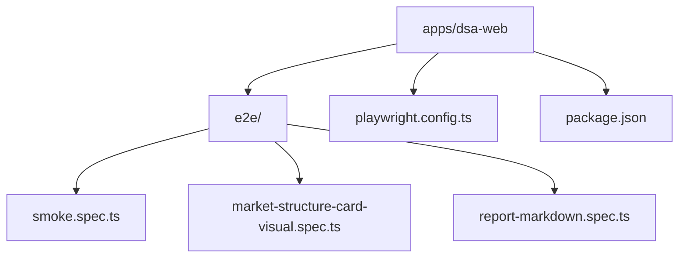
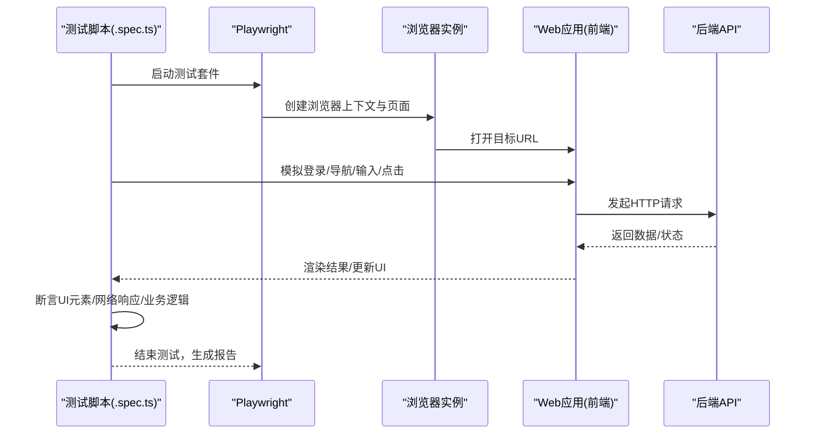
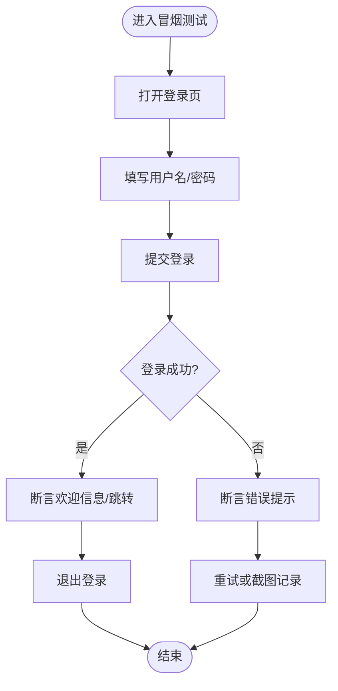
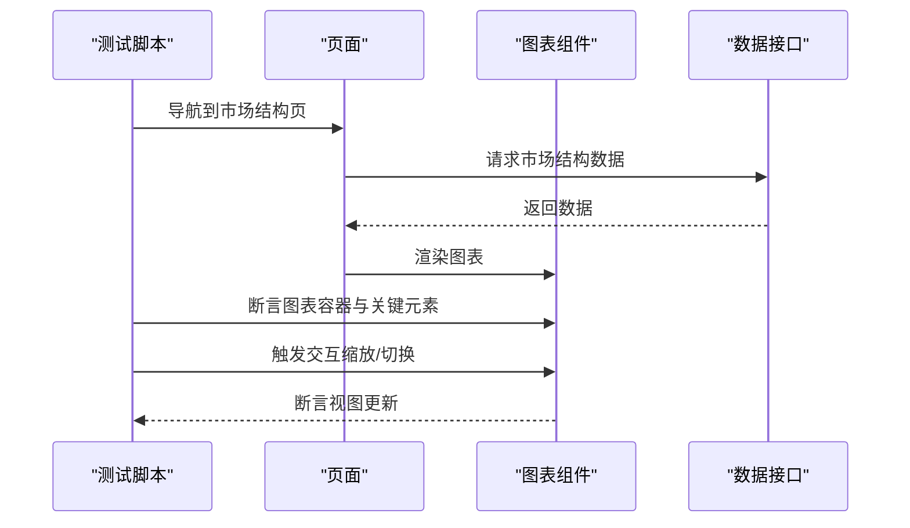
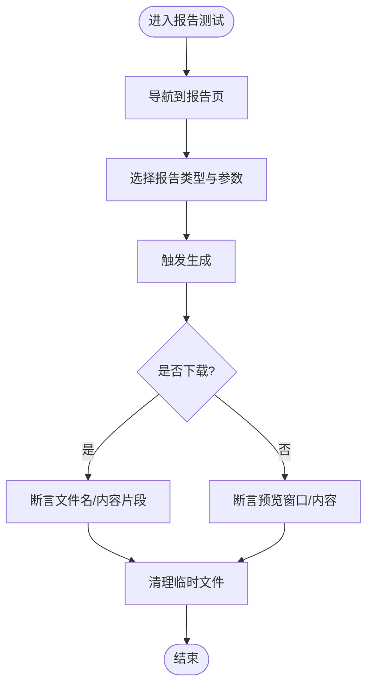
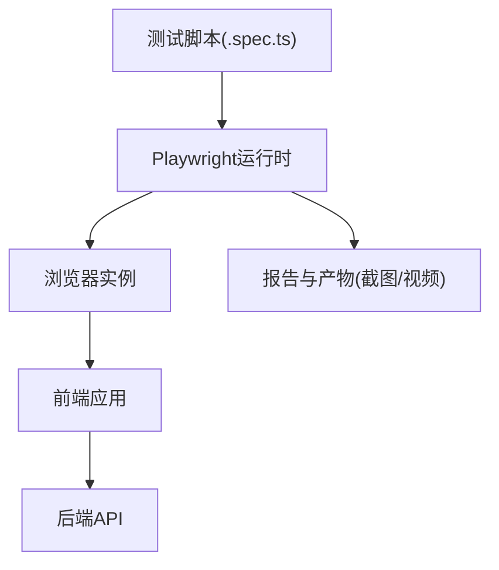

# 端到端测试

<cite>
**本文档引用的文件**   
- [apps/dsa-web/e2e/smoke.spec.ts](file://apps/dsa-web/e2e/smoke.spec.ts)
- [apps/dsa-web/e2e/market-structure-card-visual.spec.ts](file://apps/dsa-web/e2e/market-structure-card-visual.spec.ts)
- [apps/dsa-web/e2e/report-markdown.spec.ts](file://apps/dsa-web/e2e/report-markdown.spec.ts)
- [apps/dsa-web/playwright.config.ts](file://apps/dsa-web/playwright.config.ts)
- [apps/dsa-web/package.json](file://apps/dsa-web/package.json)
</cite>

## 目录
1. [简介](#简介)
2. [项目结构](#项目结构)
3. [核心组件](#核心组件)
4. [架构总览](#架构总览)
5. [详细组件分析](#详细组件分析)
6. [依赖分析](#依赖分析)
7. [性能考虑](#性能考虑)
8. [故障排查指南](#故障排查指南)
9. [结论](#结论)
10. [附录](#附录)

## 简介
本文件面向Daily Stock Analysis项目的端到端（E2E）测试，聚焦基于Playwright的浏览器自动化实现。文档涵盖页面导航、用户交互模拟与数据验证方法；阐述测试场景设计原则（关键流程覆盖、边界情况处理、异常路径验证）；说明测试数据的准备与管理（账户创建、初始数据加载、清理策略）；提供跨浏览器兼容性配置与执行方式；并给出报告生成与分析（截图、视频录制、失败调试信息）。最后通过具体用例示例展示如何模拟真实用户操作流程并验证系统行为。

## 项目结构
Web端的E2E测试位于apps/dsa-web/e2e目录，包含若干.spec.ts测试文件；Playwright配置文件位于apps/dsa-web/playwright.config.ts；包管理与脚本入口在apps/dsa-web/package.json中。整体结构如下：
- e2e目录：存放以.spec.ts为后缀的Playwright测试用例
- playwright.config.ts：定义浏览器、超时、重试、并行度、报告输出等全局配置
- package.json：声明playwright依赖及运行脚本（如test:e2e）

图表来源
- [apps/dsa-web/e2e/smoke.spec.ts](file://apps/dsa-web/e2e/smoke.spec.ts)
- [apps/dsa-web/e2e/market-structure-card-visual.spec.ts](file://apps/dsa-web/e2e/market-structure-card-visual.spec.ts)
- [apps/dsa-web/e2e/report-markdown.spec.ts](file://apps/dsa-web/e2e/report-markdown.spec.ts)
- [apps/dsa-web/playwright.config.ts](file://apps/dsa-web/playwright.config.ts)
- [apps/dsa-web/package.json](file://apps/dsa-web/package.json)

章节来源
- [apps/dsa-web/e2e/smoke.spec.ts](file://apps/dsa-web/e2e/smoke.spec.ts)
- [apps/dsa-web/e2e/market-structure-card-visual.spec.ts](file://apps/dsa-web/e2e/market-structure-card-visual.spec.ts)
- [apps/dsa-web/e2e/report-markdown.spec.ts](file://apps/dsa-web/e2e/report-markdown.spec.ts)
- [apps/dsa-web/playwright.config.ts](file://apps/dsa-web/playwright.config.ts)
- [apps/dsa-web/package.json](file://apps/dsa-web/package.json)

## 核心组件
- Playwright测试框架：用于驱动浏览器、模拟用户操作、断言页面状态与网络请求
- 测试用例文件（.spec.ts）：组织测试套件、描述业务流程、编写断言
- 全局配置（playwright.config.ts）：统一浏览器环境、超时、重试、并行、报告输出等
- 包管理（package.json）：声明依赖与运行脚本，便于本地与CI执行

章节来源
- [apps/dsa-web/playwright.config.ts](file://apps/dsa-web/playwright.config.ts)
- [apps/dsa-web/package.json](file://apps/dsa-web/package.json)

## 架构总览
E2E测试的整体调用链从测试脚本出发，经由Playwright驱动浏览器访问前端应用，完成登录、页面导航、表单输入、按钮点击等操作，并通过断言验证UI元素、网络响应或业务结果。

图表来源
- [apps/dsa-web/e2e/smoke.spec.ts](file://apps/dsa-web/e2e/smoke.spec.ts)
- [apps/dsa-web/e2e/market-structure-card-visual.spec.ts](file://apps/dsa-web/e2e/market-structure-card-visual.spec.ts)
- [apps/dsa-web/e2e/report-markdown.spec.ts](file://apps/dsa-web/e2e/report-markdown.spec.ts)
- [apps/dsa-web/playwright.config.ts](file://apps/dsa-web/playwright.config.ts)

## 详细组件分析

### 冒烟测试（smoke.spec.ts）
- 目标：快速验证核心页面可访问性与基本交互可用性
- 典型流程：打开首页/登录页 -> 输入用户名密码 -> 提交登录 -> 断言跳转或欢迎信息 -> 退出登录
- 断言要点：页面标题、路由变化、关键DOM存在性、提示信息文本
- 异常路径：错误凭证登录、网络超时、页面加载失败的重试与截图

图表来源
- [apps/dsa-web/e2e/smoke.spec.ts](file://apps/dsa-web/e2e/smoke.spec.ts)

章节来源
- [apps/dsa-web/e2e/smoke.spec.ts](file://apps/dsa-web/e2e/smoke.spec.ts)

### 市场结构卡片可视化（market-structure-card-visual.spec.ts）
- 目标：验证市场结构相关页面的图表渲染与交互
- 典型流程：导航至市场结构页 -> 选择股票/时间范围 -> 等待图表加载 -> 断言图表容器存在与数据点数量 -> 交互（缩放/切换指标）
- 断言要点：图表容器可见、关键图例/坐标轴文本、交互后视图变化
- 异常路径：数据为空、接口延迟、图表库初始化失败的回退与截图

图表来源
- [apps/dsa-web/e2e/market-structure-card-visual.spec.ts](file://apps/dsa-web/e2e/market-structure-card-visual.spec.ts)

章节来源
- [apps/dsa-web/e2e/market-structure-card-visual.spec.ts](file://apps/dsa-web/e2e/market-structure-card-visual.spec.ts)

### Markdown报告生成（report-markdown.spec.ts）
- 目标：验证Markdown报告生成与下载/预览功能
- 典型流程：进入报告页 -> 选择报告类型/参数 -> 触发生成 -> 等待下载或预览 -> 断言文件名/内容片段
- 断言要点：下载触发、文件存在、内容关键字匹配、预览窗口显示
- 异常路径：生成失败、权限不足、网络中断的错误提示与重试

图表来源
- [apps/dsa-web/e2e/report-markdown.spec.ts](file://apps/dsa-web/e2e/report-markdown.spec.ts)

章节来源
- [apps/dsa-web/e2e/report-markdown.spec.ts](file://apps/dsa-web/e2e/report-markdown.spec.ts)

### Playwright配置（playwright.config.ts）
- 浏览器与环境：指定浏览器（chromium/firefox/webkit）、视口大小、设备像素比、语言与时区
- 超时与重试：设置全局超时、测试重试次数、网络超时
- 并行与隔离：并发度、每个测试的隔离策略（存储状态、Cookie）
- 报告与产物：JUnit/HTML/JSON报告、截图与视频录制开关、失败时自动截图
- 钩子与辅助：beforeAll/afterAll生命周期、基础URL、鉴权前置

章节来源
- [apps/dsa-web/playwright.config.ts](file://apps/dsa-web/playwright.config.ts)

### 包管理与脚本（package.json）
- 依赖声明：playwright及其浏览器二进制、@playwright/test
- 脚本命令：本地运行E2E、生成报告、查看报告、清理缓存
- 环境变量：支持通过.env或CI变量注入测试配置（如BASE_URL、DEBUG）

章节来源
- [apps/dsa-web/package.json](file://apps/dsa-web/package.json)

## 依赖分析
E2E测试对前端应用与后端API存在间接依赖：
- 前端应用：页面路由、组件渲染、网络请求封装
- 后端API：认证接口、数据查询接口、报告生成接口
- Playwright运行时：浏览器引擎、截图/视频录制、网络拦截

图表来源
- [apps/dsa-web/e2e/smoke.spec.ts](file://apps/dsa-web/e2e/smoke.spec.ts)
- [apps/dsa-web/e2e/market-structure-card-visual.spec.ts](file://apps/dsa-web/e2e/market-structure-card-visual.spec.ts)
- [apps/dsa-web/e2e/report-markdown.spec.ts](file://apps/dsa-web/e2e/report-markdown.spec.ts)
- [apps/dsa-web/playwright.config.ts](file://apps/dsa-web/playwright.config.ts)

章节来源
- [apps/dsa-web/playwright.config.ts](file://apps/dsa-web/playwright.config.ts)
- [apps/dsa-web/package.json](file://apps/dsa-web/package.json)

## 性能考虑
- 合理设置超时与重试：避免频繁失败导致CI耗时过长
- 控制并发度：根据资源限制调整workers，避免浏览器争用
- 减少不必要的等待：使用断言等待而非固定sleep
- 复用登录状态：通过storageState共享会话，降低重复登录开销
- 选择性启用截图/视频：仅在失败时录制，减少IO压力

[本节为通用指导，不直接分析具体文件]

## 故障排查指南
- 常见失败原因：
  - 页面未就绪：检查路由与组件挂载，增加等待条件
  - 网络请求失败：确认后端服务可用、接口地址正确、鉴权有效
  - 元素不可见：检查视口、滚动位置、遮罩层
  - 异步数据未渲染：等待数据加载完成后再断言
- 调试手段：
  - 启用截图与视频录制：失败时自动保存证据
  - 使用trace工具：回放测试过程，定位问题
  - 打印日志与断言中间态：缩小问题范围
- 修复建议：
  - 优化等待策略，优先使用断言等待
  - 分离不稳定依赖（Mock外部接口）
  - 增加健壮的错误提示与回退路径

章节来源
- [apps/dsa-web/playwright.config.ts](file://apps/dsa-web/playwright.config.ts)

## 结论
Daily Stock Analysis的E2E测试以Playwright为核心，围绕冒烟、可视化渲染与报告生成等关键场景构建。通过统一的配置与清晰的用例组织，实现了跨浏览器兼容、稳定的自动化验证。配合截图、视频与trace工具，能够快速定位与修复问题，保障前端质量与用户体验。

[本节为总结性内容，不直接分析具体文件]

## 附录

### 测试场景设计原则
- 关键用户流程覆盖：登录、导航、数据查询、报表生成与下载
- 边界情况处理：空数据、超长输入、特殊字符、极端时间范围
- 异常路径验证：网络错误、权限不足、服务降级、超时重试

### 测试数据准备与管理
- 测试账户：通过API或页面注册/预置账号，避免硬编码敏感信息
- 初始数据加载：使用种子数据或Mock接口，确保一致性
- 清理策略：测试后删除临时文件、重置状态、清除Cookie

### 跨浏览器兼容性配置与执行
- 配置多浏览器：在playwright.config.ts中声明chromium/firefox/webkit
- 执行方式：通过npm脚本或命令行指定浏览器与workers
- 报告聚合：合并各浏览器测试结果，便于对比分析

### 报告生成与分析
- 截图：失败时自动截图，必要时按步骤手动截图
- 视频录制：开启录制以便回放复杂交互
- 失败调试：结合trace与日志，快速定位根因

### E2E用例示例（流程示意）
- 冒烟用例：打开登录页 -> 输入凭证 -> 提交 -> 断言跳转 -> 退出
- 可视化用例：导航至市场结构页 -> 选择参数 -> 等待图表 -> 断言渲染 -> 交互验证
- 报告用例：进入报告页 -> 选择类型 -> 触发生成 -> 断言下载/预览 -> 清理

章节来源
- [apps/dsa-web/e2e/smoke.spec.ts](file://apps/dsa-web/e2e/smoke.spec.ts)
- [apps/dsa-web/e2e/market-structure-card-visual.spec.ts](file://apps/dsa-web/e2e/market-structure-card-visual.spec.ts)
- [apps/dsa-web/e2e/report-markdown.spec.ts](file://apps/dsa-web/e2e/report-markdown.spec.ts)
- [apps/dsa-web/playwright.config.ts](file://apps/dsa-web/playwright.config.ts)
- [apps/dsa-web/package.json](file://apps/dsa-web/package.json)