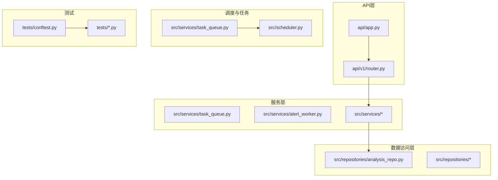
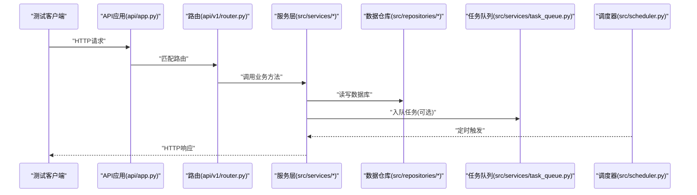
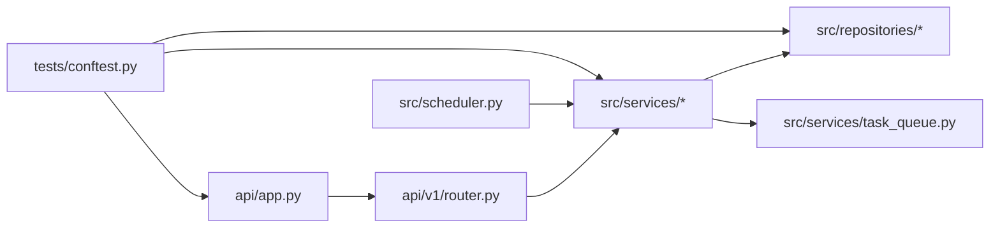

# 集成测试

<cite>
**本文引用的文件**   
- [tests/conftest.py](file://tests/conftest.py)
- [api/app.py](file://api/app.py)
- [api/v1/router.py](file://api/v1/router.py)
- [src/services/task_queue.py](file://src/services/task_queue.py)
- [src/repositories/analysis_repo.py](file://src/repositories/analysis_repo.py)
- [src/services/alert_worker.py](file://src/services/alert_worker.py)
- [src/scheduler.py](file://src/scheduler.py)
- [scripts/test.sh](file://scripts/test.sh)
</cite>

## 目录
1. [简介](#简介)
2. [项目结构](#项目结构)
3. [核心组件](#核心组件)
4. [架构总览](#架构总览)
5. [详细组件分析](#详细组件分析)
6. [依赖关系分析](#依赖关系分析)
7. [性能考量](#性能考量)
8. [故障排查指南](#故障排查指南)
9. [结论](#结论)
10. [附录](#附录)

## 简介
本文件面向Daily Stock Analysis项目的集成测试，聚焦以下目标：
- API接口的集成测试实现：HTTP请求模拟、响应验证与错误处理。
- 数据库操作的集成测试：事务回滚、数据一致性与并发访问。
- 外部服务集成的测试策略：第三方API的Mock、网络异常与服务不可用场景。
- 消息队列与异步任务的集成测试：任务调度、重试机制与失败处理。
- 测试环境隔离：独立测试数据库实例与临时文件管理。
- 提供具体集成测试用例示例，展示系统各组件之间的正确交互。

## 项目结构
本项目采用分层架构，API层通过FastAPI暴露接口，业务逻辑位于services层，数据访问在repositories层，异步任务由task_queue和alert_worker等模块承担，调度器scheduler负责定时任务。测试集中在tests目录，使用pytest框架组织用例与夹具。

图表来源
- [api/app.py](file://api/app.py)
- [api/v1/router.py](file://api/v1/router.py)
- [src/services/task_queue.py](file://src/services/task_queue.py)
- [src/repositories/analysis_repo.py](file://src/repositories/analysis_repo.py)
- [src/scheduler.py](file://src/scheduler.py)
- [tests/conftest.py](file://tests/conftest.py)

章节来源
- [tests/conftest.py](file://tests/conftest.py)
- [api/app.py](file://api/app.py)
- [api/v1/router.py](file://api/v1/router.py)
- [src/services/task_queue.py](file://src/services/task_queue.py)
- [src/repositories/analysis_repo.py](file://src/repositories/analysis_repo.py)
- [src/scheduler.py](file://src/scheduler.py)
- [scripts/test.sh](file://scripts/test.sh)

## 核心组件
- API应用与路由
  - FastAPI应用入口与版本化路由注册，集中定义接口契约与中间件。
- 任务队列与告警工作进程
  - 任务入队、出队、重试与失败处理；告警触发与发送。
- 数据仓库
  - 对数据库的增删改查封装，支持事务边界与一致性约束。
- 调度器
  - 定时任务编排，驱动每日分析流程与后台作业。
- 测试夹具与配置
  - pytest夹具提供测试数据库、Mock服务、临时文件与HTTP客户端。

章节来源
- [api/app.py](file://api/app.py)
- [api/v1/router.py](file://api/v1/router.py)
- [src/services/task_queue.py](file://src/services/task_queue.py)
- [src/repositories/analysis_repo.py](file://src/repositories/analysis_repo.py)
- [src/scheduler.py](file://src/scheduler.py)
- [tests/conftest.py](file://tests/conftest.py)

## 架构总览
下图展示了集成测试中关键调用链路与组件交互：HTTP请求进入API层，路由分发到服务层，服务层调用数据仓库持久化或触发任务队列，调度器按策略执行后台任务。

图表来源
- [api/app.py](file://api/app.py)
- [api/v1/router.py](file://api/v1/router.py)
- [src/services/task_queue.py](file://src/services/task_queue.py)
- [src/repositories/analysis_repo.py](file://src/repositories/analysis_repo.py)
- [src/scheduler.py](file://src/scheduler.py)

## 详细组件分析

### API接口集成测试
- HTTP请求模拟
  - 使用测试客户端发起GET/POST等请求，覆盖正常路径、参数校验与边界条件。
- 响应验证
  - 断言状态码、响应体结构与字段类型，确保与Pydantic Schema一致。
- 错误处理测试
  - 模拟上游异常（如网络超时、认证失败），验证返回的错误码与错误信息格式。
- 典型用例建议
  - 健康检查端点可用性。
  - 分析接口输入校验与错误分支。
  - 鉴权中间件的拦截行为。

章节来源
- [api/app.py](file://api/app.py)
- [api/v1/router.py](file://api/v1/router.py)
- [tests/conftest.py](file://tests/conftest.py)

### 数据库操作集成测试
- 事务回滚
  - 每个测试用例开启事务并在结束后回滚，保证测试间数据隔离。
- 数据一致性
  - 验证外键约束、唯一性约束与业务规则（如时间窗口、状态机）。
- 并发访问
  - 模拟多写或多读场景，验证锁机制与竞态条件处理。
- 典型用例建议
  - 插入-查询-更新-删除全链路验证。
  - 并发写入冲突与重试策略验证。
  - 批量导入与回滚一致性。

章节来源
- [src/repositories/analysis_repo.py](file://src/repositories/analysis_repo.py)
- [tests/conftest.py](file://tests/conftest.py)

### 外部服务集成测试策略
- Mock第三方API
  - 使用本地Mock服务器或库替换真实HTTP客户端，固定响应与延迟。
- 网络异常模拟
  - 注入超时、连接拒绝、DNS解析失败等异常，验证降级与重试。
- 服务不可用场景
  - 模拟5xx错误与限流，验证熔断与退避策略。
- 典型用例建议
  - 行情数据源不可用时的回退逻辑。
  - LLM提供商限流时的重试与降级。
  - 通知通道失败时的告警与日志记录。

章节来源
- [tests/conftest.py](file://tests/conftest.py)

### 消息队列与异步任务集成测试
- 任务调度
  - 验证定时任务触发频率、参数传递与幂等性。
- 重试机制
  - 模拟失败并检查重试次数、退避策略与死信队列。
- 失败处理
  - 验证错误上报、告警与人工介入流程。
- 典型用例建议
  - 每日分析任务启动与完成回调。
  - 告警任务重复消费防护。
  - 高负载下队列积压与消费者扩容。

章节来源
- [src/services/task_queue.py](file://src/services/task_queue.py)
- [src/services/alert_worker.py](file://src/services/alert_worker.py)
- [src/scheduler.py](file://src/scheduler.py)
- [tests/conftest.py](file://tests/conftest.py)

### 测试环境隔离
- 独立测试数据库实例
  - 使用SQLite内存库或独立PostgreSQL实例，避免污染生产数据。
- 临时文件管理
  - 为每个用例创建临时目录，测试后自动清理。
- 环境变量与配置
  - 通过夹具注入测试配置，覆盖敏感密钥与外部服务地址。
- 典型用例建议
  - 启动前准备种子数据。
  - 运行后校验无残留文件与连接泄漏。

章节来源
- [tests/conftest.py](file://tests/conftest.py)
- [scripts/test.sh](file://scripts/test.sh)

## 依赖关系分析
- API层依赖路由与中间件，路由再依赖服务层。
- 服务层依赖数据仓库与任务队列。
- 调度器驱动服务层周期性执行。
- 测试夹具统一提供HTTP客户端、数据库会话与Mock服务。

图表来源
- [api/app.py](file://api/app.py)
- [api/v1/router.py](file://api/v1/router.py)
- [src/services/task_queue.py](file://src/services/task_queue.py)
- [src/repositories/analysis_repo.py](file://src/repositories/analysis_repo.py)
- [src/scheduler.py](file://src/scheduler.py)
- [tests/conftest.py](file://tests/conftest.py)

章节来源
- [api/app.py](file://api/app.py)
- [api/v1/router.py](file://api/v1/router.py)
- [src/services/task_queue.py](file://src/services/task_queue.py)
- [src/repositories/analysis_repo.py](file://src/repositories/analysis_repo.py)
- [src/scheduler.py](file://src/scheduler.py)
- [tests/conftest.py](file://tests/conftest.py)

## 性能考量
- 数据库连接池与事务粒度控制，避免长事务阻塞。
- 任务队列消费者数量与批处理大小调优。
- Mock服务延迟与错误注入的随机性控制，确保稳定性。
- 并发测试时限制线程数，防止资源争用导致不稳定。

[本节为通用指导，不直接分析具体文件]

## 故障排查指南
- API层问题
  - 检查路由注册与中间件顺序，确认错误处理器是否生效。
- 数据库问题
  - 查看事务是否提交/回滚，索引与约束是否满足预期。
- 外部服务问题
  - 核对Mock响应与真实服务的差异，检查重试与熔断配置。
- 任务与调度问题
  - 检查队列堆积、消费者存活与日志中的失败堆栈。
- 常见定位步骤
  - 启用调试日志，缩小问题范围。
  - 使用最小复现用例逐步排除依赖。
  - 检查测试夹具是否正确初始化与清理。

章节来源
- [tests/conftest.py](file://tests/conftest.py)
- [scripts/test.sh](file://scripts/test.sh)

## 结论
通过统一的测试夹具与分层架构，Daily Stock Analysis的集成测试覆盖了API、数据库、外部服务、任务队列与调度器等关键组件。建议在CI中持续运行这些用例，结合Mock与隔离环境，确保系统在变更时保持稳定与可靠。

[本节为总结性内容，不直接分析具体文件]

## 附录
- 运行集成测试
  - 使用脚本执行测试套件，确保测试数据库与临时目录就绪。
- 扩展测试用例
  - 新增API端点时，补充对应的请求/响应与错误分支用例。
  - 新增外部依赖时，提供Mock与异常注入用例。
  - 新增任务与调度时，验证触发、重试与失败处理。

章节来源
- [scripts/test.sh](file://scripts/test.sh)
- [tests/conftest.py](file://tests/conftest.py)