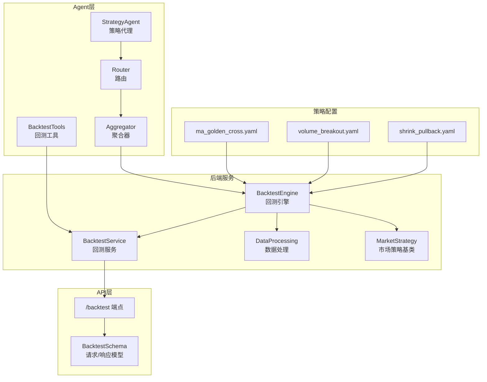
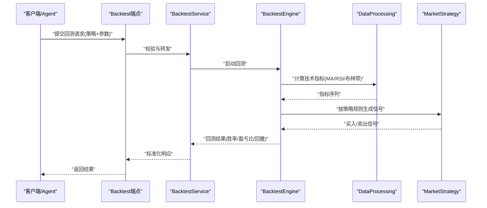
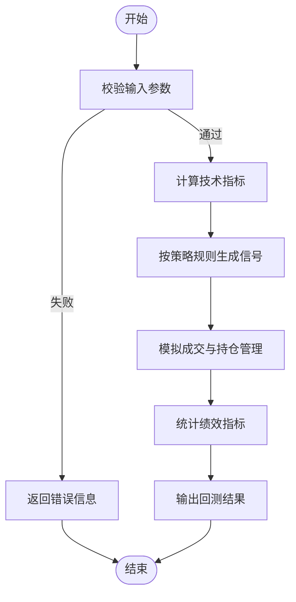
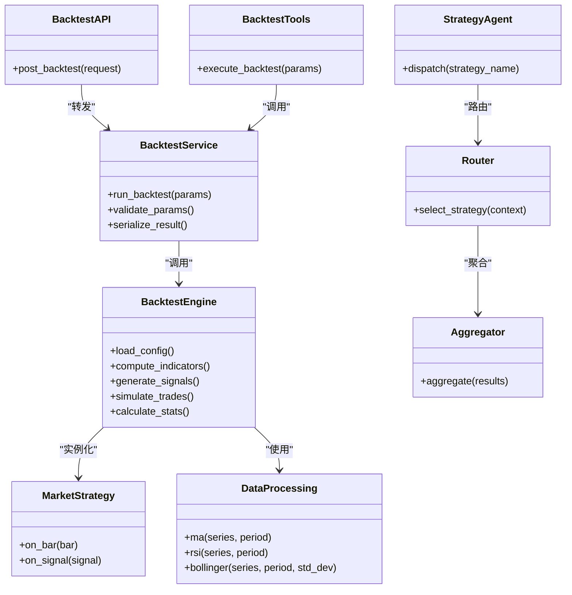

# 内置策略实现

<cite>
**本文引用的文件**   
- [strategies/ma_golden_cross.yaml](file://strategies/ma_golden_cross.yaml)
- [strategies/volume_breakout.yaml](file://strategies/volume_breakout.yaml)
- [strategies/shrink_pullback.yaml](file://strategies/shrink_pullback.yaml)
- [src/core/backtest_engine.py](file://src/core/backtest_engine.py)
- [src/services/backtest_service.py](file://src/services/backtest_service.py)
- [api/v1/endpoints/backtest.py](file://api/v1/endpoints/backtest.py)
- [api/v1/schemas/backtest.py](file://api/v1/schemas/backtest.py)
- [src/agent/tools/backtest_tools.py](file://src/agent/tools/backtest_tools.py)
- [src/agent/strategies/strategy_agent.py](file://src/agent/strategies/strategy_agent.py)
- [src/agent/strategies/aggregator.py](file://src/agent/strategies/aggregator.py)
- [src/agent/strategies/router.py](file://src/agent/strategies/router.py)
- [src/core/market_strategy.py](file://src/core/market_strategy.py)
- [src/utils/data_processing.py](file://src/utils/data_processing.py)
- [tests/test_backtest_engine.py](file://tests/test_backtest_engine.py)
- [tests/test_backtest_service.py](file://tests/test_backtest_service.py)
</cite>

## 目录
1. [引言](#引言)
2. [项目结构](#项目结构)
3. [核心组件](#核心组件)
4. [架构总览](#架构总览)
5. [详细组件分析](#详细组件分析)
6. [依赖关系分析](#依赖关系分析)
7. [性能考量](#性能考量)
8. [故障排查指南](#故障排查指南)
9. [结论](#结论)
10. [附录](#附录)

## 引言
本文件面向“内置策略实现”的深入文档，聚焦以下目标：
- 解析内置策略的算法逻辑与实现原理，包括均线金叉趋势识别、成交量突破信号确认、缩量回调入场时机判断等。
- 说明技术指标计算方法与参数调优技巧（移动平均线、相对强弱指标RSI、布林带等）的组合使用。
- 解释不同市场环境下的策略适应性与局限性，提供参数优化的方法论。
- 解读回测结果的关键指标（胜率、盈亏比、最大回撤等），并给出改进与自定义扩展指导。

## 项目结构
本项目将策略配置以YAML形式集中管理，并通过后端服务与回测引擎驱动执行；前端通过API暴露回测能力，Agent层提供工具调用入口。关键路径如下：
- 策略定义：strategies/*.yaml
- 回测引擎与业务服务：src/core/backtest_engine.py、src/services/backtest_service.py
- API接口：api/v1/endpoints/backtest.py、api/v1/schemas/backtest.py
- Agent工具与策略编排：src/agent/tools/backtest_tools.py、src/agent/strategies/*
- 数据处理与指标计算：src/utils/data_processing.py、src/core/market_strategy.py

图表来源
- [src/core/backtest_engine.py](file://src/core/backtest_engine.py)
- [src/services/backtest_service.py](file://src/services/backtest_service.py)
- [api/v1/endpoints/backtest.py](file://api/v1/endpoints/backtest.py)
- [api/v1/schemas/backtest.py](file://api/v1/schemas/backtest.py)
- [src/agent/tools/backtest_tools.py](file://src/agent/tools/backtest_tools.py)
- [src/agent/strategies/strategy_agent.py](file://src/agent/strategies/strategy_agent.py)
- [src/agent/strategies/aggregator.py](file://src/agent/strategies/aggregator.py)
- [src/agent/strategies/router.py](file://src/agent/strategies/router.py)
- [src/core/market_strategy.py](file://src/core/market_strategy.py)
- [src/utils/data_processing.py](file://src/utils/data_processing.py)
- [strategies/ma_golden_cross.yaml](file://strategies/ma_golden_cross.yaml)
- [strategies/volume_breakout.yaml](file://strategies/volume_breakout.yaml)
- [strategies/shrink_pullback.yaml](file://strategies/shrink_pullback.yaml)

章节来源
- [src/core/backtest_engine.py](file://src/core/backtest_engine.py)
- [src/services/backtest_service.py](file://src/services/backtest_service.py)
- [api/v1/endpoints/backtest.py](file://api/v1/endpoints/backtest.py)
- [api/v1/schemas/backtest.py](file://api/v1/schemas/backtest.py)
- [src/agent/tools/backtest_tools.py](file://src/agent/tools/backtest_tools.py)
- [src/agent/strategies/strategy_agent.py](file://src/agent/strategies/strategy_agent.py)
- [src/agent/strategies/aggregator.py](file://src/agent/strategies/aggregator.py)
- [src/agent/strategies/router.py](file://src/agent/strategies/router.py)
- [src/core/market_strategy.py](file://src/core/market_strategy.py)
- [src/utils/data_processing.py](file://src/utils/data_processing.py)
- [strategies/ma_golden_cross.yaml](file://strategies/ma_golden_cross.yaml)
- [strategies/volume_breakout.yaml](file://strategies/volume_breakout.yaml)
- [strategies/shrink_pullback.yaml](file://strategies/shrink_pullback.yaml)

## 核心组件
- 回测引擎（BacktestEngine）：负责加载策略配置、计算技术指标、生成交易信号、模拟成交与统计回测结果。
- 回测服务（BacktestService）：封装对引擎的调用，处理输入校验、并发控制与结果序列化。
- 市场策略基类（MarketStrategy）：定义策略抽象接口与通用行为，便于扩展新策略。
- 数据处理（DataProcessing）：提供指标计算与数据清洗工具，如移动平均线、RSI、布林带等。
- API端点与Schema：对外暴露回测接口，统一请求/响应格式。
- Agent工具与策略编排：在Agent生态中集成回测能力，支持多策略聚合与路由。

章节来源
- [src/core/backtest_engine.py](file://src/core/backtest_engine.py)
- [src/services/backtest_service.py](file://src/services/backtest_service.py)
- [src/core/market_strategy.py](file://src/core/market_strategy.py)
- [src/utils/data_processing.py](file://src/utils/data_processing.py)
- [api/v1/endpoints/backtest.py](file://api/v1/endpoints/backtest.py)
- [api/v1/schemas/backtest.py](file://api/v1/schemas/backtest.py)
- [src/agent/tools/backtest_tools.py](file://src/agent/tools/backtest_tools.py)
- [src/agent/strategies/strategy_agent.py](file://src/agent/strategies/strategy_agent.py)
- [src/agent/strategies/aggregator.py](file://src/agent/strategies/aggregator.py)
- [src/agent/strategies/router.py](file://src/agent/strategies/router.py)

## 架构总览
下图展示了从策略配置到回测执行的端到端流程，以及各模块之间的交互关系。

图表来源
- [api/v1/endpoints/backtest.py](file://api/v1/endpoints/backtest.py)
- [src/services/backtest_service.py](file://src/services/backtest_service.py)
- [src/core/backtest_engine.py](file://src/core/backtest_engine.py)
- [src/utils/data_processing.py](file://src/utils/data_processing.py)
- [src/core/market_strategy.py](file://src/core/market_strategy.py)

## 详细组件分析

### 均线金叉策略（ma_golden_cross）
- 算法逻辑
  - 计算短期与长期移动平均线（如MA5与MA20）。
  - 当短期均线上穿长期均线时产生买入信号；下穿时产生卖出信号。
  - 可结合趋势过滤（如价格位于某长期均线上方）降低假信号。
- 参数调优
  - 短周期与长周期的选择需匹配标的波动特性与交易频率。
  - 可引入平滑因子或加权移动平均以减少滞后。
- 适用环境
  - 趋势行情表现较好；震荡市中易出现频繁交叉导致亏损。
- 风险与局限
  - 滞后性较强，需配合止损与仓位管理。
  - 在跳空缺口与极端波动下可能失效。

章节来源
- [strategies/ma_golden_cross.yaml](file://strategies/ma_golden_cross.yaml)
- [src/utils/data_processing.py](file://src/utils/data_processing.py)
- [src/core/market_strategy.py](file://src/core/market_strategy.py)

### 成交量突破策略（volume_breakout）
- 算法逻辑
  - 基于价格突破关键阻力位（如前高或布林带上轨）且伴随成交量放大确认。
  - 放量阈值通常以近期均量倍数或分位数设定。
- 参数调优
  - 突破窗口长度、量能放大倍数、过滤条件（如波动率阈值）需协同优化。
  - 可加入时间过滤（如开盘后N分钟）避免噪音。
- 适用环境
  - 趋势启动初期或事件驱动行情效果更佳。
- 风险与局限
  - 假突破较多，需严格止损与二次确认（如收盘价确认）。

章节来源
- [strategies/volume_breakout.yaml](file://strategies/volume_breakout.yaml)
- [src/utils/data_processing.py](file://src/utils/data_processing.py)
- [src/core/market_strategy.py](file://src/core/market_strategy.py)

### 缩量回调策略（shrink_pullback）
- 算法逻辑
  - 在上升趋势中等待价格回调至支撑位（如短期均线或布林带中轨）。
  - 回调阶段成交量显著萎缩，表明抛压减弱，随后放量回升作为入场信号。
- 参数调优
  - 支撑位选择（均线/通道）、缩量比例阈值、放量确认阈值需联合优化。
  - 可结合RSI超卖区域增强入场质量。
- 适用环境
  - 强势趋势中的健康回调；震荡市容易误判。
- 风险与局限
  - 回调演变为反转的风险存在，需设置动态止损。

章节来源
- [strategies/shrink_pullback.yaml](file://strategies/shrink_pullback.yaml)
- [src/utils/data_processing.py](file://src/utils/data_processing.py)
- [src/core/market_strategy.py](file://src/core/market_strategy.py)

### 技术指标计算方法与组合
- 移动平均线（MA/EMA/WMA）
  - 用于趋势跟踪与支撑/阻力识别；EMA对近期价格更敏感。
- 相对强弱指标（RSI）
  - 衡量涨跌动能，常用于超买超卖判断与背离信号。
- 布林带（Bollinger Bands）
  - 由中轨（MA）与上下轨（标准差倍数）构成，用于波动率与突破过滤。
- 组合使用建议
  - MA确定方向，RSI过滤极端值，布林带辅助突破与回调定位。
  - 多指标共振可降低单一指标的噪声影响。

章节来源
- [src/utils/data_processing.py](file://src/utils/data_processing.py)
- [src/core/market_strategy.py](file://src/core/market_strategy.py)

### 回测引擎与服务
- 回测引擎职责
  - 加载策略配置、计算指标、生成信号、模拟成交、统计绩效。
- 回测服务职责
  - 封装引擎调用、参数校验、并发控制、结果序列化。
- 关键流程
  - 输入校验→指标计算→信号生成→成交模拟→绩效统计→结果返回。

图表来源
- [src/core/backtest_engine.py](file://src/core/backtest_engine.py)
- [src/services/backtest_service.py](file://src/services/backtest_service.py)

章节来源
- [src/core/backtest_engine.py](file://src/core/backtest_engine.py)
- [src/services/backtest_service.py](file://src/services/backtest_service.py)

### API与Schema
- 端点设计
  - /backtest：接收策略名称、参数、时间窗口等，返回回测结果。
- Schema规范
  - 统一请求字段（策略名、参数字典、起止日期、标的列表）。
  - 响应字段包含绩效指标（胜率、盈亏比、最大回撤、交易次数等）。

章节来源
- [api/v1/endpoints/backtest.py](file://api/v1/endpoints/backtest.py)
- [api/v1/schemas/backtest.py](file://api/v1/schemas/backtest.py)

### Agent工具与策略编排
- BacktestTools
  - 为Agent提供回测调用能力，支持批量与异步执行。
- StrategyAgent与Aggregator/Router
  - 策略代理负责协调多个策略的执行与结果聚合；路由根据市场状态选择合适策略。

章节来源
- [src/agent/tools/backtest_tools.py](file://src/agent/tools/backtest_tools.py)
- [src/agent/strategies/strategy_agent.py](file://src/agent/strategies/strategy_agent.py)
- [src/agent/strategies/aggregator.py](file://src/agent/strategies/aggregator.py)
- [src/agent/strategies/router.py](file://src/agent/strategies/router.py)

## 依赖关系分析
- 策略配置依赖数据处理模块进行指标计算。
- 回测引擎依赖市场策略基类实现具体策略逻辑。
- API层依赖Schema进行数据校验与序列化。
- Agent层通过工具与路由机制调度回测服务。

图表来源
- [src/core/backtest_engine.py](file://src/core/backtest_engine.py)
- [src/services/backtest_service.py](file://src/services/backtest_service.py)
- [src/core/market_strategy.py](file://src/core/market_strategy.py)
- [src/utils/data_processing.py](file://src/utils/data_processing.py)
- [api/v1/endpoints/backtest.py](file://api/v1/endpoints/backtest.py)
- [src/agent/tools/backtest_tools.py](file://src/agent/tools/backtest_tools.py)
- [src/agent/strategies/strategy_agent.py](file://src/agent/strategies/strategy_agent.py)
- [src/agent/strategies/aggregator.py](file://src/agent/strategies/aggregator.py)
- [src/agent/strategies/router.py](file://src/agent/strategies/router.py)

章节来源
- [src/core/backtest_engine.py](file://src/core/backtest_engine.py)
- [src/services/backtest_service.py](file://src/services/backtest_service.py)
- [src/core/market_strategy.py](file://src/core/market_strategy.py)
- [src/utils/data_processing.py](file://src/utils/data_processing.py)
- [api/v1/endpoints/backtest.py](file://api/v1/endpoints/backtest.py)
- [src/agent/tools/backtest_tools.py](file://src/agent/tools/backtest_tools.py)
- [src/agent/strategies/strategy_agent.py](file://src/agent/strategies/strategy_agent.py)
- [src/agent/strategies/aggregator.py](file://src/agent/strategies/aggregator.py)
- [src/agent/strategies/router.py](file://src/agent/strategies/router.py)

## 性能考量
- 指标计算优化
  - 向量化计算减少循环开销；缓存历史指标避免重复计算。
- 回测效率
  - 分批处理标的与时间窗口；并行执行独立回测任务。
- 内存与I/O
  - 流式读取数据；限制中间结果大小；合理设置批大小。
- 延迟与吞吐
  - API层增加限流与超时控制；服务端采用连接池与线程池。

[本节为通用指导，不直接分析具体文件]

## 故障排查指南
- 常见错误
  - 参数校验失败：检查策略名称、参数类型与范围。
  - 数据缺失：确保历史数据完整与时间对齐。
  - 指标计算异常：检查周期与数据长度是否满足最小要求。
- 调试方法
  - 启用详细日志；打印中间指标与信号。
  - 使用单元测试验证指标与策略逻辑。
- 参考测试
  - 回测引擎与服务测试用例覆盖边界条件与异常路径。

章节来源
- [tests/test_backtest_engine.py](file://tests/test_backtest_engine.py)
- [tests/test_backtest_service.py](file://tests/test_backtest_service.py)

## 结论
- 内置策略通过清晰的配置与模块化实现，具备良好的可扩展性与可维护性。
- 均线金叉、成交量突破、缩量回调三类策略分别适用于趋势、突破与回调场景，需结合市场环境与参数优化。
- 回测引擎与服务提供了完整的绩效评估能力，有助于策略迭代与风险控制。
- 建议在实盘前进行充分回测与压力测试，并结合风控规则与资金管理。

[本节为总结性内容，不直接分析具体文件]

## 附录
- 参数优化方法论
  - 网格搜索与贝叶斯优化结合，优先优化关键参数（周期、阈值）。
  - 使用滚动窗口与样本外测试防止过拟合。
- 策略改进与扩展
  - 新增策略：继承MarketStrategy，实现信号生成逻辑，并在配置文件中注册。
  - 指标扩展：在DataProcessing中添加计算函数，供策略调用。
  - 多策略聚合：通过Aggregator合并信号，提升稳定性。

[本节为补充内容，不直接分析具体文件]