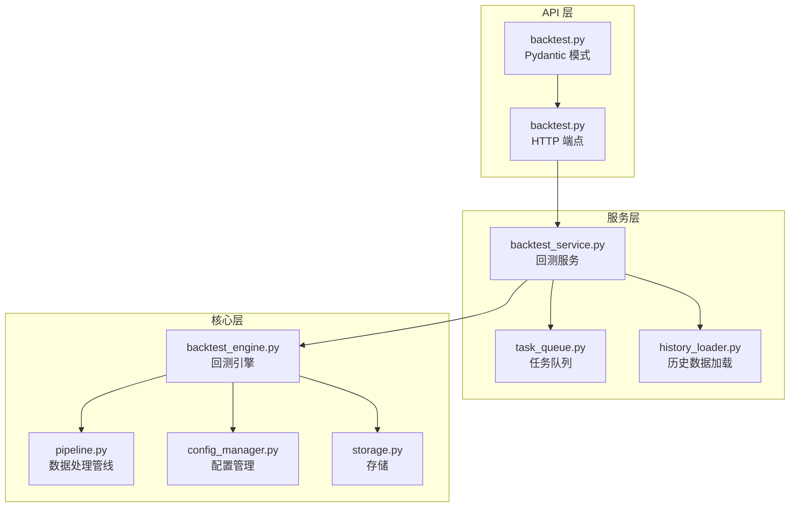
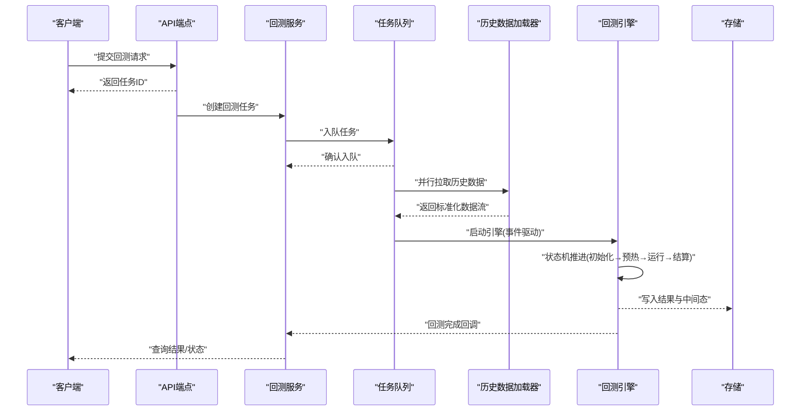
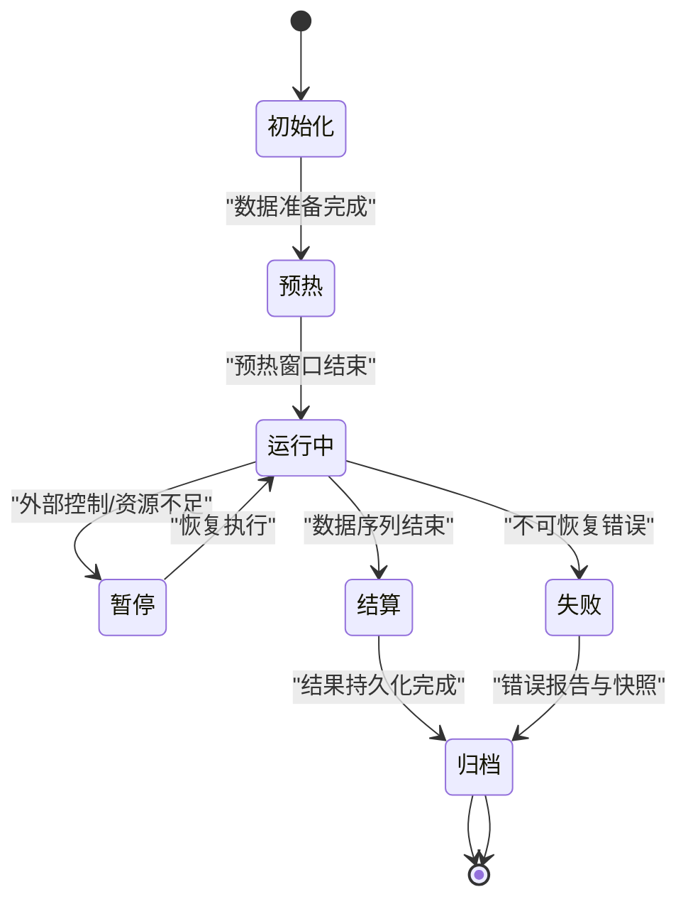
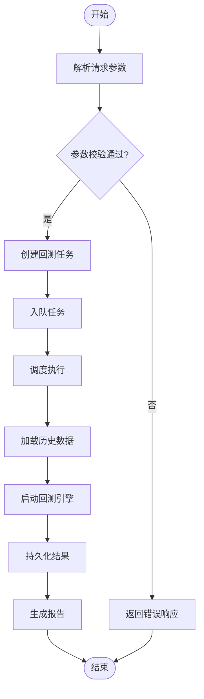
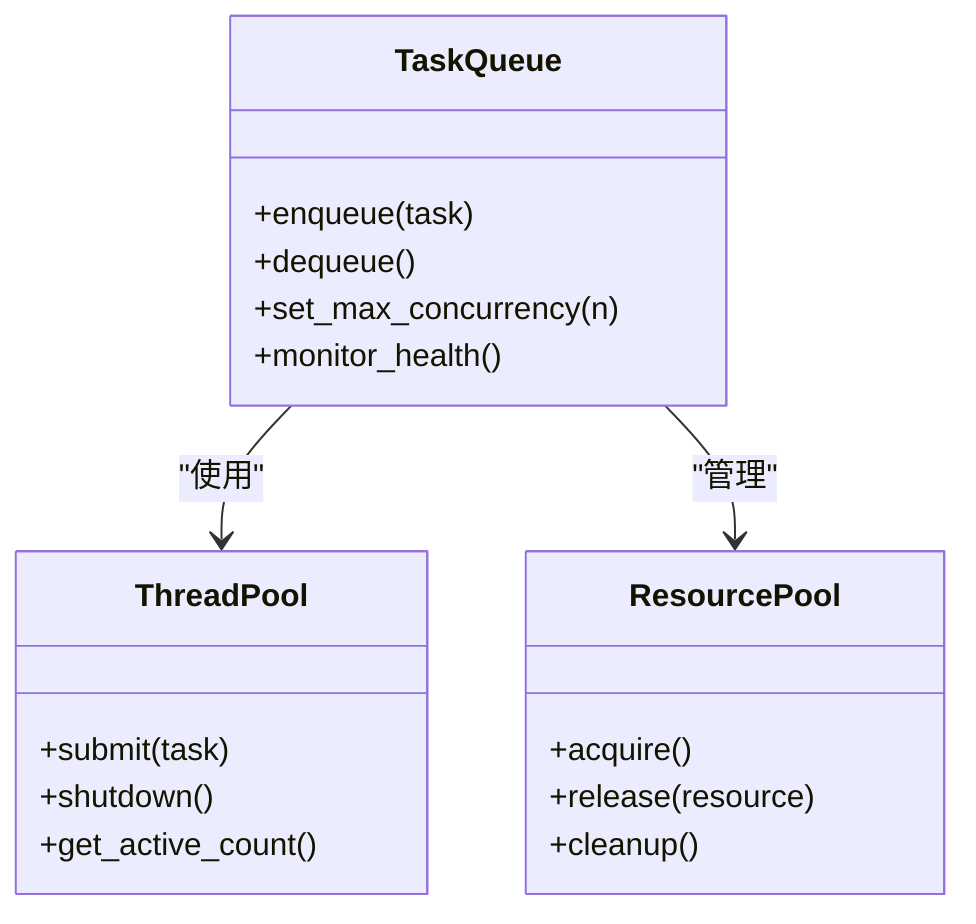
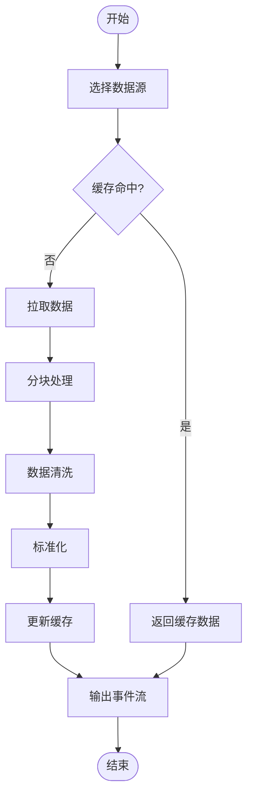
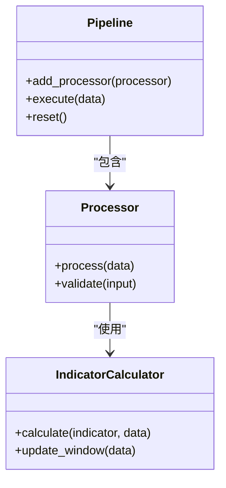
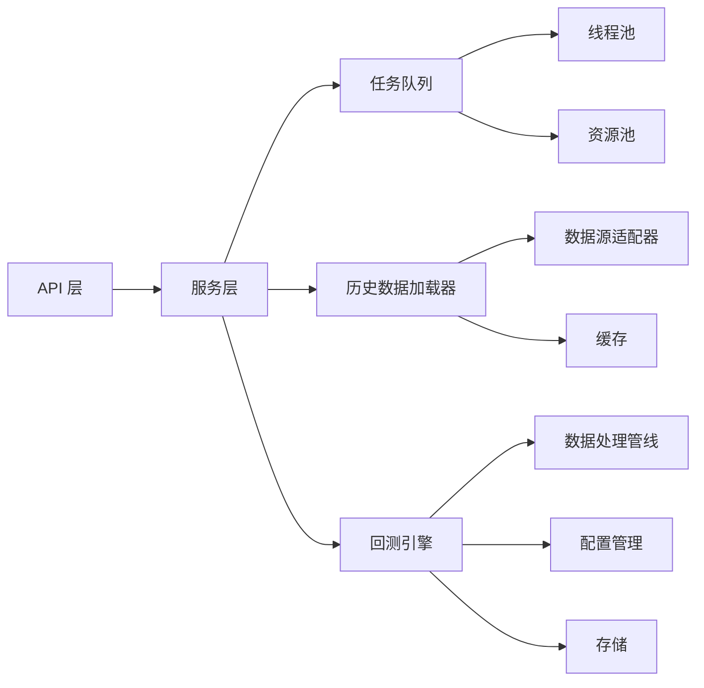

# 回测引擎核心架构

<cite>
**本文引用的文件**   
- [backtest_engine.py](file://src/core/backtest_engine.py)
- [backtest_service.py](file://src/services/backtest_service.py)
- [backtest.py](file://api/v1/endpoints/backtest.py)
- [backtest.py](file://api/v1/schemas/backtest.py)
- [task_queue.py](file://src/services/task_queue.py)
- [history_loader.py](file://src/services/history_loader.py)
- [pipeline.py](file://src/core/pipeline.py)
- [config_manager.py](file://src/core/config_manager.py)
- [storage.py](file://src/storage.py)
- [logging_config.py](file://src/logging_config.py)
</cite>

## 目录
1. [简介](#简介)
2. [项目结构](#项目结构)
3. [核心组件](#核心组件)
4. [架构总览](#架构总览)
5. [详细组件分析](#详细组件分析)
6. [依赖关系分析](#依赖关系分析)
7. [性能考量](#性能考量)
8. [故障排查指南](#故障排查指南)
9. [结论](#结论)
10. [附录](#附录)

## 简介
本文件面向策略回测引擎的核心架构与实现，围绕事件驱动、数据流管理、状态机设计展开，覆盖从历史数据加载、策略初始化、信号生成到订单执行的完整生命周期。同时给出内存管理（分块处理、缓存、垃圾回收优化）、并发模型（多线程/异步任务调度、资源池）、错误处理与异常恢复机制，以及性能监控与调试工具的使用建议。文档力求在技术细节与可读性之间取得平衡，帮助不同背景的读者快速理解并高效使用该系统。

## 项目结构
回测相关代码主要分布在以下模块：
- 核心引擎层：负责事件循环、状态机、执行流程编排
- 服务层：封装回测任务调度、历史数据加载、结果持久化
- API 层：提供 HTTP 接口用于触发回测、查询状态与结果
- 配置与存储：统一配置管理与结果落盘

图表来源 
- [backtest.py](file://api/v1/endpoints/backtest.py)
- [backtest.py](file://api/v1/schemas/backtest.py)
- [backtest_service.py](file://src/services/backtest_service.py)
- [task_queue.py](file://src/services/task_queue.py)
- [history_loader.py](file://src/services/history_loader.py)
- [backtest_engine.py](file://src/core/backtest_engine.py)
- [pipeline.py](file://src/core/pipeline.py)
- [config_manager.py](file://src/core/config_manager.py)
- [storage.py](file://src/storage.py)

章节来源
- [backtest_engine.py](file://src/core/backtest_engine.py)
- [backtest_service.py](file://src/services/backtest_service.py)
- [backtest.py](file://api/v1/endpoints/backtest.py)
- [backtest.py](file://api/v1/schemas/backtest.py)
- [task_queue.py](file://src/services/task_queue.py)
- [history_loader.py](file://src/services/history_loader.py)
- [pipeline.py](file://src/core/pipeline.py)
- [config_manager.py](file://src/core/config_manager.py)
- [storage.py](file://src/storage.py)

## 核心组件
- 回测引擎（Event-driven Backtest Engine）
  - 基于事件驱动的时序推进，按时间步或K线周期触发策略计算
  - 内部状态机管理回测阶段（初始化、预热、运行、结算、归档）
  - 事件总线分发市场数据、指标更新、交易信号、成交回报等事件
- 回测服务（Backtest Service）
  - 接收API请求，构建回测上下文与参数
  - 协调任务队列、历史数据加载、引擎启动与结果持久化
- 任务队列（Task Queue）
  - 支持并发回测任务调度，限制并发度，避免资源争用
  - 任务生命周期管理（入队、执行、完成、失败重试）
- 历史数据加载器（History Loader）
  - 多源数据适配与拉取，支持分块读取与缓存
  - 数据清洗、对齐、标准化，输出引擎可消费的事件流
- 数据处理管线（Pipeline）
  - 将原始数据转换为策略输入特征，包含技术指标、因子计算
  - 支持增量更新与窗口滑动，降低重复计算
- 配置管理（Config Manager）
  - 集中管理回测参数、数据源配置、风控规则
  - 运行时校验与热更新能力
- 存储（Storage）
  - 回测结果、日志、中间态数据的持久化与检索
  - 支持本地文件系统与可选的远程存储后端

章节来源
- [backtest_engine.py](file://src/core/backtest_engine.py)
- [backtest_service.py](file://src/services/backtest_service.py)
- [task_queue.py](file://src/services/task_queue.py)
- [history_loader.py](file://src/services/history_loader.py)
- [pipeline.py](file://src/core/pipeline.py)
- [config_manager.py](file://src/core/config_manager.py)
- [storage.py](file://src/storage.py)

## 架构总览
回测系统采用分层架构与事件驱动相结合的设计：
- API 层暴露REST接口，接收回测请求并返回任务ID与状态
- 服务层负责编排任务、数据加载与引擎调用
- 核心层实现事件循环、状态机、数据处理与执行
- 外部依赖包括数据源、存储、日志与监控系统

图表来源 
- [backtest.py](file://api/v1/endpoints/backtest.py)
- [backtest_service.py](file://src/services/backtest_service.py)
- [task_queue.py](file://src/services/task_queue.py)
- [history_loader.py](file://src/services/history_loader.py)
- [backtest_engine.py](file://src/core/backtest_engine.py)
- [storage.py](file://src/storage.py)

## 详细组件分析

### 回测引擎（事件驱动与状态机）
- 事件驱动
  - 事件类型：市场数据、指标更新、交易信号、成交回报、风控事件
  - 事件总线：解耦生产者与消费者，支持优先级与过滤
  - 时序推进：按时间戳排序，保证因果一致性
- 状态机
  - 状态定义：初始化、预热、运行中、暂停、结算、归档、失败
  - 转换条件：事件触发与参数校验
  - 容错：状态快照与恢复，异常时回滚到最近一致状态
- 执行流程
  - 数据订阅：从历史数据加载器获取事件流
  - 策略计算：按窗口计算指标与信号
  - 订单生成：根据策略输出与风控规则生成订单
  - 成交模拟：撮合引擎模拟成交与滑点
  - 绩效统计：累计收益、回撤、夏普比率等

图表来源 
- [backtest_engine.py](file://src/core/backtest_engine.py)

章节来源
- [backtest_engine.py](file://src/core/backtest_engine.py)

### 回测服务（任务编排与结果管理）
- 任务创建
  - 解析API请求参数，构建回测上下文
  - 校验配置与权限，分配任务ID
- 任务调度
  - 通过任务队列进行并发控制与负载均衡
  - 支持优先级与超时策略
- 数据协调
  - 协调历史数据加载器，确保数据完整性与时序正确
- 结果管理
  - 聚合引擎输出，生成回测报告
  - 持久化结果与日志，支持查询与下载

图表来源 
- [backtest_service.py](file://src/services/backtest_service.py)
- [task_queue.py](file://src/services/task_queue.py)
- [history_loader.py](file://src/services/history_loader.py)

章节来源
- [backtest_service.py](file://src/services/backtest_service.py)
- [task_queue.py](file://src/services/task_queue.py)
- [history_loader.py](file://src/services/history_loader.py)

### 任务队列（并发与资源池）
- 并发模型
  - 线程池/进程池限制最大并发数
  - 任务优先级与公平调度
- 资源管理
  - 连接池、内存池、I/O缓冲池
  - 资源泄漏检测与自动回收
- 可靠性
  - 任务重试与死信队列
  - 心跳检测与健康检查

图表来源 
- [task_queue.py](file://src/services/task_queue.py)

章节来源
- [task_queue.py](file://src/services/task_queue.py)

### 历史数据加载器（数据流与缓存）
- 数据源适配
  - 多数据源抽象接口，统一数据格式
  - 动态路由与故障转移
- 分块处理
  - 按时间窗口或文件大小分块读取
  - 增量更新与断点续传
- 缓存机制
  - 多级缓存（内存、磁盘、分布式）
  - 缓存失效策略与一致性保证
- 数据质量
  - 缺失值处理、异常值检测
  - 数据对齐与标准化

图表来源 
- [history_loader.py](file://src/services/history_loader.py)

章节来源
- [history_loader.py](file://src/services/history_loader.py)

### 数据处理管线（特征工程与指标计算）
- 管线设计
  - 模块化处理器链，支持动态组合
  - 批处理与流式处理双模式
- 指标计算
  - 技术指标库与自定义指标扩展
  - 窗口函数与滚动计算优化
- 内存优化
  - 惰性求值与按需计算
  - 内存映射与零拷贝传输

图表来源 
- [pipeline.py](file://src/core/pipeline.py)

章节来源
- [pipeline.py](file://src/core/pipeline.py)

### 配置管理（参数校验与热更新）
- 配置结构
  - YAML/JSON配置文件与默认值
  - 环境变量覆盖与环境隔离
- 校验机制
  - 类型校验、范围校验、依赖校验
  - 运行时动态校验与告警
- 热更新
  - 配置变更监听与无缝切换
  - 版本兼容性与回滚策略

章节来源
- [config_manager.py](file://src/core/config_manager.py)

### 存储（结果持久化与检索）
- 存储后端
  - 本地文件系统、对象存储、数据库
  - 读写分离与副本同步
- 数据模型
  - 回测结果、交易日志、中间状态
  - 索引设计与查询优化
- 安全与备份
  - 访问控制与审计日志
  - 定期备份与灾难恢复

章节来源
- [storage.py](file://src/storage.py)

## 依赖关系分析
各组件之间的依赖关系如下：
- API 层依赖服务层接口
- 服务层依赖任务队列、历史数据加载器、回测引擎
- 回测引擎依赖数据处理管线、配置管理、存储
- 任务队列依赖线程池与资源池
- 历史数据加载器依赖数据源适配器与缓存

图表来源 
- [backtest.py](file://api/v1/endpoints/backtest.py)
- [backtest_service.py](file://src/services/backtest_service.py)
- [task_queue.py](file://src/services/task_queue.py)
- [history_loader.py](file://src/services/history_loader.py)
- [backtest_engine.py](file://src/core/backtest_engine.py)
- [pipeline.py](file://src/core/pipeline.py)
- [config_manager.py](file://src/core/config_manager.py)
- [storage.py](file://src/storage.py)

章节来源
- [backtest.py](file://api/v1/endpoints/backtest.py)
- [backtest_service.py](file://src/services/backtest_service.py)
- [task_queue.py](file://src/services/task_queue.py)
- [history_loader.py](file://src/services/history_loader.py)
- [backtest_engine.py](file://src/core/backtest_engine.py)
- [pipeline.py](file://src/core/pipeline.py)
- [config_manager.py](file://src/core/config_manager.py)
- [storage.py](file://src/storage.py)

## 性能考量
- 内存管理
  - 大数据集分块处理，避免一次性加载导致内存溢出
  - 使用生成器与惰性求值减少中间对象创建
  - 定期触发垃圾回收，释放不再使用的对象
- 缓存策略
  - 多级缓存（L1内存、L2磁盘、L3网络）
  - 缓存键设计考虑数据版本与时间窗口
  - 缓存预热与预取策略
- 并发优化
  - I/O密集型操作使用异步/多线程
  - CPU密集型操作使用多进程或C扩展
  - 锁粒度最小化，避免热点竞争
- 计算优化
  - 向量化计算与NumPy/Pandas优化
  - 增量计算与状态复用
  - 算法复杂度分析与剪枝

## 故障排查指南
- 常见问题定位
  - 查看日志级别与关键路径日志
  - 监控指标：CPU、内存、I/O、队列长度
  - 健康检查接口与状态查询
- 错误处理策略
  - 分类错误：可恢复、不可恢复、业务错误
  - 重试机制：指数退避与熔断
  - 降级策略：备用数据源与简化模式
- 调试工具
  - 性能剖析工具（cProfile、memory_profiler）
  - 分布式追踪（OpenTelemetry集成）
  - 交互式调试与断点设置

章节来源
- [logging_config.py](file://src/logging_config.py)

## 结论
本回测引擎采用事件驱动与状态机相结合的架构，实现了高内聚、低耦合的系统设计。通过分层架构与模块化设计，系统在可扩展性、可维护性与性能方面取得了良好平衡。事件总线确保了组件间的松耦合，状态机保证了执行流程的可控性与可恢复性。内存管理、并发处理、错误恢复等机制共同保障了系统的稳定性与可靠性。未来可进一步引入机器学习辅助的参数优化与自适应策略，提升回测效率与准确性。

## 附录
- 术语表
  - 事件驱动：以事件为中心的消息传递架构
  - 状态机：有限状态自动机，描述系统状态转换
  - 分块处理：将大数据集分割为小块进行处理
  - 缓存：临时存储常用数据以提高访问速度
  - 并发：多个任务同时执行
- 最佳实践
  - 合理设置并发度与超时时间
  - 使用连接池与资源池管理外部资源
  - 实施完善的监控与告警机制
  - 定期进行性能测试与压力测试