# 回测结果分析

<cite>
**本文引用的文件**   
- [backtest_engine.py](file://src/core/backtest_engine.py)
- [backtest_service.py](file://src/services/backtest_service.py)
- [backtest.py（API端点）](file://api/v1/endpoints/backtest.py)
- [backtest.py（Schema定义）](file://api/v1/schemas/backtest.py)
- [backtest.py（前端API调用）](file://apps/dsa-web/src/api/backtest.ts)
- [backtest_tools.py](file://src/agent/tools/backtest_tools.py)
- [analysis_tools.py](file://src/agent/tools/analysis_tools.py)
- [report_renderer.py](file://src/services/report_renderer.py)
- [backtest_repo.py](file://src/repositories/backtest_repo.py)
- [portfolio_risk_service.py](file://src/services/portfolio_risk_service.py)
- [history_comparison_service.py](file://src/services/history_comparison_service.py)
- [test_backtest_engine.py](file://tests/test_backtest_engine.py)
- [test_backtest_service.py](file://tests/test_backtest_service.py)
</cite>

## 目录
1. [简介](#简介)
2. [项目结构](#项目结构)
3. [核心组件](#核心组件)
4. [架构总览](#架构总览)
5. [详细组件分析](#详细组件分析)
6. [依赖关系分析](#依赖关系分析)
7. [性能考量](#性能考量)
8. [故障排查指南](#故障排查指南)
9. [结论](#结论)
10. [附录](#附录)

## 简介
本文件面向“回测结果分析”的完整体系，覆盖收益指标、风险指标与交易统计的计算方法；收益曲线绘制与分析（累计收益、日收益率分布、收益分解）；风险评估工具（VaR、压力测试、情景分析）；可视化方案（图表类型、颜色编码与信息层次）；结果导出（CSV、JSON等批量处理）；以及结果对比与策略筛选的使用方法。文档基于代码库中的回测引擎、服务层、API、前端与报告渲染模块进行系统化梳理，帮助读者从入门到深入掌握回测结果的评估与展示。

## 项目结构
围绕回测结果分析的关键路径包括：
- 引擎层：回测执行与绩效计算
- 服务层：任务编排、结果持久化、风险与对比分析
- API层：对外接口与数据契约
- 前端层：调用后端并呈现结果
- 报告渲染：Markdown/图片等输出
- 工具层：Agent工具封装，便于在对话或自动化流程中调用

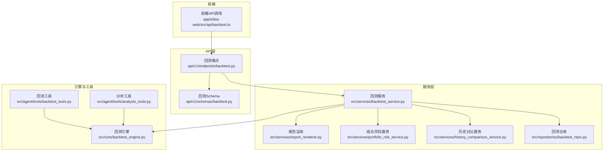

**图示来源** 
- [backtest_engine.py](file://src/core/backtest_engine.py)
- [backtest_service.py](file://src/services/backtest_service.py)
- [backtest.py（API端点）](file://api/v1/endpoints/backtest.py)
- [backtest.py（Schema定义）](file://api/v1/schemas/backtest.py)
- [backtest.py（前端API调用）](file://apps/dsa-web/src/api/backtest.ts)
- [backtest_tools.py](file://src/agent/tools/backtest_tools.py)
- [analysis_tools.py](file://src/agent/tools/analysis_tools.py)
- [report_renderer.py](file://src/services/report_renderer.py)
- [backtest_repo.py](file://src/repositories/backtest_repo.py)
- [portfolio_risk_service.py](file://src/services/portfolio_risk_service.py)
- [history_comparison_service.py](file://src/services/history_comparison_service.py)

**章节来源**
- [backtest_engine.py](file://src/core/backtest_engine.py)
- [backtest_service.py](file://src/services/backtest_service.py)
- [backtest.py（API端点）](file://api/v1/endpoints/backtest.py)
- [backtest.py（Schema定义）](file://api/v1/schemas/backtest.py)
- [backtest.py（前端API调用）](file://apps/dsa-web/src/api/backtest.ts)
- [backtest_tools.py](file://src/agent/tools/backtest_tools.py)
- [analysis_tools.py](file://src/agent/tools/analysis_tools.py)
- [report_renderer.py](file://src/services/report_renderer.py)
- [backtest_repo.py](file://src/repositories/backtest_repo.py)
- [portfolio_risk_service.py](file://src/services/portfolio_risk_service.py)
- [history_comparison_service.py](file://src/services/history_comparison_service.py)

## 核心组件
- 回测引擎：负责按交易日序列回放策略信号，生成逐笔/逐日成交、持仓与资金曲线，并计算基础绩效指标。
- 回测服务：编排回测任务、聚合指标、持久化结果、触发报告渲染与风险/对比分析。
- API端点：接收请求、校验参数、调用服务、返回结构化响应。
- 前端API：封装HTTP调用，提供统一的数据获取与提交入口。
- 报告渲染：将回测结果转换为Markdown/图片等格式，便于分享与归档。
- 风险与对比服务：提供VaR、压力测试、情景分析与多策略对比能力。
- 仓库：负责回测结果与中间数据的存储与检索。

**章节来源**
- [backtest_engine.py](file://src/core/backtest_engine.py)
- [backtest_service.py](file://src/services/backtest_service.py)
- [backtest.py（API端点）](file://api/v1/endpoints/backtest.py)
- [backtest.py（Schema定义）](file://api/v1/schemas/backtest.py)
- [backtest.py（前端API调用）](file://apps/dsa-web/src/api/backtest.ts)
- [report_renderer.py](file://src/services/report_renderer.py)
- [portfolio_risk_service.py](file://src/services/portfolio_risk_service.py)
- [history_comparison_service.py](file://src/services/history_comparison_service.py)
- [backtest_repo.py](file://src/repositories/backtest_repo.py)

## 架构总览
下图展示了从前端发起回测请求到结果导出与对比分析的端到端流程。

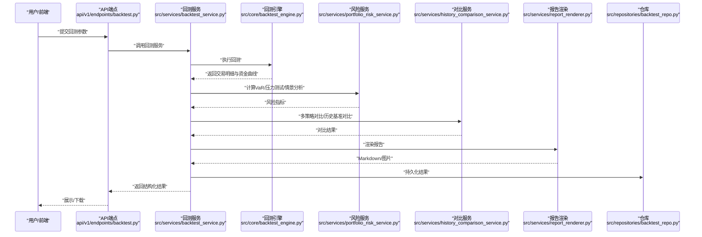

**图示来源** 
- [backtest.py（API端点）](file://api/v1/endpoints/backtest.py)
- [backtest_service.py](file://src/services/backtest_service.py)
- [backtest_engine.py](file://src/core/backtest_engine.py)
- [portfolio_risk_service.py](file://src/services/portfolio_risk_service.py)
- [history_comparison_service.py](file://src/services/history_comparison_service.py)
- [report_renderer.py](file://src/services/report_renderer.py)
- [backtest_repo.py](file://src/repositories/backtest_repo.py)

## 详细组件分析

### 回测引擎（收益与交易统计）
- 收益指标
  - 总收益率：基于期初与期末净值计算，考虑分红与调仓成本。
  - 年化收益率：将总收益率按实际交易日折算为年化值。
- 风险指标
  - 最大回撤：净值曲线的最大峰值到谷底跌幅。
  - 波动率：日收益率的标准差，并按交易日数年化。
  - 夏普比率：超额收益除以波动率，需明确无风险利率与基准。
- 交易统计
  - 胜率：盈利交易次数占总交易次数的比例。
  - 盈亏比：平均盈利金额与平均亏损金额的比值。
  - 交易次数：统计周期内开平仓事件计数。
- 收益曲线
  - 累计收益：每日净值或账户权益的累计变化。
  - 日收益率分布：直方图/核密度估计，观察偏度与厚尾。
  - 收益分解：可拆分为Alpha、Beta、行业/因子暴露贡献（若可用）。

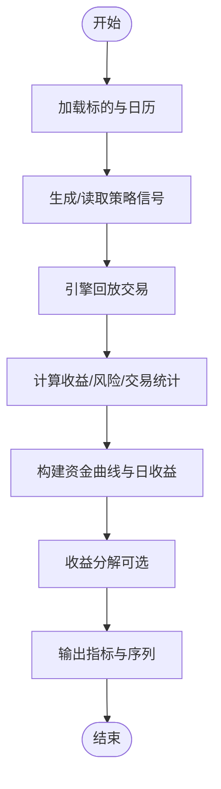

**图示来源** 
- [backtest_engine.py](file://src/core/backtest_engine.py)

**章节来源**
- [backtest_engine.py](file://src/core/backtest_engine.py)
- [test_backtest_engine.py](file://tests/test_backtest_engine.py)

### 回测服务（编排与结果管理）
- 任务编排：接收参数、校验、调度引擎、聚合指标、触发风险与对比分析。
- 结果管理：持久化交易明细、资金曲线、指标摘要；支持查询与更新。
- 报告渲染：将结果转为Markdown/图片，便于分享与归档。
- 导出能力：支持CSV、JSON等格式的批量导出，便于外部分析。

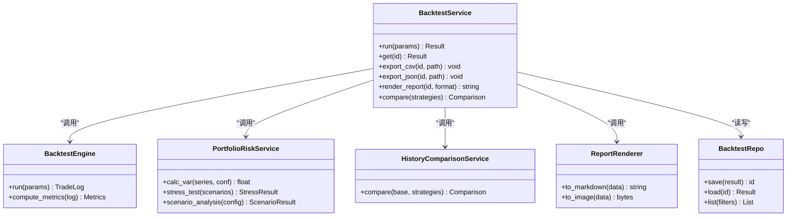

**图示来源** 
- [backtest_service.py](file://src/services/backtest_service.py)
- [backtest_engine.py](file://src/core/backtest_engine.py)
- [portfolio_risk_service.py](file://src/services/portfolio_risk_service.py)
- [history_comparison_service.py](file://src/services/history_comparison_service.py)
- [report_renderer.py](file://src/services/report_renderer.py)
- [backtest_repo.py](file://src/repositories/backtest_repo.py)

**章节来源**
- [backtest_service.py](file://src/services/backtest_service.py)
- [test_backtest_service.py](file://tests/test_backtest_service.py)

### API层与Schema（输入输出契约）
- 端点：提供创建回测、查询结果、导出文件、对比策略等接口。
- Schema：严格定义请求体与响应体字段，确保前后端一致性。
- 错误处理：统一错误码与消息，便于前端提示与日志追踪。

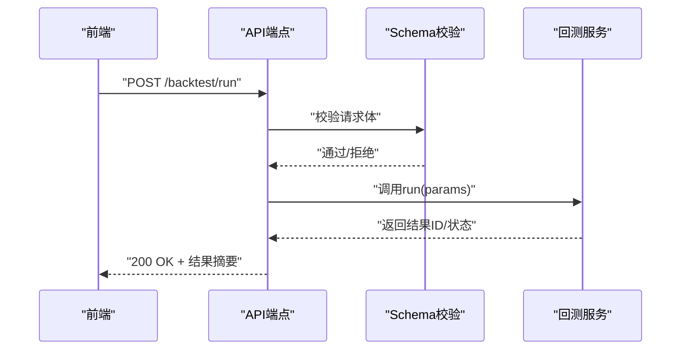

**图示来源** 
- [backtest.py（API端点）](file://api/v1/endpoints/backtest.py)
- [backtest.py（Schema定义）](file://api/v1/schemas/backtest.py)

**章节来源**
- [backtest.py（API端点）](file://api/v1/endpoints/backtest.py)
- [backtest.py（Schema定义）](file://api/v1/schemas/backtest.py)

### 前端API调用（数据交互）
- 封装HTTP请求，统一错误处理与重试逻辑。
- 提供便捷函数用于提交回测、拉取结果、导出文件、对比策略。

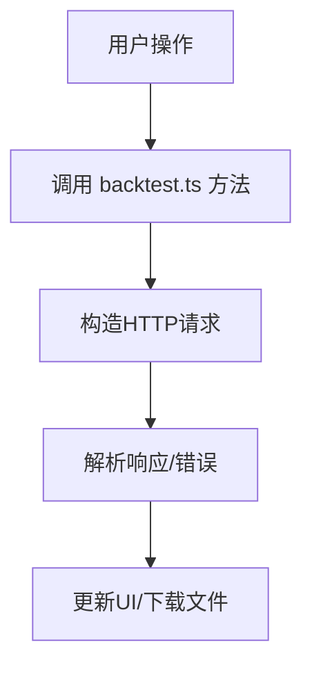

**图示来源** 
- [backtest.py（前端API调用）](file://apps/dsa-web/src/api/backtest.ts)

**章节来源**
- [backtest.py（前端API调用）](file://apps/dsa-web/src/api/backtest.ts)

### Agent工具（回测与分析）
- 回测工具：在对话或自动化流程中快速触发回测、查看结果。
- 分析工具：辅助计算指标、生成图表描述、解释结果。

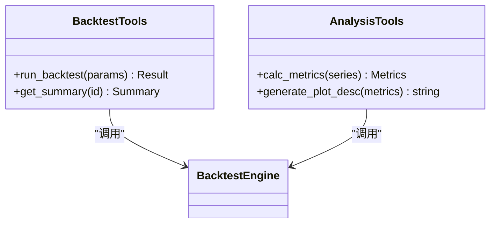

**图示来源** 
- [backtest_tools.py](file://src/agent/tools/backtest_tools.py)
- [analysis_tools.py](file://src/agent/tools/analysis_tools.py)

**章节来源**
- [backtest_tools.py](file://src/agent/tools/backtest_tools.py)
- [analysis_tools.py](file://src/agent/tools/analysis_tools.py)

### 风险评估工具（VaR、压力测试、情景分析）
- VaR计算：基于历史模拟法或参数法，给出置信水平下的潜在损失。
- 压力测试：模拟极端市场条件（如大幅下跌、流动性枯竭）对净值的影响。
- 情景分析：自定义宏观/行业情景，评估策略稳健性。

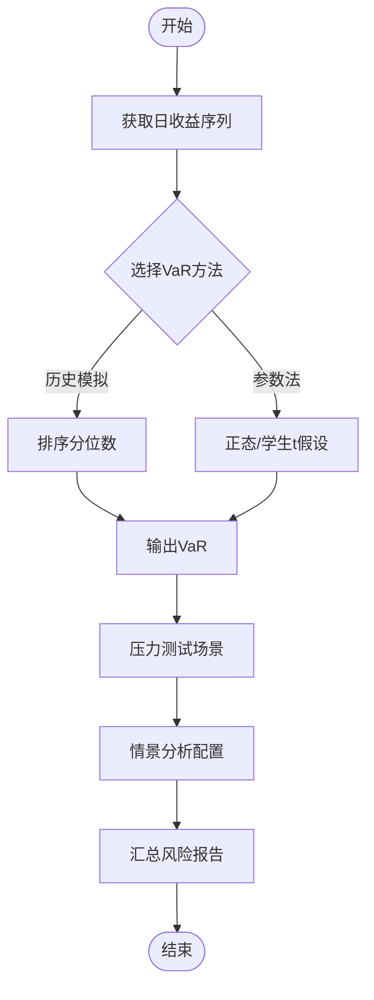

**图示来源** 
- [portfolio_risk_service.py](file://src/services/portfolio_risk_service.py)

**章节来源**
- [portfolio_risk_service.py](file://src/services/portfolio_risk_service.py)

### 结果对比与策略筛选
- 对比维度：收益、风险、交易统计、相关性、换手率、滑点影响等。
- 筛选规则：阈值过滤（如最大回撤<某值）、排序（夏普比率降序）、聚类（相似策略分组）。
- 输出：对比表格、雷达图、热力图、时间序列叠加图。

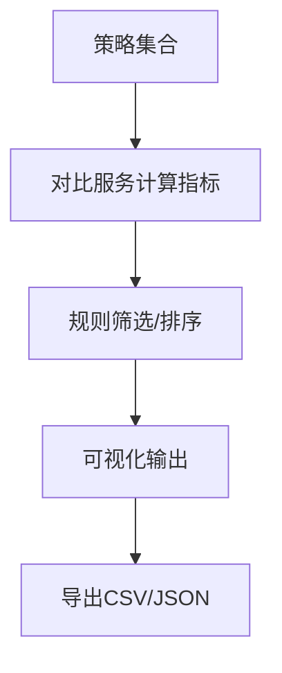

**图示来源** 
- [history_comparison_service.py](file://src/services/history_comparison_service.py)

**章节来源**
- [history_comparison_service.py](file://src/services/history_comparison_service.py)

### 可视化展示方案
- 图表类型
  - 累计收益曲线：折线图，标注关键事件（调仓、分红）。
  - 日收益率分布：直方图+核密度曲线，标注均值与分位数。
  - 回撤曲线：面积图，突出最大回撤区间。
  - 风险指标：条形图/仪表盘，显示VaR、波动率、夏普。
  - 对比图：多策略叠加折线、雷达图、热力图。
- 颜色编码
  - 收益为正用暖色（红/橙），负用冷色（蓝/绿），中性用灰。
  - 风险高亮用警示色（黄/红），基准用虚线。
- 信息层次
  - 首屏：核心指标卡片（总收益、年化、最大回撤、夏普）。
  - 次屏：曲线与分布图。
  - 末屏：明细表与导出按钮。

[本节为概念性说明，不直接分析具体文件]

### 结果导出（CSV、JSON等）
- CSV：适合Excel分析，包含交易明细、日收益、指标摘要。
- JSON：适合程序化处理，保留层级结构与元数据。
- 批量处理：支持按策略/时间段批量导出，便于离线建模。

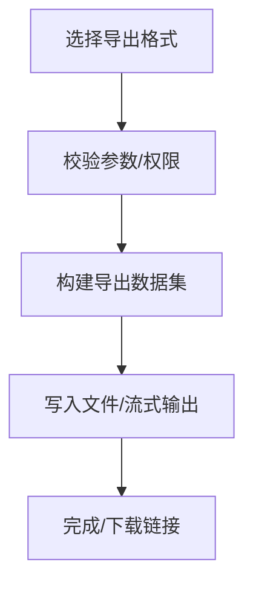

**图示来源** 
- [backtest_service.py](file://src/services/backtest_service.py)

**章节来源**
- [backtest_service.py](file://src/services/backtest_service.py)

## 依赖关系分析
- 耦合与内聚
  - 引擎与服务解耦：服务负责编排与持久化，引擎专注计算。
  - API与Schema强绑定：保证契约稳定。
  - 风险与对比服务独立：可替换实现（如不同VaR方法）。
- 外部依赖
  - 数据源：行情与日历数据。
  - 渲染：Markdown/图片库。
  - 存储：本地文件或数据库（由仓库抽象）。

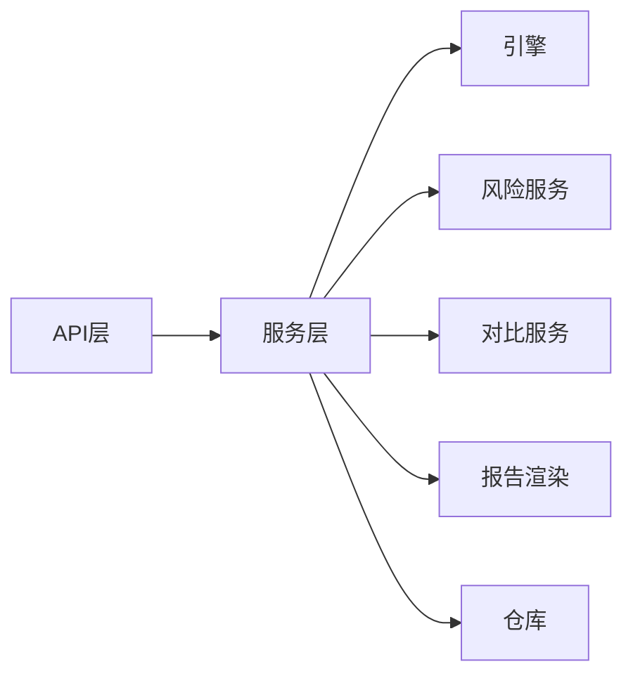

**图示来源** 
- [backtest.py（API端点）](file://api/v1/endpoints/backtest.py)
- [backtest_service.py](file://src/services/backtest_service.py)
- [backtest_engine.py](file://src/core/backtest_engine.py)
- [portfolio_risk_service.py](file://src/services/portfolio_risk_service.py)
- [history_comparison_service.py](file://src/services/history_comparison_service.py)
- [report_renderer.py](file://src/services/report_renderer.py)
- [backtest_repo.py](file://src/repositories/backtest_repo.py)

**章节来源**
- [backtest.py（API端点）](file://api/v1/endpoints/backtest.py)
- [backtest_service.py](file://src/services/backtest_service.py)
- [backtest_engine.py](file://src/core/backtest_engine.py)
- [portfolio_risk_service.py](file://src/services/portfolio_risk_service.py)
- [history_comparison_service.py](file://src/services/history_comparison_service.py)
- [report_renderer.py](file://src/services/report_renderer.py)
- [backtest_repo.py](file://src/repositories/backtest_repo.py)

## 性能考量
- 计算优化
  - 向量化计算日收益与指标，减少循环开销。
  - 增量更新：仅重算受影响区间的指标。
- I/O优化
  - 流式导出大文件，避免内存溢出。
  - 缓存常用数据（日历、基准序列）。
- 并发与异步
  - 并行回测多个策略，队列化管理任务。
  - 异步渲染报告，降低阻塞。

[本节为通用指导，不直接分析具体文件]

## 故障排查指南
- 常见问题
  - 数据缺失：检查日期对齐与停牌处理。
  - 指标异常：核对无风险利率、复权方式、手续费设置。
  - 导出失败：确认路径权限与磁盘空间。
- 定位步骤
  - 查看服务日志与错误码。
  - 使用最小数据集复现问题。
  - 逐步断点引擎与服务调用链。

**章节来源**
- [backtest_service.py](file://src/services/backtest_service.py)
- [backtest_engine.py](file://src/core/backtest_engine.py)

## 结论
本回测结果分析体系以清晰的层次划分与明确的契约设计，实现了从回测执行、指标计算、风险评估、对比分析到可视化与导出的全链路能力。通过模块化设计与可扩展的服务，用户可灵活定制指标、方法与展示形式，满足从个人研究到团队协作的多场景需求。

[本节为总结性内容，不直接分析具体文件]

## 附录
- 术语表
  - 总收益率、年化收益率、最大回撤、波动率、夏普比率、胜率、盈亏比、VaR、压力测试、情景分析。
- 参考文件
  - 引擎与服务实现、API与Schema、前端调用、报告渲染、风险与对比服务、仓库与测试用例。

[本节为补充信息，不直接分析具体文件]