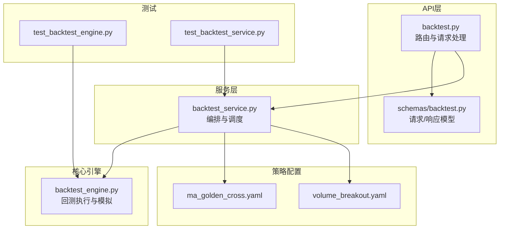
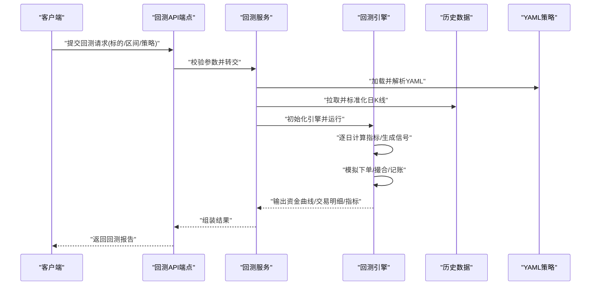
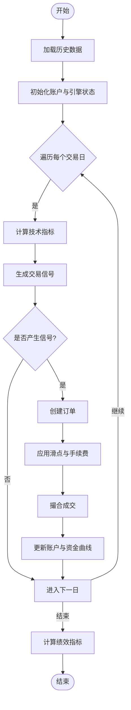
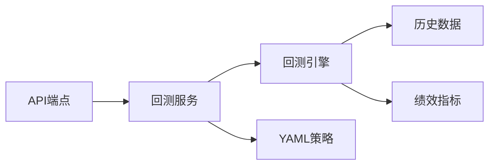

# 策略回测引擎

<cite>
**本文引用的文件**   
- [src/core/backtest_engine.py](file://src/core/backtest_engine.py)
- [api/v1/endpoints/backtest.py](file://api/v1/endpoints/backtest.py)
- [api/v1/schemas/backtest.py](file://api/v1/schemas/backtest.py)
- [services/backtest_service.py](file://services/backtest_service.py)
- [strategies/ma_golden_cross.yaml](file://strategies/ma_golden_cross.yaml)
- [strategies/volume_breakout.yaml](file://strategies/volume_breakout.yaml)
- [tests/test_backtest_engine.py](file://tests/test_backtest_engine.py)
- [tests/test_backtest_service.py](file://tests/test_backtest_service.py)
</cite>

## 目录
1. [简介](#简介)
2. [项目结构](#项目结构)
3. [核心组件](#核心组件)
4. [架构总览](#架构总览)
5. [详细组件分析](#详细组件分析)
6. [依赖关系分析](#依赖关系分析)
7. [性能考虑](#性能考虑)
8. [故障排查指南](#故障排查指南)
9. [结论](#结论)
10. [附录](#附录)

## 简介
本文件面向Daily Stock Analysis项目的“策略回测引擎”，系统性阐述其核心架构与实现要点，包括：
- 策略执行框架：如何加载YAML策略、解析参数、驱动历史数据回放并生成交易信号。
- 历史数据加载：从数据源拉取并标准化日K线数据，支撑指标计算与回测。
- 交易模拟：撮合逻辑、滑点与手续费、仓位管理与资金曲线跟踪。
- 绩效评估：收益曲线、最大回撤、夏普比率等关键指标的统计方法。
- 内置策略：均线金叉、成交量突破等YAML配置驱动的算法说明。
- 自定义策略开发：继承基类、实现信号生成与订单执行的规范。
- 性能优化：数据预处理、并行化与内存管理建议。

## 项目结构
围绕回测引擎的关键代码分布在以下模块：
- 核心引擎：src/core/backtest_engine.py
- API层：api/v1/endpoints/backtest.py、api/v1/schemas/backtest.py
- 服务层：services/backtest_service.py
- 策略定义（YAML）：strategies/*.yaml
- 测试用例：tests/test_backtest_engine.py、tests/test_backtest_service.py

图表来源
- [api/v1/endpoints/backtest.py](file://api/v1/endpoints/backtest.py)
- [api/v1/schemas/backtest.py](file://api/v1/schemas/backtest.py)
- [services/backtest_service.py](file://services/backtest_service.py)
- [src/core/backtest_engine.py](file://src/core/backtest_engine.py)
- [strategies/ma_golden_cross.yaml](file://strategies/ma_golden_cross.yaml)
- [strategies/volume_breakout.yaml](file://strategies/volume_breakout.yaml)
- [tests/test_backtest_engine.py](file://tests/test_backtest_engine.py)
- [tests/test_backtest_service.py](file://tests/test_backtest_service.py)

章节来源
- [api/v1/endpoints/backtest.py](file://api/v1/endpoints/backtest.py)
- [api/v1/schemas/backtest.py](file://api/v1/schemas/backtest.py)
- [services/backtest_service.py](file://services/backtest_service.py)
- [src/core/backtest_engine.py](file://src/core/backtest_engine.py)
- [strategies/ma_golden_cross.yaml](file://strategies/ma_golden_cross.yaml)
- [strategies/volume_breakout.yaml](file://strategies/volume_breakout.yaml)
- [tests/test_backtest_engine.py](file://tests/test_backtest_engine.py)
- [tests/test_backtest_service.py](file://tests/test_backtest_service.py)

## 核心组件
- 回测引擎（BacktestEngine）
  - 负责按时间步推进历史数据，计算技术指标，调用策略接口生成信号，执行模拟交易，记录成交与资金曲线。
  - 内部维护账户状态（现金、持仓、成本）、订单队列、成交撮合、滑点与手续费模型。
- 回测服务（BacktestService）
  - 负责编排：加载YAML策略、校验参数、准备数据、启动引擎、聚合结果、持久化报告。
- API端点（Backtest Endpoints）
  - 暴露REST接口接收回测请求，返回结构化结果（含收益曲线、指标、交易明细）。
- 策略配置（YAML）
  - 声明式定义技术指标参数、买卖条件、风控规则；由服务层解析后注入引擎。
- 测试套件
  - 覆盖引擎主流程、服务编排、边界条件与异常路径。

章节来源
- [src/core/backtest_engine.py](file://src/core/backtest_engine.py)
- [services/backtest_service.py](file://services/backtest_service.py)
- [api/v1/endpoints/backtest.py](file://api/v1/endpoints/backtest.py)
- [api/v1/schemas/backtest.py](file://api/v1/schemas/backtest.py)
- [strategies/ma_golden_cross.yaml](file://strategies/ma_golden_cross.yaml)
- [strategies/volume_breakout.yaml](file://strategies/volume_breakout.yaml)
- [tests/test_backtest_engine.py](file://tests/test_backtest_engine.py)
- [tests/test_backtest_service.py](file://tests/test_backtest_service.py)

## 架构总览
回测引擎采用分层设计：API层负责契约与校验，服务层负责编排与数据准备，核心引擎专注回测执行与模拟，策略以YAML声明式配置驱动。

图表来源
- [api/v1/endpoints/backtest.py](file://api/v1/endpoints/backtest.py)
- [services/backtest_service.py](file://services/backtest_service.py)
- [src/core/backtest_engine.py](file://src/core/backtest_engine.py)
- [strategies/ma_golden_cross.yaml](file://strategies/ma_golden_cross.yaml)
- [strategies/volume_breakout.yaml](file://strategies/volume_breakout.yaml)

## 详细组件分析

### 回测引擎（BacktestEngine）
- 职责
  - 时间步进：按交易日顺序推进，维护当前日期上下文。
  - 指标计算：根据策略配置的指标窗口与公式计算当日值。
  - 信号生成：调用策略逻辑，结合指标与价格序列产生买入/卖出信号。
  - 订单执行：将信号转为订单，应用滑点与手续费，撮合并更新账户。
  - 绩效统计：累计收益、回撤、波动率、夏普比率等。
- 关键数据结构
  - 账户状态：现金、持仓数量、平均成本、未实现盈亏。
  - 订单与成交：订单类型、数量、触发价、成交价、费用。
  - 资金曲线：每日净值序列，用于回撤与风险指标计算。
- 复杂度与性能
  - 时间复杂度O(N)，N为交易日数；指标计算可缓存滑动窗口以降低重复计算。
  - 内存占用与数据规模线性相关，可通过分块读取与惰性计算优化。

图表来源
- [src/core/backtest_engine.py](file://src/core/backtest_engine.py)

章节来源
- [src/core/backtest_engine.py](file://src/core/backtest_engine.py)

### 回测服务（BacktestService）
- 职责
  - YAML策略解析与校验：确保必需字段存在且取值合法。
  - 数据准备：统一时间戳、复权、缺失值处理、对齐多标的。
  - 引擎编排：实例化引擎、注入策略与数据、启动回测、收集结果。
  - 结果封装：将引擎输出转换为API响应结构，支持分页与过滤。
- 错误处理
  - 参数校验失败、数据不可用、策略解析异常、引擎运行时错误的捕获与上报。

章节来源
- [services/backtest_service.py](file://services/backtest_service.py)

### API端点（Backtest Endpoints）
- 职责
  - 接收HTTP请求，使用Pydantic模型进行输入校验。
  - 调用服务层执行回测，返回标准JSON响应。
  - 提供健康检查与版本信息。
- 典型请求/响应
  - 请求：标的列表、时间区间、策略名称与参数、风控参数。
  - 响应：收益曲线、交易明细、绩效指标摘要、错误信息。

章节来源
- [api/v1/endpoints/backtest.py](file://api/v1/endpoints/backtest.py)
- [api/v1/schemas/backtest.py](file://api/v1/schemas/backtest.py)

### 策略配置（YAML）
- 通用字段
  - 指标：名称、周期、阈值、比较运算符。
  - 买卖条件：入场/出场逻辑表达式或规则列表。
  - 风控：止损止盈、仓位上限、单笔最大亏损比例、最大持仓天数。
- 内置策略示例
  - 均线金叉（ma_golden_cross.yaml）
    - 指标：短期与长期移动平均线。
    - 条件：短期上穿长期时买入，下穿时卖出。
    - 风控：可选止损百分比、止盈目标、仓位控制。
  - 成交量突破（volume_breakout.yaml）
    - 指标：成交量均值与当日成交量。
    - 条件：当日成交量显著高于均值且价格突破前高时买入，跌破时卖出。
    - 风控：波动率过滤、最大回撤保护。

章节来源
- [strategies/ma_golden_cross.yaml](file://strategies/ma_golden_cross.yaml)
- [strategies/volume_breakout.yaml](file://strategies/volume_breakout.yaml)

### 自定义策略开发指南
- 步骤
  - 新建YAML策略文件，定义指标、买卖条件与风控参数。
  - 在服务层注册新策略名称，确保解析器能识别。
  - 在引擎中扩展指标库与信号处理器，支持新的表达式或规则。
  - 编写单元测试验证信号生成与成交模拟的正确性。
- 最佳实践
  - 避免未来函数：仅使用已发生数据。
  - 参数敏感性分析：对关键参数做网格搜索与稳健性检验。
  - 日志与可观测性：记录关键决策点与异常。

章节来源
- [strategies/ma_golden_cross.yaml](file://strategies/ma_golden_cross.yaml)
- [strategies/volume_breakout.yaml](file://strategies/volume_breakout.yaml)
- [services/backtest_service.py](file://services/backtest_service.py)
- [src/core/backtest_engine.py](file://src/core/backtest_engine.py)

### 绩效评估机制
- 收益曲线：基于每日净值序列计算累计收益率与年化收益。
- 最大回撤：峰值到谷底的最大跌幅，衡量极端风险。
- 夏普比率：超额收益与波动率的比值，衡量风险调整后收益。
- 其他指标：胜率、盈亏比、平均持仓时长、换手率等。

章节来源
- [src/core/backtest_engine.py](file://src/core/backtest_engine.py)

## 依赖关系分析
- 组件耦合
  - API端点依赖服务层的数据编排与结果封装。
  - 服务层依赖引擎执行与YAML策略解析。
  - 引擎依赖数据标准化与指标计算工具。
- 外部依赖
  - 数据源适配器（如yfinance、tushare等）通过服务层抽象接入。
  - 存储与报表（可选）用于持久化回测结果。

图表来源
- [api/v1/endpoints/backtest.py](file://api/v1/endpoints/backtest.py)
- [services/backtest_service.py](file://services/backtest_service.py)
- [src/core/backtest_engine.py](file://src/core/backtest_engine.py)
- [strategies/ma_golden_cross.yaml](file://strategies/ma_golden_cross.yaml)
- [strategies/volume_breakout.yaml](file://strategies/volume_breakout.yaml)

章节来源
- [api/v1/endpoints/backtest.py](file://api/v1/endpoints/backtest.py)
- [services/backtest_service.py](file://services/backtest_service.py)
- [src/core/backtest_engine.py](file://src/core/backtest_engine.py)

## 性能考虑
- 数据预处理
  - 提前复权与去噪，减少回测期重复计算。
  - 使用向量化计算（如pandas/numpy）加速指标生成。
- 并行计算
  - 多标的并行回测，利用进程池或线程池提升吞吐。
  - 指标计算与信号生成解耦，流水线化处理。
- 内存管理
  - 分块读取大文件，避免一次性加载全部数据。
  - 及时释放中间变量，使用生成器惰性求值。
- 缓存与增量更新
  - 缓存常用指标与历史快照，支持增量回测。
  - 对稳定参数组合做结果缓存，避免重复计算。

[本节为通用指导，不直接分析具体文件]

## 故障排查指南
- 常见问题
  - 参数校验失败：检查YAML必填字段与取值范围。
  - 数据不可用：确认数据源连通性与时间区间有效性。
  - 策略解析异常：核对表达式语法与指标名称。
  - 引擎运行时错误：查看日志定位信号生成或撮合阶段异常。
- 调试建议
  - 启用详细日志，记录每笔交易的触发原因与成交价。
  - 使用最小数据集复现问题，逐步扩大范围定位。
  - 对关键指标绘制时序图，观察异常点。

章节来源
- [tests/test_backtest_engine.py](file://tests/test_backtest_engine.py)
- [tests/test_backtest_service.py](file://tests/test_backtest_service.py)

## 结论
该回测引擎以分层架构与声明式策略为核心，实现了从数据加载、指标计算、信号生成到交易模拟与绩效评估的完整闭环。通过YAML配置驱动的策略体系，用户可快速迭代与扩展策略逻辑。配合合理的性能优化与完善的测试覆盖，系统具备较高的可扩展性与稳定性。

[本节为总结性内容，不直接分析具体文件]

## 附录
- 术语表
  - 均线金叉：短期均线上穿长期均线形成的买入信号。
  - 成交量突破：当日成交量显著放大并伴随价格突破的技术形态。
  - 夏普比率：衡量单位波动所获得的超额收益。
  - 最大回撤：净值从峰值到谷底的最大跌幅。
- 参考文件
  - 引擎实现：[src/core/backtest_engine.py](file://src/core/backtest_engine.py)
  - 服务编排：[services/backtest_service.py](file://services/backtest_service.py)
  - API契约：[api/v1/endpoints/backtest.py](file://api/v1/endpoints/backtest.py)、[api/v1/schemas/backtest.py](file://api/v1/schemas/backtest.py)
  - 策略配置：[strategies/ma_golden_cross.yaml](file://strategies/ma_golden_cross.yaml)、[strategies/volume_breakout.yaml](file://strategies/volume_breakout.yaml)
  - 测试用例：[tests/test_backtest_engine.py](file://tests/test_backtest_engine.py)、[tests/test_backtest_service.py](file://tests/test_backtest_service.py)