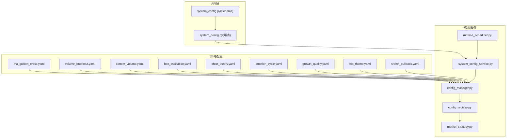
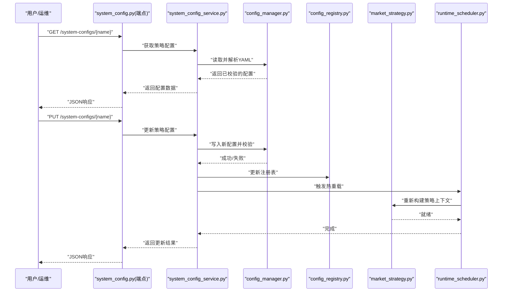

# 策略配置系统

<cite>
**本文引用的文件**   
- [strategies/ma_golden_cross.yaml](file://strategies/ma_golden_cross.yaml)
- [strategies/volume_breakout.yaml](file://strategies/volume_breakout.yaml)
- [strategies/bottom_volume.yaml](file://strategies/bottom_volume.yaml)
- [strategies/box_oscillation.yaml](file://strategies/box_oscillation.yaml)
- [strategies/chan_theory.yaml](file://strategies/chan_theory.yaml)
- [strategies/emotion_cycle.yaml](file://strategies/emotion_cycle.yaml)
- [strategies/growth_quality.yaml](file://strategies/growth_quality.yaml)
- [strategies/hot_theme.yaml](file://strategies/hot_theme.yaml)
- [strategies/shrink_pullback.yaml](file://strategies/shrink_pullback.yaml)
- [src/core/config_manager.py](file://src/core/config_manager.py)
- [src/core/config_registry.py](file://src/core/config_registry.py)
- [src/core/market_strategy.py](file://src/core/market_strategy.py)
- [api/v1/endpoints/system_config.py](file://api/v1/endpoints/system_config.py)
- [api/v1/schemas/system_config.py](file://api/v1/schemas/system_config.py)
- [src/services/system_config_service.py](file://src/services/system_config_service.py)
- [src/services/runtime_scheduler.py](file://src/services/runtime_scheduler.py)
- [tests/test_config_manager.py](file://tests/test_config_manager.py)
- [tests/test_config_registry.py](file://tests/test_config_registry.py)
- [tests/test_system_config_api.py](file://tests/test_system_config_api.py)
</cite>

## 目录
1. [简介](#简介)
2. [项目结构](#项目结构)
3. [核心组件](#核心组件)
4. [架构总览](#架构总览)
5. [详细组件分析](#详细组件分析)
6. [依赖关系分析](#依赖关系分析)
7. [性能考量](#性能考量)
8. [故障排查指南](#故障排查指南)
9. [结论](#结论)
10. [附录](#附录)

## 简介
本文件面向策略配置系统，系统性说明基于 YAML 的策略配置文件结构与字段含义，覆盖基础参数、技术指标定义、买卖条件规则与风险控制配置。文档同时解释配置验证机制、默认值处理、热重载能力以及不同交易风格（趋势跟踪、均值回归、突破交易）的完整配置示例与最佳实践。

## 项目结构
策略配置相关文件主要分布在以下位置：
- 策略模板与示例：strategies/*.yaml
- 配置加载与校验：src/core/config_manager.py、src/core/config_registry.py
- 策略执行上下文：src/core/market_strategy.py
- 系统配置 API 与 Schema：api/v1/endpoints/system_config.py、api/v1/schemas/system_config.py
- 运行时调度与热重载：src/services/runtime_scheduler.py
- 单元测试：tests/test_config_manager.py、tests/test_config_registry.py、tests/test_system_config_api.py



图表来源
- [src/core/config_manager.py](file://src/core/config_manager.py)
- [src/core/config_registry.py](file://src/core/config_registry.py)
- [src/core/market_strategy.py](file://src/core/market_strategy.py)
- [api/v1/endpoints/system_config.py](file://api/v1/endpoints/system_config.py)
- [api/v1/schemas/system_config.py](file://api/v1/schemas/system_config.py)
- [src/services/system_config_service.py](file://src/services/system_config_service.py)
- [src/services/runtime_scheduler.py](file://src/services/runtime_scheduler.py)
- [strategies/ma_golden_cross.yaml](file://strategies/ma_golden_cross.yaml)
- [strategies/volume_breakout.yaml](file://strategies/volume_breakout.yaml)
- [strategies/bottom_volume.yaml](file://strategies/bottom_volume.yaml)
- [strategies/box_oscillation.yaml](file://strategies/box_oscillation.yaml)
- [strategies/chan_theory.yaml](file://strategies/chan_theory.yaml)
- [strategies/emotion_cycle.yaml](file://strategies/emotion_cycle.yaml)
- [strategies/growth_quality.yaml](file://strategies/growth_quality.yaml)
- [strategies/hot_theme.yaml](file://strategies/hot_theme.yaml)
- [strategies/shrink_pullback.yaml](file://strategies/shrink_pullback.yaml)

章节来源
- [src/core/config_manager.py](file://src/core/config_manager.py)
- [src/core/config_registry.py](file://src/core/config_registry.py)
- [src/core/market_strategy.py](file://src/core/market_strategy.py)
- [api/v1/endpoints/system_config.py](file://api/v1/endpoints/system_config.py)
- [api/v1/schemas/system_config.py](file://api/v1/schemas/system_config.py)
- [src/services/system_config_service.py](file://src/services/system_config_service.py)
- [src/services/runtime_scheduler.py](file://src/services/runtime_scheduler.py)

## 核心组件
- 配置管理器（ConfigManager）：负责 YAML 文件的读取、解析、合并默认值、类型校验与错误提示；提供获取指定策略配置的接口。
- 配置注册表（ConfigRegistry）：维护策略名称到配置路径或实例的映射，支持按名称检索与更新。
- 市场策略（MarketStrategy）：将配置转换为策略运行所需的上下文对象，供回测与实盘引擎消费。
- 系统配置服务（SystemConfigService）：封装对配置管理器的调用，暴露统一的配置查询与更新方法。
- 运行时调度器（RuntimeScheduler）：监听配置变更事件，触发热重载流程，确保策略参数在运行时生效。
- API 层（system_config.py 端点与 Schema）：对外提供 RESTful 接口，用于获取、校验、更新策略配置，并返回结构化响应。

章节来源
- [src/core/config_manager.py](file://src/core/config_manager.py)
- [src/core/config_registry.py](file://src/core/config_registry.py)
- [src/core/market_strategy.py](file://src/core/market_strategy.py)
- [src/services/system_config_service.py](file://src/services/system_config_service.py)
- [src/services/runtime_scheduler.py](file://src/services/runtime_scheduler.py)
- [api/v1/endpoints/system_config.py](file://api/v1/endpoints/system_config.py)
- [api/v1/schemas/system_config.py](file://api/v1/schemas/system_config.py)

## 架构总览
下图展示从 YAML 配置到策略执行的端到端流程，包括加载、校验、注册、转换与热重载。



图表来源
- [api/v1/endpoints/system_config.py](file://api/v1/endpoints/system_config.py)
- [src/services/system_config_service.py](file://src/services/system_config_service.py)
- [src/core/config_manager.py](file://src/core/config_manager.py)
- [src/core/config_registry.py](file://src/core/config_registry.py)
- [src/core/market_strategy.py](file://src/core/market_strategy.py)
- [src/services/runtime_scheduler.py](file://src/services/runtime_scheduler.py)

## 详细组件分析

### 组件A：配置管理器（ConfigManager）
职责与行为
- 读取 YAML 文件并解析为字典结构。
- 应用默认值与字段校验，缺失必填项时给出明确错误信息。
- 支持多策略配置合并与覆盖。
- 提供按策略名称获取配置的方法。

关键数据结构与复杂度
- 配置模型：以字典表示，键为字段名，值为标量或嵌套结构。
- 校验过程时间复杂度近似 O(N)，N 为字段数量；空间复杂度 O(N)。

依赖链
- 依赖文件系统读取 YAML。
- 被 SystemConfigService 调用。
- 向 ConfigRegistry 提供配置实例。

优化机会
- 缓存已加载的配置，避免重复 IO。
- 增量校验仅针对变更字段。

错误处理
- 文件不存在、格式错误、类型不匹配等场景均抛出可捕获异常，并提供可读的错误消息。

章节来源
- [src/core/config_manager.py](file://src/core/config_manager.py)
- [tests/test_config_manager.py](file://tests/test_config_manager.py)

### 组件B：配置注册表（ConfigRegistry）
职责与行为
- 维护策略名称到配置对象的映射。
- 支持新增、更新、删除策略配置。
- 提供线程安全的访问接口。

关键数据结构与复杂度
- 内部使用哈希表存储，查找与更新平均时间复杂度 O(1)。

依赖链
- 由 SystemConfigService 更新。
- 被 MarketStrategy 读取以构建上下文。

优化机会
- 引入版本化快照，便于回滚与审计。

错误处理
- 非法策略名、重复注册等场景返回明确错误码。

章节来源
- [src/core/config_registry.py](file://src/core/config_registry.py)
- [tests/test_config_registry.py](file://tests/test_config_registry.py)

### 组件C：市场策略（MarketStrategy）
职责与行为
- 将配置转换为策略上下文对象，包含指标计算参数、买卖条件与风控参数。
- 提供统一接口供回测与实盘引擎调用。

关键数据结构与复杂度
- 上下文对象包含多个子结构（如指标、信号、风控），构造复杂度与字段数量线性相关。

依赖链
- 依赖 ConfigRegistry 获取最新配置。
- 被 RuntimeScheduler 在热重载时重建。

优化机会
- 懒加载指标计算，按需初始化。

错误处理
- 配置不完整或缺少必要字段时拒绝构建上下文并返回错误原因。

章节来源
- [src/core/market_strategy.py](file://src/core/market_strategy.py)

### 组件D：系统配置服务（SystemConfigService）
职责与行为
- 封装对 ConfigManager 与 ConfigRegistry 的调用。
- 提供统一的配置查询、更新与校验接口。
- 协调热重载流程。

关键数据结构与复杂度
- 输入输出均为结构化数据（Pydantic Schema），序列化/反序列化开销与字段规模线性相关。

依赖链
- 依赖 ConfigManager 进行文件级读写与校验。
- 依赖 ConfigRegistry 进行内存态映射更新。
- 依赖 RuntimeScheduler 触发热重载。

优化机会
- 批量更新时使用事务式提交，保证一致性。

错误处理
- 对外返回标准化错误响应，包含错误码与描述。

章节来源
- [src/services/system_config_service.py](file://src/services/system_config_service.py)
- [api/v1/schemas/system_config.py](file://api/v1/schemas/system_config.py)

### 组件E：运行时调度器（RuntimeScheduler）
职责与行为
- 监听配置变更事件。
- 触发热重载，重建策略上下文。
- 保障并发安全与幂等性。

关键数据结构与复杂度
- 事件队列与任务调度，复杂度取决于事件频率与处理耗时。

依赖链
- 依赖 SystemConfigService 获取最新配置。
- 依赖 MarketStrategy 重建上下文。

优化机会
- 去重与节流，避免频繁重载。

错误处理
- 重载失败时记录日志并通知上层，保持旧上下文可用。

章节来源
- [src/services/runtime_scheduler.py](file://src/services/runtime_scheduler.py)

### 组件F：API 层（system_config.py 端点与 Schema）
职责与行为
- 暴露 RESTful 接口，用于获取与更新策略配置。
- 使用 Pydantic Schema 进行请求体校验与响应格式化。

关键数据结构与复杂度
- Schema 定义字段类型、范围与必填项，校验复杂度与字段数量线性相关。

依赖链
- 调用 SystemConfigService 执行业务逻辑。
- 返回结构化 JSON 响应。

优化机会
- 增加缓存与 ETag，减少重复请求。

错误处理
- 统一错误码与消息，便于前端处理。

章节来源
- [api/v1/endpoints/system_config.py](file://api/v1/endpoints/system_config.py)
- [api/v1/schemas/system_config.py](file://api/v1/schemas/system_config.py)
- [tests/test_system_config_api.py](file://tests/test_system_config_api.py)

## 依赖关系分析
```mermaid
classDiagram
class ConfigManager {
+load_yaml(path) dict
+validate(config) bool
+get(name) dict
}
class ConfigRegistry {
+register(name, config) void
+update(name, config) void
+get(name) dict
}
class MarketStrategy {
+build_context(config) Context
+run(context) Signal
}
class SystemConfigService {
+get_config(name) dict
+update_config(name, data) bool
+reload(name) void
}
class RuntimeScheduler {
+on_config_change(name) void
+trigger_reload(name) void
}
class SystemConfigAPI {
+GET /system-configs/{name}
+PUT /system-configs/{name}
}
SystemConfigAPI --> SystemConfigService : "调用"
SystemConfigService --> ConfigManager : "读取/校验"
SystemConfigService --> ConfigRegistry : "更新映射"
SystemConfigService --> RuntimeScheduler : "触发热重载"
RuntimeScheduler --> MarketStrategy : "重建上下文"
MarketStrategy --> ConfigRegistry : "读取配置"
```

图表来源
- [src/core/config_manager.py](file://src/core/config_manager.py)
- [src/core/config_registry.py](file://src/core/config_registry.py)
- [src/core/market_strategy.py](file://src/core/market_strategy.py)
- [src/services/system_config_service.py](file://src/services/system_config_service.py)
- [src/services/runtime_scheduler.py](file://src/services/runtime_scheduler.py)
- [api/v1/endpoints/system_config.py](file://api/v1/endpoints/system_config.py)

章节来源
- [src/core/config_manager.py](file://src/core/config_manager.py)
- [src/core/config_registry.py](file://src/core/config_registry.py)
- [src/core/market_strategy.py](file://src/core/market_strategy.py)
- [src/services/system_config_service.py](file://src/services/system_config_service.py)
- [src/services/runtime_scheduler.py](file://src/services/runtime_scheduler.py)
- [api/v1/endpoints/system_config.py](file://api/v1/endpoints/system_config.py)

## 性能考量
- 配置加载与校验：建议对常用策略配置进行内存缓存，避免重复 IO 与解析。
- 热重载：采用事件驱动与节流机制，避免高频更新导致频繁重建上下文。
- 并发安全：注册表与服务层需保证线程安全，必要时使用锁或不可变快照。
- 序列化开销：Schema 校验与 JSON 序列化应尽量减少不必要的深拷贝。

[本节为通用指导，不直接分析具体文件]

## 故障排查指南
常见问题与定位步骤
- YAML 格式错误：检查缩进与键值语法，确认必填字段存在且类型正确。
- 校验失败：查看错误消息中的字段名与期望类型，修正后重试。
- 热重载未生效：确认事件是否触发、调度器是否正常运行、上下文重建是否成功。
- API 返回错误：检查请求体是否符合 Schema 定义，关注状态码与错误描述。

定位工具
- 使用测试用例快速复现问题：tests/test_config_manager.py、tests/test_config_registry.py、tests/test_system_config_api.py。
- 查看服务日志，确认加载、校验、更新与重载流程的关键节点。

章节来源
- [tests/test_config_manager.py](file://tests/test_config_manager.py)
- [tests/test_config_registry.py](file://tests/test_config_registry.py)
- [tests/test_system_config_api.py](file://tests/test_system_config_api.py)

## 结论
策略配置系统通过清晰的 YAML 结构、严格的校验与默认值处理、以及运行时热重载能力，实现了灵活、可靠与高效的策略参数管理。结合 API 层与调度器，可在不中断服务的情况下动态调整策略行为，满足不同交易风格的实战需求。

[本节为总结性内容，不直接分析具体文件]

## 附录

### YAML 策略配置结构说明
以下为策略配置的核心字段分类与取值范围说明（字段名与层级以实际 YAML 为准）：
- 基础参数
  - strategy_name：策略名称，字符串，唯一标识。
  - version：配置版本，字符串或数字，用于兼容性与回滚。
  - universe：标的范围，数组或字符串，支持通配符或代码列表。
  - timeframe：周期，枚举，如日线、小时线等。
- 技术指标定义
  - indicators：指标集合，包含均线、波动率、动量等。
    - ma：均线周期，整数，常见取值如 5、10、20、60、120、250。
    - rsi：RSI 周期与阈值，整数与浮点数，典型周期 6/14/21，超买/超卖阈值 70/30。
    - bollinger：布林带周期与带宽，整数与浮点数，典型周期 20，带宽 2.0。
    - volume_threshold：成交量阈值，浮点数，相对历史均量的倍数。
- 买卖条件规则
  - entry_rules：买入条件，布尔表达式或规则列表。
  - exit_rules：卖出条件，布尔表达式或规则列表。
  - filters：过滤条件，如市值、流动性、涨跌停限制等。
- 风险控制配置
  - stop_loss：止损比例或价格，浮点数或绝对值。
  - take_profit：止盈比例或价格，浮点数或绝对值。
  - max_position：最大仓位比例，浮点数 0~1。
  - risk_per_trade：单笔风险占比，浮点数 0~1。
  - drawdown_limit：回撤上限，浮点数 0~1。

字段校验与默认值
- 必填字段缺失将触发校验错误。
- 可选字段未提供时使用默认值，默认值由配置管理器定义。
- 数值字段有上下限约束，越界将报错。

章节来源
- [src/core/config_manager.py](file://src/core/config_manager.py)
- [src/core/config_registry.py](file://src/core/config_registry.py)
- [api/v1/schemas/system_config.py](file://api/v1/schemas/system_config.py)

### 不同交易风格的配置示例
- 趋势跟踪（均线金叉）
  - 重点：中长期均线组合、趋势强度过滤、移动止损。
  - 参考模板：[strategies/ma_golden_cross.yaml](file://strategies/ma_golden_cross.yaml)
- 突破交易（放量突破）
  - 重点：价格突破区间、成交量放大阈值、假突破过滤。
  - 参考模板：[strategies/volume_breakout.yaml](file://strategies/volume_breakout.yaml)
- 均值回归（箱体震荡）
  - 重点：箱体边界、RSI 超买超卖、均值回归信号。
  - 参考模板：[strategies/box_oscillation.yaml](file://strategies/box_oscillation.yaml)
- 底部放量（缩量回调）
  - 重点：底部放量确认、缩量回调买点、严格止损。
  - 参考模板：[strategies/bottom_volume.yaml](file://strategies/bottom_volume.yaml)、[strategies/shrink_pullback.yaml](file://strategies/shrink_pullback.yaml)
- 缠论与情绪周期
  - 重点：分型与笔、情绪周期拐点、共振信号。
  - 参考模板：[strategies/chan_theory.yaml](file://strategies/chan_theory.yaml)、[strategies/emotion_cycle.yaml](file://strategies/emotion_cycle.yaml)
- 成长质量与热点主题
  - 重点：基本面筛选、财务质量因子、热点轮动。
  - 参考模板：[strategies/growth_quality.yaml](file://strategies/growth_quality.yaml)、[strategies/hot_theme.yaml](file://strategies/hot_theme.yaml)

章节来源
- [strategies/ma_golden_cross.yaml](file://strategies/ma_golden_cross.yaml)
- [strategies/volume_breakout.yaml](file://strategies/volume_breakout.yaml)
- [strategies/bottom_volume.yaml](file://strategies/bottom_volume.yaml)
- [strategies/box_oscillation.yaml](file://strategies/box_oscillation.yaml)
- [strategies/chan_theory.yaml](file://strategies/chan_theory.yaml)
- [strategies/emotion_cycle.yaml](file://strategies/emotion_cycle.yaml)
- [strategies/growth_quality.yaml](file://strategies/growth_quality.yaml)
- [strategies/hot_theme.yaml](file://strategies/hot_theme.yaml)
- [strategies/shrink_pullback.yaml](file://strategies/shrink_pullback.yaml)

### 配置验证机制与默认值处理
- 验证流程
  - 读取 YAML → 解析为字典 → 应用默认值 → 字段类型与范围校验 → 生成错误报告。
- 默认值策略
  - 可选字段缺失时自动填充默认值，确保策略可运行。
  - 默认值集中管理，便于统一调整与版本演进。
- 错误反馈
  - 明确指出缺失字段、类型错误与越界值，辅助快速修复。

章节来源
- [src/core/config_manager.py](file://src/core/config_manager.py)
- [tests/test_config_manager.py](file://tests/test_config_manager.py)

### 配置热重载功能
- 触发方式
  - 通过 API 更新配置后，系统自动触发热重载。
  - 支持外部事件源（如文件监控）触发。
- 重载流程
  - 接收更新 → 校验新配置 → 更新注册表 → 重建策略上下文 → 切换至新配置。
- 安全性
  - 重载失败保留旧上下文，避免服务中断。
  - 支持幂等与去重，防止重复重载。

章节来源
- [src/services/system_config_service.py](file://src/services/system_config_service.py)
- [src/services/runtime_scheduler.py](file://src/services/runtime_scheduler.py)
- [api/v1/endpoints/system_config.py](file://api/v1/endpoints/system_config.py)

### 最佳实践指南
- 字段命名与分层清晰，便于维护与扩展。
- 合理设置默认值，降低配置复杂度。
- 使用版本控制管理配置变更，便于回溯与协作。
- 在测试环境充分验证配置有效性后再上线。
- 定期审查风控参数，确保与市场波动匹配。

[本节为通用指导，不直接分析具体文件]