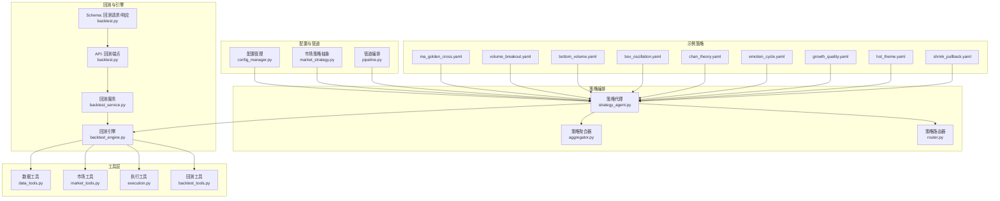
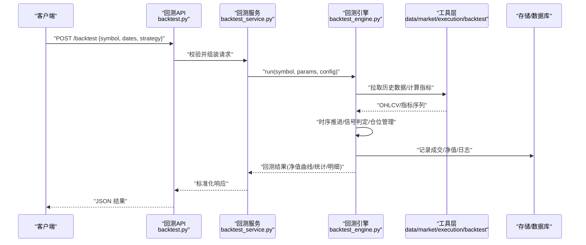
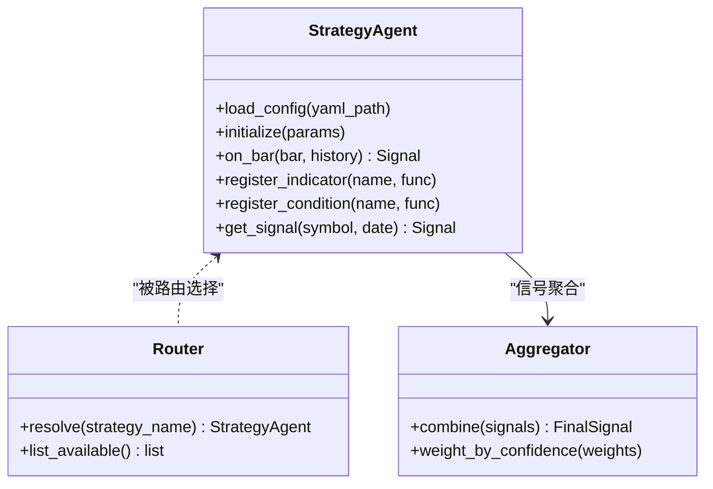
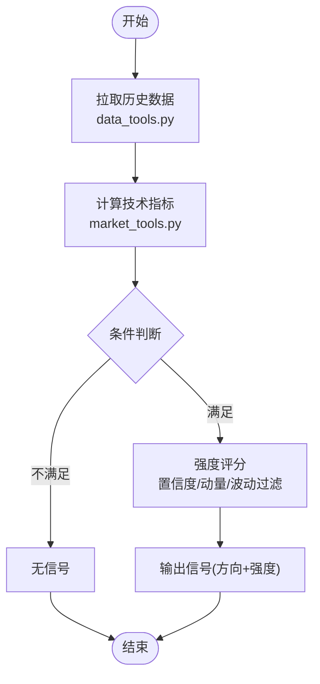
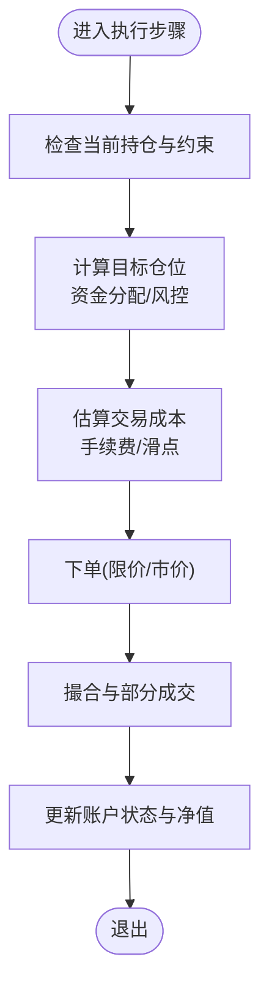
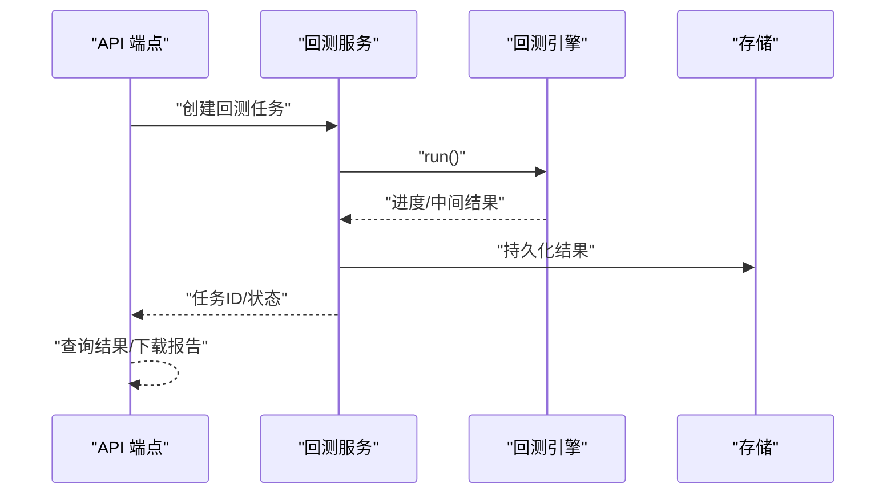
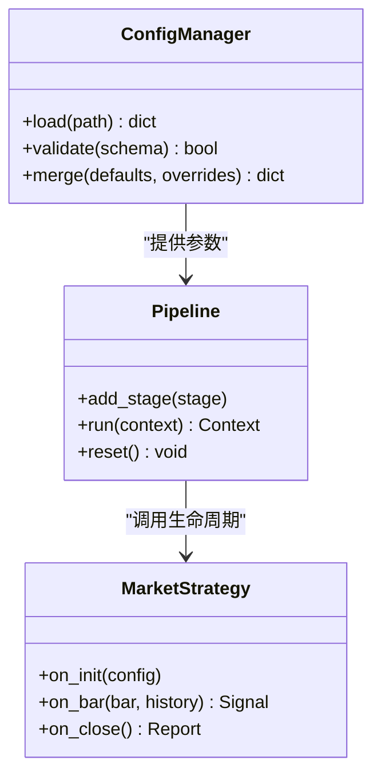
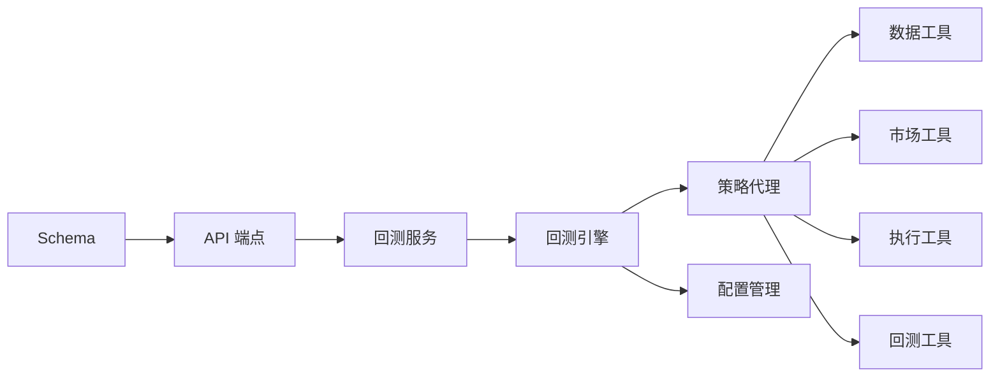

# 自定义策略开发

<cite>
**本文档引用的文件**   
- [src/agent/strategies/aggregator.py](file://src/agent/strategies/aggregator.py)
- [src/agent/strategies/router.py](file://src/agent/strategies/router.py)
- [src/agent/strategies/strategy_agent.py](file://src/agent/strategies/strategy_agent.py)
- [src/core/backtest_engine.py](file://src/core/backtest_engine.py)
- [src/services/backtest_service.py](file://src/services/backtest_service.py)
- [api/v1/endpoints/backtest.py](file://api/v1/endpoints/backtest.py)
- [api/v1/schemas/backtest.py](file://api/v1/schemas/backtest.py)
- [src/agent/tools/backtest_tools.py](file://src/agent/tools/backtest_tools.py)
- [src/agent/tools/execution.py](file://src/agent/tools/execution.py)
- [src/agent/tools/market_tools.py](file://src/agent/tools/market_tools.py)
- [src/agent/tools/data_tools.py](file://src/agent/tools/data_tools.py)
- [src/core/pipeline.py](file://src/core/pipeline.py)
- [src/core/config_manager.py](file://src/core/config_manager.py)
- [src/core/market_strategy.py](file://src/core/market_strategy.py)
- [tests/test_backtest_engine.py](file://tests/test_backtest_engine.py)
- [tests/test_backtest_service.py](file://tests/test_backtest_service.py)
- [strategies/ma_golden_cross.yaml](file://strategies/ma_golden_cross.yaml)
- [strategies/volume_breakout.yaml](file://strategies/volume_breakout.yaml)
- [strategies/bottom_volume.yaml](file://strategies/bottom_volume.yaml)
- [strategies/box_oscillation.yaml](file://strategies/box_oscillation.yaml)
- [strategies/chan_theory.yaml](file://strategies/chan_theory.yaml)
- [strategies/emotion_cycle.yaml](file://strategies/emotion_cycle.yaml)
- [strategies/growth_quality.yaml](file://strategies/growth_quality.yaml)
- [strategies/hot_theme.yaml](file://strategies/hot_theme.yaml)
- [strategies/shrink_pullback.yaml](file://strategies/shrink_pullback.yaml)
</cite>

## 目录
1. [简介](#简介)
2. [项目结构](#项目结构)
3. [核心组件](#核心组件)
4. [架构总览](#架构总览)
5. [详细组件分析](#详细组件分析)
6. [依赖关系分析](#依赖关系分析)
7. [性能考虑](#性能考虑)
8. [故障排查指南](#故障排查指南)
9. [结论](#结论)
10. [附录](#附录)

## 简介
本指南面向希望在系统中实现“自定义策略”的开发者，覆盖从策略基类与接口、信号生成逻辑、订单执行模拟，到调试测试、性能优化以及回测验证的全流程。系统采用“策略即配置 + 工具化计算 + 引擎驱动”的设计：通过 YAML 定义策略参数与规则，由策略代理统一编排；技术指标与数据获取封装在工具层；回测引擎负责时序推进、仓位管理与交易成本模拟；API 与服务层提供对外调用与结果持久化。

## 项目结构
围绕策略开发与回测的关键目录与文件如下：
- 策略编排与路由：src/agent/strategies/*
- 回测引擎与服务：src/core/backtest_engine.py、src/services/backtest_service.py
- API 与 Schema：api/v1/endpoints/backtest.py、api/v1/schemas/backtest.py
- 工具层（数据、市场、执行）：src/agent/tools/*
- 管道与配置：src/core/pipeline.py、src/core/config_manager.py、src/core/market_strategy.py
- 示例策略配置：strategies/*.yaml
- 测试用例：tests/test_backtest_engine.py、tests/test_backtest_service.py

图表来源
- [src/agent/strategies/strategy_agent.py](file://src/agent/strategies/strategy_agent.py)
- [src/agent/strategies/aggregator.py](file://src/agent/strategies/aggregator.py)
- [src/agent/strategies/router.py](file://src/agent/strategies/router.py)
- [src/core/backtest_engine.py](file://src/core/backtest_engine.py)
- [src/services/backtest_service.py](file://src/services/backtest_service.py)
- [api/v1/endpoints/backtest.py](file://api/v1/endpoints/backtest.py)
- [api/v1/schemas/backtest.py](file://api/v1/schemas/backtest.py)
- [src/agent/tools/data_tools.py](file://src/agent/tools/data_tools.py)
- [src/agent/tools/market_tools.py](file://src/agent/tools/market_tools.py)
- [src/agent/tools/execution.py](file://src/agent/tools/execution.py)
- [src/agent/tools/backtest_tools.py](file://src/agent/tools/backtest_tools.py)
- [src/core/config_manager.py](file://src/core/config_manager.py)
- [src/core/market_strategy.py](file://src/core/market_strategy.py)
- [src/core/pipeline.py](file://src/core/pipeline.py)
- [strategies/ma_golden_cross.yaml](file://strategies/ma_golden_cross.yaml)
- [strategies/volume_breakout.yaml](file://strategies/volume_breakout.yaml)
- [strategies/bottom_volume.yaml](file://strategies/bottom_volume.yaml)
- [strategies/box_oscillation.yaml](file://strategies/box_oscillation.yaml)
- [strategies/chan_theory.yaml](file://strategies/chan_theory.yaml)
- [strategies/emotion_cycle.yaml](file://strategies/emotion_cycle.yaml)
- [strategies/growth_quality.yaml](file://strategies/growth_quality.yaml)
- [strategies/hot_theme.yaml](file://strategies/hot_theme.yaml)
- [strategies/shrink_pullback.yaml](file://strategies/shrink_pullback.yaml)

章节来源
- [src/agent/strategies/strategy_agent.py](file://src/agent/strategies/strategy_agent.py)
- [src/core/backtest_engine.py](file://src/core/backtest_engine.py)
- [src/services/backtest_service.py](file://src/services/backtest_service.py)
- [api/v1/endpoints/backtest.py](file://api/v1/endpoints/backtest.py)
- [api/v1/schemas/backtest.py](file://api/v1/schemas/backtest.py)
- [src/agent/tools/data_tools.py](file://src/agent/tools/data_tools.py)
- [src/agent/tools/market_tools.py](file://src/agent/tools/market_tools.py)
- [src/agent/tools/execution.py](file://src/agent/tools/execution.py)
- [src/agent/tools/backtest_tools.py](file://src/agent/tools/backtest_tools.py)
- [src/core/config_manager.py](file://src/core/config_manager.py)
- [src/core/market_strategy.py](file://src/core/market_strategy.py)
- [src/core/pipeline.py](file://src/core/pipeline.py)
- [strategies/ma_golden_cross.yaml](file://strategies/ma_golden_cross.yaml)
- [strategies/volume_breakout.yaml](file://strategies/volume_breakout.yaml)
- [strategies/bottom_volume.yaml](file://strategies/bottom_volume.yaml)
- [strategies/box_oscillation.yaml](file://strategies/box_oscillation.yaml)
- [strategies/chan_theory.yaml](file://strategies/chan_theory.yaml)
- [strategies/emotion_cycle.yaml](file://strategies/emotion_cycle.yaml)
- [strategies/growth_quality.yaml](file://strategies/growth_quality.yaml)
- [strategies/hot_theme.yaml](file://strategies/hot_theme.yaml)
- [strategies/shrink_pullback.yaml](file://strategies/shrink_pullback.yaml)

## 核心组件
- 策略代理与路由：负责加载 YAML 策略、解析参数、按时间步调度指标计算与条件判断，并输出信号强度与方向。
- 回测引擎：维护账户状态、持仓、资金、滑点与手续费，按交易日推进，执行策略信号，记录成交与净值曲线。
- 回测服务与 API：将用户请求校验、参数组装、调用引擎、持久化结果与返回标准化响应。
- 工具层：数据拉取与清洗、市场上下文构建、执行模拟（下单、撤单、成交撮合）、回测辅助函数。
- 配置与管道：集中管理策略与系统配置，串联数据、策略、风控与报告等阶段。

章节来源
- [src/agent/strategies/strategy_agent.py](file://src/agent/strategies/strategy_agent.py)
- [src/core/backtest_engine.py](file://src/core/backtest_engine.py)
- [src/services/backtest_service.py](file://src/services/backtest_service.py)
- [api/v1/endpoints/backtest.py](file://api/v1/endpoints/backtest.py)
- [api/v1/schemas/backtest.py](file://api/v1/schemas/backtest.py)
- [src/agent/tools/data_tools.py](file://src/agent/tools/data_tools.py)
- [src/agent/tools/market_tools.py](file://src/agent/tools/market_tools.py)
- [src/agent/tools/execution.py](file://src/agent/tools/execution.py)
- [src/agent/tools/backtest_tools.py](file://src/agent/tools/backtest_tools.py)
- [src/core/config_manager.py](file://src/core/config_manager.py)
- [src/core/pipeline.py](file://src/core/pipeline.py)

## 架构总览
下图展示了从 API 请求到策略执行与回测结果的完整链路。

图表来源
- [api/v1/endpoints/backtest.py](file://api/v1/endpoints/backtest.py)
- [src/services/backtest_service.py](file://src/services/backtest_service.py)
- [src/core/backtest_engine.py](file://src/core/backtest_engine.py)
- [src/agent/tools/data_tools.py](file://src/agent/tools/data_tools.py)
- [src/agent/tools/market_tools.py](file://src/agent/tools/market_tools.py)
- [src/agent/tools/execution.py](file://src/agent/tools/execution.py)
- [src/agent/tools/backtest_tools.py](file://src/agent/tools/backtest_tools.py)

## 详细组件分析

### 策略代理与路由（继承框架与扩展点）
- 策略代理负责加载 YAML 策略、初始化参数、注册指标与条件模块，并在每个时间步触发信号生成。
- 路由器根据策略名称或类型选择具体实现，支持多策略并行与权重聚合。
- 聚合器对多个子策略的信号进行融合，输出最终的方向与强度。

图表来源
- [src/agent/strategies/strategy_agent.py](file://src/agent/strategies/strategy_agent.py)
- [src/agent/strategies/router.py](file://src/agent/strategies/router.py)
- [src/agent/strategies/aggregator.py](file://src/agent/strategies/aggregator.py)

章节来源
- [src/agent/strategies/strategy_agent.py](file://src/agent/strategies/strategy_agent.py)
- [src/agent/strategies/router.py](file://src/agent/strategies/router.py)
- [src/agent/strategies/aggregator.py](file://src/agent/strategies/aggregator.py)

### 信号生成逻辑（技术指标、条件判断与强度评估）
- 技术指标计算：通过数据工具与市场工具计算均线、波动率、成交量、趋势与形态等指标，支持向量化与缓存。
- 条件判断：基于阈值、交叉、区间、形态识别等规则组合，形成布尔信号与置信度评分。
- 信号强度评估：结合多因子加权、动量确认、波动过滤，输出[-1,1]或[0,1]的强度值，便于后续仓位控制。

图表来源
- [src/agent/tools/data_tools.py](file://src/agent/tools/data_tools.py)
- [src/agent/tools/market_tools.py](file://src/agent/tools/market_tools.py)
- [src/agent/strategies/strategy_agent.py](file://src/agent/strategies/strategy_agent.py)

章节来源
- [src/agent/tools/data_tools.py](file://src/agent/tools/data_tools.py)
- [src/agent/tools/market_tools.py](file://src/agent/tools/market_tools.py)
- [src/agent/strategies/strategy_agent.py](file://src/agent/strategies/strategy_agent.py)

### 订单执行模拟（仓位管理、资金分配与交易成本）
- 账户状态：现金、持仓、可用保证金、风险敞口。
- 仓位管理：固定比例、凯利分数、波动率目标、最大回撤限制。
- 交易成本：手续费、印花税、滑点模型（按价格分位数或固定点数）。
- 撮合逻辑：限价/市价、部分成交、成交队列与延迟模拟。

图表来源
- [src/agent/tools/execution.py](file://src/agent/tools/execution.py)
- [src/agent/tools/backtest_tools.py](file://src/agent/tools/backtest_tools.py)
- [src/core/backtest_engine.py](file://src/core/backtest_engine.py)

章节来源
- [src/agent/tools/execution.py](file://src/agent/tools/execution.py)
- [src/agent/tools/backtest_tools.py](file://src/agent/tools/backtest_tools.py)
- [src/core/backtest_engine.py](file://src/core/backtest_engine.py)

### 回测引擎与服务（时序推进、结果持久化与API）
- 引擎职责：按交易日推进、调用策略代理生成信号、执行模拟、记录净值与成交明细。
- 服务职责：接收 API 请求、校验参数、启动引擎、保存结果与错误信息。
- API 职责：暴露 REST 接口，统一输入输出格式，支持批量与异步任务。

图表来源
- [api/v1/endpoints/backtest.py](file://api/v1/endpoints/backtest.py)
- [src/services/backtest_service.py](file://src/services/backtest_service.py)
- [src/core/backtest_engine.py](file://src/core/backtest_engine.py)

章节来源
- [api/v1/endpoints/backtest.py](file://api/v1/endpoints/backtest.py)
- [src/services/backtest_service.py](file://src/services/backtest_service.py)
- [src/core/backtest_engine.py](file://src/core/backtest_engine.py)

### 配置与管道（策略参数、系统设置与流程编排）
- 配置管理：集中读取 YAML/环境变量，校验必填字段与取值范围。
- 管道编排：串联数据准备、指标计算、信号生成、执行模拟、风控与报告。
- 市场策略抽象：定义统一的策略接口与生命周期钩子。

图表来源
- [src/core/config_manager.py](file://src/core/config_manager.py)
- [src/core/pipeline.py](file://src/core/pipeline.py)
- [src/core/market_strategy.py](file://src/core/market_strategy.py)

章节来源
- [src/core/config_manager.py](file://src/core/config_manager.py)
- [src/core/pipeline.py](file://src/core/pipeline.py)
- [src/core/market_strategy.py](file://src/core/market_strategy.py)

### 示例策略（YAML 配置与典型用法）
- 均线金叉：短期均线上穿长期均线，配合成交量放大与波动过滤。
- 放量突破：价格突破区间上沿且成交量显著放大。
- 底部放量：下跌末期出现放量企稳信号。
- 箱体震荡：区间上下沿反复测试，择高抛低吸。
- 缠论：中枢与笔段结构识别，买卖点定位。
- 情绪周期：市场情绪指标与轮动信号。
- 成长质量：基本面与估值筛选结合技术入场。
- 热点主题：板块热度与龙头效应跟踪。
- 缩量回调：上升趋势中的缩量回踩买入。

章节来源
- [strategies/ma_golden_cross.yaml](file://strategies/ma_golden_cross.yaml)
- [strategies/volume_breakout.yaml](file://strategies/volume_breakout.yaml)
- [strategies/bottom_volume.yaml](file://strategies/bottom_volume.yaml)
- [strategies/box_oscillation.yaml](file://strategies/box_oscillation.yaml)
- [strategies/chan_theory.yaml](file://strategies/chan_theory.yaml)
- [strategies/emotion_cycle.yaml](file://strategies/emotion_cycle.yaml)
- [strategies/growth_quality.yaml](file://strategies/growth_quality.yaml)
- [strategies/hot_theme.yaml](file://strategies/hot_theme.yaml)
- [strategies/shrink_pullback.yaml](file://strategies/shrink_pullback.yaml)

## 依赖关系分析
- 策略代理依赖工具层的数据与市场能力，并通过路由器与聚合器协调多策略。
- 回测引擎依赖工具层与配置管理，驱动管道执行策略与执行模拟。
- API 与服务层依赖 Schema 校验与存储，保证接口契约与结果可追溯。

图表来源
- [src/agent/strategies/strategy_agent.py](file://src/agent/strategies/strategy_agent.py)
- [src/agent/tools/data_tools.py](file://src/agent/tools/data_tools.py)
- [src/agent/tools/market_tools.py](file://src/agent/tools/market_tools.py)
- [src/agent/tools/execution.py](file://src/agent/tools/execution.py)
- [src/agent/tools/backtest_tools.py](file://src/agent/tools/backtest_tools.py)
- [src/core/backtest_engine.py](file://src/core/backtest_engine.py)
- [src/core/config_manager.py](file://src/core/config_manager.py)
- [src/services/backtest_service.py](file://src/services/backtest_service.py)
- [api/v1/endpoints/backtest.py](file://api/v1/endpoints/backtest.py)
- [api/v1/schemas/backtest.py](file://api/v1/schemas/backtest.py)

章节来源
- [src/agent/strategies/strategy_agent.py](file://src/agent/strategies/strategy_agent.py)
- [src/core/backtest_engine.py](file://src/core/backtest_engine.py)
- [src/services/backtest_service.py](file://src/services/backtest_service.py)
- [api/v1/endpoints/backtest.py](file://api/v1/endpoints/backtest.py)
- [api/v1/schemas/backtest.py](file://api/v1/schemas/backtest.py)

## 性能考虑
- 向量化计算：优先使用数组运算计算指标，避免逐行循环；对长序列使用滑动窗口优化。
- 内存优化：按需加载历史数据，使用增量更新与缓存机制；减少中间对象创建。
- 并行处理：多标的并行回测、指标计算与数据拉取；注意线程安全与锁粒度。
- I/O 优化：批量写入与压缩存储；避免频繁磁盘访问，使用内存缓冲。
- 算法优化：提前终止条件、早停机制、稀疏矩阵与近似算法。

## 故障排查指南
- 单步执行：在策略代理与引擎中插入断点，逐步观察指标与信号变化。
- 日志输出：开启详细日志级别，记录关键变量、异常堆栈与耗时。
- 中间结果检查：导出指标序列、信号强度与成交明细，对比预期。
- 常见错误：数据缺失导致 NaN、参数越界、滑点过大、成交失败重试。
- 回归测试：使用单元测试与集成测试覆盖边界条件与异常路径。

章节来源
- [tests/test_backtest_engine.py](file://tests/test_backtest_engine.py)
- [tests/test_backtest_service.py](file://tests/test_backtest_service.py)

## 结论
通过“策略即配置 + 工具化计算 + 引擎驱动”的架构，系统为自定义策略提供了清晰的继承框架与扩展点。开发者可专注于信号生成与风险控制，借助回测引擎完成严谨的模拟与验证。遵循性能优化与测试最佳实践，可有效提升策略迭代效率与稳健性。

## 附录
- 策略开发清单：
  - 明确信号逻辑与参数范围
  - 实现指标计算与条件判断
  - 设计仓位管理与交易成本模型
  - 编写单元测试与回测用例
  - 进行样本外测试与参数稳健性检验
- 回测验证要点：
  - 样本内/外划分合理
  - 过拟合防范（正则化、简化规则、交叉验证）
  - 统计指标完备（夏普、最大回撤、胜率、盈亏比）
  - 敏感性分析与压力测试