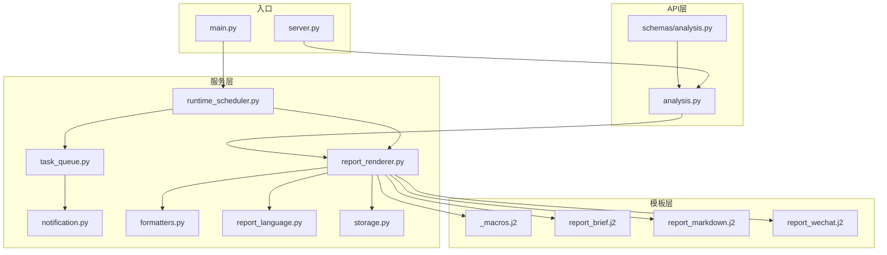
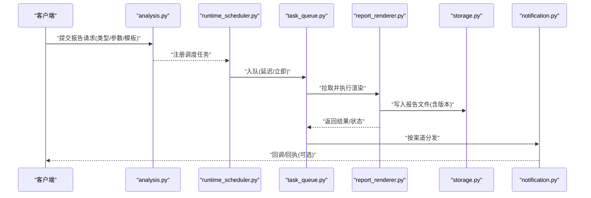
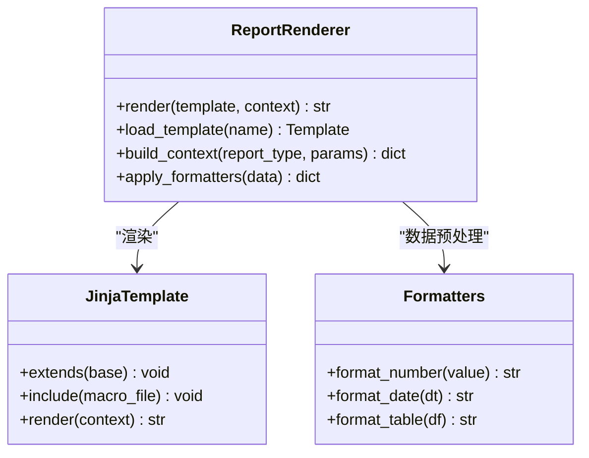
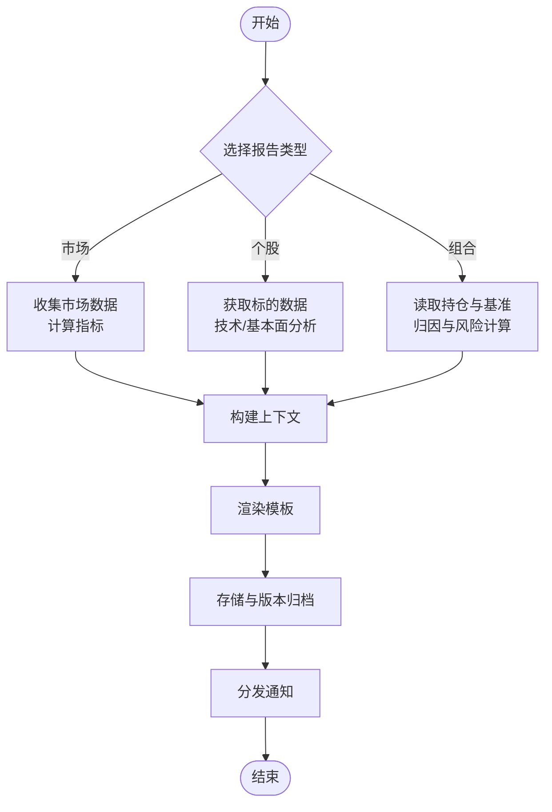
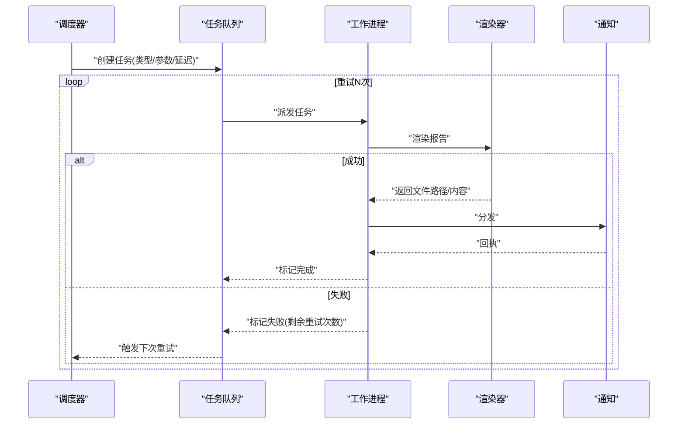
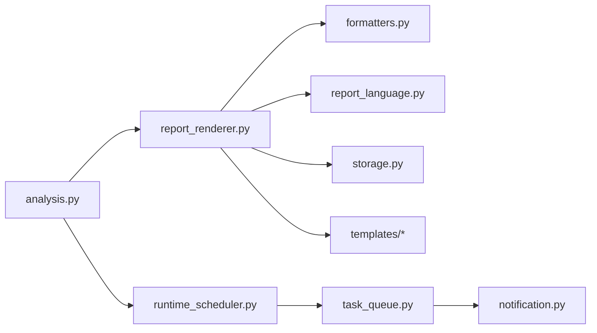

# 报告生成与分发

<cite>
**本文引用的文件**   
- [report_renderer.py](file://src/services/report_renderer.py)
- [runtime_scheduler.py](file://src/services/runtime_scheduler.py)
- [task_queue.py](file://src/services/task_queue.py)
- [notification.py](file://src/notification.py)
- [formatters.py](file://src/formatters.py)
- [report_language.py](file://src/report_language.py)
- [storage.py](file://src/storage.py)
- [templates/_macros.j2](file://templates/_macros.j2)
- [templates/report_brief.j2](file://templates/report_brief.j2)
- [templates/report_markdown.j2](file://templates/report_markdown.j2)
- [templates/report_wechat.j2](file://templates/report_wechat.j2)
- [api/v1/endpoints/analysis.py](file://api/v1/endpoints/analysis.py)
- [api/v1/schemas/analysis.py](file://api/v1/schemas/analysis.py)
- [main.py](file://main.py)
- [server.py](file://server.py)
</cite>

## 目录
1. [简介](#简介)
2. [项目结构](#项目结构)
3. [核心组件](#核心组件)
4. [架构总览](#架构总览)
5. [详细组件分析](#详细组件分析)
6. [依赖关系分析](#依赖关系分析)
7. [性能考虑](#性能考虑)
8. [故障排查指南](#故障排查指南)
9. [结论](#结论)
10. [附录](#附录)

## 简介
本文件面向Daily Stock Analysis项目的“报告生成与分发系统”，系统性说明以下能力：
- 模板系统设计与Jinja2使用方式（继承、宏、变量注入）
- 三类报告的生成流程（市场分析报告、个股分析报告、组合分析报告）
- 内容定制选项（数据源选择、分析维度配置、输出格式设置）
- 分发机制（定时任务调度、异步处理、重试策略）
- 自定义报告模板开发指南与最佳实践
- 报告版本管理与历史归档

## 项目结构
围绕报告生成与分发的关键代码与资源分布如下：
- 服务层：报告渲染、调度、任务队列、通知发送、格式化、语言适配、存储
- API层：分析相关接口定义与路由
- 模板层：Jinja2模板与宏
- 入口：主进程与服务启动

图表来源 
- [api/v1/endpoints/analysis.py:1-200](file://api/v1/endpoints/analysis.py#L1-L200)
- [api/v1/schemas/analysis.py:1-200](file://api/v1/schemas/analysis.py#L1-L200)
- [src/services/report_renderer.py:1-200](file://src/services/report_renderer.py#L1-L200)
- [src/services/runtime_scheduler.py:1-200](file://src/services/runtime_scheduler.py#L1-L200)
- [src/services/task_queue.py:1-200](file://src/services/task_queue.py#L1-L200)
- [src/notification.py:1-200](file://src/notification.py#L1-L200)
- [src/formatters.py:1-200](file://src/formatters.py#L1-L200)
- [src/report_language.py:1-200](file://src/report_language.py#L1-L200)
- [src/storage.py:1-200](file://src/storage.py#L1-L200)
- [templates/_macros.j2:1-200](file://templates/_macros.j2#L1-L200)
- [templates/report_brief.j2:1-200](file://templates/report_brief.j2#L1-L200)
- [templates/report_markdown.j2:1-200](file://templates/report_markdown.j2#L1-L200)
- [templates/report_wechat.j2:1-200](file://templates/report_wechat.j2#L1-L200)
- [main.py:1-200](file://main.py#L1-L200)
- [server.py:1-200](file://server.py#L1-L200)

章节来源
- [api/v1/endpoints/analysis.py:1-200](file://api/v1/endpoints/analysis.py#L1-L200)
- [src/services/report_renderer.py:1-200](file://src/services/report_renderer.py#L1-L200)
- [src/services/runtime_scheduler.py:1-200](file://src/services/runtime_scheduler.py#L1-L200)
- [src/services/task_queue.py:1-200](file://src/services/task_queue.py#L1-L200)
- [src/notification.py:1-200](file://src/notification.py#L1-L200)
- [src/formatters.py:1-200](file://src/formatters.py#L1-L200)
- [src/report_language.py:1-200](file://src/report_language.py#L1-L200)
- [src/storage.py:1-200](file://src/storage.py#L1-L200)
- [templates/_macros.j2:1-200](file://templates/_macros.j2#L1-L200)
- [templates/report_brief.j2:1-200](file://templates/report_brief.j2#L1-L200)
- [templates/report_markdown.j2:1-200](file://templates/report_markdown.j2#L1-L200)
- [templates/report_wechat.j2:1-200](file://templates/report_wechat.j2#L1-L200)
- [main.py:1-200](file://main.py#L1-L200)
- [server.py:1-200](file://server.py#L1-L200)

## 核心组件
- 报告渲染器（report_renderer.py）
  - 职责：加载Jinja2模板、组装上下文数据、渲染不同格式的报告，并持久化到存储。
  - 关键点：模板继承、宏复用、变量注入、错误回退。
- 运行时调度器（runtime_scheduler.py）
  - 职责：按配置周期触发报告生成任务，支持一次性与重复任务。
  - 关键点：任务注册、时间窗口控制、并发限制。
- 任务队列（task_queue.py）
  - 职责：异步执行报告生成与分发，提供重试与失败回调。
  - 关键点：队列模型、重试策略、幂等性保障。
- 通知发送（notification.py）
  - 职责：将生成的报告通过多种渠道分发（邮件、IM、Webhook等）。
  - 关键点：通道抽象、消息体构建、失败重试。
- 格式化器（formatters.py）
  - 职责：统一数据到模板可消费的结构，处理数值、日期、表格等。
  - 关键点：类型转换、空值处理、国际化。
- 语言适配（report_language.py）
  - 职责：根据用户或系统配置选择报告语言与本地化文案。
  - 关键点：语言优先级、回退策略。
- 存储（storage.py）
  - 职责：报告文件的落盘、版本命名、历史归档与清理策略。
  - 关键点：路径规则、元数据记录、压缩与索引。

章节来源
- [src/services/report_renderer.py:1-200](file://src/services/report_renderer.py#L1-L200)
- [src/services/runtime_scheduler.py:1-200](file://src/services/runtime_scheduler.py#L1-L200)
- [src/services/task_queue.py:1-200](file://src/services/task_queue.py#L1-L200)
- [src/notification.py:1-200](file://src/notification.py#L1-L200)
- [src/formatters.py:1-200](file://src/formatters.py#L1-L200)
- [src/report_language.py:1-200](file://src/report_language.py#L1-L200)
- [src/storage.py:1-200](file://src/storage.py#L1-L200)

## 架构总览
报告从API触发到最终分发的端到端流程如下：

图表来源 
- [api/v1/endpoints/analysis.py:1-200](file://api/v1/endpoints/analysis.py#L1-L200)
- [src/services/runtime_scheduler.py:1-200](file://src/services/runtime_scheduler.py#L1-L200)
- [src/services/task_queue.py:1-200](file://src/services/task_queue.py#L1-L200)
- [src/services/report_renderer.py:1-200](file://src/services/report_renderer.py#L1-L200)
- [src/storage.py:1-200](file://src/storage.py#L1-L200)
- [src/notification.py:1-200](file://src/notification.py#L1-L200)

## 详细组件分析

### 模板系统与Jinja2使用
- 模板组织
  - 基础宏：_macros.j2 提供通用片段（如日期、指标卡片、表格等），被各报告模板继承复用。
  - 报告模板：report_brief.j2（简报）、report_markdown.j2（Markdown）、report_wechat.j2（微信长图/文本）。
- 模板继承与变量注入
  - 渲染器负责构造上下文对象，包含市场概览、个股数据、组合快照、指标计算结果、语言与主题等。
  - 模板通过继承宏与块扩展，实现布局与内容分离。
- 变量与过滤器
  - 数值格式化、百分比、货币、日期时间、缺失值占位等由格式化器预处理后注入。
  - 模板侧仅做展示逻辑，避免复杂计算。

图表来源 
- [src/services/report_renderer.py:1-200](file://src/services/report_renderer.py#L1-L200)
- [src/formatters.py:1-200](file://src/formatters.py#L1-L200)
- [templates/_macros.j2:1-200](file://templates/_macros.j2#L1-L200)
- [templates/report_brief.j2:1-200](file://templates/report_brief.j2#L1-L200)
- [templates/report_markdown.j2:1-200](file://templates/report_markdown.j2#L1-L200)
- [templates/report_wechat.j2:1-200](file://templates/report_wechat.j2#L1-L200)

章节来源
- [src/services/report_renderer.py:1-200](file://src/services/report_renderer.py#L1-L200)
- [src/formatters.py:1-200](file://src/formatters.py#L1-L200)
- [templates/_macros.j2:1-200](file://templates/_macros.j2#L1-L200)
- [templates/report_brief.j2:1-200](file://templates/report_brief.j2#L1-L200)
- [templates/report_markdown.j2:1-200](file://templates/report_markdown.j2#L1-L200)
- [templates/report_wechat.j2:1-200](file://templates/report_wechat.j2#L1-L200)

### 报告类型与生成流程
- 市场分析报告
  - 输入：指数/板块行情、宏观指标、资金流向、新闻摘要。
  - 处理：聚合多数据源，计算趋势与波动特征，生成结构化上下文。
  - 输出：Markdown/简报/微信版，附带关键图表与结论。
- 个股分析报告
  - 输入：标的代码、时间窗、技术指标、基本面快照。
  - 处理：量价分析、形态识别、信号汇总。
  - 输出：个股视图，含风险评分与操作建议。
- 组合分析报告
  - 输入：持仓清单、权重、基准、风险偏好。
  - 处理：收益归因、回撤分析、相关性矩阵、集中度。
  - 输出：组合健康度与调仓建议。

图表来源 
- [src/services/report_renderer.py:1-200](file://src/services/report_renderer.py#L1-L200)
- [src/formatters.py:1-200](file://src/formatters.py#L1-L200)
- [src/storage.py:1-200](file://src/storage.py#L1-L200)
- [src/notification.py:1-200](file://src/notification.py#L1-L200)

章节来源
- [src/services/report_renderer.py:1-200](file://src/services/report_renderer.py#L1-L200)
- [src/formatters.py:1-200](file://src/formatters.py#L1-L200)
- [src/storage.py:1-200](file://src/storage.py#L1-L200)
- [src/notification.py:1-200](file://src/notification.py#L1-L200)

### 内容定制选项
- 数据源选择
  - 通过参数指定数据提供方（如A股、港股、美股、指数映射），渲染器在构建上下文时按需拉取。
- 分析维度配置
  - 时间窗、指标集合、阈值、是否包含新闻/情绪/资金流等开关。
- 输出格式设置
  - 模板选择（brief/markdown/wechat）、语言、主题、是否包含图表链接或内嵌图片。

章节来源
- [src/services/report_renderer.py:1-200](file://src/services/report_renderer.py#L1-L200)
- [src/formatters.py:1-200](file://src/formatters.py#L1-L200)
- [src/report_language.py:1-200](file://src/report_language.py#L1-L200)

### 分发机制：调度、异步与重试
- 定时任务调度
  - 基于运行时调度器按cron或间隔注册任务，支持单次与循环。
- 异步处理
  - 任务入队后由工作进程拉取执行，避免阻塞API线程。
- 重试策略
  - 对网络抖动、下游限流等场景进行指数退避重试；失败达到上限后进入死信队列并告警。

图表来源 
- [src/services/runtime_scheduler.py:1-200](file://src/services/runtime_scheduler.py#L1-L200)
- [src/services/task_queue.py:1-200](file://src/services/task_queue.py#L1-200)
- [src/services/report_renderer.py:1-200](file://src/services/report_renderer.py#L1-200)
- [src/notification.py:1-200](file://src/notification.py#L1-200)

章节来源
- [src/services/runtime_scheduler.py:1-200](file://src/services/runtime_scheduler.py#L1-200)
- [src/services/task_queue.py:1-200](file://src/services/task_queue.py#L1-200)
- [src/services/report_renderer.py:1-200](file://src/services/report_renderer.py#L1-200)
- [src/notification.py:1-200](file://src/notification.py#L1-200)

### 自定义报告模板开发指南与最佳实践
- 步骤
  - 新建模板文件（如 report_custom.j2），继承基础宏与布局。
  - 在渲染器中注册新模板名称与对应的上下文字段。
  - 通过API或调度任务传入模板名与参数进行渲染。
- 最佳实践
  - 模板只负责展示，不写业务逻辑；复杂计算放在格式化器或渲染器。
  - 使用宏封装可复用片段，保持模板简洁。
  - 对缺失数据提供默认占位与降级显示。
  - 为不同渠道（Markdown/微信）准备差异化模板，避免强耦合。

章节来源
- [templates/_macros.j2:1-200](file://templates/_macros.j2#L1-200)
- [templates/report_brief.j2:1-200](file://templates/report_brief.j2#L1-200)
- [templates/report_markdown.j2:1-200](file://templates/report_markdown.j2#L1-200)
- [templates/report_wechat.j2:1-200](file://templates/report_wechat.j2#L1-200)
- [src/services/report_renderer.py:1-200](file://src/services/report_renderer.py#L1-200)

### 报告版本管理与历史归档
- 版本命名
  - 采用“报告类型_日期_版本号”的命名规范，便于检索与回溯。
- 归档策略
  - 按日/周/月归档，保留最近N期，过期自动清理。
- 元数据
  - 记录生成时间、模板版本、参数哈希、数据来源版本，用于审计与复现。

章节来源
- [src/storage.py:1-200](file://src/storage.py#L1-200)

## 依赖关系分析
- API层依赖服务层：analysis.py调用report_renderer与scheduler。
- 服务层内部解耦：renderer依赖formatters、report_language、storage；scheduler依赖task_queue；task_queue依赖notification。
- 模板层独立：渲染器通过模板名加载，模板之间通过宏复用。

图表来源 
- [api/v1/endpoints/analysis.py:1-200](file://api/v1/endpoints/analysis.py#L1-200)
- [src/services/report_renderer.py:1-200](file://src/services/report_renderer.py#L1-200)
- [src/services/runtime_scheduler.py:1-200](file://src/services/runtime_scheduler.py#L1-200)
- [src/services/task_queue.py:1-200](file://src/services/task_queue.py#L1-200)
- [src/notification.py:1-200](file://src/notification.py#L1-200)
- [src/formatters.py:1-200](file://src/formatters.py#L1-200)
- [src/report_language.py:1-200](file://src/report_language.py#L1-200)
- [src/storage.py:1-200](file://src/storage.py#L1-200)
- [templates/_macros.j2:1-200](file://templates/_macros.j2#L1-200)
- [templates/report_brief.j2:1-200](file://templates/report_brief.j2#L1-200)
- [templates/report_markdown.j2:1-200](file://templates/report_markdown.j2#L1-200)
- [templates/report_wechat.j2:1-200](file://templates/report_wechat.j2#L1-200)

章节来源
- [api/v1/endpoints/analysis.py:1-200](file://api/v1/endpoints/analysis.py#L1-200)
- [src/services/report_renderer.py:1-200](file://src/services/report_renderer.py#L1-200)
- [src/services/runtime_scheduler.py:1-200](file://src/services/runtime_scheduler.py#L1-200)
- [src/services/task_queue.py:1-200](file://src/services/task_queue.py#L1-200)
- [src/notification.py:1-200](file://src/notification.py#L1-200)
- [src/formatters.py:1-200](file://src/formatters.py#L1-200)
- [src/report_language.py:1-200](file://src/report_language.py#L1-200)
- [src/storage.py:1-200](file://src/storage.py#L1-200)

## 性能考虑
- 渲染性能
  - 模板缓存：预编译常用模板，减少IO与解析开销。
  - 数据裁剪：按需拉取与计算，避免全量数据注入。
- 调度与并发
  - 限制并发任务数，防止资源争用；热点时段削峰填谷。
- 存储优化
  - 大文件压缩、增量更新、冷热分层存储。
- 重试与超时
  - 合理设置超时与重试上限，避免雪崩；对慢依赖做熔断与降级。

[本节为通用指导，无需特定文件引用]

## 故障排查指南
- 常见问题
  - 模板渲染失败：检查模板语法、变量是否存在、宏是否正确引入。
  - 数据缺失：确认数据源可用性、时间窗与过滤条件。
  - 分发失败：核对渠道配置、网络连通性与配额限制。
- 定位方法
  - 查看任务队列日志与重试计数。
  - 检查存储中的报告文件与元数据。
  - 使用最小化参数复现问题。

章节来源
- [src/services/task_queue.py:1-200](file://src/services/task_queue.py#L1-200)
- [src/storage.py:1-200](file://src/storage.py#L1-200)
- [src/notification.py:1-200](file://src/notification.py#L1-200)

## 结论
本报告生成与分发系统以模板驱动为核心，结合调度与队列实现高可用、可扩展的报告流水线。通过清晰的职责划分与良好的扩展点，能够灵活支持多类型报告与多渠道分发，并提供完善的版本与归档能力。

[本节为总结，无需特定文件引用]

## 附录
- 入口与启动
  - main.py：应用初始化与生命周期管理。
  - server.py：HTTP服务与路由挂载。
- API参考
  - api/v1/endpoints/analysis.py：报告生成与分析相关接口。
  - api/v1/schemas/analysis.py：请求与响应数据结构定义。

章节来源
- [main.py:1-200](file://main.py#L1-200)
- [server.py:1-200](file://server.py#L1-200)
- [api/v1/endpoints/analysis.py:1-200](file://api/v1/endpoints/analysis.py#L1-200)
- [api/v1/schemas/analysis.py:1-200](file://api/v1/schemas/analysis.py#L1-200)