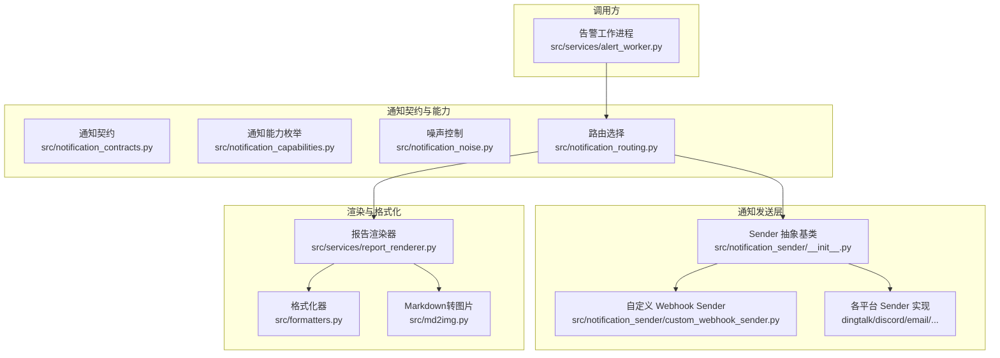
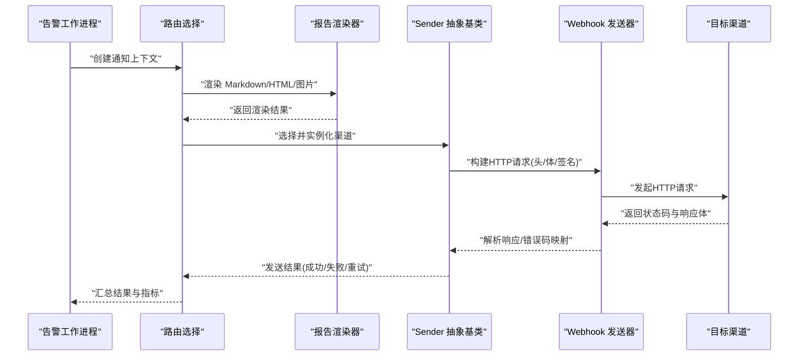
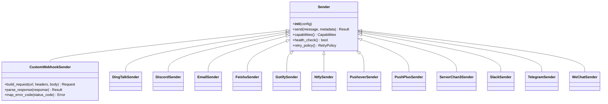

# 自定义通知渠道开发

<cite>
**本文档引用的文件**
- [src/notification_sender/__init__.py](file://src/notification_sender/__init__.py)
- [src/notification_sender/custom_webhook_sender.py](file://src/notification_sender/custom_webhook_sender.py)
- [src/notification_sender/dingtalk_sender.py](file://src/notification_sender/dingtalk_sender.py)
- [src/notification_sender/discord_sender.py](file://src/notification_sender/discord_sender.py)
- [src/notification_sender/email_sender.py](file://src/notification_sender/email_sender.py)
- [src/notification_sender/feishu_sender.py](file://src/notification_sender/feishu_sender.py)
- [src/notification_sender/gotify_sender.py](file://src/notification_sender/gotify_sender.py)
- [src/notification_sender/ntfy_sender.py](file://src/notification_sender/ntfy_sender.py)
- [src/notification_sender/pushover_sender.py](file://src/notification_sender/pushover_sender.py)
- [src/notification_sender/pushplus_sender.py](file://src/notification_sender/pushplus_sender.py)
- [src/notification_sender/serverchan3_sender.py](file://src/notification_sender/serverchan3_sender.py)
- [src/notification_sender/slack_sender.py](file://src/notification_sender/slack_sender.py)
- [src/notification_sender/telegram_sender.py](file://src/notification_sender/telegram_sender.py)
- [src/notification_sender/wechat_sender.py](file://src/notification_sender/wechat_sender.py)
- [src/notification.py](file://src/notification.py)
- [src/notification_capabilities.py](file://src/notification_capabilities.py)
- [src/notification_contracts.py](file://src/notification_contracts.py)
- [src/notification_noise.py](file://src/notification_noise.py)
- [src/notification_routing.py](file://src/notification_routing.py)
- [src/services/alert_worker.py](file://src/services/alert_worker.py)
- [src/services/report_renderer.py](file://src/services/report_renderer.py)
- [src/formatters.py](file://src/formatters.py)
- [src/md2img.py](file://src/md2img.py)
- [tests/test_notification_sender.py](file://tests/test_notification_sender.py)
- [tests/test_notification.py](file://tests/test_notification.py)
- [tests/test_notification_capabilities.py](file://tests/test_notification_capabilities.py)
- [tests/test_notification_routing.py](file://tests/test_notification_routing.py)
- [scripts/generate_notification_actions_env_table.py](file://scripts/generate_notification_actions_env_table.py)
</cite>

## 目录
1. [简介](#简介)
2. [项目结构](#项目结构)
3. [核心组件](#核心组件)
4. [架构总览](#架构总览)
5. [详细组件分析](#详细组件分析)
6. [依赖关系分析](#依赖关系分析)
7. [性能考虑](#性能考虑)
8. [故障排查指南](#故障排查指南)
9. [结论](#结论)
10. [附录](#附录)

## 简介
本指南面向希望为 Daily Stock Analysis 系统新增“自定义通知渠道”的开发者。文档围绕 Sender 抽象基类的实现要求、Webhook 接口集成、消息格式适配（Markdown、图片与富文本）、完整的示例实现（含单测与集成测试）、配置校验与错误处理策略、性能优化与监控指标，以及发布分发流程进行系统化说明。读者无需深入源码即可按步骤完成一个可落地的自定义渠道。

## 项目结构
通知子系统位于 src/notification_sender 目录，提供多种平台发送器；通用能力集中在 notification*.py 与 services/report_renderer.py、formatters.py、md2img.py 等模块中；测试位于 tests 目录；脚本用于生成配置表等辅助工具。

图表来源
- [src/notification_sender/__init__.py](file://src/notification_sender/__init__.py)
- [src/notification_sender/custom_webhook_sender.py](file://src/notification_sender/custom_webhook_sender.py)
- [src/notification.py](file://src/notification.py)
- [src/notification_contracts.py](file://src/notification_contracts.py)
- [src/notification_capabilities.py](file://src/notification_capabilities.py)
- [src/notification_noise.py](file://src/notification_noise.py)
- [src/notification_routing.py](file://src/notification_routing.py)
- [src/services/report_renderer.py](file://src/services/report_renderer.py)
- [src/formatters.py](file://src/formatters.py)
- [src/md2img.py](file://src/md2img.py)
- [src/services/alert_worker.py](file://src/services/alert_worker.py)

章节来源
- [src/notification_sender/__init__.py](file://src/notification_sender/__init__.py)
- [src/notification.py](file://src/notification.py)
- [src/notification_contracts.py](file://src/notification_contracts.py)
- [src/notification_capabilities.py](file://src/notification_capabilities.py)
- [src/notification_noise.py](file://src/notification_noise.py)
- [src/notification_routing.py](file://src/notification_routing.py)
- [src/services/report_renderer.py](file://src/services/report_renderer.py)
- [src/formatters.py](file://src/formatters.py)
- [src/md2img.py](file://src/md2img.py)
- [src/services/alert_worker.py](file://src/services/alert_worker.py)

## 核心组件
- Sender 抽象基类：定义所有渠道必须实现的统一接口，包括初始化、发送、能力声明、重试与超时策略、健康检查等。
- Webhook 发送器：基于 HTTP 的通用适配器，负责构建请求、签名、重试、响应解析与错误码映射。
- 通知契约与能力：通过 Pydantic 模型与枚举描述消息体结构与渠道能力（如是否支持图片、富文本、附件）。
- 渲染与格式化：将结构化数据渲染为 Markdown/HTML/图片，供不同渠道消费。
- 路由与噪声控制：根据目标渠道能力与用户配置决定发送路径，并抑制重复或低价值通知。
- 告警工作进程：触发通知流水线，协调渲染、路由与发送。

章节来源
- [src/notification_sender/__init__.py](file://src/notification_sender/__init__.py)
- [src/notification_sender/custom_webhook_sender.py](file://src/notification_sender/custom_webhook_sender.py)
- [src/notification_contracts.py](file://src/notification_contracts.py)
- [src/notification_capabilities.py](file://src/notification_capabilities.py)
- [src/formatters.py](file://src/formatters.py)
- [src/md2img.py](file://src/md2img.py)
- [src/notification_routing.py](file://src/notification_routing.py)
- [src/notification_noise.py](file://src/notification_noise.py)
- [src/services/report_renderer.py](file://src/services/report_renderer.py)
- [src/services/alert_worker.py](file://src/services/alert_worker.py)

## 架构总览
下图展示了从告警触发到渠道投递的端到端流程，包含渲染、路由、发送与错误处理。

图表来源
- [src/services/alert_worker.py](file://src/services/alert_worker.py)
- [src/notification_routing.py](file://src/notification_routing.py)
- [src/services/report_renderer.py](file://src/services/report_renderer.py)
- [src/notification_sender/__init__.py](file://src/notification_sender/__init__.py)
- [src/notification_sender/custom_webhook_sender.py](file://src/notification_sender/custom_webhook_sender.py)

## 详细组件分析

### Sender 抽象基类实现要求
- 必需方法签名
  - 初始化：接收渠道配置对象（Pydantic），进行参数校验与连接准备。
  - 发送：接收渲染后的消息体（字符串或二进制）与元数据，返回发送结果（成功/失败及原因）。
  - 能力声明：返回渠道支持的媒体类型（文本、Markdown、图片、附件等）。
  - 健康检查：验证凭据与网络可达性。
  - 重试与超时：暴露重试次数、退避策略、超时时间等配置项。
- 参数验证
  - 使用 Pydantic 模型对配置字段进行强类型校验，缺失或非法值应抛出明确异常。
  - 敏感信息（如密钥、Token）不应出现在日志中。
- 返回值格式
  - 发送结果需包含：状态码、消息ID/追踪ID、错误码（若失败）、耗时、是否可重试。
  - 建议遵循统一的 Result 数据结构，便于上层聚合与监控。

章节来源
- [src/notification_sender/__init__.py](file://src/notification_sender/__init__.py)
- [src/notification_contracts.py](file://src/notification_contracts.py)
- [src/notification_capabilities.py](file://src/notification_capabilities.py)

### Webhook 接口集成
- HTTP 请求构建
  - 支持 GET/POST/PATCH 等方法，动态设置头部（Content-Type、Authorization、签名头等）。
  - 支持 JSON/Form/Multipart 等多种编码方式，按需附加图片与附件。
  - 支持 URL 模板与变量替换，便于多环境部署。
- 响应处理
  - 解析标准响应体，提取业务状态码与消息。
  - 将第三方错误码映射为内部错误码，便于统一处理。
- 错误码映射
  - 4xx 分类：认证失败、权限不足、参数错误、限流。
  - 5xx 分类：服务端错误、网关错误、超时。
  - 针对限流与临时错误启用指数退避重试。

章节来源
- [src/notification_sender/custom_webhook_sender.py](file://src/notification_sender/custom_webhook_sender.py)
- [src/notification_contracts.py](file://src/notification_contracts.py)

### 消息格式适配转换
- Markdown 渲染
  - 将结构化数据转换为 Markdown，保留标题、列表、表格、链接等元素。
  - 支持语言切换与模板变量注入。
- 图片处理
  - 支持将 Markdown 或 HTML 转为图片（PNG/JPEG），用于不支持富文本的渠道。
  - 图片压缩与尺寸限制，避免超大负载。
- 富文本支持
  - 对于支持富文本的渠道，优先使用原生富文本格式（如 HTML、JSON 卡片）。
  - 降级策略：当富文本不可用时回退到 Markdown 或纯文本。

章节来源
- [src/services/report_renderer.py](file://src/services/report_renderer.py)
- [src/formatters.py](file://src/formatters.py)
- [src/md2img.py](file://src/md2img.py)

### 自定义渠道开发示例（代码实现、单元测试、集成测试）
- 代码实现要点
  - 继承 Sender 抽象基类，实现发送、能力声明与健康检查。
  - 在 Webhook 模式下，复用 custom_webhook_sender 的请求构建与错误映射逻辑。
  - 配置项通过 Pydantic 模型校验，确保必填字段与格式正确。
- 单元测试
  - 覆盖正常路径、参数校验失败、网络异常、第三方错误码映射、重试与超时。
  - 使用 Mock 隔离外部依赖，保证测试稳定性。
- 集成测试
  - 对接真实或沙箱环境，验证端到端发送流程与渲染效果。
  - 记录关键指标（延迟、成功率、错误分布）。

章节来源
- [src/notification_sender/custom_webhook_sender.py](file://src/notification_sender/custom_webhook_sender.py)
- [tests/test_notification_sender.py](file://tests/test_notification_sender.py)
- [tests/test_notification.py](file://tests/test_notification.py)

### 渠道配置的验证机制与错误处理策略
- 配置验证
  - 使用 Pydantic 模型对渠道配置进行强类型校验，缺失或非法值立即报错。
  - 支持环境变量与配置文件双源加载，优先级明确。
- 错误处理
  - 区分客户端错误（4xx）与服务端错误（5xx），前者快速失败，后者可重试。
  - 限流场景采用指数退避与最大重试上限。
  - 记录结构化错误日志，包含渠道名、错误码、请求摘要（脱敏）与追踪ID。

章节来源
- [src/notification_contracts.py](file://src/notification_contracts.py)
- [src/notification_sender/custom_webhook_sender.py](file://src/notification_sender/custom_webhook_sender.py)
- [src/notification_noise.py](file://src/notification_noise.py)

### 渠道性能优化建议与监控指标收集
- 性能优化
  - 连接池与复用：保持 HTTP 连接池，减少握手开销。
  - 并发控制：限制并发发送数，避免压垮下游服务。
  - 缓存热点数据：如 Token、签名密钥等，定期刷新。
  - 图片与附件：压缩与裁剪，按需上传。
- 监控指标
  - 发送成功率、平均延迟、P95/P99 延迟、错误率分布、重试次数、超时率。
  - 渠道维度与任务维度指标，便于定位问题。
  - 上报至监控系统（Prometheus/Grafana）或日志聚合平台。

章节来源
- [src/notification_sender/custom_webhook_sender.py](file://src/notification_sender/custom_webhook_sender.py)
- [src/services/alert_worker.py](file://src/services/alert_worker.py)

### 渠道发布与分发流程指导
- 版本管理
  - 渠道作为独立模块纳入版本控制，变更需通过 PR 审查。
  - 更新 README 与配置示例，确保使用者可快速上手。
- 测试门禁
  - 单测与集成测试通过后方可合并，覆盖率达标。
  - 回归测试覆盖常见错误路径与边界条件。
- 发布流程
  - 打标签与发布说明，记录破坏性变更与兼容性矩阵。
  - 更新依赖与镜像，确保生产环境一致性。

章节来源
- [scripts/generate_notification_actions_env_table.py](file://scripts/generate_notification_actions_env_table.py)
- [tests/test_notification_sender.py](file://tests/test_notification_sender.py)

## 依赖关系分析
通知子系统依赖渲染、格式化、路由与能力枚举等模块，Sender 抽象基类被各平台实现复用，Webhook 发送器作为通用 HTTP 适配器。

图表来源
- [src/notification_sender/__init__.py](file://src/notification_sender/__init__.py)
- [src/notification_sender/custom_webhook_sender.py](file://src/notification_sender/custom_webhook_sender.py)
- [src/notification_sender/dingtalk_sender.py](file://src/notification_sender/dingtalk_sender.py)
- [src/notification_sender/discord_sender.py](file://src/notification_sender/discord_sender.py)
- [src/notification_sender/email_sender.py](file://src/notification_sender/email_sender.py)
- [src/notification_sender/feishu_sender.py](file://src/notification_sender/feishu_sender.py)
- [src/notification_sender/gotify_sender.py](file://src/notification_sender/gotify_sender.py)
- [src/notification_sender/ntfy_sender.py](file://src/notification_sender/ntfy_sender.py)
- [src/notification_sender/pushover_sender.py](file://src/notification_sender/pushover_sender.py)
- [src/notification_sender/pushplus_sender.py](file://src/notification_sender/pushplus_sender.py)
- [src/notification_sender/serverchan3_sender.py](file://src/notification_sender/serverchan3_sender.py)
- [src/notification_sender/slack_sender.py](file://src/notification_sender/slack_sender.py)
- [src/notification_sender/telegram_sender.py](file://src/notification_sender/telegram_sender.py)
- [src/notification_sender/wechat_sender.py](file://src/notification_sender/wechat_sender.py)

章节来源
- [src/notification_sender/__init__.py](file://src/notification_sender/__init__.py)
- [src/notification_sender/custom_webhook_sender.py](file://src/notification_sender/custom_webhook_sender.py)
- [src/notification_sender/dingtalk_sender.py](file://src/notification_sender/dingtalk_sender.py)
- [src/notification_sender/discord_sender.py](file://src/notification_sender/discord_sender.py)
- [src/notification_sender/email_sender.py](file://src/notification_sender/email_sender.py)
- [src/notification_sender/feishu_sender.py](file://src/notification_sender/feishu_sender.py)
- [src/notification_sender/gotify_sender.py](file://src/notification_sender/gotify_sender.py)
- [src/notification_sender/ntfy_sender.py](file://src/notification_sender/ntfy_sender.py)
- [src/notification_sender/pushover_sender.py](file://src/notification_sender/pushover_sender.py)
- [src/notification_sender/pushplus_sender.py](file://src/notification_sender/pushplus_sender.py)
- [src/notification_sender/serverchan3_sender.py](file://src/notification_sender/serverchan3_sender.py)
- [src/notification_sender/slack_sender.py](file://src/notification_sender/slack_sender.py)
- [src/notification_sender/telegram_sender.py](file://src/notification_sender/telegram_sender.py)
- [src/notification_sender/wechat_sender.py](file://src/notification_sender/wechat_sender.py)

## 性能考虑
- 连接与并发
  - 使用连接池与异步 IO，提升吞吐与降低延迟。
  - 合理设置并发上限，避免下游限流或服务雪崩。
- 资源优化
  - 图片与附件压缩、裁剪与缓存，减少带宽占用。
  - 模板渲染缓存，避免重复计算。
- 监控与可观测性
  - 采集关键指标（延迟、成功率、错误分布、重试次数）。
  - 结构化日志与追踪 ID，便于问题定位。

[本节为通用指导，不直接分析具体文件]

## 故障排查指南
- 常见问题
  - 配置错误：字段缺失或类型不符，查看 Pydantic 校验错误。
  - 网络问题：DNS 解析失败、TLS 握手错误、超时与限流。
  - 第三方错误码：对照错误码映射表，定位业务失败原因。
- 调试步骤
  - 开启调试日志，捕获请求与响应摘要（脱敏）。
  - 使用健康检查接口验证凭据与连通性。
  - 逐步缩小范围：先验证渲染输出，再验证发送链路。
- 恢复策略
  - 自动重试与降级：限流时退避，失败时切换到备用渠道。
  - 告警与熔断：错误率阈值触发告警，必要时熔断下游。

章节来源
- [src/notification_sender/custom_webhook_sender.py](file://src/notification_sender/custom_webhook_sender.py)
- [src/notification_noise.py](file://src/notification_noise.py)
- [src/notification_contracts.py](file://src/notification_contracts.py)

## 结论
通过统一的 Sender 抽象与 Webhook 适配器，Daily Stock Analysis 的通知系统具备良好的扩展性与可维护性。开发者只需遵循接口规范、完成配置校验与错误映射，即可快速接入新渠道。配合渲染、路由与监控能力，可实现稳定高效的跨渠道通知分发。

[本节为总结性内容，不直接分析具体文件]

## 附录
- 最佳实践清单
  - 严格使用 Pydantic 校验配置，避免运行时错误。
  - 统一错误码映射与日志格式，便于监控与排障。
  - 图片与附件压缩，控制大小与数量。
  - 完善单测与集成测试，覆盖异常路径。
- 参考实现
  - 已有渠道实现可作为模板参考，如钉钉、飞书、Discord、Slack、Telegram、微信等。

[本节为补充信息，不直接分析具体文件]