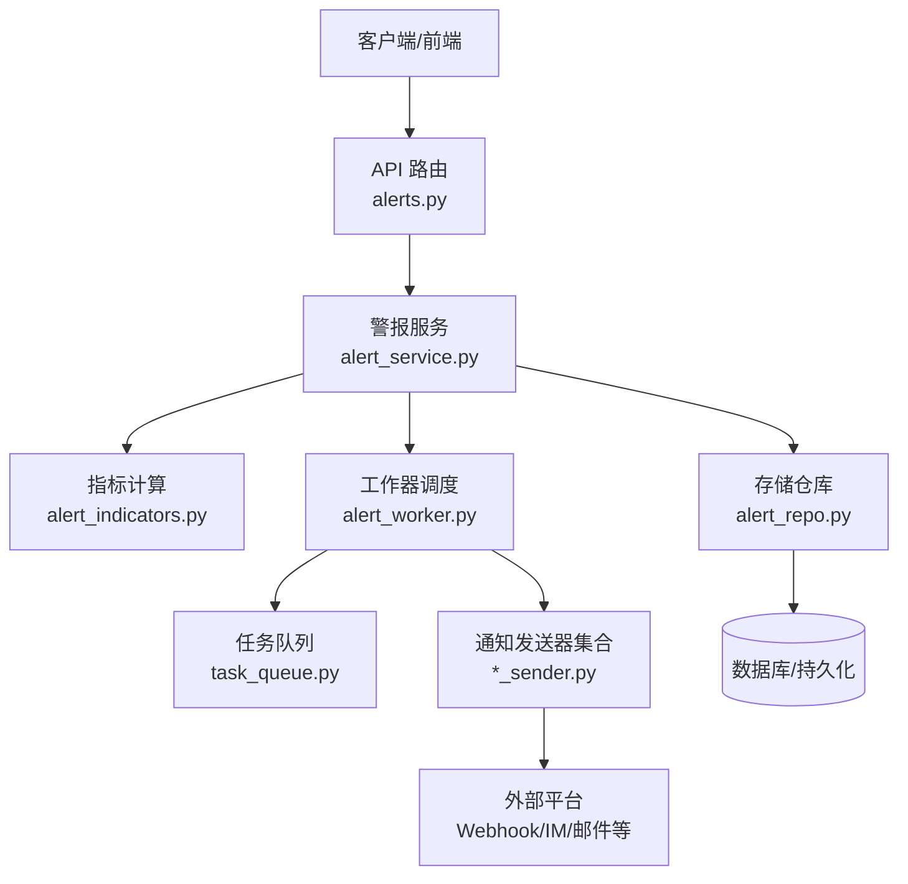
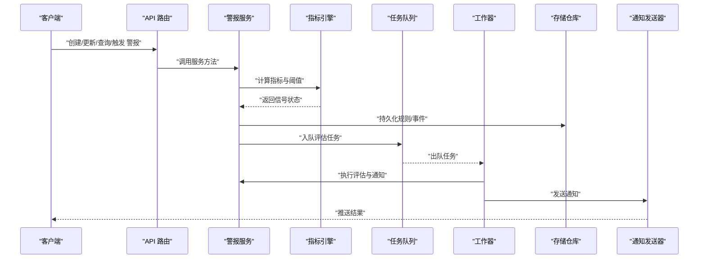
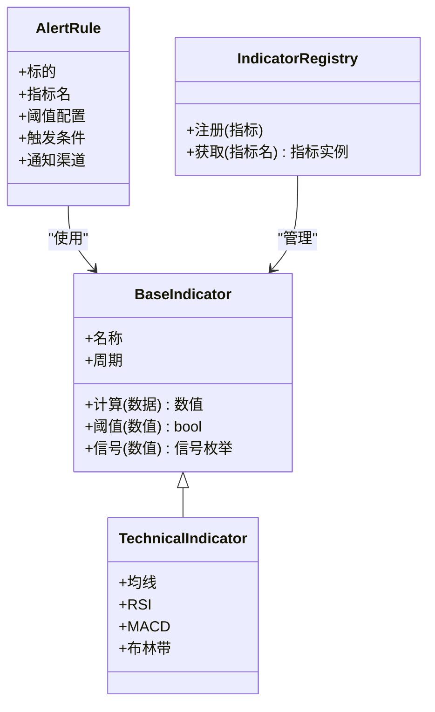
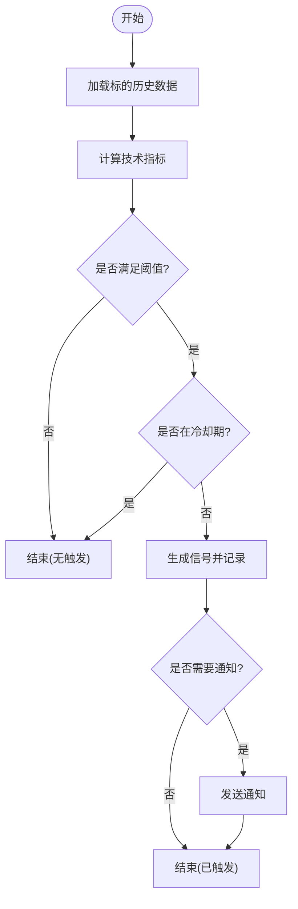
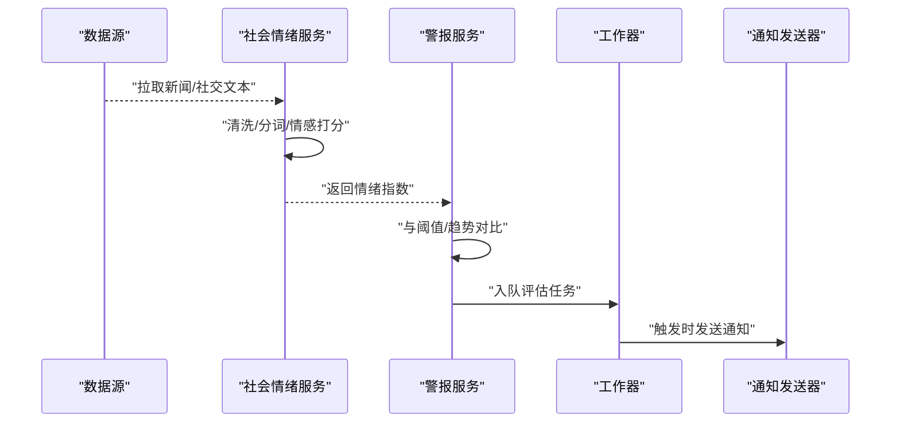
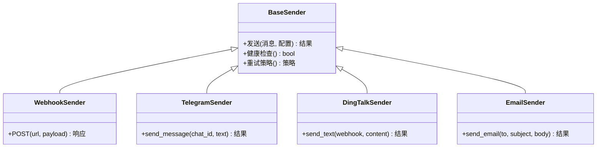
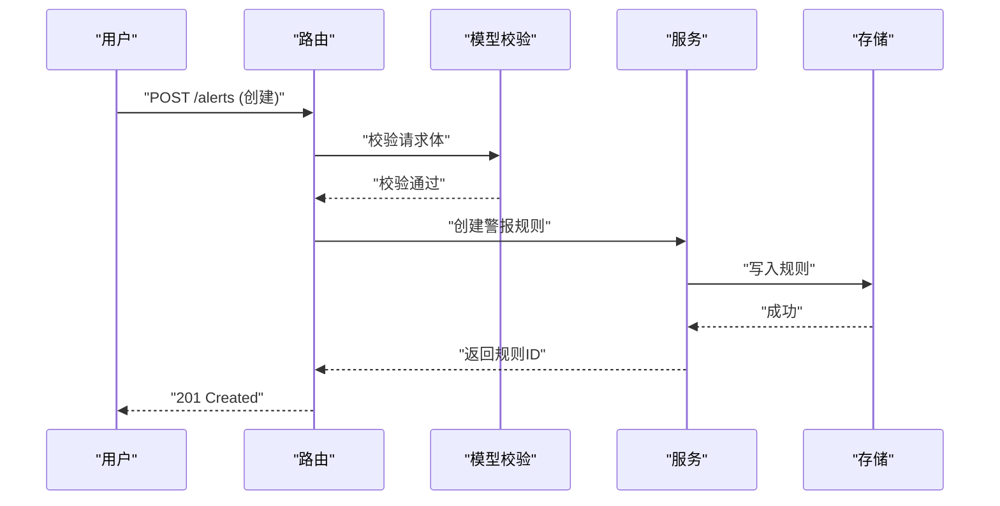
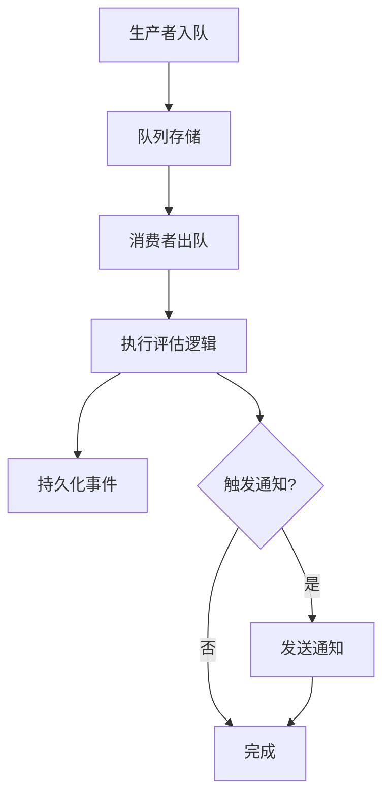
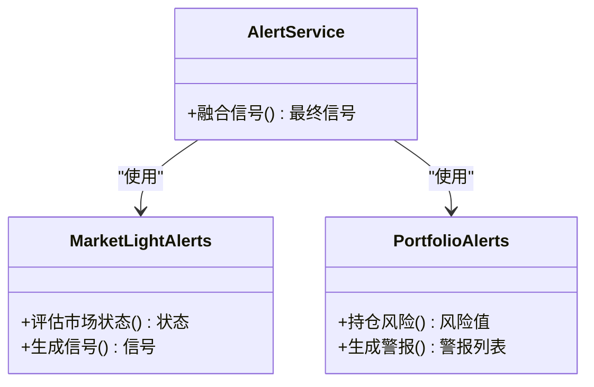
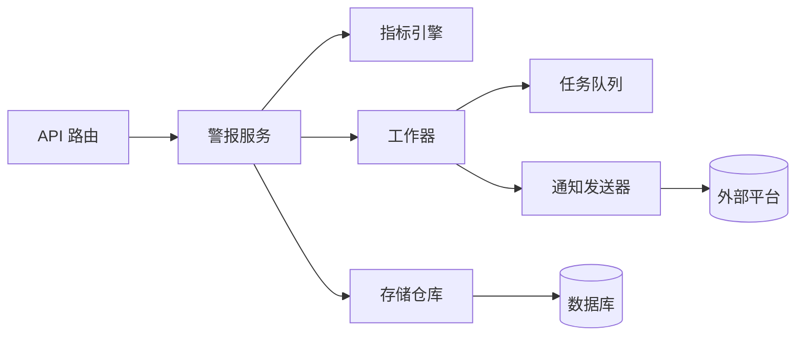

# 自定义警报开发

<cite>
**本文引用的文件**   
- [api/v1/endpoints/alerts.py](file://api/v1/endpoints/alerts.py)
- [api/v1/schemas/alerts.py](file://api/v1/schemas/alerts.py)
- [src/services/alert_service.py](file://src/services/alert_service.py)
- [src/services/alert_indicators.py](file://src/services/alert_indicators.py)
- [src/services/alert_worker.py](file://src/services/alert_worker.py)
- [src/repositories/alert_repo.py](file://src/repositories/alert_repo.py)
- [src/notification_sender/custom_webhook_sender.py](file://src/notification_sender/custom_webhook_sender.py)
- [src/notification_sender/telegram_sender.py](file://src/notification_sender/telegram_sender.py)
- [src/notification_sender/dingtalk_sender.py](file://src/notification_sender/dingtalk_sender.py)
- [src/notification_sender/discord_sender.py](file://src/notification_sender/discord_sender.py)
- [src/notification_sender/email_sender.py](file://src/notification_sender/email_sender.py)
- [src/notification_sender/slack_sender.py](file://src/notification_sender/slack_sender.py)
- [src/notification_sender/pushover_sender.py](file://src/notification_sender/pushover_sender.py)
- [src/notification_sender/pushplus_sender.py](file://src/notification_sender/pushplus_sender.py)
- [src/notification_sender/serverchan3_sender.py](file://src/notification_sender/serverchan3_sender.py)
- [src/notification_sender/astrbot_sender.py](file://src/notification_sender/astrbot_sender.py)
- [src/notification_sender/feishu_sender.py](file://src/notification_sender/feishu_sender.py)
- [src/notification_sender/wechat_sender.py](file://src/notification_sender/wechat_sender.py)
- [src/notification_sender/gotify_sender.py](file://src/notification_sender/gotify_sender.py)
- [src/notification_sender/ntfy_sender.py](file://src/notification_sender/ntfy_sender.py)
- [src/services/social_sentiment_service.py](file://src/services/social_sentiment_service.py)
- [src/services/market_light_alerts.py](file://src/services/market_light_alerts.py)
- [src/services/portfolio_alerts.py](file://src/services/portfolio_alerts.py)
- [src/services/task_queue.py](file://src/services/task_queue.py)
- [src/config.py](file://src/config.py)
- [src/logging_config.py](file://src/logging_config.py)
- [tests/test_alert_api.py](file://tests/test_alert_api.py)
- [tests/test_alert_worker.py](file://tests/test_alert_worker.py)
- [main.py](file://main.py)
- [server.py](file://server.py)
</cite>

## 目录
1. [简介](#简介)
2. [项目结构](#项目结构)
3. [核心组件](#核心组件)
4. [架构总览](#架构总览)
5. [详细组件分析](#详细组件分析)
6. [依赖关系分析](#依赖关系分析)
7. [性能考虑](#性能考虑)
8. [故障排查指南](#故障排查指南)
9. [结论](#结论)
10. [附录](#附录)

## 简介
本文件面向“Daily Stock Analysis”项目的自定义警报开发，系统性阐述警报插件的架构设计、扩展点与生命周期管理；给出技术指标警报与市场情绪警报的开发步骤与实现要点；提供完整的开发示例（代码模板、测试用例、部署指南）；并总结性能优化技巧与调试监控方法。读者无需深入底层即可快速上手开发与集成。

## 项目结构
警报系统围绕 API 层、服务层、工作器、存储与通知通道展开，形成清晰的职责边界与可扩展的插件化能力：
- API 层：暴露 REST 接口用于创建、查询、触发与管理警报规则
- 服务层：封装指标计算、阈值判断、信号生成与业务编排
- 工作器：异步执行任务队列中的警报评估与通知投递
- 存储层：持久化警报规则与历史事件
- 通知层：统一抽象多种消息通道（Webhook、Telegram、钉钉等）

图表来源
- [api/v1/endpoints/alerts.py](file://api/v1/endpoints/alerts.py)
- [src/services/alert_service.py](file://src/services/alert_service.py)
- [src/services/alert_indicators.py](file://src/services/alert_indicators.py)
- [src/repositories/alert_repo.py](file://src/repositories/alert_repo.py)
- [src/services/alert_worker.py](file://src/services/alert_worker.py)
- [src/services/task_queue.py](file://src/services/task_queue.py)
- [src/notification_sender/custom_webhook_sender.py](file://src/notification_sender/custom_webhook_sender.py)

章节来源
- [api/v1/endpoints/alerts.py](file://api/v1/endpoints/alerts.py)
- [src/services/alert_service.py](file://src/services/alert_service.py)
- [src/services/alert_worker.py](file://src/services/alert_worker.py)
- [src/repositories/alert_repo.py](file://src/repositories/alert_repo.py)
- [src/services/task_queue.py](file://src/services/task_queue.py)

## 核心组件
- 警报服务（AlertService）：协调指标计算、阈值判定、事件落库与通知分发，是警报系统的编排中枢
- 指标引擎（AlertIndicators）：提供可插拔的技术指标计算与组合逻辑，支持多因子融合
- 工作器（AlertWorker）：基于任务队列异步处理警报评估与通知，保证高吞吐与稳定性
- 存储仓库（AlertRepo）：负责警报规则与事件的增删改查与分页检索
- 通知发送器（Senders）：统一抽象不同渠道的发送接口，支持 Webhook、即时通讯与邮件等

章节来源
- [src/services/alert_service.py](file://src/services/alert_service.py)
- [src/services/alert_indicators.py](file://src/services/alert_indicators.py)
- [src/services/alert_worker.py](file://src/services/alert_worker.py)
- [src/repositories/alert_repo.py](file://src/repositories/alert_repo.py)
- [src/notification_sender/custom_webhook_sender.py](file://src/notification_sender/custom_webhook_sender.py)

## 架构总览
警报系统采用分层与插件化设计，关键流程如下：
- API 接收请求，校验参数后调用服务层
- 服务层根据规则选择指标与阈值策略，必要时读取历史数据
- 指标引擎计算数值并返回信号状态
- 工作器将评估任务入队，后台消费并写入存储
- 若触发条件满足，通过通知层发送到目标渠道

图表来源
- [api/v1/endpoints/alerts.py](file://api/v1/endpoints/alerts.py)
- [src/services/alert_service.py](file://src/services/alert_service.py)
- [src/services/alert_indicators.py](file://src/services/alert_indicators.py)
- [src/services/alert_worker.py](file://src/services/alert_worker.py)
- [src/repositories/alert_repo.py](file://src/repositories/alert_repo.py)
- [src/services/task_queue.py](file://src/services/task_queue.py)
- [src/notification_sender/custom_webhook_sender.py](file://src/notification_sender/custom_webhook_sender.py)

## 详细组件分析

### 指标引擎与基础类继承
- 设计模式：采用基类+插件注册的方式，新增指标只需继承基类并实现必要方法
- 生命周期：初始化加载 -> 指标计算 -> 阈值比较 -> 信号输出
- 扩展点：指标注册表、阈值策略接口、信号聚合器

图表来源
- [src/services/alert_indicators.py](file://src/services/alert_indicators.py)
- [src/services/alert_service.py](file://src/services/alert_service.py)

章节来源
- [src/services/alert_indicators.py](file://src/services/alert_indicators.py)
- [src/services/alert_service.py](file://src/services/alert_service.py)

### 技术指标警报开发步骤
- 指标计算：在指标引擎中实现或复用内置指标，确保输入数据标准化与异常处理
- 阈值设定：支持静态阈值、动态区间、波动率自适应等策略
- 触发逻辑：定义进入/退出条件、去抖与冷却时间、多指标共振规则
- 回测验证：结合历史数据验证指标有效性，避免过拟合

图表来源
- [src/services/alert_indicators.py](file://src/services/alert_indicators.py)
- [src/services/alert_service.py](file://src/services/alert_service.py)

章节来源
- [src/services/alert_indicators.py](file://src/services/alert_indicators.py)
- [src/services/alert_service.py](file://src/services/alert_service.py)

### 市场情绪警报开发方法
- 数据来源集成：接入社交媒体、新闻、论坛等多源数据，统一清洗与归一化
- 情感分析：对文本进行情感打分与主题提取，得到情绪指数
- 信号生成：基于情绪阈值与趋势变化生成多空信号，并与技术面指标融合
- 反馈闭环：记录信号效果，持续优化权重与阈值

图表来源
- [src/services/social_sentiment_service.py](file://src/services/social_sentiment_service.py)
- [src/services/alert_service.py](file://src/services/alert_service.py)
- [src/services/alert_worker.py](file://src/services/alert_worker.py)
- [src/notification_sender/custom_webhook_sender.py](file://src/notification_sender/custom_webhook_sender.py)

章节来源
- [src/services/social_sentiment_service.py](file://src/services/social_sentiment_service.py)
- [src/services/alert_service.py](file://src/services/alert_service.py)

### 通知通道与扩展点
- 统一抽象：所有通知发送器实现相同接口，便于替换与扩展
- 错误处理：重试、降级与告警日志，保障投递可靠性
- 配置管理：按渠道独立配置密钥、URL、模板与限流策略

图表来源
- [src/notification_sender/custom_webhook_sender.py](file://src/notification_sender/custom_webhook_sender.py)
- [src/notification_sender/telegram_sender.py](file://src/notification_sender/telegram_sender.py)
- [src/notification_sender/dingtalk_sender.py](file://src/notification_sender/dingtalk_sender.py)
- [src/notification_sender/email_sender.py](file://src/notification_sender/email_sender.py)

章节来源
- [src/notification_sender/custom_webhook_sender.py](file://src/notification_sender/custom_webhook_sender.py)
- [src/notification_sender/telegram_sender.py](file://src/notification_sender/telegram_sender.py)
- [src/notification_sender/dingtalk_sender.py](file://src/notification_sender/dingtalk_sender.py)
- [src/notification_sender/email_sender.py](file://src/notification_sender/email_sender.py)

### API 与数据模型
- 路由端点：提供创建、更新、删除、查询与批量触发的接口
- 数据模型：使用 Pydantic 模型约束请求与响应结构，确保类型安全
- 鉴权与限流：中间件统一处理认证、权限与速率限制

图表来源
- [api/v1/endpoints/alerts.py](file://api/v1/endpoints/alerts.py)
- [api/v1/schemas/alerts.py](file://api/v1/schemas/alerts.py)
- [src/repositories/alert_repo.py](file://src/repositories/alert_repo.py)

章节来源
- [api/v1/endpoints/alerts.py](file://api/v1/endpoints/alerts.py)
- [api/v1/schemas/alerts.py](file://api/v1/schemas/alerts.py)
- [src/repositories/alert_repo.py](file://src/repositories/alert_repo.py)

### 工作器与任务队列
- 任务模型：定义评估任务的结构与优先级
- 消费者：从队列取出任务，调用服务执行评估与通知
- 容错：失败重试、死信队列与监控上报

图表来源
- [src/services/alert_worker.py](file://src/services/alert_worker.py)
- [src/services/task_queue.py](file://src/services/task_queue.py)

章节来源
- [src/services/alert_worker.py](file://src/services/alert_worker.py)
- [src/services/task_queue.py](file://src/services/task_queue.py)

### 市场光信号与组合警报
- 市场光信号：基于市场整体状态（涨跌、波动、资金流向）生成宏观信号
- 组合警报：将技术面、情绪面与宏观信号加权融合，提升稳定性

图表来源
- [src/services/market_light_alerts.py](file://src/services/market_light_alerts.py)
- [src/services/portfolio_alerts.py](file://src/services/portfolio_alerts.py)
- [src/services/alert_service.py](file://src/services/alert_service.py)

章节来源
- [src/services/market_light_alerts.py](file://src/services/market_light_alerts.py)
- [src/services/portfolio_alerts.py](file://src/services/portfolio_alerts.py)
- [src/services/alert_service.py](file://src/services/alert_service.py)

## 依赖关系分析
- 模块耦合：API 层仅依赖服务层接口，服务层依赖指标引擎、存储与通知通道
- 外部依赖：数据源、消息平台、数据库与缓存
- 循环依赖：通过接口抽象与依赖注入避免循环引用

图表来源
- [api/v1/endpoints/alerts.py](file://api/v1/endpoints/alerts.py)
- [src/services/alert_service.py](file://src/services/alert_service.py)
- [src/services/alert_indicators.py](file://src/services/alert_indicators.py)
- [src/repositories/alert_repo.py](file://src/repositories/alert_repo.py)
- [src/services/alert_worker.py](file://src/services/alert_worker.py)
- [src/services/task_queue.py](file://src/services/task_queue.py)
- [src/notification_sender/custom_webhook_sender.py](file://src/notification_sender/custom_webhook_sender.py)

章节来源
- [api/v1/endpoints/alerts.py](file://api/v1/endpoints/alerts.py)
- [src/services/alert_service.py](file://src/services/alert_service.py)
- [src/services/alert_indicators.py](file://src/services/alert_indicators.py)
- [src/repositories/alert_repo.py](file://src/repositories/alert_repo.py)
- [src/services/alert_worker.py](file://src/services/alert_worker.py)
- [src/services/task_queue.py](file://src/services/task_queue.py)
- [src/notification_sender/custom_webhook_sender.py](file://src/notification_sender/custom_webhook_sender.py)

## 性能考虑
- 算法优化：向量化计算、增量更新、滑动窗口缓存
- 缓存策略：指标结果缓存、热点标的预取、跨周期复用
- 内存管理：大对象池化、分批处理、及时释放
- 并发控制：任务队列限流、背压机制、超时与熔断
- 监控与诊断：指标埋点、链路追踪、慢查询告警

章节来源
- [src/services/alert_indicators.py](file://src/services/alert_indicators.py)
- [src/services/task_queue.py](file://src/services/task_queue.py)
- [src/logging_config.py](file://src/logging_config.py)

## 故障排查指南
- 常见问题：
  - 指标计算异常：检查数据格式、缺失值与异常值处理
  - 阈值误触发：确认冷却期、去抖与多指标共振逻辑
  - 通知失败：核对渠道配置、网络连通性与限流策略
- 调试工具：
  - 启用详细日志与链路追踪
  - 使用单元测试与集成测试覆盖关键路径
  - 模拟数据源与延迟注入，验证鲁棒性
- 监控方法：
  - 队列积压、消费延迟、错误率与成功率
  - 指标计算耗时与内存占用
  - 通知发送成功率与重试次数

章节来源
- [src/logging_config.py](file://src/logging_config.py)
- [tests/test_alert_api.py](file://tests/test_alert_api.py)
- [tests/test_alert_worker.py](file://tests/test_alert_worker.py)

## 结论
本文件系统化阐述了 Daily Stock Analysis 自定义警报开发的架构与实践要点。通过插件化的指标引擎、稳定的工作器与统一的通知通道，开发者可以快速构建高性能、可扩展的警报系统。建议遵循本文的开发步骤与优化建议，结合测试与监控，确保系统在真实环境中的稳定与可靠。

## 附录

### 开发示例与模板
- 新建指标：继承基础类，实现计算与阈值方法，并在注册表中登记
- 定义规则：在 API 层创建规则，指定标的、指标、阈值与通知渠道
- 编写测试：覆盖正常路径、边界条件与异常场景
- 部署指南：配置环境变量、启动服务与工作器、验证端到端流程

章节来源
- [api/v1/endpoints/alerts.py](file://api/v1/endpoints/alerts.py)
- [api/v1/schemas/alerts.py](file://api/v1/schemas/alerts.py)
- [src/services/alert_indicators.py](file://src/services/alert_indicators.py)
- [src/services/alert_service.py](file://src/services/alert_service.py)
- [src/services/alert_worker.py](file://src/services/alert_worker.py)
- [src/repositories/alert_repo.py](file://src/repositories/alert_repo.py)
- [src/config.py](file://src/config.py)
- [main.py](file://main.py)
- [server.py](file://server.py)

### 通知通道清单
- Webhook、Telegram、钉钉、Discord、Email、Slack、Pushover、PushPlus、ServerChan3、AstrBot、飞书、微信、Gotify、Ntfy

章节来源
- [src/notification_sender/custom_webhook_sender.py](file://src/notification_sender/custom_webhook_sender.py)
- [src/notification_sender/telegram_sender.py](file://src/notification_sender/telegram_sender.py)
- [src/notification_sender/dingtalk_sender.py](file://src/notification_sender/dingtalk_sender.py)
- [src/notification_sender/discord_sender.py](file://src/notification_sender/discord_sender.py)
- [src/notification_sender/email_sender.py](file://src/notification_sender/email_sender.py)
- [src/notification_sender/slack_sender.py](file://src/notification_sender/slack_sender.py)
- [src/notification_sender/pushover_sender.py](file://src/notification_sender/pushover_sender.py)
- [src/notification_sender/pushplus_sender.py](file://src/notification_sender/pushplus_sender.py)
- [src/notification_sender/serverchan3_sender.py](file://src/notification_sender/serverchan3_sender.py)
- [src/notification_sender/astrbot_sender.py](file://src/notification_sender/astrbot_sender.py)
- [src/notification_sender/feishu_sender.py](file://src/notification_sender/feishu_sender.py)
- [src/notification_sender/wechat_sender.py](file://src/notification_sender/wechat_sender.py)
- [src/notification_sender/gotify_sender.py](file://src/notification_sender/gotify_sender.py)
- [src/notification_sender/ntfy_sender.py](file://src/notification_sender/ntfy_sender.py)