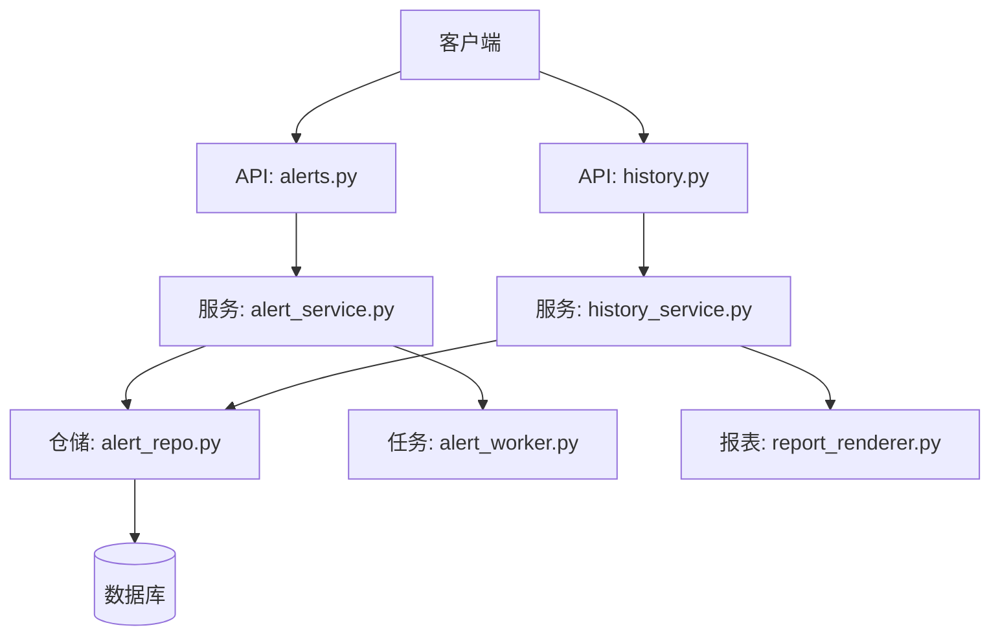
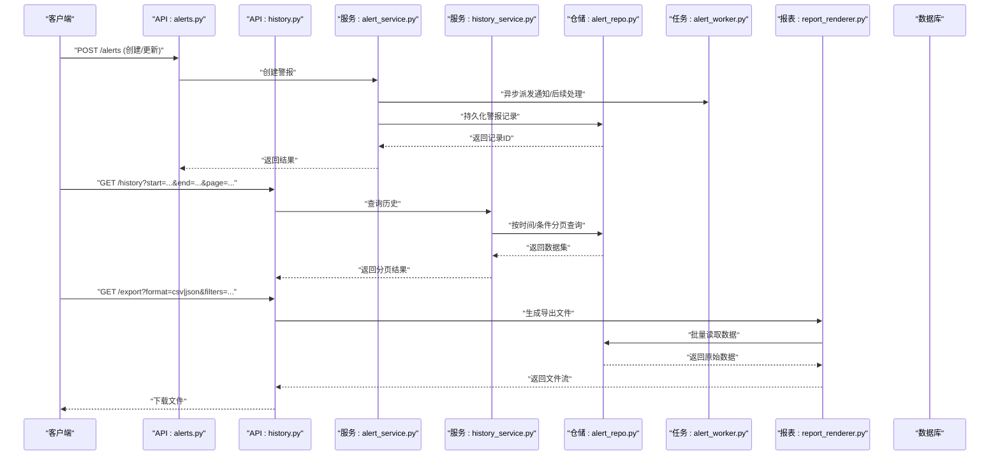
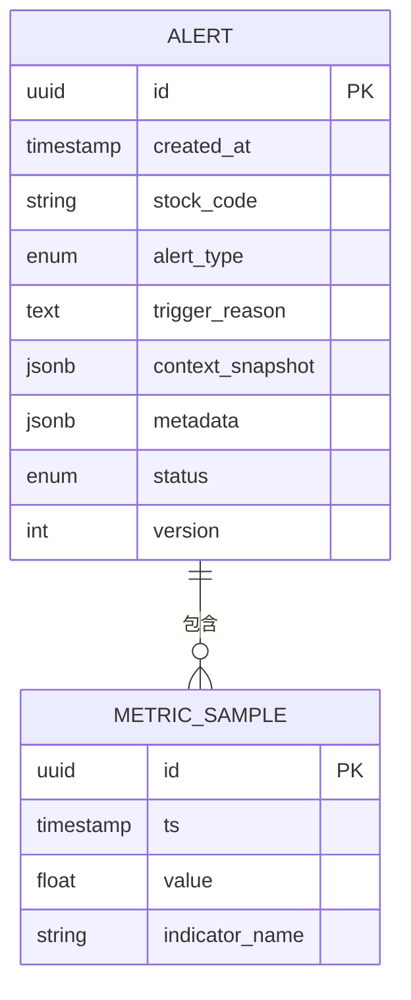
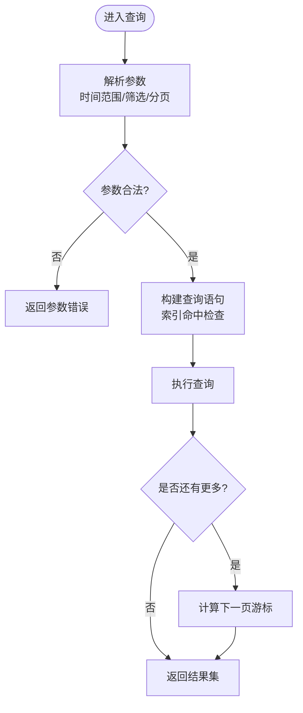
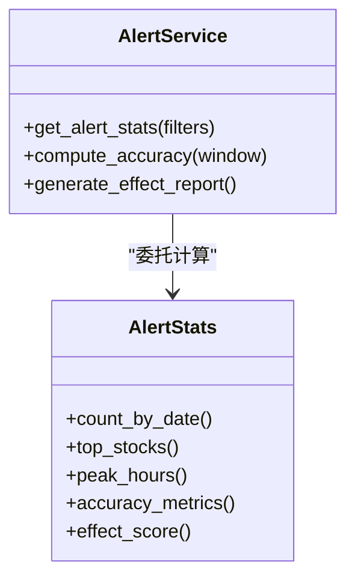
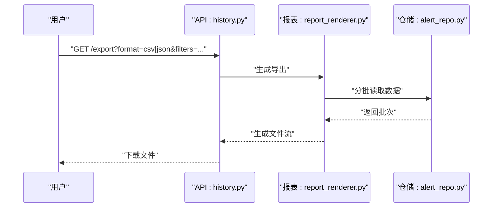
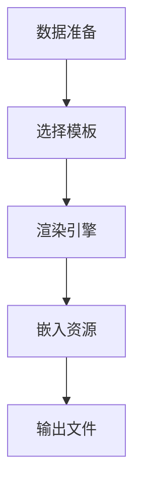
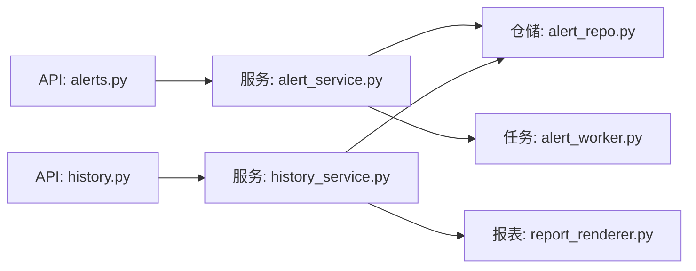

# 警报历史与统计

<cite>
**本文引用的文件**   
- [api/v1/endpoints/alerts.py](file://api/v1/endpoints/alerts.py)
- [api/v1/schemas/alerts.py](file://api/v1/schemas/alerts.py)
- [src/repositories/alert_repo.py](file://src/repositories/alert_repo.py)
- [src/services/alert_service.py](file://src/services/alert_service.py)
- [src/services/alert_worker.py](file://src/services/alert_worker.py)
- [src/services/history_service.py](file://src/services/history_service.py)
- [src/services/report_renderer.py](file://src/services/report_renderer.py)
- [api/v1/endpoints/history.py](file://api/v1/endpoints/history.py)
- [api/v1/schemas/history.py](file://api/v1/schemas/history.py)
- [src/enums.py](file://src/enums.py)
</cite>

## 目录
1. [简介](#简介)
2. [项目结构](#项目结构)
3. [核心组件](#核心组件)
4. [架构总览](#架构总览)
5. [详细组件分析](#详细组件分析)
6. [依赖关系分析](#依赖关系分析)
7. [性能考量](#性能考量)
8. [故障排查指南](#故障排查指南)
9. [结论](#结论)
10. [附录](#附录)

## 简介
本文件面向“Daily Stock Analysis”的警报历史与统计分析功能，系统性阐述：
- 警报历史的存储结构（时间序列数据、元数据管理、索引设计）
- 查询接口设计（时间范围过滤、条件筛选、分页查询）
- 统计分析能力（触发频率分析、准确率评估、效果度量）
- 数据导出（CSV/JSON 支持与批量下载）
- 性能优化建议（数据归档、压缩策略、查询优化）
- 可视化图表与报表生成

该功能贯穿 API 层、服务层、仓储层与任务调度，覆盖从告警产生、持久化、检索到统计分析与报表输出的完整链路。

## 项目结构
围绕警报历史与统计的关键代码分布在以下模块：
- API 路由与请求/响应模型：api/v1/endpoints/alerts.py、api/v1/schemas/alerts.py、api/v1/endpoints/history.py、api/v1/schemas/history.py
- 业务服务：src/services/alert_service.py、src/services/history_service.py、src/services/report_renderer.py
- 数据仓储：src/repositories/alert_repo.py
- 后台任务：src/services/alert_worker.py
- 枚举定义：src/enums.py

**图示来源** 
- [api/v1/endpoints/alerts.py](file://api/v1/endpoints/alerts.py)
- [api/v1/endpoints/history.py](file://api/v1/endpoints/history.py)
- [src/services/alert_service.py](file://src/services/alert_service.py)
- [src/services/history_service.py](file://src/services/history_service.py)
- [src/repositories/alert_repo.py](file://src/repositories/alert_repo.py)
- [src/services/alert_worker.py](file://src/services/alert_worker.py)
- [src/services/report_renderer.py](file://src/services/report_renderer.py)

**章节来源**
- [api/v1/endpoints/alerts.py](file://api/v1/endpoints/alerts.py)
- [api/v1/endpoints/history.py](file://api/v1/endpoints/history.py)
- [src/services/alert_service.py](file://src/services/alert_service.py)
- [src/services/history_service.py](file://src/services/history_service.py)
- [src/repositories/alert_repo.py](file://src/repositories/alert_repo.py)
- [src/services/alert_worker.py](file://src/services/alert_worker.py)
- [src/services/report_renderer.py](file://src/services/report_renderer.py)

## 核心组件
- 警报历史仓储（alert_repo.py）：负责警报记录的增删改查、按时间与条件的过滤、分页与聚合统计。
- 警报服务（alert_service.py）：编排警报生命周期（创建、更新状态、关联指标、触发通知），并暴露统计与分析方法。
- 历史服务（history_service.py）：提供历史数据的统一查询入口，支持时间窗口、多条件筛选与分页。
- 报表渲染（report_renderer.py）：将统计数据与原始记录渲染为 CSV/JSON 等格式，支持批量导出。
- 警报工作器（alert_worker.py）：异步处理警报事件，确保高吞吐写入与可靠投递。
- 枚举（enums.py）：统一定义警报类型、状态、指标类别等常量。

**章节来源**
- [src/repositories/alert_repo.py](file://src/repositories/alert_repo.py)
- [src/services/alert_service.py](file://src/services/alert_service.py)
- [src/services/history_service.py](file://src/services/history_service.py)
- [src/services/report_renderer.py](file://src/services/report_renderer.py)
- [src/services/alert_worker.py](file://src/services/alert_worker.py)
- [src/enums.py](file://src/enums.py)

## 架构总览
警报历史与统计的整体流程如下：
- 前端或外部系统通过 API 发起查询或导出请求
- API 层校验参数并调用服务层
- 服务层协调仓储进行数据读写，必要时触发后台任务
- 仓储层对数据库执行高效查询与聚合
- 报表渲染层生成结构化输出（CSV/JSON）

**图示来源** 
- [api/v1/endpoints/alerts.py](file://api/v1/endpoints/alerts.py)
- [api/v1/endpoints/history.py](file://api/v1/endpoints/history.py)
- [src/services/alert_service.py](file://src/services/alert_service.py)
- [src/services/history_service.py](file://src/services/history_service.py)
- [src/repositories/alert_repo.py](file://src/repositories/alert_repo.py)
- [src/services/alert_worker.py](file://src/services/alert_worker.py)
- [src/services/report_renderer.py](file://src/services/report_renderer.py)

## 详细组件分析

### 存储结构与索引设计
- 时间序列数据
  - 字段包括：时间戳、股票代码、警报类型、触发原因、阈值/指标值、上下文快照、消息体等
  - 时间戳用于范围查询与排序；股票与类型用于分组与聚合
- 元数据管理
  - 版本、来源、策略标识、环境标签、扩展属性等
  - 便于审计与回溯，支持按元数据筛选
- 索引设计
  - 主键：记录ID
  - 复合索引：(时间戳, 股票代码)、(时间戳, 警报类型)、(股票代码, 警报类型)
  - 部分索引：仅活跃/未读记录，提升高频查询性能
  - 分区策略：按时间（日/月）分区，利于归档与清理

**图示来源** 
- [src/repositories/alert_repo.py](file://src/repositories/alert_repo.py)
- [src/enums.py](file://src/enums.py)

**章节来源**
- [src/repositories/alert_repo.py](file://src/repositories/alert_repo.py)
- [src/enums.py](file://src/enums.py)

### 查询接口设计
- 时间范围过滤
  - 支持 start_time、end_time 精确区间查询，默认按 created_at 降序
- 条件筛选
  - 按股票代码、警报类型、状态、元数据键值对筛选
  - 支持模糊匹配与正则表达式（针对文本字段）
- 分页查询
  - page、page_size 控制分页；支持游标分页以提升大数据量性能
- 排序与投影
  - 支持多字段排序；可选字段投影减少传输开销

**图示来源** 
- [api/v1/endpoints/history.py](file://api/v1/endpoints/history.py)
- [api/v1/schemas/history.py](file://api/v1/schemas/history.py)
- [src/services/history_service.py](file://src/services/history_service.py)
- [src/repositories/alert_repo.py](file://src/repositories/alert_repo.py)

**章节来源**
- [api/v1/endpoints/history.py](file://api/v1/endpoints/history.py)
- [api/v1/schemas/history.py](file://api/v1/schemas/history.py)
- [src/services/history_service.py](file://src/services/history_service.py)
- [src/repositories/alert_repo.py](file://src/repositories/alert_repo.py)

### 统计分析功能
- 触发频率分析
  - 按日/周/月统计警报次数、峰值时段、热点股票与类型分布
- 准确率评估
  - 结合后续市场表现与回测结果，计算命中率、平均收益、最大回撤等
- 效果度量
  - 综合评分：基于权重组合（命中率、收益、稳定性、风险调整）
  - 趋势分析：滚动窗口下的指标变化与拐点识别

**图示来源** 
- [src/services/alert_service.py](file://src/services/alert_service.py)
- [src/repositories/alert_repo.py](file://src/repositories/alert_repo.py)

**章节来源**
- [src/services/alert_service.py](file://src/services/alert_service.py)
- [src/repositories/alert_repo.py](file://src/repositories/alert_repo.py)

### 数据导出功能
- 格式支持
  - CSV：适合表格工具与二次分析
  - JSON：适合程序消费与系统集成
- 批量下载
  - 支持按时间范围与筛选条件批量导出
  - 分片导出与断点续传（大文件场景）
- 内容定制
  - 字段选择、列顺序、编码设置、表头语言

**图示来源** 
- [api/v1/endpoints/history.py](file://api/v1/endpoints/history.py)
- [src/services/report_renderer.py](file://src/services/report_renderer.py)
- [src/repositories/alert_repo.py](file://src/repositories/alert_repo.py)

**章节来源**
- [api/v1/endpoints/history.py](file://api/v1/endpoints/history.py)
- [src/services/report_renderer.py](file://src/services/report_renderer.py)
- [src/repositories/alert_repo.py](file://src/repositories/alert_repo.py)

### 可视化图表与报表生成
- 图表类型
  - 折线图（趋势）、柱状图（分布）、热力图（热点）、散点图（相关性）
- 报表模板
  - Markdown/HTML/PDF 模板，支持动态数据注入与样式主题
- 生成流程
  - 数据准备 -> 模板渲染 -> 资源嵌入（图片/样式） -> 输出文件

**图示来源** 
- [src/services/report_renderer.py](file://src/services/report_renderer.py)

**章节来源**
- [src/services/report_renderer.py](file://src/services/report_renderer.py)

## 依赖关系分析
- API 层依赖服务层，服务层依赖仓储层
- 报表渲染依赖仓储的数据访问能力
- 后台任务由服务层触发，解耦主流程
- 枚举集中管理常量，降低耦合度

**图示来源** 
- [api/v1/endpoints/alerts.py](file://api/v1/endpoints/alerts.py)
- [api/v1/endpoints/history.py](file://api/v1/endpoints/history.py)
- [src/services/alert_service.py](file://src/services/alert_service.py)
- [src/services/history_service.py](file://src/services/history_service.py)
- [src/repositories/alert_repo.py](file://src/repositories/alert_repo.py)
- [src/services/report_renderer.py](file://src/services/report_renderer.py)
- [src/services/alert_worker.py](file://src/services/alert_worker.py)

**章节来源**
- [api/v1/endpoints/alerts.py](file://api/v1/endpoints/alerts.py)
- [api/v1/endpoints/history.py](file://api/v1/endpoints/history.py)
- [src/services/alert_service.py](file://src/services/alert_service.py)
- [src/services/history_service.py](file://src/services/history_service.py)
- [src/repositories/alert_repo.py](file://src/repositories/alert_repo.py)
- [src/services/report_renderer.py](file://src/services/report_renderer.py)
- [src/services/alert_worker.py](file://src/services/alert_worker.py)

## 性能考量
- 数据归档
  - 按时间分区归档冷数据，保留热数据在高性能存储
  - 归档后建立只读副本，降低在线库压力
- 压缩策略
  - 历史数据采用列式压缩（如 Parquet）与行级压缩（ZSTD/LZ4）
  - 导出时按需压缩（GZIP/TAR）以减少带宽占用
- 查询优化
  - 使用复合索引与部分索引，避免全表扫描
  - 分页采用游标分页，避免深度分页
  - 预聚合与物化视图加速统计查询
- 缓存与批处理
  - 热点统计结果缓存（TTL 控制）
  - 批量导入/导出使用事务与并行分片

[本节为通用指导，不直接分析具体文件]

## 故障排查指南
- 常见问题
  - 查询超时：检查索引命中与分页深度，增加超时上限或拆分查询
  - 导出失败：确认磁盘空间与内存限制，启用分片导出
  - 统计偏差：核对时间窗口与数据完整性，排除缺失样本
- 诊断手段
  - 日志追踪：记录关键步骤耗时与错误堆栈
  - 慢查询分析：捕获 SQL 执行计划，定位瓶颈
  - 监控告警：CPU/内存/IO 指标异常时自动告警

**章节来源**
- [src/services/alert_service.py](file://src/services/alert_service.py)
- [src/services/history_service.py](file://src/services/history_service.py)
- [src/repositories/alert_repo.py](file://src/repositories/alert_repo.py)

## 结论
警报历史与统计功能通过清晰的层次架构与完善的索引设计，实现了高效的查询与可靠的统计分析。配合灵活的导出与报表能力，满足日常运营与深度分析需求。建议在大规模数据场景下引入分区归档、压缩与缓存策略，进一步提升性能与可维护性。

[本节为总结性内容，不直接分析具体文件]

## 附录
- 术语表
  - 警报：系统根据规则或模型触发的信号记录
  - 时间序列：按时间顺序排列的数据集合
  - 元数据：描述数据的数据，如版本、来源、标签等
  - 索引：加速查询的数据结构
- 参考实现路径
  - 警报 API：[api/v1/endpoints/alerts.py](file://api/v1/endpoints/alerts.py)
  - 历史 API：[api/v1/endpoints/history.py](file://api/v1/endpoints/history.py)
  - 服务层：[src/services/alert_service.py](file://src/services/alert_service.py)、[src/services/history_service.py](file://src/services/history_service.py)
  - 仓储层：[src/repositories/alert_repo.py](file://src/repositories/alert_repo.py)
  - 报表渲染：[src/services/report_renderer.py](file://src/services/report_renderer.py)
  - 任务调度：[src/services/alert_worker.py](file://src/services/alert_worker.py)
  - 枚举定义：[src/enums.py](file://src/enums.py)

[本节为补充信息，不直接分析具体文件]