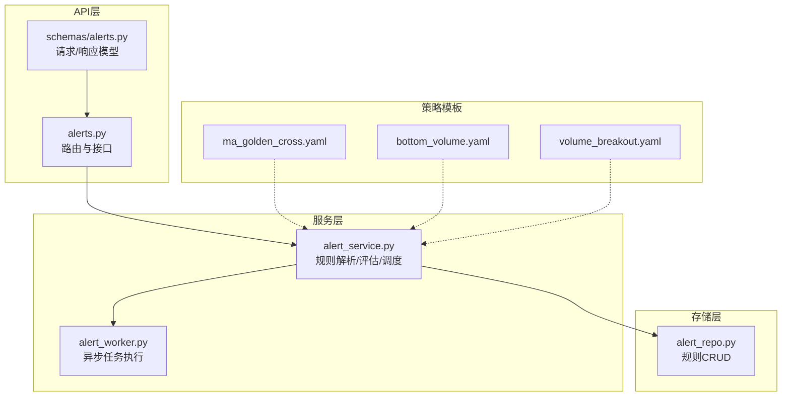
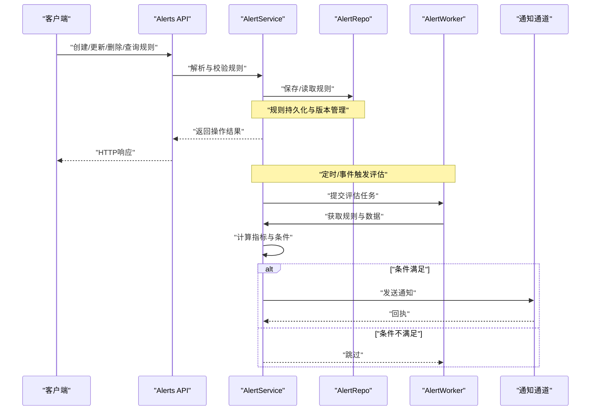
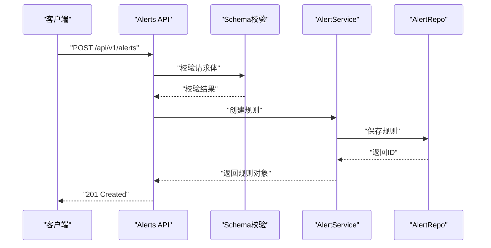
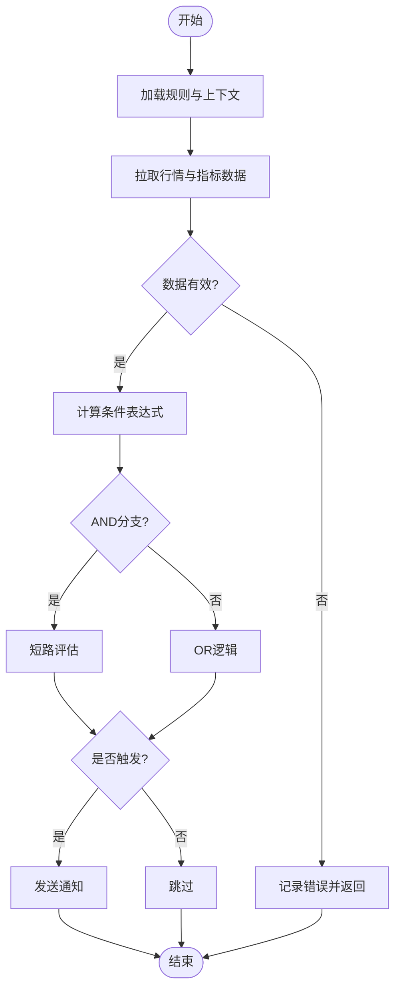
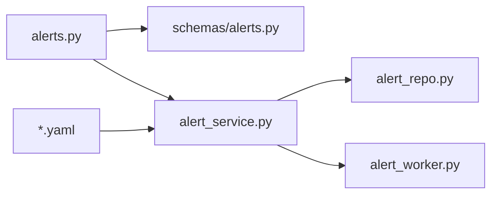

# 警报规则定义

<cite>
**本文引用的文件**   
- [api/v1/endpoints/alerts.py](file://api/v1/endpoints/alerts.py)
- [api/v1/schemas/alerts.py](file://api/v1/schemas/alerts.py)
- [src/services/alert_service.py](file://src/services/alert_service.py)
- [src/services/alert_worker.py](file://src/services/alert_worker.py)
- [src/repositories/alert_repo.py](file://src/repositories/alert_repo.py)
- [strategies/ma_golden_cross.yaml](file://strategies/ma_golden_cross.yaml)
- [strategies/bottom_volume.yaml](file://strategies/bottom_volume.yaml)
- [strategies/volume_breakout.yaml](file://strategies/volume_breakout.yaml)
- [tests/test_alert_api.py](file://tests/test_alert_api.py)
- [tests/test_alert_worker.py](file://tests/test_alert_worker.py)
</cite>

## 目录
1. [简介](#简介)
2. [项目结构](#项目结构)
3. [核心组件](#核心组件)
4. [架构总览](#架构总览)
5. [详细组件分析](#详细组件分析)
6. [依赖关系分析](#依赖关系分析)
7. [性能考量](#性能考量)
8. [故障排查指南](#故障排查指南)
9. [结论](#结论)
10. [附录](#附录)

## 简介
本文件面向Daily Stock Analysis的“每日股票分析”模块中的警报规则定义，系统性说明：
- 警报规则的语法结构与条件表达式（技术指标、价格变动、时间窗口）
- 规则配置的JSON/YAML格式规范（字段定义、数据类型、校验规则）
- 常见使用场景的配置示例（突破、超买超卖、成交量异动等）
- 规则优先级与组合逻辑（AND/OR）
- 规则模板与最佳实践

该文档旨在帮助使用者快速构建稳定、可维护且高性能的警报规则。

## 项目结构
与警报规则相关的代码主要分布在以下位置：
- API层：路由与请求/响应Schema定义
- 服务层：规则解析、评估、调度与执行
- 存储层：规则持久化与查询
- 策略模板：YAML格式的常用规则模板
- 测试：API与Worker的行为验证

图表来源 
- [api/v1/endpoints/alerts.py](file://api/v1/endpoints/alerts.py)
- [api/v1/schemas/alerts.py](file://api/v1/schemas/alerts.py)
- [src/services/alert_service.py](file://src/services/alert_service.py)
- [src/services/alert_worker.py](file://src/services/alert_worker.py)
- [src/repositories/alert_repo.py](file://src/repositories/alert_repo.py)
- [strategies/ma_golden_cross.yaml](file://strategies/ma_golden_cross.yaml)
- [strategies/bottom_volume.yaml](file://strategies/bottom_volume.yaml)
- [strategies/volume_breakout.yaml](file://strategies/volume_breakout.yaml)

章节来源
- [api/v1/endpoints/alerts.py](file://api/v1/endpoints/alerts.py)
- [api/v1/schemas/alerts.py](file://api/v1/schemas/alerts.py)
- [src/services/alert_service.py](file://src/services/alert_service.py)
- [src/services/alert_worker.py](file://src/services/alert_worker.py)
- [src/repositories/alert_repo.py](file://src/repositories/alert_repo.py)

## 核心组件
- 规则Schema与校验：通过Pydantic模型定义规则字段、类型与约束，确保输入合法性
- 规则解析器：将JSON/YAML配置转换为内部规则对象，支持指标、价格、时间窗口条件
- 规则评估引擎：基于市场数据与技术指标计算条件表达式，返回触发结果
- 调度与执行：定时或事件驱动触发规则评估，异步执行通知动作
- 存储与版本：规则持久化、历史快照与回滚能力

章节来源
- [api/v1/schemas/alerts.py](file://api/v1/schemas/alerts.py)
- [src/services/alert_service.py](file://src/services/alert_service.py)
- [src/services/alert_worker.py](file://src/services/alert_worker.py)
- [src/repositories/alert_repo.py](file://src/repositories/alert_repo.py)

## 架构总览
警报系统采用分层架构：API接收请求并校验，服务层负责规则解析与评估，Worker异步执行通知，Repository提供持久化能力。策略模板以YAML形式提供常用规则，便于复用与扩展。

图表来源 
- [api/v1/endpoints/alerts.py](file://api/v1/endpoints/alerts.py)
- [src/services/alert_service.py](file://src/services/alert_service.py)
- [src/services/alert_worker.py](file://src/services/alert_worker.py)
- [src/repositories/alert_repo.py](file://src/repositories/alert_repo.py)

## 详细组件分析

### 规则Schema与校验（Pydantic模型）
- 字段定义：规则名称、描述、标的范围、条件表达式、时间窗口、优先级、动作、启用状态等
- 数据类型：字符串、数值、布尔、枚举、数组、对象嵌套
- 校验规则：必填项、取值范围、正则匹配、依赖字段校验、跨字段一致性检查

章节来源
- [api/v1/schemas/alerts.py](file://api/v1/schemas/alerts.py)

### 规则解析与评估（服务层）
- 解析流程：加载JSON/YAML -> 映射为内部规则对象 -> 校验字段 -> 生成评估计划
- 评估流程：拉取行情数据 -> 计算技术指标 -> 应用条件表达式 -> 判定触发 -> 生成结果
- 错误处理：数据缺失、指标计算异常、表达式语法错误、权限不足等

章节来源
- [src/services/alert_service.py](file://src/services/alert_service.py)

### 异步执行与通知（Worker）
- 任务队列：规则评估任务入队、并发控制、重试与退避
- 通知通道：多渠道适配（邮件、企业微信、钉钉、飞书、Slack等）
- 幂等性：去重、重复触发保护、冷却时间

章节来源
- [src/services/alert_worker.py](file://src/services/alert_worker.py)

### 存储与版本（Repository）
- CRUD接口：创建、读取、更新、删除规则
- 版本管理：规则变更历史、快照对比、回滚
- 查询优化：按标的、标签、优先级索引

章节来源
- [src/repositories/alert_repo.py](file://src/repositories/alert_repo.py)

### 策略模板（YAML）
以下为常见策略模板的文件路径，供参考与复用：
- 均线金叉模板：[ma_golden_cross.yaml](file://strategies/ma_golden_cross.yaml)
- 底部放量模板：[bottom_volume.yaml](file://strategies/bottom_volume.yaml)
- 放量突破模板：[volume_breakout.yaml](file://strategies/volume_breakout.yaml)

章节来源
- [strategies/ma_golden_cross.yaml](file://strategies/ma_golden_cross.yaml)
- [strategies/bottom_volume.yaml](file://strategies/bottom_volume.yaml)
- [strategies/volume_breakout.yaml](file://strategies/volume_breakout.yaml)

### 条件表达式语法
- 技术指标条件：RSI、MACD、均线交叉、布林带、KDJ等
  - 示例字段：指标名称、周期、阈值、比较符（大于、小于、等于、区间）
- 价格变动条件：涨跌幅阈值、价格突破、量价背离
  - 示例字段：价格字段、百分比、绝对值、时间段
- 时间窗口条件：交易日过滤、盘中时段、周期性检查（如每5分钟）
  - 示例字段：开始时间、结束时间、时区、频率

章节来源
- [src/services/alert_service.py](file://src/services/alert_service.py)

### 组合逻辑与优先级
- 组合逻辑：AND（全部满足）、OR（任一满足）、NOT（取反），支持嵌套
- 优先级：数字越小优先级越高；同优先级按定义顺序执行
- 短路评估：AND遇到第一个失败即终止；OR遇到第一个成功即终止

章节来源
- [src/services/alert_service.py](file://src/services/alert_service.py)

### API工作流（序列图）

图表来源 
- [api/v1/endpoints/alerts.py](file://api/v1/endpoints/alerts.py)
- [api/v1/schemas/alerts.py](file://api/v1/schemas/alerts.py)
- [src/services/alert_service.py](file://src/services/alert_service.py)
- [src/repositories/alert_repo.py](file://src/repositories/alert_repo.py)

### 评估流程图（算法）

图表来源 
- [src/services/alert_service.py](file://src/services/alert_service.py)

## 依赖关系分析
- API层依赖Schema进行输入校验，调用服务层完成业务逻辑
- 服务层依赖Repository进行规则持久化，依赖Worker进行异步执行
- Worker依赖通知适配器实现多渠道推送
- 策略模板作为规则源，被服务层解析加载

图表来源 
- [api/v1/endpoints/alerts.py](file://api/v1/endpoints/alerts.py)
- [api/v1/schemas/alerts.py](file://api/v1/schemas/alerts.py)
- [src/services/alert_service.py](file://src/services/alert_service.py)
- [src/services/alert_worker.py](file://src/services/alert_worker.py)
- [src/repositories/alert_repo.py](file://src/repositories/alert_repo.py)

章节来源
- [api/v1/endpoints/alerts.py](file://api/v1/endpoints/alerts.py)
- [api/v1/schemas/alerts.py](file://api/v1/schemas/alerts.py)
- [src/services/alert_service.py](file://src/services/alert_service.py)
- [src/services/alert_worker.py](file://src/services/alert_worker.py)
- [src/repositories/alert_repo.py](file://src/repositories/alert_repo.py)

## 性能考量
- 指标缓存：对高频指标（如RSI、MACD）进行缓存，减少重复计算
- 批量评估：按标的分组批量拉取数据，降低IO开销
- 异步执行：评估与通知分离，避免阻塞主流程
- 限流与降级：外部数据源限流，失败时回退到缓存或默认值
- 索引优化：对规则查询字段建立索引，提升检索效率

## 故障排查指南
- 常见问题
  - 规则校验失败：检查必填字段、数据类型、取值范围
  - 指标计算异常：确认数据源可用性、周期参数合理性
  - 条件不触发：检查表达式语法、阈值设置、时间窗口
  - 通知失败：核对渠道配置、网络连通性、消息格式
- 调试建议
  - 开启详细日志，定位错误堆栈
  - 使用最小化规则复现问题
  - 查看历史快照与变更记录

章节来源
- [tests/test_alert_api.py](file://tests/test_alert_api.py)
- [tests/test_alert_worker.py](file://tests/test_alert_worker.py)

## 结论
通过清晰的Schema定义、健壮的服务层解析与评估、异步Worker执行以及灵活的策略模板，Daily Stock Analysis提供了强大而易用的警报规则体系。遵循本文档的语法规范与最佳实践，可快速构建覆盖多种交易场景的高可用警报规则。

## 附录

### JSON/YAML规则配置规范
- 基本字段
  - name: 字符串，规则名称（必填）
  - description: 字符串，规则描述（可选）
  - symbols: 数组，标的代码列表（必填）
  - conditions: 对象，条件表达式（必填）
  - time_window: 对象，时间窗口（可选）
  - priority: 整数，优先级（默认0，越小越优先）
  - actions: 数组，触发动作（必填）
  - enabled: 布尔，是否启用（默认true）
- 条件表达式
  - type: 枚举，indicator/price/time（必填）
  - indicator: 对象，技术指标（当type=indicator时必填）
    - name: 字符串，指标名（如rsi/macd/ma）
    - params: 对象，参数（如period、threshold）
    - operator: 字符串，比较符（gt/lt/eq/in）
    - value: 数值或对象，阈值或区间
  - price: 对象，价格条件（当type=price时必填）
    - field: 字符串，价格字段（open/high/low/close/volume）
    - change_pct: 数值，涨跌幅阈值
    - breakout: 布尔，是否突破前高/前低
  - time: 对象，时间条件（当type=time时必填）
    - start: 字符串，开始时间（HH:mm）
    - end: 字符串，结束时间（HH:mm）
    - timezone: 字符串，时区（如Asia/Shanghai）
    - frequency: 字符串，检查频率（如5min/1h）
- 组合逻辑
  - and: 数组，子条件（全部满足）
  - or: 数组，子条件（任一满足）
  - not: 对象，取反条件
- 动作
  - type: 枚举，notify/webhook/email（必填）
  - channel: 字符串，通知渠道标识（必填）
  - payload: 对象，消息内容（可选）

章节来源
- [api/v1/schemas/alerts.py](file://api/v1/schemas/alerts.py)
- [src/services/alert_service.py](file://src/services/alert_service.py)

### 常见使用场景示例
- 突破警报
  - 条件：价格突破前高 + 成交量放大
  - 时间窗口：交易时段内
  - 动作：即时通知
- 超买超卖警报
  - 条件：RSI > 70（超买）或 RSI < 30（超卖）
  - 时间窗口：每5分钟检查
  - 动作：推送至企业微信
- 成交量异动警报
  - 条件：成交量较过去N日均值超过X%
  - 时间窗口：开盘后30分钟内
  - 动作：发送邮件摘要

章节来源
- [strategies/ma_golden_cross.yaml](file://strategies/ma_golden_cross.yaml)
- [strategies/bottom_volume.yaml](file://strategies/bottom_volume.yaml)
- [strategies/volume_breakout.yaml](file://strategies/volume_breakout.yaml)

### 规则模板与最佳实践
- 模板复用：从策略模板起步，逐步定制个性化条件
- 字段校验：充分利用Schema校验，提前发现配置错误
- 性能优化：合理设置时间窗口与频率，避免过度频繁评估
- 安全加固：限制symbols范围，防止恶意注入
- 监控告警：对规则执行成功率与延迟进行监控

章节来源
- [src/services/alert_service.py](file://src/services/alert_service.py)
- [api/v1/schemas/alerts.py](file://api/v1/schemas/alerts.py)