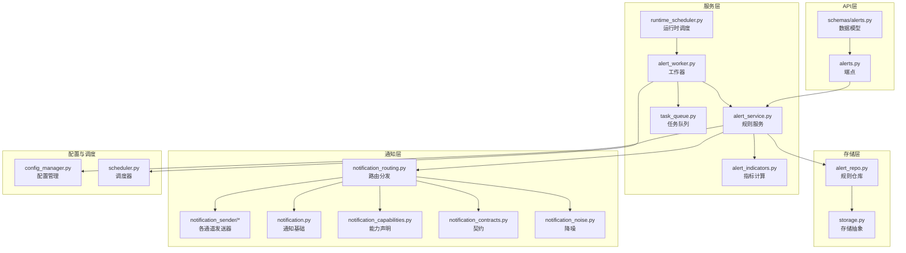
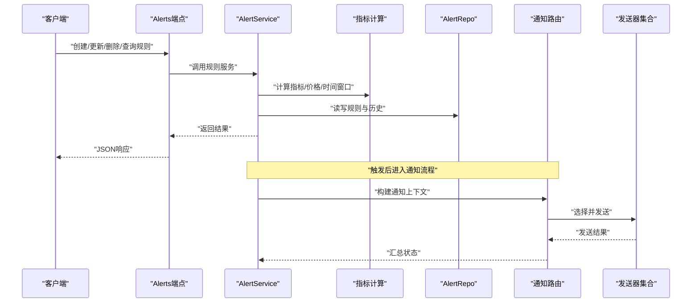
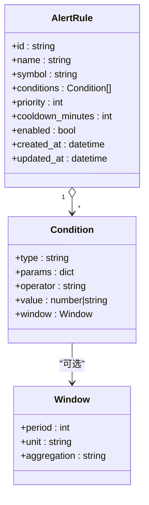
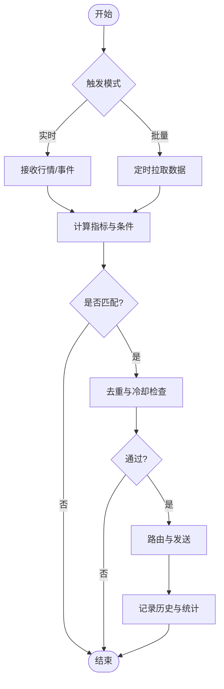
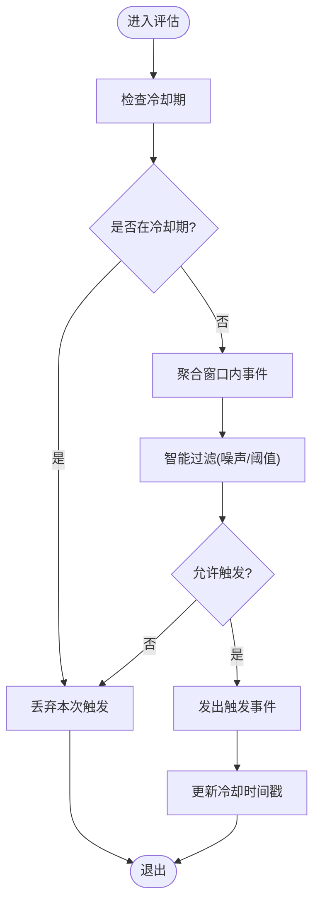
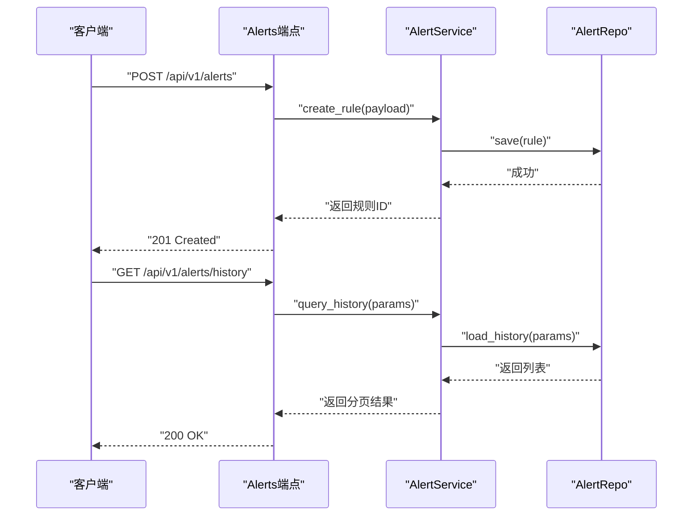
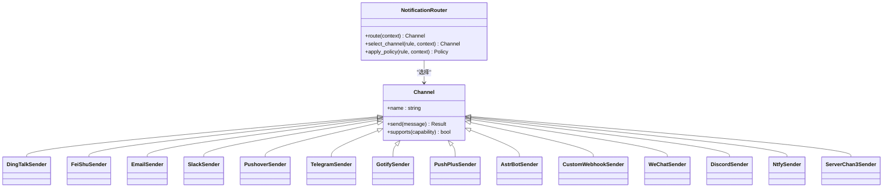
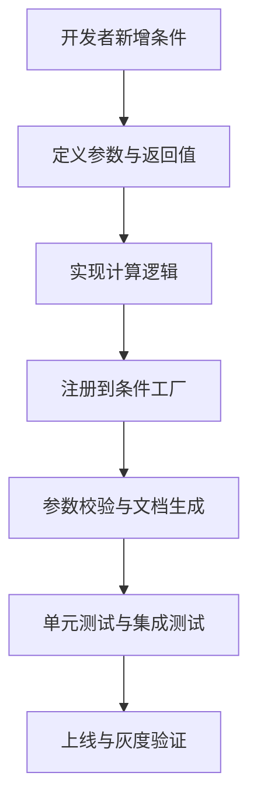
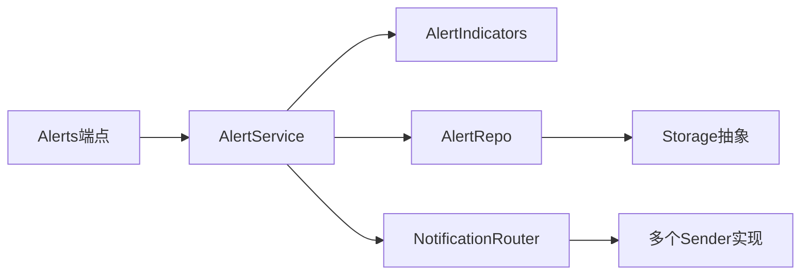

# 警报规则系统

<cite>
**本文档引用的文件**   
- [api/v1/endpoints/alerts.py](file://api/v1/endpoints/alerts.py)
- [api/v1/schemas/alerts.py](file://api/v1/schemas/alerts.py)
- [src/services/alert_service.py](file://src/services/alert_service.py)
- [src/services/alert_worker.py](file://src/services/alert_worker.py)
- [src/repositories/alert_repo.py](file://src/repositories/alert_repo.py)
- [src/services/alert_indicators.py](file://src/services/alert_indicators.py)
- [src/notification_routing.py](file://src/notification_routing.py)
- [src/notification_sender/__init__.py](file://src/notification_sender/__init__.py)
- [src/notification_sender/dingtalk_sender.py](file://src/notification_sender/dingtalk_sender.py)
- [src/notification_sender/feishu_sender.py](file://src/notification_sender/feishu_sender.py)
- [src/notification_sender/email_sender.py](file://src/notification_sender/email_sender.py)
- [src/notification_sender/slack_sender.py](file://src/notification_sender/slack_sender.py)
- [src/notification_sender/pushover_sender.py](file://src/notification_sender/pushover_sender.py)
- [src/notification_sender/telegram_sender.py](file://src/notification_sender/telegram_sender.py)
- [src/notification_sender/gotify_sender.py](file://src/notification_sender/gotify_sender.py)
- [src/notification_sender/pushplus_sender.py](file://src/notification_sender/pushplus_sender.py)
- [src/notification_sender/astrbot_sender.py](file://src/notification_sender/astrbot_sender.py)
- [src/notification_sender/custom_webhook_sender.py](file://src/notification_sender/custom_webhook_sender.py)
- [src/notification_sender/wechat_sender.py](file://src/notification_sender/wechat_sender.py)
- [src/notification_sender/discord_sender.py](file://src/notification_sender/discord_sender.py)
- [src/notification_sender/ntfy_sender.py](file://src/notification_sender/ntfy_sender.py)
- [src/notification_sender/serverchan3_sender.py](file://src/notification_sender/serverchan3_sender.py)
- [src/notification.py](file://src/notification.py)
- [src/notification_capabilities.py](file://src/notification_capabilities.py)
- [src/notification_contracts.py](file://src/notification_contracts.py)
- [src/notification_noise.py](file://src/notification_noise.py)
- [src/scheduler.py](file://src/scheduler.py)
- [src/runtime_scheduler.py](file://src/services/runtime_scheduler.py)
- [src/task_queue.py](file://src/services/task_queue.py)
- [src/config_manager.py](file://src/core/config_manager.py)
- [src/storage.py](file://src/storage.py)
- [main.py](file://main.py)
- [server.py](file://server.py)
- [tests/test_alert_api.py](file://tests/test_alert_api.py)
- [tests/test_alert_worker.py](file://tests/test_alert_worker.py)
- [tests/test_market_light_alerts.py](file://tests/test_market_light_alerts.py)
- [tests/test_portfolio_alerts.py](file://tests/test_portfolio_alerts.py)
</cite>

## 目录
1. [简介](#简介)
2. [项目结构](#项目结构)
3. [核心组件](#核心组件)
4. [架构总览](#架构总览)
5. [详细组件分析](#详细组件分析)
6. [依赖关系分析](#依赖关系分析)
7. [性能考量](#性能考量)
8. [故障排查指南](#故障排查指南)
9. [结论](#结论)
10. [附录](#附录)

## 简介
本文件面向Daily Stock Analysis的“警报规则系统”，系统性说明：
- 警报规则的定义语法与条件表达式（技术指标、价格变动、时间窗口）
- 触发机制实现原理（实时监测、批量检查、事件驱动处理）
- 频率控制与去重策略（冷却时间、条件聚合、智能过滤）
- 规则的CRUD接口与使用示例
- 优先级管理与路由分发机制
- 历史查询与统计分析能力
- 自定义警报条件的开发指南

## 项目结构
警报相关代码主要分布在以下模块：
- API层：定义REST端点与请求/响应模型
- 服务层：封装业务逻辑，包括指标计算、规则评估、调度与执行
- 存储层：规则与历史记录的持久化
- 通知层：多通道发送与路由分发
- 调度与任务队列：定时与异步执行
- 配置与存储：系统配置与本地存储抽象

图表来源
- [api/v1/endpoints/alerts.py](file://api/v1/endpoints/alerts.py)
- [api/v1/schemas/alerts.py](file://api/v1/schemas/alerts.py)
- [src/services/alert_service.py](file://src/services/alert_service.py)
- [src/services/alert_worker.py](file://src/services/alert_worker.py)
- [src/services/alert_indicators.py](file://src/services/alert_indicators.py)
- [src/services/runtime_scheduler.py](file://src/services/runtime_scheduler.py)
- [src/services/task_queue.py](file://src/services/task_queue.py)
- [src/repositories/alert_repo.py](file://src/repositories/alert_repo.py)
- [src/storage.py](file://src/storage.py)
- [src/notification_routing.py](file://src/notification_routing.py)
- [src/notification_sender/__init__.py](file://src/notification_sender/__init__.py)
- [src/notification.py](file://src/notification.py)
- [src/notification_capabilities.py](file://src/notification_capabilities.py)
- [src/notification_contracts.py](file://src/notification_contracts.py)
- [src/notification_noise.py](file://src/notification_noise.py)
- [src/scheduler.py](file://src/scheduler.py)
- [src/core/config_manager.py](file://src/core/config_manager.py)

章节来源
- [api/v1/endpoints/alerts.py](file://api/v1/endpoints/alerts.py)
- [api/v1/schemas/alerts.py](file://api/v1/schemas/alerts.py)
- [src/services/alert_service.py](file://src/services/alert_service.py)
- [src/services/alert_worker.py](file://src/services/alert_worker.py)
- [src/repositories/alert_repo.py](file://src/repositories/alert_repo.py)
- [src/services/alert_indicators.py](file://src/services/alert_indicators.py)
- [src/notification_routing.py](file://src/notification_routing.py)
- [src/notification_sender/__init__.py](file://src/notification_sender/__init__.py)
- [src/notification.py](file://src/notification.py)
- [src/notification_capabilities.py](file://src/notification_capabilities.py)
- [src/notification_contracts.py](file://src/notification_contracts.py)
- [src/notification_noise.py](file://src/notification_noise.py)
- [src/scheduler.py](file://src/scheduler.py)
- [src/services/runtime_scheduler.py](file://src/services/runtime_scheduler.py)
- [src/services/task_queue.py](file://src/services/task_queue.py)
- [src/core/config_manager.py](file://src/core/config_manager.py)
- [src/storage.py](file://src/storage.py)

## 核心组件
- 规则定义与校验：通过Pydantic模型约束规则字段、条件表达式结构与类型
- 规则服务：负责规则生命周期管理、条件评估、聚合与去重、历史记录写入
- 指标计算：提供技术指标与价格变动等原子条件计算
- 工作器与调度：按周期或事件触发规则评估，支持批量与实时模式
- 通知路由：根据规则与上下文选择合适通道并发送
- 存储与配置：规则与历史数据的持久化，以及系统级开关与阈值配置

章节来源
- [api/v1/schemas/alerts.py](file://api/v1/schemas/alerts.py)
- [src/services/alert_service.py](file://src/services/alert_service.py)
- [src/services/alert_indicators.py](file://src/services/alert_indicators.py)
- [src/services/alert_worker.py](file://src/services/alert_worker.py)
- [src/repositories/alert_repo.py](file://src/repositories/alert_repo.py)
- [src/notification_routing.py](file://src/notification_routing.py)
- [src/core/config_manager.py](file://src/core/config_manager.py)

## 架构总览
警报系统采用分层架构：API层暴露REST接口；服务层编排规则评估与通知；存储层负责持久化；通知层统一路由到多通道；调度与任务队列支撑定时与异步执行。

图表来源
- [api/v1/endpoints/alerts.py](file://api/v1/endpoints/alerts.py)
- [src/services/alert_service.py](file://src/services/alert_service.py)
- [src/services/alert_indicators.py](file://src/services/alert_indicators.py)
- [src/repositories/alert_repo.py](file://src/repositories/alert_repo.py)
- [src/notification_routing.py](file://src/notification_routing.py)
- [src/notification_sender/__init__.py](file://src/notification_sender/__init__.py)

## 详细组件分析

### 规则定义与条件表达式
- 技术指标条件：支持常见技术指标（如均线、RSI、MACD、布林带等）的阈值比较与交叉判断
- 价格变动条件：支持涨跌幅、突破前高/前低、成交量异动等
- 时间窗口条件：支持N分钟/N小时/N日窗口内的统计与趋势判定
- 组合条件：支持AND/OR/NOT组合，支持嵌套括号与优先级

图表来源
- [api/v1/schemas/alerts.py](file://api/v1/schemas/alerts.py)
- [src/services/alert_indicators.py](file://src/services/alert_indicators.py)

章节来源
- [api/v1/schemas/alerts.py](file://api/v1/schemas/alerts.py)
- [src/services/alert_indicators.py](file://src/services/alert_indicators.py)

### 触发机制与处理流程
- 实时监测：订阅行情流或短轮询，增量更新指标并快速评估
- 批量检查：定时任务拉取全量规则与标的，批量计算与评估
- 事件驱动：外部事件（如财报发布、指数异动）触发特定规则重评估

图表来源
- [src/services/alert_worker.py](file://src/services/alert_worker.py)
- [src/services/alert_service.py](file://src/services/alert_service.py)
- [src/scheduler.py](file://src/scheduler.py)
- [src/services/runtime_scheduler.py](file://src/services/runtime_scheduler.py)

章节来源
- [src/services/alert_worker.py](file://src/services/alert_worker.py)
- [src/services/alert_service.py](file://src/services/alert_service.py)
- [src/scheduler.py](file://src/scheduler.py)
- [src/services/runtime_scheduler.py](file://src/services/runtime_scheduler.py)

### 频率控制与去重策略
- 冷却时间：同一规则对同一标的在冷却期内不重复触发
- 条件聚合：将短时间内多次满足的条件合并为一次通知
- 智能过滤：基于噪声抑制、波动率阈值、市场阶段等降低误报

图表来源
- [src/services/alert_service.py](file://src/services/alert_service.py)
- [src/notification_noise.py](file://src/notification_noise.py)

章节来源
- [src/services/alert_service.py](file://src/services/alert_service.py)
- [src/notification_noise.py](file://src/notification_noise.py)

### CRUD接口与使用示例
- 创建规则：POST /api/v1/alerts
- 更新规则：PUT /api/v1/alerts/{id}
- 删除规则：DELETE /api/v1/alerts/{id}
- 查询规则：GET /api/v1/alerts?symbol=&enabled=
- 触发测试：POST /api/v1/alerts/{id}/test
- 历史查询：GET /api/v1/alerts/history?symbol=&rule_id=&start=&end=

图表来源
- [api/v1/endpoints/alerts.py](file://api/v1/endpoints/alerts.py)
- [src/services/alert_service.py](file://src/services/alert_service.py)
- [src/repositories/alert_repo.py](file://src/repositories/alert_repo.py)

章节来源
- [api/v1/endpoints/alerts.py](file://api/v1/endpoints/alerts.py)
- [src/services/alert_service.py](file://src/services/alert_service.py)
- [src/repositories/alert_repo.py](file://src/repositories/alert_repo.py)

### 优先级管理与路由分发
- 优先级：规则可设置优先级，高优先级优先评估与发送
- 路由策略：根据规则标签、标的类别、时间段、渠道偏好进行路由
- 通道选择：支持钉钉、飞书、邮件、Slack、Pushover、Telegram、Gotify、PushPlus、AstrBot、Webhook、企业微信、Discord、Ntfy、ServerChan3等

图表来源
- [src/notification_routing.py](file://src/notification_routing.py)
- [src/notification_sender/__init__.py](file://src/notification_sender/__init__.py)
- [src/notification_sender/dingtalk_sender.py](file://src/notification_sender/dingtalk_sender.py)
- [src/notification_sender/feishu_sender.py](file://src/notification_sender/feishu_sender.py)
- [src/notification_sender/email_sender.py](file://src/notification_sender/email_sender.py)
- [src/notification_sender/slack_sender.py](file://src/notification_sender/slack_sender.py)
- [src/notification_sender/pushover_sender.py](file://src/notification_sender/pushover_sender.py)
- [src/notification_sender/telegram_sender.py](file://src/notification_sender/telegram_sender.py)
- [src/notification_sender/gotify_sender.py](file://src/notification_sender/gotify_sender.py)
- [src/notification_sender/pushplus_sender.py](file://src/notification_sender/pushplus_sender.py)
- [src/notification_sender/astrbot_sender.py](file://src/notification_sender/astrbot_sender.py)
- [src/notification_sender/custom_webhook_sender.py](file://src/notification_sender/custom_webhook_sender.py)
- [src/notification_sender/wechat_sender.py](file://src/notification_sender/wechat_sender.py)
- [src/notification_sender/discord_sender.py](file://src/notification_sender/discord_sender.py)
- [src/notification_sender/ntfy_sender.py](file://src/notification_sender/ntfy_sender.py)
- [src/notification_sender/serverchan3_sender.py](file://src/notification_sender/serverchan3_sender.py)

章节来源
- [src/notification_routing.py](file://src/notification_routing.py)
- [src/notification_sender/__init__.py](file://src/notification_sender/__init__.py)
- [src/notification.py](file://src/notification.py)
- [src/notification_capabilities.py](file://src/notification_capabilities.py)
- [src/notification_contracts.py](file://src/notification_contracts.py)

### 历史查询与统计分析
- 历史查询：按规则、标的、时间范围筛选，支持分页与排序
- 统计指标：触发次数、命中率、平均延迟、通道分布、失败重试次数
- 报表输出：导出CSV/Markdown，用于复盘与审计

章节来源
- [src/repositories/alert_repo.py](file://src/repositories/alert_repo.py)
- [src/services/alert_service.py](file://src/services/alert_service.py)

### 自定义警报条件开发指南
- 扩展点：在指标计算模块注册新的条件类型
- 输入规范：明确参数类型、默认值与取值范围
- 返回值：布尔或评分，便于组合与排序
- 测试要求：覆盖边界条件与异常路径，保证稳定性

图表来源
- [src/services/alert_indicators.py](file://src/services/alert_indicators.py)

章节来源
- [src/services/alert_indicators.py](file://src/services/alert_indicators.py)

## 依赖关系分析
- 低耦合：API与服务分离，服务与存储通过仓库接口解耦
- 可扩展：通知通道通过统一接口接入，新增通道无需改动路由核心
- 可观测：历史与统计提供审计与排障依据

图表来源
- [api/v1/endpoints/alerts.py](file://api/v1/endpoints/alerts.py)
- [src/services/alert_service.py](file://src/services/alert_service.py)
- [src/services/alert_indicators.py](file://src/services/alert_indicators.py)
- [src/repositories/alert_repo.py](file://src/repositories/alert_repo.py)
- [src/notification_routing.py](file://src/notification_routing.py)
- [src/storage.py](file://src/storage.py)

章节来源
- [api/v1/endpoints/alerts.py](file://api/v1/endpoints/alerts.py)
- [src/services/alert_service.py](file://src/services/alert_service.py)
- [src/repositories/alert_repo.py](file://src/repositories/alert_repo.py)
- [src/notification_routing.py](file://src/notification_routing.py)
- [src/storage.py](file://src/storage.py)

## 性能考量
- 批量评估：使用批处理减少IO与网络开销
- 缓存指标：对常用指标做短期缓存，避免重复计算
- 异步发送：通知发送走队列，避免阻塞主流程
- 限流与退避：对外部通道实施限流与指数退避

[本节为通用指导，不直接分析具体文件]

## 故障排查指南
- 常见问题
  - 规则未触发：检查条件参数、时间窗口、标的可用性
  - 重复通知：确认冷却时间与聚合策略配置
  - 发送失败：检查通道配置、网络连通性与认证信息
- 定位方法
  - 查看历史与统计，定位失败与延迟
  - 开启调试日志，追踪评估与路由链路
  - 使用测试接口模拟触发，验证端到端流程

章节来源
- [src/services/alert_service.py](file://src/services/alert_service.py)
- [src/notification_routing.py](file://src/notification_routing.py)
- [src/notification_noise.py](file://src/notification_noise.py)

## 结论
本系统以清晰的层次与可扩展的设计，实现了从规则定义、条件评估、频率控制到多渠道通知的完整闭环。通过统一的接口与契约，用户可灵活扩展条件与通道，并通过历史与统计能力持续优化策略效果。

[本节为总结性内容，不直接分析具体文件]

## 附录
- 运行入口与服务器启动：参见主程序与服务器脚本
- 测试用例：覆盖API与工作器的关键路径

章节来源
- [main.py](file://main.py)
- [server.py](file://server.py)
- [tests/test_alert_api.py](file://tests/test_alert_api.py)
- [tests/test_alert_worker.py](file://tests/test_alert_worker.py)
- [tests/test_market_light_alerts.py](file://tests/test_market_light_alerts.py)
- [tests/test_portfolio_alerts.py](file://tests/test_portfolio_alerts.py)