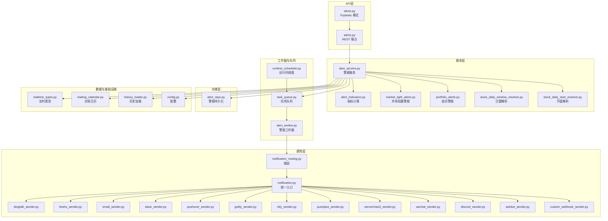
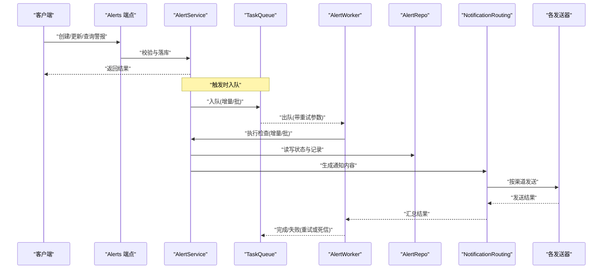
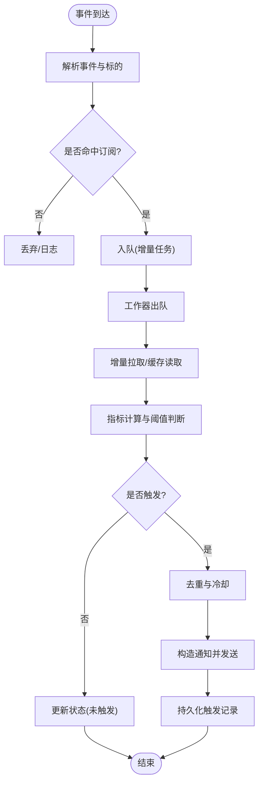
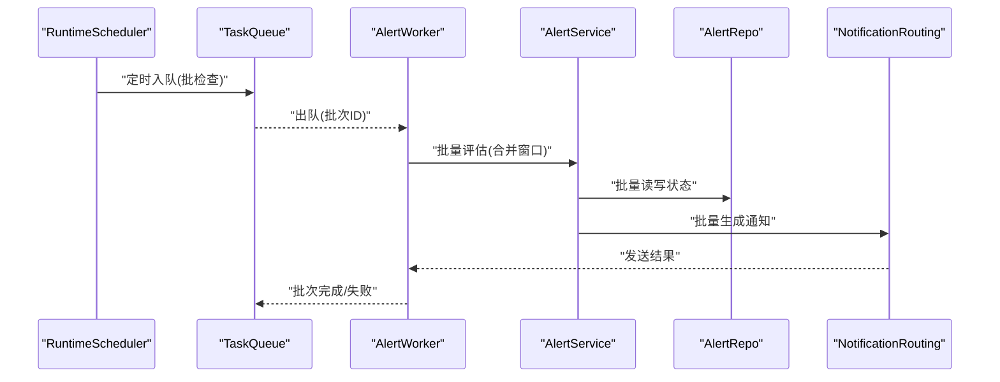
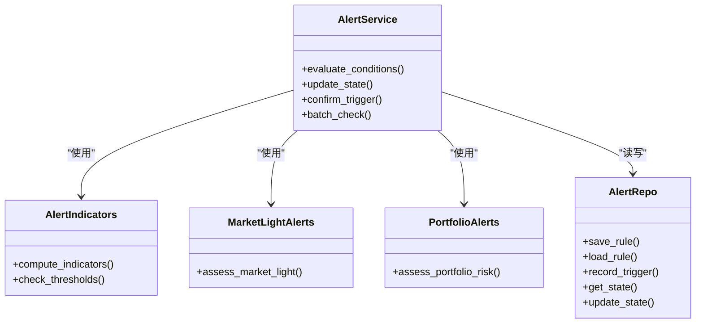
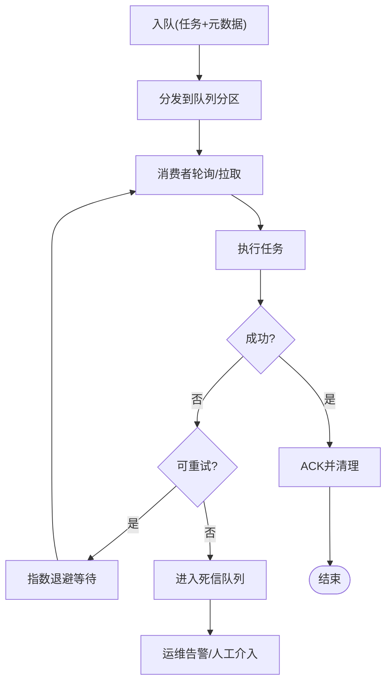
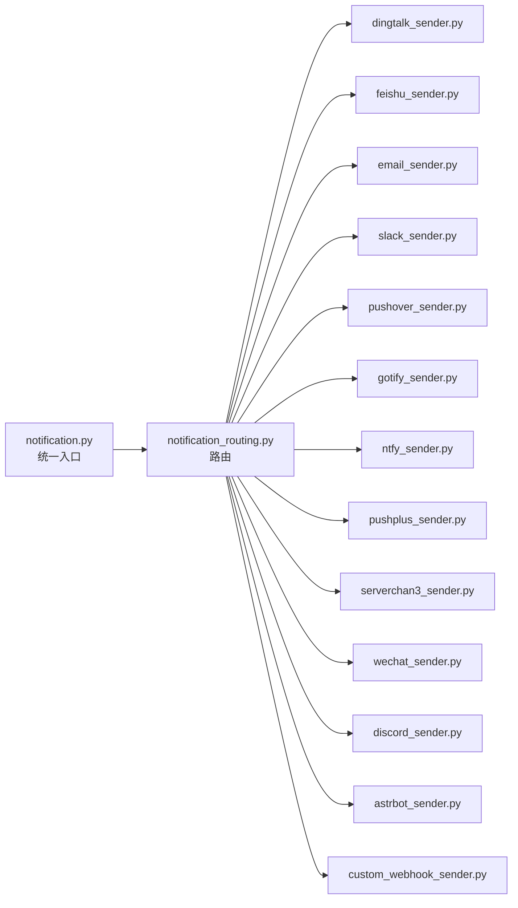
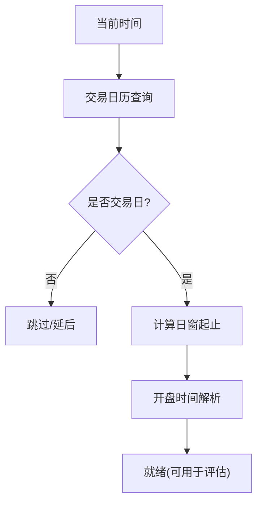
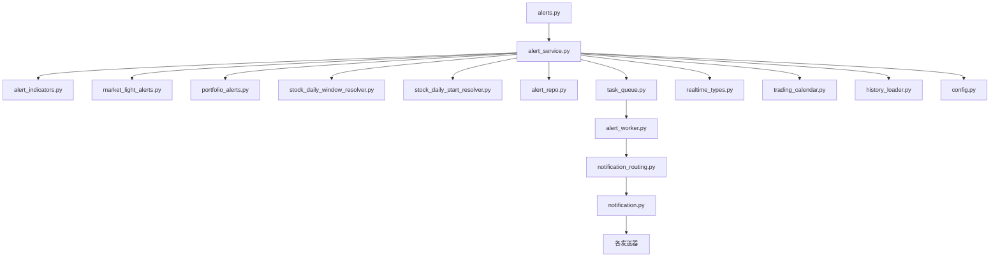

# 警报触发机制

<cite>
**本文引用的文件**   
- [api/v1/endpoints/alerts.py](file://api/v1/endpoints/alerts.py)
- [api/v1/schemas/alerts.py](file://api/v1/schemas/alerts.py)
- [src/services/alert_service.py](file://src/services/alert_service.py)
- [src/services/alert_worker.py](file://src/services/alert_worker.py)
- [src/services/task_queue.py](file://src/services/task_queue.py)
- [src/repositories/alert_repo.py](file://src/repositories/alert_repo.py)
- [src/services/runtime_scheduler.py](file://src/services/runtime_scheduler.py)
- [src/notification.py](file://src/notification.py)
- [src/notification_routing.py](file://src/notification_routing.py)
- [src/notification_sender/dingtalk_sender.py](file://src/notification_sender/dingtalk_sender.py)
- [src/notification_sender/feishu_sender.py](file://src/notification_sender/feishu_sender.py)
- [src/notification_sender/email_sender.py](file://src/notification_sender/email_sender.py)
- [src/notification_sender/slack_sender.py](file://src/notification_sender/slack_sender.py)
- [src/notification_sender/pushover_sender.py](file://src/notification_sender/pushover_sender.py)
- [src/notification_sender/gotify_sender.py](file://src/notification_sender/gotify_sender.py)
- [src/notification_sender/ntfy_sender.py](file://src/notification_sender/ntfy_sender.py)
- [src/notification_sender/pushplus_sender.py](file://src/notification_sender/pushplus_sender.py)
- [src/notification_sender/serverchan3_sender.py](file://src/notification_sender/serverchan3_sender.py)
- [src/notification_sender/wechat_sender.py](file://src/notification_sender/wechat_sender.py)
- [src/notification_sender/discord_sender.py](file://src/notification_sender/discord_sender.py)
- [src/notification_sender/astrbot_sender.py](file://src/notification_sender/astrbot_sender.py)
- [src/notification_sender/custom_webhook_sender.py](file://src/notification_sender/custom_webhook_sender.py)
- [src/services/alert_indicators.py](file://src/services/alert_indicators.py)
- [src/services/market_light_alerts.py](file://src/services/market_light_alerts.py)
- [src/services/portfolio_alerts.py](file://src/services/portfolio_alerts.py)
- [src/services/stock_daily_start_resolver.py](file://src/services/stock_daily_start_resolver.py)
- [src/services/stock_daily_window_resolver.py](file://src/services/stock_daily_window_resolver.py)
- [src/services/stock_code_utils.py](file://src/services/stock_code_utils.py)
- [src/services/history_loader.py](file://src/services/history_loader.py)
- [src/data_provider/realtime_types.py](file://src/data_provider/realtime_types.py)
- [src/core/trading_calendar.py](file://src/core/trading_calendar.py)
- [src/config.py](file://src/config.py)
- [main.py](file://main.py)
- [server.py](file://server.py)
</cite>

## 目录
1. [简介](#简介)
2. [项目结构](#项目结构)
3. [核心组件](#核心组件)
4. [架构总览](#架构总览)
5. [详细组件分析](#详细组件分析)
6. [依赖关系分析](#依赖关系分析)
7. [性能考虑](#性能考虑)
8. [故障排查指南](#故障排查指南)
9. [结论](#结论)
10. [附录](#附录)

## 简介
本文件围绕 Daily Stock Analysis 的“警报触发机制”进行系统化说明，覆盖以下关键主题：
- 实时监测的实现原理：数据流监听、增量更新与事件驱动处理
- 批量检查机制：定时任务调度、批处理优化与并发控制
- 警报判断逻辑：条件匹配、状态管理与触发确认
- 异步任务队列：任务分发、重试机制与错误处理
- 性能优化策略：缓存、索引与查询调优
- 监控与调试工具使用方法

## 项目结构
与警报触发机制相关的代码主要分布在如下模块：
- API 层：暴露警报配置、查询与触发的接口
- 服务层：封装警报规则计算、市场/组合维度警报、窗口解析等
- 工作器与队列：负责异步执行、重试与错误恢复
- 仓储层：持久化警报定义与历史
- 通知层：多通道发送与路由
- 数据源与日历：提供行情数据与交易日历
- 调度器：定时任务编排

图表来源
- [api/v1/endpoints/alerts.py](file://api/v1/endpoints/alerts.py)
- [api/v1/schemas/alerts.py](file://api/v1/schemas/alerts.py)
- [src/services/alert_service.py](file://src/services/alert_service.py)
- [src/services/alert_indicators.py](file://src/services/alert_indicators.py)
- [src/services/market_light_alerts.py](file://src/services/market_light_alerts.py)
- [src/services/portfolio_alerts.py](file://src/services/portfolio_alerts.py)
- [src/services/stock_daily_window_resolver.py](file://src/services/stock_daily_window_resolver.py)
- [src/services/stock_daily_start_resolver.py](file://src/services/stock_daily_start_resolver.py)
- [src/repositories/alert_repo.py](file://src/repositories/alert_repo.py)
- [src/services/task_queue.py](file://src/services/task_queue.py)
- [src/services/alert_worker.py](file://src/services/alert_worker.py)
- [src/services/runtime_scheduler.py](file://src/services/runtime_scheduler.py)
- [src/notification.py](file://src/notification.py)
- [src/notification_routing.py](file://src/notification_routing.py)
- [src/data_provider/realtime_types.py](file://src/data_provider/realtime_types.py)
- [src/core/trading_calendar.py](file://src/core/trading_calendar.py)
- [src/services/history_loader.py](file://src/services/history_loader.py)
- [src/config.py](file://src/config.py)

章节来源
- [api/v1/endpoints/alerts.py](file://api/v1/endpoints/alerts.py)
- [api/v1/schemas/alerts.py](file://api/v1/schemas/alerts.py)
- [src/services/alert_service.py](file://src/services/alert_service.py)
- [src/services/alert_worker.py](file://src/services/alert_worker.py)
- [src/services/task_queue.py](file://src/services/task_queue.py)
- [src/repositories/alert_repo.py](file://src/repositories/alert_repo.py)
- [src/services/runtime_scheduler.py](file://src/services/runtime_scheduler.py)
- [src/notification.py](file://src/notification.py)
- [src/notification_routing.py](file://src/notification_routing.py)
- [src/data_provider/realtime_types.py](file://src/data_provider/realtime_types.py)
- [src/core/trading_calendar.py](file://src/core/trading_calendar.py)
- [src/services/history_loader.py](file://src/services/history_loader.py)
- [src/config.py](file://src/config.py)

## 核心组件
- 警报服务（AlertService）：聚合指标计算、市场/组合警报判定、窗口解析与状态管理，协调仓储与队列。
- 警报工作器（AlertWorker）：从队列消费任务，执行增量检查、去重与幂等写入，并触发通知。
- 任务队列（TaskQueue）：提供任务入队、出队、重试与失败处理；支持并发与限流。
- 运行时调度（RuntimeScheduler）：按交易日历与策略周期调度批检查任务。
- 通知路由与发送器：根据渠道配置选择发送器，统一格式与重试。
- 仓储（AlertRepo）：存储警报规则、触发记录与状态。
- 数据与日历：实时类型、历史加载、交易日历为判断提供基础数据。

章节来源
- [src/services/alert_service.py](file://src/services/alert_service.py)
- [src/services/alert_worker.py](file://src/services/alert_worker.py)
- [src/services/task_queue.py](file://src/services/task_queue.py)
- [src/services/runtime_scheduler.py](file://src/services/runtime_scheduler.py)
- [src/notification.py](file://src/notification.py)
- [src/notification_routing.py](file://src/notification_routing.py)
- [src/repositories/alert_repo.py](file://src/repositories/alert_repo.py)
- [src/data_provider/realtime_types.py](file://src/data_provider/realtime_types.py)
- [src/core/trading_calendar.py](file://src/core/trading_calendar.py)

## 架构总览
系统采用“事件驱动 + 批处理”的双模架构：
- 实时路径：数据变更事件进入队列，工作器增量处理，快速反馈
- 批量路径：调度器按交易日历触发批检查，合并窗口数据，批量评估与通知

图表来源
- [api/v1/endpoints/alerts.py](file://api/v1/endpoints/alerts.py)
- [src/services/alert_service.py](file://src/services/alert_service.py)
- [src/services/task_queue.py](file://src/services/task_queue.py)
- [src/services/alert_worker.py](file://src/services/alert_worker.py)
- [src/repositories/alert_repo.py](file://src/repositories/alert_repo.py)
- [src/notification.py](file://src/notification.py)
- [src/notification_routing.py](file://src/notification_routing.py)

## 详细组件分析

### 实时监测与事件驱动
- 数据流监听：通过实时类型与数据源适配，捕获最新报价/成交/资金流等事件
- 增量更新：仅对变化标的与指标窗口进行计算，避免全量扫描
- 事件驱动：事件入队后由工作器消费，保证顺序与幂等

图表来源
- [src/data_provider/realtime_types.py](file://src/data_provider/realtime_types.py)
- [src/services/alert_worker.py](file://src/services/alert_worker.py)
- [src/services/alert_indicators.py](file://src/services/alert_indicators.py)
- [src/repositories/alert_repo.py](file://src/repositories/alert_repo.py)
- [src/notification.py](file://src/notification.py)

章节来源
- [src/data_provider/realtime_types.py](file://src/data_provider/realtime_types.py)
- [src/services/alert_worker.py](file://src/services/alert_worker.py)
- [src/services/alert_indicators.py](file://src/services/alert_indicators.py)
- [src/repositories/alert_repo.py](file://src/repositories/alert_repo.py)
- [src/notification.py](file://src/notification.py)

### 批量检查机制（定时任务调度、批处理优化、并发控制）
- 调度：基于交易日历与策略周期，启动批检查任务
- 批处理：按标的分组、窗口合并，减少重复 IO
- 并发：限制并发度，避免资源争用与下游限流

图表来源
- [src/services/runtime_scheduler.py](file://src/services/runtime_scheduler.py)
- [src/services/task_queue.py](file://src/services/task_queue.py)
- [src/services/alert_worker.py](file://src/services/alert_worker.py)
- [src/services/alert_service.py](file://src/services/alert_service.py)
- [src/repositories/alert_repo.py](file://src/repositories/alert_repo.py)
- [src/notification.py](file://src/notification.py)
- [src/notification_routing.py](file://src/notification_routing.py)

章节来源
- [src/services/runtime_scheduler.py](file://src/services/runtime_scheduler.py)
- [src/services/task_queue.py](file://src/services/task_queue.py)
- [src/services/alert_worker.py](file://src/services/alert_worker.py)
- [src/services/alert_service.py](file://src/services/alert_service.py)
- [src/repositories/alert_repo.py](file://src/repositories/alert_repo.py)
- [src/notification.py](file://src/notification.py)
- [src/notification_routing.py](file://src/notification_routing.py)

### 警报触发判断逻辑（条件匹配、状态管理、触发确认）
- 条件匹配：技术指标、价格行为、资金流向、市场轻量信号与组合风险
- 状态管理：维护“未触发/观察中/已触发/冷却中”等状态，防止抖动
- 触发确认：满足阈值且通过冷却/去重策略后确认为有效触发

图表来源
- [src/services/alert_service.py](file://src/services/alert_service.py)
- [src/services/alert_indicators.py](file://src/services/alert_indicators.py)
- [src/services/market_light_alerts.py](file://src/services/market_light_alerts.py)
- [src/services/portfolio_alerts.py](file://src/services/portfolio_alerts.py)
- [src/repositories/alert_repo.py](file://src/repositories/alert_repo.py)

章节来源
- [src/services/alert_service.py](file://src/services/alert_service.py)
- [src/services/alert_indicators.py](file://src/services/alert_indicators.py)
- [src/services/market_light_alerts.py](file://src/services/market_light_alerts.py)
- [src/services/portfolio_alerts.py](file://src/services/portfolio_alerts.py)
- [src/repositories/alert_repo.py](file://src/repositories/alert_repo.py)

### 异步任务队列（任务分发、重试机制、错误处理）
- 任务分发：按优先级与标签分发到不同消费者
- 重试机制：指数退避、最大重试次数、死信队列
- 错误处理：异常分类、告警降级与回滚

图表来源
- [src/services/task_queue.py](file://src/services/task_queue.py)
- [src/services/alert_worker.py](file://src/services/alert_worker.py)

章节来源
- [src/services/task_queue.py](file://src/services/task_queue.py)
- [src/services/alert_worker.py](file://src/services/alert_worker.py)

### 通知路由与发送器
- 路由：根据渠道配置与用户偏好选择发送器
- 统一入口：格式化消息体、模板渲染与附件处理
- 多通道：钉钉、飞书、邮件、Slack、Pushover、Gotify、Ntfy、PushPlus、Server酱3、企业微信、Discord、AstrBot、自定义Webhook

图表来源
- [src/notification.py](file://src/notification.py)
- [src/notification_routing.py](file://src/notification_routing.py)
- [src/notification_sender/dingtalk_sender.py](file://src/notification_sender/dingtalk_sender.py)
- [src/notification_sender/feishu_sender.py](file://src/notification_sender/feishu_sender.py)
- [src/notification_sender/email_sender.py](file://src/notification_sender/email_sender.py)
- [src/notification_sender/slack_sender.py](file://src/notification_sender/slack_sender.py)
- [src/notification_sender/pushover_sender.py](file://src/notification_sender/pushover_sender.py)
- [src/notification_sender/gotify_sender.py](file://src/notification_sender/gotify_sender.py)
- [src/notification_sender/ntfy_sender.py](file://src/notification_sender/ntfy_sender.py)
- [src/notification_sender/pushplus_sender.py](file://src/notification_sender/pushplus_sender.py)
- [src/notification_sender/serverchan3_sender.py](file://src/notification_sender/serverchan3_sender.py)
- [src/notification_sender/wechat_sender.py](file://src/notification_sender/wechat_sender.py)
- [src/notification_sender/discord_sender.py](file://src/notification_sender/discord_sender.py)
- [src/notification_sender/astrbot_sender.py](file://src/notification_sender/astrbot_sender.py)
- [src/notification_sender/custom_webhook_sender.py](file://src/notification_sender/custom_webhook_sender.py)

章节来源
- [src/notification.py](file://src/notification.py)
- [src/notification_routing.py](file://src/notification_routing.py)
- [src/notification_sender/dingtalk_sender.py](file://src/notification_sender/dingtalk_sender.py)
- [src/notification_sender/feishu_sender.py](file://src/notification_sender/feishu_sender.py)
- [src/notification_sender/email_sender.py](file://src/notification_sender/email_sender.py)
- [src/notification_sender/slack_sender.py](file://src/notification_sender/slack_sender.py)
- [src/notification_sender/pushover_sender.py](file://src/notification_sender/pushover_sender.py)
- [src/notification_sender/gotify_sender.py](file://src/notification_sender/gotify_sender.py)
- [src/notification_sender/ntfy_sender.py](file://src/notification_sender/ntfy_sender.py)
- [src/notification_sender/pushplus_sender.py](file://src/notification_sender/pushplus_sender.py)
- [src/notification_sender/serverchan3_sender.py](file://src/notification_sender/serverchan3_sender.py)
- [src/notification_sender/wechat_sender.py](file://src/notification_sender/wechat_sender.py)
- [src/notification_sender/discord_sender.py](file://src/notification_sender/discord_sender.py)
- [src/notification_sender/astrbot_sender.py](file://src/notification_sender/astrbot_sender.py)
- [src/notification_sender/custom_webhook_sender.py](file://src/notification_sender/custom_webhook_sender.py)

### 窗口与日历支撑
- 日窗解析：确定每日评估的时间窗口与边界
- 开盘解析：识别交易日开始时间，对齐事件与批任务
- 交易日历：过滤非交易日与节假日

图表来源
- [src/services/stock_daily_window_resolver.py](file://src/services/stock_daily_window_resolver.py)
- [src/services/stock_daily_start_resolver.py](file://src/services/stock_daily_start_resolver.py)
- [src/core/trading_calendar.py](file://src/core/trading_calendar.py)

章节来源
- [src/services/stock_daily_window_resolver.py](file://src/services/stock_daily_window_resolver.py)
- [src/services/stock_daily_start_resolver.py](file://src/services/stock_daily_start_resolver.py)
- [src/core/trading_calendar.py](file://src/core/trading_calendar.py)

## 依赖关系分析
- 低耦合：服务层通过仓储与队列抽象，屏蔽底层实现细节
- 高内聚：通知路由集中管理多渠道发送逻辑
- 外部依赖：数据源、日历、配置与各类通知通道

图表来源
- [api/v1/endpoints/alerts.py](file://api/v1/endpoints/alerts.py)
- [src/services/alert_service.py](file://src/services/alert_service.py)
- [src/services/alert_indicators.py](file://src/services/alert_indicators.py)
- [src/services/market_light_alerts.py](file://src/services/market_light_alerts.py)
- [src/services/portfolio_alerts.py](file://src/services/portfolio_alerts.py)
- [src/services/stock_daily_window_resolver.py](file://src/services/stock_daily_window_resolver.py)
- [src/services/stock_daily_start_resolver.py](file://src/services/stock_daily_start_resolver.py)
- [src/repositories/alert_repo.py](file://src/repositories/alert_repo.py)
- [src/services/task_queue.py](file://src/services/task_queue.py)
- [src/services/alert_worker.py](file://src/services/alert_worker.py)
- [src/notification_routing.py](file://src/notification_routing.py)
- [src/notification.py](file://src/notification.py)
- [src/data_provider/realtime_types.py](file://src/data_provider/realtime_types.py)
- [src/core/trading_calendar.py](file://src/core/trading_calendar.py)
- [src/services/history_loader.py](file://src/services/history_loader.py)
- [src/config.py](file://src/config.py)

章节来源
- [api/v1/endpoints/alerts.py](file://api/v1/endpoints/alerts.py)
- [src/services/alert_service.py](file://src/services/alert_service.py)
- [src/services/task_queue.py](file://src/services/task_queue.py)
- [src/services/alert_worker.py](file://src/services/alert_worker.py)
- [src/notification.py](file://src/notification.py)
- [src/notification_routing.py](file://src/notification_routing.py)
- [src/repositories/alert_repo.py](file://src/repositories/alert_repo.py)
- [src/data_provider/realtime_types.py](file://src/data_provider/realtime_types.py)
- [src/core/trading_calendar.py](file://src/core/trading_calendar.py)
- [src/services/history_loader.py](file://src/services/history_loader.py)
- [src/config.py](file://src/config.py)

## 性能考虑
- 缓存机制
  - 指标与行情缓存：减少重复计算与网络请求
  - 状态缓存：加速去重与冷却判断
- 索引优化
  - 标的与规则索引：提升条件匹配效率
  - 触发记录索引：便于回溯与审计
- 查询调优
  - 增量拉取：仅获取必要字段与时间范围
  - 批处理合并：合并窗口与批量写入
- 并发与限流
  - 队列消费者并发度控制
  - 下游通道限流与退避

[本节为通用指导，不直接分析具体文件]

## 故障排查指南
- 常见问题定位
  - 队列堆积：检查消费者健康、重试策略与死信队列
  - 通知失败：核对渠道配置、网络连通性与速率限制
  - 误报/漏报：审查阈值、冷却与去重策略
- 调试建议
  - 开启详细日志与追踪ID
  - 回放事件与批任务，复现场景
  - 隔离单标的验证，逐步扩大范围
- 监控要点
  - 队列长度、消费延迟、失败率
  - 通知成功率与延迟
  - 指标计算耗时与缓存命中率

章节来源
- [src/services/task_queue.py](file://src/services/task_queue.py)
- [src/services/alert_worker.py](file://src/services/alert_worker.py)
- [src/notification.py](file://src/notification.py)
- [src/notification_routing.py](file://src/notification_routing.py)

## 结论
Daily Stock Analysis 的警报触发机制以事件驱动为核心，结合定时批处理，兼顾实时性与吞吐能力。通过清晰的职责分层、稳健的队列与重试机制、以及多通道通知路由，实现了可扩展、可观测与易维护的警报系统。在生产环境中，应重点关注缓存、索引与并发配置，确保在高峰时段稳定运行。

[本节为总结性内容，不直接分析具体文件]

## 附录
- 启动与集成
  - 后端服务入口：main.py、server.py
  - API 路由：api/v1/endpoints/alerts.py
  - 配置项：src/config.py

章节来源
- [main.py](file://main.py)
- [server.py](file://server.py)
- [api/v1/endpoints/alerts.py](file://api/v1/endpoints/alerts.py)
- [src/config.py](file://src/config.py)