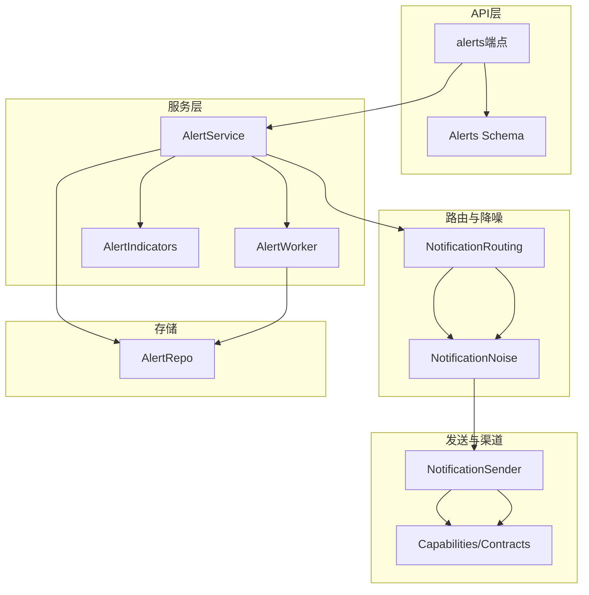
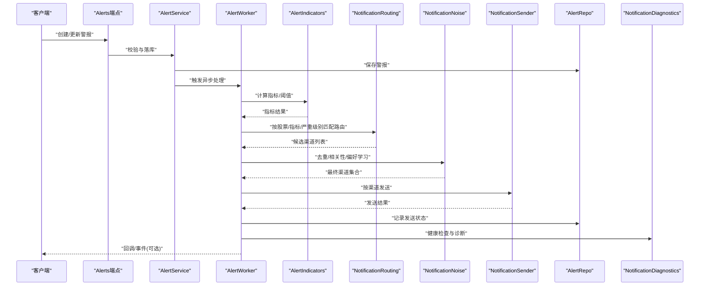
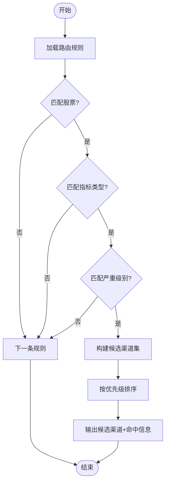
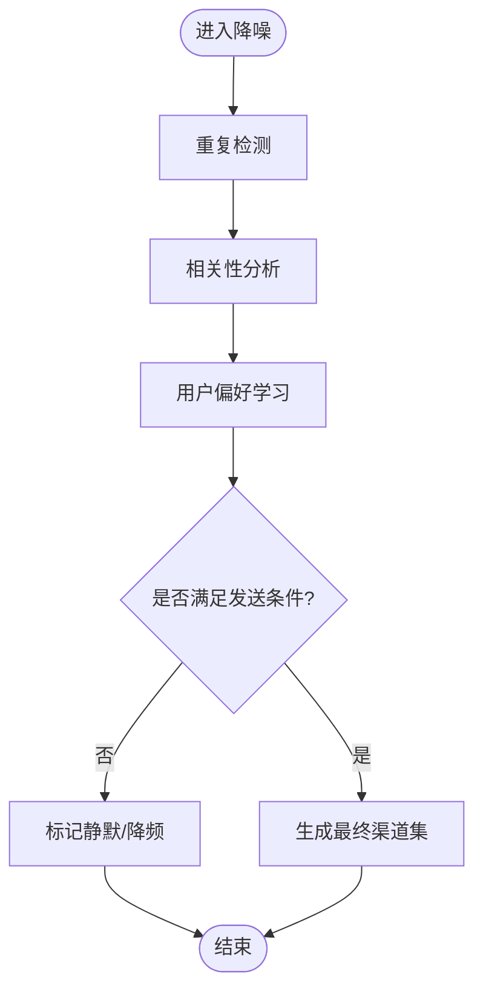
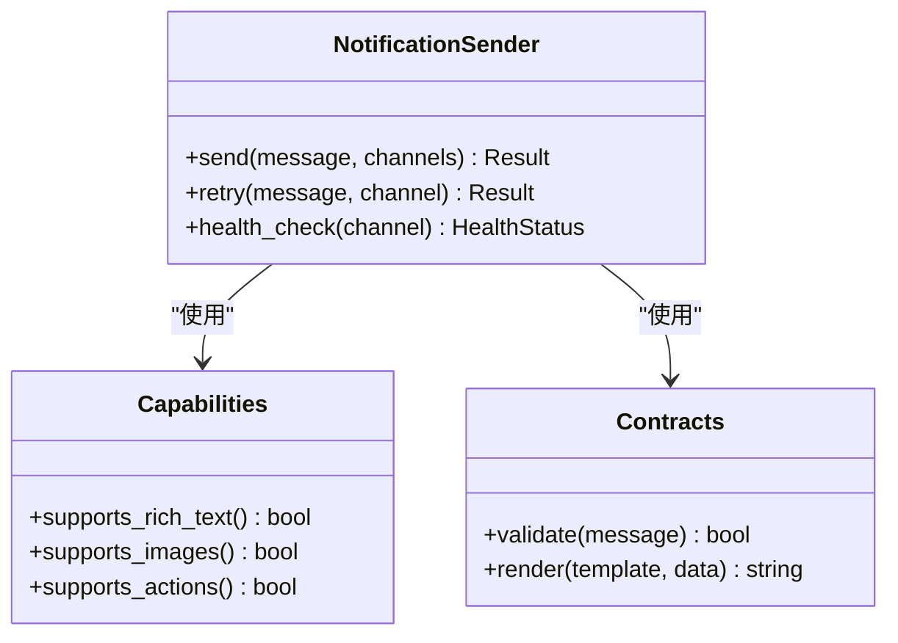
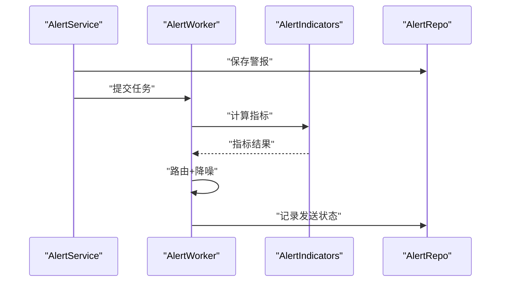
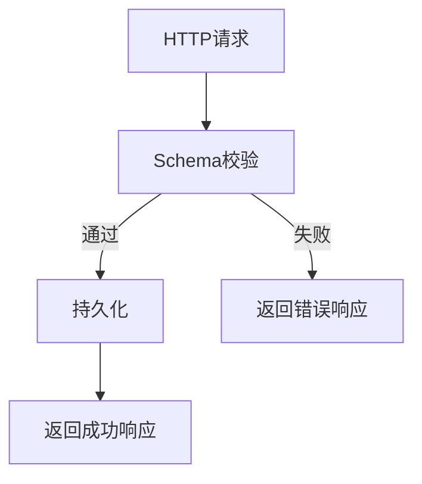
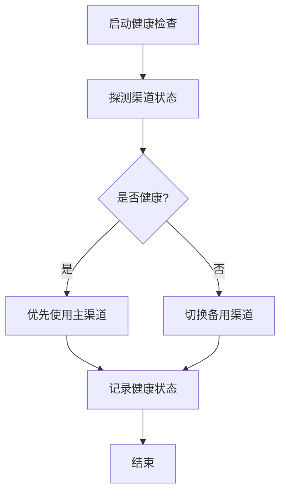
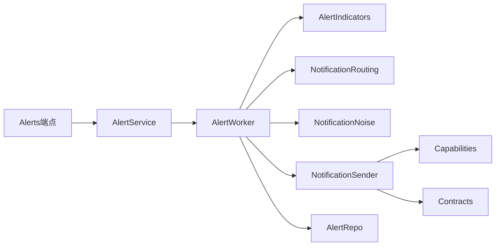

# 警报路由与分发

<cite>
**本文档引用的文件**   
- [src/notification_routing.py](file://src/notification_routing.py)
- [src/notification_noise.py](file://src/notification_noise.py)
- [src/notification.py](file://src/notification.py)
- [src/notification_capabilities.py](file://src/notification_capabilities.py)
- [src/notification_contracts.py](file://src/notification_contracts.py)
- [src/services/alert_service.py](file://src/services/alert_service.py)
- [src/services/alert_worker.py](file://src/services/alert_worker.py)
- [src/services/alert_indicators.py](file://src/services/alert_indicators.py)
- [src/repositories/alert_repo.py](file://src/repositories/alert_repo.py)
- [api/v1/endpoints/alerts.py](file://api/v1/endpoints/alerts.py)
- [api/v1/schemas/alerts.py](file://api/v1/schemas/alerts.py)
- [src/services/notification_diagnostics.py](file://src/services/notification_diagnostics.py)
- [tests/test_notification_routing.py](file://tests/test_notification_routing.py)
- [tests/test_notification_noise.py](file://tests/test_notification_noise.py)
- [tests/test_alert_api.py](file://tests/test_alert_api.py)
- [tests/test_alert_worker.py](file://tests/test_alert_worker.py)
</cite>

## 目录
1. [简介](#简介)
2. [项目结构](#项目结构)
3. [核心组件](#核心组件)
4. [架构总览](#架构总览)
5. [详细组件分析](#详细组件分析)
6. [依赖关系分析](#依赖关系分析)
7. [性能考量](#性能考量)
8. [故障排查指南](#故障排查指南)
9. [结论](#结论)
10. [附录](#附录)

## 简介
本文件面向Daily Stock Analysis的“警报路由与分发系统”，系统性说明：
- 路由规则的配置与匹配逻辑（基于股票、指标类型、严重级别）
- 多渠道分发机制（Web通知、邮件、短信、即时通讯工具）
- 噪声过滤与智能降噪（重复检测、相关性分析、用户偏好学习）
- 优先级动态调整与紧急通道处理
- 路由规则的测试与调试方法
- 渠道健康检查与故障转移机制

该文档兼顾技术深度与可读性，既适合开发者深入实现，也便于运维与非技术读者理解整体流程。

## 项目结构
与“警报路由与分发”相关的代码主要分布在以下模块：
- 路由与降噪：src/notification_routing.py、src/notification_noise.py
- 发送与能力/契约：src/notification.py、src/notification_capabilities.py、src/notification_contracts.py
- 服务与工作者：src/services/alert_service.py、src/services/alert_worker.py、src/services/alert_indicators.py
- 数据持久化：src/repositories/alert_repo.py
- API层：api/v1/endpoints/alerts.py、api/v1/schemas/alerts.py
- 诊断与可观测性：src/services/notification_diagnostics.py
- 测试：tests/test_notification_routing.py、tests/test_notification_noise.py、tests/test_alert_api.py、tests/test_alert_worker.py

图表来源
- [api/v1/endpoints/alerts.py](file://api/v1/endpoints/alerts.py)
- [api/v1/schemas/alerts.py](file://api/v1/schemas/alerts.py)
- [src/services/alert_service.py](file://src/services/alert_service.py)
- [src/services/alert_worker.py](file://src/services/alert_worker.py)
- [src/services/alert_indicators.py](file://src/services/alert_indicators.py)
- [src/notification_routing.py](file://src/notification_routing.py)
- [src/notification_noise.py](file://src/notification_noise.py)
- [src/notification.py](file://src/notification.py)
- [src/notification_capabilities.py](file://src/notification_capabilities.py)
- [src/notification_contracts.py](file://src/notification_contracts.py)
- [src/repositories/alert_repo.py](file://src/repositories/alert_repo.py)

章节来源
- [api/v1/endpoints/alerts.py](file://api/v1/endpoints/alerts.py)
- [api/v1/schemas/alerts.py](file://api/v1/schemas/alerts.py)
- [src/services/alert_service.py](file://src/services/alert_service.py)
- [src/services/alert_worker.py](file://src/services/alert_worker.py)
- [src/services/alert_indicators.py](file://src/services/alert_indicators.py)
- [src/notification_routing.py](file://src/notification_routing.py)
- [src/notification_noise.py](file://src/notification_noise.py)
- [src/notification.py](file://src/notification.py)
- [src/notification_capabilities.py](file://src/notification_capabilities.py)
- [src/notification_contracts.py](file://src/notification_contracts.py)
- [src/repositories/alert_repo.py](file://src/repositories/alert_repo.py)

## 核心组件
- 路由组件（NotificationRouting）：负责根据股票、指标类型、严重级别等维度进行规则匹配与目标渠道选择。
- 降噪组件（NotificationNoise）：提供重复检测、相关性分析与用户偏好学习，降低噪音并提升触达质量。
- 发送组件（NotificationSender）：统一封装多渠道发送能力（Web、邮件、短信、IM），通过能力与契约抽象屏蔽差异。
- 服务与工作者（AlertService/AlertWorker/AlertIndicators）：编排警报生命周期、指标计算与任务调度。
- 存储（AlertRepo）：持久化警报记录、路由结果与发送状态。
- API层（Alerts端点/Schemas）：对外暴露创建、查询、更新、删除与批量操作接口。
- 诊断（NotificationDiagnostics）：渠道健康检查、失败归因与可观测性输出。

章节来源
- [src/notification_routing.py](file://src/notification_routing.py)
- [src/notification_noise.py](file://src/notification_noise.py)
- [src/notification.py](file://src/notification.py)
- [src/notification_capabilities.py](file://src/notification_capabilities.py)
- [src/notification_contracts.py](file://src/notification_contracts.py)
- [src/services/alert_service.py](file://src/services/alert_service.py)
- [src/services/alert_worker.py](file://src/services/alert_worker.py)
- [src/services/alert_indicators.py](file://src/services/alert_indicators.py)
- [src/repositories/alert_repo.py](file://src/repositories/alert_repo.py)
- [api/v1/endpoints/alerts.py](file://api/v1/endpoints/alerts.py)
- [api/v1/schemas/alerts.py](file://api/v1/schemas/alerts.py)
- [src/services/notification_diagnostics.py](file://src/services/notification_diagnostics.py)

## 架构总览
下图展示从API到最终多渠道分发的端到端流程，包括路由、降噪、发送与健康检查。

图表来源
- [api/v1/endpoints/alerts.py](file://api/v1/endpoints/alerts.py)
- [src/services/alert_service.py](file://src/services/alert_service.py)
- [src/services/alert_worker.py](file://src/services/alert_worker.py)
- [src/services/alert_indicators.py](file://src/services/alert_indicators.py)
- [src/notification_routing.py](file://src/notification_routing.py)
- [src/notification_noise.py](file://src/notification_noise.py)
- [src/notification.py](file://src/notification.py)
- [src/repositories/alert_repo.py](file://src/repositories/alert_repo.py)
- [src/services/notification_diagnostics.py](file://src/services/notification_diagnostics.py)

## 详细组件分析

### 路由规则与匹配逻辑（NotificationRouting）
- 匹配维度
  - 股票维度：支持精确匹配、通配符或范围匹配（如板块/指数）。
  - 指标类型：技术指标、基本面、情绪面、新闻面等分类。
  - 严重级别：低/中/高/紧急，决定渠道与频率策略。
- 匹配策略
  - 规则优先级：按配置顺序或权重排序，命中即返回候选渠道集。
  - 多规则聚合：支持“或/且”组合，允许同一警报命中多条规则合并渠道。
  - 动态扩展：新增规则无需重启，支持热加载与版本回滚。
- 输出
  - 候选渠道列表（含优先级）、路由原因、命中规则ID。

图表来源
- [src/notification_routing.py](file://src/notification_routing.py)

章节来源
- [src/notification_routing.py](file://src/notification_routing.py)

### 噪声过滤与智能降噪（NotificationNoise）
- 重复检测
  - 基于内容指纹与时间窗口去重，避免短时间内相同警报刷屏。
- 相关性分析
  - 对同批次警报进行聚类，合并相关项，减少冗余推送。
- 用户偏好学习
  - 根据历史交互（忽略/确认/延迟阅读）动态调整渠道与频率。
- 输出
  - 降噪后的渠道集合、降噪原因、建议静默时长。

图表来源
- [src/notification_noise.py](file://src/notification_noise.py)

章节来源
- [src/notification_noise.py](file://src/notification_noise.py)

### 多渠道分发（NotificationSender）
- 渠道抽象
  - 统一接口定义（发送、重试、回执、错误码），屏蔽各平台差异。
- 已集成渠道
  - Web通知、邮件、短信、即时通讯（如钉钉、飞书、Discord等）。
- 能力与契约
  - Capabilities声明渠道能力（富文本、图片、卡片、动作按钮等）。
  - Contracts定义消息结构与模板变量，确保一致性。
- 发送流程
  - 按优先级依次尝试，失败自动降级或切换备用渠道。

图表来源
- [src/notification.py](file://src/notification.py)
- [src/notification_capabilities.py](file://src/notification_capabilities.py)
- [src/notification_contracts.py](file://src/notification_contracts.py)

章节来源
- [src/notification.py](file://src/notification.py)
- [src/notification_capabilities.py](file://src/notification_capabilities.py)
- [src/notification_contracts.py](file://src/notification_contracts.py)

### 服务与工作者（AlertService / AlertWorker / AlertIndicators）
- AlertService
  - 接收API请求，完成校验、持久化与任务派发。
- AlertWorker
  - 异步执行指标计算、路由匹配、降噪与发送；管理重试与超时。
- AlertIndicators
  - 计算各类指标（价格、成交量、波动率、情绪等），评估阈值与严重级别。

图表来源
- [src/services/alert_service.py](file://src/services/alert_service.py)
- [src/services/alert_worker.py](file://src/services/alert_worker.py)
- [src/services/alert_indicators.py](file://src/services/alert_indicators.py)
- [src/repositories/alert_repo.py](file://src/repositories/alert_repo.py)

章节来源
- [src/services/alert_service.py](file://src/services/alert_service.py)
- [src/services/alert_worker.py](file://src/services/alert_worker.py)
- [src/services/alert_indicators.py](file://src/services/alert_indicators.py)
- [src/repositories/alert_repo.py](file://src/repositories/alert_repo.py)

### API层（Alerts端点与Schema）
- 端点职责
  - 创建/更新/删除警报、查询列表、批量操作、状态同步。
- Schema约束
  - 字段校验、枚举值、必填项、格式限制。
- 错误处理
  - 统一错误码与消息，便于前端与自动化处理。

图表来源
- [api/v1/endpoints/alerts.py](file://api/v1/endpoints/alerts.py)
- [api/v1/schemas/alerts.py](file://api/v1/schemas/alerts.py)

章节来源
- [api/v1/endpoints/alerts.py](file://api/v1/endpoints/alerts.py)
- [api/v1/schemas/alerts.py](file://api/v1/schemas/alerts.py)

### 渠道健康检查与故障转移（NotificationDiagnostics）
- 健康检查
  - 周期性探测渠道可用性、延迟、错误率。
- 故障转移
  - 主渠道失败时自动切换到备用渠道，保障送达。
- 可观测性
  - 输出诊断日志、指标与告警，辅助定位问题。

图表来源
- [src/services/notification_diagnostics.py](file://src/services/notification_diagnostics.py)

章节来源
- [src/services/notification_diagnostics.py](file://src/services/notification_diagnostics.py)

## 依赖关系分析
- 组件耦合
  - AlertService依赖AlertWorker与AlertRepo；AlertWorker依赖AlertIndicators、NotificationRouting、NotificationNoise、NotificationSender。
- 外部依赖
  - 各渠道SDK（邮件、短信、IM）通过统一接口接入，降低耦合度。
- 潜在循环依赖
  - 通过分层与接口隔离避免循环引用。

图表来源
- [api/v1/endpoints/alerts.py](file://api/v1/endpoints/alerts.py)
- [src/services/alert_service.py](file://src/services/alert_service.py)
- [src/services/alert_worker.py](file://src/services/alert_worker.py)
- [src/services/alert_indicators.py](file://src/services/alert_indicators.py)
- [src/notification_routing.py](file://src/notification_routing.py)
- [src/notification_noise.py](file://src/notification_noise.py)
- [src/notification.py](file://src/notification.py)
- [src/notification_capabilities.py](file://src/notification_capabilities.py)
- [src/notification_contracts.py](file://src/notification_contracts.py)
- [src/repositories/alert_repo.py](file://src/repositories/alert_repo.py)

章节来源
- [api/v1/endpoints/alerts.py](file://api/v1/endpoints/alerts.py)
- [src/services/alert_service.py](file://src/services/alert_service.py)
- [src/services/alert_worker.py](file://src/services/alert_worker.py)
- [src/services/alert_indicators.py](file://src/services/alert_indicators.py)
- [src/notification_routing.py](file://src/notification_routing.py)
- [src/notification_noise.py](file://src/notification_noise.py)
- [src/notification.py](file://src/notification.py)
- [src/notification_capabilities.py](file://src/notification_capabilities.py)
- [src/notification_contracts.py](file://src/notification_contracts.py)
- [src/repositories/alert_repo.py](file://src/repositories/alert_repo.py)

## 性能考量
- 并发与批处理
  - 指标计算与发送采用异步队列，支持批量合并以减少重复工作。
- 缓存与预取
  - 热点指标与规则结果缓存，降低重复计算与IO开销。
- 限流与退避
  - 渠道侧限流与指数退避，避免雪崩与资源耗尽。
- 内存与序列化
  - 大对象池化与高效序列化，减少GC压力。

[本节为通用指导，不直接分析具体文件]

## 故障排查指南
- 常见问题
  - 渠道不可用：检查健康状态与凭据配置。
  - 路由未命中：核对规则优先级与匹配维度。
  - 降噪过度：调整去重窗口与相关性阈值。
  - 发送失败：查看重试次数、错误码与下游限流。
- 诊断工具
  - 使用NotificationDiagnostics获取渠道健康与失败归因。
  - 通过日志与追踪ID定位完整调用链。
- 复现与验证
  - 使用单元测试与集成测试构造典型场景，快速回归验证。

章节来源
- [src/services/notification_diagnostics.py](file://src/services/notification_diagnostics.py)
- [tests/test_notification_routing.py](file://tests/test_notification_routing.py)
- [tests/test_notification_noise.py](file://tests/test_notification_noise.py)
- [tests/test_alert_api.py](file://tests/test_alert_api.py)
- [tests/test_alert_worker.py](file://tests/test_alert_worker.py)

## 结论
本系统以清晰的分层与模块化设计实现了可扩展、高可用的警报路由与分发能力。通过规则驱动的路由、智能降噪与多渠道健康检查，系统在复杂市场环境下仍能保持高触达质量与稳定性。建议在持续迭代中完善规则治理、指标监控与用户体验反馈闭环。

[本节为总结性内容，不直接分析具体文件]

## 附录
- 术语表
  - 路由：根据多维条件选择目标渠道的过程。
  - 降噪：减少重复与无关通知以提升有效触达。
  - 健康检查：对渠道可用性与质量的周期性探测。
- 最佳实践
  - 规则最小化与明确优先级，避免冲突。
  - 降噪参数随业务阶段调优，平衡触达与打扰。
  - 多渠道冗余设计，关键警报走紧急通道。

[本节为补充信息，不直接分析具体文件]