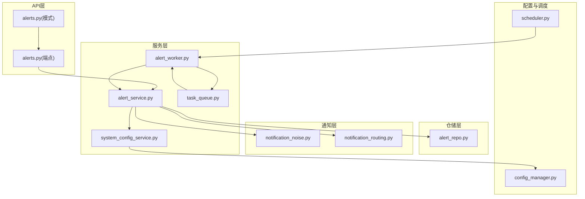
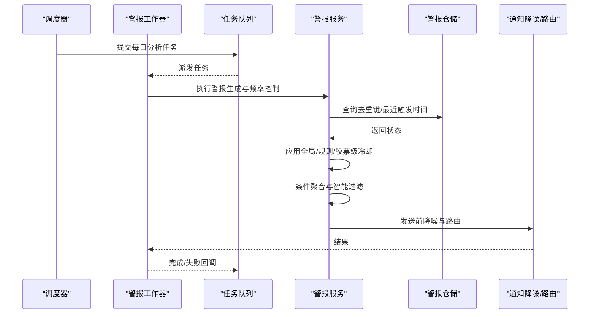
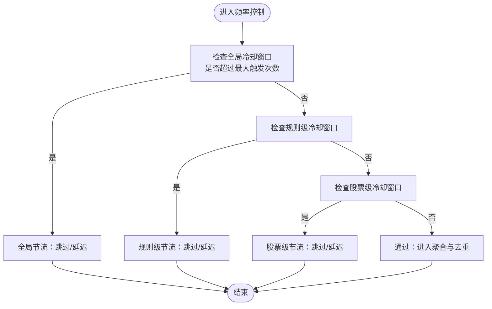
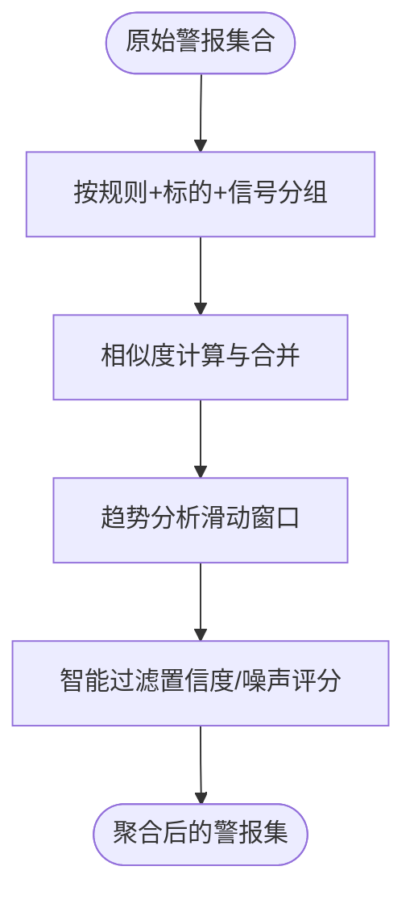
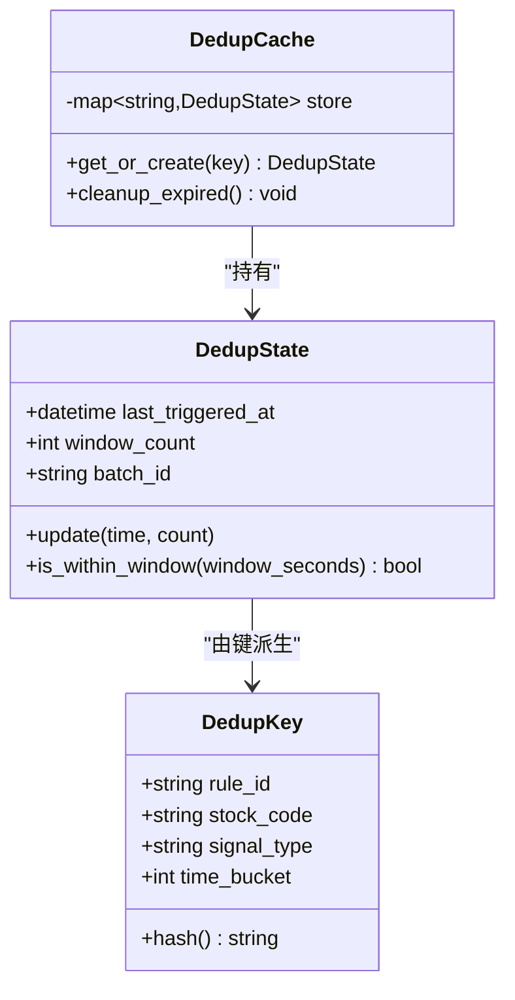
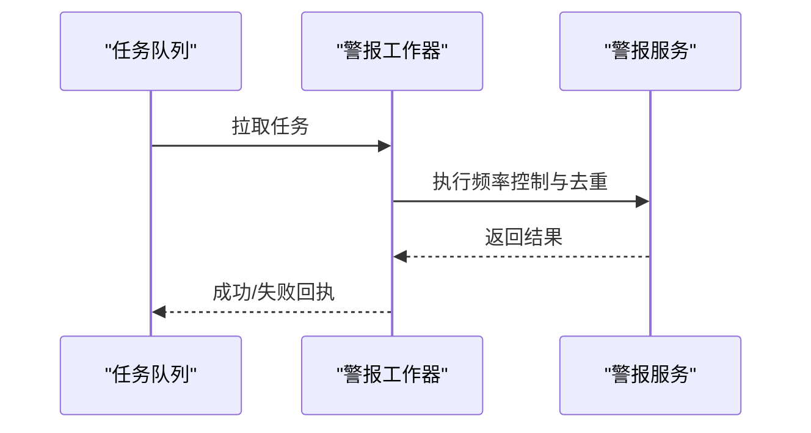
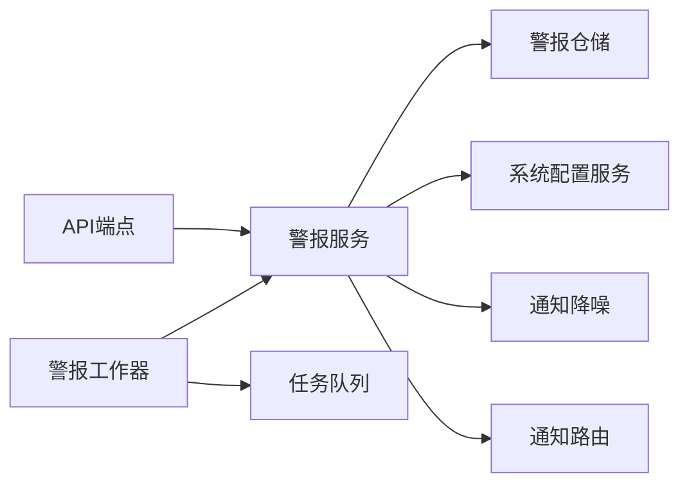

# 频率控制与去重

<cite>
**本文引用的文件**   
- [alert_service.py](file://src/services/alert_service.py)
- [alert_worker.py](file://src/services/alert_worker.py)
- [alert_repo.py](file://src/repositories/alert_repo.py)
- [alerts.py](file://api/v1/endpoints/alerts.py)
- [alerts.py](file://api/v1/schemas/alerts.py)
- [notification_noise.py](file://src/notification_noise.py)
- [notification_routing.py](file://src/notification_routing.py)
- [task_queue.py](file://src/services/task_queue.py)
- [system_config_service.py](file://src/services/system_config_service.py)
- [config_manager.py](file://src/core/config_manager.py)
- [scheduler.py](file://src/scheduler.py)
- [test_alert_worker.py](file://tests/test_alert_worker.py)
</cite>

## 目录
1. [简介](#简介)
2. [项目结构](#项目结构)
3. [核心组件](#核心组件)
4. [架构总览](#架构总览)
5. [详细组件分析](#详细组件分析)
6. [依赖关系分析](#依赖关系分析)
7. [性能考虑](#性能考虑)
8. [故障排查指南](#故障排查指南)
9. [结论](#结论)
10. [附录](#附录)

## 简介
本文件聚焦 Daily Stock Analysis 的“警报频率控制与去重机制”，围绕以下目标展开：
- 冷却时间设置：全局冷却、规则级冷却、股票级冷却策略的实现与联动。
- 条件聚合机制：相似警报合并、趋势分析与智能过滤算法。
- 去重策略技术实现：哈希计算、状态跟踪与内存管理。
- 频率限制配置：时间窗口、最大触发次数、动态调整。
- 性能调优建议：内存优化、数据库查询优化与缓存策略。
- 监控指标与告警配置：关键指标定义与告警阈值建议。

## 项目结构
与频率控制和去重相关的代码主要分布在服务层、仓储层、API 层以及通知路由/降噪模块中，整体组织如下：
- 服务层：负责频率控制、去重、聚合与调度执行。
- 仓储层：负责持久化去重状态、历史触发记录与配置快照。
- API 层：暴露配置更新与查询接口。
- 通知层：负责最终消息的去噪与路由。
- 任务队列：承载异步执行与背压控制。

图表来源
- [alerts.py](file://api/v1/endpoints/alerts.py)
- [alerts.py](file://api/v1/schemas/alerts.py)
- [alert_service.py](file://src/services/alert_service.py)
- [alert_worker.py](file://src/services/alert_worker.py)
- [task_queue.py](file://src/services/task_queue.py)
- [system_config_service.py](file://src/services/system_config_service.py)
- [alert_repo.py](file://src/repositories/alert_repo.py)
- [notification_noise.py](file://src/notification_noise.py)
- [notification_routing.py](file://src/notification_routing.py)
- [config_manager.py](file://src/core/config_manager.py)
- [scheduler.py](file://src/scheduler.py)

章节来源
- [alerts.py](file://api/v1/endpoints/alerts.py)
- [alerts.py](file://api/v1/schemas/alerts.py)
- [alert_service.py](file://src/services/alert_service.py)
- [alert_worker.py](file://src/services/alert_worker.py)
- [task_queue.py](file://src/services/task_queue.py)
- [system_config_service.py](file://src/services/system_config_service.py)
- [alert_repo.py](file://src/repositories/alert_repo.py)
- [notification_noise.py](file://src/notification_noise.py)
- [notification_routing.py](file://src/notification_routing.py)
- [config_manager.py](file://src/core/config_manager.py)
- [scheduler.py](file://src/scheduler.py)

## 核心组件
- 警报服务（AlertService）：编排频率控制、去重、聚合与发送流程；读取系统配置；调用仓储层读写状态。
- 警报工作器（AlertWorker）：从任务队列消费任务，驱动 AlertService 执行，并处理异常与重试。
- 任务队列（TaskQueue）：提供异步任务缓冲、限流与并发控制，避免瞬时峰值导致过载。
- 警报仓储（AlertRepo）：持久化去重键、最近触发时间、统计计数等元数据。
- 通知降噪（NotificationNoise）：对输出进行二次去噪与合并，减少重复或低价值消息。
- 通知路由（NotificationRouting）：根据渠道与策略选择投递路径。
- 系统配置服务（SystemConfigService）与配置管理器（ConfigManager）：集中管理频率控制相关参数。
- 调度器（Scheduler）：定时触发每日分析任务，进入警报流水线。

章节来源
- [alert_service.py](file://src/services/alert_service.py)
- [alert_worker.py](file://src/services/alert_worker.py)
- [task_queue.py](file://src/services/task_queue.py)
- [alert_repo.py](file://src/repositories/alert_repo.py)
- [notification_noise.py](file://src/notification_noise.py)
- [notification_routing.py](file://src/notification_routing.py)
- [system_config_service.py](file://src/services/system_config_service.py)
- [config_manager.py](file://src/core/config_manager.py)
- [scheduler.py](file://src/scheduler.py)

## 架构总览
下图展示一次“每日分析→警报生成→频率控制→去重→发送”的端到端流程。

图表来源
- [scheduler.py](file://src/scheduler.py)
- [task_queue.py](file://src/services/task_queue.py)
- [alert_worker.py](file://src/services/alert_worker.py)
- [alert_service.py](file://src/services/alert_service.py)
- [alert_repo.py](file://src/repositories/alert_repo.py)
- [notification_noise.py](file://src/notification_noise.py)
- [notification_routing.py](file://src/notification_routing.py)

## 详细组件分析

### 频率控制与冷却策略
- 全局冷却：针对同一批次或全量任务在指定时间窗口内限制最大触发次数，避免系统级抖动。
- 规则级冷却：按规则维度维护独立的时间窗口与计数，确保特定策略不会过于频繁。
- 股票级冷却：按股票代码维度维护独立窗口，防止单只标的噪音过多。
- 优先级与降级：当接近上限时，优先保留高置信度或高影响度的警报，其余进入延迟队列或丢弃。

图表来源
- [alert_service.py](file://src/services/alert_service.py)
- [alert_repo.py](file://src/repositories/alert_repo.py)
- [system_config_service.py](file://src/services/system_config_service.py)
- [config_manager.py](file://src/core/config_manager.py)

章节来源
- [alert_service.py](file://src/services/alert_service.py)
- [alert_repo.py](file://src/repositories/alert_repo.py)
- [system_config_service.py](file://src/services/system_config_service.py)
- [config_manager.py](file://src/core/config_manager.py)

### 条件聚合与智能过滤
- 相似警报合并：基于规则、标的、信号类型与时间窗口的相似度进行合并，降低重复通知。
- 趋势分析：结合近期多次触发情况，判断是否为短期波动或持续趋势，决定是否合并或延后。
- 智能过滤：依据置信度、影响面、噪声评分等指标，过滤低价值警报。

图表来源
- [alert_service.py](file://src/services/alert_service.py)
- [notification_noise.py](file://src/notification_noise.py)

章节来源
- [alert_service.py](file://src/services/alert_service.py)
- [notification_noise.py](file://src/notification_noise.py)

### 去重策略的技术实现
- 哈希计算：将规则ID、股票代码、信号类型、时间桶等字段组合为稳定键，用于快速定位与去重。
- 状态跟踪：维护最近触发时间、窗口内计数、合并批次ID等状态，支持跨请求一致性。
- 内存管理：使用有界缓存与过期策略，定期清理陈旧条目，避免内存泄漏。

图表来源
- [alert_repo.py](file://src/repositories/alert_repo.py)
- [alert_service.py](file://src/services/alert_service.py)

章节来源
- [alert_repo.py](file://src/repositories/alert_repo.py)
- [alert_service.py](file://src/services/alert_service.py)

### 频率限制的配置选项
- 时间窗口：全局/规则/股票级各自可配置秒级或分钟级窗口。
- 最大触发次数：每个窗口内的上限值，可按规则或标的覆盖。
- 动态调整：运行时通过配置服务热更新，支持灰度与回滚。
- 优先级权重：不同规则或标的可设置权重，影响合并与保留策略。

章节来源
- [system_config_service.py](file://src/services/system_config_service.py)
- [config_manager.py](file://src/core/config_manager.py)
- [alerts.py](file://api/v1/schemas/alerts.py)

### 任务队列与工作器
- 任务队列：提供缓冲、限流、并发控制与重试，保障系统在高峰期的稳定性。
- 工作器：消费任务，调用警报服务执行频率控制与去重，处理异常与幂等性。

图表来源
- [task_queue.py](file://src/services/task_queue.py)
- [alert_worker.py](file://src/services/alert_worker.py)
- [alert_service.py](file://src/services/alert_service.py)

章节来源
- [task_queue.py](file://src/services/task_queue.py)
- [alert_worker.py](file://src/services/alert_worker.py)
- [alert_service.py](file://src/services/alert_service.py)

### API 与模式
- 端点：提供频率控制相关配置的查询与更新接口。
- 模式：定义请求/响应结构与校验规则，确保配置项合法。

章节来源
- [alerts.py](file://api/v1/endpoints/alerts.py)
- [alerts.py](file://api/v1/schemas/alerts.py)

## 依赖关系分析
- 服务层依赖仓储层进行状态持久化，依赖配置服务获取频率参数，依赖通知层进行最终输出。
- 工作器依赖任务队列进行解耦与削峰。
- API 层仅作为入口，不直接参与业务逻辑。

图表来源
- [alerts.py](file://api/v1/endpoints/alerts.py)
- [alert_service.py](file://src/services/alert_service.py)
- [alert_repo.py](file://src/repositories/alert_repo.py)
- [system_config_service.py](file://src/services/system_config_service.py)
- [notification_noise.py](file://src/notification_noise.py)
- [notification_routing.py](file://src/notification_routing.py)
- [alert_worker.py](file://src/services/alert_worker.py)
- [task_queue.py](file://src/services/task_queue.py)

章节来源
- [alerts.py](file://api/v1/endpoints/alerts.py)
- [alert_service.py](file://src/services/alert_service.py)
- [alert_repo.py](file://src/repositories/alert_repo.py)
- [system_config_service.py](file://src/services/system_config_service.py)
- [notification_noise.py](file://src/notification_noise.py)
- [notification_routing.py](file://src/notification_routing.py)
- [alert_worker.py](file://src/services/alert_worker.py)
- [task_queue.py](file://src/services/task_queue.py)

## 性能考虑
- 内存优化
  - 使用有界缓存与LRU淘汰策略，限制去重状态大小。
  - 定期清理过期条目，避免长期运行导致的内存增长。
- 数据库查询优化
  - 批量读写去重状态，减少往返次数。
  - 合理索引去重键与时间戳字段，提升查询效率。
- 缓存策略
  - 热点规则与标的的冷却状态可放入本地缓存，缩短延迟。
  - 跨进程一致性通过仓储层保证，本地缓存仅做加速。
- 并发与背压
  - 任务队列设置最大并发与队列长度，防止雪崩。
  - 工作器采用指数退避重试，避免瞬时错误放大。

[本节为通用指导，无需具体文件引用]

## 故障排查指南
- 常见问题
  - 警报未触发：检查冷却窗口是否仍在生效，确认去重键是否正确。
  - 过度合并：调整相似度阈值与时间窗口，查看聚合日志。
  - 性能下降：检查任务队列堆积、数据库慢查询与缓存命中率。
- 诊断步骤
  - 查看工作器日志与任务队列状态。
  - 核对系统配置与规则配置是否一致。
  - 验证去重键生成逻辑与状态更新是否幂等。
- 测试参考
  - 使用单元测试验证频率控制与去重逻辑在不同边界条件下的行为。

章节来源
- [test_alert_worker.py](file://tests/test_alert_worker.py)
- [alert_worker.py](file://src/services/alert_worker.py)
- [alert_service.py](file://src/services/alert_service.py)
- [alert_repo.py](file://src/repositories/alert_repo.py)

## 结论
Daily Stock Analysis 的频率控制与去重机制通过多层冷却、条件聚合与稳健的去重策略，有效降低了通知噪音与系统负载。配合任务队列与配置热更新，能够在高并发场景下保持稳定与可控。建议在生产环境中持续监控关键指标，并根据实际业务需求动态调整参数，以达到最佳体验与资源利用率。

[本节为总结性内容，无需具体文件引用]

## 附录
- 监控指标建议
  - 冷却命中率：各层级冷却触发的比例。
  - 去重成功率：被正确合并或抑制的警报占比。
  - 任务队列长度与消费延迟：反映系统吞吐能力。
  - 数据库慢查询与缓存命中率：评估存储与缓存效果。
- 告警配置建议
  - 队列积压阈值：超过设定值触发扩容或降速。
  - 冷却命中率异常：过高可能意味着阈值过严，过低则可能噪音过多。
  - 去重成功率异常：过低需检查相似度与时间窗口设置。

[本节为补充信息，无需具体文件引用]