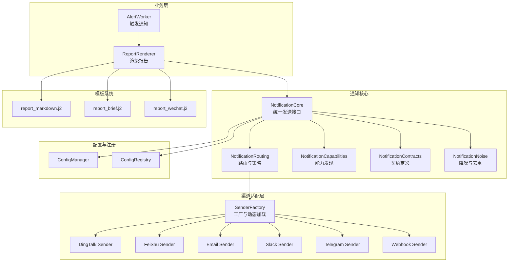
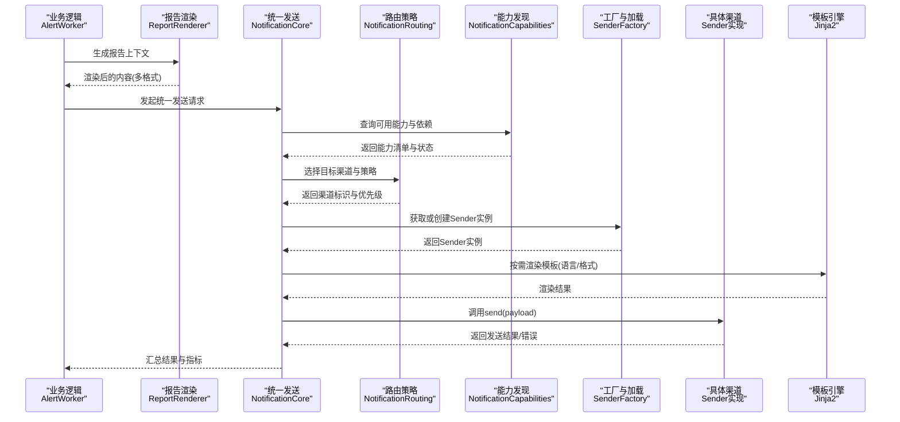
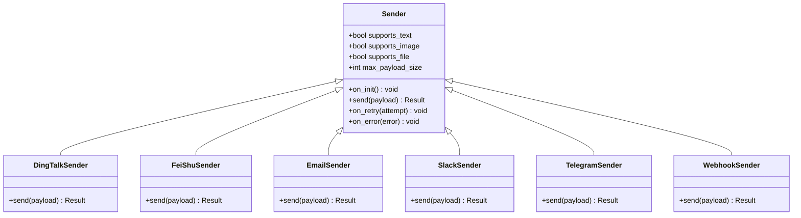
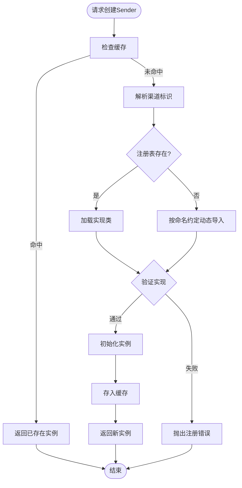
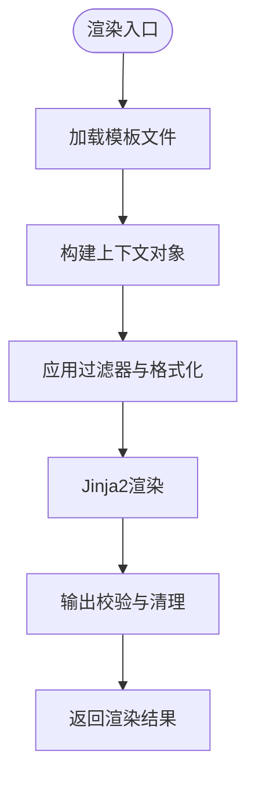
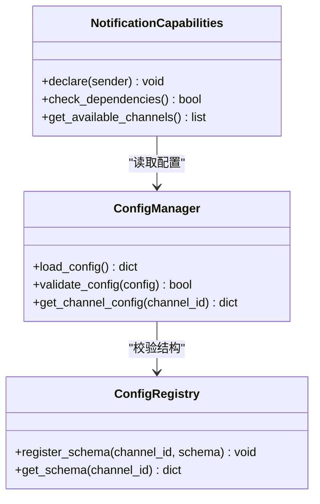
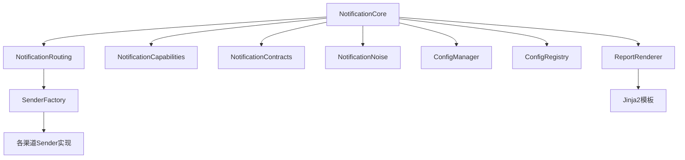

# 通知架构设计

<cite>
**本文引用的文件**   
- [src/notification.py](file://src/notification.py)
- [src/notification_capabilities.py](file://src/notification_capabilities.py)
- [src/notification_contracts.py](file://src/notification_contracts.py)
- [src/notification_routing.py](file://src/notification_routing.py)
- [src/notification_noise.py](file://src/notification_noise.py)
- [src/services/alert_worker.py](file://src/services/alert_worker.py)
- [src/services/report_renderer.py](file://src/services/report_renderer.py)
- [src/config_manager.py](file://src/core/config_manager.py)
- [src/core/config_registry.py](file://src/core/config_registry.py)
- [templates/report_markdown.j2](file://templates/report_markdown.j2)
- [templates/report_brief.j2](file://templates/report_brief.j2)
- [templates/report_wechat.j2](file://templates/report_wechat.j2)
- [src/notification_sender/__init__.py](file://src/notification_sender/__init__.py)
- [src/notification_sender/dingtalk_sender.py](file://src/notification_sender/dingtalk_sender.py)
- [src/notification_sender/feishu_sender.py](file://src/notification_sender/feishu_sender.py)
- [src/notification_sender/email_sender.py](file://src/notification_sender/email_sender.py)
- [src/notification_sender/slack_sender.py](file://src/notification_sender/slack_sender.py)
- [src/notification_sender/telegram_sender.py](file://src/notification_sender/telegram_sender.py)
- [src/notification_sender/custom_webhook_sender.py](file://src/notification_sender/custom_webhook_sender.py)
- [tests/test_notification.py](file://tests/test_notification.py)
- [tests/test_notification_sender.py](file://tests/test_notification_sender.py)
</cite>

## 目录
1. [简介](#简介)
2. [项目结构](#项目结构)
3. [核心组件](#核心组件)
4. [架构总览](#架构总览)
5. [详细组件分析](#详细组件分析)
6. [依赖关系分析](#依赖关系分析)
7. [性能考量](#性能考量)
8. [故障排查指南](#故障排查指南)
9. [结论](#结论)
10. [附录](#附录)

## 简介
本文件面向Daily Stock Analysis的通知子系统，系统化阐述统一发送接口、渠道适配器（工厂模式与动态加载）、消息模板系统（Jinja2与国际化）、能力发现与配置管理，以及从业务逻辑到具体渠道的完整调用链路。文档同时给出扩展新渠道的技术规范与最佳实践，帮助开发者快速接入新的通知渠道并保持系统一致性与可维护性。

## 项目结构
通知相关代码主要分布在以下模块：
- 统一入口与路由：src/notification*.py
- 渠道实现：src/notification_sender/*_sender.py
- 渲染与模板：src/services/report_renderer.py + templates/*.j2
- 能力与契约：src/notification_capabilities.py, src/notification_contracts.py
- 配置与注册：src/core/config_manager.py, src/core/config_registry.py
- 工作流集成：src/services/alert_worker.py

图表来源
- [src/services/alert_worker.py](file://src/services/alert_worker.py)
- [src/services/report_renderer.py](file://src/services/report_renderer.py)
- [src/notification.py](file://src/notification.py)
- [src/notification_routing.py](file://src/notification_routing.py)
- [src/notification_capabilities.py](file://src/notification_capabilities.py)
- [src/notification_contracts.py](file://src/notification_contracts.py)
- [src/notification_noise.py](file://src/notification_noise.py)
- [src/notification_sender/__init__.py](file://src/notification_sender/__init__.py)
- [src/notification_sender/dingtalk_sender.py](file://src/notification_sender/dingtalk_sender.py)
- [src/notification_sender/feishu_sender.py](file://src/notification_sender/feishu_sender.py)
- [src/notification_sender/email_sender.py](file://src/notification_sender/email_sender.py)
- [src/notification_sender/slack_sender.py](file://src/notification_sender/slack_sender.py)
- [src/notification_sender/telegram_sender.py](file://src/notification_sender/telegram_sender.py)
- [src/notification_sender/custom_webhook_sender.py](file://src/notification_sender/custom_webhook_sender.py)
- [src/core/config_manager.py](file://src/core/config_manager.py)
- [src/core/config_registry.py](file://src/core/config_registry.py)
- [templates/report_markdown.j2](file://templates/report_markdown.j2)
- [templates/report_brief.j2](file://templates/report_brief.j2)
- [templates/report_wechat.j2](file://templates/report_wechat.j2)

章节来源
- [src/services/alert_worker.py](file://src/services/alert_worker.py)
- [src/services/report_renderer.py](file://src/services/report_renderer.py)
- [src/notification.py](file://src/notification.py)
- [src/notification_routing.py](file://src/notification_routing.py)
- [src/notification_capabilities.py](file://src/notification_capabilities.py)
- [src/notification_contracts.py](file://src/notification_contracts.py)
- [src/notification_noise.py](file://src/notification_noise.py)
- [src/core/config_manager.py](file://src/core/config_manager.py)
- [src/core/config_registry.py](file://src/core/config_registry.py)
- [templates/report_markdown.j2](file://templates/report_markdown.j2)
- [templates/report_brief.j2](file://templates/report_brief.j2)
- [templates/report_wechat.j2](file://templates/report_wechat.j2)

## 核心组件
- 统一发送接口（Sender抽象基类）
  - 定义统一的send()方法签名与生命周期钩子（初始化、重试、错误处理）。
  - 提供通用能力：参数校验、超时控制、日志记录、指标上报。
  - 要求子类实现具体渠道的发送细节，并声明能力元数据（如是否支持富文本、图片、附件等）。

- 渠道适配器与工厂
  - 通过工厂模式集中创建与缓存Sender实例，避免重复初始化。
  - 动态加载机制基于命名约定或显式注册表，按渠道标识选择对应实现。
  - 错误处理策略包括：异常分类、降级回退、熔断与限流、重试与退避。

- 消息模板系统
  - 使用Jinja2引擎渲染Markdown/微信/简报等多格式模板。
  - 变量替换由上下文对象驱动，支持嵌套结构与默认值。
  - 国际化通过语言包与模板片段组合实现，运行时根据用户偏好切换。

- 能力发现与配置管理
  - 能力声明：每个Sender在启动时声明自身能力、依赖与版本约束。
  - 依赖检查：启动阶段校验外部服务可用性（网络、凭据、权限）。
  - 版本兼容：对上游API版本进行兼容性检测与提示。

章节来源
- [src/notification.py](file://src/notification.py)
- [src/notification_sender/__init__.py](file://src/notification_sender/__init__.py)
- [src/notification_capabilities.py](file://src/notification_capabilities.py)
- [src/notification_contracts.py](file://src/notification_contracts.py)
- [src/core/config_manager.py](file://src/core/config_manager.py)
- [src/core/config_registry.py](file://src/core/config_registry.py)

## 架构总览
下图展示从业务逻辑到具体渠道的完整调用链路：

图表来源
- [src/services/alert_worker.py](file://src/services/alert_worker.py)
- [src/services/report_renderer.py](file://src/services/report_renderer.py)
- [src/notification.py](file://src/notification.py)
- [src/notification_routing.py](file://src/notification_routing.py)
- [src/notification_capabilities.py](file://src/notification_capabilities.py)
- [src/notification_sender/__init__.py](file://src/notification_sender/__init__.py)
- [templates/report_markdown.j2](file://templates/report_markdown.j2)
- [templates/report_brief.j2](file://templates/report_brief.j2)
- [templates/report_wechat.j2](file://templates/report_wechat.j2)

## 详细组件分析

### 统一发送接口（Sender抽象基类）
- 设计要点
  - 定义send()统一签名，接收标准化payload（包含目标、内容、附件、富媒体等）。
  - 生命周期钩子：on_init()用于连接池/令牌初始化；on_retry()用于重试策略；on_error()用于错误分类与上报。
  - 能力元数据：supports_text、supports_image、supports_file、max_payload_size等。
  - 安全与合规：敏感信息脱敏、传输加密、速率限制。

- 实现规范
  - 子类必须实现send()，并在异常时抛出明确的渠道错误类型。
  - 遵循幂等性原则，必要时提供idempotency_key。
  - 记录关键指标：耗时、成功/失败率、重试次数。

图表来源
- [src/notification.py](file://src/notification.py)
- [src/notification_sender/dingtalk_sender.py](file://src/notification_sender/dingtalk_sender.py)
- [src/notification_sender/feishu_sender.py](file://src/notification_sender/feishu_sender.py)
- [src/notification_sender/email_sender.py](file://src/notification_sender/email_sender.py)
- [src/notification_sender/slack_sender.py](file://src/notification_sender/slack_sender.py)
- [src/notification_sender/telegram_sender.py](file://src/notification_sender/telegram_sender.py)
- [src/notification_sender/custom_webhook_sender.py](file://src/notification_sender/custom_webhook_sender.py)

章节来源
- [src/notification.py](file://src/notification.py)
- [src/notification_sender/dingtalk_sender.py](file://src/notification_sender/dingtalk_sender.py)
- [src/notification_sender/feishu_sender.py](file://src/notification_sender/feishu_sender.py)
- [src/notification_sender/email_sender.py](file://src/notification_sender/email_sender.py)
- [src/notification_sender/slack_sender.py](file://src/notification_sender/slack_sender.py)
- [src/notification_sender/telegram_sender.py](file://src/notification_sender/telegram_sender.py)
- [src/notification_sender/custom_webhook_sender.py](file://src/notification_sender/custom_webhook_sender.py)

### 渠道适配器与工厂（动态加载与错误处理）
- 工厂模式
  - 集中管理Sender实例的创建与缓存，避免重复初始化。
  - 支持按渠道标识（channel_id）解析实现类，优先从注册表查找，否则按命名约定动态导入。

- 动态加载机制
  - 启动时扫描notification_sender包，收集所有以*_sender.py命名的模块。
  - 通过模块内暴露的常量或装饰器完成自动注册。
  - 支持热更新：重新加载注册表而不重启进程。

- 错误处理策略
  - 分类捕获：网络错误、认证失败、配额限制、格式不匹配。
  - 降级回退：主渠道失败时尝试备用渠道（如邮件→Webhook）。
  - 熔断与限流：对频繁失败的渠道进行短期熔断，避免雪崩。
  - 重试与退避：指数退避+抖动，避免瞬时拥塞。

图表来源
- [src/notification_sender/__init__.py](file://src/notification_sender/__init__.py)
- [src/notification_sender/dingtalk_sender.py](file://src/notification_sender/dingtalk_sender.py)
- [src/notification_sender/feishu_sender.py](file://src/notification_sender/feishu_sender.py)
- [src/notification_sender/email_sender.py](file://src/notification_sender/email_sender.py)
- [src/notification_sender/slack_sender.py](file://src/notification_sender/slack_sender.py)
- [src/notification_sender/telegram_sender.py](file://src/notification_sender/telegram_sender.py)
- [src/notification_sender/custom_webhook_sender.py](file://src/notification_sender/custom_webhook_sender.py)

章节来源
- [src/notification_sender/__init__.py](file://src/notification_sender/__init__.py)
- [src/notification_sender/dingtalk_sender.py](file://src/notification_sender/dingtalk_sender.py)
- [src/notification_sender/feishu_sender.py](file://src/notification_sender/feishu_sender.py)
- [src/notification_sender/email_sender.py](file://src/notification_sender/email_sender.py)
- [src/notification_sender/slack_sender.py](file://src/notification_sender/slack_sender.py)
- [src/notification_sender/telegram_sender.py](file://src/notification_sender/telegram_sender.py)
- [src/notification_sender/custom_webhook_sender.py](file://src/notification_sender/custom_webhook_sender.py)

### 消息模板系统（Jinja2与国际化）
- 模板引擎
  - 使用Jinja2渲染Markdown、微信专用格式、简报等不同模板。
  - 模板路径集中管理，支持环境变量覆盖与开发调试模式。

- 变量替换机制
  - 上下文对象包含股票列表、指标、市场摘要、时间戳等字段。
  - 支持条件渲染、循环遍历、过滤器（格式化日期、金额、百分比）。
  - 默认值与回退策略确保缺失字段不影响整体渲染。

- 国际化支持
  - 语言包与模板片段分离，运行时根据用户偏好切换。
  - 模板中使用占位符引用i18n键，便于多语言维护。

图表来源
- [src/services/report_renderer.py](file://src/services/report_renderer.py)
- [templates/report_markdown.j2](file://templates/report_markdown.j2)
- [templates/report_brief.j2](file://templates/report_brief.j2)
- [templates/report_wechat.j2](file://templates/report_wechat.j2)

章节来源
- [src/services/report_renderer.py](file://src/services/report_renderer.py)
- [templates/report_markdown.j2](file://templates/report_markdown.j2)
- [templates/report_brief.j2](file://templates/report_brief.j2)
- [templates/report_wechat.j2](file://templates/report_wechat.j2)

### 通知能力发现与配置管理
- 能力声明
  - 每个Sender在启动时声明能力集合（文本、图片、文件、富文本等）。
  - 依赖项包括外部服务地址、端口、协议、版本要求。

- 依赖检查
  - 启动阶段执行连通性测试与凭据校验。
  - 失败时记录告警并标记渠道为不可用。

- 版本兼容性
  - 对上游API版本进行探测与比对，不兼容时给出升级建议。
  - 支持多版本并存与灰度切换。

- 配置管理
  - ConfigManager负责读取、合并、校验配置。
  - ConfigRegistry集中管理渠道配置项的结构与默认值。

图表来源
- [src/notification_capabilities.py](file://src/notification_capabilities.py)
- [src/core/config_manager.py](file://src/core/config_manager.py)
- [src/core/config_registry.py](file://src/core/config_registry.py)

章节来源
- [src/notification_capabilities.py](file://src/notification_capabilities.py)
- [src/core/config_manager.py](file://src/core/config_manager.py)
- [src/core/config_registry.py](file://src/core/config_registry.py)

### 路由与降噪
- 路由策略
  - 根据业务场景、用户偏好、渠道可用性选择最优渠道。
  - 支持优先级、权重、负载均衡与故障转移。

- 降噪机制
  - 去重：相同内容短时间内的重复通知被抑制。
  - 聚合：多条相似通知合并为一条摘要。
  - 节流：限制单位时间内通知频率。

章节来源
- [src/notification_routing.py](file://src/notification_routing.py)
- [src/notification_noise.py](file://src/notification_noise.py)

## 依赖关系分析
通知子系统内部依赖清晰，外部依赖通过适配器隔离：

图表来源
- [src/notification.py](file://src/notification.py)
- [src/notification_routing.py](file://src/notification_routing.py)
- [src/notification_capabilities.py](file://src/notification_capabilities.py)
- [src/notification_contracts.py](file://src/notification_contracts.py)
- [src/notification_noise.py](file://src/notification_noise.py)
- [src/notification_sender/__init__.py](file://src/notification_sender/__init__.py)
- [src/core/config_manager.py](file://src/core/config_manager.py)
- [src/core/config_registry.py](file://src/core/config_registry.py)
- [src/services/report_renderer.py](file://src/services/report_renderer.py)

章节来源
- [src/notification.py](file://src/notification.py)
- [src/notification_routing.py](file://src/notification_routing.py)
- [src/notification_capabilities.py](file://src/notification_capabilities.py)
- [src/notification_contracts.py](file://src/notification_contracts.py)
- [src/notification_noise.py](file://src/notification_noise.py)
- [src/notification_sender/__init__.py](file://src/notification_sender/__init__.py)
- [src/core/config_manager.py](file://src/core/config_manager.py)
- [src/core/config_registry.py](file://src/core/config_registry.py)
- [src/services/report_renderer.py](file://src/services/report_renderer.py)

## 性能考量
- 连接复用：每个Sender维护连接池，减少握手开销。
- 异步发送：非关键路径采用异步队列，避免阻塞主流程。
- 缓存策略：Sender实例、模板编译结果、能力检测结果缓存。
- 批量发送：支持多目标合并请求，降低网络往返。
- 监控指标：成功率、延迟、重试率、错误分布。

[本节为通用指导，无需特定文件来源]

## 故障排查指南
- 常见问题定位
  - 渠道不可用：检查依赖校验结果与网络连通性。
  - 模板渲染失败：验证上下文字段完整性与模板语法。
  - 发送失败：查看错误分类与重试日志。

- 诊断工具
  - 启用调试日志，记录请求/响应详情。
  - 使用能力自检脚本验证渠道状态。
  - 模拟发送测试用例覆盖边界情况。

章节来源
- [tests/test_notification.py](file://tests/test_notification.py)
- [tests/test_notification_sender.py](file://tests/test_notification_sender.py)

## 结论
本通知架构通过统一发送接口、工厂化渠道适配、模板化消息渲染与能力发现机制，实现了高内聚、低耦合、可扩展的通知系统。开发者可按照规范快速接入新渠道，同时保证系统的稳定性与可观测性。

[本节为总结性内容，无需特定文件来源]

## 附录

### 扩展新渠道的技术规范与最佳实践
- 步骤
  1. 新建*_sender.py文件，继承Sender基类。
  2. 实现send()方法与必要钩子。
  3. 声明能力元数据与依赖项。
  4. 在__init__.py中注册渠道标识。
  5. 添加单元测试覆盖正常与异常路径。

- 最佳实践
  - 保持幂等性，避免重复发送。
  - 合理设置超时与重试策略。
  - 记录结构化日志，便于追踪与分析。
  - 遵循最小权限原则配置凭据。
  - 提供健康检查端点以便运维监控。

[本节为通用指导，无需特定文件来源]