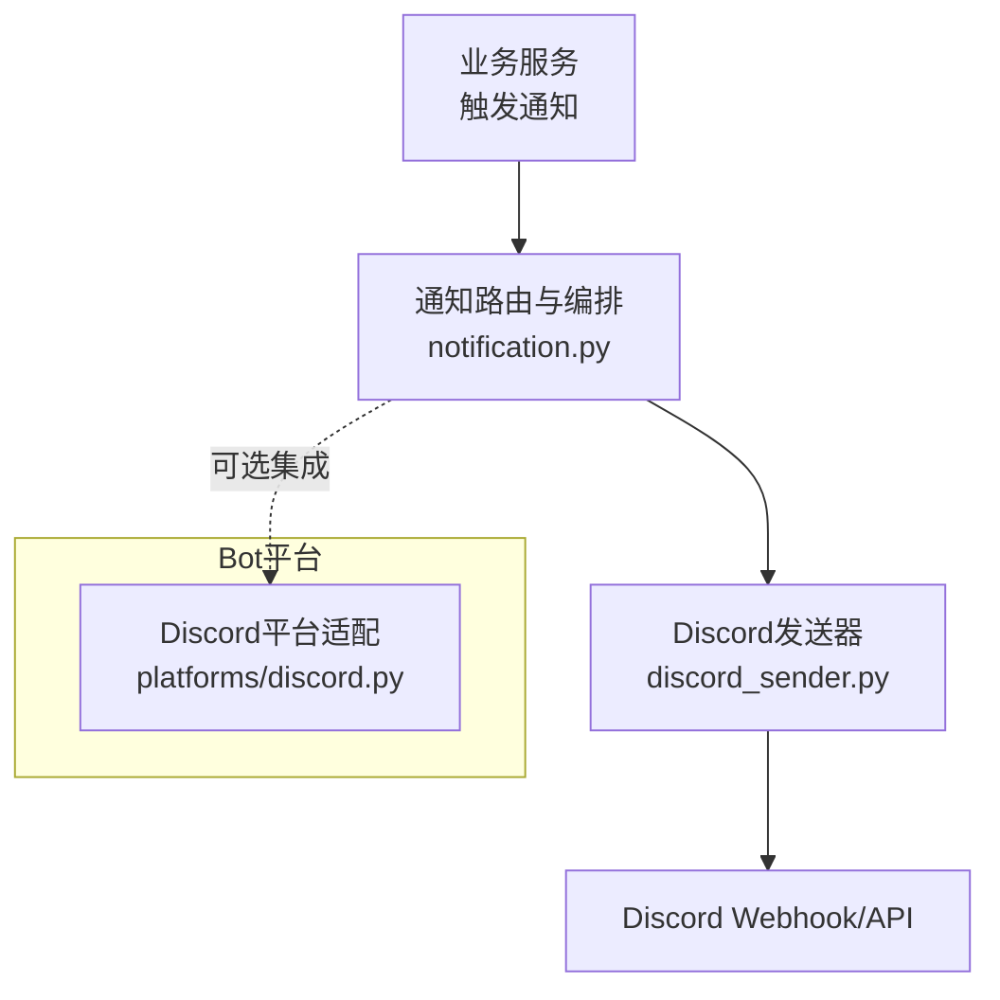
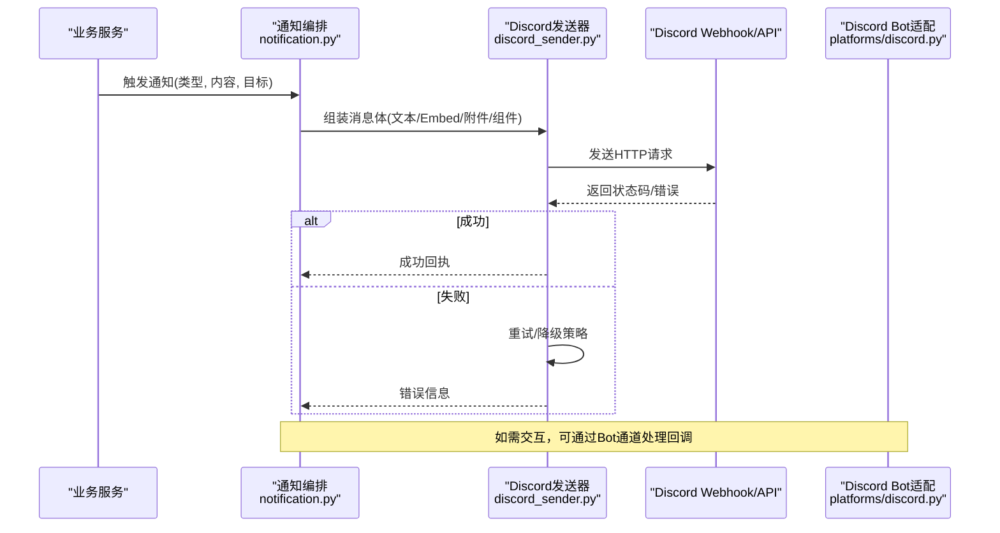
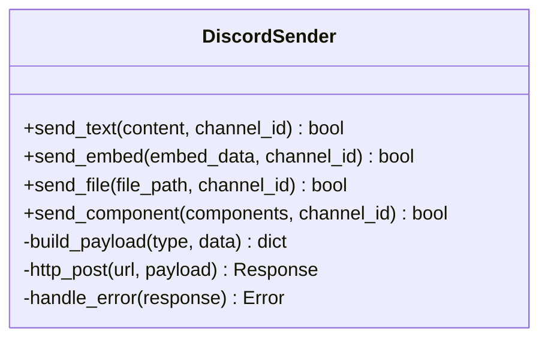
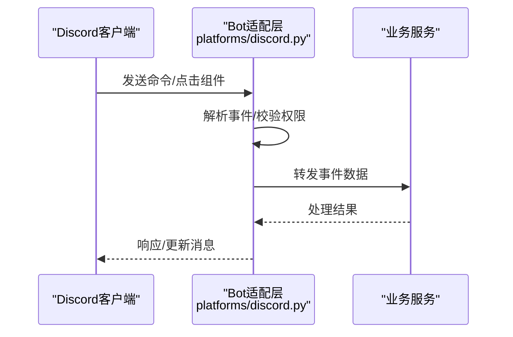
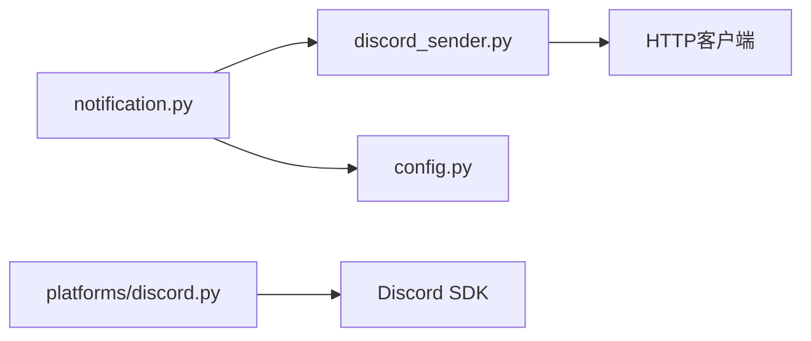

# Discord通知配置

<cite>
**本文档引用的文件**   
- [discord_sender.py](file://src/notification_sender/discord_sender.py)
- [discord.py](file://bot/platforms/discord.py)
- [notifications.md](file://docs/notifications.md)
- [discord-bot-config.md](file://docs/bot/discord-bot-config.md)
- [config.py](file://src/config.py)
- [notification.py](file://src/notification.py)
- [notification_contracts.py](file://src/notification_contracts.py)
- [test_discord_platform.py](file://tests/test_discord_platform.py)
</cite>

## 目录
1. [简介](#简介)
2. [项目结构](#项目结构)
3. [核心组件](#核心组件)
4. [架构总览](#架构总览)
5. [详细组件分析](#详细组件分析)
6. [依赖关系分析](#依赖关系分析)
7. [性能与限制](#性能与限制)
8. [故障排查指南](#故障排查指南)
9. [结论](#结论)
10. [附录：配置示例与最佳实践](#附录配置示例与最佳实践)

## 简介
本文件面向需要在项目中集成Discord作为通知渠道的开发者与运维人员，提供从创建Discord应用、配置机器人权限、邀请到服务器，到在代码中启用并配置Webhook、Embed消息与交互式组件（按钮、下拉菜单）的完整指南。同时涵盖Discord平台的消息限制、文件上传规则与速率限制策略，以及错误处理、连接管理与最佳实践建议。

## 项目结构
本项目将Discord相关能力分为“通知发送器”和“Bot平台适配层”两部分：
- 通知发送器：负责构造Discord消息体（文本、Embed、附件等），调用Discord API或Webhook进行发送。
- Bot平台适配层：提供Discord Bot接入能力（命令、交互事件等），便于在聊天场景中扩展功能。

图表来源 
- [notification.py:1-200](file://src/notification.py#L1-L200)
- [discord_sender.py:1-200](file://src/notification_sender/discord_sender.py#L1-L200)
- [discord.py:1-200](file://bot/platforms/discord.py#L1-L200)

章节来源
- [notifications.md:1-200](file://docs/notifications.md#L1-L200)
- [discord-bot-config.md:1-200](file://docs/bot/discord-bot-config.md#L1-L200)

## 核心组件
- 通知发送器（Discord）
  - 负责构建Discord消息载荷（文本、Embed、附件、组件等），封装HTTP请求，处理重试与错误。
- Bot平台适配（Discord）
  - 提供Discord Bot的事件监听与命令分发，用于交互式场景（如按钮回调、选择菜单）。
- 配置管理
  - 通过环境变量或配置文件注入Discord Token、Webhook URL、频道ID等关键参数。

章节来源
- [discord_sender.py:1-200](file://src/notification_sender/discord_sender.py#L1-L200)
- [discord.py:1-200](file://bot/platforms/discord.py#L1-L200)
- [config.py:1-200](file://src/config.py#L1-L200)

## 架构总览
下图展示了从业务侧触发通知到最终投递至Discord通道的整体流程，包括普通消息、Embed卡片、附件与交互组件的路径。

图表来源 
- [notification.py:1-200](file://src/notification.py#L1-L200)
- [discord_sender.py:1-200](file://src/notification_sender/discord_sender.py#L1-L200)
- [discord.py:1-200](file://bot/platforms/discord.py#L1-L200)

## 详细组件分析

### 组件A：Discord通知发送器
职责
- 根据配置选择使用Webhook或API发送消息。
- 支持文本、Embed、附件（图片/文件）、组件（按钮、选择菜单）等消息类型。
- 实现基础的重试、超时与错误分类处理。

数据流
- 输入：消息类型、内容、目标（频道/用户）、附件列表、组件定义。
- 输出：发送结果（成功/失败及原因）。

图表来源 
- [discord_sender.py:1-200](file://src/notification_sender/discord_sender.py#L1-L200)

章节来源
- [discord_sender.py:1-200](file://src/notification_sender/discord_sender.py#L1-L200)

### 组件B：Discord Bot平台适配
职责
- 初始化Bot客户端，注册命令与事件处理器。
- 处理用户交互（按钮点击、选择菜单回调），回传业务系统。

交互序列

图表来源 
- [discord.py:1-200](file://bot/platforms/discord.py#L1-L200)

章节来源
- [discord.py:1-200](file://bot/platforms/discord.py#L1-L200)

### 组件C：配置与环境变量
关键点
- 需要配置Discord Token（Bot模式）或Webhook URL（Webhook模式）。
- 可配置默认频道ID、超时、重试次数、日志级别等。
- 建议通过环境变量注入敏感信息，避免硬编码。

章节来源
- [config.py:1-200](file://src/config.py#L1-L200)
- [discord-bot-config.md:1-200](file://docs/bot/discord-bot-config.md#L1-L200)

## 依赖关系分析
- 通知编排模块依赖发送器抽象，按渠道分派具体实现。
- Discord发送器依赖HTTP客户端与配置模块。
- Bot适配层依赖Discord SDK与事件总线。

图表来源 
- [notification.py:1-200](file://src/notification.py#L1-L200)
- [discord_sender.py:1-200](file://src/notification_sender/discord_sender.py#L1-L200)
- [discord.py:1-200](file://bot/platforms/discord.py#L1-L200)
- [config.py:1-200](file://src/config.py#L1-L200)

章节来源
- [notification_contracts.py:1-200](file://src/notification_contracts.py#L1-L200)

## 性能与限制
- 消息大小限制
  - 单条消息正文上限约2000字符；长内容应拆分或使用附件/Embed字段。
- 附件与文件上传
  - 单个附件最大通常不超过25MB（免费用户）或更高（Nitro用户）；建议压缩图片与分批上传。
- 速率限制
  - Webhook与API存在每秒请求数限制；需实现退避重试与队列限流。
- Embed限制
  - 字段数量、长度与颜色值有约束；避免过多字段导致截断。
- 并发与连接池
  - 合理设置HTTP连接池大小与超时，避免阻塞主流程。

[本节为通用指导，不直接分析具体文件]

## 故障排查指南
常见问题与定位步骤
- 认证失败（Token无效/权限不足）
  - 检查Token是否过期、Bot是否被移除、所需权限是否开启。
- Webhook失效（URL错误或已删除）
  - 重新生成Webhook URL，确认频道ID正确。
- 速率限制（429 Too Many Requests）
  - 增加退避重试、降低发送频率、使用队列缓冲。
- 附件上传失败（大小超限/网络错误）
  - 检查文件大小与格式，启用重试与降级为链接分享。
- Embed渲染异常（字段过长/非法颜色）
  - 裁剪内容、校验颜色值、减少字段数量。

章节来源
- [test_discord_platform.py:1-200](file://tests/test_discord_platform.py#L1-L200)

## 结论
通过本指南，您可以在项目中稳定地集成Discord作为通知渠道，覆盖普通消息、Embed卡片、附件与交互组件等多种场景。遵循平台限制与最佳实践，结合合理的错误处理与连接管理，能够显著提升通知系统的可靠性与用户体验。

[本节为总结性内容，不直接分析具体文件]

## 附录：配置示例与最佳实践

### 在Discord开发者门户创建应用与Bot
- 创建应用：登录Discord开发者门户，新建应用并启用Bot。
- 配置权限：按需开启消息读取、发送、嵌入链接、附件上传、组件交互等权限。
- 邀请到服务器：生成邀请链接，将Bot添加到目标服务器与频道。

章节来源
- [discord-bot-config.md:1-200](file://docs/bot/discord-bot-config.md#L1-L200)

### 配置Webhook
- 在目标频道设置Webhook，复制Webhook URL。
- 在环境变量或配置文件中注入Webhook URL与必要参数（如用户名覆盖、头像覆盖）。
- 使用Webhook发送普通消息与Embed，无需Bot Token。

章节来源
- [discord-bot-config.md:1-200](file://docs/bot/discord-bot-config.md#L1-L200)

### 配置Embed消息
- 标题、描述、字段、颜色、作者、时间戳等字段按需填写。
- 控制字段数量与长度，避免截断；合理使用内联与非内联字段。
- 图片与缩略图URL需可公开访问。

章节来源
- [discord_sender.py:1-200](file://src/notification_sender/discord_sender.py#L1-L200)

### 配置交互式组件（按钮与下拉菜单）
- 在消息中附加组件（按钮、选择菜单），设置自定义ID与标签。
- 在Bot适配层注册回调处理器，接收用户交互事件。
- 对回调进行鉴权与幂等处理，避免重复执行。

章节来源
- [discord.py:1-200](file://bot/platforms/discord.py#L1-L200)

### 不同消息类型的配置方法
- 普通消息：纯文本或Markdown，注意长度限制。
- Embed卡片：结构化展示，适合报告摘要与指标。
- 附件：图片、PDF、CSV等，注意大小与格式。
- 组件：按钮、选择菜单，提升互动性与操作效率。

章节来源
- [notifications.md:1-200](file://docs/notifications.md#L1-L200)
- [discord_sender.py:1-200](file://src/notification_sender/discord_sender.py#L1-L200)

### 错误处理与连接管理
- 统一错误分类（认证、网络、速率限制、内容校验）。
- 指数退避重试与熔断降级，避免雪崩。
- 连接池与超时配置，确保高并发下的稳定性。

章节来源
- [discord_sender.py:1-200](file://src/notification_sender/discord_sender.py#L1-L200)
- [config.py:1-200](file://src/config.py#L1-L200)

### 最佳实践建议
- 使用环境变量管理敏感信息（Token、Webhook URL）。
- 对长内容进行分页或拆分为多条消息。
- 优先使用Embed展示结构化信息，附件仅用于大文件或二进制数据。
- 建立监控与告警，跟踪发送成功率与延迟。
- 定期轮换Token与Webhook URL，提升安全性。

[本节为通用指导，不直接分析具体文件]