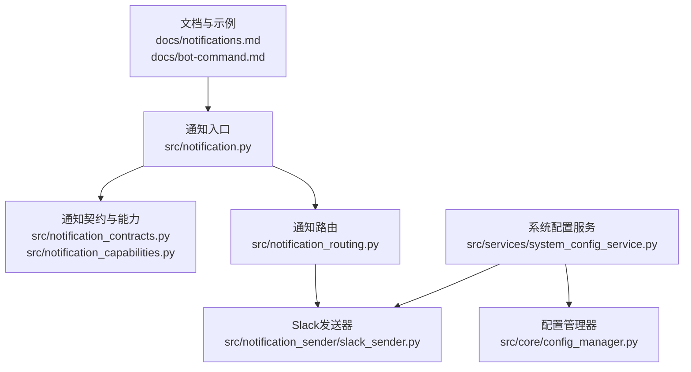
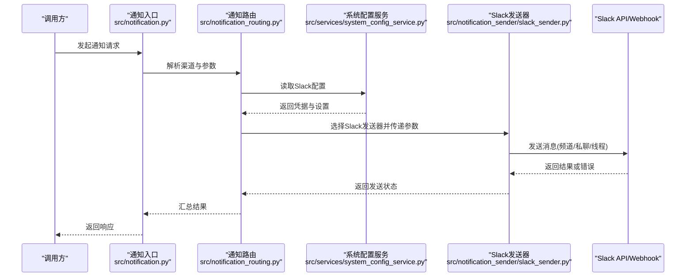
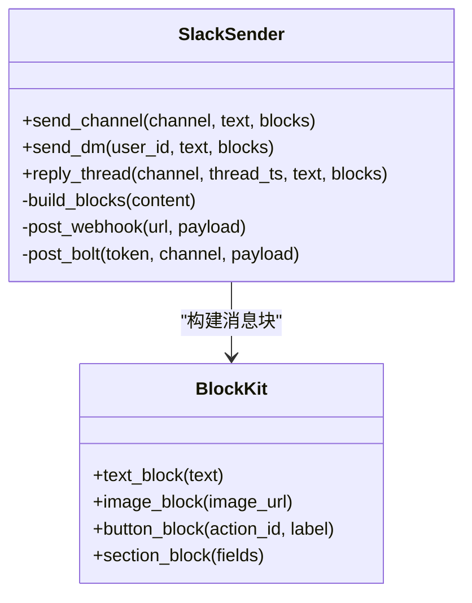
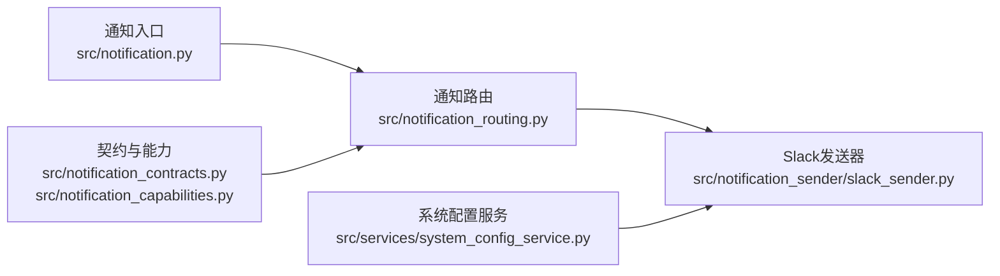

# Slack通知配置

<cite>
**本文档引用的文件**   
- [slack_sender.py](file://src/notification_sender/slack_sender.py)
- [notification.py](file://src/notification.py)
- [notification_contracts.py](file://src/notification_contracts.py)
- [notification_capabilities.py](file://src/notification_capabilities.py)
- [notification_routing.py](file://src/notification_routing.py)
- [system_config_service.py](file://src/services/system_config_service.py)
- [config_manager.py](file://src/core/config_manager.py)
- [notifications.md](file://docs/notifications.md)
- [bot-command.md](file://docs/bot-command.md)
</cite>

## 目录
1. [简介](#简介)
2. [项目结构](#项目结构)
3. [核心组件](#核心组件)
4. [架构总览](#架构总览)
5. [详细组件分析](#详细组件分析)
6. [依赖关系分析](#依赖关系分析)
7. [性能考虑](#性能考虑)
8. [故障排查指南](#故障排查指南)
9. [结论](#结论)
10. [附录](#附录)

## 简介
本文件面向需要在系统中集成Slack通知渠道的开发者与运维人员，提供从应用创建、OAuth令牌获取、工作空间权限配置到消息发送（Webhook与Bolt）的完整指南。文档同时覆盖Slack消息格式、Block Kit界面构建器与交互组件使用，以及频道推送、私聊消息和线程回复的实现方法，并包含错误处理、速率限制与调试工具的使用建议。

## 项目结构
本项目采用分层组织：通知能力定义在通用层，具体平台实现位于各自发送器模块中；系统配置由服务层统一加载与管理；路由层负责将通知事件分发到对应通道。Slack相关代码主要分布在以下位置：
- 通知契约与能力定义：src/notification_contracts.py、src/notification_capabilities.py
- 通知路由与调度：src/notification_routing.py、src/notification.py
- Slack发送器实现：src/notification_sender/slack_sender.py
- 系统配置与服务：src/services/system_config_service.py、src/core/config_manager.py
- 文档与示例：docs/notifications.md、docs/bot-command.md

图表来源
- [notification.py](file://src/notification.py)
- [notification_contracts.py](file://src/notification_contracts.py)
- [notification_capabilities.py](file://src/notification_capabilities.py)
- [notification_routing.py](file://src/notification_routing.py)
- [slack_sender.py](file://src/notification_sender/slack_sender.py)
- [system_config_service.py](file://src/services/system_config_service.py)
- [config_manager.py](file://src/core/config_manager.py)
- [notifications.md](file://docs/notifications.md)
- [bot-command.md](file://docs/bot-command.md)

章节来源
- [notification.py](file://src/notification.py)
- [notification_contracts.py](file://src/notification_contracts.py)
- [notification_capabilities.py](file://src/notification_capabilities.py)
- [notification_routing.py](file://src/notification_routing.py)
- [slack_sender.py](file://src/notification_sender/slack_sender.py)
- [system_config_service.py](file://src/services/system_config_service.py)
- [config_manager.py](file://src/core/config_manager.py)
- [notifications.md](file://docs/notifications.md)
- [bot-command.md](file://docs/bot-command.md)

## 核心组件
- 通知契约与能力：定义统一的发送接口、能力枚举（如是否支持富文本、图片、按钮等），确保多通道一致调用。
- 通知路由：根据目标渠道选择具体发送器，并封装参数转换与重试策略。
- Slack发送器：实现基于Webhook或Bolt的消息发送，包括频道推送、私聊、线程回复与Block Kit构建。
- 配置管理：集中读取Slack应用凭据、Webhook URL、Bot Token与工作空间设置。

章节来源
- [notification_contracts.py](file://src/notification_contracts.py)
- [notification_capabilities.py](file://src/notification_capabilities.py)
- [notification_routing.py](file://src/notification_routing.py)
- [slack_sender.py](file://src/notification_sender/slack_sender.py)
- [system_config_service.py](file://src/services/system_config_service.py)
- [config_manager.py](file://src/core/config_manager.py)

## 架构总览
下图展示从通知入口到Slack发送器的整体流程，包括配置加载、路由选择与发送执行。

图表来源
- [notification.py](file://src/notification.py)
- [notification_routing.py](file://src/notification_routing.py)
- [system_config_service.py](file://src/services/system_config_service.py)
- [slack_sender.py](file://src/notification_sender/slack_sender.py)

## 详细组件分析

### Slack发送器（Webhook与Bolt）
- Webhook模式：通过Incoming Webhook URL直接POST消息体，适合简单推送场景。
- Bolt模式：通过Bot Token与Slack事件回调，支持更丰富的交互与实时通信。
- 消息类型：
  - 频道推送：指定channel_id或channel_name进行发布。
  - 私聊消息：通过用户ID向个人会话发送消息。
  - 线程回复：通过thread_ts关联到已有消息形成讨论串。
- Block Kit：使用Blocks构建富文本、图片、按钮等交互元素，提升可读性与可操作性。

图表来源
- [slack_sender.py](file://src/notification_sender/slack_sender.py)

章节来源
- [slack_sender.py](file://src/notification_sender/slack_sender.py)

### 通知契约与能力
- 统一接口：所有发送器需实现一致的发送方法签名，便于路由层无差别调用。
- 能力枚举：声明各通道支持的能力（如富文本、图片、按钮、附件等），用于前端或上层逻辑判断。
- 错误模型：定义标准错误码与异常信息，便于统一处理与日志记录。

章节来源
- [notification_contracts.py](file://src/notification_contracts.py)
- [notification_capabilities.py](file://src/notification_capabilities.py)

### 通知路由与调度
- 渠道选择：根据目标渠道名称（如“slack”）选择对应发送器。
- 参数转换：将通用通知参数转换为各发送器所需的特定格式。
- 重试与降级：对网络失败或限流进行指数退避重试，必要时回退到其他通道。

章节来源
- [notification_routing.py](file://src/notification_routing.py)
- [notification.py](file://src/notification.py)

### 系统配置与服务
- 配置项：
  - slack.webhook_url：Incoming Webhook地址（Webhook模式）。
  - slack.bot_token：Bot OAuth Token（Bolt模式）。
  - slack.channel_id：默认频道ID（可选）。
  - slack.user_id：默认接收人ID（可选）。
  - slack.thread_ts：默认线程ID（可选）。
  - slack.rate_limit：速率限制策略（如每秒请求数）。
  - slack.retry_count：重试次数。
  - slack.timeout：HTTP超时时间。
- 配置来源：环境变量、配置文件或服务端配置中心，由系统配置服务统一加载与缓存。

章节来源
- [system_config_service.py](file://src/services/system_config_service.py)
- [config_manager.py](file://src/core/config_manager.py)

## 依赖关系分析
Slack发送器依赖配置服务获取凭据，并通过HTTP客户端访问Slack API。路由层依赖契约与能力定义以保障一致性。

图表来源
- [notification.py](file://src/notification.py)
- [notification_routing.py](file://src/notification_routing.py)
- [slack_sender.py](file://src/notification_sender/slack_sender.py)
- [system_config_service.py](file://src/services/system_config_service.py)
- [notification_contracts.py](file://src/notification_contracts.py)
- [notification_capabilities.py](file://src/notification_capabilities.py)

章节来源
- [notification.py](file://src/notification.py)
- [notification_routing.py](file://src/notification_routing.py)
- [slack_sender.py](file://src/notification_sender/slack_sender.py)
- [system_config_service.py](file://src/services/system_config_service.py)
- [notification_contracts.py](file://src/notification_contracts.py)
- [notification_capabilities.py](file://src/notification_capabilities.py)

## 性能考虑
- 连接复用：使用持久化HTTP连接池减少握手开销。
- 批量发送：合并多条消息为一次请求（若Slack API允许）。
- 异步发送：非关键路径通知采用异步队列，避免阻塞主流程。
- 限流控制：遵循Slack速率限制，实现指数退避与熔断保护。
- 缓存配置：缓存Slack凭据与频道映射，降低配置查询延迟。

[本节为通用指导，不直接分析具体文件]

## 故障排查指南
- 常见错误：
  - 认证失败：检查Bot Token或Webhook URL是否正确，确认应用已安装至工作空间且具备所需权限。
  - 权限不足：确认channels:write、im:write、chat:write等权限已授予。
  - 速率限制：观察HTTP 429响应，调整重试间隔与并发度。
  - 线程无效：确认thread_ts有效且当前用户有权限参与该线程。
- 调试工具：
  - 启用详细日志：记录请求URL、Payload与响应状态码。
  - 模拟发送：使用本地测试脚本构造最小Payload验证连通性。
  - 查看Slack审计日志：定位权限与事件问题。

章节来源
- [slack_sender.py](file://src/notification_sender/slack_sender.py)
- [system_config_service.py](file://src/services/system_config_service.py)

## 结论
通过统一的契约与路由机制，Slack通知渠道可灵活接入Webhook与Bolt两种模式，满足频道推送、私聊与线程回复等多种场景。合理的配置管理与错误处理策略能显著提升稳定性与可维护性。建议在生产环境启用限流、重试与监控告警，确保高可用。

[本节为总结性内容，不直接分析具体文件]

## 附录

### Slack应用创建与权限配置步骤
- 创建Slack应用：
  - 登录Slack API控制台，新建应用并命名。
  - 在“OAuth & Permissions”中添加所需权限（如channels:write、im:write、chat:write等）。
  - 安装应用到工作空间并获取Bot User OAuth Token。
- Incoming Webhook：
  - 在应用中启用Incoming Webhooks，为每个频道生成Webhook URL。
- 工作空间权限：
  - 确保Bot被邀请至目标频道或具有私聊权限。
  - 如需线程回复，确认用户对线程所在频道具有写入权限。

章节来源
- [notifications.md](file://docs/notifications.md)
- [bot-command.md](file://docs/bot-command.md)

### 配置示例（键名与说明）
- slack.webhook_url：Incoming Webhook地址（字符串）
- slack.bot_token：Bot OAuth Token（字符串）
- slack.channel_id：默认频道ID（字符串，可选）
- slack.user_id：默认接收人ID（字符串，可选）
- slack.thread_ts：默认线程ID（字符串，可选）
- slack.rate_limit：每秒最大请求数（整数，可选）
- slack.retry_count：失败重试次数（整数，可选）
- slack.timeout：HTTP超时秒数（整数，可选）

章节来源
- [system_config_service.py](file://src/services/system_config_service.py)
- [config_manager.py](file://src/core/config_manager.py)

### 消息格式与Block Kit要点
- 文本与富文本：使用Section Blocks组合文本字段与样式。
- 图片与附件：通过Image Blocks或Attachment上传媒体资源。
- 按钮与交互：使用Button Blocks绑定Action ID，配合Bolt处理回调。
- 线程回复：在请求中携带thread_ts以关联到已有消息。

章节来源
- [slack_sender.py](file://src/notification_sender/slack_sender.py)

### 错误处理与速率限制实践
- 错误分类：认证错误、权限错误、网络错误、限流错误。
- 重试策略：指数退避+抖动，达到上限后降级或告警。
- 限流控制：按渠道维度计数，超出阈值时排队或丢弃低优先级消息。

章节来源
- [slack_sender.py](file://src/notification_sender/slack_sender.py)
- [notification_routing.py](file://src/notification_routing.py)