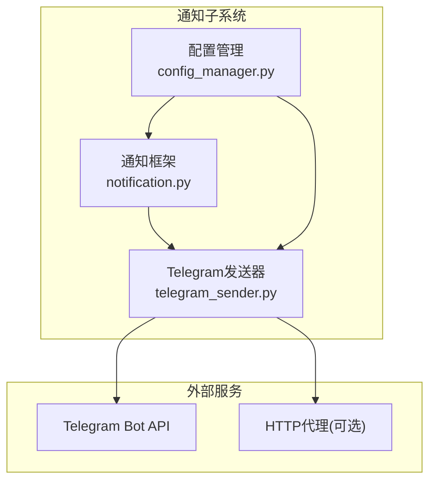
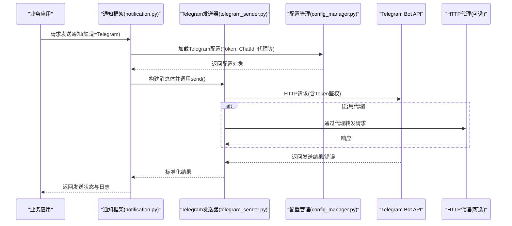
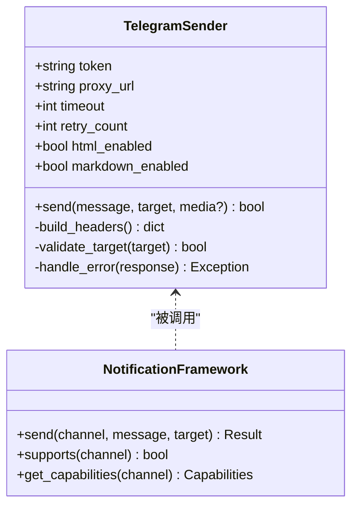
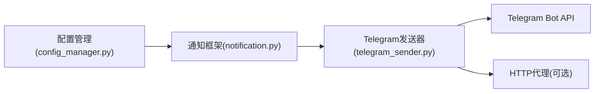

# Telegram通知配置

<cite>
**本文档引用的文件**   
- [telegram_sender.py](file://src/notification_sender/telegram_sender.py)
- [notification.py](file://src/notification.py)
- [config_manager.py](file://src/core/config_manager.py)
- [notifications.md](file://docs/notifications.md)
- [bot_command.md](file://docs/bot-command.md)
- [test_notification.py](file://tests/test_notification.py)
</cite>

## 目录
1. [简介](#简介)
2. [项目结构](#项目结构)
3. [核心组件](#核心组件)
4. [架构总览](#架构总览)
5. [详细组件分析](#详细组件分析)
6. [依赖关系分析](#依赖关系分析)
7. [性能考虑](#性能考虑)
8. [故障排查指南](#故障排查指南)
9. [结论](#结论)
10. [附录](#附录)

## 简介
本文件面向需要在系统中接入Telegram通知渠道的读者，提供从BotFather创建机器人、获取API Token、权限配置到代码侧完整配置的说明。内容涵盖代理服务器设置、大文件与媒体消息处理、消息格式（HTML/Markdown）、分页与文件大小限制、群组/频道/私聊推送方式，以及错误处理、重试机制与性能优化建议。文档同时给出基于仓库实现的调用流程与关键配置项说明，帮助快速落地并稳定运行。

## 项目结构
本项目将Telegram作为通知发送器之一，位于通知子系统下，并通过统一的通知接口进行编排与路由。核心相关文件包括：
- 通知发送器实现：Telegram发送器
- 通知框架：统一通知接口与能力定义
- 配置管理：集中式配置加载与校验
- 文档与测试：使用示例与回归用例

图表来源
- [telegram_sender.py](file://src/notification_sender/telegram_sender.py)
- [notification.py](file://src/notification.py)
- [config_manager.py](file://src/core/config_manager.py)

章节来源
- [telegram_sender.py](file://src/notification_sender/telegram_sender.py)
- [notification.py](file://src/notification.py)
- [config_manager.py](file://src/core/config_manager.py)

## 核心组件
- Telegram发送器：封装对Telegram Bot API的调用，支持文本、图片、文档等消息类型，支持代理、超时、重试与错误分类。
- 通知框架：定义统一的发送接口、能力枚举（如是否支持富文本、是否支持媒体）与路由策略。
- 配置管理：集中读取环境变量或配置文件，注入到各发送器实例中，保证可观测性与一致性。

章节来源
- [telegram_sender.py](file://src/notification_sender/telegram_sender.py)
- [notification.py](file://src/notification.py)
- [config_manager.py](file://src/core/config_manager.py)

## 架构总览
下图展示从业务侧触发通知到Telegram端点的全链路流程，包含配置加载、消息构建、发送与结果回传。

图表来源
- [notification.py](file://src/notification.py)
- [telegram_sender.py](file://src/notification_sender/telegram_sender.py)
- [config_manager.py](file://src/core/config_manager.py)

## 详细组件分析

### Telegram发送器分析
- 功能要点
  - 支持文本消息与富文本格式（HTML/Markdown）。
  - 支持图片、文档等媒体消息上传与下载。
  - 支持代理配置（HTTP/HTTPS），便于网络受限环境部署。
  - 支持超时、重试与错误分类（网络错误、限流、权限不足等）。
  - 支持群组、频道与私聊目标识别与路由。
- 关键行为
  - 构建请求时自动附加Bot Token与目标Chat ID。
  - 根据消息类型选择对应API端点（sendMessage/sendPhoto/sendDocument等）。
  - 对大文件或慢网络场景进行分片或降级策略（如优先文本摘要）。
  - 记录结构化日志，便于问题定位与监控告警。

图表来源
- [telegram_sender.py](file://src/notification_sender/telegram_sender.py)
- [notification.py](file://src/notification.py)

章节来源
- [telegram_sender.py](file://src/notification_sender/telegram_sender.py)
- [notification.py](file://src/notification.py)

### 配置管理与环境变量
- 配置项概览
  - 机器人令牌：用于鉴权的Bot Token。
  - 目标标识：Chat ID（私聊/群组/频道）。
  - 代理设置：HTTP/HTTPS代理地址。
  - 传输参数：超时时间、重试次数、最大文件大小等。
  - 格式开关：是否允许HTML/Markdown富文本。
- 加载与校验
  - 由配置管理器统一读取，并在初始化时校验必填字段。
  - 支持多环境覆盖（开发/测试/生产）。
  - 敏感信息建议使用环境变量注入。

章节来源
- [config_manager.py](file://src/core/config_manager.py)
- [notification.py](file://src/notification.py)

### 消息格式与限制
- 消息格式
  - HTML：支持常用标签，适合复杂排版。
  - Markdown：简洁语法，适合快速生成。
  - 平台差异：不同客户端渲染效果可能略有差异，建议以HTML为主、Markdown为辅。
- 限制与边界
  - 单条消息长度限制：超过需拆分或采用“摘要+链接”模式。
  - 媒体大小限制：图片/文档有上限，超大文件建议转存后发送链接。
  - 频率限制：避免短时间内大量请求导致限流。

章节来源
- [notifications.md](file://docs/notifications.md)
- [bot_command.md](file://docs/bot-command.md)

### 群组聊天、频道推送与私聊消息
- 私聊消息
  - 目标为个人Chat ID，默认具备读写权限。
  - 适合定向提醒与交互命令。
- 群组聊天
  - 目标为群组Chat ID，需确保机器人已加入且拥有必要权限。
  - 适合团队同步与协作通知。
- 频道推送
  - 目标为频道Chat ID，机器人需成为频道管理员并发布权限。
  - 适合广播类公告与报告分发。

章节来源
- [notifications.md](file://docs/notifications.md)
- [bot_command.md](file://docs/bot-command.md)

### 代理服务器与大文件/媒体消息处理
- 代理服务器
  - 在发送器中配置代理URL，所有出站请求均经代理转发。
  - 适用于企业内网或受限网络环境。
- 大文件与媒体
  - 图片/文档上传遵循Telegram限制；超出限制时自动降级为文本摘要或外链。
  - 支持断点续传与失败重试，提升稳定性。
  - 建议对高频大文件进行本地缓存与去重。

章节来源
- [telegram_sender.py](file://src/notification_sender/telegram_sender.py)
- [notifications.md](file://docs/notifications.md)

### 错误处理与重试机制
- 错误分类
  - 网络错误：连接超时、DNS解析失败等。
  - 业务错误：权限不足、目标不存在、消息过长等。
  - 限流错误：请求过快触发平台限流。
- 重试策略
  - 指数退避与抖动，避免雪崩。
  - 针对可重试错误（网络/限流）进行有限次重试。
  - 不可重试错误直接失败并记录诊断信息。
- 监控与告警
  - 记录失败原因、目标、消息长度、耗时等关键指标。
  - 结合外部监控系统进行阈值告警。

章节来源
- [telegram_sender.py](file://src/notification_sender/telegram_sender.py)
- [test_notification.py](file://tests/test_notification.py)

### 分页与批量发送
- 长文本分页
  - 按字符数切分为多条消息，保持语义连贯。
  - 首条附带标题，后续条目编号，便于阅读。
- 批量媒体
  - 控制并发度，避免触发限流。
  - 失败重试与部分成功回滚策略。

章节来源
- [notifications.md](file://docs/notifications.md)
- [telegram_sender.py](file://src/notification_sender/telegram_sender.py)

## 依赖关系分析
- 内部依赖
  - Telegram发送器依赖通知框架的统一接口与配置管理器的配置注入。
- 外部依赖
  - Telegram Bot API（HTTP/HTTPS）。
  - 可选HTTP代理。
- 耦合与内聚
  - 发送器与框架解耦，便于替换其他渠道。
  - 配置集中管理，降低分散配置带来的不一致风险。

图表来源
- [config_manager.py](file://src/core/config_manager.py)
- [notification.py](file://src/notification.py)
- [telegram_sender.py](file://src/notification_sender/telegram_sender.py)

章节来源
- [config_manager.py](file://src/core/config_manager.py)
- [notification.py](file://src/notification.py)
- [telegram_sender.py](file://src/notification_sender/telegram_sender.py)

## 性能考虑
- 连接池与复用
  - 复用HTTP连接，减少握手开销。
- 并发控制
  - 限制并发请求数量，避免触发平台限流。
- 缓存与去重
  - 对重复内容与媒体进行缓存，降低重复上传。
- 降级策略
  - 大文件优先发送文本摘要与链接，必要时再异步上传媒体。
- 监控与度量
  - 统计成功率、延迟分布、错误率，指导容量规划与调优。

[本节为通用性能建议，不直接分析具体文件]

## 故障排查指南
- 常见问题
  - Token无效或过期：检查BotFather生成的Token是否正确。
  - 权限不足：确认机器人已在群组/频道中并具备发布权限。
  - 目标不存在：核对Chat ID是否正确。
  - 代理不可达：验证代理地址与认证信息。
  - 限流触发：降低发送频率或增加退避重试。
- 诊断步骤
  - 查看发送器日志中的错误码与描述。
  - 使用最小化消息复现问题。
  - 临时关闭代理验证是否为网络环境问题。
  - 对比不同格式（HTML/Markdown）的渲染差异。
- 恢复措施
  - 修正配置并重试。
  - 对失败任务进行队列重放。
  - 开启更详细的调试日志以便定位。

章节来源
- [telegram_sender.py](file://src/notification_sender/telegram_sender.py)
- [test_notification.py](file://tests/test_notification.py)

## 结论
通过本配置文档，您可以完成Telegram通知渠道的端到端接入：从BotFather创建机器人、获取Token与权限，到代码侧配置代理、处理大文件与媒体、选择合适消息格式与目标类型，并结合错误处理与重试机制保障稳定性。建议在上线前进行充分测试与监控，持续优化性能与可靠性。

[本节为总结性内容，不直接分析具体文件]

## 附录
- 快速检查清单
  - 已创建Bot并获取有效Token。
  - 已正确配置目标Chat ID（私聊/群组/频道）。
  - 已启用必要的权限（群组/频道发布）。
  - 已配置代理（如需）。
  - 已设置合理的超时与重试参数。
  - 已准备HTML/Markdown模板与分页策略。
  - 已建立错误监控与告警。

[本节为补充信息，不直接分析具体文件]