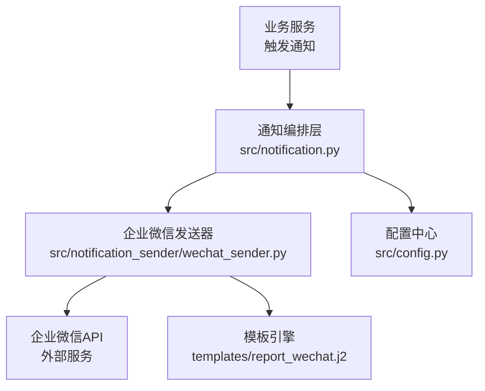
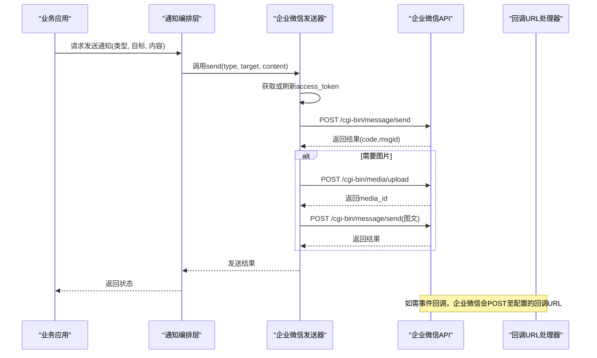
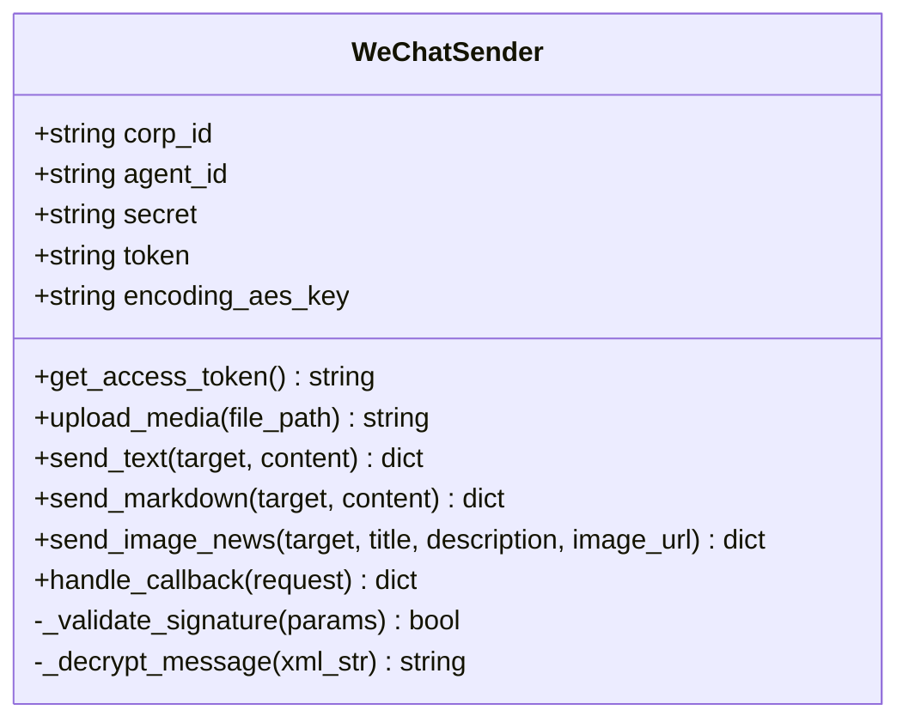
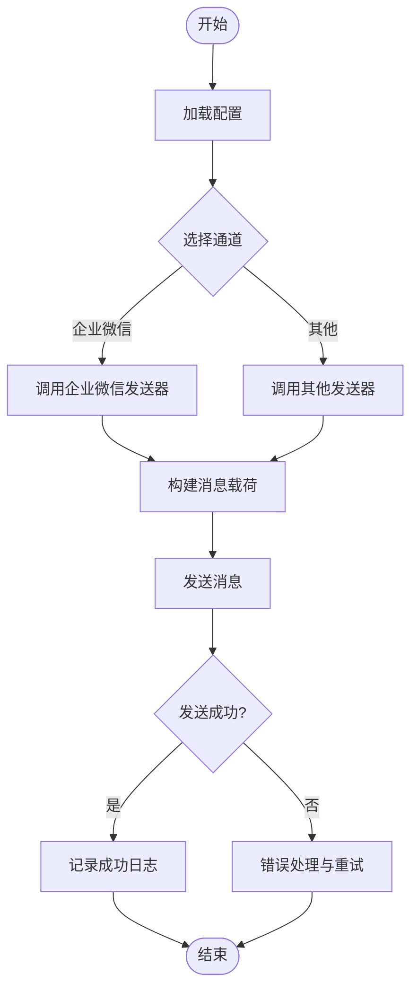
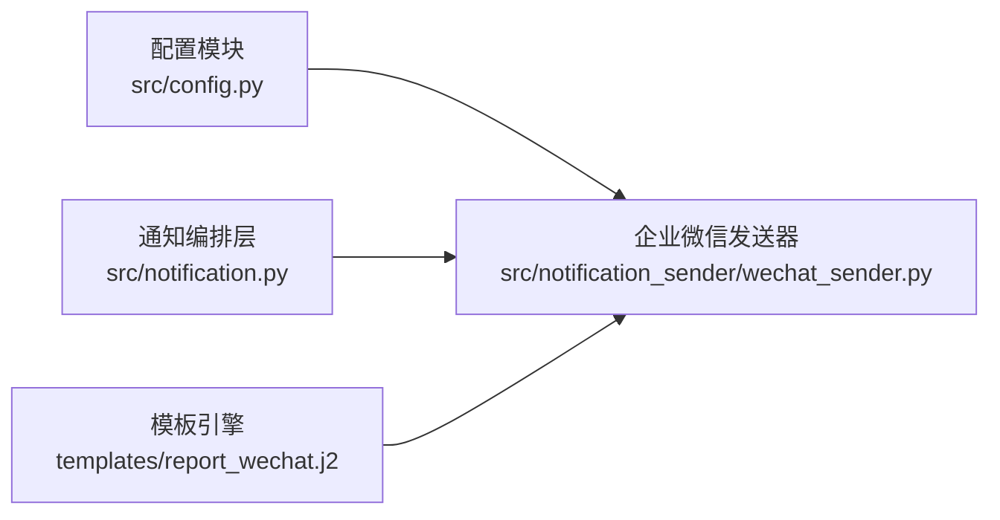

# 企业微信通知配置

<cite>
**本文引用的文件**   
- [wechat_sender.py](file://src/notification_sender/wechat_sender.py)
- [notification.py](file://src/notification.py)
- [config.py](file://src/config.py)
- [templates/report_wechat.j2](file://templates/report_wechat.j2)
</cite>

## 目录
1. [简介](#简介)
2. [项目结构](#项目结构)
3. [核心组件](#核心组件)
4. [架构总览](#架构总览)
5. [详细组件分析](#详细组件分析)
6. [依赖关系分析](#依赖关系分析)
7. [性能考虑](#性能考虑)
8. [故障排查指南](#故障排查指南)
9. [结论](#结论)
10. [附录](#附录)

## 简介
本文件面向需要在系统中集成“企业微信”作为通知渠道的读者，提供从应用创建、Secret与权限设置，到消息发送（文本、Markdown、图文）、图片上传、回调URL配置、部门/用户/应用推送场景、安全签名验证与错误处理的最佳实践。文档基于代码库中的企业微信发送器实现进行说明，确保配置与行为与实际代码一致。

## 项目结构
与企业微信通知相关的核心位置如下：
- 发送器实现：src/notification_sender/wechat_sender.py
- 通知编排与路由：src/notification.py
- 系统配置加载：src/config.py
- 模板渲染（用于生成企业微信内容）：templates/report_wechat.j2

**图表来源** 
- [notification.py](file://src/notification.py)
- [wechat_sender.py](file://src/notification_sender/wechat_sender.py)
- [config.py](file://src/config.py)
- [templates/report_wechat.j2](file://templates/report_wechat.j2)

**章节来源**
- [wechat_sender.py](file://src/notification_sender/wechat_sender.py)
- [notification.py](file://src/notification.py)
- [config.py](file://src/config.py)
- [templates/report_wechat.j2](file://templates/report_wechat.j2)

## 核心组件
- 企业微信发送器（WeChatSender）
  - 负责获取访问令牌、构造并发送消息（文本、Markdown、图文）、上传图片、处理响应与错误。
- 通知编排层（Notification Orchestration）
  - 根据配置选择通道、组装消息体、调用具体发送器。
- 配置管理（Config）
  - 读取企业微信应用的 CorpID、AgentId、Secret、Token、EncodingAESKey 等参数。
- 模板渲染（Template）
  - 将结构化数据渲染为企业微信可接受的 Markdown/HTML 内容。

**章节来源**
- [wechat_sender.py](file://src/notification_sender/wechat_sender.py)
- [notification.py](file://src/notification.py)
- [config.py](file://src/config.py)
- [templates/report_wechat.j2](file://templates/report_wechat.j2)

## 架构总览
下图展示从业务侧触发通知到企业微信接收的完整流程，包括令牌缓存、消息构建、图片上传与回调处理。

**图表来源** 
- [wechat_sender.py](file://src/notification_sender/wechat_sender.py)
- [notification.py](file://src/notification.py)

## 详细组件分析

### 企业微信发送器（WeChatSender）
职责与要点：
- 令牌管理
  - 使用 CorpID + AgentId + Secret 获取 access_token，并进行本地缓存与过期刷新。
- 消息发送
  - 支持文本、Markdown、图文三种类型；按企业微信接口规范构造 JSON 载荷。
- 图片上传
  - 先上传图片获取 media_id，再在图文消息中引用。
- 回调与签名
  - 若启用回调，需校验 Token、EncodingAESKey 解密后的签名，保证回调来源合法。
- 错误处理
  - 对网络异常、HTTP 错误码、业务错误码进行分类处理与重试策略。

**图表来源** 
- [wechat_sender.py](file://src/notification_sender/wechat_sender.py)

**章节来源**
- [wechat_sender.py](file://src/notification_sender/wechat_sender.py)

### 通知编排层（Notification Orchestration）
职责与要点：
- 根据配置决定使用哪个发送器（如企业微信、钉钉、飞书等）。
- 统一消息格式，转换为各发送器所需的内部表示。
- 聚合发送结果，记录日志与指标。

**图表来源** 
- [notification.py](file://src/notification.py)

**章节来源**
- [notification.py](file://src/notification.py)

### 配置管理（Config）
关键配置项（示例字段名，实际以代码为准）：
- 企业微信应用标识：corp_id、agent_id、secret
- 回调安全：token、encoding_aes_key
- 发送开关与默认目标：enabled、default_target_type、default_target_value
- 超时与重试：timeout、retry_times

建议通过环境变量或配置文件注入，避免硬编码敏感信息。

**章节来源**
- [config.py](file://src/config.py)

### 模板渲染（report_wechat.j2）
用途：
- 将结构化数据渲染为 Markdown 或 HTML，适配企业微信的消息格式限制。
- 控制标题、正文、图片链接、按钮等元素。

注意事项：
- 遵循企业微信 Markdown 语法限制（不支持某些样式与脚本）。
- 图片必须使用 HTTPS 且可公开访问或通过 media_id 引用。

**章节来源**
- [templates/report_wechat.j2](file://templates/report_wechat.j2)

## 依赖关系分析
- 发送器依赖配置模块获取凭证与参数。
- 编排层依赖发送器抽象，屏蔽不同通道的差异。
- 模板引擎被发送器或编排层调用以生成最终内容。

**图表来源** 
- [config.py](file://src/config.py)
- [notification.py](file://src/notification.py)
- [wechat_sender.py](file://src/notification_sender/wechat_sender.py)
- [templates/report_wechat.j2](file://templates/report_wechat.j2)

**章节来源**
- [config.py](file://src/config.py)
- [notification.py](file://src/notification.py)
- [wechat_sender.py](file://src/notification_sender/wechat_sender.py)
- [templates/report_wechat.j2](file://templates/report_wechat.j2)

## 性能考虑
- access_token 缓存
  - 避免频繁请求令牌接口，合理设置 TTL，失败时快速回退。
- 并发与限流
  - 对图片上传与消息发送进行并发控制，避免触发企业微信频率限制。
- 异步化
  - 非关键路径的发送可采用异步队列，降低主流程延迟。
- 资源复用
  - HTTP 连接池复用，减少握手开销。

[本节为通用指导，不直接分析具体文件]

## 故障排查指南
常见问题与定位步骤：
- 无法获取 access_token
  - 检查 corp_id、agent_id、secret 是否正确；确认网络可达企业微信域名。
- 消息发送失败
  - 查看返回的错误码与 msg 字段；核对目标对象（user_id/部门id/应用可见范围）是否有效。
- 图片上传失败
  - 确认图片格式与大小符合限制；检查 URL 可访问性或本地文件路径权限。
- 回调签名校验失败
  - 核对 token、encoding_aes_key；确保回调 URL 已正确配置且公网可达。
- 重试与降级
  - 对瞬时错误实施指数退避重试；必要时切换备用通道或关闭非关键通知。

**章节来源**
- [wechat_sender.py](file://src/notification_sender/wechat_sender.py)
- [notification.py](file://src/notification.py)

## 结论
通过在企业微信发送器中集中管理令牌、消息构建、图片上传与回调校验，并结合编排层与配置模块，可实现稳定可靠的企业微信通知能力。建议在生产环境严格管理密钥、启用回调签名校验、实施合理的重试与监控告警，确保通知的高可用与安全。

[本节为总结性内容，不直接分析具体文件]

## 附录

### 企业微信应用创建与权限设置（操作指引）
- 创建企业微信应用
  - 登录企业微信管理后台，进入“应用管理”，新建应用，记录 CorpID、AgentId、Secret。
- 权限设置
  - 在应用“权限管理”中开启“消息推送”、“通讯录读取”（如需部门/用户推送）、“素材管理”（如需图片上传）。
- 回调URL配置
  - 在应用“接收消息”中配置回调地址，填写 Token 与 EncodingAESKey，并确保服务器能解密与验签。

[本节为通用操作指引，不直接分析具体文件]

### 配置示例（字段清单）
- 必填字段
  - corp_id、agent_id、secret、enabled
- 可选字段
  - token、encoding_aes_key、default_target_type、default_target_value、timeout、retry_times

[本节为通用配置说明，不直接分析具体文件]

### 消息发送示例（文本、Markdown、图文）
- 文本消息
  - 目标：user_id 或 party_id 或 touser/touser@all
  - 内容：纯文本，注意换行与长度限制
- Markdown 消息
  - 目标：同上
  - 内容：Markdown 语法，注意企业微信支持的子集
- 图文消息
  - 目标：同上
  - 内容：标题、摘要、图片（先上传获取 media_id 或使用外链）

[本节为通用示例说明，不直接分析具体文件]

### 消息格式限制与图片上传方法
- 格式限制
  - 文本长度、Markdown 标签支持范围、图片尺寸与格式要求
- 图片上传
  - 先调用媒体上传接口获取 media_id，再在图文消息中引用；或直接使用 HTTPS 外链

[本节为通用说明，不直接分析具体文件]

### 部门推送、用户推送与应用推送场景
- 用户推送
  - 指定 user_id，适合个人提醒
- 部门推送
  - 指定 party_id，适合团队通知
- 应用推送
  - 使用应用可见范围，适合全局公告

[本节为通用说明，不直接分析具体文件]

### 安全配置、签名验证与错误处理最佳实践
- 安全配置
  - 使用环境变量存储密钥，最小权限原则分配应用权限
- 签名验证
  - 回调请求必须校验签名与解密，防止伪造
- 错误处理
  - 区分网络错误与业务错误，实施重试与熔断；记录详细日志便于追踪

[本节为通用最佳实践，不直接分析具体文件]