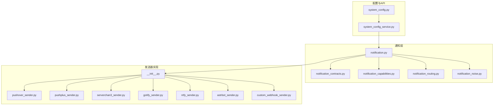
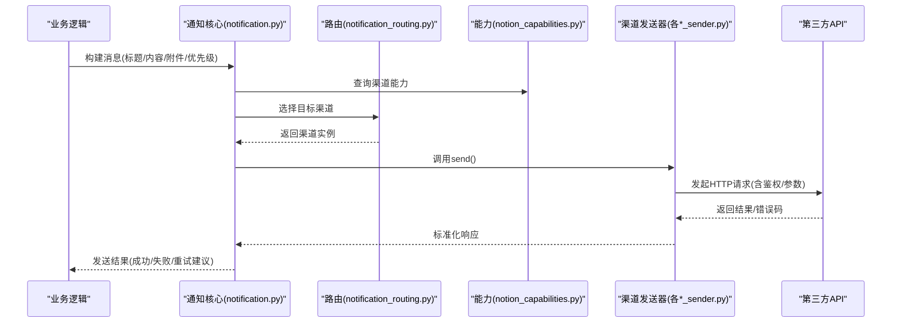
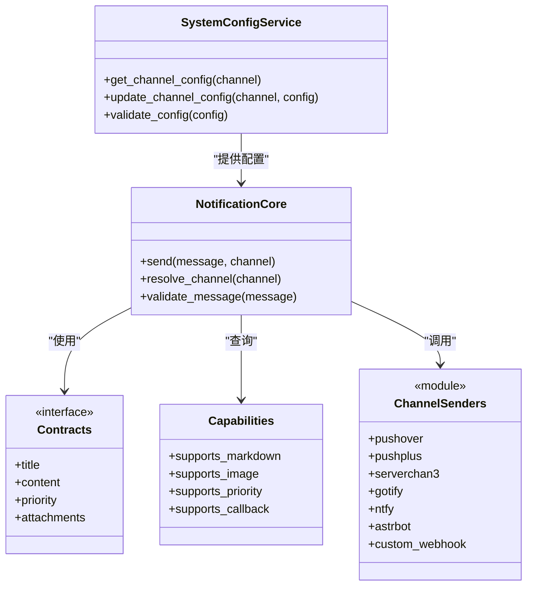

# 其他通知渠道

<cite>
**本文引用的文件**   
- [src/notification_sender/__init__.py](file://src/notification_sender/__init__.py)
- [src/notification_sender/pushover_sender.py](file://src/notification_sender/pushover_sender.py)
- [src/notification_sender/pushplus_sender.py](file://src/notification_sender/pushplus_sender.py)
- [src/notification_sender/serverchan3_sender.py](file://src/notification_sender/serverchan3_sender.py)
- [src/notification_sender/gotify_sender.py](file://src/notification_sender/gotify_sender.py)
- [src/notification_sender/ntfy_sender.py](file://src/notification_sender/ntfy_sender.py)
- [src/notification_sender/astrbot_sender.py](file://src/notification_sender/astrbot_sender.py)
- [src/notification_sender/custom_webhook_sender.py](file://src/notification_sender/custom_webhook_sender.py)
- [src/notification.py](file://src/notification.py)
- [src/notification_capabilities.py](file://src/notification_capabilities.py)
- [src/notification_contracts.py](file://src/notification_contracts.py)
- [src/notification_noise.py](file://src/notification_noise.py)
- [src/notification_routing.py](file://src/notification_routing.py)
- [src/services/system_config_service.py](file://src/services/system_config_service.py)
- [api/v1/endpoints/system_config.py](file://api/v1/endpoints/system_config.py)
- [scripts/generate_notification_actions_env_table.py](file://scripts/generate_notification_actions_env_table.py)
</cite>

## 目录
1. [简介](#简介)
2. [项目结构](#项目结构)
3. [核心组件](#核心组件)
4. [架构总览](#架构总览)
5. [详细组件分析](#详细组件分析)
6. [依赖关系分析](#依赖关系分析)
7. [性能考虑](#性能考虑)
8. [故障排查指南](#故障排查指南)
9. [结论](#结论)
10. [附录](#附录)

## 简介
本文件面向“其他通知渠道”的综合配置与使用，覆盖 Pushover、PushPlus、Server酱3.0、Gotify、Ntfy、AstrBot 等移动端通知服务。文档包含：
- 各服务的注册流程、API密钥获取与基本配置步骤
- 统一的消息格式与能力对比
- 自定义 Webhook 发送器的实现指南（对接第三方通知）
- 统一的错误处理模式与配置管理最佳实践

## 项目结构
本项目在 src/notification_sender 下以“每个渠道一个发送器模块”的方式组织；上层通过 notification.py、notification_contracts.py、notification_capabilities.py、notification_routing.py 等模块进行统一编排、能力描述与路由分发；系统配置由 system_config_service.py 提供，并通过 API 暴露。

图表来源
- [src/notification.py](file://src/notification.py)
- [src/notification_contracts.py](file://src/notification_contracts.py)
- [src/notification_capabilities.py](file://src/notification_capabilities.py)
- [src/notification_routing.py](file://src/notification_routing.py)
- [src/notification_noise.py](file://src/notification_noise.py)
- [src/notification_sender/__init__.py](file://src/notification_sender/__init__.py)
- [src/notification_sender/pushover_sender.py](file://src/notification_sender/pushover_sender.py)
- [src/notification_sender/pushplus_sender.py](file://src/notification_sender/pushplus_sender.py)
- [src/notification_sender/serverchan3_sender.py](file://src/notification_sender/serverchan3_sender.py)
- [src/notification_sender/gotify_sender.py](file://src/notification_sender/gotify_sender.py)
- [src/notification_sender/ntfy_sender.py](file://src/notification_sender/ntfy_sender.py)
- [src/notification_sender/astrbot_sender.py](file://src/notification_sender/astrbot_sender.py)
- [src/notification_sender/custom_webhook_sender.py](file://src/notification_sender/custom_webhook_sender.py)
- [src/services/system_config_service.py](file://src/services/system_config_service.py)
- [api/v1/endpoints/system_config.py](file://api/v1/endpoints/system_config.py)

章节来源
- [src/notification_sender/__init__.py](file://src/notification_sender/__init__.py)
- [src/notification.py](file://src/notification.py)
- [src/notification_contracts.py](file://src/notification_contracts.py)
- [src/notification_capabilities.py](file://src/notification_capabilities.py)
- [src/notification_routing.py](file://src/notification_routing.py)
- [src/notification_noise.py](file://src/notification_noise.py)
- [src/services/system_config_service.py](file://src/services/system_config_service.py)
- [api/v1/endpoints/system_config.py](file://api/v1/endpoints/system_config.py)

## 核心组件
- 统一契约与能力定义
  - 消息契约：定义标题、内容、附件、优先级、回调等字段规范
  - 能力枚举：是否支持富文本、图片、Markdown、高优先级、回调、重试等
- 路由与降噪
  - 根据渠道能力与用户配置选择最优通道
  - 对重复/低价值信息进行去重或合并
- 发送器抽象与实现
  - 每个渠道实现统一的 send() 接口
  - 内部封装 HTTP 请求、鉴权、重试、超时、错误码映射

章节来源
- [src/notification_contracts.py](file://src/notification_contracts.py)
- [src/notification_capabilities.py](file://src/notification_capabilities.py)
- [src/notification_routing.py](file://src/notification_routing.py)
- [src/notification_noise.py](file://src/notification_noise.py)

## 架构总览
下图展示从业务侧到具体渠道的调用链路与数据流转。

图表来源
- [src/notification.py](file://src/notification.py)
- [src/notification_routing.py](file://src/notification_routing.py)
- [src/notification_capabilities.py](file://src/notification_capabilities.py)
- [src/notification_sender/pushover_sender.py](file://src/notification_sender/pushover_sender.py)
- [src/notification_sender/pushplus_sender.py](file://src/notification_sender/pushplus_sender.py)
- [src/notification_sender/serverchan3_sender.py](file://src/notification_sender/serverchan3_sender.py)
- [src/notification_sender/gotify_sender.py](file://src/notification_sender/gotify_sender.py)
- [src/notification_sender/ntfy_sender.py](file://src/notification_sender/ntfy_sender.py)
- [src/notification_sender/astrbot_sender.py](file://src/notification_sender/astrbot_sender.py)
- [src/notification_sender/custom_webhook_sender.py](file://src/notification_sender/custom_webhook_sender.py)

## 详细组件分析

### Pushover
- 注册与密钥
  - 在 Pushover 官网注册并创建应用，获取 User Key 与 Token
- 基本配置
  - 设置用户密钥与应用令牌
  - 可选：设备名、声音、重试间隔、过期时间
- 消息格式要点
  - 标题、正文、HTML 标记、附件、优先级
- 功能特性
  - 支持高优先级、回调、附件、多设备
- 常见问题
  - 无效的用户Key/Token、网络超时、附件大小限制

章节来源
- [src/notification_sender/pushover_sender.py](file://src/notification_sender/pushover_sender.py)

### PushPlus
- 注册与密钥
  - 在 PushPlus 平台注册并获取推送令牌
- 基本配置
  - 配置令牌、可选主题、扩展字段
- 消息格式要点
  - 标题、内容、Markdown、图片URL
- 功能特性
  - 支持 Markdown、图片、模板变量
- 常见问题
  - 令牌失效、网络异常、内容长度限制

章节来源
- [src/notification_sender/pushplus_sender.py](file://src/notification_sender/pushplus_sender.py)

### Server酱3.0
- 注册与密钥
  - 在 Server酱3.0 平台绑定微信并获取 SCKEY
- 基本配置
  - 配置 SCKEY、可选标题
- 消息格式要点
  - 标题、正文、可选扩展字段
- 功能特性
  - 简单稳定、适合轻量告警
- 常见问题
  - SCKEY 错误、频率限制、中文编码问题

章节来源
- [src/notification_sender/serverchan3_sender.py](file://src/notification_sender/serverchan3_sender.py)

### Gotify
- 注册与密钥
  - 自建或托管 Gotify 服务器，创建应用并生成 Token
- 基本配置
  - 服务端地址、应用 Token、优先级、标题
- 消息格式要点
  - 标题、消息体、附加键值对
- 功能特性
  - 自托管、可集成事件流、权限控制
- 常见问题
  - TLS/代理配置、Token 权限不足、端口不通

章节来源
- [src/notification_sender/gotify_sender.py](file://src/notification_sender/gotify_sender.py)

### Ntfy
- 注册与密钥
  - 使用公共 ntfy.sh 或自建实例，订阅主题
- 基本配置
  - 主题、服务器地址、认证方式（Basic/Token）
- 消息格式要点
  - 主题、标题、消息、附件、标签、优先级
- 功能特性
  - 支持 MQTT/HTTP、Webhook、插件生态
- 常见问题
  - 主题不存在、认证失败、网络延迟

章节来源
- [src/notification_sender/ntfy_sender.py](file://src/notification_sender/ntfy_sender.py)

### AstrBot
- 注册与密钥
  - 部署 AstrBot 并启用通知插件，获取相关凭据
- 基本配置
  - 插件地址、鉴权信息、频道/群组ID
- 消息格式要点
  - 标题、内容、富文本、图片
- 功能特性
  - 多平台聚合、插件化扩展
- 常见问题
  - 插件未启用、鉴权失败、消息格式不兼容

章节来源
- [src/notification_sender/astrbot_sender.py](file://src/notification_sender/astrbot_sender.py)

### 自定义 Webhook 发送器
- 适用场景
  - 对接任意支持 HTTP 回调的通知服务或企业内部系统
- 配置项
  - Webhook URL、请求方法、Headers（如 Authorization）、Body 模板、重试策略、超时
- 实现要点
  - 动态构造请求体（JSON/Form）、签名/加密、错误码映射、幂等性
- 调试技巧
  - 开启日志、抓包验证、Mock 服务端

章节来源
- [src/notification_sender/custom_webhook_sender.py](file://src/notification_sender/custom_webhook_sender.py)

### 统一消息格式与能力对比
- 统一字段
  - 标题、内容、附件、优先级、回调、Markdown、图片
- 能力矩阵（示例）
  - Pushover：高优先级、回调、附件、多设备
  - PushPlus：Markdown、图片、模板
  - Server酱3.0：轻量、微信直达
  - Gotify：自托管、事件流
  - Ntfy：主题订阅、MQTT/HTTP、插件
  - AstrBot：多平台聚合、插件化
- 选择建议
  - 个人即时提醒：Pushover / PushPlus / Server酱3.0
  - 企业自管：Gotify / Ntfy
  - 多平台聚合：AstrBot
  - 定制对接：Custom Webhook

[本节为概念性总结，不直接分析具体文件]

## 依赖关系分析
- 发送器模块均实现统一接口，通过 __init__.py 集中导出
- 通知核心依赖契约与能力定义，按路由策略选择发送器
- 系统配置服务负责加载/校验/更新渠道配置，API 层对外暴露

图表来源
- [src/notification.py](file://src/notification.py)
- [src/notification_contracts.py](file://src/notification_contracts.py)
- [src/notification_capabilities.py](file://src/notification_capabilities.py)
- [src/notification_sender/__init__.py](file://src/notification_sender/__init__.py)
- [src/services/system_config_service.py](file://src/services/system_config_service.py)

章节来源
- [src/notification_sender/__init__.py](file://src/notification_sender/__init__.py)
- [src/notification.py](file://src/notification.py)
- [src/services/system_config_service.py](file://src/services/system_config_service.py)

## 性能考虑
- 连接复用与超时：合理设置连接池、读写超时，避免阻塞
- 重试与退避：指数退避、最大重试次数、熔断降级
- 并发与限流：批量发送时控制并发度，遵循第三方速率限制
- 附件优化：压缩图片、分片上传、优先使用URL引用
- 缓存与去重：对相同内容进行哈希去重，减少重复上报

[本节为通用指导，不直接分析具体文件]

## 故障排查指南
- 常见错误分类
  - 认证失败：检查 Token/SCKEY/用户名密码
  - 网络异常：DNS/代理/TLS/防火墙
  - 参数错误：字段缺失、类型不符、长度超限
  - 服务限流：等待重试或降低频率
- 定位步骤
  - 查看发送器日志与请求报文
  - 使用 curl/Postman 模拟请求
  - 启用调试模式输出详细错误码
- 恢复策略
  - 自动重试+退避
  - 切换备用渠道
  - 降级为本地日志或邮件

章节来源
- [src/notification_noise.py](file://src/notification_noise.py)
- [src/notification_routing.py](file://src/notification_routing.py)

## 结论
通过统一的契约、能力与路由机制，项目将多种移动端通知服务整合为一致的发送体验。推荐根据使用场景选择合适的渠道，并在需要时通过 Custom Webhook 灵活对接第三方系统。配合完善的错误处理与配置管理，可实现高可靠的通知链路。

[本节为总结性内容，不直接分析具体文件]

## 附录
- 环境变量与动作表生成脚本
  - 用于生成通知渠道的环境变量与动作对照表，便于运维与审计

章节来源
- [scripts/generate_notification_actions_env_table.py](file://scripts/generate_notification_actions_env_table.py)