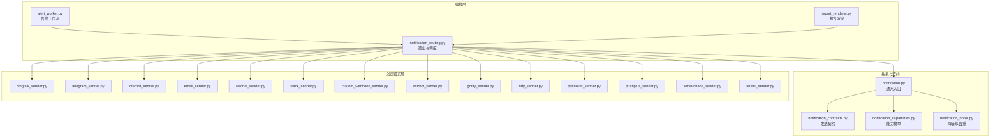
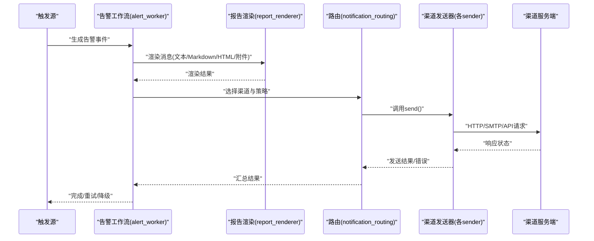
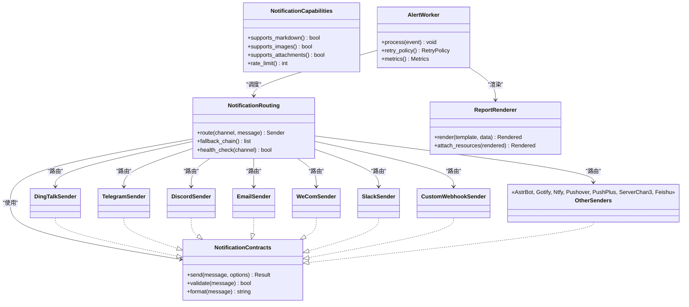

# 通知渠道配置

<cite>
**本文引用的文件**   
- [src/notification.py](file://src/notification.py)
- [src/notification_capabilities.py](file://src/notification_capabilities.py)
- [src/notification_contracts.py](file://src/notification_contracts.py)
- [src/notification_noise.py](file://src/notification_noise.py)
- [src/notification_routing.py](file://src/notification_routing.py)
- [src/services/alert_worker.py](file://src/services/alert_worker.py)
- [src/services/system_config_service.py](file://src/services/system_config_service.py)
- [src/services/report_renderer.py](file://src/services/report_renderer.py)
- [src/notification_sender/__init__.py](file://src/notification_sender/__init__.py)
- [src/notification_sender/dingtalk_sender.py](file://src/notification_sender/dingtalk_sender.py)
- [src/notification_sender/telegram_sender.py](file://src/notification_sender/telegram_sender.py)
- [src/notification_sender/discord_sender.py](file://src/notification_sender/discord_sender.py)
- [src/notification_sender/email_sender.py](file://src/notification_sender/email_sender.py)
- [src/notification_sender/wechat_sender.py](file://src/notification_sender/wechat_sender.py)
- [src/notification_sender/slack_sender.py](file://src/notification_sender/slack_sender.py)
- [src/notification_sender/custom_webhook_sender.py](file://src/notification_sender/custom_webhook_sender.py)
- [src/notification_sender/astrbot_sender.py](file://src/notification_sender/astrbot_sender.py)
- [src/notification_sender/gotify_sender.py](file://src/notification_sender/gotify_sender.py)
- [src/notification_sender/ntfy_sender.py](file://src/notification_sender/ntfy_sender.py)
- [src/notification_sender/pushover_sender.py](file://src/notification_sender/pushover_sender.py)
- [src/notification_sender/pushplus_sender.py](file://src/notification_sender/pushplus_sender.py)
- [src/notification_sender/serverchan3_sender.py](file://src/notification_sender/serverchan3_sender.py)
- [src/notification_sender/feishu_sender.py](file://src/notification_sender/feishu_sender.py)
- [scripts/generate_notification_actions_env_table.py](file://scripts/generate_notification_actions_env_table.py)
- [tests/test_notification.py](file://tests/test_notification.py)
- [tests/test_notification_diagnostics.py](file://tests/test_notification_diagnostics.py)
- [tests/test_notification_sender.py](file://tests/test_notification_sender.py)
- [tests/test_pipeline_single_notify_thread_safety.py](file://tests/test_pipeline_single_notify_thread安全.py)
</cite>

## 目录
1. [简介](#简介)
2. [项目结构](#项目结构)
3. [核心组件](#核心组件)
4. [架构总览](#架构总览)
5. [详细组件分析](#详细组件分析)
6. [依赖关系分析](#依赖关系分析)
7. [性能考量](#性能考量)
8. [故障排查指南](#故障排查指南)
9. [结论](#结论)
10. [附录](#附录)

## 简介
本文件面向Daily Stock Analysis的通知子系统，提供所有支持的通知渠道（钉钉、Telegram、Discord、邮件、企业微信、Slack等）的详细配置与使用文档。内容涵盖：
- 各渠道的配置参数、认证方式与连接设置
- 环境变量与完整配置示例
- 消息格式差异与限制（字符长度、图片大小、附件类型等）
- 健康检查机制与故障转移策略
- 调试方法与常见问题解决方案
- 渠道性能对比与选择建议

## 项目结构
通知子系统由“路由与编排”“能力与契约”“发送器实现”“渲染与报告”“诊断与测试”等模块组成。整体采用分层设计：上层通过统一接口进行消息分发，下层按渠道实现具体发送逻辑。

图表来源
- [src/notification_routing.py](file://src/notification_routing.py)
- [src/services/alert_worker.py](file://src/services/alert_worker.py)
- [src/services/report_renderer.py](file://src/services/report_renderer.py)
- [src/notification.py](file://src/notification.py)
- [src/notification_contracts.py](file://src/notification_contracts.py)
- [src/notification_capabilities.py](file://src/notification_capabilities.py)
- [src/notification_noise.py](file://src/notification_noise.py)
- [src/notification_sender/dingtalk_sender.py](file://src/notification_sender/dingtalk_sender.py)
- [src/notification_sender/telegram_sender.py](file://src/notification_sender/telegram_sender.py)
- [src/notification_sender/discord_sender.py](file://src/notification_sender/discord_sender.py)
- [src/notification_sender/email_sender.py](file://src/notification_sender/email_sender.py)
- [src/notification_sender/wechat_sender.py](file://src/notification_sender/wechat_sender.py)
- [src/notification_sender/slack_sender.py](file://src/notification_sender/slack_sender.py)
- [src/notification_sender/custom_webhook_sender.py](file://src/notification_sender/custom_webhook_sender.py)
- [src/notification_sender/astrbot_sender.py](file://src/notification_sender/astrbot_sender.py)
- [src/notification_sender/gotify_sender.py](file://src/notification_sender/gotify_sender.py)
- [src/notification_sender/ntfy_sender.py](file://src/notification_sender/ntfy_sender.py)
- [src/notification_sender/pushover_sender.py](file://src/notification_sender/pushover_sender.py)
- [src/notification_sender/pushplus_sender.py](file://src/notification_sender/pushplus_sender.py)
- [src/notification_sender/serverchan3_sender.py](file://src/notification_sender/serverchan3_sender.py)
- [src/notification_sender/feishu_sender.py](file://src/notification_sender/feishu_sender.py)

章节来源
- [src/notification.py](file://src/notification.py)
- [src/notification_routing.py](file://src/notification_routing.py)
- [src/services/alert_worker.py](file://src/services/alert_worker.py)
- [src/services/report_renderer.py](file://src/services/report_renderer.py)

## 核心组件
- 统一入口与契约
  - 发送契约定义了统一的send接口、消息体结构与错误约定，屏蔽底层渠道差异。
  - 能力枚举用于声明各渠道是否支持富文本、图片、附件、Markdown、模板渲染等能力。
- 路由与调度
  - 根据目标渠道、消息类型与系统配置，将消息路由到对应发送器；支持多通道并行与失败回退。
- 报告渲染
  - 将结构化数据渲染为各渠道所需的格式（如Markdown、HTML、纯文本），并处理图片与附件嵌入。
- 降噪与去重
  - 对高频告警进行合并、限流与去重，避免通知风暴。
- 工作流与集成
  - 告警工作流负责触发、编排、重试与结果上报；与系统配置服务联动读取渠道配置。

章节来源
- [src/notification_contracts.py](file://src/notification_contracts.py)
- [src/notification_capabilities.py](file://src/notification_capabilities.py)
- [src/notification_noise.py](file://src/notification_noise.py)
- [src/notification_routing.py](file://src/notification_routing.py)
- [src/services/alert_worker.py](file://src/services/alert_worker.py)
- [src/services/report_renderer.py](file://src/services/report_renderer.py)

## 架构总览
下图展示了从“告警触发”到“多渠道发送”的端到端流程，包括渲染、路由、发送与健康检查。

图表来源
- [src/services/alert_worker.py](file://src/services/alert_worker.py)
- [src/services/report_renderer.py](file://src/services/report_renderer.py)
- [src/notification_routing.py](file://src/notification_routing.py)
- [src/notification_sender/dingtalk_sender.py](file://src/notification_sender/dingtalk_sender.py)
- [src/notification_sender/telegram_sender.py](file://src/notification_sender/telegram_sender.py)
- [src/notification_sender/discord_sender.py](file://src/notification_sender/discord_sender.py)
- [src/notification_sender/email_sender.py](file://src/notification_sender/email_sender.py)
- [src/notification_sender/wechat_sender.py](file://src/notification_sender/wechat_sender.py)
- [src/notification_sender/slack_sender.py](file://src/notification_sender/slack_sender.py)
- [src/notification_sender/custom_webhook_sender.py](file://src/notification_sender/custom_webhook_sender.py)

## 详细组件分析

### 统一入口与契约
- 发送契约
  - 定义统一的send方法签名、消息体字段（标题、正文、附件、图片、回调等）、返回码与异常约定。
  - 要求每个渠道实现类遵循该契约，便于路由与测试。
- 能力声明
  - 通过能力枚举描述渠道特性：是否支持Markdown、富文本、图片、附件、模板变量、批量发送、速率限制等。
- 噪声控制
  - 提供去重、限流、合并策略，减少重复与风暴。

章节来源
- [src/notification_contracts.py](file://src/notification_contracts.py)
- [src/notification_capabilities.py](file://src/notification_capabilities.py)
- [src/notification_noise.py](file://src/notification_noise.py)

### 路由与调度
- 渠道选择
  - 基于系统配置与消息类型选择主渠道，并在失败时按优先级回退至备用渠道。
- 并发与重试
  - 支持并行发送与指数退避重试；记录发送耗时与成功率。
- 健康检查
  - 启动或定时执行连通性检测，标记不可用渠道并自动跳过。

章节来源
- [src/notification_routing.py](file://src/notification_routing.py)
- [src/services/alert_worker.py](file://src/services/alert_worker.py)

### 报告渲染
- 模板与格式
  - 支持Markdown、HTML、纯文本模板；可注入变量与图片链接。
- 资源处理
  - 图片与附件在发送前进行压缩、校验与尺寸限制，确保符合渠道约束。
- 语言与本地化
  - 根据系统配置选择输出语言与格式。

章节来源
- [src/services/report_renderer.py](file://src/services/report_renderer.py)

### 告警工作流
- 触发与编排
  - 接收上游事件，组装上下文，调用渲染与路由，收集结果。
- 重试与降级
  - 失败时按策略重试，必要时切换备用渠道或降级为纯文本。
- 审计与日志
  - 记录关键步骤、错误堆栈与指标，便于诊断。

章节来源
- [src/services/alert_worker.py](file://src/services/alert_worker.py)

### 渠道发送器实现（钉钉、Telegram、Discord、邮件、企业微信、Slack等）
以下为各渠道的关键配置项、认证方式与连接设置要点。为避免泄露敏感信息，以下仅列出参数名称与用途说明，实际值请通过环境变量或系统配置管理。

- 钉钉（DingTalk）
  - 配置项：Webhook地址、签名密钥、@指定人开关、消息类型（文本/Markdown/ActionCard等）
  - 认证：Webhook签名验证
  - 连接：HTTPS POST，支持图片URL与附件链接
  - 限制：单条消息长度、Markdown语法子集、图片大小与数量
  - 健康检查：发送一条最小消息验证连通性与签名
  - 参考实现路径：[dingtalk_sender.py](file://src/notification_sender/dingtalk_sender.py)

- Telegram
  - 配置项：Bot Token、Chat ID、解析模式（Markdown/HTML/None）、代理设置
  - 认证：Bot Token鉴权
  - 连接：Telegram Bot API（HTTPS）
  - 限制：消息长度、Markdown/HTML子集、媒体大小与类型
  - 健康检查：调用getMe或发送测试消息
  - 参考实现路径：[telegram_sender.py](file://src/notification_sender/telegram_sender.py)

- Discord
  - 配置项：Webhook URL、Embed支持、线程/频道选择
  - 认证：Webhook Token
  - 连接：Discord Webhook API（HTTPS）
  - 限制：Embed字段长度、附件大小与类型
  - 健康检查：发送空消息或Ping
  - 参考实现路径：[discord_sender.py](file://src/notification_sender/discord_sender.py)

- 邮件（Email）
  - 配置项：SMTP服务器、端口、用户名、密码/授权码、SSL/TLS、发件人、收件人列表
  - 认证：SMTP登录或OAuth（视实现）
  - 连接：SMTP协议（TLS/SSL）
  - 限制：主题与正文长度、附件大小与MIME类型
  - 健康检查：连接SMTP并发送测试邮件
  - 参考实现路径：[email_sender.py](file://src/notification_sender/email_sender.py)

- 企业微信（WeCom）
  - 配置项：应用ID、Secret、AgentId、部门/成员ID、Webhook（可选）
  - 认证：应用凭证或Webhook签名
  - 连接：企业微信API（HTTPS）
  - 限制：消息长度、Markdown子集、媒体大小
  - 健康检查：发送测试消息或获取用户信息
  - 参考实现路径：[wechat_sender.py](file://src/notification_sender/wechat_sender.py)

- Slack
  - 配置项：Bot Token、Channel ID、Block Kit支持、代理设置
  - 认证：Bot Token
  - 连接：Slack Web API（HTTPS）
  - 限制：消息块长度、附件大小与类型
  - 健康检查：调用channels.info或发送测试消息
  - 参考实现路径：[slack_sender.py](file://src/notification_sender/slack_sender.py)

- 自定义Webhook
  - 配置项：目标URL、请求头、请求体模板、重试策略
  - 认证：按目标服务要求（Bearer、Basic、签名等）
  - 连接：HTTP(S) POST/GET
  - 限制：取决于目标服务
  - 健康检查：发送探测请求并校验响应码
  - 参考实现路径：[custom_webhook_sender.py](file://src/notification_sender/custom_webhook_sender.py)

- 其他推送（AstrBot、Gotify、Ntfy、Pushover、PushPlus、ServerChan3、飞书）
  - 配置项：各平台Token/Key、目标标识（频道/群组/设备）、可选代理
  - 认证：平台Token或签名
  - 连接：HTTP(S) API
  - 限制：平台自身限制（消息长度、媒体大小、频率）
  - 健康检查：发送最小消息或调用健康接口
  - 参考实现路径：
    - [astrbot_sender.py](file://src/notification_sender/astrbot_sender.py)
    - [gotify_sender.py](file://src/notification_sender/gotify_sender.py)
    - [ntfy_sender.py](file://src/notification_sender/ntfy_sender.py)
    - [pushover_sender.py](file://src/notification_sender/pushover_sender.py)
    - [pushplus_sender.py](file://src/notification_sender/pushplus_sender.py)
    - [serverchan3_sender.py](file://src/notification_sender/serverchan3_sender.py)
    - [feishu_sender.py](file://src/notification_sender/feishu_sender.py)

章节来源
- [src/notification_sender/dingtalk_sender.py](file://src/notification_sender/dingtalk_sender.py)
- [src/notification_sender/telegram_sender.py](file://src/notification_sender/telegram_sender.py)
- [src/notification_sender/discord_sender.py](file://src/notification_sender/discord_sender.py)
- [src/notification_sender/email_sender.py](file://src/notification_sender/email_sender.py)
- [src/notification_sender/wechat_sender.py](file://src/notification_sender/wechat_sender.py)
- [src/notification_sender/slack_sender.py](file://src/notification_sender/slack_sender.py)
- [src/notification_sender/custom_webhook_sender.py](file://src/notification_sender/custom_webhook_sender.py)
- [src/notification_sender/astrbot_sender.py](file://src/notification_sender/astrbot_sender.py)
- [src/notification_sender/gotify_sender.py](file://src/notification_sender/gotify_sender.py)
- [src/notification_sender/ntfy_sender.py](file://src/notification_sender/ntfy_sender.py)
- [src/notification_sender/pushover_sender.py](file://src/notification_sender/pushover_sender.py)
- [src/notification_sender/pushplus_sender.py](file://src/notification_sender/pushplus_sender.py)
- [src/notification_sender/serverchan3_sender.py](file://src/notification_sender/serverchan3_sender.py)
- [src/notification_sender/feishu_sender.py](file://src/notification_sender/feishu_sender.py)

### 环境变量与系统配置
- 环境变量生成脚本
  - 提供脚本用于生成通知动作与环境变量对照表，便于集中管理与审计。
  - 参考路径：[generate_notification_actions_env_table.py](file://scripts/generate_notification_actions_env_table.py)
- 系统配置服务
  - 统一加载渠道配置，支持热更新与默认值回退。
  - 参考路径：[system_config_service.py](file://src/services/system_config_service.py)

章节来源
- [scripts/generate_notification_actions_env_table.py](file://scripts/generate_notification_actions_env_table.py)
- [src/services/system_config_service.py](file://src/services/system_config_service.py)

### 消息格式差异与限制
- Markdown与富文本
  - 不同渠道对Markdown/HTML的支持程度不同，部分渠道仅支持子集语法。
- 字符长度
  - 每条渠道有最大字符数限制，超长需截断或分页。
- 图片与附件
  - 支持的格式（PNG/JPG/GIF/PDF等）、大小上限、数量限制与上传方式（URL或二进制）。
- 速率限制
  - 多数渠道存在QPS限制，需在发送器中实现节流与重试。

章节来源
- [src/services/report_renderer.py](file://src/services/report_renderer.py)
- [src/notification_capabilities.py](file://src/notification_capabilities.py)

### 健康检查与故障转移
- 健康检查
  - 启动时或定时对已启用渠道执行连通性检测，失败则标记为不可用。
- 故障转移
  - 主渠道失败时自动切换到备用渠道；支持按优先级与权重配置。
- 重试策略
  - 指数退避、最大重试次数、超时与熔断保护。

章节来源
- [src/notification_routing.py](file://src/notification_routing.py)
- [src/services/alert_worker.py](file://src/services/alert_worker.py)

### 调试方法与常见问题
- 调试方法
  - 开启详细日志，捕获HTTP请求/响应与错误堆栈。
  - 使用最小消息进行连通性测试，逐步增加复杂度定位问题。
  - 利用诊断工具与测试用例验证渠道行为。
- 常见问题
  - 认证失败：检查Token/签名/权限。
  - 网络超时：检查代理、防火墙与DNS。
  - 格式不支持：确认Markdown/HTML子集与字段限制。
  - 附件过大：压缩或改用外链。
  - 频率限制：降低发送速率或合并消息。

章节来源
- [tests/test_notification_diagnostics.py](file://tests/test_notification_diagnostics.py)
- [tests/test_notification_sender.py](file://tests/test_notification_sender.py)
- [tests/test_notification.py](file://tests/test_notification.py)

## 依赖关系分析
通知子系统内部模块间耦合清晰，发送器之间相互独立，通过契约与路由解耦。

图表来源
- [src/notification_contracts.py](file://src/notification_contracts.py)
- [src/notification_capabilities.py](file://src/notification_capabilities.py)
- [src/notification_routing.py](file://src/notification_routing.py)
- [src/services/alert_worker.py](file://src/services/alert_worker.py)
- [src/services/report_renderer.py](file://src/services/report_renderer.py)
- [src/notification_sender/dingtalk_sender.py](file://src/notification_sender/dingtalk_sender.py)
- [src/notification_sender/telegram_sender.py](file://src/notification_sender/telegram_sender.py)
- [src/notification_sender/discord_sender.py](file://src/notification_sender/discord_sender.py)
- [src/notification_sender/email_sender.py](file://src/notification_sender/email_sender.py)
- [src/notification_sender/wechat_sender.py](file://src/notification_sender/wechat_sender.py)
- [src/notification_sender/slack_sender.py](file://src/notification_sender/slack_sender.py)
- [src/notification_sender/custom_webhook_sender.py](file://src/notification_sender/custom_webhook_sender.py)
- [src/notification_sender/astrbot_sender.py](file://src/notification_sender/astrbot_sender.py)
- [src/notification_sender/gotify_sender.py](file://src/notification_sender/gotify_sender.py)
- [src/notification_sender/ntfy_sender.py](file://src/notification_sender/ntfy_sender.py)
- [src/notification_sender/pushover_sender.py](file://src/notification_sender/pushover_sender.py)
- [src/notification_sender/pushplus_sender.py](file://src/notification_sender/pushplus_sender.py)
- [src/notification_sender/serverchan3_sender.py](file://src/notification_sender/serverchan3_sender.py)
- [src/notification_sender/feishu_sender.py](file://src/notification_sender/feishu_sender.py)

章节来源
- [src/notification_contracts.py](file://src/notification_contracts.py)
- [src/notification_routing.py](file://src/notification_routing.py)
- [src/services/alert_worker.py](file://src/services/alert_worker.py)

## 性能考量
- 并发与吞吐
  - 合理设置并发度与队列长度，避免阻塞主流程。
- 缓存与复用
  - 复用HTTP连接与客户端实例，减少握手开销。
- 限流与背压
  - 针对渠道QPS实施令牌桶或滑动窗口限流。
- 资源优化
  - 图片压缩、附件分片、延迟加载外部资源。
- 监控与指标
  - 采集发送成功率、延迟、错误率与渠道可用性。

章节来源
- [src/notification_routing.py](file://src/notification_routing.py)
- [src/services/alert_worker.py](file://src/services/alert_worker.py)

## 故障排查指南
- 快速定位
  - 查看渠道健康状态与最近失败记录。
  - 使用最小消息测试连通性，逐步增加负载。
- 常见错误
  - 认证失败：核对Token/签名/权限范围。
  - 网络问题：检查代理、证书、DNS与防火墙。
  - 格式错误：确认Markdown/HTML子集与字段限制。
  - 附件问题：检查大小、类型与编码。
- 诊断工具
  - 使用诊断脚本与单元测试覆盖典型场景。

章节来源
- [tests/test_notification_diagnostics.py](file://tests/test_notification_diagnostics.py)
- [tests/test_notification_sender.py](file://tests/test_notification_sender.py)
- [tests/test_notification.py](file://tests/test_notification.py)

## 结论
Daily Stock Analysis的通知子系统以清晰的契约与路由为核心，实现了多渠道的统一接入与灵活编排。通过健康检查、故障转移与降噪机制，保障高可用与稳定性。建议在生产环境中：
- 优先选择稳定且低延迟的渠道作为主通道
- 配置至少一个备用渠道以实现自动回退
- 启用限流与重试策略，避免渠道过载
- 持续监控指标与日志，及时发现问题

## 附录
- 环境变量与配置示例
  - 使用脚本生成环境变量对照表，集中管理各渠道配置。
  - 参考路径：[generate_notification_actions_env_table.py](file://scripts/generate_notification_actions_env_table.py)
- 线程安全与单通道发送
  - 确保单通道发送的线程安全与幂等性。
  - 参考路径：[test_pipeline_single_notify_thread_safety.py](file://tests/test_pipeline_single_notify_thread安全.py)

章节来源
- [scripts/generate_notification_actions_env_table.py](file://scripts/generate_notification_actions_env_table.py)
- [tests/test_pipeline_single_notify_thread安全.py](file://tests/test_pipeline_single_notify_thread安全.py)